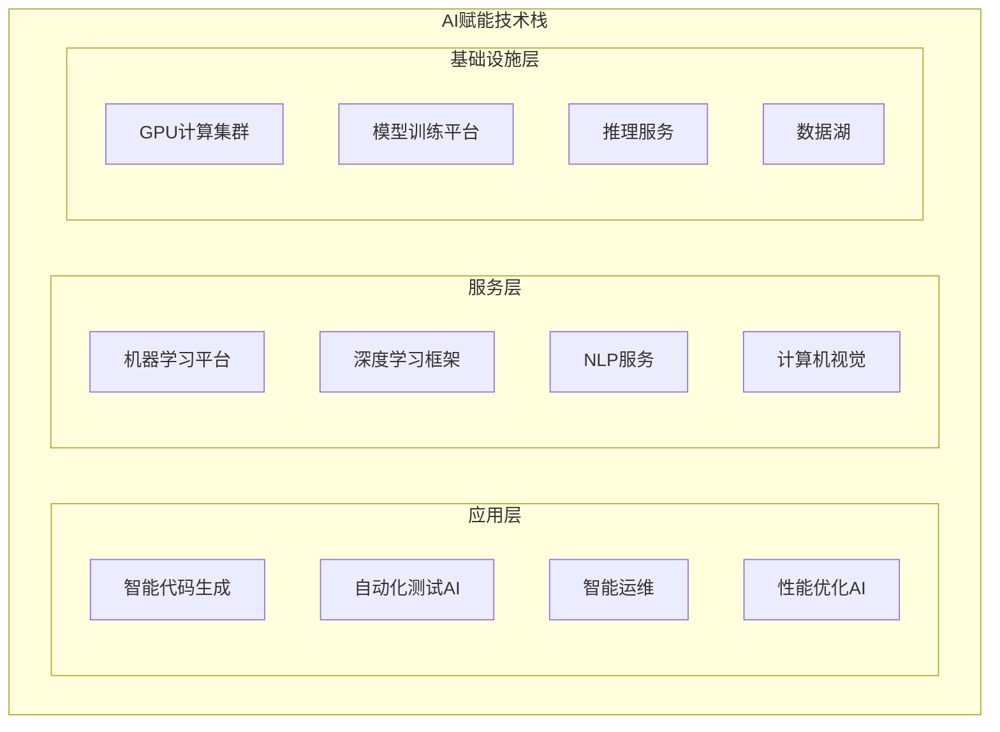
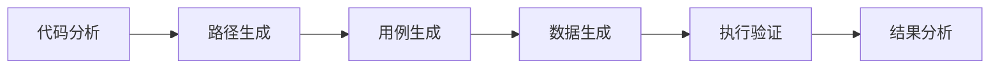
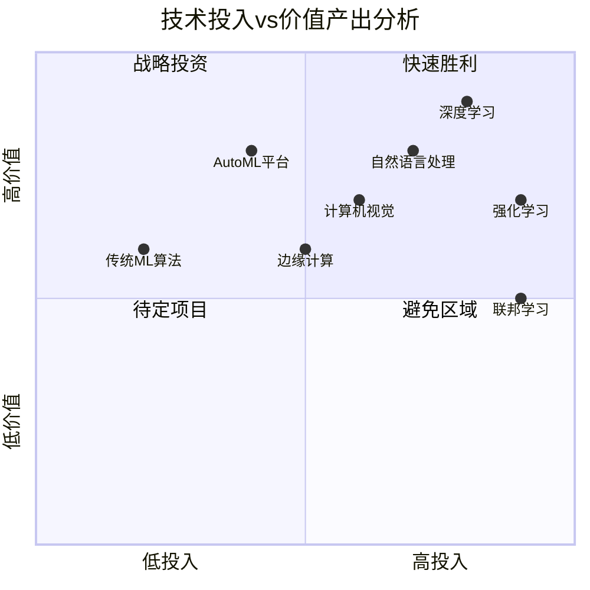

# AI赋能技术栈技术分析文档

## 文档概述

本文档针对DevOps流水线中的AI赋能技术栈进行全面技术分析，涵盖机器学习、深度学习、自然语言处理、计算机视觉、自动化测试、智能监控等核心技术领域，为技术选型和实施提供参考依据。

**创建时间**: 2025年8月24日  
**版本**: v1.0  
**适用场景**: DevOps AI赋能、技术选型、架构设计

---

## 技术栈分层架构



---

## 1. 机器学习技术栈

### 1.1 核心框架

#### Scikit-Learn
- **用法**: 传统机器学习算法实现
- **价值**: 
  - 快速原型开发
  - 数据预处理和特征工程
  - 模型评估和选择
- **应用场景**: 
  - 代码质量预测
  - 构建时间估算
  - 资源使用优化

```python
# 代码质量预测示例
from sklearn.ensemble import RandomForestRegressor
from sklearn.metrics import mean_squared_error

# 特征: 代码行数、复杂度、历史缺陷数
X = [[1000, 15, 3], [800, 12, 1], [1200, 18, 5]]
y = [0.8, 0.9, 0.6]  # 质量分数

model = RandomForestRegressor(n_estimators=100)
model.fit(X, y)
quality_prediction = model.predict([[950, 14, 2]])
```

#### XGBoost/LightGBM
- **用法**: 高性能梯度提升算法
- **价值**:
  - 处理结构化数据
  - 特征重要性分析
  - 高精度预测
- **应用场景**:
  - 构建失败预测
  - 部署风险评估
  - 性能异常检测

### 1.2 AutoML平台

#### AutoML工具对比

| 工具 | 优势 | 适用场景 | 集成难度 |
|------|------|----------|----------|
| AutoKeras | Keras生态 | 深度学习自动化 | 中等 |
| TPOT | 遗传算法优化 | 传统ML管道 | 简单 |
| H2O.ai | 企业级平台 | 大规模数据 | 复杂 |
| Azure AutoML | 云原生 | 微软生态 | 简单 |

---

## 2. 深度学习技术栈

### 2.1 主流框架

#### TensorFlow/Keras
- **用法**: 端到端深度学习开发
- **价值**:
  - 生产级部署支持
  - 丰富的预训练模型
  - 强大的生态系统
- **应用场景**:
  - 代码语义理解
  - 日志异常检测
  - 图像识别自动化

```python
# 代码缺陷检测模型
import tensorflow as tf
from tensorflow.keras import layers

model = tf.keras.Sequential([
    layers.Embedding(10000, 64),
    layers.LSTM(64, return_sequences=True),
    layers.LSTM(32),
    layers.Dense(64, activation='relu'),
    layers.Dropout(0.5),
    layers.Dense(1, activation='sigmoid')
])

model.compile(
    optimizer='adam',
    loss='binary_crossentropy',
    metrics=['accuracy']
)
```

#### PyTorch
- **用法**: 研究导向的深度学习框架
- **价值**:
  - 动态计算图
  - 灵活的模型设计
  - 强大的调试能力
- **应用场景**:
  - 自定义模型开发
  - 强化学习实验
  - 模型研究和原型

### 2.2 模型部署技术

#### TensorFlow Serving
- **部署方式**: REST/gRPC API
- **优势**: 高性能推理服务
- **配置示例**:

```yaml
# tensorflow_serving_config.yaml
model_config_list {
  config {
    name: 'code_quality_model'
    base_path: '/models/code_quality'
    model_platform: 'tensorflow'
    model_version_policy {
      latest {
        num_versions: 2
      }
    }
  }
}
```

---

## 3. 自然语言处理(NLP)技术栈

### 3.1 预训练模型

#### Transformer系列模型

| 模型 | 参数规模 | 擅长任务 | 部署复杂度 |
|------|----------|----------|------------|
| BERT | 110M-340M | 文本分类、NER | 中等 |
| GPT-3.5 | 175B | 代码生成、对话 | 高 |
| CodeBERT | 125M | 代码理解 | 中等 |
| CodeT5 | 220M | 代码生成/理解 | 中等 |

#### 应用示例

```python
# 使用CodeBERT进行代码注释生成
from transformers import RobertaTokenizer, RobertaForSequenceClassification

tokenizer = RobertaTokenizer.from_pretrained('microsoft/codebert-base')
model = RobertaForSequenceClassification.from_pretrained('microsoft/codebert-base')

def generate_comment(code):
    inputs = tokenizer(code, return_tensors='pt', truncation=True, max_length=512)
    outputs = model(**inputs)
    return outputs.logits
```

### 3.2 文本处理工具

#### spaCy vs NLTK
- **spaCy**: 
  - 优势: 速度快、工业级
  - 适用: 生产环境
  - 场景: 日志分析、文档处理
- **NLTK**:
  - 优势: 学术完整、教学友好
  - 适用: 研究开发
  - 场景: 原型验证、算法实验

---

## 4. 计算机视觉技术栈

### 4.1 图像处理框架

#### OpenCV
- **用法**: 传统计算机视觉算法
- **价值**:
  - 图像预处理
  - 特征提取
  - 实时处理
- **应用场景**:
  - UI自动化测试
  - 架构图分析
  - 截图对比

```python
# UI元素检测示例
import cv2
import numpy as np

def detect_ui_elements(screenshot_path):
    img = cv2.imread(screenshot_path)
    gray = cv2.cvtColor(img, cv2.COLOR_BGR2GRAY)
    
    # 按钮检测
    template = cv2.imread('button_template.png', 0)
    result = cv2.matchTemplate(gray, template, cv2.TM_CCOEFF_NORMED)
    locations = np.where(result >= 0.8)
    
    return list(zip(*locations[::-1]))
```

#### YOLOv8/DETR
- **用法**: 目标检测和识别
- **价值**:
  - 实时检测能力
  - 高精度识别
  - 端到端训练
- **应用场景**:
  - 界面元素识别
  - 异常状态检测
  - 自动化测试

---

## 5. 自动化测试AI技术

### 5.1 智能测试生成

#### 技术架构


#### 核心技术
- **符号执行**: 路径覆盖分析
- **模糊测试**: 边界用例生成
- **强化学习**: 测试策略优化

### 5.2 测试工具集成

#### Selenium + AI
```python
# AI增强的Web自动化测试
from selenium import webdriver
from selenium.webdriver.common.by import By
import tensorflow as tf

class AITestAutomation:
    def __init__(self):
        self.driver = webdriver.Chrome()
        self.ai_model = tf.keras.models.load_model('ui_element_detector.h5')
    
    def smart_element_finder(self, description):
        """基于自然语言描述查找页面元素"""
        screenshot = self.driver.get_screenshot_as_png()
        elements = self.ai_model.predict(screenshot)
        return self.match_description_to_element(description, elements)
```

---

## 6. 智能监控技术栈

### 6.1 异常检测算法

#### 统计方法
- **Isolation Forest**: 孤立森林算法
- **One-Class SVM**: 单类支持向量机
- **LOF**: 局部异常因子

#### 深度学习方法
- **Autoencoder**: 重构误差检测
- **LSTM**: 时序异常识别
- **GAN**: 生成对抗异常检测

### 6.2 实时监控架构

```yaml
# Prometheus + AI异常检测配置
apiVersion: v1
kind: ConfigMap
metadata:
  name: ai-anomaly-detector
data:
  config.yaml: |
    detection:
      algorithms:
        - name: "isolation_forest"
          threshold: 0.1
          features: ["cpu", "memory", "disk_io"]
        - name: "lstm_autoencoder" 
          window_size: 100
          sequence_length: 50
    alerts:
      webhook_url: "http://alertmanager:9093/api/v1/alerts"
```

---

## 7. 模型生命周期管理

### 7.1 MLOps工具链

#### 核心组件对比

| 工具 | 功能 | 优势 | 适用规模 |
|------|------|------|----------|
| MLflow | 实验追踪、模型管理 | 开源、易集成 | 中小型 |
| Kubeflow | 端到端ML流水线 | Kubernetes原生 | 大型 |
| DVC | 数据版本控制 | Git集成 | 所有规模 |
| Weights & Biases | 实验管理 | 可视化强 | 研究团队 |

### 7.2 模型版本管理

```python
# MLflow模型管理示例
import mlflow
import mlflow.sklearn
from sklearn.ensemble import RandomForestClassifier

# 实验追踪
mlflow.set_experiment("code_quality_prediction")

with mlflow.start_run():
    # 模型训练
    model = RandomForestClassifier(n_estimators=100)
    model.fit(X_train, y_train)
    
    # 记录参数和指标
    mlflow.log_param("n_estimators", 100)
    mlflow.log_metric("accuracy", accuracy_score(y_test, predictions))
    
    # 模型注册
    mlflow.sklearn.log_model(model, "code_quality_model")
```

---

## 8. 数据处理技术栈

### 8.1 大数据处理框架

#### Apache Spark
- **用法**: 分布式数据处理
- **价值**:
  - 内存计算加速
  - 统一批处理和流处理
  - 丰富的ML库
- **应用场景**:
  - 历史构建数据分析
  - 大规模日志处理
  - 特征工程

#### 流处理技术
- **Apache Kafka**: 消息队列和流处理
- **Apache Flink**: 低延迟流处理
- **Apache Storm**: 实时计算框架

### 8.2 数据存储方案

#### 时序数据库
- **InfluxDB**: 时序数据专用
- **TimescaleDB**: PostgreSQL扩展
- **Prometheus**: 监控数据存储

#### 特征存储
- **Feast**: 开源特征存储
- **Tecton**: 企业级方案
- **Hopsworks**: 端到端ML平台

---

## 9. 云原生AI技术

### 9.1 容器化部署

#### Docker + AI
```dockerfile
# AI模型服务容器
FROM tensorflow/serving:2.13.0

# 复制模型文件
COPY models/ /models/

# 配置服务
ENV MODEL_NAME=code_quality_model
ENV MODEL_BASE_PATH=/models

# 健康检查
HEALTHCHECK --interval=30s --timeout=3s \
  CMD curl -f http://localhost:8501/v1/models/code_quality_model || exit 1

EXPOSE 8501
```

#### Kubernetes集成
```yaml
apiVersion: apps/v1
kind: Deployment
metadata:
  name: ai-model-server
spec:
  replicas: 3
  selector:
    matchLabels:
      app: ai-model-server
  template:
    metadata:
      labels:
        app: ai-model-server
    spec:
      containers:
      - name: tensorflow-serving
        image: ai-model-server:latest
        ports:
        - containerPort: 8501
        resources:
          requests:
            memory: "2Gi"
            cpu: "1"
          limits:
            memory: "4Gi"
            cpu: "2"
```

### 9.2 Serverless AI

#### AWS Lambda + AI
- **优势**: 按需计费、自动扩缩容
- **限制**: 执行时间、内存限制
- **适用**: 轻量级推理任务

#### Knative Serving
- **特点**: Kubernetes原生Serverless
- **价值**: 统一容器和Serverless

---

## 10. 性能优化技术

### 10.1 模型优化

#### 量化技术
```python
# TensorFlow模型量化
import tensorflow as tf

# 动态量化
converter = tf.lite.TFLiteConverter.from_saved_model('model_path')
converter.optimizations = [tf.lite.Optimize.DEFAULT]
quantized_model = converter.convert()

# 训练后量化
def representative_dataset():
    for data in dataset.take(100):
        yield [data.numpy()]

converter.representative_dataset = representative_dataset
converter.target_spec.supported_ops = [tf.lite.OpsSet.TFLITE_BUILTINS_INT8]
```

#### 模型剪枝
- **结构化剪枝**: 移除整个神经元或层
- **非结构化剪枝**: 移除单个权重
- **渐进式剪枝**: 训练过程中逐步剪枝

### 10.2 推理加速

#### 硬件加速方案

| 硬件 | 适用模型 | 性能提升 | 成本 |
|------|----------|----------|------|
| GPU | 深度学习 | 10-100x | 高 |
| TPU | TensorFlow | 15-30x | 中高 |
| FPGA | 定制化 | 5-20x | 中 |
| 专用芯片 | 推理优化 | 20-50x | 低 |

---

## 11. 安全与隐私技术

### 11.1 模型安全

#### 对抗样本防护
```python
# 对抗训练示例
import tensorflow as tf
from cleverhans.tf2.attacks import fast_gradient_method

def adversarial_training(model, x, y):
    with tf.GradientTape() as tape:
        # 生成对抗样本
        adv_x = fast_gradient_method(model, x, 0.01, np.inf)
        
        # 混合训练
        mixed_x = tf.concat([x, adv_x], axis=0)
        mixed_y = tf.concat([y, y], axis=0)
        
        # 计算损失
        predictions = model(mixed_x)
        loss = tf.reduce_mean(tf.nn.sparse_softmax_cross_entropy_with_logits(
            labels=mixed_y, logits=predictions))
    
    return loss
```

### 11.2 隐私保护

#### 联邦学习
- **技术原理**: 分布式模型训练
- **价值**: 数据不出域
- **应用**: 多组织协作

#### 差分隐私
- **机制**: 添加噪声保护
- **平衡**: 隐私vs精度
- **标准**: ε-差分隐私

---

## 12. 技术选型决策矩阵

### 12.1 场景匹配矩阵

| 应用场景 | 推荐技术栈 | 实施复杂度 | ROI预期 |
|----------|------------|------------|---------|
| 代码生成 | GPT + Fine-tuning | 中 | 高 |
| 质量检测 | BERT + 传统ML | 低 | 中 |
| 自动化测试 | CV + NLP | 中 | 高 |
| 性能监控 | 时序分析 + 异常检测 | 低 | 中 |
| 智能运维 | 多模态AI | 高 | 高 |

### 12.2 投入产出分析



---

## 13. 实施路线图

### 13.1 分阶段实施策略

#### 第一阶段 (0-3个月): 基础建设
- [ ] 数据收集和清洗
- [ ] 基础ML模型开发
- [ ] 简单自动化工具
- [ ] 监控系统建设

#### 第二阶段 (3-6个月): 能力提升  
- [ ] 深度学习模型集成
- [ ] NLP代码分析工具
- [ ] 智能测试框架
- [ ] 异常检测系统

#### 第三阶段 (6-12个月): 高级功能
- [ ] 端到端AI流水线
- [ ] 多模态AI集成
- [ ] 强化学习优化
- [ ] 联邦学习探索

### 13.2 风险评估与缓解

| 风险类型 | 影响程度 | 发生概率 | 缓解策略 |
|----------|----------|----------|----------|
| 技术选型错误 | 高 | 中 | POC验证、专家咨询 |
| 数据质量问题 | 高 | 高 | 数据治理、质量监控 |
| 模型性能不达标 | 中 | 中 | 多方案并行、持续优化 |
| 安全隐私风险 | 高 | 低 | 安全评估、合规检查 |
| 成本超预算 | 中 | 中 | 分阶段投入、效果评估 |

---

## 14. 成功指标与KPI

### 14.1 技术指标
- **模型性能**: 准确率、召回率、F1分数
- **推理延迟**: < 100ms (在线服务)
- **资源利用**: CPU/GPU/内存使用率
- **可用性**: 99.9% SLA保障

### 14.2 业务指标
- **效率提升**: 开发周期缩短30%
- **质量改善**: 缺陷率降低50%
- **成本节约**: 运维成本降低40%  
- **用户满意度**: NPS > 70

---

## 15. 总结与展望

### 15.1 核心价值总结
1. **技术栈全面性**: 覆盖AI赋能的各个技术领域
2. **实用性导向**: 面向DevOps实际应用场景
3. **渐进式实施**: 分阶段推进，风险可控
4. **可量化效果**: 明确的成功指标和ROI预期

### 15.2 未来发展趋势
- **大模型集成**: GPT、Claude等大模型在DevOps中的应用
- **多模态融合**: 文本、代码、图像等多模态AI能力
- **边缘AI**: 将AI能力推向边缘设备和环境
- **AutoAI**: 自动化机器学习和模型优化
- **可解释AI**: 提高AI决策的透明度和可信度

### 15.3 行动建议
1. **立即行动**: 从简单场景开始试点
2. **团队建设**: 培养AI+DevOps复合型人才
3. **技术储备**: 建立AI技术能力中心
4. **生态合作**: 与AI厂商建立战略合作
5. **持续优化**: 建立AI模型的持续集成和部署流程

---

**文档状态**: ✅ 完成  
**最后更新**: 2025年8月24日  
**审核状态**: 待审核  
**维护者**: DevOps团队
