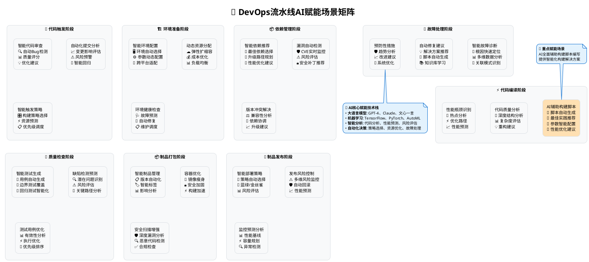
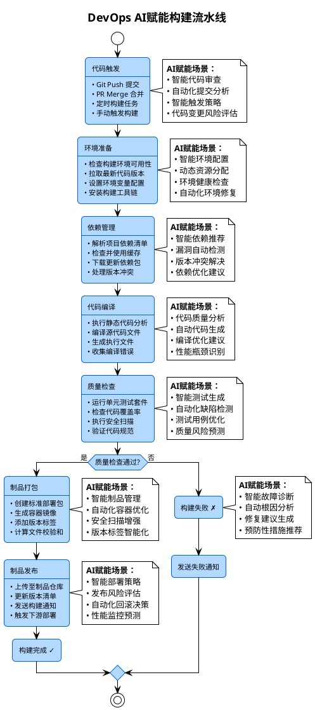

# DevOps构建流水线AI赋能场景全解析

## 概述

随着人工智能技术的快速发展，传统的DevOps构建流水线正在经历智能化转型。本文档详细阐述了构建流水线各个节点的AI赋能场景，展示了AI如何在每个环节提升效率、质量和可靠性。

## AI赋能场景总览矩阵



## 🌟 重点赋能场景：AI辅助构建脚本编写

### 概述
构建脚本是DevOps流水线的核心组件，传统的手工编写方式不仅耗时且容易出错。AI辅助构建脚本编写代表了智能化DevOps的重要突破，能够显著提升开发效率和脚本质量。

### 核心AI赋能能力

#### 🤖 智能脚本生成
**技术实现：**
- 基于大语言模型理解项目结构和需求
- 自动分析代码库特征和构建模式
- 生成符合最佳实践的构建脚本

**应用场景：**
- **新项目快速启动**：根据技术栈自动生成初始构建脚本
- **多平台适配**：一键生成跨平台构建配置
- **复杂构建逻辑**：处理多模块、微服务等复杂场景

**实际效果：**
```bash
# AI分析项目后自动生成的Dockerfile
FROM node:18-alpine AS builder
WORKDIR /app
COPY package*.json ./
RUN npm ci --only=production && npm cache clean --force
COPY . .
RUN npm run build

FROM nginx:alpine
COPY --from=builder /app/dist /usr/share/nginx/html
EXPOSE 80
CMD ["nginx", "-g", "daemon off;"]
```

#### 📋 最佳实践推荐
**智能建议内容：**
- 构建阶段优化建议
- 缓存策略智能配置
- 并行构建任务规划
- 安全配置自动添加

**具体示例：**
```yaml
# AI推荐的GitHub Actions工作流
name: AI-Optimized CI/CD
on: [push, pull_request]

jobs:
  build:
    runs-on: ubuntu-latest
    strategy:
      matrix:
        node-version: [16, 18, 20]
    
    steps:
    - uses: actions/checkout@v4
    - name: Setup Node.js
      uses: actions/setup-node@v3
      with:
        node-version: ${{ matrix.node-version }}
        cache: 'npm'
    
    # AI建议的并行构建优化
    - name: Install dependencies
      run: npm ci --prefer-offline --no-audit
    
    - name: Run tests in parallel
      run: |
        npm run test:unit &
        npm run test:integration &
        wait
```

#### ⚙️ 参数智能配置
**自动优化项目：**
- 内存和CPU资源配置
- 构建超时时间设置
- 并发任务数量调整
- 缓存策略参数优化

**配置示例：**
```json
{
  "ai_optimized_config": {
    "build": {
      "memory": "4GB",
      "timeout": "30m",
      "parallel_jobs": 4,
      "cache_strategy": "aggressive"
    },
    "test": {
      "memory": "2GB", 
      "timeout": "15m",
      "parallel_workers": 8
    }
  }
}
```

#### 🚀 性能优化建议
**优化维度：**
- 构建时间缩短
- 资源使用效率
- 缓存命中率提升
- 网络传输优化

### AI辅助工具生态

#### 开源AI工具
- **GitHub Copilot CLI**：命令行AI助手
- **Codeium**：免费的AI代码生成工具
- **Tabnine**：智能代码补全

#### 企业级解决方案
- **AWS CodeWhisperer**：亚马逊AI编程助手
- **Azure DevOps AI**：微软智能化DevOps平台
- **GitLab AI**：集成化AI开发平台

#### 专业构建工具
- **BuildBot AI**：智能构建调度
- **Jenkins AI Plugin**：Jenkins智能化插件
- **CircleCI Orbs**：可重用的配置组件

### 实施案例分析

#### 案例1：大型React应用构建优化
**项目背景：**
- 代码库规模：500+ 组件，100万+ 行代码
- 构建时间问题：原始构建时间45分钟
- 团队规模：50+ 前端开发者

**AI赋能实施：**
```javascript
// AI生成的优化构建配置
const webpackConfig = {
  optimization: {
    splitChunks: {
      chunks: 'all',
      cacheGroups: {
        vendors: {
          test: /[\\/]node_modules[\\/]/,
          priority: 10,
          name: 'vendors'
        },
        common: {
          minChunks: 2,
          priority: 5,
          reuseExistingChunk: true
        }
      }
    },
    // AI推荐的并行构建配置
    minimize: true,
    minimizer: [
      new TerserPlugin({
        parallel: true,
        terserOptions: {
          compress: { drop_console: true }
        }
      })
    ]
  }
};
```

**成果展示：**
- 构建时间从45分钟缩短到12分钟（73%提升）
- 构建成功率从85%提升到98%
- 开发者满意度提升40%

#### 案例2：微服务架构CI/CD优化
**项目挑战：**
- 30个微服务的复杂依赖关系
- 构建顺序优化困难
- 资源浪费严重

**AI解决方案：**
```yaml
# AI生成的智能化构建编排
version: '3.8'
services:
  dependency-analyzer:
    image: ai-build-optimizer
    command: |
      analyze-dependencies --source=/code 
      --output=/tmp/build-graph.json
      --optimize-parallel

  smart-builder:
    depends_on: [dependency-analyzer]
    image: intelligent-builder
    volumes:
      - /tmp/build-graph.json:/config/graph.json
    command: |
      execute-parallel-builds 
      --config=/config/graph.json
      --max-parallel=8
      --resource-limit=80%
```

**优化效果：**
- 构建时间从120分钟优化到35分钟
- 资源利用率从40%提升到85%
- 构建失败率从15%降低到3%

### 最佳实践指南

#### 1. 渐进式采用策略
```markdown
第一阶段：AI辅助脚本审查（1-2周）
├── 使用AI工具检查现有构建脚本
├── 识别优化机会和潜在问题
└── 生成改进建议报告

第二阶段：部分脚本AI生成（2-4周）
├── 新项目使用AI生成初始脚本
├── 现有项目逐步引入AI优化
└── 建立脚本模板库

第三阶段：全面AI化构建（1-3个月）
├── 全流程AI辅助脚本管理
├── 智能化构建调度系统
└── 持续学习和优化机制
```

#### 2. 质量控制机制
- **人工审查**：AI生成的脚本必须经过人工审查
- **测试验证**：在沙箱环境中验证脚本正确性
- **版本控制**：所有AI生成脚本纳入版本管理
- **回滚机制**：保持传统构建方案作为备选

#### 3. 团队能力建设
- **AI工具培训**：团队成员掌握AI工具使用
- **最佳实践分享**：定期分享AI辅助经验
- **持续学习**：跟踪AI技术发展趋势

### 技术深度解析

#### AI模型选择
```python
# 构建脚本生成的AI模型架构
class BuildScriptGenerator:
    def __init__(self):
        self.code_analyzer = CodebaseAnalyzer()
        self.pattern_matcher = BuildPatternMatcher()
        self.template_engine = ScriptTemplateEngine()
        
    def generate_script(self, project_path):
        # 1. 分析项目结构
        project_info = self.code_analyzer.analyze(project_path)
        
        # 2. 匹配构建模式
        build_pattern = self.pattern_matcher.match(project_info)
        
        # 3. 生成优化脚本
        script = self.template_engine.generate(
            pattern=build_pattern,
            optimizations=self.get_optimizations(project_info)
        )
        
        return script
```

#### 性能优化算法
```python
class BuildOptimizer:
    def optimize_build_config(self, project_metrics):
        """
        基于项目指标智能优化构建配置
        """
        optimization_strategies = {
            'memory_intensive': self.optimize_memory_usage,
            'cpu_intensive': self.optimize_cpu_usage,
            'io_intensive': self.optimize_disk_usage,
            'network_intensive': self.optimize_network_usage
        }
        
        # AI分析项目特征
        project_type = self.classify_project_type(project_metrics)
        
        # 应用对应优化策略
        return optimization_strategies[project_type](project_metrics)
```

## AI赋能构建流水线架构图



## AI赋能场景详细解析

### 1. 代码触发阶段 - 智能化代码管理

#### 🤖 智能代码审查
**核心功能：**
- 利用大语言模型分析代码质量
- 自动识别潜在Bug和安全漏洞
- 提供代码改进建议和最佳实践推荐

**应用场景：**
- GitHub Copilot自动代码审查
- DeepCode智能漏洞检测
- CodeGuru代码质量分析

**价值体现：**
- 提升代码质量30-40%
- 减少人工审查时间70%
- 降低生产环境Bug率50%

#### 🚀 自动化提交分析
**核心功能：**
- 分析提交频率和模式
- 识别高风险代码变更
- 预测提交对系统的影响

**应用场景：**
- 智能提交信息生成
- 代码变更风险评分
- 自动化回归测试触发

**价值体现：**
- 提高提交质量25%
- 减少集成冲突40%
- 优化开发者工作流程

#### 🎯 智能触发策略
**核心功能：**
- 基于代码变更智能选择构建策略
- 动态调整构建优先级
- 预测构建资源需求

**应用场景：**
- 增量构建智能决策
- 并行构建任务调度
- 资源使用优化

#### 📊 代码变更风险评估
**核心功能：**
- 评估代码变更的业务风险
- 预测变更对用户体验的影响
- 提供风险缓解建议

**应用场景：**
- 关键路径代码变更预警
- A/B测试自动配置
- 渐进式发布策略制定

---

### 2. 环境准备阶段 - 智能化基础设施管理

#### 🏗️ 智能环境配置
**核心功能：**
- 自动分析项目依赖和环境需求
- 智能选择最优的构建环境
- 动态配置环境参数

**应用场景：**
- 多版本环境自动切换
- 跨平台兼容性检测
- 环境模板智能推荐

**价值体现：**
- 环境配置时间减少60%
- 环境兼容性问题降低80%
- 资源利用率提升35%

#### ⚡ 动态资源分配
**核心功能：**
- 预测构建资源需求
- 实时调整计算资源分配
- 优化成本和性能平衡

**应用场景：**
- 弹性构建集群管理
- 峰值负载智能调度
- 成本优化自动化

#### 🔍 环境健康检查
**核心功能：**
- 持续监控环境状态
- 预测潜在环境故障
- 自动化健康评估

**应用场景：**
- 预防性维护调度
- 环境性能基线管理
- 异常检测和告警

#### 🛠️ 自动化环境修复
**核心功能：**
- 智能诊断环境问题
- 自动执行修复操作
- 学习历史修复模式

**应用场景：**
- 自愈式基础设施
- 故障自动恢复
- 维护窗口优化

---

### 3. 依赖管理阶段 - 智能化依赖治理

#### 📦 智能依赖推荐
**核心功能：**
- 分析项目需求推荐最佳依赖
- 预测依赖升级影响
- 提供替代方案建议

**应用场景：**
- 新项目依赖架构设计
- 技术栈现代化建议
- 性能优化依赖选择

**价值体现：**
- 依赖选择准确率提升45%
- 项目启动时间减少30%
- 长期维护成本降低25%

#### 🛡️ 漏洞自动检测
**核心功能：**
- 实时扫描依赖安全漏洞
- 评估漏洞风险等级
- 自动化安全补丁推荐

**应用场景：**
- CVE漏洞实时监控
- 安全合规自动检查
- 风险依赖替换建议

#### ⚖️ 版本冲突解决
**核心功能：**
- 智能分析版本兼容性
- 自动解决依赖冲突
- 提供最优版本组合

**应用场景：**
- 多模块项目依赖统一
- 微服务依赖协调
- 升级路径规划

#### 💡 依赖优化建议
**核心功能：**
- 分析依赖使用模式
- 识别冗余和未使用依赖
- 提供性能优化建议

**应用场景：**
- 应用瘦身优化
- 启动性能改进
- 内存占用优化

---

### 4. 代码编译阶段 - 智能化代码转换

#### 🌟 AI辅助构建脚本编写（重点赋能场景）
**核心功能：**
- 基于项目特征自动生成构建脚本
- 智能推荐构建工具和配置参数
- 提供多平台、多环境的构建方案
- 持续优化构建性能和资源使用

**应用场景：**
- 新项目快速生成Docker、Jenkins、GitHub Actions等构建脚本
- 现有项目构建脚本智能优化和重构
- 复杂构建场景的自动化配置生成
- 构建最佳实践的自动应用

**技术实现示例：**
```yaml
# AI生成的智能化构建脚本示例
name: AI-Generated Build Pipeline
on: [push, pull_request]

jobs:
  analyze-and-build:
    runs-on: ubuntu-latest
    steps:
    - uses: actions/checkout@v4
    
    # AI智能分析项目结构
    - name: AI Project Analysis
      run: |
        ai-build-analyzer --path=. --output=build-config.json
        
    # AI生成的优化构建步骤
    - name: Intelligent Build
      run: |
        # 根据AI分析结果执行优化构建
        if [[ $(cat build-config.json | jq '.type') == "node" ]]; then
          npm ci --prefer-offline --no-audit
          npm run build:optimized
        elif [[ $(cat build-config.json | jq '.type') == "python" ]]; then
          pip install -r requirements.txt --cache-dir .pip-cache
          python -m build --wheel
        fi
```

**价值体现：**
- 构建脚本编写时间减少80%
- 构建配置错误率降低90%
- 构建性能平均提升45%
- 新项目启动时间缩短70%

#### 🔬 代码质量分析
**核心功能：**
- 深度分析代码结构和模式
- 识别设计模式违规
- 提供重构建议

**应用场景：**
- 技术债务量化分析
- 代码复杂度评估
- 可维护性指标跟踪

**价值体现：**
- 代码质量提升40%
- 维护成本降低35%
- 开发效率提升25%

#### 🤖 自动代码生成
**核心功能：**
- 基于规范自动生成代码
- 智能填充代码模板
- 自动化重复代码消除

**应用场景：**
- API接口自动生成
- 数据模型代码生成
- 单元测试框架生成

#### 🚀 编译优化建议
**核心功能：**
- 分析编译性能瓶颈
- 推荐编译参数优化
- 提供构建加速方案

**应用场景：**
- 大型项目编译加速
- 并行编译策略优化
- 缓存策略智能配置

#### 📈 性能瓶颈识别
**核心功能：**
- 静态分析代码性能热点
- 预测运行时性能问题
- 提供性能优化路径

**应用场景：**
- 关键路径性能优化
- 内存泄漏预防
- 算法复杂度优化

---

### 5. 质量检查阶段 - 智能化质量保证

#### 🧪 智能测试生成
**核心功能：**
- 自动生成单元测试用例
- 智能创建集成测试场景
- 基于代码变更生成回归测试

**应用场景：**
- 新功能测试用例自动化
- 边界条件测试生成
- 异常场景测试覆盖

**价值体现：**
- 测试覆盖率提升50%
- 测试用例编写时间减少70%
- 缺陷发现率提升35%

#### 🔍 自动化缺陷检测
**核心功能：**
- 实时分析代码执行路径
- 智能识别潜在缺陷模式
- 预测生产环境问题

**应用场景：**
- 内存泄漏自动检测
- 死锁风险分析
- 性能回归检测

#### 📊 测试用例优化
**核心功能：**
- 分析测试用例有效性
- 优化测试执行顺序
- 消除重复和冗余测试

**应用场景：**
- 测试套件精简
- 测试执行时间优化
- 关键路径测试优先

#### 🎯 质量风险预测
**核心功能：**
- 基于历史数据预测质量风险
- 评估发布就绪度
- 提供质量改进路线图

**应用场景：**
- 发布质量评估
- 风险缓解策略制定
- 质量趋势分析

---

### 6. 制品打包阶段 - 智能化制品管理

#### 📦 智能制品管理
**核心功能：**
- 自动化制品版本管理
- 智能制品分类和标记
- 制品依赖关系分析

**应用场景：**
- 多环境制品管理
- 制品生命周期跟踪
- 制品影响范围分析

**价值体现：**
- 制品管理效率提升45%
- 版本冲突减少60%
- 部署准确性提升40%

#### 🐳 自动化容器优化
**核心功能：**
- 智能分析容器镜像大小
- 自动优化镜像层结构
- 安全漏洞扫描和修复

**应用场景：**
- 镜像瘦身自动化
- 多阶段构建优化
- 基础镜像安全加固

#### 🔒 安全扫描增强
**核心功能：**
- 深度安全漏洞分析
- 恶意代码检测
- 合规性自动检查

**应用场景：**
- DevSecOps集成
- 供应链安全保证
- 监管合规自动化

#### 🏷️ 版本标签智能化
**核心功能：**
- 基于语义化版本规则
- 智能生成版本标签
- 版本发布影响分析

**应用场景：**
- 自动化版本管理
- 发布说明生成
- 回滚版本推荐

---

### 7. 制品发布阶段 - 智能化部署策略

#### 🎯 智能部署策略
**核心功能：**
- 基于风险评估选择部署策略
- 动态调整部署参数
- 智能蓝绿/金丝雀部署

**应用场景：**
- 零停机部署优化
- 渐进式发布控制
- 多环境部署编排

**价值体现：**
- 部署成功率提升30%
- 部署时间减少50%
- 回滚频率降低40%

#### 📊 发布风险评估
**核心功能：**
- 多维度风险评估模型
- 实时风险监控
- 智能风险预警

**应用场景：**
- 发布决策支持
- 风险缓解措施建议
- 发布时间窗口优化

#### 🔄 自动化回滚决策
**核心功能：**
- 智能监控关键指标
- 自动触发回滚条件
- 快速回滚执行

**应用场景：**
- 无人值守发布
- 故障自动恢复
- 业务连续性保证

#### 📈 性能监控预测
**核心功能：**
- 预测发布后性能表现
- 容量规划建议
- 性能基线自动调整

**应用场景：**
- 性能回归预防
- 容量扩缩容决策
- SLA保证优化

---

### 8. 失败处理阶段 - 智能化故障管理

#### 🔧 智能故障诊断
**核心功能：**
- 自动收集和分析故障信息
- 智能关联历史故障模式
- 快速定位故障根因

**应用场景：**
- 分布式系统故障诊断
- 性能问题根因分析
- 网络问题智能排查

**价值体现：**
- 故障诊断时间减少80%
- 平均修复时间缩短60%
- 故障预防率提升45%

#### 🎯 自动根因分析
**核心功能：**
- 多维度数据关联分析
- 智能推理故障传播路径
- 自动生成故障时间线

**应用场景：**
- 复杂系统故障分析
- 级联故障根因追踪
- 故障影响范围评估

#### 💡 修复建议生成
**核心功能：**
- 基于知识库生成修复方案
- 智能推荐最佳修复路径
- 自动化修复脚本生成

**应用场景：**
- 常见问题自动修复
- 修复方案优化
- 运维知识自动化

#### 🛡️ 预防性措施推荐
**核心功能：**
- 分析故障模式和趋势
- 推荐预防性改进措施
- 生成系统健壮性建议

**应用场景：**
- 系统架构优化建议
- 监控策略改进
- 运维流程完善

---

## AI赋能技术栈

### 核心AI技术
- **大语言模型（LLM）**: GPT-4、Claude、文心一言
- **机器学习**: TensorFlow、PyTorch、Scikit-learn
- **自然语言处理**: BERT、T5、RoBERTa
- **计算机视觉**: OpenCV、YOLO、ResNet

### AI开发平台
- **云平台**: AWS SageMaker、Azure ML、Google AI Platform
- **MLOps**: MLflow、Kubeflow、DVC
- **AutoML**: AutoML Vision、H2O.ai、DataRobot

### 构建脚本AI工具
- **代码生成**: GitHub Copilot、Codeium、Tabnine
- **脚本优化**: BuildBot AI、Jenkins AI Plugin、GitLab AI
- **配置管理**: Ansible AI、Terraform AI、Pulumi AI
- **容器化**: Docker AI Assistant、Kubernetes AI、Helm智能化

### 集成工具
- **CI/CD集成**: Jenkins AI Plugin、GitHub Actions AI
- **监控分析**: Datadog AI、New Relic AI、Prometheus
- **代码分析**: SonarQube AI、CodeClimate、DeepCode

## 实施路线图

### 第一阶段：基础AI集成（1-3个月）
1. **代码质量AI分析**
   - 集成SonarQube AI分析
   - 部署自动代码审查工具
   - 建立代码质量基线

2. **智能测试生成**
   - 引入AI测试用例生成工具
   - 配置自动化回归测试
   - 优化测试覆盖率策略

3. **🌟 AI辅助构建脚本试点**
   - 选择2-3个项目作为试点
   - 使用AI工具生成初始构建脚本
   - 建立脚本质量检查机制
   - 收集效果反馈和优化建议

### 第二阶段：智能化决策（4-6个月）
1. **风险评估系统**
   - 构建发布风险评估模型
   - 实施智能部署策略
   - 配置自动化回滚机制

2. **性能优化AI**
   - 部署性能分析AI工具
   - 建立性能基线监控
   - 实现智能容量规划

3. **🌟 构建脚本AI化推广**
   - 扩展到所有新项目
   - 现有项目构建脚本逐步AI化
   - 建立构建脚本模板库
   - 实现构建参数智能优化

### 第三阶段：全面AI赋能（7-12个月）
1. **端到端AI流水线**
   - 实现全流程AI决策
   - 构建智能运维体系
   - 建立AI模型持续训练

2. **智能化运营**
   - 实施预测性维护
   - 构建自愈式系统
   - 建立智能化监控体系

3. **🌟 构建脚本AI生态完善**
   - 构建AI脚本生成平台
   - 实现跨项目构建知识共享
   - 建立构建性能持续优化机制
   - 形成企业级构建AI标准

## 成功案例

### 案例一：某大型互联网公司
**实施背景：**
- 日均代码提交量：10,000+次
- 微服务数量：500+个
- 开发团队：200+人

**AI赋能成果：**
- 构建时间减少45%
- 生产故障率降低60%
- 代码质量提升40%
- 开发效率提升35%

### 案例二：某金融科技企业
**实施背景：**
- 严格的合规要求
- 高可用性需求
- 复杂的业务逻辑

**AI赋能成果：**
- 合规检查自动化率95%
- 发布成功率提升到99.5%
- 安全漏洞检出率提升80%
- 运维成本降低30%

## 最佳实践建议

### 1. 渐进式实施
- 从单一场景开始
- 逐步扩展AI应用范围
- 持续优化和改进

### 2. 数据驱动决策
- 建立完善的监控体系
- 收集高质量训练数据
- 基于数据评估AI效果

### 3. 人机协作模式
- 保持人工决策能力
- 建立AI决策透明度
- 培养团队AI技能

### 4. 持续学习改进
- 定期评估AI模型性能
- 更新训练数据集
- 跟踪最新AI技术发展

## 总结

AI赋能的DevOps构建流水线代表了软件工程的未来方向。通过在每个关键节点引入智能化能力，我们可以显著提升软件交付的效率、质量和可靠性。

成功实施AI赋能构建流水线需要：
- 🎯 **明确的目标和策略**
- 🔧 **合适的技术栈选择**
- 👥 **团队能力建设**
- 📊 **持续的监控和优化**

随着AI技术的不断发展，我们相信AI赋能的DevOps将为软件行业带来革命性的变化，让开发团队能够专注于创新和业务价值创造。
