# DevOps构建阶段详解 🔨

> **构建阶段是连接开发与测试的关键桥梁**  
> 将源代码转换为可部署的制品，确保质量与一致性

## 📋 目录

- [构建阶段概述](#-构建阶段概述)
- [构建流程详解](#-构建流程详解)
- [构建工具链分析](#-构建工具链分析)
- [构建策略与模式](#-构建策略与模式)
- [质量门控与检查](#-质量门控与检查)
- [制品管理](#-制品管理)
- [性能优化](#-性能优化)
- [最佳实践](#-最佳实践)
- [故障排查](#-故障排查)

## 🎯 构建阶段概述

### 定义与目标

构建（Build）阶段是DevOps流水线中的核心环节，主要目标包括：

- **🔧 代码编译**: 将源代码转换为可执行代码
- **📦 制品打包**: 生成标准化的部署制品
- **✅ 质量检查**: 执行静态分析、安全扫描
- **🏷️ 版本管理**: 为制品分配版本号和标签
- **📚 文档生成**: 自动生成API文档和部署说明

### 构建阶段在DevOps中的定位

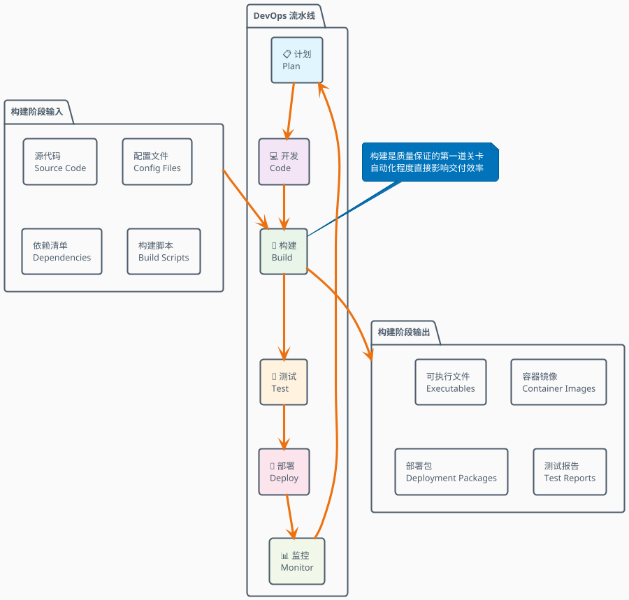

## 🔄 构建流程详解

### 完整构建流水线

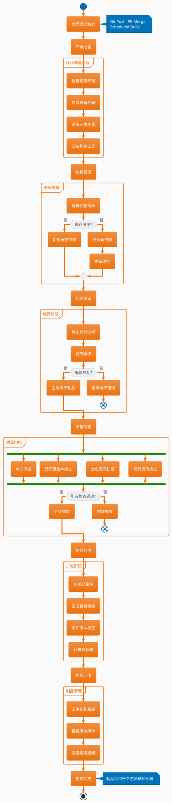

### 构建触发机制

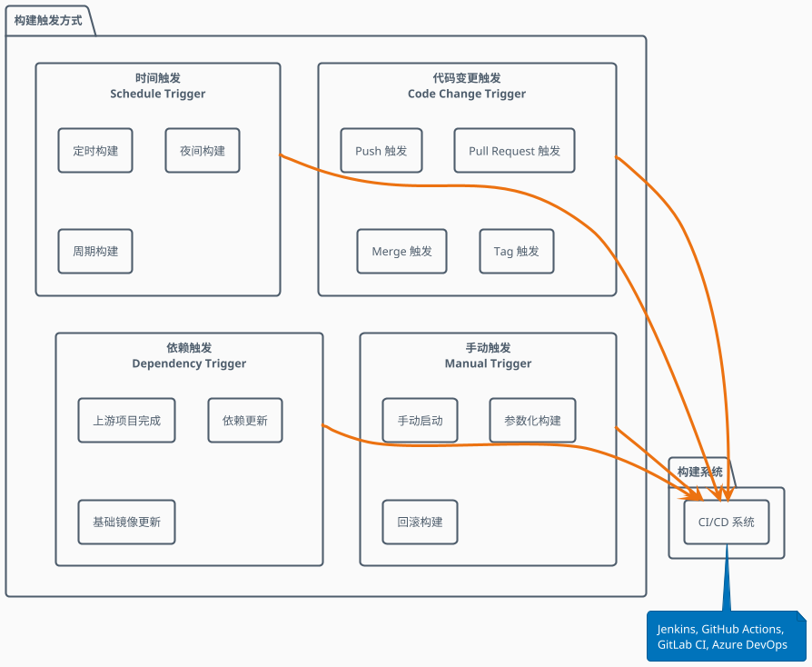

## 🛠️ 构建工具链分析

### 构建工具生态全景图

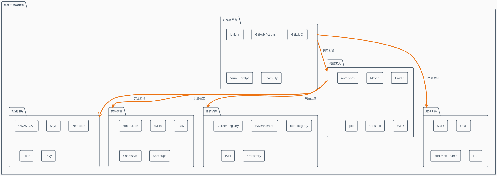

### 主流构建工具对比分析

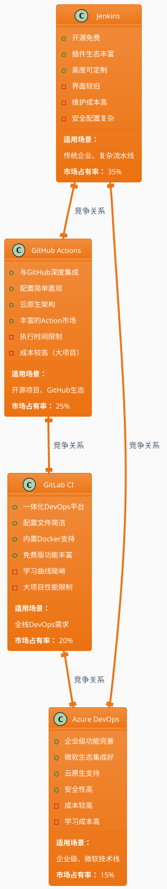

### 语言特定构建工具链

```plantuml
@startuml Language_Specific_Tools
!theme aws-orange
skinparam backgroundColor #FAFAFA

package "多语言构建工具链" {
    
    package "Java生态" as java {
        rectangle "Maven" as maven
        rectangle "Gradle" as gradle  
        rectangle "Ant" as ant
        
        note bottom of maven : 依赖管理、生命周期\n插件生态丰富
        note bottom of gradle : 灵活构建脚本\n增量编译优化
        note bottom of ant : 传统构建工具\n灵活但复杂
    }
    
    package "JavaScript生态" as js {
        rectangle "npm" as npm
        rectangle "Yarn" as yarn
        rectangle "Webpack" as webpack
        rectangle "Vite" as vite
        
        note bottom of npm : 包管理和基础构建\n生态最丰富
        note bottom of yarn : 更快的依赖解析\n工作空间支持
        note bottom of webpack : 模块打包器\n前端构建标准
        note bottom of vite : 现代构建工具\n极快的热更新
    }
    
    package "Python生态" as python {
        rectangle "pip" as pip
        rectangle "Poetry" as poetry
        rectangle "setuptools" as setuptools
        
        note bottom of pip : 标准包管理器\n简单直接
        note bottom of poetry : 现代依赖管理\n虚拟环境集成
        note bottom of setuptools : 传统打包工具\n分发支持
    }
    
    package "Go生态" as golang {
        rectangle "go build" as go_build
        rectangle "go mod" as go_mod
        
        note bottom of go_build : 内置构建工具\n零依赖编译
        note bottom of go_mod : 模块化管理\nvendor支持
    }
    
    package "C/C++生态" as cpp {
        rectangle "Make" as make
        rectangle "CMake" as cmake
        rectangle "Bazel" as bazel
        
        note bottom of make : 传统构建工具\n平台通用
        note bottom of cmake : 跨平台构建\n现代化配置
        note bottom of bazel : 谷歌开源\n大规模构建优化
    }
}

@enduml
```

## 🎯 构建策略与模式

### 构建策略选择决策树

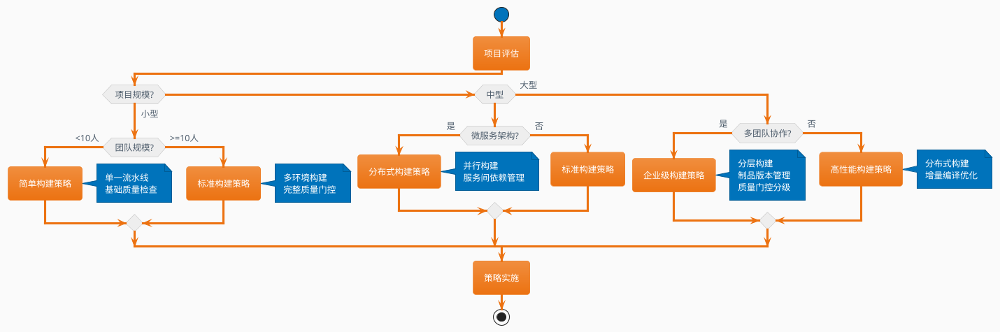

### 增量构建与并行构建

```plantuml
@startuml Incremental_And_Parallel_Build
!theme aws-orange
skinparam backgroundColor #FAFAFA

package "构建优化策略" {
    
    package "增量构建 (Incremental Build)" as incremental {
        rectangle "变更检测" as change_detection {
            note bottom : 检测文件变更\n只构建修改部分
        }
        rectangle "依赖分析" as dependency_analysis {
            note bottom : 分析模块依赖关系\n确定构建顺序
        }
        rectangle "缓存机制" as cache_mechanism {
            note bottom : 缓存构建结果\n避免重复构建
        }
        
        change_detection --> dependency_analysis
        dependency_analysis --> cache_mechanism
    }
    
    package "并行构建 (Parallel Build)" as parallel {
        rectangle "任务分解" as task_decomposition {
            note bottom : 将构建任务分解\n识别并行机会
        }
        rectangle "资源分配" as resource_allocation {
            note bottom : 合理分配构建资源\n避免资源竞争
        }
        rectangle "结果合并" as result_merge {
            note bottom : 合并并行构建结果\n保证一致性
        }
        
        task_decomposition --> resource_allocation
        resource_allocation --> result_merge
    }
    
    package "性能效果" as performance {
        rectangle "构建时间\n减少 60-80%" as build_time
        rectangle "资源利用\n提升 200-300%" as resource_usage
        rectangle "开发效率\n提升 40-60%" as dev_efficiency
    }
}

incremental --> performance
parallel --> performance

note top of incremental : 适用于大型单体应用\n频繁小改动场景
note top of parallel : 适用于微服务架构\n多模块项目

@enduml
```

### 构建环境管理

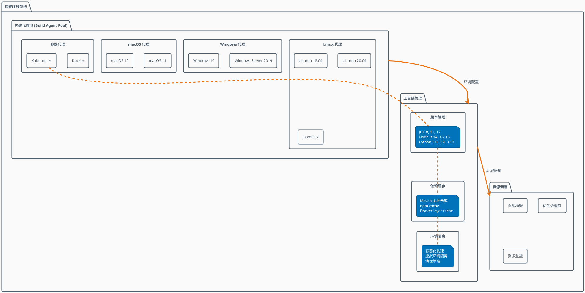

## ✅ 质量门控与检查

### 质量门控流程

```plantuml
@startuml Quality_Gates
!theme aws-orange
skinparam backgroundColor #FAFAFA

start

:代码提交;

partition "静态代码分析" {
    :语法检查;
    :代码规范检查;
    :复杂度分析;
    :重复代码检测;
    
    if (静态分析通过?) then (否)
        :记录问题;
        :通知开发者;
        end
    else (是)
        :继续下一步;
    endif
}

partition "安全扫描" {
    fork
        :依赖漏洞扫描;
    fork again
        :敏感信息检测;
    fork again
        :许可证合规检查;
    end fork
    
    if (安全扫描通过?) then (否)
        :生成安全报告;
        :阻止构建;
        end
    else (是)
        :继续构建;
    endif
}

partition "单元测试" {
    :执行单元测试;
    :生成覆盖率报告;
    :检查测试结果;
    
    if (测试通过 && 覆盖率达标?) then (否)
        :生成测试报告;
        :构建失败;
        end
    else (是)
        :测试通过;
    endif
}

partition "构建验证" {
    :编译代码;
    :打包制品;
    :基础功能测试;
    
    if (构建成功?) then (否)
        :记录构建错误;
        end
    else (是)
        :构建成功;
    endif
}

:质量门控通过;
:制品发布;

stop

note right of "静态代码分析" : SonarQube\nESLint\nPMD
note right of "安全扫描" : Snyk\nOWASP ZAP\nTrivy
note right of "单元测试" : JUnit\nJest\npytest

@enduml
```

### 质量度量指标体系

```plantuml
@startuml Quality_Metrics
!theme aws-orange
skinparam backgroundColor #FAFAFA

package "质量度量体系" {
    
    package "代码质量指标" as code_quality {
        rectangle "技术债务比率\nTechnical Debt Ratio" as tech_debt {
            note bottom : 目标: < 5%\n修复成本 vs 开发成本
        }
        rectangle "代码覆盖率\nCode Coverage" as coverage {
            note bottom : 目标: > 80%\n行覆盖 + 分支覆盖
        }
        rectangle "圈复杂度\nCyclomatic Complexity" as complexity {
            note bottom : 目标: < 10\n函数复杂度评估
        }
        rectangle "代码重复率\nCode Duplication" as duplication {
            note bottom : 目标: < 3%\n重复代码块检测
        }
    }
    
    package "安全质量指标" as security_quality {
        rectangle "高危漏洞数\nCritical Vulnerabilities" as critical_vuln {
            note bottom : 目标: 0个\n阻止发布标准
        }
        rectangle "中危漏洞数\nHigh Vulnerabilities" as high_vuln {
            note bottom : 目标: < 5个\n修复计划要求
        }
        rectangle "依赖漏洞率\nDependency Vuln Rate" as dep_vuln {
            note bottom : 目标: < 2%\n第三方组件风险
        }
    }
    
    package "构建质量指标" as build_quality {
        rectangle "构建成功率\nBuild Success Rate" as build_success {
            note bottom : 目标: > 95%\n稳定性指标
        }
        rectangle "构建时间\nBuild Duration" as build_time {
            note bottom : 目标: < 10分钟\n效率指标
        }
        rectangle "构建频率\nBuild Frequency" as build_freq {
            note bottom : 目标: > 5次/天\n活跃度指标
        }
    }
    
    package "测试质量指标" as test_quality {
        rectangle "测试通过率\nTest Pass Rate" as test_pass {
            note bottom : 目标: > 98%\n质量保障指标
        }
        rectangle "测试执行时间\nTest Duration" as test_time {
            note bottom : 目标: < 5分钟\n反馈速度指标
        }
        rectangle "缺陷检出率\nDefect Detection Rate" as defect_rate {
            note bottom : 目标: > 90%\n测试有效性指标
        }
    }
}

code_quality --> build_quality : 影响构建质量
security_quality --> build_quality : 安全门控
test_quality --> build_quality : 测试验证

@enduml
```

## 📦 制品管理

### 制品生命周期管理

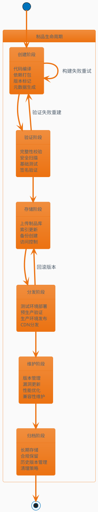

### 制品仓库架构

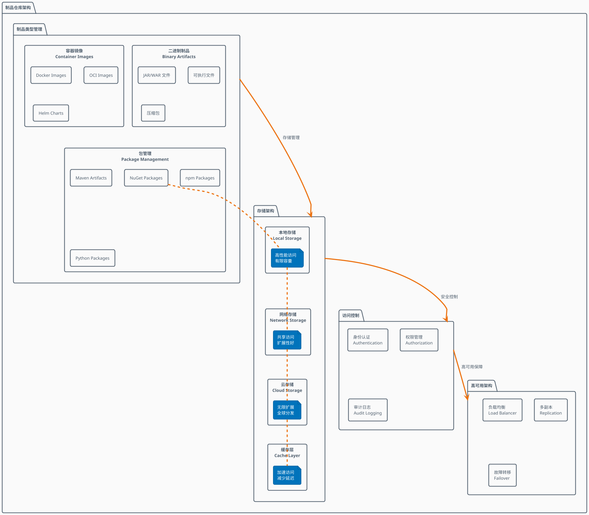

### 版本管理策略

```plantuml
@startuml Version_Management_Strategy
!theme aws-orange
skinparam backgroundColor #FAFAFA

package "版本管理策略" {
    
    package "语义化版本 (SemVer)" as semver {
        rectangle "主版本.次版本.修订版本\nMAJOR.MINOR.PATCH" as version_format {
            note bottom : 1.2.3\n不兼容API变更.新功能.Bug修复
        }
        rectangle "预发布标识\nPre-release" as prerelease {
            note bottom : 1.2.3-alpha.1\n1.2.3-beta.2\n1.2.3-rc.1
        }
        rectangle "构建元数据\nBuild Metadata" as metadata {
            note bottom : 1.2.3+20230801.1\n包含构建时间和序号
        }
    }
    
    package "分支版本策略" as branch_strategy {
        rectangle "主分支版本\nMain Branch" as main {
            note bottom : 发布版本\n1.0.0, 2.0.0
        }
        rectangle "开发分支版本\nDevelop Branch" as develop {
            note bottom : 快照版本\n1.1.0-SNAPSHOT
        }
        rectangle "特性分支版本\nFeature Branch" as feature {
            note bottom : 特性版本\n1.1.0-feature.login
        }
    }
    
    package "环境版本管理" as env_versioning {
        rectangle "开发环境\nDevelopment" as dev_env {
            note bottom : 最新构建\nlatest, develop-*
        }
        rectangle "测试环境\nTesting" as test_env {
            note bottom : 稳定版本\nv1.2.3-rc.*
        }
        rectangle "生产环境\nProduction" as prod_env {
            note bottom : 发布版本\nv1.2.3
        }
    }
}

semver --> branch_strategy : 版本号规范
branch_strategy --> env_versioning : 环境部署

@enduml
```

## ⚡ 性能优化

### 构建性能优化策略

```plantuml
@startuml Build_Performance_Optimization
!theme aws-orange
skinparam backgroundColor #FAFAFA

package "构建性能优化" {
    
    package "缓存优化 (Cache Optimization)" as cache_opt {
        rectangle "依赖缓存\nDependency Cache" as dep_cache {
            note bottom : Maven本地仓库\nnpm缓存目录\nDocker层缓存
        }
        rectangle "构建缓存\nBuild Cache" as build_cache {
            note bottom : 编译输出缓存\n增量构建支持\n分布式缓存共享
        }
        rectangle "镜像缓存\nImage Cache" as image_cache {
            note bottom : 基础镜像缓存\n多层缓存策略\n镜像分层优化
        }
    }
    
    package "并行化优化 (Parallelization)" as parallel_opt {
        rectangle "任务并行\nTask Parallelism" as task_parallel {
            note bottom : 多核CPU利用\n独立任务并行\n资源合理分配
        }
        rectangle "流水线并行\nPipeline Parallelism" as pipeline_parallel {
            note bottom : 阶段重叠执行\n流水线优化\n依赖关系管理
        }
        rectangle "集群并行\nCluster Parallelism" as cluster_parallel {
            note bottom : 分布式构建\n负载均衡\n故障容错
        }
    }
    
    package "资源优化 (Resource Optimization)" as resource_opt {
        rectangle "内存优化\nMemory Optimization" as memory_opt {
            note bottom : 堆内存调优\nGC参数优化\n内存泄漏防护
        }
        rectangle "网络优化\nNetwork Optimization" as network_opt {
            note bottom : 本地镜像源\n并发下载限制\n网络超时设置
        }
        rectangle "存储优化\nStorage Optimization" as storage_opt {
            note bottom : SSD存储使用\n临时文件清理\n磁盘空间监控
        }
    }
    
    package "性能监控 (Performance Monitoring)" as perf_monitoring {
        rectangle "构建时间分析\nBuild Time Analysis" as time_analysis
        rectangle "资源使用监控\nResource Usage Monitoring" as resource_monitor
        rectangle "瓶颈识别\nBottleneck Identification" as bottleneck_id
    }
}

cache_opt --> perf_monitoring : 缓存效果监控
parallel_opt --> perf_monitoring : 并行效果评估
resource_opt --> perf_monitoring : 资源使用分析

@enduml
```

### 构建时间优化对比

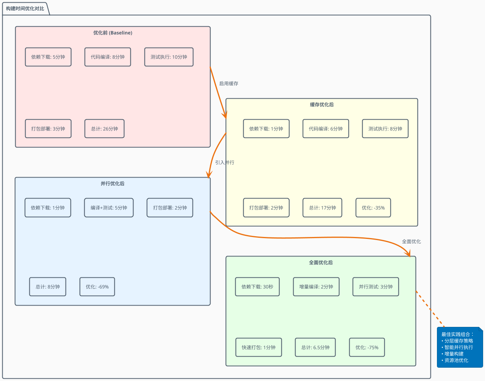

## 🎯 最佳实践

### 构建最佳实践原则

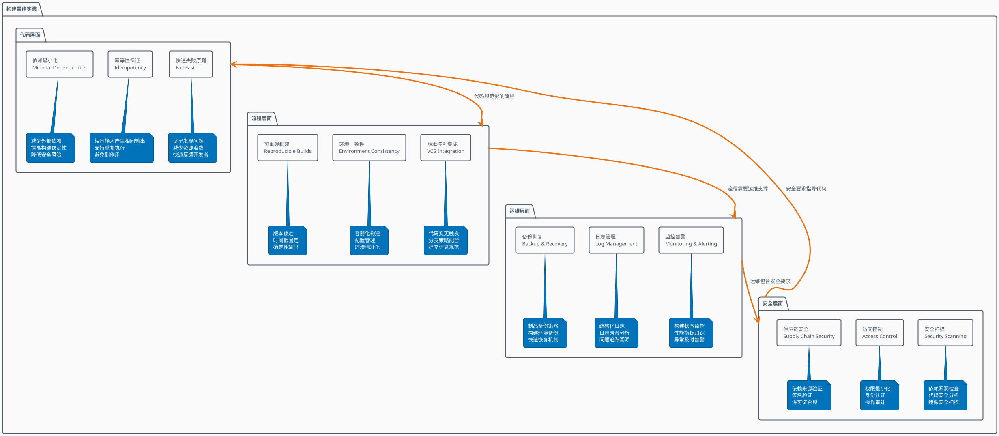

### Docker构建最佳实践

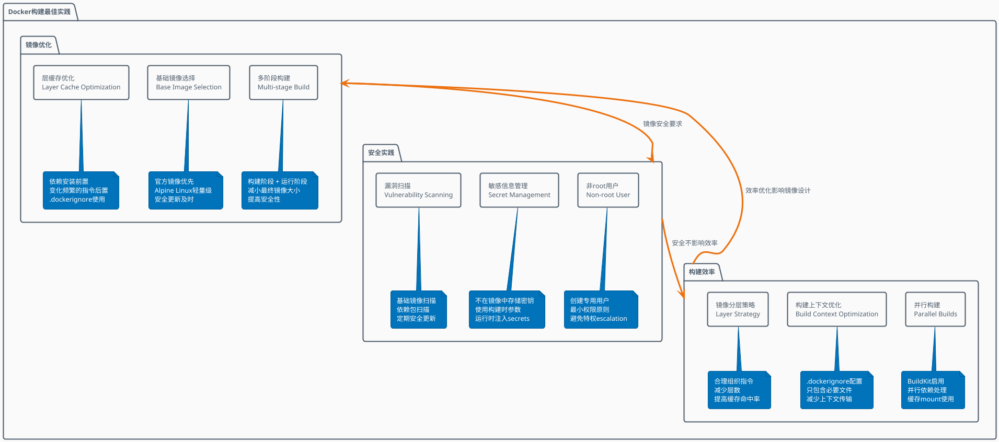

## 🔧 故障排查

### 构建故障分类与诊断

```plantuml
@startuml Build_Failure_Diagnosis
!theme aws-orange
skinparam backgroundColor #FAFAFA

package "构建故障诊断" {
    
    package "环境问题" as env_issues {
        rectangle "构建代理故障\nBuild Agent Failure" as agent_failure
        rectangle "依赖服务异常\nDependency Service Down" as service_down
        rectangle "资源限制\nResource Constraints" as resource_limits
        
        note bottom of agent_failure : 代理不可用\n资源不足\n网络连接问题
        note bottom of service_down : Maven仓库不可用\nDocker Registry故障\nGit服务异常
        note bottom of resource_limits : 内存不足\n磁盘空间满\nCPU资源竞争
    }
    
    package "代码问题" as code_issues {
        rectangle "编译错误\nCompilation Errors" as compile_errors
        rectangle "测试失败\nTest Failures" as test_failures
        rectangle "质量门控不通过\nQuality Gate Failure" as quality_gate
        
        note bottom of compile_errors : 语法错误\n依赖冲突\n版本不兼容
        note bottom of test_failures : 单元测试失败\n集成测试超时\n测试环境问题
        note bottom of quality_gate : 代码覆盖率不足\n安全漏洞检测\n代码规范违反
    }
    
    package "配置问题" as config_issues {
        rectangle "构建脚本错误\nBuild Script Errors" as script_errors
        rectangle "环境变量缺失\nMissing Environment Variables" as missing_env
        rectangle "工具版本不匹配\nTool Version Mismatch" as version_mismatch
        
        note bottom of script_errors : 脚本语法错误\n路径配置错误\n参数传递问题
        note bottom of missing_env : 必需变量未设置\n变量值错误\n权限配置问题
        note bottom of version_mismatch : JDK版本不兼容\nNode.js版本过低\n构建工具版本冲突
    }
    
    package "外部依赖问题" as external_deps {
        rectangle "网络连接超时\nNetwork Timeout" as network_timeout
        rectangle "依赖不可用\nDependency Unavailable" as dep_unavailable
        rectangle "认证失败\nAuthentication Failure" as auth_failure
        
        note bottom of network_timeout : 依赖下载超时\n仓库连接失败\n代理配置错误
        note bottom of dep_unavailable : 包版本不存在\n仓库镜像同步延迟\n依赖被删除
        note bottom of auth_failure : 凭据过期\n权限不足\n证书问题
    }
}

@enduml
```

### 故障排查流程

```plantuml
@startuml Troubleshooting_Workflow
!theme aws-orange
skinparam backgroundColor #FAFAFA

start

:构建失败报告;

partition "问题定位 (Problem Identification)" {
    :收集错误信息;
    :检查构建日志;
    :分析错误类型;
    
    if (错误类型?) then (环境问题)
        :检查构建环境状态;
        :验证系统资源;
        :测试网络连接;
    elseif (代码问题)
        :检查代码变更;
        :运行本地构建;
        :分析测试结果;
    elseif (配置问题)
        :验证构建配置;
        :检查环境变量;
        :确认工具版本;
    else (依赖问题)
        :检查依赖可用性;
        :验证网络连接;
        :测试认证配置;
    endif
}

partition "问题解决 (Problem Resolution)" {
    :制定解决方案;
    :实施修复措施;
    :验证修复结果;
    
    if (问题解决?) then (否)
        :升级问题级别;
        :寻求专家支持;
        :考虑临时方案;
    else (是)
        :问题已解决;
    endif
}

partition "经验沉淀 (Knowledge Management)" {
    :记录问题原因;
    :文档化解决方案;
    :更新故障手册;
    :分享团队经验;
}

:构建恢复正常;

stop

note right of "收集错误信息" : 构建日志\n系统日志\n监控数据\n环境快照

@enduml
```

### 常见构建问题解决方案

```plantuml
@startuml Common_Build_Issues_Solutions
!theme aws-orange
skinparam backgroundColor #FAFAFA

package "常见构建问题解决方案" {
    
    rectangle "内存不足\nOut of Memory" as oom {
        rectangle "问题现象" as oom_symptoms
        rectangle "解决方案" as oom_solutions
        
        note bottom of oom_symptoms : Java heap space错误\n构建进程被杀\n系统响应缓慢
        note bottom of oom_solutions : 增加堆内存设置\n优化JVM参数\n升级构建机器配置\n启用增量编译
    }
    
    rectangle "依赖下载失败\nDependency Download Failure" as dep_fail {
        rectangle "问题现象" as dep_symptoms
        rectangle "解决方案" as dep_solutions
        
        note bottom of dep_symptoms : 连接超时\n404错误\n校验和不匹配
        note bottom of dep_solutions : 配置镜像源\n增加重试机制\n使用本地缓存\n检查网络配置
    }
    
    rectangle "测试不稳定\nFlaky Tests" as flaky_tests {
        rectangle "问题现象" as flaky_symptoms
        rectangle "解决方案" as flaky_solutions
        
        note bottom of flaky_symptoms : 间歇性测试失败\n时序相关错误\n环境依赖问题
        note bottom of flaky_solutions : 增加测试稳定性\n使用测试隔离\n修复时序依赖\n环境标准化
    }
    
    rectangle "磁盘空间不足\nDisk Space Full" as disk_full {
        rectangle "问题现象" as disk_symptoms
        rectangle "解决方案" as disk_solutions
        
        note bottom of disk_symptoms : 写入失败\n临时文件无法创建\n构建中断
        note bottom of disk_solutions : 清理临时文件\n增加磁盘空间\n设置清理策略\n监控磁盘使用
    }
    
    rectangle "权限问题\nPermission Issues" as permission {
        rectangle "问题现象" as perm_symptoms
        rectangle "解决方案" as perm_solutions
        
        note bottom of perm_symptoms : 访问拒绝\n文件无法创建\n脚本执行失败
        note bottom of perm_solutions : 检查文件权限\n修正用户身份\n配置sudo权限\n使用容器隔离
    }
}

@enduml
```

## 📈 构建效果评估

### 构建效能指标体系

```plantuml
@startuml Build_Efficiency_Metrics
!theme aws-orange
skinparam backgroundColor #FAFAFA

package "构建效能指标体系" {
    
    package "速度指标" as speed {
        rectangle "平均构建时间\nAverage Build Time" as avg_build_time
        rectangle "构建队列等待时间\nQueue Wait Time" as queue_wait  
        rectangle "首次构建时间\nFirst Build Time" as first_build
        
        note bottom of avg_build_time : 目标: < 10分钟\n包含编译、测试、打包全过程
        note bottom of queue_wait : 目标: < 2分钟\n反映资源容量是否充足
        note bottom of first_build : 目标: < 30分钟\n冷构建时间（无缓存）
    }
    
    package "稳定性指标" as stability {
        rectangle "构建成功率\nBuild Success Rate" as success_rate
        rectangle "构建失败恢复时间\nMTTR" as mttr
        rectangle "连续失败次数\nConsecutive Failures" as consecutive_failures
        
        note bottom of success_rate : 目标: > 95%\n7天滚动成功率
        note bottom of mttr : 目标: < 30分钟\n从失败到恢复的时间
        note bottom of consecutive_failures : 目标: < 3次\n连续失败的最大次数
    }
    
    package "质量指标" as quality {
        rectangle "代码覆盖率\nCode Coverage" as coverage
        rectangle "质量门控通过率\nQuality Gate Pass Rate" as quality_gate
        rectangle "安全漏洞检出率\nSecurity Issue Detection" as security_detection
        
        note bottom of coverage : 目标: > 80%\n单元测试代码覆盖率
        note bottom of quality_gate : 目标: > 90%\n所有质量检查通过率
        note bottom of security_detection : 目标: 100%\n已知漏洞检出率
    }
    
    package "资源效率指标" as resource {
        rectangle "构建资源利用率\nResource Utilization" as resource_util
        rectangle "并行度\nParallelism Level" as parallelism
        rectangle "缓存命中率\nCache Hit Rate" as cache_hit
        
        note bottom of resource_util : 目标: 70-85%\nCPU、内存平均利用率
        note bottom of parallelism : 目标: > 4\n同时执行的构建任务数
        note bottom of cache_hit : 目标: > 80%\n依赖和构建缓存命中率
    }
}

speed --> stability : 速度影响稳定性
stability --> quality : 稳定性保障质量
quality --> resource : 质量检查消耗资源
resource --> speed : 资源效率影响速度

@enduml
```

### 构建成熟度评估模型

```plantuml
@startuml Build_Maturity_Assessment
!theme aws-orange
skinparam backgroundColor #FAFAFA

package "构建成熟度评估" {
    
    state "Level 1: 基础构建" as L1 {
        L1 : 手动构建流程
        L1 : 基础编译打包
        L1 : 简单质量检查
        L1 : 人工制品管理
        --
        L1 : 构建时间: 30-60分钟
        L1 : 成功率: 70-80%
        L1 : 自动化程度: 20%
    }
    
    state "Level 2: 自动化构建" as L2 {
        L2 : CI/CD流水线建立
        L2 : 自动化测试集成
        L2 : 基础质量门控
        L2 : 制品仓库管理
        --
        L2 : 构建时间: 15-30分钟
        L2 : 成功率: 80-90%
        L2 : 自动化程度: 60%
    }
    
    state "Level 3: 优化构建" as L3 {
        L3 : 并行构建实施
        L3 : 缓存策略优化
        L3 : 完整质量检查
        L3 : 多环境支持
        --
        L3 : 构建时间: 10-15分钟
        L3 : 成功率: 90-95%
        L3 : 自动化程度: 80%
    }
    
    state "Level 4: 智能构建" as L4 {
        L4 : 增量构建支持
        L4 : 智能缓存管理
        L4 : 预测性质量分析
        L4 : 自适应资源调度
        --
        L4 : 构建时间: 5-10分钟
        L4 : 成功率: 95-98%
        L4 : 自动化程度: 90%
    }
    
    state "Level 5: 极致构建" as L5 {
        L5 : AI驱动构建优化
        L5 : 零停机构建部署
        L5 : 实时质量反馈
        L5 : 自愈构建系统
        --
        L5 : 构建时间: < 5分钟
        L5 : 成功率: > 98%
        L5 : 自动化程度: > 95%
    }
    
    [*] --> L1 : 开始构建自动化
    L1 --> L2 : 引入CI/CD工具
    L2 --> L3 : 性能和质量优化
    L3 --> L4 : 智能化升级
    L4 --> L5 : AI和自愈能力
    
    L1 : 🔴 初级
    L2 : 🟡 中级
    L3 : 🟢 高级
    L4 : 🔵 专家
    L5 : 🟣 大师
}

note bottom of L5 : 构建成熟度提升路径：\n1. 建立基础自动化\n2. 优化流程和工具\n3. 引入智能化特性\n4. 实现自适应能力

@enduml
```

---

## 📚 总结

构建阶段作为DevOps流水线的核心环节，其重要性体现在：

### 🎯 核心价值
- **质量保障**: 通过自动化检查确保代码质量
- **效率提升**: 自动化流程显著提高交付速度  
- **风险控制**: 早期发现问题，降低发布风险
- **标准化**: 统一构建流程，提高团队协作效率

### 🔑 关键成功因素
1. **工具选择**: 选择适合团队和项目的构建工具
2. **流程设计**: 设计高效、可靠的构建流程
3. **质量门控**: 建立完善的质量检查机制
4. **性能优化**: 持续优化构建性能和资源利用
5. **监控运维**: 建立完善的监控和故障处理机制

### 🚀 发展趋势
- **云原生构建**: 容器化、微服务架构支持
- **AI增强构建**: 智能化优化和故障预测
- **安全左移**: 将安全检查前置到构建阶段
- **绿色构建**: 节能减排、可持续发展

通过系统性的构建阶段优化，团队能够实现更快、更稳定、更高质量的软件交付，为整个DevOps流程奠定坚实基础。

---

*本文档提供了DevOps构建阶段的完整指南，可根据实际项目需求进行定制和优化。*
