# DevOps部署阶段详解 🚀

> **部署是软件价值实现的最后一公里**  
> 将经过测试验证的制品安全、快速地交付给用户使用

## 📋 目录

- [部署阶段概述](#-部署阶段概述)
- [部署原理与架构](#-部署原理与架构)
- [部署流程详解](#-部署流程详解)
- [部署策略对比](#-部署策略对比)
- [环境管理体系](#-环境管理体系)
- [工具链生态](#-工具链生态)
- [配置管理](#-配置管理)
- [容器化部署](#-容器化部署)
- [云原生部署](#-云原生部署)
- [监控与回滚](#-监控与回滚)
- [安全与合规](#-安全与合规)
- [最佳实践](#-最佳实践)
- [故障排查](#-故障排查)

## 🎯 部署阶段概述

### 📖 定义与价值

部署阶段是DevOps流水线中将验证通过的软件制品安全、稳定地发布到目标环境的关键环节。它承担着从制品到服务的最终转换，是软件价值实现的临门一脚。

```plantuml
@startuml DeploymentOverview
!theme plain
skinparam backgroundColor #f8f9fa

package "部署阶段核心价值" {
    rectangle "快速交付" as fast {
        + 减少部署时间
        + 提高发布频率
        + 缩短价值实现周期
        + 增强市场响应能力
    }
    
    rectangle "质量保障" as quality {
        + 环境一致性
        + 配置标准化
        + 自动化验证
        + 回滚机制
    }
    
    rectangle "风险控制" as risk {
        + 灰度发布
        + 蓝绿部署
        + 金丝雀发布
        + 实时监控
    }
    
    rectangle "运维效率" as ops {
        + 自动化部署
        + 配置管理
        + 环境治理
        + 标准化流程
    }
}

fast --> quality : 确保
quality --> risk : 降低
risk --> ops : 提升

note bottom of fast : 从小时级别缩短到分钟级别
note bottom of quality : 消除"在我机器上能跑"问题
note bottom of risk : 将故障影响控制在最小范围
note bottom of ops : 减少90%的人工干预操作

@enduml
```

### 📊 部署阶段关键指标

| 指标类型 | 关键指标 | 行业基准 | 卓越标准 | 业务影响 |
|---------|----------|----------|----------|----------|
| **速度指标** | 部署频率 | 每月1次 | 每天多次 | 快速响应市场需求 |
| **速度指标** | 部署时长 | 2-4小时 | 10-30分钟 | 减少业务中断时间 |
| **质量指标** | 部署成功率 | 85-90% | 99%+ | 提升用户体验稳定性 |
| **质量指标** | 平均恢复时间(MTTR) | 4-8小时 | <30分钟 | 降低故障业务损失 |
| **风险指标** | 回滚率 | 10-15% | <2% | 减少生产环境风险 |
| **效率指标** | 自动化率 | 60-70% | 95%+ | 降低运维成本 |

## 🏗️ 部署原理与架构

### 核心架构原理

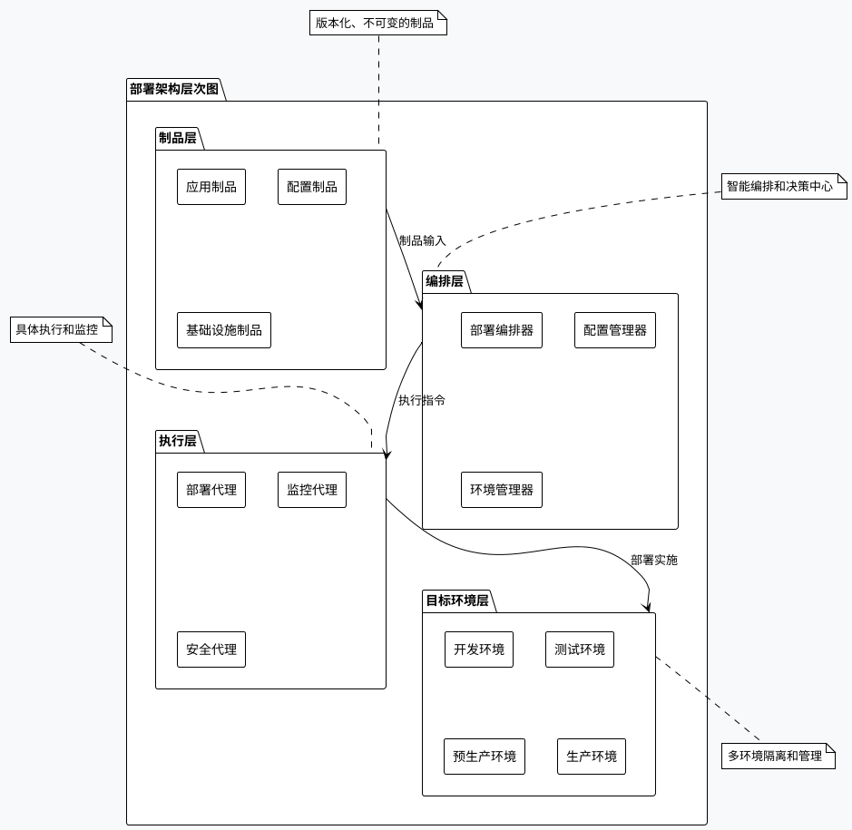

### 部署模式演进

```plantuml
@startuml DeploymentEvolution
!theme plain
skinparam backgroundColor #f8f9fa

package "部署模式演进历程" {
    
    rectangle "传统部署\n(2000-2005)" as Traditional {
        + 手工部署脚本
        + 单机直接部署
        + 停机维护窗口
        + 环境差异问题
    }
    
    rectangle "自动化部署\n(2005-2010)" as Automated {
        + CI/CD流水线
        + 脚本自动化
        + 环境标准化
        + 配置管理工具
    }
    
    rectangle "容器化部署\n(2010-2015)" as Containerized {
        + Docker容器技术
        + 微服务架构
        + 容器编排
        + 环境一致性
    }
    
    rectangle "云原生部署\n(2015-2020)" as CloudNative {
        + Kubernetes编排
        + 服务网格
        + 声明式部署
        + 弹性伸缩
    }
    
    rectangle "智能化部署\n(2020-现在)" as Intelligent {
        + AI辅助决策
        + 自适应部署
        + 智能回滚
        + 预测性运维
    }
}

Traditional --> Automated : 效率提升
Automated --> Containerized : 一致性增强
Containerized --> CloudNative : 规模化管理
CloudNative --> Intelligent : 智能化运维

@enduml
```

## 🔄 部署流程详解

### 完整部署流程架构

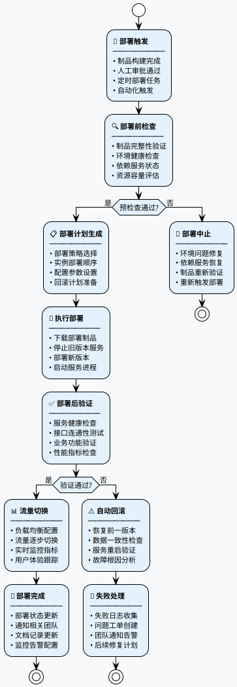

### 关键流程节点详解

```plantuml
@startuml DeploymentStages
!theme plain
skinparam backgroundColor #f8f9fa

package "部署关键节点" {
    
    rectangle "Pre-Deploy\n部署前" as PreDeploy {
        + 制品验证
        + 环境检查
        + 依赖确认
        + 容量评估
    }
    
    rectangle "Deploy\n部署中" as Deploy {
        + 服务停止
        + 制品部署
        + 配置更新
        + 服务启动
    }
    
    rectangle "Post-Deploy\n部署后" as PostDeploy {
        + 健康检查
        + 功能验证
        + 性能测试
        + 监控配置
    }
    
    rectangle "Traffic Switch\n流量切换" as TrafficSwitch {
        + 负载配置
        + 灰度发布
        + 流量监控
        + 用户体验
    }
}

PreDeploy --> Deploy : 检查通过
Deploy --> PostDeploy : 部署完成
PostDeploy --> TrafficSwitch : 验证通过

note bottom of PreDeploy
关键检查项:
• 制品SHA256校验
• 磁盘空间>20%
• CPU使用率<70%
• 内存使用率<80%
end note

note bottom of Deploy
部署要点:
• 优雅停机(SIGTERM)
• 原子性部署操作
• 配置热加载
• 服务启动超时设置
end note

note bottom of PostDeploy
验证标准:
• HTTP 200响应
• 关键接口延迟<100ms
• 错误率<0.1%
• 内存无泄漏
end note

note bottom of TrafficSwitch
切换策略:
• 10%-50%-100%流量
• 5分钟观察窗口
• 自动回滚阈值
• 用户体验监控
end note

@enduml
```

## ⚖️ 部署策略对比

### 主流部署策略对比

```plantuml
@startuml DeploymentStrategies
!theme plain
skinparam backgroundColor #f8f9fa

package "部署策略全景对比" {
    
    rectangle "停机部署\nRecreate" as Recreate {
        **适用场景:**
        + 单实例应用
        + 数据库迁移
        + 资源受限环境
        
        **优点:**
        + 实现简单
        + 资源消耗少
        + 完全隔离
        
        **缺点:**
        + 服务中断
        + 用户体验差
        + 风险集中
    }
    
    rectangle "滚动更新\nRolling Update" as RollingUpdate {
        **适用场景:**
        + 多实例应用
        + 无状态服务
        + 向后兼容更新
        
        **优点:**
        + 零停机时间
        + 资源利用高
        + 逐步替换
        
        **缺点:**
        + 版本共存
        + 回滚复杂
        + 数据一致性
    }
    
    rectangle "蓝绿部署\nBlue-Green" as BlueGreen {
        **适用场景:**
        + 关键业务系统
        + 快速回滚需求
        + 充足资源环境
        
        **优点:**
        + 即时切换
        + 快速回滚
        + 完整测试
        
        **缺点:**
        + 资源翻倍
        + 成本较高
        + 数据同步
    }
    
    rectangle "金丝雀发布\nCanary" as Canary {
        **适用场景:**
        + 高风险更新
        + 用户体验敏感
        + A/B测试场景
        
        **优点:**
        + 风险控制
        + 渐进验证
        + 用户反馈
        
        **缺点:**
        + 复杂度高
        + 监控要求高
        + 数据分析
    }
}

note top of Recreate : 停机时间: 5-30分钟\n风险级别: 高\n资源消耗: 1x
note top of RollingUpdate : 停机时间: 0分钟\n风险级别: 中\n资源消耗: 1.2x
note top of BlueGreen : 停机时间: 秒级\n风险级别: 低\n资源消耗: 2x
note top of Canary : 停机时间: 0分钟\n风险级别: 最低\n资源消耗: 1.1x

@enduml
```

### 策略选择决策树

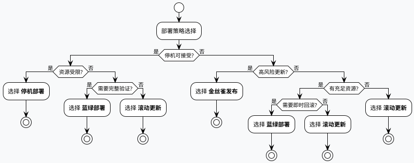

## 🌍 环境管理体系

### 环境分层架构

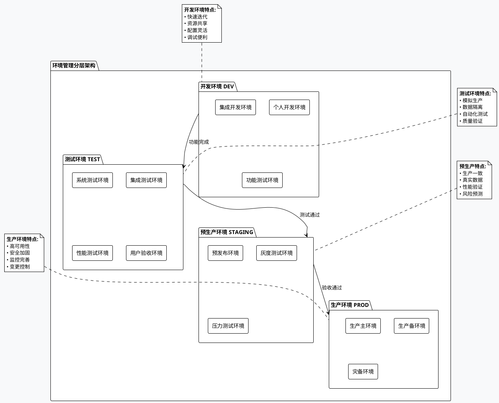

### 环境配置管理

```plantuml
@startuml EnvironmentConfig
!theme plain
skinparam backgroundColor #f8f9fa

package "环境配置管理体系" {
    
    rectangle "配置模板层" as ConfigTemplate {
        + 基础配置模板
        + 应用配置模板
        + 中间件配置模板
        + 网络配置模板
    }
    
    rectangle "环境变量层" as EnvVars {
        + 数据库连接串
        + 第三方服务地址
        + 功能开关配置
        + 性能参数设置
    }
    
    rectangle "密钥管理层" as SecretMgmt {
        + API密钥管理
        + 数据库密码
        + 证书管理
        + 加密密钥
    }
    
    rectangle "配置中心" as ConfigCenter {
        + 集中配置管理
        + 动态配置更新
        + 配置版本控制
        + 配置审计跟踪
    }
}

ConfigTemplate --> EnvVars : 模板实例化
EnvVars --> SecretMgmt : 安全引用
SecretMgmt --> ConfigCenter : 统一管理

note bottom of ConfigTemplate : 版本控制、模板继承
note bottom of EnvVars : 环境隔离、参数验证
note bottom of SecretMgmt : 加密存储、权限控制
note bottom of ConfigCenter : 实时同步、灰度发布

@enduml
```

## 🔧 工具链生态

### 部署工具全景图

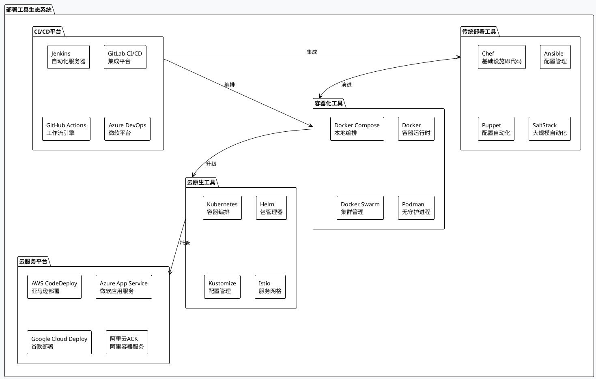

### 工具选型对比矩阵

| 工具类型 | 工具名称 | 学习曲线 | 功能完整性 | 社区活跃度 | 企业采用率 | 推荐指数 |
|---------|----------|----------|------------|------------|------------|----------|
| **配置管理** | Ansible | 低 | 高 | 高 | 高 | ⭐⭐⭐⭐⭐ |
| **配置管理** | Chef | 中 | 高 | 中 | 中 | ⭐⭐⭐⭐ |
| **容器编排** | Kubernetes | 高 | 极高 | 极高 | 极高 | ⭐⭐⭐⭐⭐ |
| **容器编排** | Docker Swarm | 低 | 中 | 低 | 低 | ⭐⭐⭐ |
| **CI/CD** | Jenkins | 中 | 极高 | 高 | 极高 | ⭐⭐⭐⭐⭐ |
| **CI/CD** | GitLab CI/CD | 低 | 高 | 高 | 高 | ⭐⭐⭐⭐⭐ |
| **包管理** | Helm | 中 | 高 | 高 | 高 | ⭐⭐⭐⭐⭐ |

### 企业级工具链架构

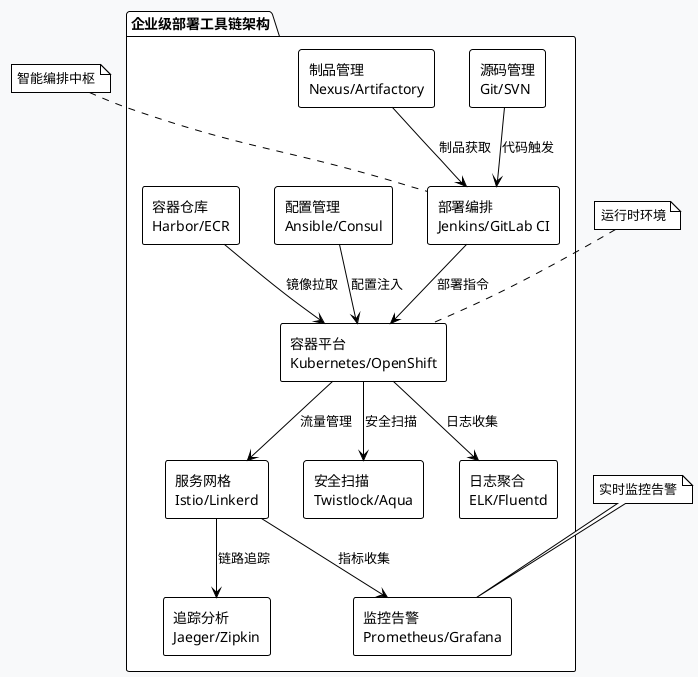

## ⚙️ 配置管理

### 配置管理架构

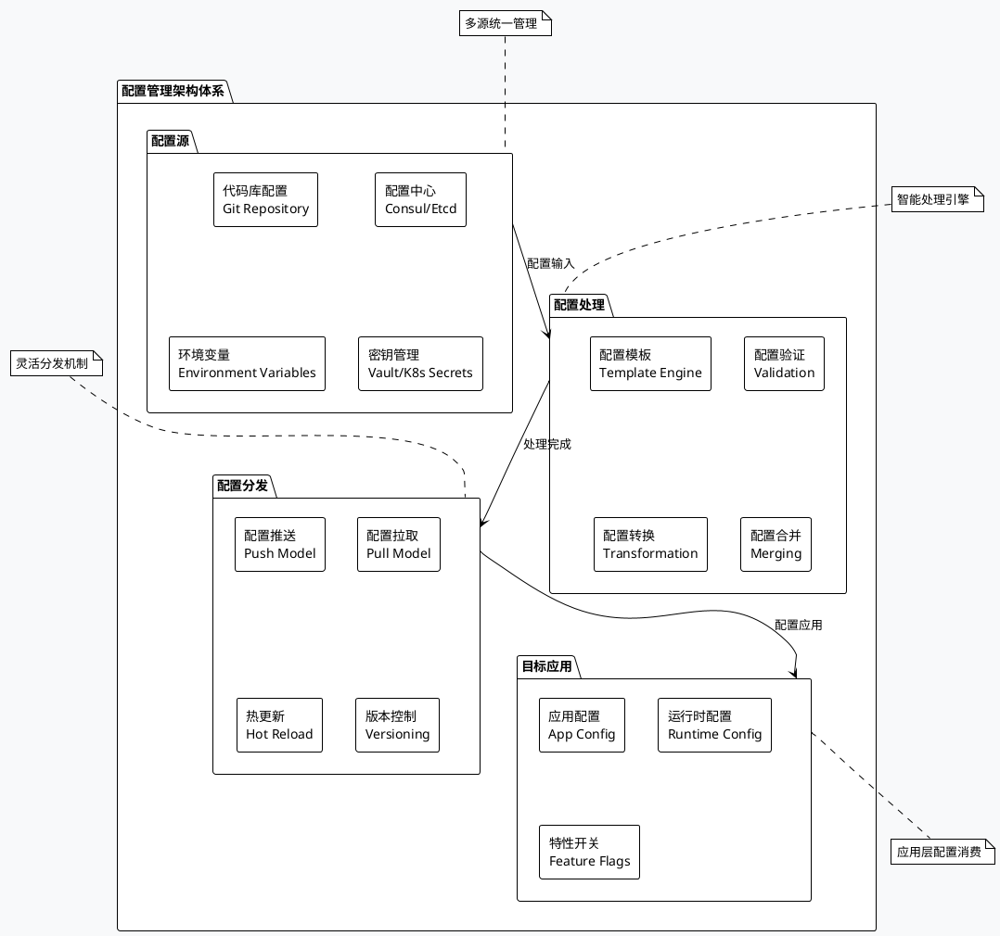

### 配置管理最佳实践

```plantuml
@startuml ConfigBestPractices
!theme plain
skinparam backgroundColor #f8f9fa

package "配置管理最佳实践" {
    
    rectangle "配置分离原则" as Separation {
        **核心理念:**
        + 配置与代码分离
        + 敏感信息隔离
        + 环境配置分层
        
        **实践方法:**
        + 12-Factor配置
        + 外部化配置
        + 配置即代码
        + 版本化管理
    }
    
    rectangle "配置安全管理" as Security {
        **安全要求:**
        + 密钥分离存储
        + 传输过程加密
        + 访问权限控制
        
        **实践方法:**
        + HashiCorp Vault
        + Kubernetes Secrets
        + AWS Parameter Store
        + 配置脱敏显示
    }
    
    rectangle "配置变更管理" as ChangeManagement {
        **变更流程:**
        + 配置审核流程
        + 灰度配置更新
        + 回滚机制设计
        
        **实践方法:**
        + Git工作流
        + 配置diff对比
        + 自动化测试
        + 监控告警
    }
    
    rectangle "配置监控审计" as Monitoring {
        **监控维度:**
        + 配置使用情况
        + 配置变更历史
        + 配置一致性检查
        
        **实践方法:**
        + 配置漂移检测
        + 审计日志记录
        + 合规性检查
        + 告警通知
    }
}

Separation --> Security : 安全基础
Security --> ChangeManagement : 受控变更
ChangeManagement --> Monitoring : 持续监控

@enduml
```

## 🐳 容器化部署

### 容器化部署架构

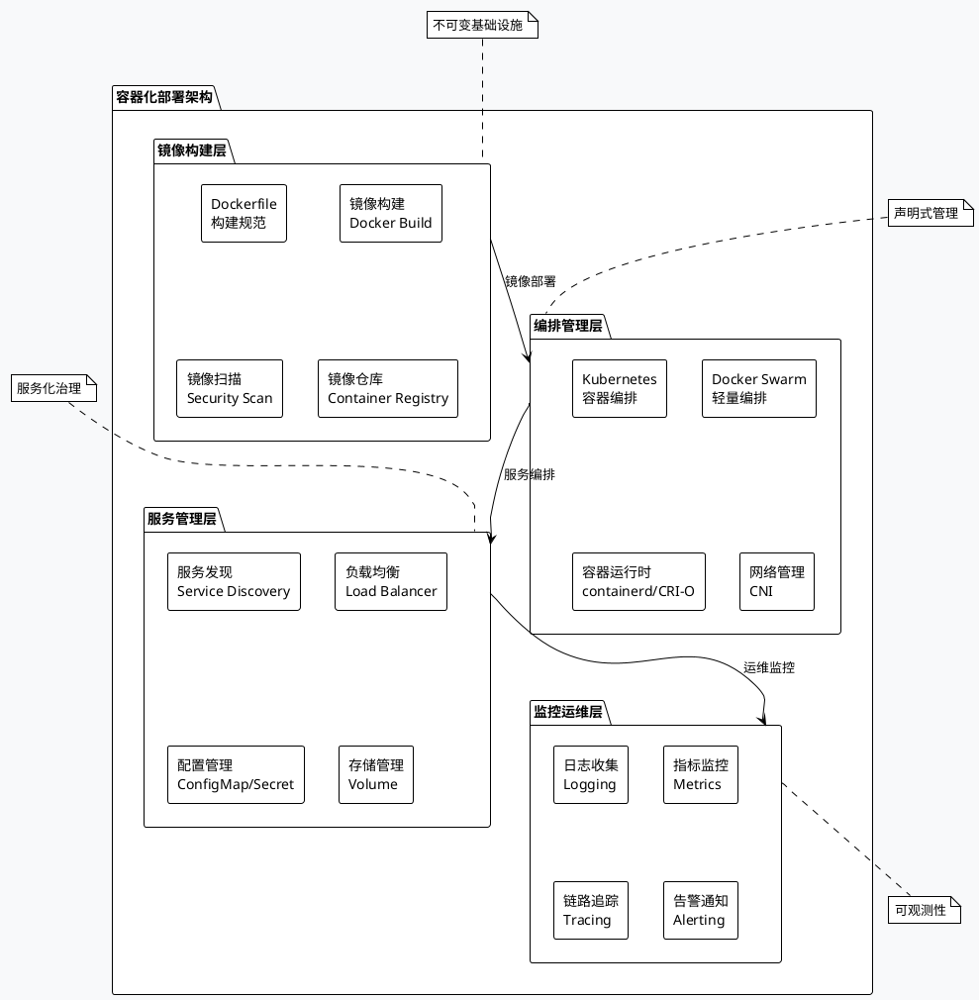

### Docker最佳实践

```plantuml
@startuml DockerBestPractices
!theme plain
skinparam backgroundColor #f8f9fa

package "Docker容器化最佳实践" {
    
    rectangle "镜像优化" as ImageOptimization {
        **基础镜像选择:**
        + Alpine Linux轻量级
        + 官方基础镜像
        + 多阶段构建
        + 最小化层数
        
        **大小优化:**
        + .dockerignore文件
        + 清理临时文件
        + 合并RUN指令
        + 使用distroless镜像
    }
    
    rectangle "安全强化" as Security {
        **运行安全:**
        + 非root用户运行
        + 只读文件系统
        + 资源限制设置
        + 能力最小化原则
        
        **镜像安全:**
        + 定期更新基础镜像
        + 漏洞扫描检测
        + 数字签名验证
        + 私有仓库管理
    }
    
    rectangle "运维友好" as Operations {
        **监控集成:**
        + 健康检查端点
        + 指标暴露端口
        + 日志标准化输出
        + 优雅停机处理
        
        **调试支持:**
        + 镜像标签规范
        + 环境变量文档
        + 故障排查工具
        + 性能分析工具
    }
    
    rectangle "性能优化" as Performance {
        **启动优化:**
        + 预热缓存机制
        + JVM参数调优
        + 并行初始化
        + 延迟加载策略
        
        **运行优化:**
        + 内存使用监控
        + CPU调度优化
        + 网络性能调优
        + 存储I/O优化
    }
}

ImageOptimization --> Security : 安全基础
Security --> Operations : 运维保障
Operations --> Performance : 性能提升

@enduml
```

### Kubernetes部署模式

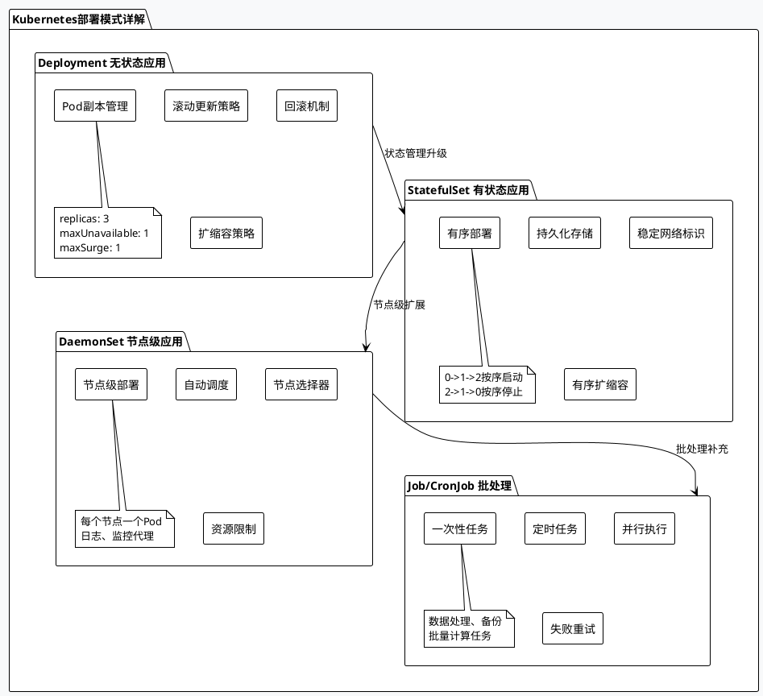

## ☁️ 云原生部署

### 云原生部署架构

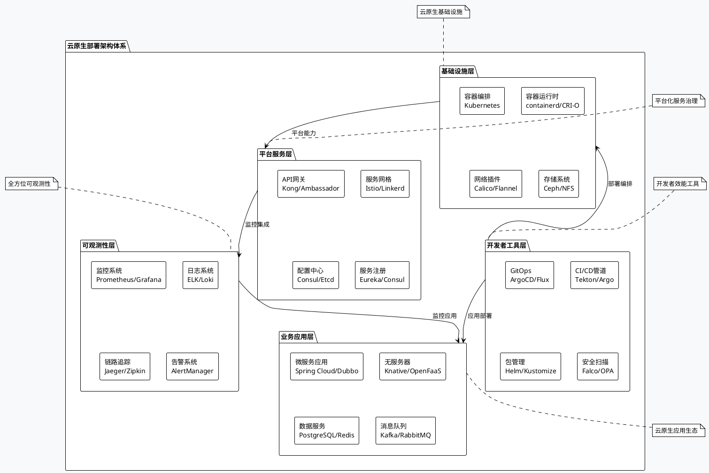

### GitOps部署模式

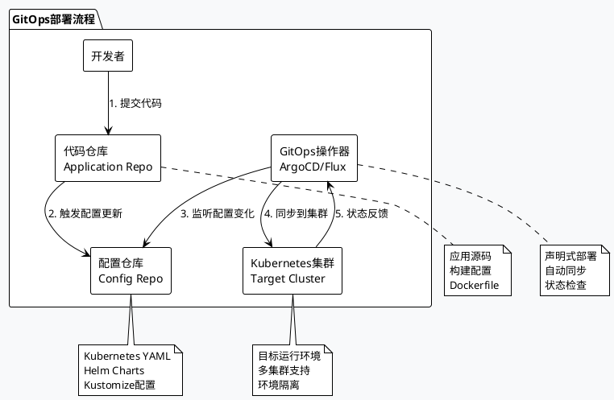

### 云原生安全模型

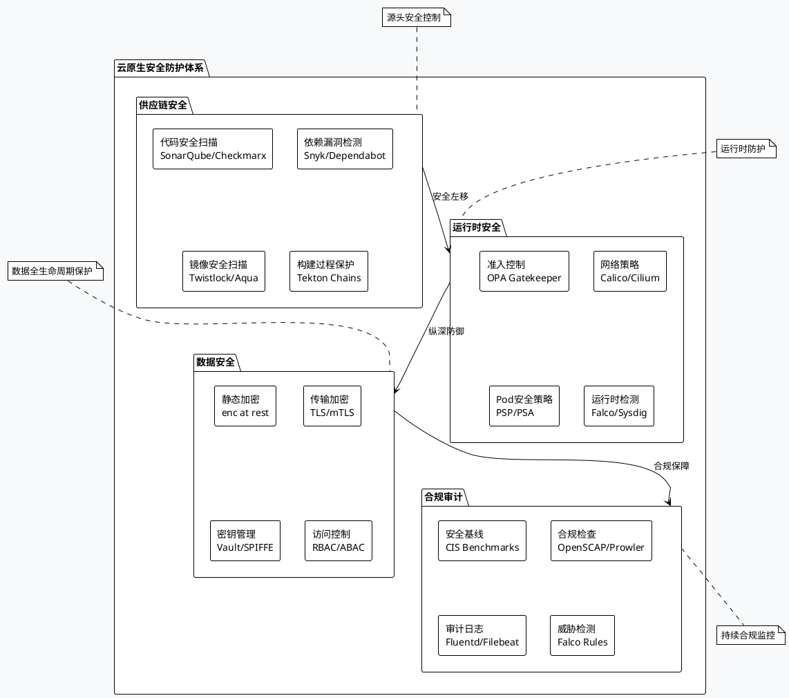

## 📊 监控与回滚

### 部署监控体系

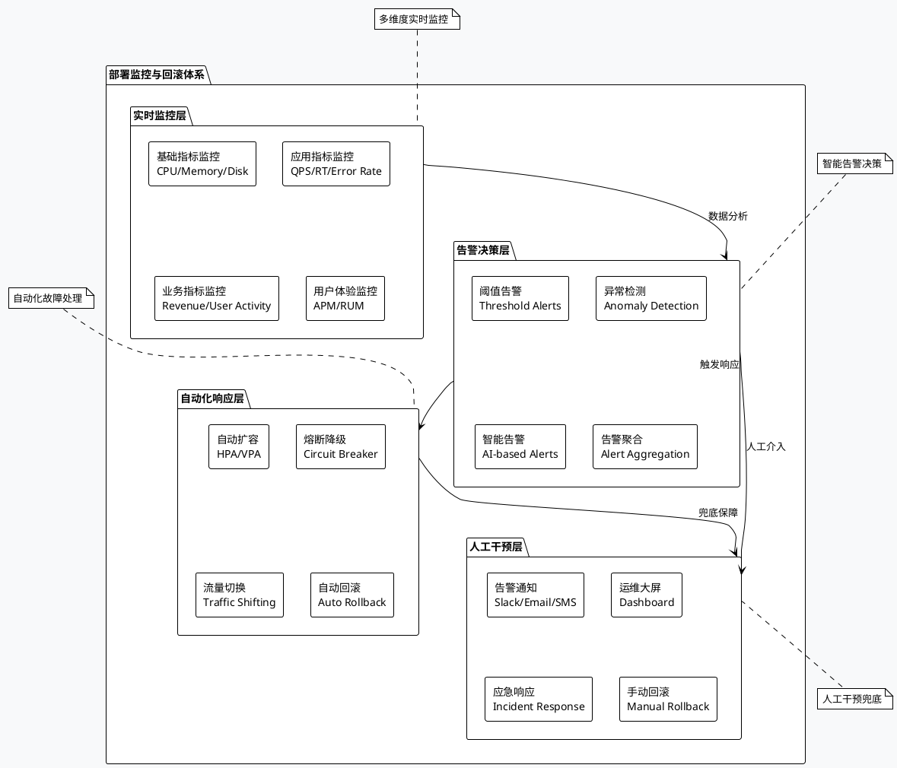

### 回滚策略与流程

```plantuml
@startuml RollbackStrategy
!theme plain
skinparam backgroundColor #f8f9fa
skinparam activity {
    BackgroundColor #e8f5e8
    FontSize 11
}

start

:🚨 **故障检测触发**
────────────
• 监控告警触发
• 用户投诉反馈
• SRE主动发现
• 自动化检测;

:🔍 **故障影响评估**
────────────
• 影响范围分析
• 用户影响程度
• 业务损失评估
• 修复时间预估;

if (需要立即回滚?) then (是)
  :⚡ **紧急回滚决策**
  ────────────
  • 启动应急流程
  • 确定回滚版本
  • 评估回滚风险
  • 通知相关团队;
  
  if (自动回滚可行?) then (是)
    :🤖 **自动回滚执行**
    ────────────
    • 停止故障版本流量
    • 切换到前一版本
    • 验证回滚结果
    • 监控系统状态;
  else (否)
    :👨‍💻 **手动回滚执行**
    ────────────
    • 人工执行回滚
    • 数据库回滚处理
    • 配置文件恢复
    • 缓存清理重建;
  endif
  
  :✅ **回滚后验证**
  ────────────
  • 核心功能验证
  • 性能指标检查
  • 用户体验确认
  • 业务数据核实;
  
  if (回滚成功?) then (是)
    :📝 **故障复盘**
    ────────────
    • 根因分析
    • 改进措施
    • 预防策略
    • 文档更新;
    
    :🎯 **持续改进**
    ────────────
    • 监控优化
    • 流程改进
    • 工具升级
    • 团队培训;
    
    stop
  else (否)
    :🆘 **升级处理**
    ────────────
    • 技术专家介入
    • 供应商支持
    • 紧急修复开发
    • 用户沟通通告;
    
    stop
  endif
  
else (否)
  :🔧 **在线修复**
  ────────────
  • 热修复补丁
  • 配置参数调整
  • 重启服务恢复
  • 监控修复效果;
  
  stop
endif

@enduml
```

### 监控指标体系

```plantuml
@startuml MonitoringMetrics
!theme plain
skinparam backgroundColor #f8f9fa

package "部署监控指标体系" {
    
    rectangle "基础设施指标" as InfrastructureMetrics {
        **系统资源:**
        + CPU使用率 < 70%
        + 内存使用率 < 80%
        + 磁盘使用率 < 85%
        + 网络I/O吞吐量
        
        **容器指标:**
        + 容器状态监控
        + 镜像拉取时间
        + 容器重启次数
        + 资源限制监控
    }
    
    rectangle "应用性能指标" as ApplicationMetrics {
        **接口性能:**
        + 响应时间 < 200ms
        + QPS/TPS指标
        + 错误率 < 0.1%
        + 可用性 > 99.9%
        
        **应用状态:**
        + JVM堆内存使用
        + GC停顿时间
        + 线程池状态
        + 数据库连接池
    }
    
    rectangle "业务指标监控" as BusinessMetrics {
        **用户体验:**
        + 页面加载时间
        + 用户操作成功率
        + 关键流程转化率
        + 用户满意度NPS
        
        **业务数据:**
        + 交易成功率
        + 订单处理时间
        + 收入影响分析
        + 业务异常告警
    }
    
    rectangle "安全指标监控" as SecurityMetrics {
        **安全事件:**
        + 异常访问检测
        + 权限违规告警
        + 安全漏洞扫描
        + 数据泄漏监控
        
        **合规检查:**
        + 配置合规性
        + 审计日志完整性
        + 数据加密状态
        + 访问控制有效性
    }
}

InfrastructureMetrics --> ApplicationMetrics : 支撑
ApplicationMetrics --> BusinessMetrics : 影响
SecurityMetrics --> InfrastructureMetrics : 保护
SecurityMetrics --> ApplicationMetrics : 防护

note bottom of InfrastructureMetrics
**告警阈值:**
• 警告: CPU > 70%
• 严重: CPU > 85%
• 紧急: CPU > 95%
end note

note bottom of ApplicationMetrics
**SLA目标:**
• 可用性: 99.95%
• 响应时间: P99 < 500ms
• 错误率: < 0.05%
end note

note bottom of BusinessMetrics
**业务KPI:**
• 转化率下降 > 5% 告警
• 收入影响 > $1000 升级
• 用户投诉增加20%通知
end note

note bottom of SecurityMetrics
**安全基线:**
• 零信任验证
• 最小权限原则
• 数据分类保护
• 持续合规监控
end note

@enduml
```

## 🔒 安全与合规

### 部署安全架构

```plantuml
@startuml DeploymentSecurity
!theme plain
skinparam backgroundColor #f8f9fa

package "部署安全防护体系" {
    
    package "身份认证与授权" as IdentityAuth {
        rectangle "身份认证\nOAuth2/OIDC" as Authentication
        rectangle "角色权限\nRBAC/ABAC" as Authorization  
        rectangle "多因素认证\nMFA" as MultiFactorAuth
        rectangle "服务身份\nSPIFFE/SPIRE" as ServiceIdentity
    }
    
    package "网络安全防护" as NetworkSecurity {
        rectangle "网络隔离\nNetwork Segmentation" as NetworkSegmentation
        rectangle "流量加密\nTLS/mTLS" as TrafficEncryption
        rectangle "防火墙规则\nFirewall Rules" as FirewallRules
        rectangle "DDoS防护\nAnti-DDoS" as DDoSProtection
    }
    
    package "数据安全保护" as DataSecurity {
        rectangle "数据加密\nEncryption at Rest" as DataEncryption
        rectangle "密钥管理\nKey Management" as KeyManagement
        rectangle "敏感数据脱敏\nData Masking" as DataMasking
        rectangle "数据备份\nBackup & Recovery" as DataBackup
    }
    
    package "运行时安全" as RuntimeSecurity {
        rectangle "容器安全\nContainer Security" as ContainerSecurity
        rectangle "漏洞扫描\nVulnerability Scanning" as VulnerabilityScanning
        rectangle "行为监控\nBehavior Monitoring" as BehaviorMonitoring
        rectangle "入侵检测\nIDS/IPS" as IntrusionDetection
    }
    
    package "合规审计" as ComplianceAudit {
        rectangle "合规框架\nSOX/GDPR/HIPAA" as ComplianceFramework
        rectangle "审计日志\nAudit Logging" as AuditLogging
        rectangle "风险评估\nRisk Assessment" as RiskAssessment
        rectangle "安全基线\nSecurity Baseline" as SecurityBaseline
    }
}

IdentityAuth --> NetworkSecurity : 信任建立
NetworkSecurity --> DataSecurity : 传输保护
DataSecurity --> RuntimeSecurity : 存储安全
RuntimeSecurity --> ComplianceAudit : 持续监控

note top of IdentityAuth : 零信任安全模型
note top of NetworkSecurity : 纵深防御策略
note top of DataSecurity : 数据全生命周期保护
note top of RuntimeSecurity : 实时威胁检测
note bottom of ComplianceAudit : 持续合规保障

@enduml
```

### DevSecOps集成模型

```plantuml
@startuml DevSecOpsIntegration
!theme plain
skinparam backgroundColor #f8f9fa

package "DevSecOps安全集成模型" {
    
    package "开发阶段 Dev" as DevPhase {
        rectangle "安全编码\nSecure Coding" as SecureCoding
        rectangle "代码审查\nCode Review" as CodeReview
        rectangle "静态分析\nSAST" as StaticAnalysis
        rectangle "依赖检查\nDependency Check" as DependencyCheck
    }
    
    package "安全阶段 Sec" as SecPhase {
        rectangle "威胁建模\nThreat Modeling" as ThreatModeling
        rectangle "安全测试\nSecurity Testing" as SecurityTesting
        rectangle "渗透测试\nPenetration Testing" as PenetrationTesting
        rectangle "合规检查\nCompliance Check" as ComplianceCheck
    }
    
    package "运维阶段 Ops" as OpsPhase {
        rectangle "容器扫描\nContainer Scanning" as ContainerScanning
        rectangle "运行时保护\nRuntime Protection" as RuntimeProtection
        rectangle "安全监控\nSecurity Monitoring" as SecurityMonitoring
        rectangle "事件响应\nIncident Response" as IncidentResponse
    }
}

DevPhase --> SecPhase : 安全左移
SecPhase --> OpsPhase : 安全右移
OpsPhase --> DevPhase : 反馈循环

note bottom of DevPhase
**开发安全实践:**
• IDE安全插件集成
• Git pre-commit钩子
• 自动化安全扫描
• 安全培训认证
end note

note bottom of SecPhase
**专业安全实践:**
• OWASP TOP 10检查
• 安全架构审查
• 漏洞管理流程
• 风险评估报告
end note

note bottom of OpsPhase
**运维安全实践:**
• 零停机安全更新
• 实时威胁检测
• 安全事件自动化响应
• 持续合规监控
end note

@enduml
```

## 🎯 最佳实践

### 部署最佳实践框架

```plantuml
@startuml DeploymentBestPractices
!theme plain
skinparam backgroundColor #f8f9fa

package "部署最佳实践框架" {
    
    rectangle "自动化优先" as AutomationFirst {
        **核心理念:**
        + 一切皆可自动化
        + 消除人为错误
        + 提高部署效率
        + 确保一致性
        
        **实践要点:**
        + 基础设施即代码(IaC)
        + 配置管理自动化
        + 部署流程自动化
        + 监控告警自动化
    }
    
    rectangle "不可变基础设施" as ImmutableInfra {
        **核心理念:**
        + 基础设施不可变更
        + 版本化管理
        + 蓝绿部署模式
        + 容器化部署
        
        **实践要点:**
        + Docker镜像化部署
        + 容器编排管理
        + 版本标签管理
        + 环境一致性保证
    }
    
    rectangle "渐进式部署" as ProgressiveDeployment {
        **核心理念:**
        + 降低部署风险
        + 快速故障发现
        + 用户影响最小化
        + 回滚机制完善
        
        **实践要点:**
        + 金丝雀发布策略
        + 蓝绿部署实践
        + A/B测试集成
        + 实时监控反馈
    }
    
    rectangle "可观测性建设" as Observability {
        **核心理念:**
        + 全链路可视化
        + 预测性运维
        + 快速问题定位
        + 持续性能优化
        
        **实践要点:**
        + 指标监控体系
        + 日志聚合分析
        + 分布式链路追踪
        + 智能告警系统
    }
    
    rectangle "安全内建" as SecurityBuiltIn {
        **核心理念:**
        + 安全左移策略
        + DevSecOps实践
        + 零信任架构
        + 持续合规监控
        
        **实践要点:**
        + 安全扫描集成
        + 权限最小化
        + 数据加密保护
        + 审计日志记录
    }
    
    rectangle "文化与协作" as CultureCollaboration {
        **核心理念:**
        + 团队协作文化
        + 知识分享机制
        + 持续学习改进
        + 失败快速恢复
        
        **实践要点:**
        + 跨团队协作
        + 文档标准化
        + 培训体系建设
        + 复盘改进机制
    }
}

AutomationFirst --> ImmutableInfra : 基础支撑
ImmutableInfra --> ProgressiveDeployment : 部署策<!-- filepath: c:\Programs\aiworkdocs\DevOps\DevOps部署阶段详解_Deploy_Stage_Guide.md -->
# DevOps部署阶段详解 🚀

> **部署是软件价值实现的最后一公里**  
> 将经过测试验证的制品安全、快速地交付给用户使用

## 📋 目录

- [部署阶段概述](#-部署阶段概述)
- [部署原理与架构](#-部署原理与架构)
- [部署流程详解](#-部署流程详解)
- [部署策略对比](#-部署策略对比)
- [环境管理体系](#-环境管理体系)
- [工具链生态](#-工具链生态)
- [配置管理](#-配置管理)
- [容器化部署](#-容器化部署)
- [云原生部署](#-云原生部署)
- [监控与回滚](#-监控与回滚)
- [安全与合规](#-安全与合规)
- [最佳实践](#-最佳实践)
- [故障排查](#-故障排查)

## 🎯 部署阶段概述

### 📖 定义与价值

部署阶段是DevOps流水线中将验证通过的软件制品安全、稳定地发布到目标环境的关键环节。它承担着从制品到服务的最终转换，是软件价值实现的临门一脚。

```plantuml
@startuml DeploymentOverview
!theme plain
skinparam backgroundColor #f8f9fa

package "部署阶段核心价值" {
    rectangle "快速交付" as fast {
        + 减少部署时间
        + 提高发布频率
        + 缩短价值实现周期
        + 增强市场响应能力
    }
    
    rectangle "质量保障" as quality {
        + 环境一致性
        + 配置标准化
        + 自动化验证
        + 回滚机制
    }
    
    rectangle "风险控制" as risk {
        + 灰度发布
        + 蓝绿部署
        + 金丝雀发布
        + 实时监控
    }
    
    rectangle "运维效率" as ops {
        + 自动化部署
        + 配置管理
        + 环境治理
        + 标准化流程
    }
}

fast --> quality : 确保
quality --> risk : 降低
risk --> ops : 提升

note bottom of fast : 从小时级别缩短到分钟级别
note bottom of quality : 消除"在我机器上能跑"问题
note bottom of risk : 将故障影响控制在最小范围
note bottom of ops : 减少90%的人工干预操作

@enduml
```

### 📊 部署阶段关键指标

| 指标类型 | 关键指标 | 行业基准 | 卓越标准 | 业务影响 |
|---------|----------|----------|----------|----------|
| **速度指标** | 部署频率 | 每月1次 | 每天多次 | 快速响应市场需求 |
| **速度指标** | 部署时长 | 2-4小时 | 10-30分钟 | 减少业务中断时间 |
| **质量指标** | 部署成功率 | 85-90% | 99%+ | 提升用户体验稳定性 |
| **质量指标** | 平均恢复时间(MTTR) | 4-8小时 | <30分钟 | 降低故障业务损失 |
| **风险指标** | 回滚率 | 10-15% | <2% | 减少生产环境风险 |
| **效率指标** | 自动化率 | 60-70% | 95%+ | 降低运维成本 |

## 🏗️ 部署原理与架构

### 核心架构原理

```plantuml
@startuml DeploymentArchitecture
!theme plain
skinparam backgroundColor #f8f9fa

package "部署架构层次图" {
    
    package "制品层" as ArtifactLayer {
        rectangle "应用制品" as AppArtifact
        rectangle "配置制品" as ConfigArtifact
        rectangle "基础设施制品" as InfraArtifact
    }
    
    package "编排层" as OrchestrationLayer {
        rectangle "部署编排器" as Orchestrator
        rectangle "配置管理器" as ConfigManager
        rectangle "环境管理器" as EnvManager
    }
    
    package "执行层" as ExecutionLayer {
        rectangle "部署代理" as DeployAgent
        rectangle "监控代理" as MonitorAgent
        rectangle "安全代理" as SecurityAgent
    }
    
    package "目标环境层" as TargetLayer {
        rectangle "开发环境" as DevEnv
        rectangle "测试环境" as TestEnv
        rectangle "预生产环境" as StagingEnv
        rectangle "生产环境" as ProdEnv
    }
}

ArtifactLayer --> OrchestrationLayer : 制品输入
OrchestrationLayer --> ExecutionLayer : 执行指令
ExecutionLayer --> TargetLayer : 部署实施

note top of ArtifactLayer : 版本化、不可变的制品
note top of OrchestrationLayer : 智能编排和决策中心
note top of ExecutionLayer : 具体执行和监控
note bottom of TargetLayer : 多环境隔离和管理

@enduml
```

### 部署模式演进

```plantuml
@startuml DeploymentEvolution
!theme plain
skinparam backgroundColor #f8f9fa

package "部署模式演进历程" {
    
    rectangle "传统部署\n(2000-2005)" as Traditional {
        + 手工部署脚本
        + 单机直接部署
        + 停机维护窗口
        + 环境差异问题
    }
    
    rectangle "自动化部署\n(2005-2010)" as Automated {
        + CI/CD流水线
        + 脚本自动化
        + 环境标准化
        + 配置管理工具
    }
    
    rectangle "容器化部署\n(2010-2015)" as Containerized {
        + Docker容器技术
        + 微服务架构
        + 容器编排
        + 环境一致性
    }
    
    rectangle "云原生部署\n(2015-2020)" as CloudNative {
        + Kubernetes编排
        + 服务网格
        + 声明式部署
        + 弹性伸缩
    }
    
    rectangle "智能化部署\n(2020-现在)" as Intelligent {
        + AI辅助决策
        + 自适应部署
        + 智能回滚
        + 预测性运维
    }
}

Traditional --> Automated : 效率提升
Automated --> Containerized : 一致性增强
Containerized --> CloudNative : 规模化管理
CloudNative --> Intelligent : 智能化运维

@enduml
```

## 🔄 部署流程详解

### 完整部署流程架构

```plantuml
@startuml DeploymentProcess
!theme plain
skinparam backgroundColor #f8f9fa
skinparam activity {
    BackgroundColor #e3f2fd
    FontSize 11
}

start

:🎯 **部署触发**
────────────
• 制品构建完成
• 人工审批通过
• 定时部署任务
• 自动化触发;

:🔍 **部署前检查**
────────────
• 制品完整性验证
• 环境健康检查
• 依赖服务状态
• 资源容量评估;

if (预检查通过?) then (是)
  :📋 **部署计划生成**
  ────────────
  • 部署策略选择
  • 实例部署顺序
  • 配置参数设置
  • 回滚计划准备;
  
  :🚀 **执行部署**
  ────────────
  • 下载部署制品
  • 停止旧版本服务
  • 部署新版本
  • 启动服务进程;
  
  :✅ **部署后验证**
  ────────────
  • 服务健康检查
  • 接口连通性测试
  • 业务功能验证
  • 性能指标检查;
  
  if (验证通过?) then (是)
    :📊 **流量切换**
    ────────────
    • 负载均衡配置
    • 流量逐步切换
    • 实时监控指标
    • 用户体验跟踪;
    
    :🎉 **部署完成**
    ────────────
    • 部署状态更新
    • 通知相关团队
    • 文档记录更新
    • 监控告警配置;
    
    stop
    
  else (否)
    :⚠️ **自动回滚**
    ────────────
    • 恢复前一版本
    • 数据一致性检查
    • 服务重启验证
    • 故障根因分析;
    
    :📝 **失败处理**
    ────────────
    • 失败日志收集
    • 问题工单创建
    • 团队通知告警
    • 后续修复计划;
    
    stop
  endif
  
else (否)
  :🛑 **部署中止**
  ────────────
  • 环境问题修复
  • 依赖服务恢复
  • 制品重新验证
  • 重新触发部署;
  
  stop
endif

@enduml
```

### 关键流程节点详解

```plantuml
@startuml DeploymentStages
!theme plain
skinparam backgroundColor #f8f9fa

package "部署关键节点" {
    
    rectangle "Pre-Deploy\n部署前" as PreDeploy {
        + 制品验证
        + 环境检查
        + 依赖确认
        + 容量评估
    }
    
    rectangle "Deploy\n部署中" as Deploy {
        + 服务停止
        + 制品部署
        + 配置更新
        + 服务启动
    }
    
    rectangle "Post-Deploy\n部署后" as PostDeploy {
        + 健康检查
        + 功能验证
        + 性能测试
        + 监控配置
    }
    
    rectangle "Traffic Switch\n流量切换" as TrafficSwitch {
        + 负载配置
        + 灰度发布
        + 流量监控
        + 用户体验
    }
}

PreDeploy --> Deploy : 检查通过
Deploy --> PostDeploy : 部署完成
PostDeploy --> TrafficSwitch : 验证通过

note bottom of PreDeploy
关键检查项:
• 制品SHA256校验
• 磁盘空间>20%
• CPU使用率<70%
• 内存使用率<80%
end note

note bottom of Deploy
部署要点:
• 优雅停机(SIGTERM)
• 原子性部署操作
• 配置热加载
• 服务启动超时设置
end note

note bottom of PostDeploy
验证标准:
• HTTP 200响应
• 关键接口延迟<100ms
• 错误率<0.1%
• 内存无泄漏
end note

note bottom of TrafficSwitch
切换策略:
• 10%-50%-100%流量
• 5分钟观察窗口
• 自动回滚阈值
• 用户体验监控
end note

@enduml
```

## ⚖️ 部署策略对比

### 主流部署策略对比

```plantuml
@startuml DeploymentStrategies
!theme plain
skinparam backgroundColor #f8f9fa

package "部署策略全景对比" {
    
    rectangle "停机部署\nRecreate" as Recreate {
        **适用场景:**
        + 单实例应用
        + 数据库迁移
        + 资源受限环境
        
        **优点:**
        + 实现简单
        + 资源消耗少
        + 完全隔离
        
        **缺点:**
        + 服务中断
        + 用户体验差
        + 风险集中
    }
    
    rectangle "滚动更新\nRolling Update" as RollingUpdate {
        **适用场景:**
        + 多实例应用
        + 无状态服务
        + 向后兼容更新
        
        **优点:**
        + 零停机时间
        + 资源利用高
        + 逐步替换
        
        **缺点:**
        + 版本共存
        + 回滚复杂
        + 数据一致性
    }
    
    rectangle "蓝绿部署\nBlue-Green" as BlueGreen {
        **适用场景:**
        + 关键业务系统
        + 快速回滚需求
        + 充足资源环境
        
        **优点:**
        + 即时切换
        + 快速回滚
        + 完整测试
        
        **缺点:**
        + 资源翻倍
        + 成本较高
        + 数据同步
    }
    
    rectangle "金丝雀发布\nCanary" as Canary {
        **适用场景:**
        + 高风险更新
        + 用户体验敏感
        + A/B测试场景
        
        **优点:**
        + 风险控制
        + 渐进验证
        + 用户反馈
        
        **缺点:**
        + 复杂度高
        + 监控要求高
        + 数据分析
    }
}

note top of Recreate : 停机时间: 5-30分钟\n风险级别: 高\n资源消耗: 1x
note top of RollingUpdate : 停机时间: 0分钟\n风险级别: 中\n资源消耗: 1.2x
note top of BlueGreen : 停机时间: 秒级\n风险级别: 低\n资源消耗: 2x
note top of Canary : 停机时间: 0分钟\n风险级别: 最低\n资源消耗: 1.1x

@enduml
```

### 策略选择决策树

```plantuml
@startuml DeploymentDecisionTree
!theme plain
skinparam backgroundColor #f8f9fa

start

:部署策略选择;

if (停机可接受?) then (是)
  if (资源受限?) then (是)
    :选择 **停机部署**;
    stop
  else (否)
    if (需要完整验证?) then (是)
      :选择 **蓝绿部署**;
      stop
    else (否)
      :选择 **滚动更新**;
      stop
    endif
  endif
else (否)
  if (高风险更新?) then (是)
    :选择 **金丝雀发布**;
    stop
  else (否)
    if (有充足资源?) then (是)
      if (需要即时回滚?) then (是)
        :选择 **蓝绿部署**;
        stop
      else (否)
        :选择 **滚动更新**;
        stop
      endif
    else (否)
      :选择 **滚动更新**;
      stop
    endif
  endif
endif

@enduml
```

## 🌍 环境管理体系

### 环境分层架构

```plantuml
@startuml EnvironmentLayers
!theme plain
skinparam backgroundColor #f8f9fa

package "环境管理分层架构" {
    
    package "开发环境 DEV" as DevLayer {
        rectangle "个人开发环境" as PersonalDev
        rectangle "集成开发环境" as IntegrationDev
        rectangle "功能测试环境" as FeatureDev
    }
    
    package "测试环境 TEST" as TestLayer {
        rectangle "系统测试环境" as SystemTest
        rectangle "集成测试环境" as IntegrationTest
        rectangle "性能测试环境" as PerformanceTest
        rectangle "用户验收环境" as UATTest
    }
    
    package "预生产环境 STAGING" as StagingLayer {
        rectangle "预发布环境" as PreProd
        rectangle "灰度测试环境" as GrayTest
        rectangle "压力测试环境" as StressTest
    }
    
    package "生产环境 PROD" as ProdLayer {
        rectangle "生产主环境" as MainProd
        rectangle "生产备环境" as BackupProd
        rectangle "灾备环境" as DRProd
    }
}

DevLayer --> TestLayer : 功能完成
TestLayer --> StagingLayer : 测试通过
StagingLayer --> ProdLayer : 验收通过

note top of DevLayer
**开发环境特点:**
• 快速迭代
• 资源共享
• 配置灵活
• 调试便利
end note

note top of TestLayer
**测试环境特点:**
• 模拟生产
• 数据隔离
• 自动化测试
• 质量验证
end note

note top of StagingLayer
**预生产特点:**
• 生产一致
• 真实数据
• 性能验证
• 风险预测
end note

note top of ProdLayer
**生产环境特点:**
• 高可用性
• 安全加固
• 监控完善
• 变更控制
end note

@enduml
```

### 环境配置管理

```plantuml
@startuml EnvironmentConfig
!theme plain
skinparam backgroundColor #f8f9fa

package "环境配置管理体系" {
    
    rectangle "配置模板层" as ConfigTemplate {
        + 基础配置模板
        + 应用配置模板
        + 中间件配置模板
        + 网络配置模板
    }
    
    rectangle "环境变量层" as EnvVars {
        + 数据库连接串
        + 第三方服务地址
        + 功能开关配置
        + 性能参数设置
    }
    
    rectangle "密钥管理层" as SecretMgmt {
        + API密钥管理
        + 数据库密码
        + 证书管理
        + 加密密钥
    }
    
    rectangle "配置中心" as ConfigCenter {
        + 集中配置管理
        + 动态配置更新
        + 配置版本控制
        + 配置审计跟踪
    }
}

ConfigTemplate --> EnvVars : 模板实例化
EnvVars --> SecretMgmt : 安全引用
SecretMgmt --> ConfigCenter : 统一管理

note bottom of ConfigTemplate : 版本控制、模板继承
note bottom of EnvVars : 环境隔离、参数验证
note bottom of SecretMgmt : 加密存储、权限控制
note bottom of ConfigCenter : 实时同步、灰度发布

@enduml
```

## 🔧 工具链生态

### 部署工具全景图

```plantuml
@startuml DeploymentTools
!theme plain
skinparam backgroundColor #f8f9fa

package "部署工具生态系统" {
    
    package "传统部署工具" as TraditionalTools {
        rectangle "Ansible\n配置管理" as Ansible
        rectangle "Chef\n基础设施即代码" as Chef
        rectangle "Puppet\n配置自动化" as Puppet
        rectangle "SaltStack\n大规模自动化" as Salt
    }
    
    package "容器化工具" as ContainerTools {
        rectangle "Docker\n容器运行时" as Docker
        rectangle "Docker Compose\n本地编排" as DockerCompose
        rectangle "Docker Swarm\n集群管理" as DockerSwarm
        rectangle "Podman\n无守护进程" as Podman
    }
    
    package "云原生工具" as CloudNativeTools {
        rectangle "Kubernetes\n容器编排" as K8s
        rectangle "Helm\n包管理器" as Helm
        rectangle "Kustomize\n配置管理" as Kustomize
        rectangle "Istio\n服务网格" as Istio
    }
    
    package "CI/CD平台" as CICDPlatform {
        rectangle "Jenkins\n自动化服务器" as Jenkins
        rectangle "GitLab CI/CD\n集成平台" as GitLabCI
        rectangle "GitHub Actions\n工作流引擎" as GithubActions
        rectangle "Azure DevOps\n微软平台" as AzureDevOps
    }
    
    package "云服务平台" as CloudPlatform {
        rectangle "AWS CodeDeploy\n亚马逊部署" as AWSCodeDeploy
        rectangle "Azure App Service\n微软应用服务" as AzureAppService
        rectangle "Google Cloud Deploy\n谷歌部署" as GCDeploy
        rectangle "阿里云ACK\n阿里容器服务" as AliACK
    }
}

TraditionalTools --> ContainerTools : 演进
ContainerTools --> CloudNativeTools : 升级
CICDPlatform --> TraditionalTools : 集成
CICDPlatform --> ContainerTools : 编排
CloudNativeTools --> CloudPlatform : 托管

@enduml
```

### 工具选型对比矩阵

| 工具类型 | 工具名称 | 学习曲线 | 功能完整性 | 社区活跃度 | 企业采用率 | 推荐指数 |
|---------|----------|----------|------------|------------|------------|----------|
| **配置管理** | Ansible | 低 | 高 | 高 | 高 | ⭐⭐⭐⭐⭐ |
| **配置管理** | Chef | 中 | 高 | 中 | 中 | ⭐⭐⭐⭐ |
| **容器编排** | Kubernetes | 高 | 极高 | 极高 | 极高 | ⭐⭐⭐⭐⭐ |
| **容器编排** | Docker Swarm | 低 | 中 | 低 | 低 | ⭐⭐⭐ |
| **CI/CD** | Jenkins | 中 | 极高 | 高 | 极高 | ⭐⭐⭐⭐⭐ |
| **CI/CD** | GitLab CI/CD | 低 | 高 | 高 | 高 | ⭐⭐⭐⭐⭐ |
| **包管理** | Helm | 中 | 高 | 高 | 高 | ⭐⭐⭐⭐⭐ |

### 企业级工具链架构

```plantuml
@startuml EnterpriseToolchain
!theme plain
skinparam backgroundColor #f8f9fa

package "企业级部署工具链架构" {
    
    rectangle "源码管理\nGit/SVN" as SCM
    rectangle "制品管理\nNexus/Artifactory" as ArtifactRepo
    rectangle "配置管理\nAnsible/Consul" as ConfigMgmt
    rectangle "容器仓库\nHarbor/ECR" as ContainerRegistry
    
    rectangle "部署编排\nJenkins/GitLab CI" as Orchestrator
    rectangle "容器平台\nKubernetes/OpenShift" as ContainerPlatform
    rectangle "服务网格\nIstio/Linkerd" as ServiceMesh
    rectangle "监控告警\nPrometheus/Grafana" as Monitoring
    
    rectangle "安全扫描\nTwistlock/Aqua" as Security
    rectangle "日志聚合\nELK/Fluentd" as Logging
    rectangle "追踪分析\nJaeger/Zipkin" as Tracing
}

SCM --> Orchestrator : 代码触发
ArtifactRepo --> Orchestrator : 制品获取
ConfigMgmt --> ContainerPlatform : 配置注入
ContainerRegistry --> ContainerPlatform : 镜像拉取

Orchestrator --> ContainerPlatform : 部署指令
ContainerPlatform --> ServiceMesh : 流量管理
ServiceMesh --> Monitoring : 指标收集
ContainerPlatform --> Security : 安全扫描
ContainerPlatform --> Logging : 日志收集
ServiceMesh --> Tracing : 链路追踪

note top of Orchestrator : 智能编排中枢
note top of ContainerPlatform : 运行时环境
note top of Monitoring : 实时监控告警

@enduml
```

## ⚙️ 配置管理

### 配置管理架构

```plantuml
@startuml ConfigManagement
!theme plain
skinparam backgroundColor #f8f9fa

package "配置管理架构体系" {
    
    package "配置源" as ConfigSource {
        rectangle "代码库配置\nGit Repository" as GitConfig
        rectangle "配置中心\nConsul/Etcd" as ConfigCenter
        rectangle "环境变量\nEnvironment Variables" as EnvVars
        rectangle "密钥管理\nVault/K8s Secrets" as SecretVault
    }
    
    package "配置处理" as ConfigProcessing {
        rectangle "配置模板\nTemplate Engine" as Template
        rectangle "配置验证\nValidation" as Validation
        rectangle "配置转换\nTransformation" as Transform
        rectangle "配置合并\nMerging" as Merge
    }
    
    package "配置分发" as ConfigDistribution {
        rectangle "配置推送\nPush Model" as Push
        rectangle "配置拉取\nPull Model" as Pull
        rectangle "热更新\nHot Reload" as HotReload
        rectangle "版本控制\nVersioning" as Version
    }
    
    package "目标应用" as TargetApp {
        rectangle "应用配置\nApp Config" as AppConfig
        rectangle "运行时配置\nRuntime Config" as RuntimeConfig
        rectangle "特性开关\nFeature Flags" as FeatureFlags
    }
}

ConfigSource --> ConfigProcessing : 配置输入
ConfigProcessing --> ConfigDistribution : 处理完成
ConfigDistribution --> TargetApp : 配置应用

note top of ConfigSource : 多源统一管理
note top of ConfigProcessing : 智能处理引擎
note top of ConfigDistribution : 灵活分发机制
note bottom of TargetApp : 应用层配置消费

@enduml
```

### 配置管理最佳实践

```plantuml
@startuml ConfigBestPractices
!theme plain
skinparam backgroundColor #f8f9fa

package "配置管理最佳实践" {
    
    rectangle "配置分离原则" as Separation {
        **核心理念:**
        + 配置与代码分离
        + 敏感信息隔离
        + 环境配置分层
        
        **实践方法:**
        + 12-Factor配置
        + 外部化配置
        + 配置即代码
        + 版本化管理
    }
    
    rectangle "配置安全管理" as Security {
        **安全要求:**
        + 密钥分离存储
        + 传输过程加密
        + 访问权限控制
        
        **实践方法:**
        + HashiCorp Vault
        + Kubernetes Secrets
        + AWS Parameter Store
        + 配置脱敏显示
    }
    
    rectangle "配置变更管理" as ChangeManagement {
        **变更流程:**
        + 配置审核流程
        + 灰度配置更新
        + 回滚机制设计
        
        **实践方法:**
        + Git工作流
        + 配置diff对比
        + 自动化测试
        + 监控告警
    }
    
    rectangle "配置监控审计" as Monitoring {
        **监控维度:**
        + 配置使用情况
        + 配置变更历史
        + 配置一致性检查
        
        **实践方法:**
        + 配置漂移检测
        + 审计日志记录
        + 合规性检查
        + 告警通知
    }
}

Separation --> Security : 安全基础
Security --> ChangeManagement : 受控变更
ChangeManagement --> Monitoring : 持续监控

@enduml
```

## 🐳 容器化部署

### 容器化部署架构

```plantuml
@startuml ContainerDeployment
!theme plain
skinparam backgroundColor #f8f9fa

package "容器化部署架构" {
    
    package "镜像构建层" as ImageBuild {
        rectangle "Dockerfile\n构建规范" as Dockerfile
        rectangle "镜像构建\nDocker Build" as DockerBuild
        rectangle "镜像扫描\nSecurity Scan" as ImageScan
        rectangle "镜像仓库\nContainer Registry" as Registry
    }
    
    package "编排管理层" as Orchestration {
        rectangle "Kubernetes\n容器编排" as K8s
        rectangle "Docker Swarm\n轻量编排" as Swarm
        rectangle "容器运行时\ncontainerd/CRI-O" as Runtime
        rectangle "网络管理\nCNI" as Network
    }
    
    package "服务管理层" as ServiceMgmt {
        rectangle "服务发现\nService Discovery" as ServiceDiscovery
        rectangle "负载均衡\nLoad Balancer" as LoadBalancer
        rectangle "配置管理\nConfigMap/Secret" as ConfigMap
        rectangle "存储管理\nVolume" as Storage
    }
    
    package "监控运维层" as Operations {
        rectangle "日志收集\nLogging" as Logging
        rectangle "指标监控\nMetrics" as Metrics
        rectangle "链路追踪\nTracing" as Tracing
        rectangle "告警通知\nAlerting" as Alerting
    }
}

ImageBuild --> Orchestration : 镜像部署
Orchestration --> ServiceMgmt : 服务编排
ServiceMgmt --> Operations : 运维监控

note top of ImageBuild : 不可变基础设施
note top of Orchestration : 声明式管理
note top of ServiceMgmt : 服务化治理
note bottom of Operations : 可观测性

@enduml
```

### Docker最佳实践

```plantuml
@startuml DockerBestPractices
!theme plain
skinparam backgroundColor #f8f9fa

package "Docker容器化最佳实践" {
    
    rectangle "镜像优化" as ImageOptimization {
        **基础镜像选择:**
        + Alpine Linux轻量级
        + 官方基础镜像
        + 多阶段构建
        + 最小化层数
        
        **大小优化:**
        + .dockerignore文件
        + 清理临时文件
        + 合并RUN指令
        + 使用distroless镜像
    }
    
    rectangle "安全强化" as Security {
        **运行安全:**
        + 非root用户运行
        + 只读文件系统
        + 资源限制设置
        + 能力最小化原则
        
        **镜像安全:**
        + 定期更新基础镜像
        + 漏洞扫描检测
        + 数字签名验证
        + 私有仓库管理
    }
    
    rectangle "运维友好" as Operations {
        **监控集成:**
        + 健康检查端点
        + 指标暴露端口
        + 日志标准化输出
        + 优雅停机处理
        
        **调试支持:**
        + 镜像标签规范
        + 环境变量文档
        + 故障排查工具
        + 性能分析工具
    }
    
    rectangle "性能优化" as Performance {
        **启动优化:**
        + 预热缓存机制
        + JVM参数调优
        + 并行初始化
        + 延迟加载策略
        
        **运行优化:**
        + 内存使用监控
        + CPU调度优化
        + 网络性能调优
        + 存储I/O优化
    }
}

ImageOptimization --> Security : 安全基础
Security --> Operations : 运维保障
Operations --> Performance : 性能提升

@enduml
```

### Kubernetes部署模式

```plantuml
@startuml KubernetesDeployment
!theme plain
skinparam backgroundColor #f8f9fa

package "Kubernetes部署模式详解" {
    
    package "Deployment 无状态应用" as Deployment {
        rectangle "Pod副本管理" as ReplicaSet
        rectangle "滚动更新策略" as RollingUpdate
        rectangle "回滚机制" as Rollback
        rectangle "扩缩容策略" as Scaling
        
        note bottom of ReplicaSet : replicas: 3\nmaxUnavailable: 1\nmaxSurge: 1
    }
    
    package "StatefulSet 有状态应用" as StatefulSet {
        rectangle "有序部署" as OrderedDeploy
        rectangle "持久化存储" as PersistentVolume
        rectangle "稳定网络标识" as NetworkIdentity
        rectangle "有序扩缩容" as OrderedScaling
        
        note bottom of OrderedDeploy : 0->1->2按序启动\n2->1->0按序停止
    }
    
    package "DaemonSet 节点级应用" as DaemonSet {
        rectangle "节点级部署" as NodeLevel
        rectangle "自动调度" as AutoSchedule
        rectangle "节点选择器" as NodeSelector
        rectangle "资源限制" as ResourceLimit
        
        note bottom of NodeLevel : 每个节点一个Pod\n日志、监控代理
    }
    
    package "Job/CronJob 批处理" as Jobs {
        rectangle "一次性任务" as OneTimeJob
        rectangle "定时任务" as ScheduledJob
        rectangle "并行执行" as ParallelJob
        rectangle "失败重试" as FailureRetry
        
        note bottom of OneTimeJob : 数据处理、备份\n批量计算任务
    }
}

Deployment --> StatefulSet : 状态管理升级
StatefulSet --> DaemonSet : 节点级扩展
DaemonSet --> Jobs : 批处理补充

@enduml
```

## ☁️ 云原生部署

### 云原生部署架构

```plantuml
@startuml CloudNativeDeployment
!theme plain
skinparam backgroundColor #f8f9fa

package "云原生部署架构体系" {
    
    package "基础设施层" as Infrastructure {
        rectangle "容器运行时\ncontainerd/CRI-O" as ContainerRuntime
        rectangle "容器编排\nKubernetes" as K8s
        rectangle "网络插件\nCalico/Flannel" as NetworkPlugin
        rectangle "存储系统\nCeph/NFS" as Storage
    }
    
    package "平台服务层" as PlatformServices {
        rectangle "服务网格\nIstio/Linkerd" as ServiceMesh
        rectangle "API网关\nKong/Ambassador" as APIGateway
        rectangle "配置中心\nConsul/Etcd" as ConfigCenter
        rectangle "服务注册\nEureka/Consul" as ServiceRegistry
    }
    
    package "可观测性层" as Observability {
        rectangle "监控系统\nPrometheus/Grafana" as Monitoring
        rectangle "日志系统\nELK/Loki" as Logging
        rectangle "链路追踪\nJaeger/Zipkin" as Tracing
        rectangle "告警系统\nAlertManager" as Alerting
    }
    
    package "开发者工具层" as DevTools {
        rectangle "CI/CD管道\nTekton/Argo" as CICD
        rectangle "GitOps\nArgoCD/Flux" as GitOps
        rectangle "包管理\nHelm/Kustomize" as PackageManager
        rectangle "安全扫描\nFalco/OPA" as Security
    }
    
    package "业务应用层" as Applications {
        rectangle "微服务应用\nSpring Cloud/Dubbo" as Microservices
        rectangle "无服务器\nKnative/OpenFaaS" as Serverless
        rectangle "数据服务\nPostgreSQL/Redis" as DataServices
        rectangle "消息队列\nKafka/RabbitMQ" as MessageQueue
    }
}

Infrastructure --> PlatformServices : 平台能力
PlatformServices --> Observability : 监控集成
DevTools --> Infrastructure : 部署编排
DevTools --> Applications : 应用部署
Observability --> Applications : 监控应用

note top of Infrastructure : 云原生基础设施
note top of PlatformServices : 平台化服务治理
note top of Observability : 全方位可观测性
note top of DevTools : 开发者效能工具
note bottom of Applications : 云原生应用生态

@enduml
```

### GitOps部署模式

```plantuml
@startuml GitOpsDeployment
!theme plain
skinparam backgroundColor #f8f9fa

package "GitOps部署流程" {
    
    rectangle "开发者" as Developer
    rectangle "代码仓库\nApplication Repo" as AppRepo
    rectangle "配置仓库\nConfig Repo" as ConfigRepo
    rectangle "GitOps操作器\nArgoCD/Flux" as GitOpsOperator
    rectangle "Kubernetes集群\nTarget Cluster" as K8sCluster
    
    Developer --> AppRepo : 1. 提交代码
    AppRepo --> ConfigRepo : 2. 触发配置更新
    GitOpsOperator --> ConfigRepo : 3. 监听配置变化
    GitOpsOperator --> K8sCluster : 4. 同步到集群
    K8sCluster --> GitOpsOperator : 5. 状态反馈
}

note bottom of AppRepo : 应用源码\n构建配置\nDockerfile
note bottom of ConfigRepo : Kubernetes YAML\nHelm Charts\nKustomize配置
note bottom of GitOpsOperator : 声明式部署\n自动同步\n状态检查
note bottom of K8sCluster : 目标运行环境\n多集群支持\n环境隔离

@enduml
```

### 云原生安全模型

```plantuml
@startuml CloudNativeSecurity
!theme plain
skinparam backgroundColor #f8f9fa

package "云原生安全防护体系" {
    
    package "供应链安全" as SupplyChainSecurity {
        rectangle "代码安全扫描\nSonarQube/Checkmarx" as CodeScan
        rectangle "依赖漏洞检测\nSnyk/Dependabot" as DependencyScan
        rectangle "镜像安全扫描\nTwistlock/Aqua" as ImageScan
        rectangle "构建过程保护\nTekton Chains" as BuildSecurity
    }
    
    package "运行时安全" as RuntimeSecurity {
        rectangle "准入控制\nOPA Gatekeeper" as AdmissionControl
        rectangle "网络策略\nCalico/Cilium" as NetworkPolicy
        rectangle "Pod安全策略\nPSP/PSA" as PodSecurity
        rectangle "运行时检测\nFalco/Sysdig" as RuntimeDetection
    }
    
    package "数据安全" as DataSecurity {
        rectangle "静态加密\nenc at rest" as EncryptionAtRest
        rectangle "传输加密\nTLS/mTLS" as EncryptionInTransit
        rectangle "密钥管理\nVault/SPIFFE" as KeyManagement
        rectangle "访问控制\nRBAC/ABAC" as AccessControl
    }
    
    package "合规审计" as ComplianceAudit {
        rectangle "安全基线\nCIS Benchmarks" as SecurityBaseline
        rectangle "合规检查\nOpenSCAP/Prowler" as ComplianceCheck
        rectangle "审计日志\nFluentd/Filebeat" as AuditLogging
        rectangle "威胁检测\nFalco Rules" as ThreatDetection
    }
}

SupplyChainSecurity --> RuntimeSecurity : 安全左移
RuntimeSecurity --> DataSecurity : 纵深防御
DataSecurity --> ComplianceAudit : 合规保障

note top of SupplyChainSecurity : 源头安全控制
note top of RuntimeSecurity : 运行时防护
note top of DataSecurity : 数据全生命周期保护
note bottom of ComplianceAudit : 持续合规监控

@enduml
```

## 📊 监控与回滚

### 部署监控体系

```plantuml
@startuml DeploymentMonitoring
!theme plain
skinparam backgroundColor #f8f9fa

package "部署监控与回滚体系" {
    
    package "实时监控层" as RealTimeMonitoring {
        rectangle "基础指标监控\nCPU/Memory/Disk" as InfraMetrics
        rectangle "应用指标监控\nQPS/RT/Error Rate" as AppMetrics
        rectangle "业务指标监控\nRevenue/User Activity" as BusinessMetrics
        rectangle "用户体验监控\nAPM/RUM" as UserExperience
    }
    
    package "告警决策层" as AlertingDecision {
        rectangle "阈值告警\nThreshold Alerts" as ThresholdAlert
        rectangle "异常检测\nAnomaly Detection" as AnomalyDetection
        rectangle "智能告警\nAI-based Alerts" as IntelligentAlert
        rectangle "告警聚合\nAlert Aggregation" as AlertAggregation
    }
    
    package "自动化响应层" as AutomatedResponse {
        rectangle "自动扩容\nHPA/VPA" as AutoScaling
        rectangle "熔断降级\nCircuit Breaker" as CircuitBreaker
        rectangle "流量切换\nTraffic Shifting" as TrafficShifting
        rectangle "自动回滚\nAuto Rollback" as AutoRollback
    }
    
    package "人工干预层" as ManualIntervention {
        rectangle "告警通知\nSlack/Email/SMS" as AlertNotification
        rectangle "运维大屏\nDashboard" as Dashboard
        rectangle "应急响应\nIncident Response" as IncidentResponse
        rectangle "手动回滚\nManual Rollback" as ManualRollback
    }
}

RealTimeMonitoring --> AlertingDecision : 数据分析
AlertingDecision --> AutomatedResponse : 触发响应
AlertingDecision --> ManualIntervention : 人工介入
AutomatedResponse --> ManualIntervention : 兜底保障

note top of RealTimeMonitoring : 多维度实时监控
note top of AlertingDecision : 智能告警决策
note top of AutomatedResponse : 自动化故障处理
note bottom of ManualIntervention : 人工干预兜底

@enduml
```

### 回滚策略与流程

```plantuml
@startuml RollbackStrategy
!theme plain
skinparam backgroundColor #f8f9fa
skinparam activity {
    BackgroundColor #e8f5e8
    FontSize 11
}

start

:🚨 **故障检测触发**
────────────
• 监控告警触发
• 用户投诉反馈
• SRE主动发现
• 自动化检测;

:🔍 **故障影响评估**
────────────
• 影响范围分析
• 用户影响程度
• 业务损失评估
• 修复时间预估;

if (需要立即回滚?) then (是)
  :⚡ **紧急回滚决策**
  ────────────
  • 启动应急流程
  • 确定回滚版本
  • 评估回滚风险
  • 通知相关团队;
  
  if (自动回滚可行?) then (是)
    :🤖 **自动回滚执行**
    ────────────
    • 停止故障版本流量
    • 切换到前一版本
    • 验证回滚结果
    • 监控系统状态;
  else (否)
    :👨‍💻 **手动回滚执行**
    ────────────
    • 人工执行回滚
    • 数据库回滚处理
    • 配置文件恢复
    • 缓存清理重建;
  endif
  
  :✅ **回滚后验证**
  ────────────
  • 核心功能验证
  • 性能指标检查
  • 用户体验确认
  • 业务数据核实;
  
  if (回滚成功?) then (是)
    :📝 **故障复盘**
    ────────────
    • 根因分析
    • 改进措施
    • 预防策略
    • 文档更新;
    
    :🎯 **持续改进**
    ────────────
    • 监控优化
    • 流程改进
    • 工具升级
    • 团队培训;
    
    stop
  else (否)
    :🆘 **升级处理**
    ────────────
    • 技术专家介入
    • 供应商支持
    • 紧急修复开发
    • 用户沟通通告;
    
    stop
  endif
  
else (否)
  :🔧 **在线修复**
  ────────────
  • 热修复补丁
  • 配置参数调整
  • 重启服务恢复
  • 监控修复效果;
  
  stop
endif

@enduml
```

### 监控指标体系

```plantuml
@startuml MonitoringMetrics
!theme plain
skinparam backgroundColor #f8f9fa

package "部署监控指标体系" {
    
    rectangle "基础设施指标" as InfrastructureMetrics {
        **系统资源:**
        + CPU使用率 < 70%
        + 内存使用率 < 80%
        + 磁盘使用率 < 85%
        + 网络I/O吞吐量
        
        **容器指标:**
        + 容器状态监控
        + 镜像拉取时间
        + 容器重启次数
        + 资源限制监控
    }
    
    rectangle "应用性能指标" as ApplicationMetrics {
        **接口性能:**
        + 响应时间 < 200ms
        + QPS/TPS指标
        + 错误率 < 0.1%
        + 可用性 > 99.9%
        
        **应用状态:**
        + JVM堆内存使用
        + GC停顿时间
        + 线程池状态
        + 数据库连接池
    }
    
    rectangle "业务指标监控" as BusinessMetrics {
        **用户体验:**
        + 页面加载时间
        + 用户操作成功率
        + 关键流程转化率
        + 用户满意度NPS
        
        **业务数据:**
        + 交易成功率
        + 订单处理时间
        + 收入影响分析
        + 业务异常告警
    }
    
    rectangle "安全指标监控" as SecurityMetrics {
        **安全事件:**
        + 异常访问检测
        + 权限违规告警
        + 安全漏洞扫描
        + 数据泄漏监控
        
        **合规检查:**
        + 配置合规性
        + 审计日志完整性
        + 数据加密状态
        + 访问控制有效性
    }
}

InfrastructureMetrics --> ApplicationMetrics : 支撑
ApplicationMetrics --> BusinessMetrics : 影响
SecurityMetrics --> InfrastructureMetrics : 保护
SecurityMetrics --> ApplicationMetrics : 防护

note bottom of InfrastructureMetrics
**告警阈值:**
• 警告: CPU > 70%
• 严重: CPU > 85%
• 紧急: CPU > 95%
end note

note bottom of ApplicationMetrics
**SLA目标:**
• 可用性: 99.95%
• 响应时间: P99 < 500ms
• 错误率: < 0.05%
end note

note bottom of BusinessMetrics
**业务KPI:**
• 转化率下降 > 5% 告警
• 收入影响 > $1000 升级
• 用户投诉增加20%通知
end note

note bottom of SecurityMetrics
**安全基线:**
• 零信任验证
• 最小权限原则
• 数据分类保护
• 持续合规监控
end note

@enduml
```

## 🔒 安全与合规

### 部署安全架构

```plantuml
@startuml DeploymentSecurity
!theme plain
skinparam backgroundColor #f8f9fa

package "部署安全防护体系" {
    
    package "身份认证与授权" as IdentityAuth {
        rectangle "身份认证\nOAuth2/OIDC" as Authentication
        rectangle "角色权限\nRBAC/ABAC" as Authorization  
        rectangle "多因素认证\nMFA" as MultiFactorAuth
        rectangle "服务身份\nSPIFFE/SPIRE" as ServiceIdentity
    }
    
    package "网络安全防护" as NetworkSecurity {
        rectangle "网络隔离\nNetwork Segmentation" as NetworkSegmentation
        rectangle "流量加密\nTLS/mTLS" as TrafficEncryption
        rectangle "防火墙规则\nFirewall Rules" as FirewallRules
        rectangle "DDoS防护\nAnti-DDoS" as DDoSProtection
    }
    
    package "数据安全保护" as DataSecurity {
        rectangle "数据加密\nEncryption at Rest" as DataEncryption
        rectangle "密钥管理\nKey Management" as KeyManagement
        rectangle "敏感数据脱敏\nData Masking" as DataMasking
        rectangle "数据备份\nBackup & Recovery" as DataBackup
    }
    
    package "运行时安全" as RuntimeSecurity {
        rectangle "容器安全\nContainer Security" as ContainerSecurity
        rectangle "漏洞扫描\nVulnerability Scanning" as VulnerabilityScanning
        rectangle "行为监控\nBehavior Monitoring" as BehaviorMonitoring
        rectangle "入侵检测\nIDS/IPS" as IntrusionDetection
    }
    
    package "合规审计" as ComplianceAudit {
        rectangle "合规框架\nSOX/GDPR/HIPAA" as ComplianceFramework
        rectangle "审计日志\nAudit Logging" as AuditLogging
        rectangle "风险评估\nRisk Assessment" as RiskAssessment
        rectangle "安全基线\nSecurity Baseline" as SecurityBaseline
    }
}

IdentityAuth --> NetworkSecurity : 信任建立
NetworkSecurity --> DataSecurity : 传输保护
DataSecurity --> RuntimeSecurity : 存储安全
RuntimeSecurity --> ComplianceAudit : 持续监控

note top of IdentityAuth : 零信任安全模型
note top of NetworkSecurity : 纵深防御策略
note top of DataSecurity : 数据全生命周期保护
note top of RuntimeSecurity : 实时威胁检测
note bottom of ComplianceAudit : 持续合规保障

@enduml
```

### DevSecOps集成模型

```plantuml
@startuml DevSecOpsIntegration
!theme plain
skinparam backgroundColor #f8f9fa

package "DevSecOps安全集成模型" {
    
    package "开发阶段 Dev" as DevPhase {
        rectangle "安全编码\nSecure Coding" as SecureCoding
        rectangle "代码审查\nCode Review" as CodeReview
        rectangle "静态分析\nSAST" as StaticAnalysis
        rectangle "依赖检查\nDependency Check" as DependencyCheck
    }
    
    package "安全阶段 Sec" as SecPhase {
        rectangle "威胁建模\nThreat Modeling" as ThreatModeling
        rectangle "安全测试\nSecurity Testing" as SecurityTesting
        rectangle "渗透测试\nPenetration Testing" as PenetrationTesting
        rectangle "合规检查\nCompliance Check" as ComplianceCheck
    }
    
    package "运维阶段 Ops" as OpsPhase {
        rectangle "容器扫描\nContainer Scanning" as ContainerScanning
        rectangle "运行时保护\nRuntime Protection" as RuntimeProtection
        rectangle "安全监控\nSecurity Monitoring" as SecurityMonitoring
        rectangle "事件响应\nIncident Response" as IncidentResponse
    }
}

DevPhase --> SecPhase : 安全左移
SecPhase --> OpsPhase : 安全右移
OpsPhase --> DevPhase : 反馈循环

note bottom of DevPhase
**开发安全实践:**
• IDE安全插件集成
• Git pre-commit钩子
• 自动化安全扫描
• 安全培训认证
end note

note bottom of SecPhase
**专业安全实践:**
• OWASP TOP 10检查
• 安全架构审查
• 漏洞管理流程
• 风险评估报告
end note

note bottom of OpsPhase
**运维安全实践:**
• 零停机安全更新
• 实时威胁检测
• 安全事件自动化响应
• 持续合规监控
end note

@enduml
```

## 🎯 最佳实践

### 部署最佳实践框架

```plantuml
@startuml DeploymentBestPractices
!theme plain
skinparam backgroundColor #f8f9fa

package "部署最佳实践框架" {
    
    rectangle "自动化优先" as AutomationFirst {
        **核心理念:**
        + 一切皆可自动化
        + 消除人为错误
        + 提高部署效率
        + 确保一致性
        
        **实践要点:**
        + 基础设施即代码(IaC)
        + 配置管理自动化
        + 部署流程自动化
        + 监控告警自动化
    }
    
    rectangle "不可变基础设施" as ImmutableInfra {
        **核心理念:**
        + 基础设施不可变更
        + 版本化管理
        + 蓝绿部署模式
        + 容器化部署
        
        **实践要点:**
        + Docker镜像化部署
        + 容器编排管理
        + 版本标签管理
        + 环境一致性保证
    }
    
    rectangle "渐进式部署" as ProgressiveDeployment {
        **核心理念:**
        + 降低部署风险
        + 快速故障发现
        + 用户影响最小化
        + 回滚机制完善
        
        **实践要点:**
        + 金丝雀发布策略
        + 蓝绿部署实践
        + A/B测试集成
        + 实时监控反馈
    }
    
    rectangle "可观测性建设" as Observability {
        **核心理念:**
        + 全链路可视化
        + 预测性运维
        + 快速问题定位
        + 持续性能优化
        
        **实践要点:**
        + 指标监控体系
        + 日志聚合分析
        + 分布式链路追踪
        + 智能告警系统
    }
    
    rectangle "安全内建" as SecurityBuiltIn {
        **核心理念:**
        + 安全左移策略
        + DevSecOps实践
        + 零信任架构
        + 持续合规监控
        
        **实践要点:**
        + 安全扫描集成
        + 权限最小化
        + 数据加密保护
        + 审计日志记录
    }
    
    rectangle "文化与协作" as CultureCollaboration {
        **核心理念:**
        + 团队协作文化
        + 知识分享机制
        + 持续学习改进
        + 失败快速恢复
        
        **实践要点:**
        + 跨团队协作
        + 文档标准化
        + 培训体系建设
        + 复盘改进机制
    }
}

AutomationFirst --> ImmutableInfra : 基础支撑
ImmutableInfra --> ProgressiveDeployment : 部署策