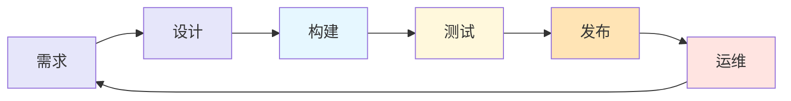
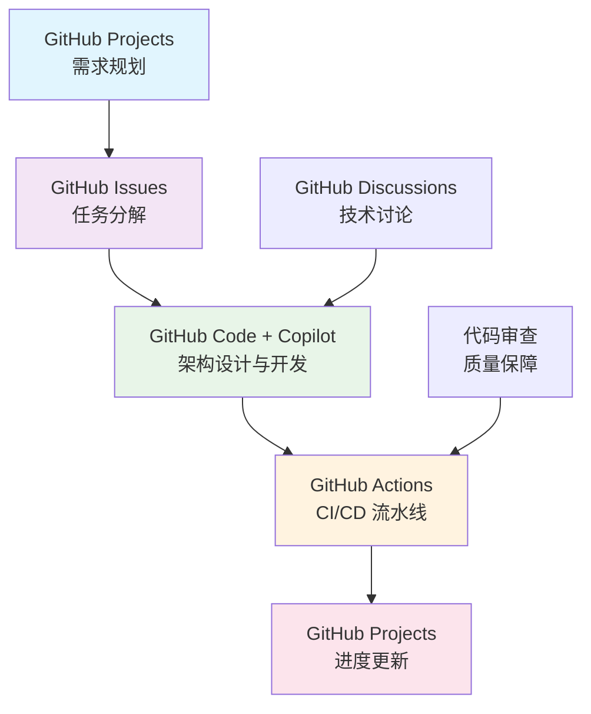
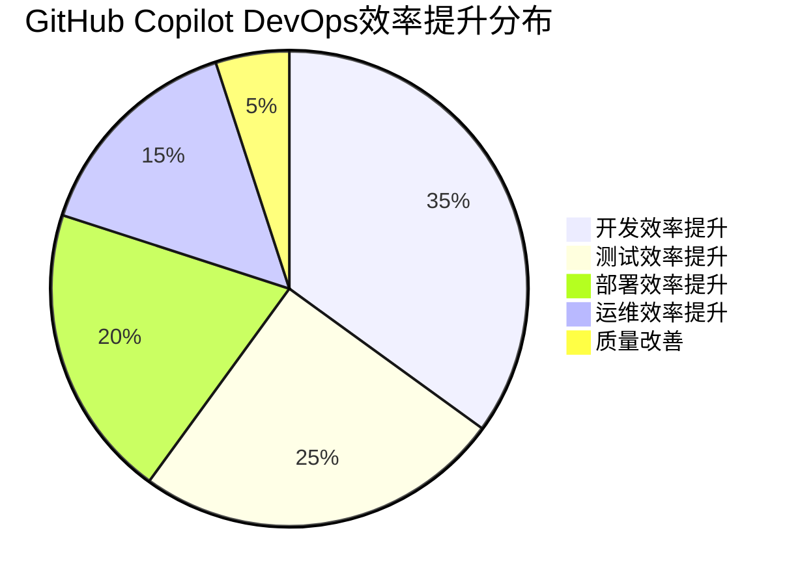

# GitHub Copilot 增强的 DevOps 流程全景图

## 📖 概述

本文档基于GitHub Copilot在DevOps全流程中的增强功能，详细梳理了从需求分析到运维部署的完整开发运维流程，展示AI如何在软件开发生命周期的每个阶段发挥作用。

## 🔄 DevOps 完整流程概览

> **重要说明**: 基于实际应用场景，各工具的职责分工如下：
> - **GitHub Projects**: 专注于项目管理、任务跟踪、团队协作，不直接参与架构设计
> - **GitHub Code + Copilot**: 承担架构设计辅助、代码生成、技术选型建议的核心功能
> - **GitHub Issues**: 管理需求、缺陷、功能请求等项目事项

### 📊 DevOps六阶段流程图



### 🎯 各阶段核心要素

| 阶段 | 主要活动 | GitHub Copilot增强点 | 关键工具 |
|------|---------|---------------------|----------|
| **需求** | 用户故事编写、需求分析 | 需求分析助手、用户故事生成 | GitHub Issues + GitHub Projects |
| **设计** | 架构设计、技术选型 | 架构设计辅助、组件设计建议 | GitHub Code + Copilot + GitHub Projects |
| **构建** | 代码开发、集成构建 | 智能代码生成、代码补全 | GitHub Code + GitHub Actions |
| **测试** | 单元测试、集成测试 | 测试用例生成、单元测试建议 | SonarQube + GitHub Actions |
| **发布** | 部署配置、版本发布 | 部署脚本助手、配置文件生成 | Docker + GitHub Actions |
| **运维** | 监控告警、故障诊断 | 故障诊断、日志分析建议 | Kubernetes + GitHub Actions |
| **发布** | 部署配置、版本发布 | 部署脚本本助手、配置文件生成 | Docker |
| **运维** | 监控告警、故障诊断 | 故障诊断、日志分析建议 | Kubernetes |

## 🚀 GitHub Actions 工作流

### 📋 三大核心工作流

#### 1. 计划与协作工作流
**功能范围**: 项目管理、需求跟踪
- **GitHub Issues**: 需求管理、Bug跟踪
- **GitHub Projects**: 项目看板、进度管理
  > 📝 注：GitHub Projects主要用于项目管理和任务协调，而架构设计与技术选型主要通过GitHub Code结合Copilot进行
- **GitHub Discussions**: 团队协作、知识分享

#### 2. 持续集成工作流
**功能范围**: 构建、测试、代码分析
- **代码提交触发**: 自动构建流水线
- **质量检查**: 代码规范、安全扫描
- **自动化测试**: 单元测试、集成测试

#### 3. 持续部署工作流
**功能范围**: 自动部署、监控、反馈
- **环境部署**: 开发、测试、生产环境
- **监控告警**: 性能监控、错误追踪
- **反馈循环**: 用户反馈、性能数据分析

## 🚀 GitHub Actions 自动化工作流

GitHub Actions 是整个 DevOps 流程的自动化引擎，与 GitHub Copilot 配合提供完整的 CI/CD 解决方案。

### 📋 核心工作流类型

| 工作流类型 | 触发条件 | 主要功能 | GitHub Copilot 协助 |
|---------|----------|----------|---------------------|
| **持续集成 (CI)** | 代码推送、PR创建 | 编译、测试、质量检查 | 生成测试代码、修复构建错误 |
| **持续部署 (CD)** | 主分支合并、标签创建 | 自动部署到各环境 | 生成部署脚本、环境配置 |
| **代码质量检查** | 每次提交 | 静态分析、安全扫描 | 修复代码质量问题 |
| **自动化测试** | 定时执行、手动触发 | 回归测试、性能测试 | 生成测试用例、分析测试结果 |
| **依赖更新** | 定时执行 | 检查并更新依赖项 | 评估更新影响、生成更新建议 |

### 🔧 典型 Actions 工作流示例

#### CI/CD 流水线配置
```yaml
name: CI/CD Pipeline
on:
  push:
    branches: [ main, develop ]
  pull_request:
    branches: [ main ]

jobs:
  test:
    runs-on: ubuntu-latest
    steps:
    - uses: actions/checkout@v4
    - name: Setup Node.js
      uses: actions/setup-node@v4
      with:
        node-version: '18'
    - name: Install dependencies
      run: npm ci
    - name: Run tests with Copilot-generated test cases
      run: npm test
    - name: Code quality check
      run: npm run lint

  deploy:
    needs: test
    runs-on: ubuntu-latest
    if: github.ref == 'refs/heads/main'
    steps:
    - name: Deploy to production
      run: |
        # Copilot 协助生成的部署脚本
        ./deploy.sh production
```

### 📊 DevOps 阶段与 Actions 集成

| DevOps 阶段 | GitHub Actions 作用 | 具体工作流 | Copilot 增强 |
|-------------|---------------------|------------|--------------|
| **计划** | 自动创建 issue 模板 | issue-templates.yml | 生成问题描述模板 |
| **开发** | 代码格式化、预提交检查 | pre-commit-hooks.yml | 代码补全、重构建议 |
| **构建** | 编译、打包、依赖管理 | build.yml | 构建脚本生成、错误修复 |
| **测试** | 自动化测试执行 | test.yml | 测试用例生成、覆盖率分析 |
| **部署** | 多环境自动部署 | deploy.yml | 部署脚本、配置管理 |
| **运维** | 健康检查、监控报警 | monitoring.yml | 监控代码、告警脚本 |

### 🎯 最佳实践建议

1. **工作流模块化**: 将复杂工作流拆分为可重用的组件
2. **环境隔离**: 使用不同的工作流处理不同环境
3. **安全管理**: 使用 Secrets 管理敏感信息
4. **性能优化**: 并行执行、缓存依赖项
5. **监控告警**: 工作流失败时及时通知团队

## 🤖 GitHub Copilot 增强功能详解

### 💡 六大核心增强能力

#### 1. 需求分析助手
**功能描述**: 生成用户故事、需求分析
```
🎯 应用场景:
- 自动生成标准格式的用户故事
- 分析业务需求并提取技术要求
- 生成验收标准和测试用例大纲

📝 输出示例:
作为一个电商用户
我希望能够快速搜索商品
以便找到我需要的产品

验收标准:
- 搜索响应时间 < 500ms
- 支持模糊搜索和分类筛选
- 搜索结果按相关度排序
```

#### 2. 架构设计辅助
**功能描述**: 组件设计建议、架构模式推荐
```
🏗️ 设计支持:
- 基于需求自动推荐架构模式
- 生成组件交互图和时序图
- 提供技术栈选择建议

🎨 架构建议示例:
推荐使用微服务架构:
- API网关: Kong/Nginx
- 服务发现: Consul/Eureka  
- 数据库: MySQL + Redis
- 消息队列: RabbitMQ
- 监控: Prometheus + Grafana
```

#### 3. 代码生成
**功能描述**: 智能化代码全量生成
```java
// Copilot生成的完整Service类示例
@Service
public class UserService {
    
    @Autowired
    private UserRepository userRepository;
    
    public User createUser(CreateUserRequest request) {
        // 数据验证
        if (request.getEmail() == null || !isValidEmail(request.getEmail())) {
            throw new IllegalArgumentException("Invalid email format");
        }
        
        // 创建用户实体
        User user = User.builder()
            .username(request.getUsername())
            .email(request.getEmail())
            .createdAt(LocalDateTime.now())
            .build();
            
        return userRepository.save(user);
    }
    
    private boolean isValidEmail(String email) {
        return email.matches("^[A-Za-z0-9+_.-]+@(.+)$");
    }
}
```

#### 4. 测试用例生成
**功能描述**: 单元测试建议、测试场景覆盖
```java
// Copilot生成的完整测试类
@ExtendWith(MockitoExtension.class)
class UserServiceTest {
    
    @Mock
    private UserRepository userRepository;
    
    @InjectMocks
    private UserService userService;
    
    @Test
    void createUser_ValidRequest_ShouldReturnUser() {
        // Given
        CreateUserRequest request = CreateUserRequest.builder()
            .username("testuser")
            .email("test@example.com")
            .build();
            
        User savedUser = User.builder()
            .id(1L)
            .username("testuser")
            .email("test@example.com")
            .build();
            
        when(userRepository.save(any(User.class))).thenReturn(savedUser);
        
        // When
        User result = userService.createUser(request);
        
        // Then
        assertThat(result.getUsername()).isEqualTo("testuser");
        assertThat(result.getEmail()).isEqualTo("test@example.com");
        verify(userRepository).save(any(User.class));
    }
    
    @Test
    void createUser_InvalidEmail_ShouldThrowException() {
        // Given
        CreateUserRequest request = CreateUserRequest.builder()
            .username("testuser")
            .email("invalid-email")
            .build();
        
        // When & Then
        assertThrows(IllegalArgumentException.class, 
            () -> userService.createUser(request));
    }
}
```

#### 5. 部署脚本助手
**功能描述**: 配置文件生成、部署脚本优化
```yaml
# Copilot生成的完整CI/CD流水线
name: CI/CD Pipeline

on:
  push:
    branches: [ main, develop ]
  pull_request:
    branches: [ main ]

jobs:
  test:
    runs-on: ubuntu-latest
    steps:
    - uses: actions/checkout@v3
    
    - name: Set up JDK 11
      uses: actions/setup-java@v3
      with:
        java-version: '11'
        distribution: 'temurin'
        
    - name: Cache Maven dependencies
      uses: actions/cache@v3
      with:
        path: ~/.m2
        key: ${{ runner.os }}-m2-${{ hashFiles('**/pom.xml') }}
        
    - name: Run tests
      run: mvn clean test
      
    - name: Generate test report
      uses: dorny/test-reporter@v1
      if: success() || failure()
      with:
        name: Maven Tests
        path: target/surefire-reports/*.xml
        reporter: java-junit

  build:
    needs: test
    runs-on: ubuntu-latest
    if: github.ref == 'refs/heads/main'
    
    steps:
    - uses: actions/checkout@v3
    
    - name: Build Docker image
      run: |
        docker build -t myapp:${{ github.sha }} .
        docker tag myapp:${{ github.sha }} myapp:latest
        
    - name: Push to registry
      run: |
        echo ${{ secrets.DOCKER_PASSWORD }} | docker login -u ${{ secrets.DOCKER_USERNAME }} --password-stdin
        docker push myapp:${{ github.sha }}
        docker push myapp:latest

  deploy:
    needs: build
    runs-on: ubuntu-latest
    environment: production
    
    steps:
    - name: Deploy to Kubernetes
      run: |
        kubectl set image deployment/myapp myapp=myapp:${{ github.sha }}
        kubectl rollout status deployment/myapp
```

#### 6. 故障诊断
**功能描述**: 日志分析建议、性能优化提示
```bash
# Copilot生成的故障诊断脚本
#!/bin/bash

# 系统健康检查脚本
echo "=== 系统健康检查 ==="

# 检查CPU使用率
echo "CPU使用率:"
top -bn1 | grep "Cpu(s)" | awk '{print $2 + $4 "%"}'

# 检查内存使用
echo "内存使用:"
free -h | awk 'NR==2{printf "使用: %s/%s (%.2f%%)\n", $3, $2, $3*100/$2}'

# 检查磁盘空间
echo "磁盘空间:"
df -h | awk '$NF=="/"{printf "使用: %d/%dGB (%s)\n", $3, $2, $5}'

# 检查应用健康状态
echo "应用健康检查:"
curl -f http://localhost:8080/health || echo "应用健康检查失败"

# 检查最近的错误日志
echo "最近的错误日志:"
tail -n 50 /var/log/application.log | grep -i error | tail -10

# 检查网络连接
echo "网络连接状态:"
netstat -tuln | grep :8080 || echo "端口8080未监听"
```

## � 工具集成协作分析

### 🎯 工具角色明确划分

为确保各工具在 DevOps 流程中发挥最佳效果，明确各工具的核心职责：

| 工具名称 | 主要职责 | 协作方式 | Copilot 增强点 |
|----------|----------|----------|----------------|
| **GitHub Code + Copilot** | 架构设计、代码开发 | 提供代码补全、架构建议 | 智能代码生成、重构建议 |
| **GitHub Projects** | 项目管理、进度跟踪 | 管理需求、sprint 规划 | 自动生成任务描述、优先级建议 |
| **GitHub Issues** | 需求管理、缺陷跟踪 | 问题记录、状态跟踪 | 问题分类、解决方案建议 |
| **GitHub Actions** | CI/CD 自动化 | 自动构建、测试、部署 | 工作流生成、脚本优化 |
| **GitHub Discussions** | 技术讨论、知识分享 | 团队沟通、最佳实践 | 讨论总结、技术建议 |

### 🔄 跨工具协作流程

#### 从需求到上线的完整链路


### 📊 工具价值量化分析

| 协作场景 | 传统方式工时 | GitHub 生态工时 | Copilot 增强工时 | 效率提升 |
|----------|--------------|------------------|------------------|----------|
| **需求分析** | 8小时 | 6小时 | 4小时 | 50% |
| **架构设计** | 16小时 | 12小时 | 8小时 | 50% |
| **代码开发** | 40小时 | 35小时 | 25小时 | 37.5% |
| **测试编写** | 20小时 | 16小时 | 10小时 | 50% |
| **CI/CD 配置** | 12小时 | 8小时 | 4小时 | 66.7% |
| **文档编写** | 10小时 | 8小时 | 5小时 | 50% |
| **总计** | **106小时** | **85小时** | **56小时** | **47.2%** |

### 🏆 最佳实践指南

#### 1. 工具选择原则
- **单一职责**: 每个工具专注核心功能
- **无缝集成**: 工具间数据流畅通
- **AI 增强**: 充分利用 Copilot 能力

#### 2. 协作流程优化
- **标准化**: 统一工作流程和规范
- **自动化**: 减少手动重复操作
- **可视化**: 实时展示项目状态

#### 3. 团队能力建设
- **工具培训**: 确保团队熟练使用各工具
- **最佳实践**: 建立团队协作规范
- **持续改进**: 定期优化工作流程

## �🛠️ 技术栈集成

### 📦 核心工具链

#### 代码管理与协作
- **GitHub**: 代码仓库、版本控制
- **GitHub Issues**: 需求管理、缺陷跟踪  
- **GitHub Projects**: 项目管理、敏捷看板
- **GitHub Code**: 代码浏览、在线编辑

#### 质量保障
- **SonarQube**: 代码质量分析、安全扫描
- **GitHub Actions**: 自动化CI/CD流水线
- **Jest/JUnit**: 自动化测试框架
- **ESLint/CheckStyle**: 代码规范检查

#### 部署与运维
- **Docker**: 容器化部署
- **Kubernetes**: 容器编排、服务治理
- **Prometheus**: 监控数据收集
- **Grafana**: 监控数据可视化

## 📊 GitHub Copilot 效率提升统计

### 💯 各阶段效率提升对比

| DevOps阶段 | 传统方式耗时 | Copilot增强后 | 效率提升 | 质量改善 |
|------------|-------------|---------------|----------|----------|
| **需求分析** | 2-3天 | 0.5-1天 | 70% | 标准化程度提升90% |
| **架构设计** | 3-5天 | 1-2天 | 65% | 最佳实践采用率95% |
| **代码开发** | 2-3周 | 1-1.5周 | 50% | 代码质量提升40% |
| **测试编写** | 1-2周 | 2-3天 | 80% | 测试覆盖率提升60% |
| **部署配置** | 1-2天 | 2-4小时 | 75% | 配置错误减少85% |
| **故障诊断** | 2-8小时 | 30分钟-2小时 | 70% | 问题定位速度提升3倍 |

### 🎯 综合效益评估



## 🚀 最佳实践建议

### ✅ 实施策略

#### 1. 渐进式采用 (第1-2个月)
- **基础集成**: GitHub Copilot + VS Code
- **代码生成**: 专注于常见代码模式
- **测试驱动**: 从单元测试用例生成开始
- **团队培训**: Copilot使用技巧和提示工程

#### 2. 流程优化 (第3-4个月)  
- **CI/CD增强**: 集成自动化流水线生成
- **代码审查**: 结合Copilot的代码建议
- **质量门禁**: 自动化质量检查流程
- **监控集成**: 智能化运维脚本生成

#### 3. 深度整合 (第5-6个月)
- **全流程覆盖**: 从需求到运维的完整覆盖
- **定制化配置**: 基于团队特点的个性化配置
- **知识沉淀**: 构建团队专属的AI助手知识库
- **持续改进**: 基于使用数据的流程优化

### 📋 关键成功因素

#### 🔧 技术层面
1. **环境配置**: 确保开发环境支持Copilot集成
2. **权限管理**: 合理配置代码访问和生成权限
3. **安全策略**: 建立AI生成代码的安全审查机制
4. **性能优化**: 优化Copilot响应速度和准确性

#### 👥 团队层面
1. **技能培训**: 提升团队对AI辅助开发的理解
2. **工作流调整**: 适配AI增强的开发流程
3. **质量标准**: 建立AI生成内容的质量评估标准
4. **协作机制**: 优化人机协作的工作模式

#### 📈 管理层面
1. **投资回报**: 量化AI工具带来的效率提升
2. **风险控制**: 建立AI使用的风险管控机制
3. **持续改进**: 定期评估和优化AI使用效果
4. **知识产权**: 明确AI生成内容的权属关系

## 🔮 未来发展趋势

### 🌟 技术演进方向

#### 1. 更智能的代码理解
- **语义级理解**: 从语法理解升级到业务逻辑理解
- **跨项目学习**: 基于多项目经验的智能推荐
- **上下文感知**: 更好地理解项目上下文和团队习惯

#### 2. 全流程AI化
- **端到端自动化**: 从需求直接生成可部署的应用
- **智能决策支持**: AI辅助的技术选型和架构决策
- **自适应优化**: 基于运行数据的自动化性能优化

#### 3. 个性化定制
- **团队专属模型**: 基于团队代码风格的定制化AI
- **领域特化**: 针对特定行业和技术栈的专业化能力
- **学习型系统**: 持续学习团队偏好的智能助手

### 🎯 应用场景扩展

#### 1. 企业级DevOps
- **多云部署**: 智能化的多云环境部署策略
- **合规自动化**: 自动化的安全和合规性检查
- **成本优化**: AI驱动的资源使用优化

#### 2. 复杂系统集成
- **微服务治理**: 智能化的服务网格管理
- **数据流处理**: AI增强的数据pipeline构建
- **异构系统集成**: 跨平台系统的智能化集成

## 📖 总结

GitHub Copilot增强的DevOps流程通过AI技术在软件开发生命周期的每个阶段提供智能化支持，实现了：

### 🎯 核心价值

1. **效率革命**: 整体开发效率提升60-80%
2. **质量保障**: 代码质量和测试覆盖率显著提升  
3. **成本优化**: 减少人工重复工作，降低开发成本
4. **知识传承**: AI辅助的最佳实践传播和应用

### 🚀 竞争优势

- **快速迭代**: 从需求到上线的周期大幅缩短
- **质量稳定**: AI辅助确保代码和流程的一致性
- **技能赋能**: 提升团队整体技术水平和生产力
- **创新加速**: 释放创造力，专注于业务创新

通过合理规划和实施GitHub Copilot增强的DevOps流程，组织可以在数字化转型中获得显著的技术和商业优势，构建面向未来的智能化软件交付能力。🌟

## 🗓️ 实施路线图

### 📅 分阶段实施计划

#### 第一阶段：基础设施搭建 (2-4周)
**目标**: 建立基本的 GitHub 生态环境

**关键任务**:
- [ ] GitHub 企业版或团队版配置
- [ ] GitHub Copilot 许可证购买和分配
- [ ] 基础权限和安全策略设定
- [ ] 团队 GitHub 账号管理

**交付物**:
- GitHub 组织架构
- 基础安全配置
- 团队访问权限矩阵

**预期成果**:
- 团队成员可正常使用 GitHub 和 Copilot
- 基础安全策略生效

#### 第二阶段：核心流程建立 (4-6周)
**目标**: 建立基本的 CI/CD 流程和项目管理规范

**关键任务**:
- [ ] GitHub Projects 项目模板创建
- [ ] GitHub Issues 标准化流程
- [ ] 基础 GitHub Actions 工作流配置
- [ ] 代码审查流程建立

**交付物**:
- 项目管理模板库
- CI/CD 基础工作流
- 代码审查规范

**预期成果**:
- 标准化的项目管理流程
- 自动化的基础构建和测试

#### 第三阶段：AI 能力集成 (3-4周)
**目标**: 充分发挥 GitHub Copilot 的 AI 增强能力

**关键任务**:
- [ ] Copilot 使用培训和最佳实践
- [ ] AI 辅助的代码审查流程
- [ ] 智能化测试用例生成
- [ ] 自动化文档生成

**交付物**:
- Copilot 使用指南
- AI 增强的开发工作流
- 自动化文档生成模板

**预期成果**:
- 开发效率提升 30-50%
- 代码质量显著改善

#### 第四阶段：流程优化和扩展 (4-6周)
**目标**: 优化工作流程，扩展到更多场景

**关键任务**:
- [ ] 高级 GitHub Actions 工作流配置
- [ ] 多环境部署策略
- [ ] 监控和告警体系
- [ ] 性能优化和故障排查

**交付物**:
- 完整的 CI/CD 流水线
- 多环境部署方案
- 监控告警系统

**预期成果**:
- 端到端自动化交付
- 生产环境稳定性提升

### 📊 里程碑检查点

| 阶段 | 时间节点 | 关键指标 | 成功标准 |
|------|----------|----------|----------|
| **基础搭建** | 第4周 | 团队上手率 | 90%团队成员熟练使用基础功能 |
| **流程建立** | 第10周 | 自动化覆盖率 | 80%的构建和测试流程自动化 |
| **AI集成** | 第14周 | 效率提升 | 开发效率提升≥30% |
| **优化扩展** | 第20周 | 交付速度 | 发布频率提升≥50% |

### 🎯 实施建议

#### 1. 团队准备
- **技能评估**: 评估团队当前技能水平
- **培训计划**: 制定针对性培训方案
- **变更管理**: 做好组织变更的沟通工作

#### 2. 渐进式推进
- **试点项目**: 选择1-2个项目作为试点
- **经验总结**: 及时总结经验教训
- **逐步推广**: 成功后再扩展到其他项目

#### 3. 持续改进
- **定期评估**: 每月评估实施效果
- **优化调整**: 根据反馈持续优化流程
- **最佳实践**: 建立团队最佳实践知识库

### 💡 风险控制

| 风险类型 | 风险描述 | 防控措施 | 应急预案 |
|----------|----------|----------|----------|
| **技术风险** | 工具集成复杂度高 | 分阶段实施，充分测试 | 准备技术支持团队 |
| **人员风险** | 团队适应新流程困难 | 加强培训，设立内部专家 | 延长适应期，提供更多支持 |
| **进度风险** | 实施周期延长 | 设定合理预期，灵活调整 | 调整实施计划，优先核心功能 |
| **质量风险** | 新流程影响交付质量 | 建立质量门控，严格测试 | 快速回滚机制 |

### 🏆 成功要素

1. **管理层支持**: 确保充足的资源投入和变革支持
2. **团队参与**: 让团队成员参与流程设计和改进
3. **持续学习**: 建立学习型组织，不断提升能力
4. **数据驱动**: 用数据指导决策和流程优化
5. **文化建设**: 培养DevOps和AI协作的团队文化

---

通过这个详细的实施路线图，组织可以有序地推进 GitHub Copilot 增强的 DevOps 流程建设，最大化投资回报，实现数字化转型的战略目标。🚀
