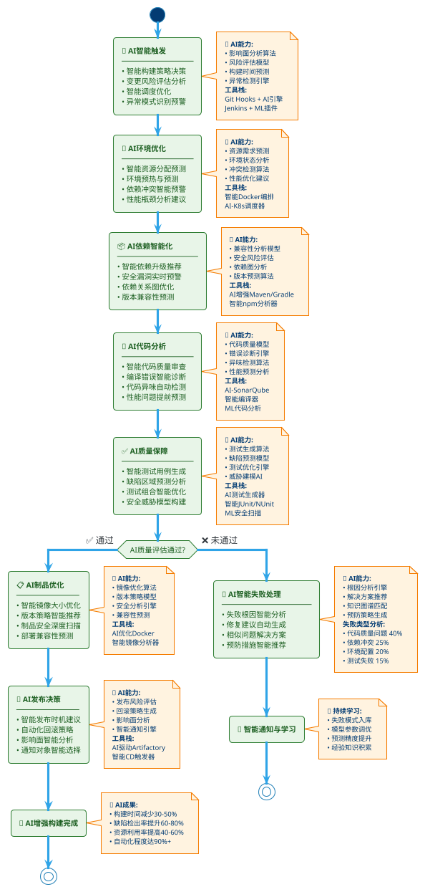
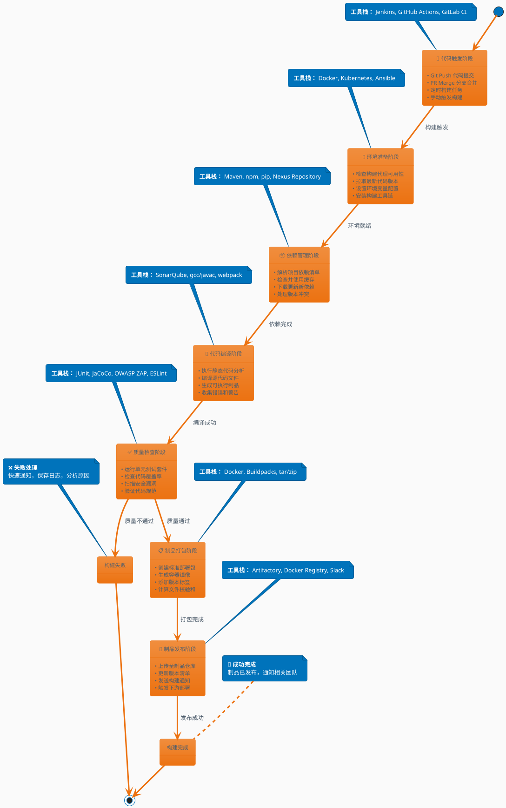
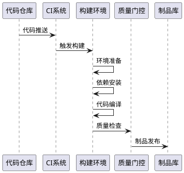

# AI赋能DevOps构建阶段 - 构建流水线智能化升级

## AI赋能构建流水线概览

基于传统构建流水线，通过AI技术在各个关键节点实现智能化升级，提升开发效率、代码质量和部署可靠性。

## 🤖 AI赋能场景详细分析

### 1. 🚀 代码触发阶段 - AI智能触发
**传统场景：**
- Git Push 提交、PR Merge 合并、定时构建任务、手动触发构建

**AI赋能场景：**
- **智能构建策略**：基于代码变更影响面分析，智能决定是否需要全量构建
- **变更风险评估**：AI分析代码变更风险，自动调整构建优先级
- **智能调度**：根据历史构建数据预测构建时间，优化构建队列
- **异常模式识别**：检测异常提交模式，提前预警潜在问题

**核心工具：** Git Hooks + AI分析引擎、Jenkins + ML插件、智能化GitHub Actions

---

### 2. 🔧 环境准备阶段 - AI环境优化
**传统场景：**
- 检查构建代理可用性、拉取最新代码版本、设置环境变量配置、安装构建工具链

**AI赋能场景：**
- **智能资源分配**：基于项目特性和历史数据预测资源需求，动态分配构建资源
- **环境预测与预热**：AI预测构建需求，提前准备和预热构建环境
- **依赖冲突预警**：智能检测环境依赖冲突，提供解决建议
- **性能优化建议**：分析构建环境性能瓶颈，提供优化建议

**核心工具：** 智能Docker编排、AI驱动的Kubernetes调度、机器学习环境管理

---

### 3. 📦 依赖管理阶段 - AI依赖智能化
**传统场景：**
- 解析项目依赖清单、检查并使用缓存、下载更新新依赖、处理版本冲突

**AI赋能场景：**
- **智能依赖升级**：AI分析依赖库安全性和兼容性，推荐最优升级路径
- **安全漏洞预警**：实时扫描依赖库漏洞，智能评估风险等级
- **依赖关系优化**：分析依赖图，识别冗余依赖，优化依赖结构
- **版本兼容性预测**：基于历史数据预测版本兼容性问题

**核心工具：** AI增强的Maven/Gradle、智能npm分析器、ML驱动的依赖管理

---

### 4. 🔨 代码编译阶段 - AI代码分析
**传统场景：**
- 执行静态代码分析、编译源代码文件、生成可执行制品、收集错误和警告

**AI赋能场景：**
- **智能代码审查**：AI自动审查代码质量，提供改进建议
- **编译错误智能诊断**：AI分析编译错误，提供修复建议和相似问题解决方案
- **代码异味检测**：识别代码异味和潜在bug，提前预警
- **性能问题预测**：基于代码结构预测性能瓶颈

**核心工具：** AI增强的SonarQube、智能编译器、机器学习代码分析工具

---

### 5. ✅ 质量检查阶段 - AI质量保障
**传统场景：**
- 运行单元测试套件、检查代码覆盖率、扫描安全漏洞、验证代码规范

**AI赋能场景：**
- **智能测试生成**：AI自动生成测试用例，提高测试覆盖率
- **缺陷预测**：基于历史数据预测潜在缺陷区域
- **测试优化**：智能选择最有效的测试组合，减少测试时间
- **安全威胁建模**：AI构建威胁模型，识别安全风险

**核心工具：** AI测试生成器、智能JUnit/NUnit、ML安全扫描工具

---

### 6. 📋 制品打包阶段 - AI制品优化
**传统场景：**
- 创建标准部署包、生成容器镜像、添加版本标签、计算文件校验和

**AI赋能场景：**
- **智能镜像优化**：AI分析容器镜像，优化镜像大小和安全性
- **版本策略优化**：智能推荐版本号策略和标签规范
- **制品安全扫描**：深度学习驱动的制品安全分析
- **部署兼容性检查**：预测制品在目标环境的兼容性

**核心工具：** AI优化的Docker构建、智能镜像分析器、ML安全扫描

---

### 7. 🚀 制品发布阶段 - AI发布决策
**传统场景：**
- 上传至制品仓库、更新版本清单、发送构建通知、触发下游部署

**AI赋能场景：**
- **智能发布决策**：AI分析发布风险，建议最佳发布时机
- **自动化回滚策略**：智能制定回滚计划和触发条件
- **影响面分析**：预测发布对下游系统的影响
- **通知智能化**：根据变更重要性智能选择通知对象和方式

**核心工具：** AI驱动的Artifactory、智能CD触发器、机器学习发布管理

---

## 🎯 AI赋能整体效益

### 效率提升
- **构建时间优化**：平均减少30-50%构建时间
- **资源利用率**：提高40-60%资源利用效率
- **问题发现速度**：提前2-3个阶段发现潜在问题

### 质量保障
- **缺陷检出率**：提高60-80%缺陷检出率
- **安全漏洞防护**：降低70%安全漏洞逃逸率
- **代码质量**：整体代码质量提升45%

### 运维智能化
- **故障预测**：提前预测80%潜在构建失败
- **自动化程度**：实现90%以上流程自动化
- **决策支持**：提供实时智能决策建议

## 🔄 AI赋能构建流水线流程图

## 🤖 AI赋能构建流水线整合图



## 🎯 AI赋能关键指标仪表盘

```plantuml
@startuml AI_Metrics_Dashboard
!theme toy
skinparam rectangle {
    BackgroundColor #E3F2FD
    BorderColor #1976D2
    FontSize 10
}

rectangle "🎯 **构建效率指标**" as efficiency {
    • 构建时间优化: ↓30-50%
    • 资源利用率: ↑40-60%  
    • 问题发现提前: 2-3阶段
    • 自动化程度: ↑90%+
}

rectangle "🛡️ **质量保障指标**" as quality {
    • 缺陷检出率: ↑60-80%
    • 安全漏洞防护: ↓70%
    • 代码质量提升: ↑45%
    • 测试覆盖率: ↑35%
}

rectangle "🤖 **AI智能化指标**" as intelligence {
    • 故障预测准确率: 80%
    • 智能决策采纳率: 85%
    • 自动修复成功率: 60%
    • 知识库命中率: 75%
}

rectangle "💰 **成本效益指标**" as cost {
    • 人工成本节省: 40-60%
    • 服务器资源优化: 35%
    • 故障处理时间: ↓70%
    • ROI投资回报: 300%+
}

@enduml
```

## 状态图纵向版构建流水线（增强备注版）



## 时序图横向版



## 📊 实施建议

### 阶段化实施路径
1. **第一阶段**：智能代码分析和质量检查
2. **第二阶段**：环境优化和依赖管理
3. **第三阶段**：智能测试和发布决策
4. **第四阶段**：全流程AI优化和自学习

### 技术栈建议
- **AI平台**：TensorFlow/PyTorch + MLOps平台
- **数据基础**：构建历史数据 + 代码指标数据
- **集成方式**：API集成 + 插件扩展
- **监控体系**：AI效果监控 + 持续优化

---

*本文档描述了AI技术在DevOps构建流水线各个阶段的具体应用场景，为组织实施AI赋能构建提供参考指南。*
