# 标准DevOps流程体系全景图 📊

> **DevOps = Development + Operations**  
> 一套集成开发、测试、部署和运维的完整方法论

## 📋 目录

- [DevOps概述](#-devops概述)
- [核心理念与原则](#-核心理念与原则)
- [六大核心阶段](#-六大核心阶段)
- [工具链生态](#-工具链生态)
- [实施案例分析](#-实施案例分析)
- [最佳实践指南](#-最佳实践指南)
- [度量与评估](#-度量与评估)
- [实施路线图](#-实施路线图)

## 🎯 DevOps概述

### 定义与价值主张

DevOps是一种软件开发方法论，强调开发团队（Development）和运维团队（Operations）之间的协作与集成，通过自动化工具和流程实现：

- **🚀 更快的软件交付速度**
- **🛡️ 更高的软件质量和稳定性**
- **🔄 更好的团队协作和沟通**
- **📈 更强的业务响应能力**

### DevOps发展历程

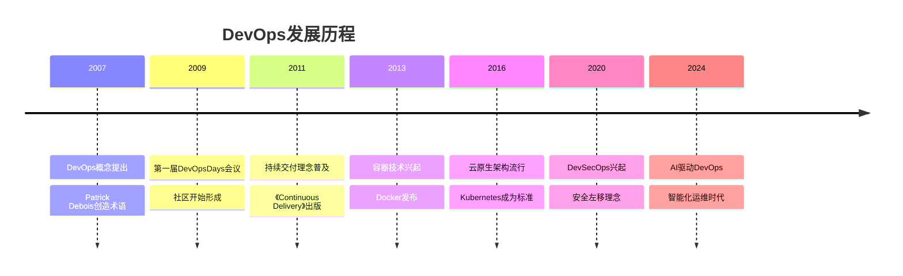

## 💡 核心理念与原则

### CALMS框架

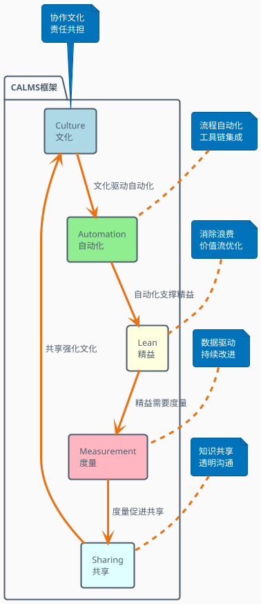

### 核心价值观

| 传统模式 | DevOps模式 | 价值提升 |
|----------|------------|----------|
| 部门孤岛 | 跨职能协作 | 沟通效率↑300% |
| 手工操作 | 自动化流程 | 部署速度↑1000% |
| 瀑布式开发 | 敏捷迭代 | 响应速度↑500% |
| 事后修复 | 预防为主 | 故障率↓80% |
| 经验决策 | 数据驱动 | 决策准确率↑200% |

## 🔄 六大核心阶段

### 完整DevOps生命周期

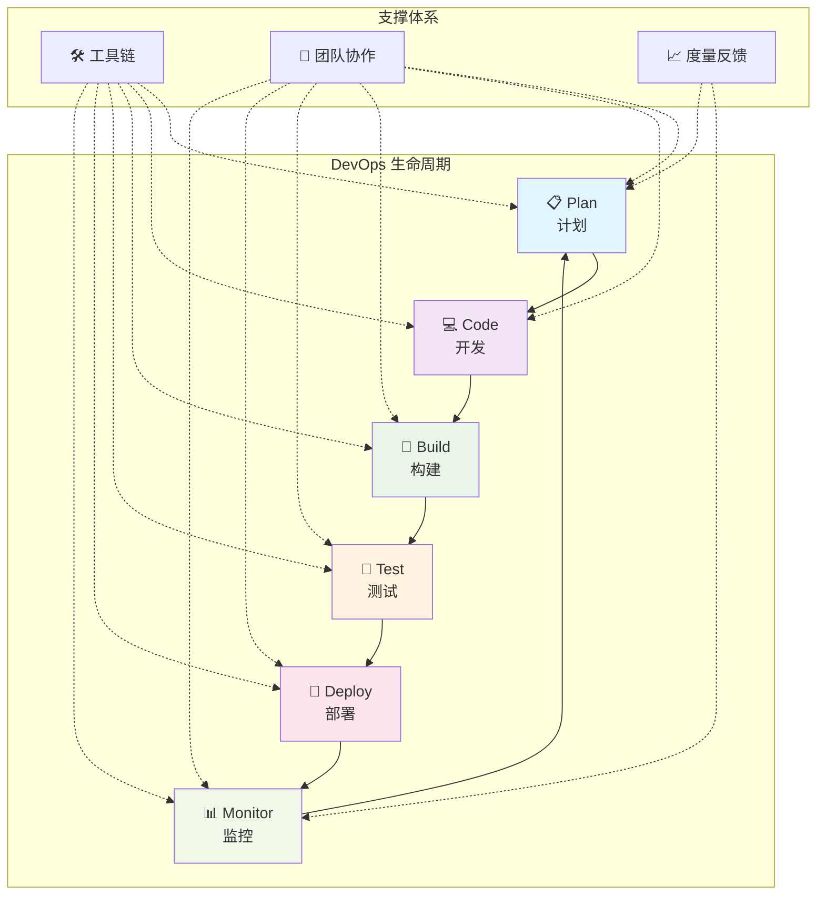

### 阶段一：📋 计划 (Plan)

**目标**: 需求分析、项目规划、资源配置

#### 核心活动
- **需求收集与分析**
- **项目规划与排期**
- **资源配置与预算**
- **风险评估与管理**

#### 关键工具
| 工具类别 | 代表工具 | 核心功能 |
|----------|----------|----------|
| 项目管理 | Jira, Azure DevOps | 需求管理、Sprint规划 |
| 协作沟通 | Slack, Microsoft Teams | 团队沟通、实时协作 |
| 文档管理 | Confluence, Notion | 需求文档、技术方案 |
| 版本规划 | ProductPlan, Roadmunk | 产品路线图、版本规划 |

#### 实践案例：电商平台新功能规划

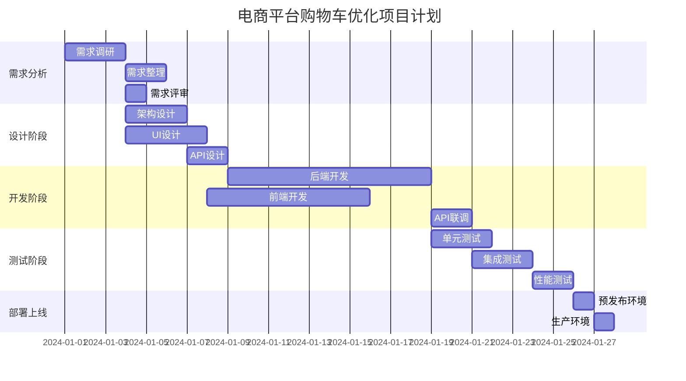

### 阶段二：💻 开发 (Code)

**目标**: 高质量代码开发、版本控制、代码审查

#### 核心活动
- **代码开发与编写**
- **版本控制管理**
- **代码审查与质量检查**
- **分支策略执行**

#### Git工作流模型

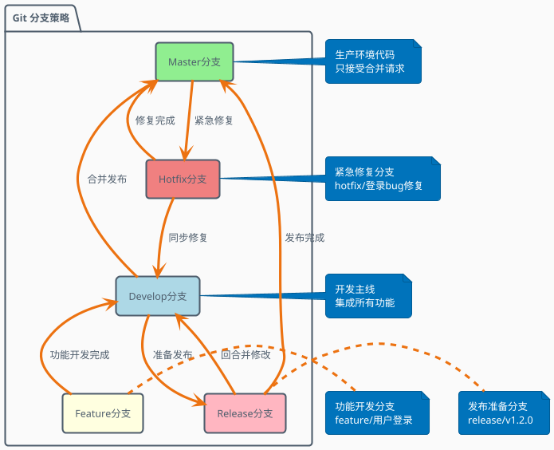

#### 代码质量保障体系

| 质量维度 | 检查工具 | 质量标准 | 自动化程度 |
|----------|----------|----------|------------|
| **代码规范** | ESLint, SonarQube | 0 Critical issues | 100% 自动化 |
| **单元测试** | Jest, JUnit | 覆盖率 ≥ 80% | 100% 自动化 |
| **安全扫描** | OWASP ZAP, Snyk | 0 High risk漏洞 | 100% 自动化 |
| **代码审查** | GitHub PR, GitLab MR | 至少2人审查 | 50% 自动化 |
| **性能检查** | Lighthouse, WebPageTest | 性能分数 ≥ 90 | 80% 自动化 |

### 阶段三：🔨 构建 (Build)

**目标**: 自动化构建、依赖管理、制品生成

#### 构建流水线架构

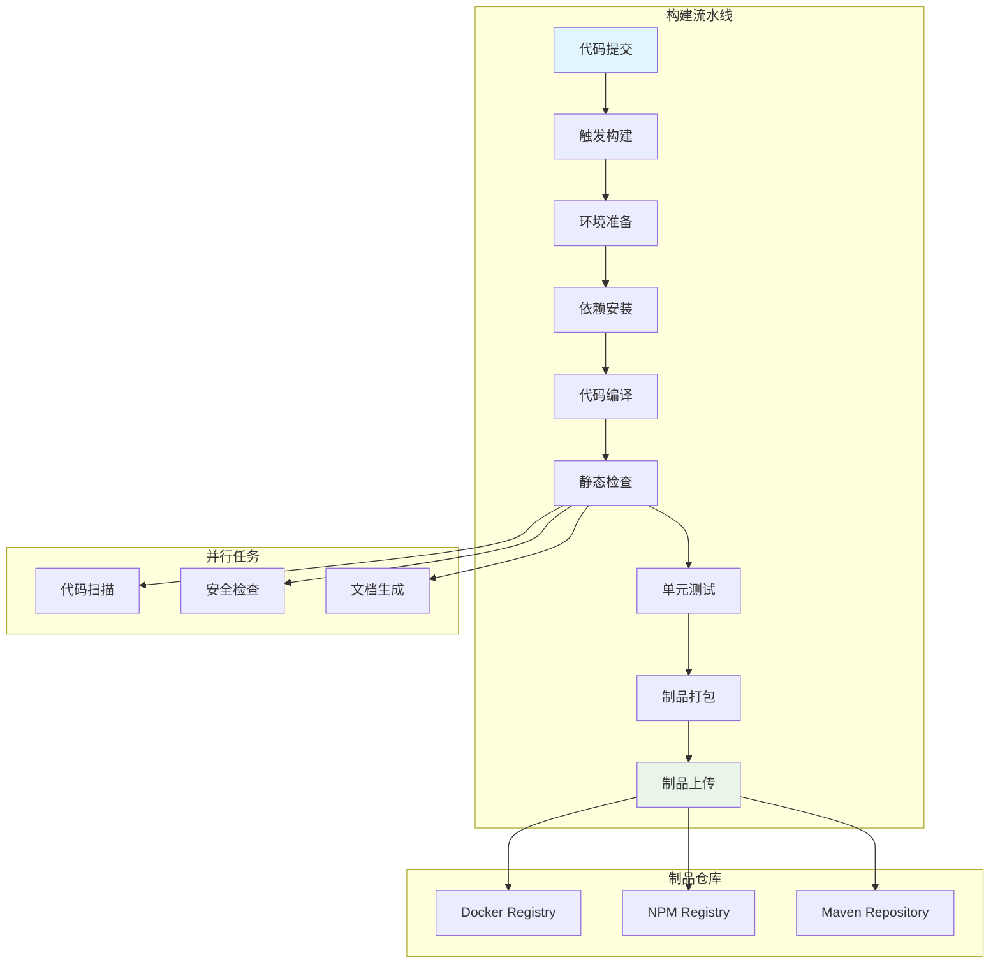

#### 构建工具对比分析

| 构建工具 | 适用场景 | 优势 | 劣势 |
|----------|----------|------|------|
| **Jenkins** | 传统企业、复杂流水线 | 插件丰富、高度可定制 | 维护成本高、界面老旧 |
| **GitLab CI** | 一体化DevOps平台 | 配置简单、集成度高 | 功能相对有限 |
| **Azure DevOps** | 微软生态、企业级 | 企业级功能、云原生 | 成本较高、学习曲线 |
| **GitHub Actions** | 开源项目、云原生 | 易用性好、生态丰富 | 执行时间有限制 |

### 阶段四：🧪 测试 (Test)

**目标**: 全面质量保证、自动化测试、性能验证

#### 测试金字塔模型

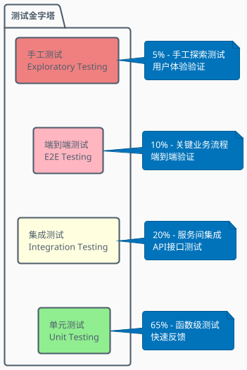

#### 测试策略与实践

| 测试类型 | 执行频率 | 自动化率 | 平均耗时 | 价值定位 |
|----------|----------|----------|----------|----------|
| **单元测试** | 每次提交 | 100% | 2-5分钟 | 快速反馈、回归保障 |
| **集成测试** | 每日构建 | 90% | 10-30分钟 | 接口验证、数据一致性 |
| **性能测试** | 每周执行 | 80% | 30-60分钟 | 性能基线、容量规划 |
| **安全测试** | 每次发布 | 70% | 20-45分钟 | 漏洞扫描、合规检查 |
| **端到端测试** | 每次发布 | 60% | 60-120分钟 | 业务流程、用户体验 |

#### 实际案例：电商系统测试策略

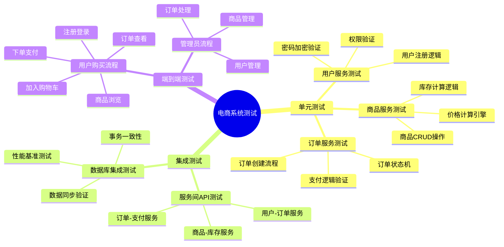

### 阶段五：🚀 部署 (Deploy)

**目标**: 自动化部署、环境管理、发布策略

#### 部署环境架构

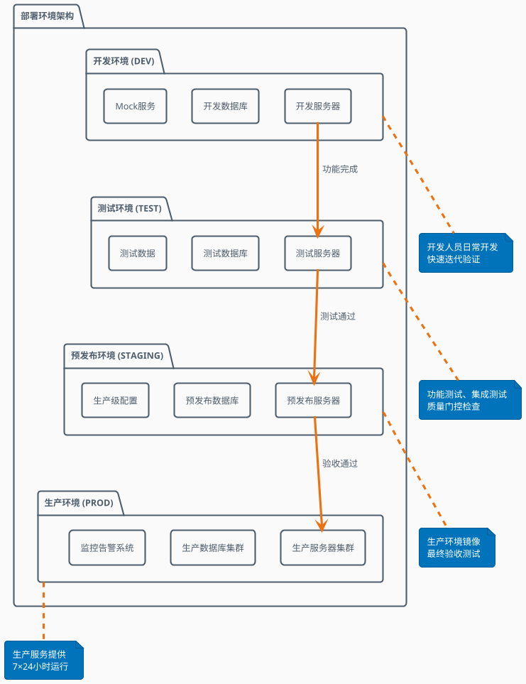

#### 部署策略对比

| 部署策略 | 风险等级 | 回滚时间 | 用户影响 | 适用场景 |
|----------|----------|----------|----------|----------|
| **蓝绿部署** | 低 | 秒级 | 无 | 关键业务系统 |
| **滚动部署** | 中 | 分钟级 | 部分 | 微服务架构 |
| **金丝雀部署** | 低 | 分钟级 | 最小 | 新功能验证 |
| **A/B测试** | 低 | 分钟级 | 无 | 功能效果验证 |
| **影子部署** | 最低 | 无需回滚 | 无 | 性能测试 |

#### 容器化部署流程

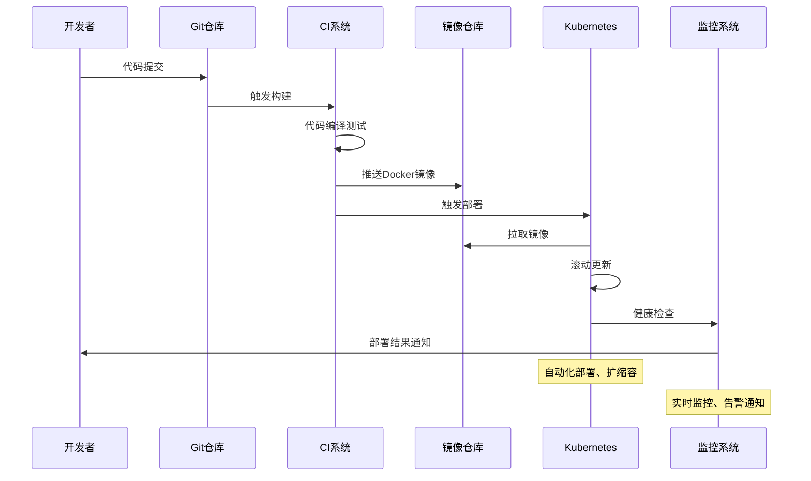

### 阶段六：📊 监控 (Monitor)

**目标**: 系统监控、性能分析、故障预警

#### 可观测性三大支柱

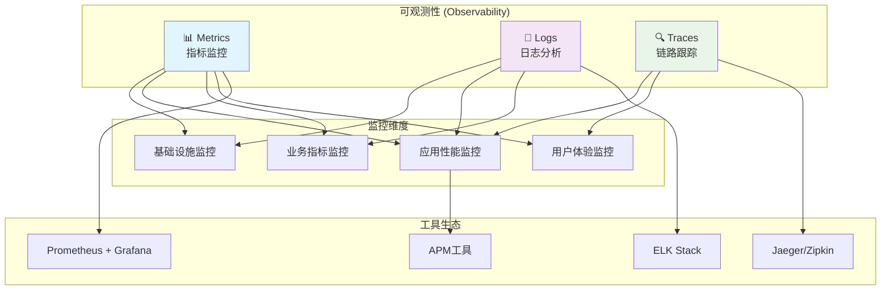

#### 监控指标体系

| 监控层级 | 关键指标 | 告警阈值 | 监控工具 |
|----------|----------|----------|----------|
| **基础设施** | CPU、内存、磁盘、网络 | CPU>80%, 内存>85% | Prometheus, Zabbix |
| **应用服务** | 响应时间、吞吐量、错误率 | RT>500ms, 错误率>1% | APM, Pinpoint |
| **业务指标** | 订单量、支付成功率、用户活跃度 | 同比下降>20% | 自定义Dashboard |
| **用户体验** | 页面加载时间、转化率 | 加载时间>3s | Real User Monitoring |

#### 告警处理流程

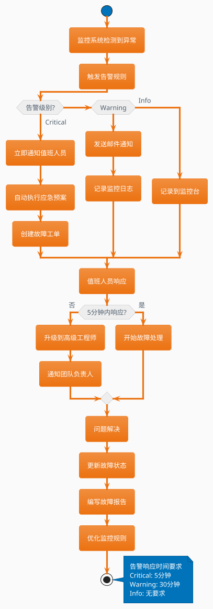

## 🛠️ 工具链生态

### DevOps工具链全景图

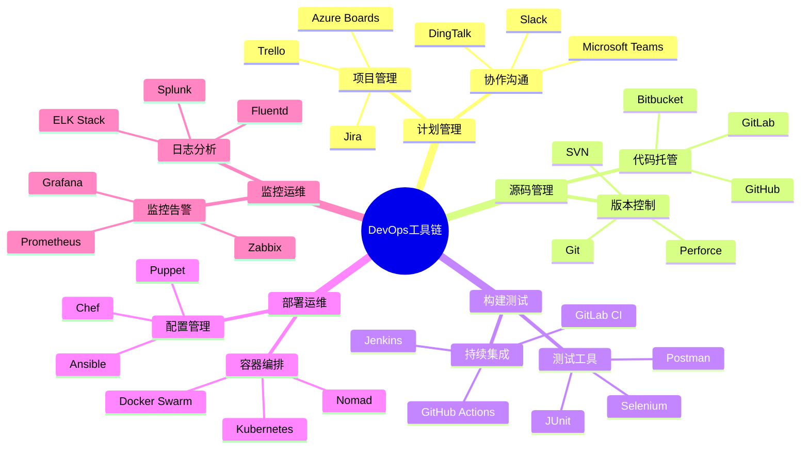

### 工具选型决策矩阵

| 评估维度 | 权重 | GitHub | GitLab | Azure DevOps | Jenkins |
|----------|------|--------|--------|--------------|---------|
| **易用性** | 20% | 9 | 8 | 7 | 6 |
| **功能完整性** | 25% | 8 | 9 | 9 | 8 |  
| **集成能力** | 20% | 9 | 8 | 8 | 9 |
| **成本控制** | 15% | 8 | 7 | 6 | 9 |
| **社区支持** | 10% | 10 | 8 | 7 | 9 |
| **安全性** | 10% | 9 | 8 | 9 | 7 |
| **综合得分** | 100% | **8.6** | **8.1** | **7.8** | **7.9** |

## 📖 实施案例分析

### 案例1：互联网电商平台DevOps转型

#### 背景与挑战
- **公司规模**: 500人研发团队，50个微服务
- **业务场景**: 高并发电商平台，日订单量100万+
- **面临问题**: 
  - 部署频率低（每月1次）
  - 故障恢复时间长（平均4小时）  
  - 团队协作效率低
  - 质量问题频发

#### DevOps实施过程

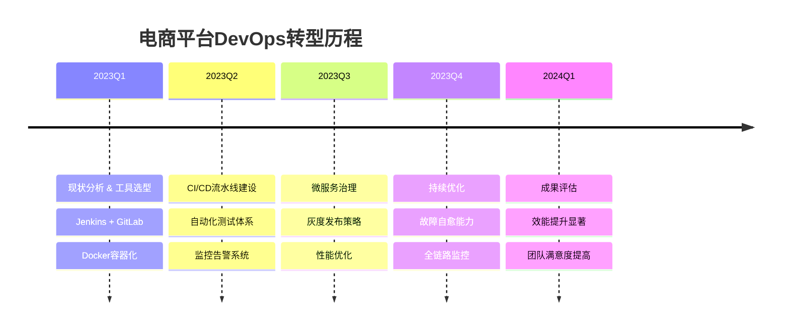

#### 实施效果对比

| 关键指标 | 实施前 | 实施后 | 提升幅度 |
|----------|--------|--------|----------|
| **部署频率** | 每月1次 | 每天10次 | **2900%** |
| **前置时间** | 2周 | 2天 | **85%** |
| **故障恢复时间** | 4小时 | 30分钟 | **87.5%** |
| **故障频率** | 每周3次 | 每月2次 | **75%** |
| **代码质量** | 500个bug/月 | 50个bug/月 | **90%** |
| **团队效率** | 60分 | 85分 | **42%** |

### 案例2：传统银行DevOps改造

#### 特殊挑战
- **合规要求**: 金融行业严格的合规和审计要求
- **系统复杂**: 核心系统与外围系统集成复杂
- **变更管控**: 严格的变更管理流程
- **安全要求**: 高安全等级要求

#### 解决方案架构

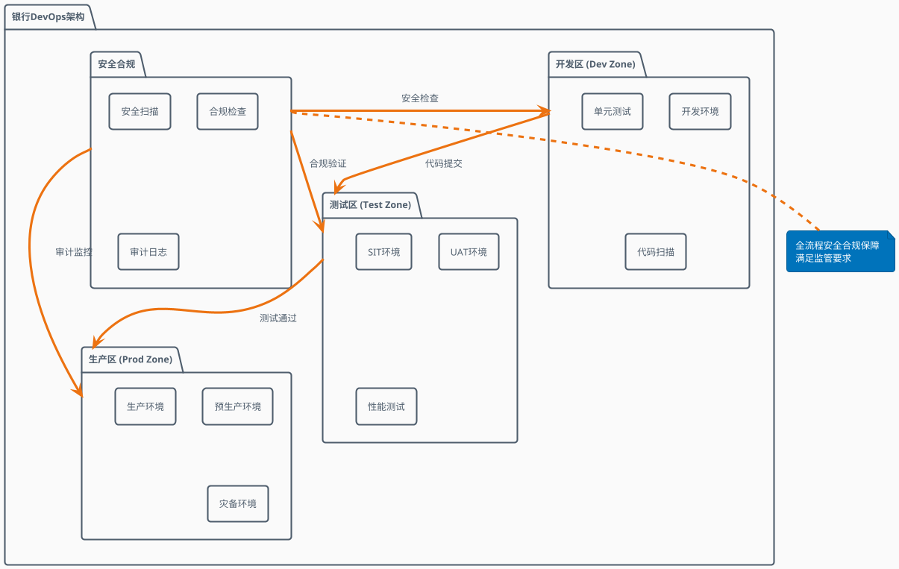

#### 关键成功因素

1. **渐进式改造**: 从外围系统开始，逐步覆盖核心系统
2. **合规优先**: 在自动化的同时确保合规要求
3. **安全左移**: 将安全检查前置到开发阶段
4. **文化变革**: 通过培训和激励推动文化转型

## 📏 度量与评估

### DORA四大关键指标

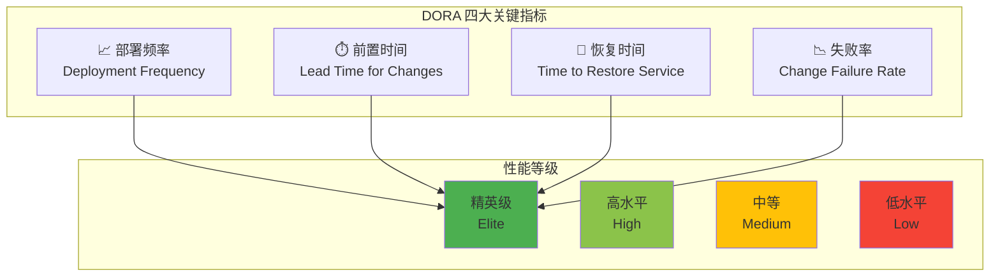

#### 性能基准对照表

| 指标 | 精英级 | 高水平 | 中等 | 低水平 |
|------|--------|--------|------|--------|
| **部署频率** | 按需部署<br/>(每天多次) | 每天1次 - 每周1次 | 每月1次 - 每周1次 | 每月1次 - 每半年1次 |
| **前置时间** | <1小时 | 1天 - 1周 | 1周 - 1月 | 1月 - 6月 |
| **恢复时间** | <1小时 | <1天 | 1天 - 1周 | 1周 - 6月 |
| **失败率** | 0-15% | 16-30% | 31-45% | 46-60% |

### DevOps成熟度评估模型

```plantuml
@startuml DevOps_Maturity
!theme aws-orange
skinparam backgroundColor #FAFAFA

package "DevOps成熟度模型" {
    
    rectangle "Level 1\n传统模式" as L1 {
        note bottom : 手工操作为主\n部门孤岛严重\n变更风险高
    }
    
    rectangle "Level 2\n工具导入" as L2 {
        note bottom : 引入自动化工具\n局部流程优化\n开始度量
    }
    
    rectangle "Level 3\n流程标准化" as L3 {
        note bottom : 端到端自动化\n跨团队协作\n持续集成
    }
    
    rectangle "Level 4\n持续优化" as L4 {
        note bottom : 数据驱动决策\n自动化运维\n快速反馈
    }
    
    rectangle "Level 5\n持续创新" as L5 {
        note bottom : 预测性运维\n自适应系统\n业务价值最大化
    }
    
    L1 --> L2 : 工具化转型
    L2 --> L3 : 流程优化
    L3 --> L4 : 能力提升
    L4 --> L5 : 创新驱动
}

@enduml
```

## 🚀 最佳实践指南

### 1. 文化建设最佳实践

#### 协作文化培养
- **打破壁垒**: 建立跨职能团队，打破部门间的壁垒
- **共同目标**: 设定共同的业务目标和成功指标
- **失败文化**: 建立"快速失败，快速学习"的文化
- **知识共享**: 定期进行技术分享和经验交流

#### 团队结构优化
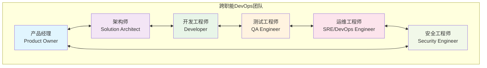

### 2. 自动化实施最佳实践

#### 自动化优先级矩阵

| 自动化类型 | 投入成本 | 收益程度 | 实施难度 | 优先级 |
|------------|----------|----------|----------|--------|
| **单元测试自动化** | 低 | 高 | 低 | 🔴 最高 |
| **构建部署自动化** | 中 | 高 | 中 | 🔴 最高 |
| **集成测试自动化** | 中 | 中 | 中 | 🟡 高 |
| **性能测试自动化** | 高 | 中 | 高 | 🟡 高 |
| **UI测试自动化** | 高 | 低 | 高 | 🟢 中 |

### 3. 质量保障最佳实践

#### 质量门控设置

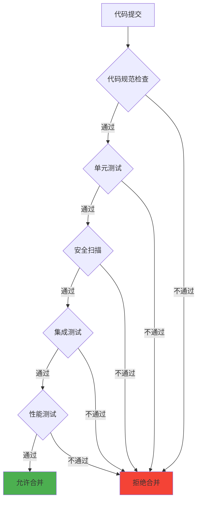

### 4. 安全集成最佳实践（DevSecOps）

#### 安全左移策略

| 阶段 | 安全活动 | 工具示例 | 检查内容 |
|------|----------|----------|----------|
| **开发** | 安全编码培训、IDE插件 | SonarLint, Checkmarx | 代码漏洞、敏感信息 |
| **构建** | 静态安全扫描 | SonarQube, Veracode | 代码质量、安全漏洞 |
| **测试** | 动态安全测试 | OWASP ZAP, Burp Suite | 运行时漏洞检测 |
| **部署** | 镜像安全扫描 | Clair, Twistlock | 容器镜像漏洞 |
| **运行** | 实时安全监控 | Falco, SIEM | 异常行为检测 |

## 📈 实施路线图

### 分阶段实施计划

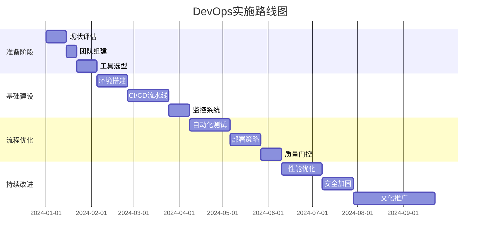

### 关键里程碑

| 阶段 | 时间节点 | 关键指标 | 成功标准 |
|------|----------|----------|----------|
| **基础搭建** | 第8周 | 工具链完成度 | 核心工具100%部署完成 |
| **流程建立** | 第17周 | 自动化覆盖率 | CI/CD流水线覆盖80%项目 |
| **质量提升** | 第22周 | 质量指标 | 缺陷密度降低50% |
| **效能提升** | 第34周 | 交付效率 | 部署频率提升300% |

### 风险控制与应对

| 风险类型 | 风险描述 | 影响程度 | 应对策略 |
|----------|----------|----------|----------|
| **技术风险** | 工具集成复杂度高 | 高 | 分阶段实施、技术预研 |
| **人员风险** | 团队技能不足 | 中 | 培训计划、外部支持 |
| **业务风险** | 影响现有业务 | 高 | 并行运行、灰度切换 |
| **文化风险** | 组织变革阻力 | 中 | 变革管理、激励机制 |

## 📚 总结与展望

DevOps作为一种文化、实践和工具的集合，能够帮助组织实现：

### 🎯 核心价值
- **更快的交付速度**: 通过自动化和流程优化，显著提升软件交付效率
- **更高的软件质量**: 通过持续集成和自动化测试，确保软件质量
- **更强的团队协作**: 打破部门壁垒，建立高效协作的团队文化
- **更好的业务响应**: 快速响应市场变化和客户需求

### 🔮 未来趋势
- **AI驱动的DevOps**: 智能化运维、预测性分析
- **云原生DevOps**: 容器化、微服务、服务网格
- **平台工程**: Platform as a Product理念
- **可观测性**: 全栈监控、分布式追踪

### 🏆 成功关键
1. **管理层支持**: 获得充分的资源和支持
2. **文化先行**: 重视文化建设，推动组织变革  
3. **循序渐进**: 分阶段实施，持续改进优化
4. **度量驱动**: 建立完善的度量体系，数据驱动决策
5. **持续学习**: 保持技术敏感度，拥抱变化

通过系统性的DevOps实施，组织将能够在数字化转型的道路上获得显著的竞争优势，构建面向未来的软件交付能力。🚀

---

*本文档基于DevOps最佳实践编写，旨在为组织提供完整的DevOps实施指南。欢迎根据实际情况调整和优化。*
