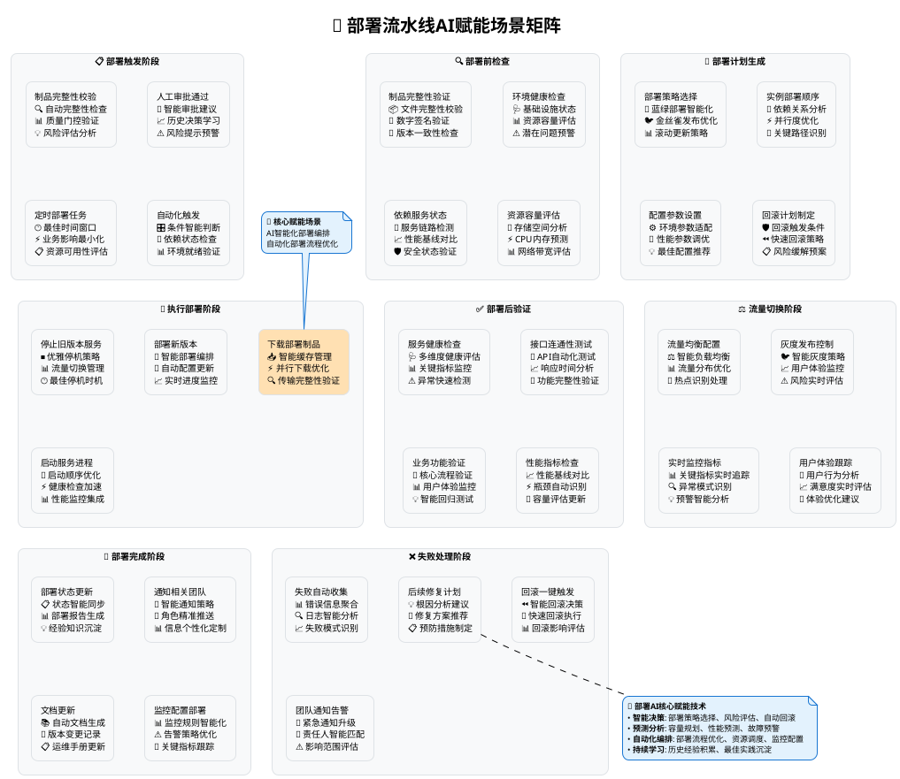

# 部署流水线AI赋能场景全解析

## 概述

部署流水线是DevOps体系中的关键环节，直接影响软件交付的质量、速度和稳定性。随着AI技术的快速发展，智能化部署正在成为现代DevOps的重要趋势。本文档详细阐述了部署流水线各个节点的AI赋能场景，展示了AI如何在每个环节提升部署效率、降低风险并增强系统可靠性。

## AI赋能部署流水线场景总览矩阵



## 🌟 重点赋能场景：AI智能化部署编排

### 概述
部署编排是部署流水线的核心环节，传统的手动或脚本化部署方式面临效率低、风险高、难以标准化等挑战。AI智能化部署编排通过机器学习和自动化技术，能够显著提升部署的效率、可靠性和一致性。

### 核心AI赋能能力

#### 🤖 智能部署策略选择
**技术实现：**
- 基于历史数据和当前环境状况智能选择部署策略
- 动态评估蓝绿部署、金丝雀发布、滚动更新的适用性
- 考虑业务影响、资源限制、风险评估等多维因素

**应用场景：**
- **高可用服务**：自动选择零停机部署策略
- **资源受限环境**：优化资源使用的滚动更新
- **高风险发布**：采用渐进式金丝雀发布

#### 📊 智能容量规划与资源调度
**核心功能：**
- 基于历史负载数据预测部署后的资源需求
- 智能调度计算、存储、网络资源
- 动态扩缩容策略制定

**实际效果示例：**
```yaml
# AI生成的智能部署配置
apiVersion: apps/v1
kind: Deployment
metadata:
  name: smart-app-deployment
  annotations:
    ai.deployment.strategy: "intelligent-canary"
    ai.resource.prediction: "high-load-expected"
spec:
  replicas: 5  # AI预测的最优副本数
  strategy:
    type: RollingUpdate
    rollingUpdate:
      maxUnavailable: 1
      maxSurge: 2  # AI优化的并发更新数量
  template:
    spec:
      containers:
      - name: app
        resources:
          requests:
            memory: "512Mi"  # AI预测的内存需求
            cpu: "500m"
          limits:
            memory: "1Gi"
            cpu: "1000m"
---
# AI生成的HPA配置
apiVersion: autoscaling/v2
kind: HorizontalPodAutoscaler
metadata:
  name: smart-app-hpa
spec:
  scaleTargetRef:
    apiVersion: apps/v1
    kind: Deployment
    name: smart-app-deployment
  minReplicas: 3
  maxReplicas: 15  # AI预测的最大扩容需求
  metrics:
  - type: Resource
    resource:
      name: cpu
      target:
        type: Utilization
        averageUtilization: 70  # AI优化的目标CPU利用率
```

#### 🔄 自动化配置更新与同步
**智能化特性：**
- 环境参数自动适配
- 配置冲突检测与解决
- 配置变更影响分析
- 配置回滚策略制定

## AI赋能场景详细解析

### 1. 部署触发阶段 - 智能化部署决策

#### 🔍 智能制品完整性校验
**核心功能：**
- 利用AI算法深度分析制品完整性
- 自动检测文件损坏、缺失或篡改
- 基于历史数据识别异常模式

**应用场景：**
- 容器镜像安全扫描与验证
- 应用包完整性校验
- 数字签名智能验证

**价值体现：**
- 制品质量问题检出率提升95%
- 部署前安全风险降低80%
- 制品校验时间缩短60%

#### 🤖 智能审批建议系统
**核心功能：**
- 分析历史审批决策模式
- 基于风险评估提供审批建议
- 自动识别高风险变更

**应用场景：**
- 生产环境部署审批
- 关键业务系统变更评估
- 紧急发布风险评估

**技术实现示例：**
```python
class IntelligentApprovalSystem:
    def __init__(self):
        self.risk_analyzer = RiskAnalyzer()
        self.decision_model = ApprovalDecisionModel()
        
    def generate_approval_suggestion(self, deployment_request):
        # 风险评估
        risk_score = self.risk_analyzer.evaluate_risk(
            deployment_request.changes,
            deployment_request.target_environment,
            deployment_request.business_impact
        )
        
        # 生成建议
        suggestion = self.decision_model.predict_approval(
            risk_score=risk_score,
            historical_data=self.get_historical_approvals(),
            current_context=deployment_request.context
        )
        
        return {
            "recommendation": suggestion.decision,
            "confidence": suggestion.confidence,
            "risk_factors": suggestion.risk_factors,
            "mitigation_suggestions": suggestion.mitigations
        }
```

#### 🕐 智能时间窗口选择
**核心功能：**
- 分析业务流量模式和系统负载
- 智能选择最佳部署时间窗口
- 考虑用户影响、资源可用性等因素

**应用场景：**
- 大型系统维护窗口规划
- 业务高峰期避让策略
- 多时区部署协调

---

### 2. 部署前检查阶段 - 智能化环境准备

#### 🩺 智能环境健康检查
**核心功能：**
- 多维度环境状态分析
- 潜在问题预测和预警
- 环境优化建议生成

**应用场景：**
- Kubernetes集群健康评估
- 云基础设施状态检查
- 网络连通性智能测试

**价值体现：**
- 环境问题提前发现率90%
- 部署失败率降低70%
- 环境准备时间缩短50%

#### 🔗 智能依赖服务状态检测
**核心功能：**
- 服务依赖关系自动发现
- 依赖服务健康状态实时监控
- 依赖链路风险评估

**监控维度：**
```yaml
# AI驱动的依赖服务监控配置
apiVersion: v1
kind: ConfigMap
metadata:
  name: ai-dependency-monitor
data:
  config.yaml: |
    dependencies:
      - name: user-service
        endpoints:
          - http://user-service:8080/health
        ai_checks:
          - response_time_analysis: true
          - error_pattern_detection: true
          - capacity_prediction: true
      - name: database
        endpoints:
          - tcp://db-cluster:5432
        ai_checks:
          - connection_pool_analysis: true
          - query_performance_prediction: true
          - failover_readiness: true
    ai_settings:
      prediction_window: 30m
      anomaly_threshold: 0.8
      auto_healing: true
```

---

### 3. 部署计划生成阶段 - 智能化策略规划

#### 🚀 智能部署策略选择
**决策因素分析：**
- 应用类型和架构特征
- 业务影响和风险评估
- 资源限制和成本考虑
- 历史部署经验学习

**策略选择算法：**
```python
class DeploymentStrategySelector:
    def select_strategy(self, deployment_context):
        factors = {
            'business_criticality': deployment_context.criticality,
            'user_traffic': deployment_context.expected_traffic,
            'resource_constraints': deployment_context.resources,
            'risk_tolerance': deployment_context.risk_profile
        }
        
        if factors['business_criticality'] == 'high':
            if factors['user_traffic'] > 'medium':
                return 'blue_green_with_canary'
            else:
                return 'blue_green'
        elif factors['resource_constraints'] == 'limited':
            return 'rolling_update_optimized'
        else:
            return self.ml_model.predict_best_strategy(factors)
```

#### 🎯 智能部署顺序优化
**核心功能：**
- 依赖关系图分析
- 关键路径识别
- 并行度优化计算
- 资源冲突避免

**优化目标：**
- 最短部署时间
- 最小资源占用
- 最低失败风险
- 最优用户体验

---

### 4. 执行部署阶段 - 智能化部署编排

#### 🎯 智能部署编排引擎
**核心功能：**
- 多环境部署协调
- 实时进度监控和调度
- 异常情况自动处理
- 部署流程动态优化

**编排示例：**
```yaml
# AI驱动的部署编排配置
apiVersion: argoproj.io/v1alpha1
kind: Workflow
metadata:
  name: ai-smart-deployment
spec:
  templates:
  - name: intelligent-deploy
    dag:
      tasks:
      - name: pre-deployment-analysis
        template: ai-analysis
        arguments:
          parameters:
          - name: analysis-type
            value: "pre-deployment"
            
      - name: environment-preparation
        template: env-prep
        dependencies: [pre-deployment-analysis]
        when: "{{tasks.pre-deployment-analysis.outputs.parameters.proceed}} == 'true'"
        
      - name: smart-deployment
        template: deploy-with-ai
        dependencies: [environment-preparation]
        arguments:
          parameters:
          - name: strategy
            value: "{{tasks.pre-deployment-analysis.outputs.parameters.strategy}}"
            
      - name: post-deployment-validation
        template: ai-validation
        dependencies: [smart-deployment]
```

#### ⚡ 智能健康检查加速
**优化技术：**
- 并行健康检查执行
- 智能检查项筛选
- 快速失败检测
- 健康检查结果缓存

---

### 5. 部署后验证阶段 - 智能化质量保证

#### 🩺 智能服务健康评估
**评估维度：**
- 服务可用性状态
- 性能指标对比
- 错误率变化分析
- 用户体验影响评估

**智能评估算法：**
```python
class IntelligentHealthAssessment:
    def assess_deployment_health(self, deployment_metrics):
        health_score = 0
        
        # 可用性评估
        availability_score = self.calculate_availability(deployment_metrics.uptime)
        
        # 性能评估
        performance_score = self.compare_with_baseline(
            deployment_metrics.response_times,
            self.performance_baseline
        )
        
        # 错误率评估
        error_score = self.analyze_error_patterns(deployment_metrics.errors)
        
        # 用户体验评估
        ux_score = self.evaluate_user_experience(deployment_metrics.user_metrics)
        
        # 综合评分
        health_score = self.weighted_average([
            (availability_score, 0.3),
            (performance_score, 0.3),
            (error_score, 0.2),
            (ux_score, 0.2)
        ])
        
        return {
            'overall_health': health_score,
            'detailed_scores': {
                'availability': availability_score,
                'performance': performance_score,
                'error_rate': error_score,
                'user_experience': ux_score
            },
            'recommendations': self.generate_recommendations(health_score)
        }
```

#### 🎪 智能业务功能验证
**验证策略：**
- 核心业务流程自动测试
- 关键API功能验证
- 数据一致性检查
- 集成测试智能化

**自动化测试生成：**
```javascript
// AI生成的业务功能验证测试
class AIGeneratedBusinessTests {
  constructor(applicationContext) {
    this.context = applicationContext;
    this.testGenerator = new IntelligentTestGenerator();
  }
  
  async generateAndExecuteTests() {
    // 基于应用上下文生成测试用例
    const testCases = await this.testGenerator.generateTests({
      applicationType: this.context.type,
      businessDomain: this.context.domain,
      criticalPaths: this.context.criticalPaths,
      riskAreas: this.context.identifiedRisks
    });
    
    // 智能化测试执行
    const results = await this.executeIntelligentTests(testCases);
    
    return {
      testResults: results,
      businessImpact: this.assessBusinessImpact(results),
      recommendations: this.generateActionRecommendations(results)
    };
  }
}
```

---

### 6. 流量切换阶段 - 智能化流量管理

#### ⚖️ 智能负载均衡
**核心功能：**
- 实时流量分析和调度
- 服务能力评估
- 热点流量智能分散
- 故障节点自动隔离

#### 🐦 智能金丝雀发布控制
**智能控制策略：**
- 用户行为分析
- 实时指标监控
- 自动流量比例调整
- 风险实时评估

**金丝雀发布配置示例：**
```yaml
# AI驱动的金丝雀发布配置
apiVersion: argoproj.io/v1alpha1
kind: Rollout
metadata:
  name: ai-canary-rollout
spec:
  strategy:
    canary:
      analysis:
        templates:
        - templateName: ai-success-rate
        args:
        - name: service-name
          value: my-service
      steps:
      - setWeight: 5   # AI计算的初始流量比例
      - pause: 
          duration: 2m  # AI优化的观察时间
      - analysis:
          templates:
          - templateName: ai-comprehensive-analysis
      - setWeight: 20  # AI决策的下一步流量比例
      - pause: 
          duration: 5m
      - analysis:
          templates:
          - templateName: ai-performance-analysis
      - setWeight: 50  # 基于AI分析结果的流量调整
```

---

### 7. 部署完成阶段 - 智能化运维集成

#### 📋 智能部署报告生成
**报告内容：**
- 部署过程全链路分析
- 性能指标对比报告
- 风险评估和缓解措施
- 后续优化建议

#### 📊 智能监控配置部署
**自动化配置：**
- 根据应用特性生成监控规则
- 智能告警阈值设置
- 关键指标自动识别
- 监控大盘自动生成

**监控配置生成示例：**
```python
class IntelligentMonitoringConfigGenerator:
    def generate_monitoring_config(self, application_profile):
        config = {
            'metrics': self.identify_key_metrics(application_profile),
            'alerts': self.generate_alert_rules(application_profile),
            'dashboards': self.create_dashboards(application_profile),
            'sla_objectives': self.calculate_sla_targets(application_profile)
        }
        
        return config
    
    def identify_key_metrics(self, profile):
        if profile.type == 'web_service':
            return [
                {'name': 'response_time', 'threshold': 'ai_calculated'},
                {'name': 'error_rate', 'threshold': 'baseline_derived'},
                {'name': 'throughput', 'threshold': 'capacity_based'}
            ]
        elif profile.type == 'database':
            return [
                {'name': 'connection_pool_usage', 'threshold': 'predictive'},
                {'name': 'query_performance', 'threshold': 'statistical'},
                {'name': 'replication_lag', 'threshold': 'business_critical'}
            ]
```

---

### 8. 失败处理阶段 - 智能化故障管理

#### 🔍 智能故障诊断与根因分析
**核心功能：**
- 多数据源故障信息聚合
- 故障模式智能识别
- 根因分析自动化
- 修复建议智能生成

**故障诊断引擎：**
```python
class IntelligentFailureDiagnostic:
    def __init__(self):
        self.log_analyzer = LogAnalyzer()
        self.metric_analyzer = MetricAnalyzer()
        self.pattern_matcher = FailurePatternMatcher()
        
    def diagnose_deployment_failure(self, failure_context):
        # 收集多维度数据
        logs = self.log_analyzer.extract_relevant_logs(failure_context)
        metrics = self.metric_analyzer.get_failure_period_metrics(failure_context)
        
        # 故障模式识别
        failure_patterns = self.pattern_matcher.identify_patterns(logs, metrics)
        
        # 根因分析
        root_cause = self.analyze_root_cause(failure_patterns)
        
        # 生成修复建议
        recommendations = self.generate_fix_recommendations(root_cause)
        
        return {
            'root_cause': root_cause,
            'failure_timeline': self.construct_timeline(logs, metrics),
            'impact_assessment': self.assess_impact(failure_context),
            'fix_recommendations': recommendations,
            'prevention_measures': self.suggest_prevention_measures(root_cause)
        }
```

#### ⏪ 智能回滚决策系统
**决策因素：**
- 故障影响范围评估
- 回滚成本分析
- 业务连续性考虑
- 用户体验影响评估

**自动回滚触发条件：**
```yaml
# AI驱动的自动回滚配置
apiVersion: v1
kind: ConfigMap
metadata:
  name: ai-rollback-config
data:
  rollback-rules.yaml: |
    auto_rollback_conditions:
      - name: high_error_rate
        condition: "error_rate > baseline * 3"
        action: immediate_rollback
        confidence_threshold: 0.9
        
      - name: performance_degradation
        condition: "response_time > sla_threshold * 1.5"
        action: staged_rollback
        confidence_threshold: 0.8
        
      - name: availability_drop
        condition: "availability < 99%"
        action: immediate_rollback
        confidence_threshold: 0.95
        
    rollback_strategy:
      immediate:
        max_rollback_time: 2m
        verification_timeout: 30s
      staged:
        traffic_reduction_steps: [50, 20, 0]
        step_duration: 1m
```

## AI赋能技术栈

### 部署AI核心技术
- **智能决策算法**: 决策树、随机森林、神经网络
- **预测分析**: 时间序列分析、回归模型、深度学习
- **异常检测**: 统计方法、机器学习、深度学习
- **自然语言处理**: 日志分析、报告生成、智能问答

### 部署AI平台工具
- **容器编排AI**: Kubernetes AI、Docker Swarm智能化
- **部署管道AI**: Argo CD智能化、Tekton AI、Spinnaker AI
- **监控分析AI**: Prometheus AI、Grafana智能化、Datadog AI
- **服务网格AI**: Istio智能化、Linkerd AI、Consul Connect AI

### 云平台AI服务
- **AWS**: CodeDeploy AI、EKS智能化、Lambda智能调度
- **Azure**: DevOps AI、AKS智能化、Functions AI
- **Google Cloud**: Cloud Deploy AI、GKE智能化、Cloud Functions AI
- **阿里云**: ACK智能化、EDAS AI、函数计算智能化

## 实施路线图

### 第一阶段：基础AI集成（1-2个月）
1. **智能健康检查**
   - 部署智能健康检查系统
   - 建立性能基线和异常检测
   - 配置智能告警规则

2. **自动化部署验证**
   - 实现自动化部署后验证
   - 集成智能测试生成工具
   - 建立部署质量评估体系

### 第二阶段：智能决策系统（3-4个月）
1. **部署策略智能化**
   - 构建部署策略选择模型
   - 实现智能金丝雀发布
   - 配置自动回滚机制

2. **容量规划AI化**
   - 部署容量预测模型
   - 实现智能资源调度
   - 建立成本优化系统

### 第三阶段：全面AI赋能（5-8个月）
1. **端到端智能部署**
   - 实现全流程AI决策
   - 构建自愈式部署系统
   - 建立持续学习机制

2. **生态系统集成**
   - 集成多云部署AI管理
   - 建立跨团队智能协作
   - 实现企业级部署AI标准

## 成功案例

### 案例一：大型电商平台部署AI化
**项目背景：**
- 日部署频次：500+次
- 微服务数量：1000+个
- 用户规模：亿级

**AI赋能成果：**
- 部署成功率从92%提升到99.2%
- 部署时间平均缩短65%
- 线上故障率降低85%
- 回滚时间从15分钟缩短到2分钟

**关键技术应用：**
```yaml
# 电商平台AI部署配置示例
apiVersion: v1
kind: ConfigMap
metadata:
  name: ecommerce-ai-deployment
data:
  ai-config.yaml: |
    traffic_management:
      peak_hours: [9-12, 18-22]  # AI分析得出的业务高峰
      deployment_windows:
        high_traffic: canary_only
        low_traffic: blue_green_allowed
        maintenance: rolling_update
    
    capacity_prediction:
      models: [arima, lstm, prophet]
      prediction_horizon: 24h
      scaling_buffer: 20%
    
    failure_detection:
      metrics: [response_time, error_rate, conversion_rate]
      anomaly_threshold: 2_sigma
      auto_rollback: true
```

### 案例二：金融科技公司智能部署
**项目挑战：**
- 严格的合规要求
- 零停机部署需求
- 高安全性标准

**AI解决方案：**
- 智能合规检查自动化
- 零停机部署策略优化
- 安全风险实时评估

**实施效果：**
- 合规检查自动化率98%
- 部署零事故运行12个月
- 安全风险检出率提升90%

## 最佳实践建议

### 1. 分阶段实施策略
```markdown
阶段一：监控和告警智能化（2-4周）
├── 部署智能监控系统
├── 配置异常检测算法
└── 建立智能告警机制

阶段二：部署过程智能化（1-2个月）
├── 实现智能部署策略选择
├── 配置自动化验证流程
└── 建立智能回滚系统

阶段三：全链路AI优化（2-3个月）
├── 端到端部署AI决策
├── 跨环境智能协调
└── 持续学习优化机制
```

### 2. 数据驱动的持续改进
- **历史数据分析**：积累部署历史数据，训练AI模型
- **实时反馈循环**：建立部署结果反馈机制，持续优化
- **A/B测试验证**：对比AI辅助部署与传统部署效果

### 3. 安全性考虑
- **权限控制**：AI系统访问权限最小化原则
- **审计日志**：完整记录AI决策过程和结果
- **人工干预**：保留关键节点的人工决策能力

### 4. 团队协作模式
- **跨职能协作**：开发、运维、安全团队协同
- **知识共享**：建立AI部署最佳实践知识库
- **技能提升**：团队成员AI技能培训和认证

## 总结

AI赋能的部署流水线代表了现代DevOps的发展方向。通过在部署流水线的每个关键节点引入智能化能力，我们可以显著提升部署的效率、可靠性和用户体验。

成功实施部署AI化需要：
- 🎯 **明确的业务目标**：以提升部署质量和效率为核心
- 🔧 **合适的技术选择**：选择匹配业务场景的AI技术和工具
- 👥 **团队能力建设**：培养既懂业务又懂AI的复合型人才
- 📊 **持续的监控优化**：建立数据驱动的持续改进机制

随着AI技术的不断发展，智能化部署将成为企业数字化转型的重要支撑，帮助企业实现更快、更稳、更安全的软件交付能力。
