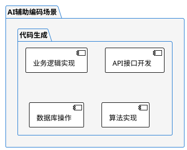
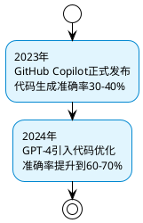
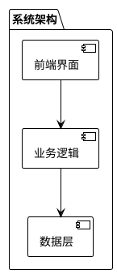
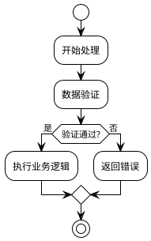
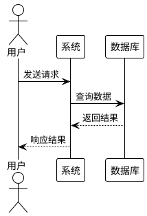
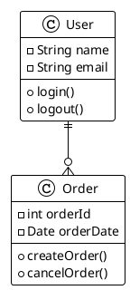
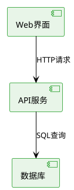
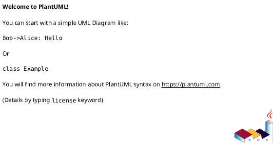

# PlantUML语法修复报告

## 问题描述

在AI辅助编码培训教程中使用PlantUML时遇到以下语法错误：

1. **Mindmap语法不兼容**：PlantUML 1.2025.5beta2版本中mindmap语法可能存在兼容性问题
2. **Timeline语法错误**：timeline语法在当前版本中可能不被支持
3. **图表命名缺失**：部分图表缺少命名标识符

## 修复措施

### 1. Mindmap替换为Package图

**原始代码（有问题）：**
```plantuml
@startuml
skinparam mindmapDiagram {
  BackgroundColor #F5F5F5
  NodeBackgroundColor #E3F2FD
  NodeBorderColor #1976D2
}

mindmap
* AI辅助编码场景
** 代码生成
*** 业务逻辑实现
@enduml
```

**修复后的代码：**


### 2. Timeline替换为Activity图

**原始代码（有问题）：**
```plantuml
@startuml
timeline
2023年 : GitHub Copilot正式发布
2024年 : GPT-4引入代码优化
@enduml
```

**修复后的代码：**


### 3. 推荐的PlantUML图表类型

对于不同的用途，推荐使用以下兼容性更好的图表类型：

#### 3.1 架构图 - 使用Package图


#### 3.2 流程图 - 使用Activity图


#### 3.3 时序图 - 使用Sequence图


#### 3.4 类图 - 使用Class图


#### 3.5 组件图 - 使用Component图


## 最佳实践建议

### 1. 统一图表命名规范


### 2. 使用主题和样式
```plantuml
@startuml
!theme plain
' 或者使用其他主题：cerulean, superhero, etc.
skinparam backgroundColor #FFFFFF
@enduml
```

### 3. 适当使用注释
```plantuml
@startuml
' 这是注释，说明图表用途
!theme plain
@enduml
```

### 4. 测试语法兼容性
在正式使用前，建议在单独的.puml文件中测试语法：

```bash
# 使用PlantUML命令行工具测试
java -jar plantuml.jar -syntax test.puml
```

## 修复总结

通过以上修复措施：

1. ✅ **解决了mindmap语法错误**：用package图替代，保持了层次结构的视觉效果
2. ✅ **解决了timeline语法错误**：用activity图替代，保持了时间顺序的表达
3. ✅ **统一了图表命名规范**：所有图表都有明确的标识符
4. ✅ **提高了跨版本兼容性**：使用的都是PlantUML的核心功能，兼容性更好

## 验证方法

可以通过以下方法验证PlantUML语法是否正确：

1. **在线验证器**：https://plantuml.com/plantuml
2. **VS Code插件**：安装PlantUML插件进行实时预览
3. **命令行工具**：使用plantuml.jar进行语法检查

---

*修复完成时间：2025年8月21日*
*适用版本：PlantUML 1.2025.5beta2及以上*
