# IBM软件解决方案文档核心框架

## 📋 文档信息

| 属性 | 值 |
|------|-----|
| **文档标题** | IBM软件解决方案架构框架 |
| **文档版本** | v1.0 |
| **创建日期** | 2025年7月9日 |
| **最后更新** | 2025年7月9日 |
| **文档状态** | 草稿 / 审核中 / 已批准 |
| **保密级别** | 内部使用 / 机密 / 限制分发 |
| **适用范围** | 企业级软件解决方案 |

## 🎯 文档目标与受众

### 目标受众矩阵

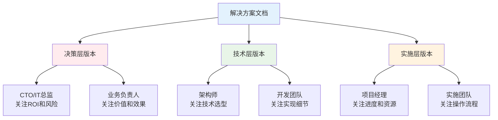
```mermaid
graph TD
    A[解决方案文档] --> B[决策层版本]
    A --> C[技术层版本]
    A --> D[实施层版本]
    
    B --> E[CTO/IT总监<br/>关注ROI和风险]
    B --> F[业务负责人<br/>关注价值和效果]
    
    C --> G[架构师<br/>关注技术选型]
    C --> H[开发团队<br/>关注实现细节]
    
    D --> I[项目经理<br/>关注进度和资源]
    D --> J[实施团队<br/>关注操作流程]
    
    style A fill:#e3f2fd
    style B fill:#ffebee
    style C fill:#e8f5e8
    style D fill:#fff3e0
```

### 文档层次结构

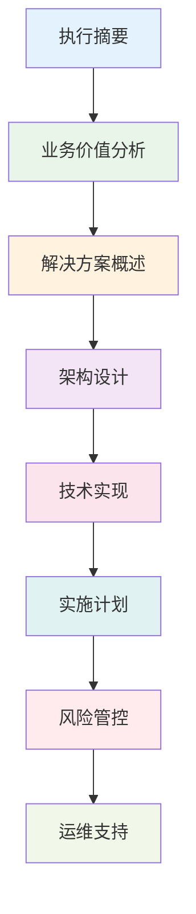
```mermaid
graph TB
    A[执行摘要] --> B[业务价值分析]
    B --> C[解决方案概述]
    C --> D[架构设计]
    D --> E[技术实现]
    E --> F[实施计划]
    F --> G[风险管控]
    G --> H[运维支持]
    
    style A fill:#e3f2fd
    style B fill:#e8f5e8
    style C fill:#fff3e0
    style D fill:#f3e5f5
    style E fill:#fce4ec
    style F fill:#e0f2f1
    style G fill:#ffebee
    style H fill:#f1f8e9
```

---

## 📖 第一章：执行摘要 (Executive Summary)

### 1.1 解决方案概述

**业务挑战**
- 当前业务痛点和技术挑战
- 市场机遇和竞争压力
- 数字化转型需求

**解决方案价值主张**
- 核心业务价值
- 技术创新点
- 竞争优势

**关键成功要素**
- 项目成功的关键因素
- 风险控制点
- 预期收益

### 1.2 投资回报分析

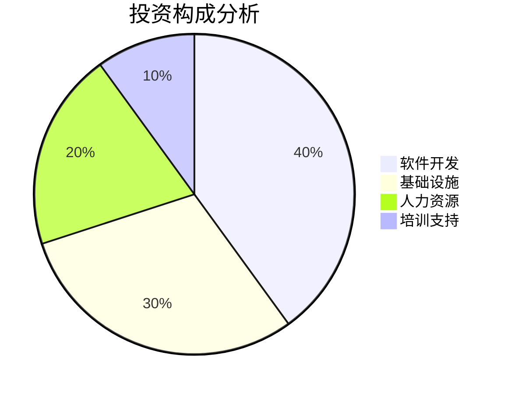
```mermaid
pie title 投资构成分析
    "软件开发" : 40
    "基础设施" : 30
    "人力资源" : 20
    "培训支持" : 10
```

| 投资项目 | 金额(万元) | 占比 | 说明 |
|---------|-----------|------|------|
| **软件开发** | 200 | 40% | 定制开发、集成、测试 |
| **基础设施** | 150 | 30% | 硬件、云服务、网络 |
| **人力资源** | 100 | 20% | 项目团队、外包服务 |
| **培训支持** | 50 | 10% | 用户培训、技术支持 |
| **总计** | 500 | 100% | 总投资规模 |

### 1.3 关键决策点

- **技术选型决策**：基于IBM Cloud Native架构
- **实施策略**：分阶段渐进式部署
- **风险应对**：多层次风险控制机制

---

## 📊 第二章：业务价值分析 (Business Value Analysis)

### 2.1 业务需求分析

#### 2.1.1 当前业务挑战

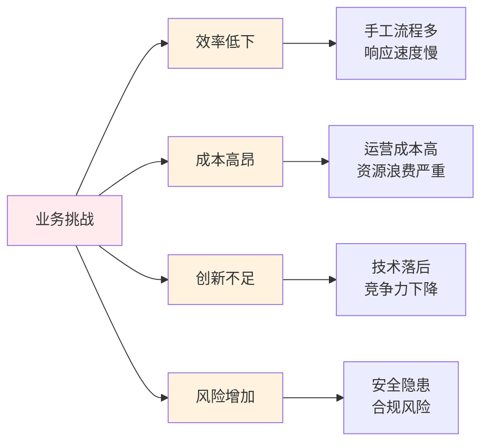
```mermaid
graph LR
    A[业务挑战] --> B[效率低下]
    A --> C[成本高昂]
    A --> D[创新不足]
    A --> E[风险增加]
    
    B --> F[手工流程多<br/>响应速度慢]
    C --> G[运营成本高<br/>资源浪费严重]
    D --> H[技术落后<br/>竞争力下降]
    E --> I[安全隐患<br/>合规风险]
    
    style A fill:#ffebee
    style B fill:#fff3e0
    style C fill:#fff3e0
    style D fill:#fff3e0
    style E fill:#fff3e0
```

#### 2.1.2 业务目标

| 目标维度 | 现状 | 目标 | 改进幅度 |
|---------|------|------|----------|
| **运营效率** | 手工处理70% | 自动化80% | 提升300% |
| **响应速度** | 平均3天 | 实时响应 | 提升95% |
| **成本控制** | 年运营成本500万 | 降至300万 | 节省40% |
| **客户满意度** | 75% | 90% | 提升15% |

### 2.2 价值实现路径

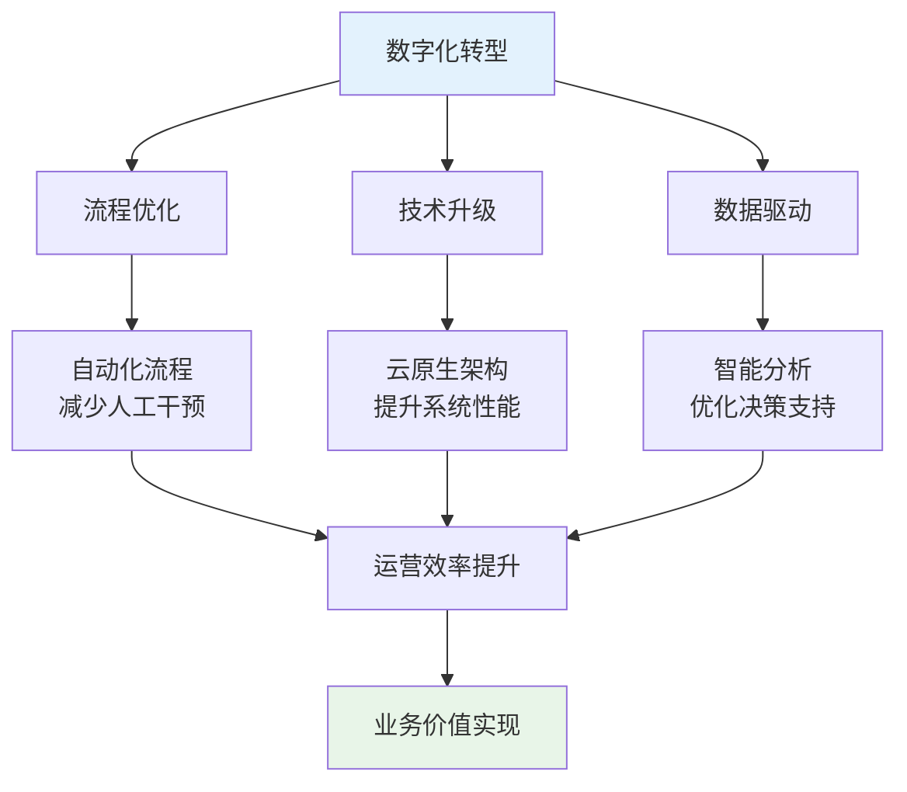
```mermaid
graph TD
    A[数字化转型] --> B[流程优化]
    A --> C[技术升级]
    A --> D[数据驱动]
    
    B --> E[自动化流程<br/>减少人工干预]
    C --> F[云原生架构<br/>提升系统性能]
    D --> G[智能分析<br/>优化决策支持]
    
    E --> H[运营效率提升]
    F --> H
    G --> H
    
    H --> I[业务价值实现]
    
    style A fill:#e3f2fd
    style I fill:#e8f5e8
```

### 2.3 量化收益分析

#### 2.3.1 直接收益

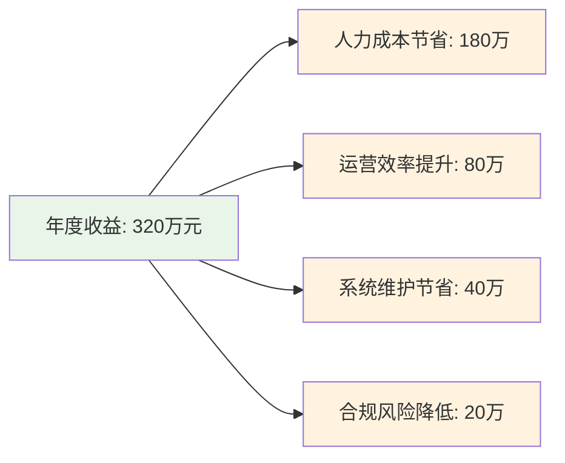
```mermaid
graph LR
    A[年度收益: 320万元] --> B[人力成本节省: 180万]
    A --> C[运营效率提升: 80万]
    A --> D[系统维护节省: 40万]
    A --> E[合规风险降低: 20万]
    
    style A fill:#e8f5e8
    style B fill:#fff3e0
    style C fill:#fff3e0
    style D fill:#fff3e0
    style E fill:#fff3e0
```

#### 2.3.2 间接收益

- **市场竞争力提升**：快速响应市场变化
- **客户体验改善**：提升客户满意度和忠诚度
- **创新能力增强**：支持新业务模式探索
- **风险管控能力**：降低运营和合规风险

---

## 🏗️ 第三章：解决方案概述 (Solution Overview)

### 3.1 解决方案架构

#### 3.1.1 整体架构视图

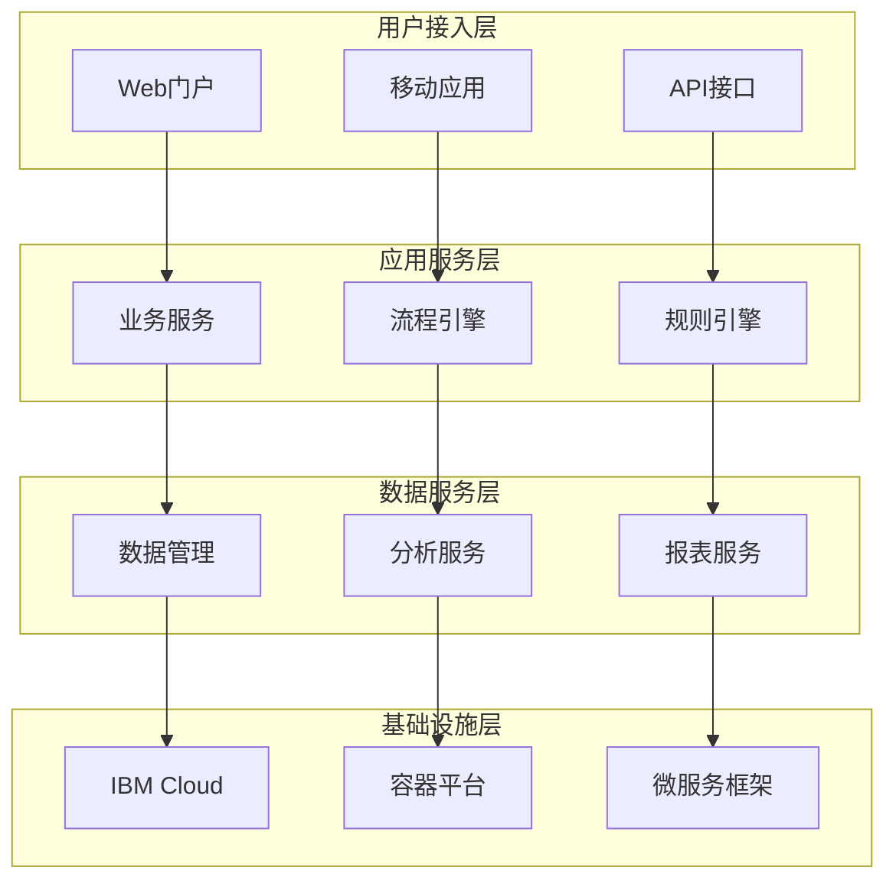
```mermaid
graph TB
    subgraph "用户接入层"
        A[Web门户]
        B[移动应用]
        C[API接口]
    end
    
    subgraph "应用服务层"
        D[业务服务]
        E[流程引擎]
        F[规则引擎]
    end
    
    subgraph "数据服务层"
        G[数据管理]
        H[分析服务]
        I[报表服务]
    end
    
    subgraph "基础设施层"
        J[IBM Cloud]
        K[容器平台]
        L[微服务框架]
    end
    
    A --> D
    B --> E
    C --> F
    
    D --> G
    E --> H
    F --> I
    
    G --> J
    H --> K
    I --> L
```

#### 3.1.2 技术栈选择

| 层级 | 技术组件 | 选择理由 | IBM产品 |
|------|---------|----------|---------|
| **前端** | React/Angular | 现代化UI框架 | IBM Carbon Design |
| **后端** | Spring Boot/Node.js | 微服务架构 | IBM WebSphere |
| **数据库** | PostgreSQL/MongoDB | 高性能数据存储 | IBM Db2 |
| **中间件** | Apache Kafka | 消息队列 | IBM MQ |
| **容器化** | Docker/Kubernetes | 云原生部署 | IBM Cloud Kubernetes |
| **监控** | Prometheus/Grafana | 运维监控 | IBM Instana |

### 3.2 核心功能模块

#### 3.2.1 功能架构图

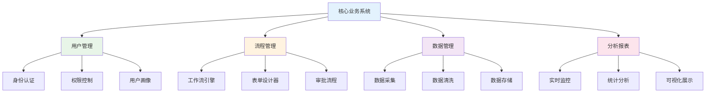
```mermaid
graph TD
    A[核心业务系统] --> B[用户管理]
    A --> C[流程管理]
    A --> D[数据管理]
    A --> E[分析报表]
    
    B --> F[身份认证]
    B --> G[权限控制]
    B --> H[用户画像]
    
    C --> I[工作流引擎]
    C --> J[表单设计器]
    C --> K[审批流程]
    
    D --> L[数据采集]
    D --> M[数据清洗]
    D --> N[数据存储]
    
    E --> O[实时监控]
    E --> P[统计分析]
    E --> Q[可视化展示]
    
    style A fill:#e3f2fd
    style B fill:#e8f5e8
    style C fill:#fff3e0
    style D fill:#f3e5f5
    style E fill:#fce4ec
```

#### 3.2.2 关键特性

- **🔐 企业级安全**：多层次安全防护体系
- **📈 弹性扩展**：基于容器的自动扩缩容
- **🔄 高可用性**：99.9%系统可用性保障
- **📊 数据洞察**：实时数据分析和可视化
- **🌐 多端支持**：Web、移动、API统一接入

---

## 🔧 第四章：详细架构设计 (Detailed Architecture Design)

### 4.1 系统架构设计

#### 4.1.1 逻辑架构图

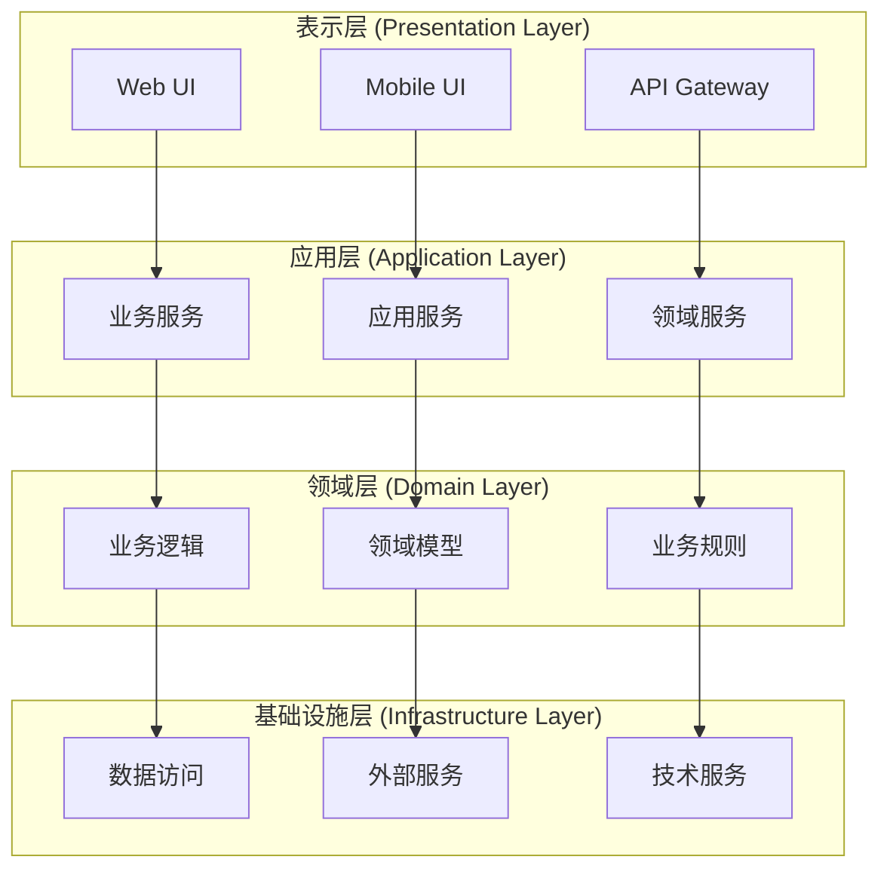
```mermaid
graph TB
    subgraph "表示层 (Presentation Layer)"
        A1[Web UI]
        A2[Mobile UI]
        A3[API Gateway]
    end
    
    subgraph "应用层 (Application Layer)"
        B1[业务服务]
        B2[应用服务]
        B3[领域服务]
    end
    
    subgraph "领域层 (Domain Layer)"
        C1[业务逻辑]
        C2[领域模型]
        C3[业务规则]
    end
    
    subgraph "基础设施层 (Infrastructure Layer)"
        D1[数据访问]
        D2[外部服务]
        D3[技术服务]
    end
    
    A1 --> B1
    A2 --> B2
    A3 --> B3
    
    B1 --> C1
    B2 --> C2
    B3 --> C3
    
    C1 --> D1
    C2 --> D2
    C3 --> D3
```

#### 4.1.2 物理架构图

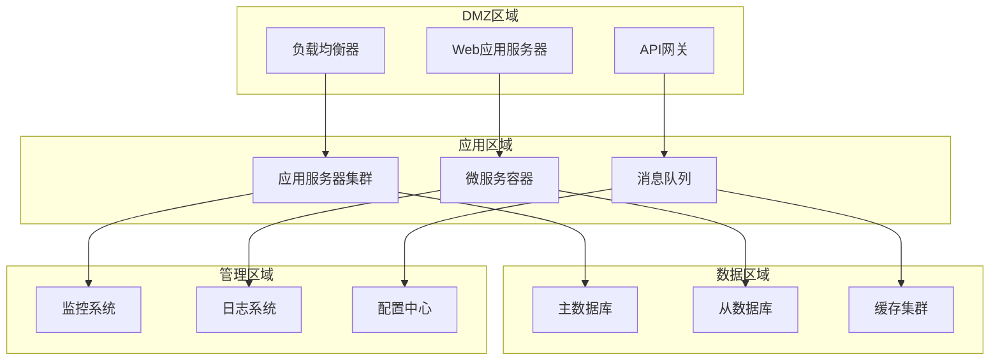
```mermaid
graph TB
    subgraph "DMZ区域"
        E1[负载均衡器]
        E2[Web应用服务器]
        E3[API网关]
    end
    
    subgraph "应用区域"
        F1[应用服务器集群]
        F2[微服务容器]
        F3[消息队列]
    end
    
    subgraph "数据区域"
        G1[主数据库]
        G2[从数据库]
        G3[缓存集群]
    end
    
    subgraph "管理区域"
        H1[监控系统]
        H2[日志系统]
        H3[配置中心]
    end
    
    E1 --> F1
    E2 --> F2
    E3 --> F3
    
    F1 --> G1
    F2 --> G2
    F3 --> G3
    
    F1 --> H1
    F2 --> H2
    F3 --> H3
```

### 4.2 数据架构设计

#### 4.2.1 数据模型设计

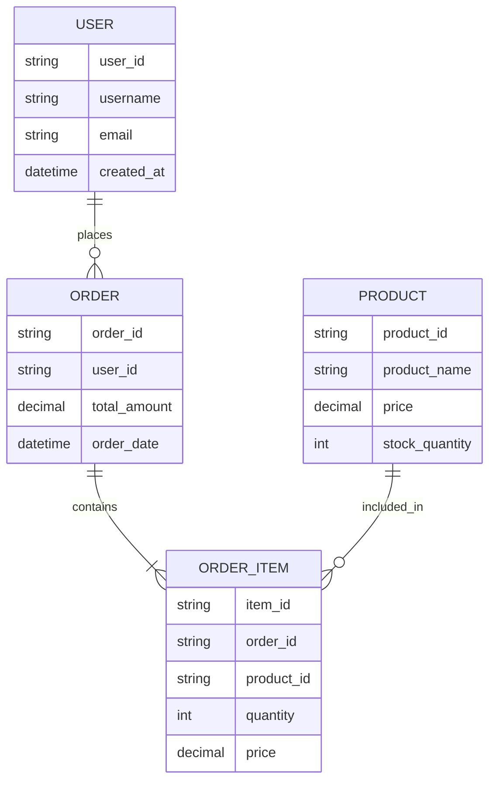
```mermaid
erDiagram
    USER ||--o{ ORDER : places
    USER {
        string user_id
        string username
        string email
        datetime created_at
    }
    ORDER ||--|{ ORDER_ITEM : contains
    ORDER {
        string order_id
        string user_id
        decimal total_amount
        datetime order_date
    }
    ORDER_ITEM {
        string item_id
        string order_id
        string product_id
        int quantity
        decimal price
    }
    PRODUCT ||--o{ ORDER_ITEM : included_in
    PRODUCT {
        string product_id
        string product_name
        decimal price
        int stock_quantity
    }
```

#### 4.2.2 数据流设计

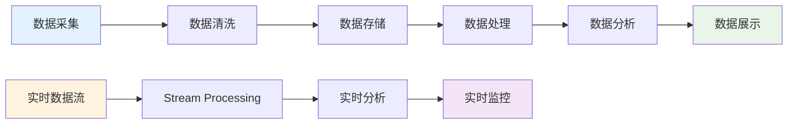
```mermaid
graph LR
    A[数据采集] --> B[数据清洗]
    B --> C[数据存储]
    C --> D[数据处理]
    D --> E[数据分析]
    E --> F[数据展示]
    
    G[实时数据流] --> H[Stream Processing]
    H --> I[实时分析]
    I --> J[实时监控]
    
    style A fill:#e3f2fd
    style F fill:#e8f5e8
    style G fill:#fff3e0
    style J fill:#f3e5f5
```

### 4.3 安全架构设计

#### 4.3.1 安全防护体系

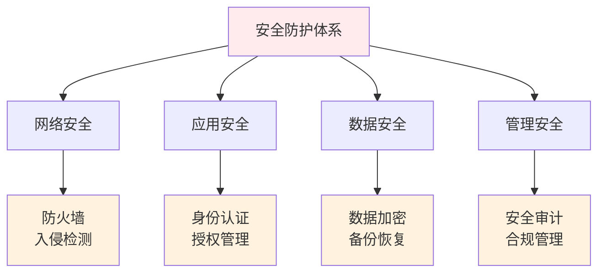
```mermaid
graph TD
    A[安全防护体系] --> B[网络安全]
    A --> C[应用安全]
    A --> D[数据安全]
    A --> E[管理安全]
    
    B --> F[防火墙<br/>入侵检测]
    C --> G[身份认证<br/>授权管理]
    D --> H[数据加密<br/>备份恢复]
    E --> I[安全审计<br/>合规管理]
    
    style A fill:#ffebee
    style F fill:#fff3e0
    style G fill:#fff3e0
    style H fill:#fff3e0
    style I fill:#fff3e0
```

#### 4.3.2 认证授权流程

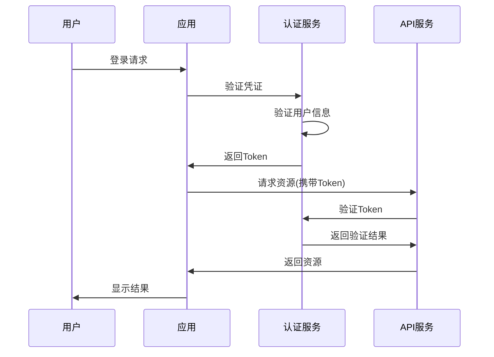
```mermaid
sequenceDiagram
    participant User as 用户
    participant App as 应用
    participant Auth as 认证服务
    participant API as API服务
    
    User->>App: 登录请求
    App->>Auth: 验证凭证
    Auth->>Auth: 验证用户信息
    Auth->>App: 返回Token
    App->>API: 请求资源(携带Token)
    API->>Auth: 验证Token
    Auth->>API: 返回验证结果
    API->>App: 返回资源
    App->>User: 显示结果
```

---

## 📋 第五章：实施计划 (Implementation Plan)

### 5.1 项目实施路线图

#### 5.1.1 整体时间规划

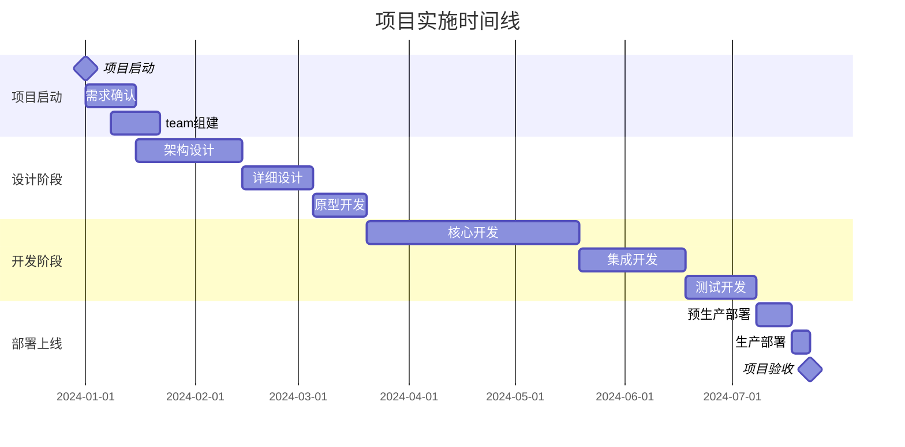
```mermaid
gantt
    title 项目实施时间线
    dateFormat  YYYY-MM-DD
    section 项目启动
    项目启动        :milestone, start, 2024-01-01, 0d
    需求确认        :req, 2024-01-01, 2024-01-15
    team组建        :team, 2024-01-08, 2024-01-22
    
    section 设计阶段
    架构设计        :arch, after req, 30d
    详细设计        :detail, after arch, 20d
    原型开发        :proto, after detail, 15d
    
    section 开发阶段
    核心开发        :dev1, after proto, 60d
    集成开发        :dev2, after dev1, 30d
    测试开发        :test, after dev2, 20d
    
    section 部署上线
    预生产部署      :pre, after test, 10d
    生产部署        :prod, after pre, 5d
    项目验收        :milestone, accept, after prod, 0d
```

#### 5.1.2 分阶段实施策略

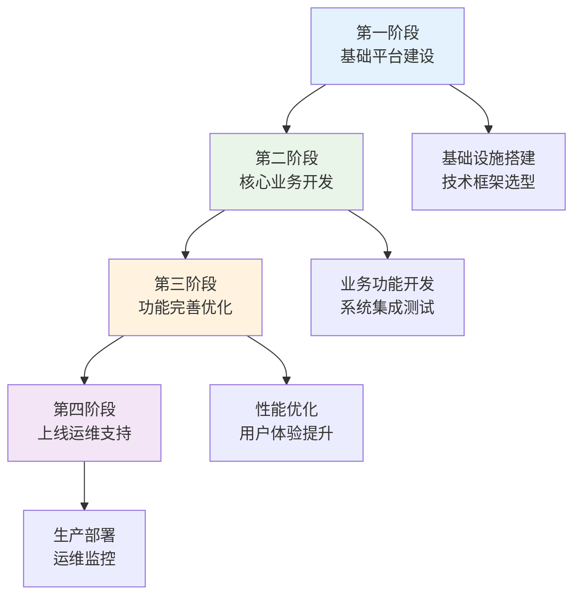
```mermaid
graph TD
    A[第一阶段<br/>基础平台建设] --> B[第二阶段<br/>核心业务开发]
    B --> C[第三阶段<br/>功能完善优化]
    C --> D[第四阶段<br/>上线运维支持]
    
    A --> E[基础设施搭建<br/>技术框架选型]
    B --> F[业务功能开发<br/>系统集成测试]
    C --> G[性能优化<br/>用户体验提升]
    D --> H[生产部署<br/>运维监控]
    
    style A fill:#e3f2fd
    style B fill:#e8f5e8
    style C fill:#fff3e0
    style D fill:#f3e5f5
```

### 5.2 资源配置

#### 5.2.1 团队组织架构

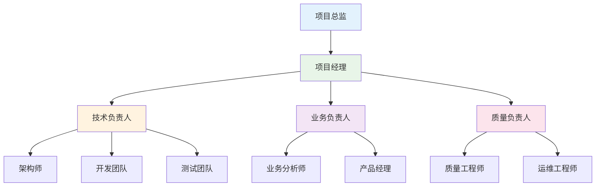
```mermaid
graph TB
    A[项目总监] --> B[项目经理]
    B --> C[技术负责人]
    B --> D[业务负责人]
    B --> E[质量负责人]
    
    C --> F[架构师]
    C --> G[开发团队]
    C --> H[测试团队]
    
    D --> I[业务分析师]
    D --> J[产品经理]
    
    E --> K[质量工程师]
    E --> L[运维工程师]
    
    style A fill:#e3f2fd
    style B fill:#e8f5e8
    style C fill:#fff3e0
    style D fill:#f3e5f5
    style E fill:#fce4ec
```

#### 5.2.2 人力资源配置

| 角色 | 人数 | 技能要求 | 工作内容 |
|------|------|----------|----------|
| **项目经理** | 1 | PMP认证，5年以上经验 | 项目整体管理协调 |
| **架构师** | 2 | 企业架构，云原生技术 | 系统架构设计 |
| **开发工程师** | 8 | Java/Python，微服务 | 功能开发实现 |
| **测试工程师** | 3 | 自动化测试，性能测试 | 质量保障测试 |
| **运维工程师** | 2 | DevOps，容器化部署 | 系统部署运维 |
| **业务分析师** | 2 | 业务建模，需求分析 | 需求分析梳理 |

### 5.3 质量保障

#### 5.3.1 质量控制流程

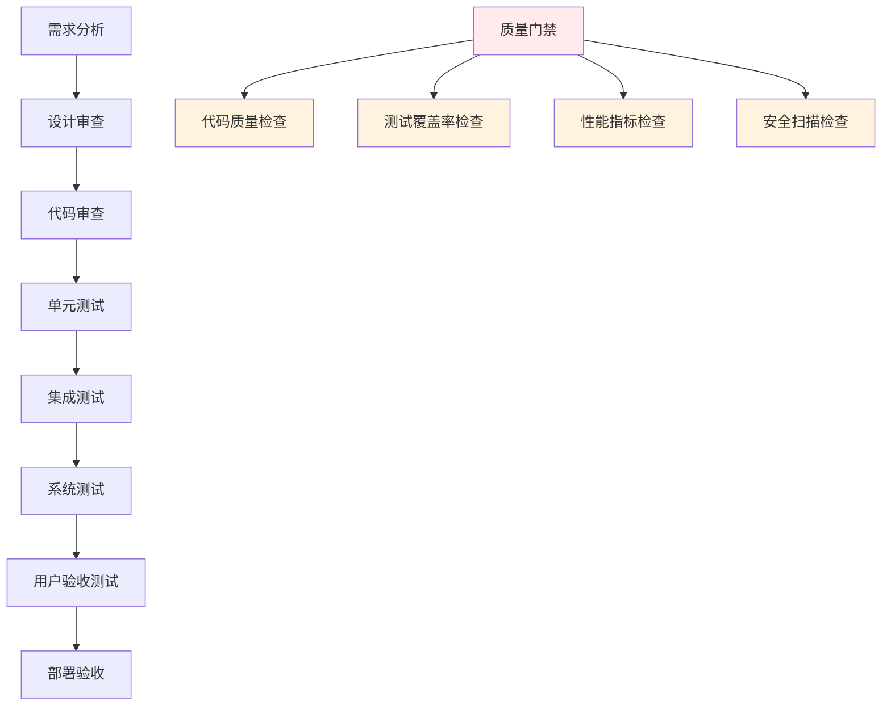
```mermaid
graph TD
    A[需求分析] --> B[设计审查]
    B --> C[代码审查]
    C --> D[单元测试]
    D --> E[集成测试]
    E --> F[系统测试]
    F --> G[用户验收测试]
    G --> H[部署验收]
    
    I[质量门禁] --> J[代码质量检查]
    I --> K[测试覆盖率检查]
    I --> L[性能指标检查]
    I --> M[安全扫描检查]
    
    style I fill:#ffebee
    style J fill:#fff3e0
    style K fill:#fff3e0
    style L fill:#fff3e0
    style M fill:#fff3e0
```

#### 5.3.2 质量指标

| 质量维度 | 指标 | 目标值 | 检查频率 |
|---------|------|--------|----------|
| **代码质量** | 代码覆盖率 | >80% | 每日构建 |
| **功能质量** | 缺陷密度 | <0.5个/KLOC | 每周检查 |
| **性能质量** | 响应时间 | <2秒 | 每次发布 |
| **安全质量** | 漏洞数量 | 0个高危漏洞 | 每月扫描 |

---

## ⚠️ 第六章：风险管控 (Risk Management)

### 6.1 风险识别与评估

#### 6.1.1 风险分类矩阵

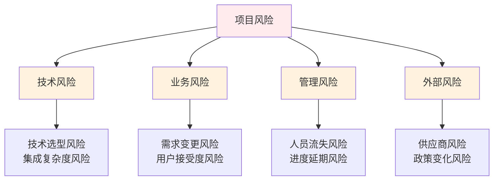
```mermaid
graph TD
    A[项目风险] --> B[技术风险]
    A --> C[业务风险]
    A --> D[管理风险]
    A --> E[外部风险]
    
    B --> F[技术选型风险<br/>集成复杂度风险]
    C --> G[需求变更风险<br/>用户接受度风险]
    D --> H[人员流失风险<br/>进度延期风险]
    E --> I[供应商风险<br/>政策变化风险]
    
    style A fill:#ffebee
    style B fill:#fff3e0
    style C fill:#fff3e0
    style D fill:#fff3e0
    style E fill:#fff3e0
```

#### 6.1.2 风险评估表

| 风险类型 | 风险描述 | 概率 | 影响 | 风险等级 | 应对策略 |
|---------|----------|------|------|----------|----------|
| **技术风险** | 新技术学习成本高 | 中 | 中 | 中等 | 技术培训，原型验证 |
| **业务风险** | 需求频繁变更 | 高 | 高 | 高 | 需求锁定，变更控制 |
| **管理风险** | 关键人员离职 | 中 | 高 | 高 | 知识传承，人员备份 |
| **外部风险** | 第三方服务中断 | 低 | 中 | 低 | 多供应商策略 |

### 6.2 风险应对策略

#### 6.2.1 风险应对流程

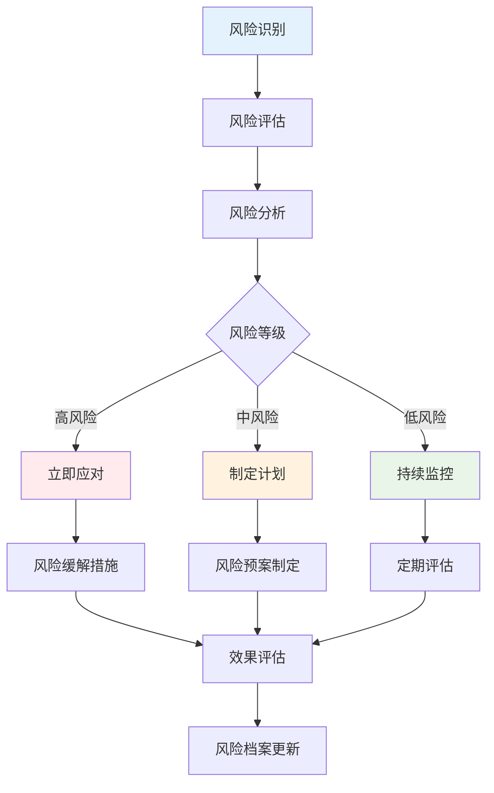
```mermaid
graph TD
    A[风险识别] --> B[风险评估]
    B --> C[风险分析]
    C --> D{风险等级}
    
    D -->|高风险| E[立即应对]
    D -->|中风险| F[制定计划]
    D -->|低风险| G[持续监控]
    
    E --> H[风险缓解措施]
    F --> I[风险预案制定]
    G --> J[定期评估]
    
    H --> K[效果评估]
    I --> K
    J --> K
    
    K --> L[风险档案更新]
    
    style A fill:#e3f2fd
    style E fill:#ffebee
    style F fill:#fff3e0
    style G fill:#e8f5e8
```

#### 6.2.2 关键风险应对措施

```mermaid
graph LR
    A[高风险项目] --> B[技术风险]
    A --> C[进度风险]
    A --> D[质量风险]
    
    B --> E[技术预研<br/>专家咨询<br/>原型验证]
    C --> F[敏捷开发<br/>里程碑管控<br/>资源备份]
    D --> G[质量门禁<br/>自动化测试<br/>持续集成]
    
    style A fill:#ffebee
    style E fill:#e8f5e8
    style F fill:#e8f5e8
    style G fill:#e8f5e8
```

### 6.3 风险监控与预警

#### 6.3.1 风险监控指标

| 监控维度 | 关键指标 | 预警阈值 | 监控频率 |
|---------|----------|----------|----------|
| **进度监控** | 任务完成率 | <80% | 每周 |
| **质量监控** | 缺陷率 | >5% | 每日 |
| **成本监控** | 预算偏差 | >10% | 每月 |
| **人员监控** | 离职率 | >15% | 每季度 |

#### 6.3.2 预警响应机制

```mermaid
sequenceDiagram
    participant Monitor as 监控系统
    participant Alert as 预警系统
    participant PM as 项目经理
    participant Team as 项目团队
    
    Monitor->>Alert: 触发预警阈值
    Alert->>PM: 发送预警通知
    PM->>Team: 组织应急响应
    Team->>PM: 执行应对措施
    PM->>Monitor: 更新监控状态
    Monitor->>Alert: 确认风险解除
```

---

## 🔧 第七章：运维支持 (Operations Support)

### 7.1 运维架构设计

#### 7.1.1 运维管理体系

```mermaid
graph TD
    A[运维管理体系] --> B[监控管理]
    A --> C[变更管理]
    A --> D[故障管理]
    A --> E[性能管理]
    A --> F[安全管理]
    
    B --> G[系统监控<br/>应用监控<br/>业务监控]
    C --> H[变更计划<br/>变更执行<br/>变更验证]
    D --> I[故障检测<br/>故障处理<br/>故障恢复]
    E --> J[性能监控<br/>容量规划<br/>性能调优]
    F --> K[安全监控<br/>漏洞管理<br/>合规检查]
    
    style A fill:#e3f2fd
    style B fill:#e8f5e8
    style C fill:#fff3e0
    style D fill:#f3e5f5
    style E fill:#fce4ec
    style F fill:#ffebee
```

#### 7.1.2 运维自动化流程

```mermaid
graph LR
    A[代码提交] --> B[自动构建]
    B --> C[自动测试]
    C --> D[自动部署]
    D --> E[自动监控]
    E --> F[自动报警]
    F --> G[自动修复]
    
    style A fill:#e3f2fd
    style G fill:#e8f5e8
```

### 7.2 监控与告警

#### 7.2.1 监控指标体系

| 监控层级 | 监控指标 | 告警阈值 | 处理级别 |
|---------|----------|----------|----------|
| **基础设施** | CPU使用率 | >85% | P2 |
| **应用系统** | 响应时间 | >3秒 | P1 |
| **业务指标** | 交易成功率 | <95% | P0 |
| **安全指标** | 异常访问 | >100次/分钟 | P1 |

#### 7.2.2 告警处理流程

```mermaid
graph TD
    A[告警触发] --> B{告警级别}
    B -->|P0| C[立即处理]
    B -->|P1| D[1小时内处理]
    B -->|P2| E[4小时内处理]
    B -->|P3| F[下个工作日处理]
    
    C --> G[自动修复]
    D --> H[人工干预]
    E --> I[计划修复]
    F --> J[例行维护]
    
    G --> K[问题解决]
    H --> K
    I --> K
    J --> K
    
    style A fill:#ffebee
    style C fill:#e8f5e8
    style K fill:#e8f5e8
```

### 7.3 备份与恢复

#### 7.3.1 备份策略

```mermaid
graph TD
    A[备份策略] --> B[全量备份]
    A --> C[增量备份]
    A --> D[差异备份]
    
    B --> E[每周一次<br/>长期保存]
    C --> F[每日一次<br/>短期保存]
    D --> G[实时同步<br/>热备份]
    
    H[恢复策略] --> I[RTO ≤ 4小时]
    H --> J[RPO ≤ 1小时]
    H --> K[自动故障切换]
    
    style A fill:#e3f2fd
    style H fill:#fff3e0
```

#### 7.3.2 灾备体系

```mermaid
graph LR
    A[生产环境] --> B[同城备份]
    A --> C[异地备份]
    A --> D[云端备份]
    
    B --> E[实时同步<br/>RPO=0]
    C --> F[定期同步<br/>RPO=4H]
    D --> G[在线备份<br/>RPO=24H]
    
    style A fill:#e3f2fd
    style E fill:#e8f5e8
    style F fill:#fff3e0
    style G fill:#f3e5f5
```

---

## 📚 第八章：文档版本管理 (Document Version Control)

### 8.1 版本控制策略

#### 8.1.1 版本命名规范

```mermaid
graph TD
    A[版本号规范] --> B[主版本号<br/>Major.Minor.Patch]
    B --> C[v1.0.0 - 初始版本]
    B --> D[v1.1.0 - 功能增加]
    B --> E[v1.1.1 - 问题修复]
    
    F[版本状态] --> G[Draft - 草稿]
    F --> H[Review - 审核中]
    F --> I[Approved - 已批准]
    F --> J[Archived - 已归档]
    
    style A fill:#e3f2fd
    style F fill:#fff3e0
```

#### 8.1.2 变更管理流程

```mermaid
sequenceDiagram
    participant Author as 文档作者
    participant Review as 审核人员
    participant Approve as 批准人员
    participant System as 版本系统
    
    Author->>System: 提交变更请求
    System->>Review: 发送审核通知
    Review->>Review: 技术审核
    Review->>Approve: 提交批准
    Approve->>Approve: 业务审核
    Approve->>System: 批准发布
    System->>Author: 通知发布完成
```

### 8.2 文档生命周期管理

#### 8.2.1 文档状态转换

```mermaid
stateDiagram-v2
    [*] --> 创建
    创建 --> 编写中
    编写中 --> 审核中
    审核中 --> 修改中 : 审核不通过
    修改中 --> 审核中
    审核中 --> 已发布 : 审核通过
    已发布 --> 更新中 : 需要更新
    更新中 --> 审核中
    已发布 --> 已归档 : 文档过期
    已归档 --> [*]
```

#### 8.2.2 文档变更追踪

| 版本 | 变更日期 | 变更内容 | 变更类型 | 责任人 |
|------|----------|----------|----------|--------|
| v1.0.0 | 2024-01-01 | 初始版本创建 | 新增 | 架构师 |
| v1.1.0 | 2024-02-01 | 增加安全设计章节 | 功能增强 | 安全专家 |
| v1.1.1 | 2024-02-15 | 修复架构图显示问题 | 缺陷修复 | 文档工程师 |
| v1.2.0 | 2024-03-01 | 更新实施计划 | 内容更新 | 项目经理 |

### 8.3 审批流程管理

#### 8.3.1 多级审批机制

```mermaid
graph TD
    A[文档提交] --> B[技术审核]
    B --> C{技术审核通过}
    C -->|是| D[业务审核]
    C -->|否| E[返回修改]
    
    D --> F{业务审核通过}
    F -->|是| G[管理审批]
    F -->|否| E
    
    G --> H{管理审批通过}
    H -->|是| I[正式发布]
    H -->|否| E
    
    E --> A
    
    style A fill:#e3f2fd
    style I fill:#e8f5e8
    style E fill:#fff3e0
```

#### 8.3.2 审批权限矩阵

| 文档类型 | 技术审核 | 业务审核 | 管理审批 | 最终批准 |
|---------|----------|----------|----------|----------|
| **架构设计** | 首席架构师 | 技术总监 | CTO | CTO |
| **实施计划** | 项目经理 | 业务负责人 | 事业部总经理 | 事业部总经理 |
| **风险评估** | 质量经理 | 风险经理 | 首席风险官 | 首席风险官 |
| **运维手册** | 运维经理 | 技术总监 | CTO | CTO |

---

## 🎯 第九章：差异化表达指南 (Differentiated Expression Guide)

### 9.1 决策者版本设计

#### 9.1.1 决策者关注点

```mermaid
graph TD
    A[决策者版本] --> B[战略价值]
    A --> C[投资回报]
    A --> D[风险控制]
    A --> E[竞争优势]
    
    B --> F[业务转型价值<br/>市场机会分析]
    C --> G[ROI计算<br/>成本效益分析]
    D --> H[风险评估<br/>应对策略]
    E --> I[技术领先性<br/>差异化优势]
    
    style A fill:#e3f2fd
    style B fill:#e8f5e8
    style C fill:#fff3e0
    style D fill:#ffebee
    style E fill:#f3e5f5
```

#### 9.1.2 决策者版本结构

```markdown
# 决策者版本目录结构
1. 执行摘要 (1-2页)
   - 项目概述
   - 核心价值
   - 投资回报
   - 关键风险

2. 商业论证 (2-3页)
   - 市场机会
   - 竞争分析
   - 投资建议
   - 实施建议

3. 风险与应对 (1页)
   - 主要风险
   - 控制措施
   - 应急预案

4. 决策建议 (1页)
   - 推荐方案
   - 关键决策点
   - 下一步行动
```

### 9.2 技术版本设计

#### 9.2.1 技术人员关注点

```mermaid
graph TD
    A[技术版本] --> B[架构设计]
    A --> C[技术选型]
    A --> D[实现方案]
    A --> E[质量保障]
    
    B --> F[系统架构<br/>技术架构]
    C --> G[技术栈选择<br/>工具平台]
    D --> H[开发规范<br/>集成方案]
    E --> I[测试策略<br/>部署方案]
    
    style A fill:#e3f2fd
    style B fill:#e8f5e8
    style C fill:#fff3e0
    style D fill:#f3e5f5
    style E fill:#fce4ec
```

#### 9.2.2 技术版本结构

```markdown
# 技术版本目录结构
1. 架构设计 (5-8页)
   - 整体架构
   - 技术架构
   - 数据架构
   - 安全架构

2. 技术选型 (3-5页)
   - 技术栈分析
   - 工具平台选择
   - 第三方组件
   - 选型理由

3. 实现方案 (8-12页)
   - 开发规范
   - 接口设计
   - 数据库设计
   - 部署方案

4. 质量保障 (3-5页)
   - 测试策略
   - 代码规范
   - 性能优化
   - 监控方案
```

### 9.3 实施版本设计

#### 9.3.1 实施人员关注点

```mermaid
graph TD
    A[实施版本] --> B[项目计划]
    A --> C[资源配置]
    A --> D[执行流程]
    A --> E[质量控制]
    
    B --> F[时间计划<br/>里程碑管理]
    C --> G[人力资源<br/>工具资源]
    D --> H[工作流程<br/>协作机制]
    E --> I[检查点<br/>验收标准]
    
    style A fill:#e3f2fd
    style B fill:#e8f5e8
    style C fill:#fff3e0
    style D fill:#f3e5f5
    style E fill:#fce4ec
```

#### 9.3.2 实施版本结构

```markdown
# 实施版本目录结构
1. 项目计划 (5-8页)
   - 总体计划
   - 详细计划
   - 里程碑管理
   - 进度监控

2. 资源管理 (3-5页)
   - 人力资源
   - 设备资源
   - 工具软件
   - 预算管理

3. 执行指南 (8-12页)
   - 工作流程
   - 操作手册
   - 协作机制
   - 沟通管理

4. 质量管理 (3-5页)
   - 质量标准
   - 检查流程
   - 验收标准
   - 问题处理
```

### 9.4 多版本协同管理

#### 9.4.1 版本关联关系

```mermaid
graph TD
    A[主版本文档] --> B[决策者版本]
    A --> C[技术版本]
    A --> D[实施版本]
    
    B --> E[高层摘要<br/>商业价值]
    C --> F[技术细节<br/>实现方案]
    D --> G[操作指南<br/>执行计划]
    
    H[版本同步] --> I[内容一致性]
    H --> J[更新同步]
    H --> K[交叉引用]
    
    style A fill:#e3f2fd
    style H fill:#fff3e0
```

#### 9.4.2 版本维护策略

```mermaid
graph LR
    A[变更请求] --> B[影响分析]
    B --> C[多版本更新]
    C --> D[一致性检查]
    D --> E[版本发布]
    
    F[版本控制] --> G[统一版本号]
    F --> H[关联管理]
    F --> I[同步发布]
    
    style A fill:#e3f2fd
    style E fill:#e8f5e8
    style F fill:#fff3e0
    style I fill:#f3e5f5
```

---

## 📋 第十章：模板使用指南 (Template Usage Guide)

### 10.1 模板定制指南

#### 10.1.1 模板结构定制

```mermaid
graph TD
    A[模板定制] --> B[章节选择]
    A --> C[内容调整]
    A --> D[格式统一]
    A --> E[审批流程]
    
    B --> F[必选章节<br/>可选章节]
    C --> G[企业特色<br/>行业特点]
    D --> H[企业VI<br/>文档标准]
    E --> I[审批权限<br/>流程定义]
    
    style A fill:#e3f2fd
    style B fill:#e8f5e8
    style C fill:#fff3e0
    style D fill:#f3e5f5
    style E fill:#fce4ec
```

#### 10.1.2 模板配置清单

| 配置项 | 说明 | 示例 | 必选 |
|--------|------|------|------|
| **企业标识** | 公司Logo、标准色 | IBM蓝色主题 | 是 |
| **文档标准** | 字体、格式、布局 | 微软雅黑、A4纸 | 是 |
| **审批流程** | 审批人员、流程步骤 | 三级审批制 | 是 |
| **章节模板** | 必选章节、可选章节 | 执行摘要必选 | 是 |
| **评审标准** | 质量标准、检查点 | 架构评审清单 | 否 |

### 10.2 最佳实践

#### 10.2.1 文档编写最佳实践

```mermaid
graph TD
    A[文档编写原则] --> B[受众导向]
    A --> C[结构清晰]
    A --> D[内容准确]
    A --> E[持续改进]
    
    B --> F[明确目标读者<br/>调整表达方式]
    C --> G[逻辑清晰<br/>层次分明]
    D --> H[数据准确<br/>技术可行]
    E --> I[定期更新<br/>反馈改进]
    
    style A fill:#e3f2fd
    style B fill:#e8f5e8
    style C fill:#fff3e0
    style D fill:#f3e5f5
    style E fill:#fce4ec
```

#### 10.2.2 质量检查清单

```markdown
# 文档质量检查清单

## 内容质量
- [ ] 信息准确性：技术信息、数据、时间等
- [ ] 逻辑完整性：前后一致、逻辑合理
- [ ] 受众适配性：语言风格、技术深度
- [ ] 可操作性：步骤清晰、可执行

## 格式规范
- [ ] 文档结构：章节完整、层次清晰
- [ ] 图表质量：清晰美观、信息完整
- [ ] 排版格式：统一规范、易于阅读
- [ ] 引用标准：引用规范、版权合规

## 审批流程
- [ ] 技术审核：架构合理、技术可行
- [ ] 业务审核：价值明确、需求匹配
- [ ] 管理审批：投资合理、风险可控
- [ ] 版本管理：版本正确、变更记录
```

### 10.3 工具与资源

#### 10.3.1 推荐工具

```mermaid
graph TD
    A[文档工具] --> B[编辑工具]
    A --> C[协作工具]
    A --> D[版本工具]
    A --> E[发布工具]
    
    B --> F[Markdown编辑器<br/>Word/Pages]
    C --> G[Confluence<br/>Notion]
    D --> H[Git<br/>SharePoint]
    E --> I[GitBook<br/>Sphinx]
    
    style A fill:#e3f2fd
    style B fill:#e8f5e8
    style C fill:#fff3e0
    style D fill:#f3e5f5
    style E fill:#fce4ec
```

#### 10.3.2 资源库

| 资源类型 | 名称 | 用途 | 获取方式 |
|---------|------|------|----------|
| **模板库** | 架构设计模板 | 标准化架构文档 | 内部下载 |
| **图标库** | 技术图标集 | 架构图绘制 | 在线获取 |
| **检查单** | 质量检查清单 | 文档质量保障 | 流程文档 |
| **样例库** | 优秀案例集 | 学习参考 | 知识库 |

---

## 📚 附录 (Appendices)

### 附录A：缩略语表

| 缩略语 | 全称 | 中文含义 |
|--------|------|----------|
| **API** | Application Programming Interface | 应用程序编程接口 |
| **CI/CD** | Continuous Integration/Continuous Deployment | 持续集成/持续部署 |
| **ROI** | Return on Investment | 投资回报率 |
| **SLA** | Service Level Agreement | 服务水平协议 |
| **KPI** | Key Performance Indicator | 关键绩效指标 |

### 附录B：参考资料

1. **IBM架构框架**
   - IBM Solution Architecture Framework
   - IBM Cloud Architecture Center
   - IBM Reference Architecture

2. **行业标准**
   - TOGAF企业架构框架
   - ISO/IEC 42010系统架构描述
   - IEEE 1471架构描述标准

3. **最佳实践**
   - 《企业架构实践指南》
   - 《软件架构设计模式》
   - 《敏捷软件开发实践》

### 附录C：文档模板

```markdown
# 文档模板示例
## 基本信息
- 项目名称：[项目名称]
- 文档版本：[版本号]
- 创建日期：[日期]
- 最后更新：[日期]
- 文档状态：[状态]

## 变更记录
| 版本 | 日期 | 变更内容 | 变更人 |
|------|------|----------|--------|
| v1.0 | 2024-01-01 | 初始版本 | 张三 |

## 审批记录
| 角色 | 姓名 | 审批意见 | 签名 | 日期 |
|------|------|----------|------|------|
| 技术审核 | 李四 | 同意 | [签名] | 2024-01-02 |
| 业务审核 | 王五 | 同意 | [签名] | 2024-01-03 |
| 管理审批 | 赵六 | 同意 | [签名] | 2024-01-04 |
```

---

## 📞 联系信息

**文档维护团队**
- 负责人：企业架构师
- 电话：400-800-0000
- 邮箱：architecture@company.com
- 地址：北京市朝阳区xxx大厦

**技术支持**
- 支持热线：400-900-0000
- 技术邮箱：support@company.com
- 在线支持：support.company.com

---

*本文档遵循IBM Solution Architecture Framework标准，结合企业实际情况进行了定制化设计。*
*文档版权归属企业所有，仅供内部使用。*
*如有疑问或建议，请联系文档维护团队。*

---

**文档结束**

*© 2024 企业名称. 保留所有权利.*
