# Mermaid与HTML大数据架构图效果对比

## 📋 概述

本文档演示使用Mermaid图表和HTML/CSS来实现大数据架构图的效果，并与PlantUML进行对比。

## 🎨 Mermaid图表实现

### 版本1：Mermaid流程图版本

```mermaid
graph TD
    %% 样式定义
    classDef networkLayer fill:#4A90E2,stroke:#333,stroke-width:2px,color:#fff
    classDef commLayer fill:#4CAF50,stroke:#333,stroke-width:2px,color:#fff
    classDef appLayer fill:#8BC34A,stroke:#333,stroke-width:2px,color:#fff
    classDef serviceLayer fill:#FF9800,stroke:#333,stroke-width:2px,color:#fff
    classDef computeLayer fill:#9C27B0,stroke:#333,stroke-width:2px,color:#fff
    classDef storageLayer fill:#FF5722,stroke:#333,stroke-width:2px,color:#fff
    classDef middlewareLayer fill:#607D8B,stroke:#333,stroke-width:2px,color:#fff
    classDef dataSourceLayer fill:#795548,stroke:#333,stroke-width:2px,color:#fff
    classDef businessLayer fill:#673AB7,stroke:#333,stroke-width:2px,color:#fff
    classDef devopsLayer fill:#2196F3,stroke:#333,stroke-width:2px,color:#fff

    %% 网络接入层
    subgraph NL["🌐 网络接入层"]
        DDOS["DDOS防护"]
        SAS["安全防护SAS"]
        WAF["WAF防护"]
        LB["负载均衡"]
        CDN["CDN"]
    end

    %% 网络通信层
    subgraph CL["🔗 网络通信层"]
        WS["WebSocket"]
        HTTP["HTTP/HTTPS"]
        TCP["TCP/UDP"]
        AGW["API网关"]
    end

    %% 应用层
    subgraph AL["📊 应用层"]
        DASH["大数据实时看板<br/>数据库可视化报表<br/>各类仪表盘"]
    end

    %% 服务层
    subgraph SL["⚙️ 服务层"]
        RDS["RDS"]
        DORIS["Doris"]
        REDIS["Redis"]
        SC["SpringCloud"]
        MS1["微服务"]
        MS2["微服务"]
        DJANGO["Django"]
        UBI["UBI平台"]
        API["API"]
    end

    %% 计算层
    subgraph COMP["🧠 计算层"]
        SPARK["SparkSQL/RM"]
        MR["MapReduce"]
        FLINK["Flink/Streaming"]
        ML["机器学习"]
        KAFKA["Kafka"]
        DM["数据挖掘"]
    end

    %% 存储层
    subgraph ST["💾 存储层"]
        HDFS["HDFS"]
        HBASE["HBase"]
        DH["DataHub"]
        IMQTT["IMQTT"]
        KYDMA["KYDMA"]
    end

    %% 中间层
    subgraph MW["🔧 中间层"]
        DS["DataSource"]
        FLUME["Flume"]
        LS["LogStash"]
        BEATS["Beats"]
        SCOOP["Scoop"]
    end

    %% 数据源层
    subgraph DSL["📁 数据源层"]
        SEMI["半结构化数据"]
        STRUCT["结构化数据"]
        REAL["实时数据"]
        OFFLINE["离线数据"]
    end

    %% 业务平台
    subgraph BP["🏢 业务平台架构体系"]
        UC["用户中心"]
        PS["公共服务"]
        CS["容器服务"]
        US["用户服务"]
        DS_BUS["数据服务"]
        PAY["支付服务"]
        MSG["消息服务"]
        FEIGN["Feign"]
        RIBBON["Ribbon"]
        HYSTRIX["Hystrix"]
        EUREKA["Eureka"]
        ZUUL["Zuul"]
        CONFIG["配置中心"]
    end

    %% 运维服务
    subgraph DO["🛠️ 运维服务"]
        REST["REST"]
        RPC["RPC"]
        MQ["MQ"]
        GITLAB["GitLab"]
        JENKINS["Jenkins"]
        DOCKER["Docker"]
        K8S["Kubernetes"]
        ZABBIX["ZABBIX"]
        LOG["日志服务"]
        ES["ES"]
        REDIS_CLUSTER["Redis集群"]
        OSS["OSS"]
        MONGO["MongoDB集群"]
    end

    %% 连接关系
    NL --> CL
    CL --> AL
    AL --> SL
    SL --> COMP
    COMP --> ST
    ST --> MW
    MW --> DSL

    %% 水平连接
    SL -.-> BP
    COMP -.-> BP
    BP -.-> DO

    %% 应用样式
    class DDOS,SAS,WAF,LB,CDN networkLayer
    class WS,HTTP,TCP,AGW commLayer
    class DASH appLayer
    class RDS,DORIS,REDIS,SC,MS1,MS2,DJANGO,UBI,API serviceLayer
    class SPARK,MR,FLINK,ML,KAFKA,DM computeLayer
    class HDFS,HBASE,DH,IMQTT,KYDMA storageLayer
    class DS,FLUME,LS,BEATS,SCOOP middlewareLayer
    class SEMI,STRUCT,REAL,OFFLINE dataSourceLayer
    class UC,PS,CS,US,DS_BUS,PAY,MSG,FEIGN,RIBBON,HYSTRIX,EUREKA,ZUUL,CONFIG businessLayer
    class REST,RPC,MQ,GITLAB,JENKINS,DOCKER,K8S,ZABBIX,LOG,ES,REDIS_CLUSTER,OSS,MONGO devopsLayer
```



### 版本2：Mermaid子图增强版本

```mermaid
flowchart TB
    %% 样式定义
    classDef blue fill:#4A90E2,stroke:#333,stroke-width:2px,color:#fff
    classDef green fill:#4CAF50,stroke:#333,stroke-width:2px,color:#fff
    classDef lightgreen fill:#8BC34A,stroke:#333,stroke-width:2px,color:#fff
    classDef orange fill:#FF9800,stroke:#333,stroke-width:2px,color:#fff
    classDef purple fill:#9C27B0,stroke:#333,stroke-width:2px,color:#fff
    classDef red fill:#FF5722,stroke:#333,stroke-width:2px,color:#fff
    classDef gray fill:#607D8B,stroke:#333,stroke-width:2px,color:#fff
    classDef brown fill:#795548,stroke:#333,stroke-width:2px,color:#fff

    %% 左侧主架构
    subgraph MAIN["🏗️ 大数据架构体系"]
        direction TB
        
        subgraph NET["🌐 网络接入层"]
            direction LR
            N1["DDOS防护"]:::blue
            N2["安全防护SAS"]:::blue
            N3["WAF防护"]:::blue
            N4["负载均衡"]:::blue
            N5["CDN"]:::blue
        end
        
        subgraph COMM["🔗 网络通信层"]
            direction LR
            C1["WebSocket"]:::green
            C2["HTTP/HTTPS"]:::green
            C3["TCP/UDP"]:::green
            C4["API网关"]:::green
        end
        
        subgraph APP["📊 应用层"]
            A1["大数据实时看板<br/>数据库可视化报表<br/>各类仪表盘"]:::lightgreen
        end
        
        subgraph SERVICE["⚙️ 服务层"]
            direction LR
            S1["RDS"]:::orange
            S2["Doris"]:::orange
            S3["Redis"]:::orange
            S4["SpringCloud"]:::orange
            S5["微服务"]:::orange
            S6["Django"]:::orange
            S7["UBI平台"]:::orange
            S8["API"]:::orange
        end
        
        subgraph COMPUTE["🧠 计算层"]
            direction LR
            CP1["SparkSQL/RM"]:::purple
            CP2["MapReduce"]:::purple
            CP3["Flink/Streaming"]:::purple
            CP4["机器学习"]:::purple
            CP5["Kafka"]:::purple
            CP6["数据挖掘"]:::purple
        end
        
        subgraph STORAGE["💾 存储层"]
            direction LR
            ST1["HDFS"]:::red
            ST2["HBase"]:::red
            ST3["DataHub"]:::red
            ST4["IMQTT"]:::red
            ST5["KYDMA"]:::red
        end
        
        subgraph MIDDLE["🔧 中间层"]
            direction LR
            M1["DataSource"]:::gray
            M2["Flume"]:::gray
            M3["LogStash"]:::gray
            M4["Beats"]:::gray
            M5["Scoop"]:::gray
        end
        
        subgraph DATASOURCE["📁 数据源层"]
            direction LR
            D1["半结构化数据"]:::brown
            D2["结构化数据"]:::brown
            D3["实时数据"]:::brown
            D4["离线数据"]:::brown
        end
        
        NET --> COMM
        COMM --> APP
        APP --> SERVICE
        SERVICE --> COMPUTE
        COMPUTE --> STORAGE
        STORAGE --> MIDDLE
        MIDDLE --> DATASOURCE
    end
    
    %% 右侧业务平台
    subgraph BUSINESS["🏢 业务平台架构体系"]
        direction TB
        
        subgraph ACCESS["接入层级"]
            B1["用户中心"]:::purple
            B2["业务服务"]:::purple
        end
        
        subgraph USERCENTER["用户中心"]
            U1["用户服务"]:::purple
            U2["数据服务"]:::purple
            U3["支付服务"]:::purple
            U4["消息服务"]:::purple
        end
        
        subgraph PUBLIC["公共服务"]
            P1["上传服务"]:::purple
            P2["缓存门控"]:::purple
        end
        
        subgraph CONTAINER["容器服务"]
            CT1["Feign"]:::purple
            CT2["Ribbon"]:::purple
            CT3["Hystrix"]:::purple
            CT4["Eureka"]:::purple
            CT5["Zuul"]:::purple
            CT6["配置中心"]:::purple
        end
    end
    
    %% 右侧运维工具
    subgraph DEVOPS["🛠️ 运维服务"]
        direction TB
        
        subgraph PROTOCOL["通信协议"]
            PR1["REST"]:::blue
            PR2["RPC"]:::blue
            PR3["MQ"]:::blue
        end
        
        subgraph CI["持续集成"]
            CI1["GitLab"]:::blue
            CI2["Jenkins"]:::blue
        end
        
        subgraph CONTAINERIZATION["容器化"]
            CO1["Docker"]:::blue
            CO2["Kubernetes"]:::blue
        end
        
        subgraph MONITORING["监控运维"]
            MO1["ZABBIX"]:::blue
            MO2["日志服务"]:::blue
        end
        
        subgraph DATABASE["数据存储"]
            DB1["MySQL集群"]:::blue
            DB2["Redis集群"]:::blue
            DB3["ES"]:::blue
            DB4["MongoDB集群"]:::blue
            DB5["OSS"]:::blue
        end
    end
    
    %% 连接关系
    MAIN -.-> BUSINESS
    BUSINESS -.-> DEVOPS
```



## 🌐 HTML/CSS实现效果

由于HTML代码过长，我将提供一个简化版本的核心结构：

```html
<!DOCTYPE html>
<html lang="zh-CN">
<head>
    <meta charset="UTF-8">
    <meta name="viewport" content="width=device-width, initial-scale=1.0">
    <title>大数据架构体系图</title>
    <style>
        body {
            font-family: 'Microsoft YaHei', Arial, sans-serif;
            background-color: #f5f5f5;
            margin: 0;
            padding: 20px;
        }
        
        .architecture-container {
            display: flex;
            gap: 20px;
            max-width: 1800px;
            margin: 0 auto;
        }
        
        .main-architecture {
            flex: 2;
            background: white;
            border-radius: 10px;
            box-shadow: 0 4px 6px rgba(0,0,0,0.1);
            padding: 20px;
            position: relative;
        }
        
        .main-architecture::before {
            content: "大数据架构体系";
            position: absolute;
            left: 10px;
            top: 50%;
            transform: translateY(-50%) rotate(-90deg);
            font-size: 24px;
            font-weight: bold;
            color: #2196F3;
        }
        
        .architecture-layer {
            margin: 15px 0;
            padding: 15px;
            border-radius: 8px;
            position: relative;
            min-height: 80px;
            display: flex;
            align-items: center;
            gap: 15px;
        }
        
        .layer-label {
            position: absolute;
            left: -40px;
            top: 50%;
            transform: translateY(-50%);
            width: 80px;
            height: 40px;
            display: flex;
            align-items: center;
            justify-content: center;
            color: white;
            font-weight: bold;
            font-size: 12px;
            border-radius: 5px;
            writing-mode: vertical-lr;
        }
        
        .component {
            background: rgba(255,255,255,0.9);
            border: 2px solid #ddd;
            border-radius: 6px;
            padding: 10px;
            min-width: 120px;
            text-align: center;
            font-size: 12px;
            font-weight: bold;
            color: #333;
            box-shadow: 0 2px 4px rgba(0,0,0,0.1);
            transition: all 0.3s ease;
        }
        
        .component:hover {
            transform: translateY(-2px);
            box-shadow: 0 4px 8px rgba(0,0,0,0.2);
        }
        
        /* 层级颜色 */
        .network-layer { background: linear-gradient(135deg, #4A90E2, #357ABD); }
        .network-layer .layer-label { background: #4A90E2; }
        
        .communication-layer { background: linear-gradient(135deg, #4CAF50, #45A049); }
        .communication-layer .layer-label { background: #4CAF50; }
        
        .application-layer { background: linear-gradient(135deg, #8BC34A, #7CB342); }
        .application-layer .layer-label { background: #8BC34A; }
        
        .service-layer { background: linear-gradient(135deg, #FF9800, #F57C00); }
        .service-layer .layer-label { background: #FF9800; }
        
        .compute-layer { background: linear-gradient(135deg, #9C27B0, #8E24AA); }
        .compute-layer .layer-label { background: #9C27B0; }
        
        .storage-layer { background: linear-gradient(135deg, #FF5722, #E64A19); }
        .storage-layer .layer-label { background: #FF5722; }
        
        .side-panel {
            flex: 1;
            display: flex;
            flex-direction: column;
            gap: 20px;
        }
        
        .business-platform {
            background: linear-gradient(135deg, #673AB7, #5E35B1);
            color: white;
            padding: 20px;
            border-radius: 10px;
            box-shadow: 0 4px 6px rgba(0,0,0,0.1);
        }
        
        .devops-tools {
            background: linear-gradient(135deg, #2196F3, #1976D2);
            color: white;
            padding: 20px;
            border-radius: 10px;
            box-shadow: 0 4px 6px rgba(0,0,0,0.1);
        }
        
        .service-group {
            background: rgba(255,255,255,0.1);
            border-radius: 6px;
            padding: 10px;
            margin-bottom: 10px;
        }
        
        .service-item {
            background: rgba(255,255,255,0.2);
            padding: 5px 10px;
            border-radius: 4px;
            font-size: 12px;
            border: 1px solid rgba(255,255,255,0.3);
            display: inline-block;
            margin: 2px;
            transition: all 0.3s ease;
        }
        
        .service-item:hover {
            background: rgba(255,255,255,0.3);
            transform: scale(1.05);
        }
    </style>
</head>
<body>
    <div class="architecture-container">
        <div class="main-architecture">
            <!-- 网络接入层 -->
            <div class="architecture-layer network-layer">
                <div class="layer-label">网络接入层</div>
                <div class="component">🛡️ DDOS防护</div>
                <div class="component">🔒 安全防护SAS</div>
                <div class="component">🌐 WAF防护</div>
                <div class="component">⚖️ 负载均衡</div>
                <div class="component">🚀 CDN</div>
            </div>
            
            <!-- 更多层级... -->
        </div>
        
        <div class="side-panel">
            <div class="business-platform">
                <h3>🏢 业务平台架构体系</h3>
                <div class="service-group">
                    <h4>用户中心</h4>
                    <div class="service-item">用户服务</div>
                    <div class="service-item">数据服务</div>
                    <div class="service-item">支付服务</div>
                    <div class="service-item">消息服务</div>
                </div>
            </div>
            
            <div class="devops-tools">
                <h3>🛠️ 运维服务</h3>
                <div class="service-group">
                    <div class="service-item">🦊 GitLab</div>
                    <div class="service-item">🔧 Jenkins</div>
                    <div class="service-item">🐳 Docker</div>
                    <div class="service-item">☸️ Kubernetes</div>
                </div>
            </div>
        </div>
    </div>
</body>
</html>
```

## 📊 效果对比分析

### 各方案效果评估

| 方案 | 视觉还原度 | 实现难度 | 维护性 | 响应式 | 交互性 | 推荐指数 |
|------|-----------|----------|--------|--------|--------|----------|
| **PlantUML** | ⭐⭐⭐ | ⭐⭐⭐⭐⭐ | ⭐⭐⭐⭐⭐ | ⭐⭐ | ⭐⭐ | ⭐⭐⭐ |
| **Mermaid** | ⭐⭐⭐⭐ | ⭐⭐⭐⭐ | ⭐⭐⭐⭐⭐ | ⭐⭐⭐ | ⭐⭐⭐ | ⭐⭐⭐⭐ |
| **HTML/CSS** | ⭐⭐⭐⭐⭐ | ⭐⭐ | ⭐⭐⭐ | ⭐⭐⭐⭐⭐ | ⭐⭐⭐⭐⭐ | ⭐⭐⭐⭐⭐ |
| **Draw.io** | ⭐⭐⭐⭐⭐ | ⭐⭐⭐⭐⭐ | ⭐⭐⭐⭐ | ⭐⭐⭐ | ⭐⭐⭐ | ⭐⭐⭐⭐⭐ |

### 详细对比

#### Mermaid图表

**优势：**
- ✅ 比PlantUML更灵活的布局控制
- ✅ 支持丰富的样式定义
- ✅ 子图功能强大，层次分明
- ✅ 可以在GitHub、GitLab等平台直接渲染
- ✅ 语法相对简单，学习成本低

**劣势：**
- ❌ 仍然无法实现完全自由的布局
- ❌ 复杂的连接线处理有限
- ❌ 图标支持主要依赖Unicode字符
- ❌ 与原截图相比，整体布局仍有差异

**效果评估：可以达到原截图60-70%的效果**

#### HTML/CSS实现

**优势：**
- ✅ 完全自由的布局控制
- ✅ 丰富的视觉效果（渐变、阴影、动画）
- ✅ 完美的响应式设计
- ✅ 强大的交互功能
- ✅ 可以精确还原原始设计

**劣势：**
- ❌ 需要较强的前端技能
- ❌ 代码量大，维护复杂
- ❌ 不能直接在Markdown中使用
- ❌ 版本控制相对困难

**效果评估：可以达到原截图90-95%的效果**

## 🎯 最终建议

### 根据不同需求的推荐方案：

1. **快速原型和文档** → **Mermaid**
   - 在Markdown中直接使用
   - 版本控制友好
   - 快速迭代

2. **完美视觉效果** → **HTML/CSS**
   - 接近原始设计
   - 丰富的交互效果
   - 专业级展示

3. **平衡方案** → **Draw.io + Mermaid**
   - Draw.io制作精美版本
   - Mermaid用于快速预览
   - 双重保障

### 混合使用建议：

```markdown
## 架构图展示

### 快速预览版本（Mermaid）
```mermaid
// 简化的Mermaid图表
```

### 完整版本（HTML）
<iframe src="./架构图.html" width="100%" height="800px"></iframe>

### 高清版本（Draw.io导出）

```

这样可以满足不同场景的需求！
