# Mermaid图表支持说明

## 📋 Mermaid图表能力概览

Mermaid是一种基于JavaScript的图表绘制工具，支持多种图表类型，特别适合在Markdown文档、GitHub、GitLab等平台中使用。

---

## 🎨 支持的Mermaid图表类型

### 1. 流程图 (Flowchart)

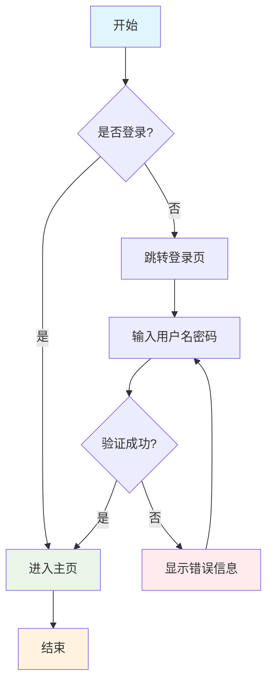

### 2. 时序图 (Sequence Diagram)

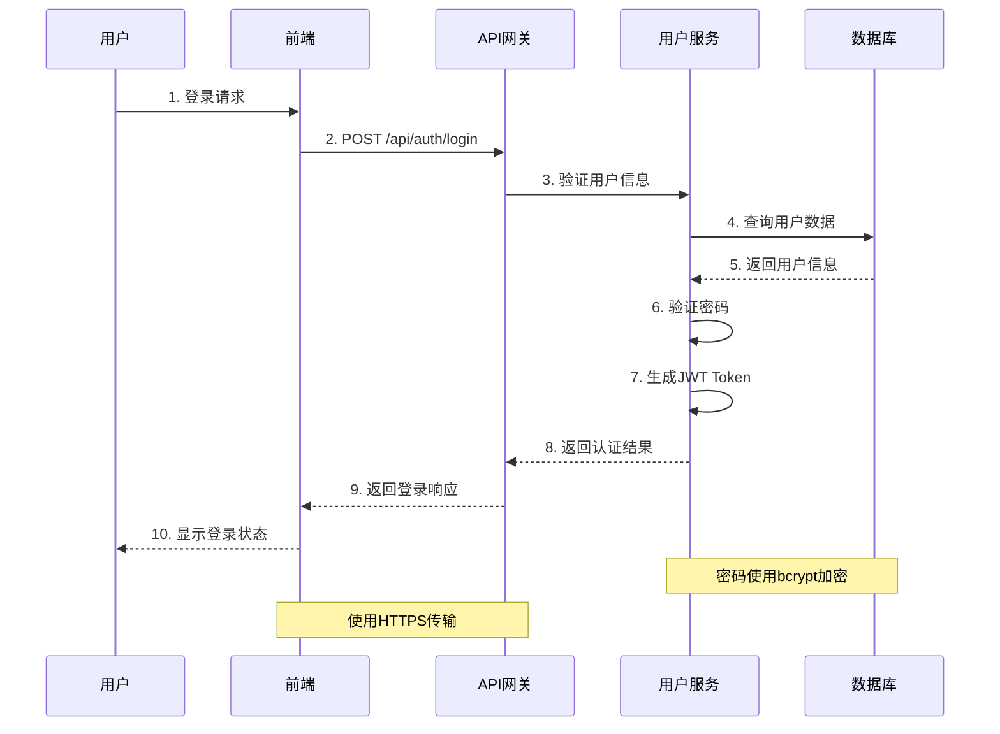

### 3. 甘特图 (Gantt Chart)

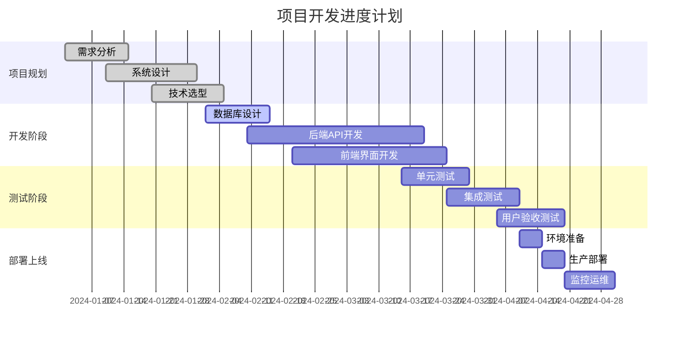

### 4. 类图 (Class Diagram)

```mermaid
classDiagram
    class User {
        -Long id
        -String username
        -String email
        -String password
        -UserStatus status
        -Date createdAt
        +login() boolean
        +logout() void
        +updateProfile() void
        +changePassword() boolean
    }
    
    class UserService {
        -UserRepository userRepository
        -PasswordEncoder passwordEncoder
        +createUser(User) User
        +findUserById(Long) User
        +findUserByUsername(String) User
        +updateUser(User) User
        +deleteUser(Long) void
        +validatePassword(String, String) boolean
    }
    
    class UserRepository {
        <<interface>>
        +save(User) User
        +findById(Long) Optional~User~
        +findByUsername(String) Optional~User~
        +findByEmail(String) Optional~User~
        +delete(Long) void
    }
    
    class UserController {
        -UserService userService
        +register(UserDto) ResponseEntity
        +login(LoginDto) ResponseEntity
        +getUserProfile(Long) ResponseEntity
        +updateProfile(Long, UserDto) ResponseEntity
    }
    
    class UserStatus {
        <<enumeration>>
        ACTIVE
        INACTIVE
        SUSPENDED
        PENDING
    }
    
    UserController --> UserService : uses
    UserService --> UserRepository : uses
    UserService --> User : manages
    User --> UserStatus : has
    User ||--o{ Order : "has many"
    
    class Order {
        -Long id
        -Long userId
        -BigDecimal amount
        -OrderStatus status
        -Date createdAt
    }
```

### 5. 状态图 (State Diagram)

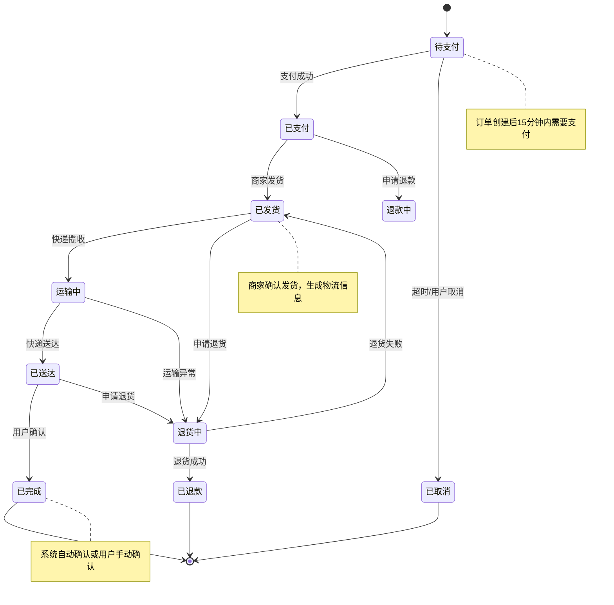

### 6. 实体关系图 (ER Diagram)

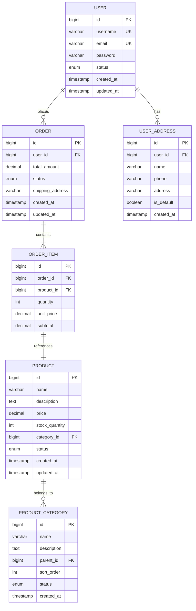

### 7. 用户旅程图 (User Journey)

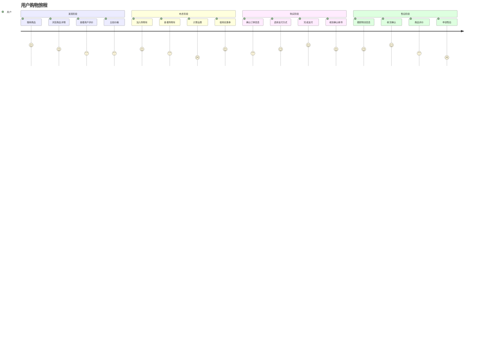

### 8. Git流程图 (Git Graph)

```mermaid
gitgraph
    commit id: "初始提交"
    branch develop
    checkout develop
    commit id: "基础框架"
    commit id: "用户模块"
    branch feature/order
    checkout feature/order
    commit id: "订单模型"
    commit id: "订单API"
    checkout develop
    merge feature/order
    commit id: "集成测试"
    checkout main
    merge develop
    commit id: "v1.0.0"
    branch hotfix/payment
    checkout hotfix/payment
    commit id: "修复支付bug"
    checkout main
    merge hotfix/payment
    commit id: "v1.0.1"
    checkout develop
    merge main
    branch feature/notification
    checkout feature/notification
    commit id: "通知服务"
    commit id: "邮件模板"
    checkout develop
    merge feature/notification
    commit id: "功能测试"
    checkout main
    merge develop
    commit id: "v1.1.0"
```

### 9. 饼图 (Pie Chart)

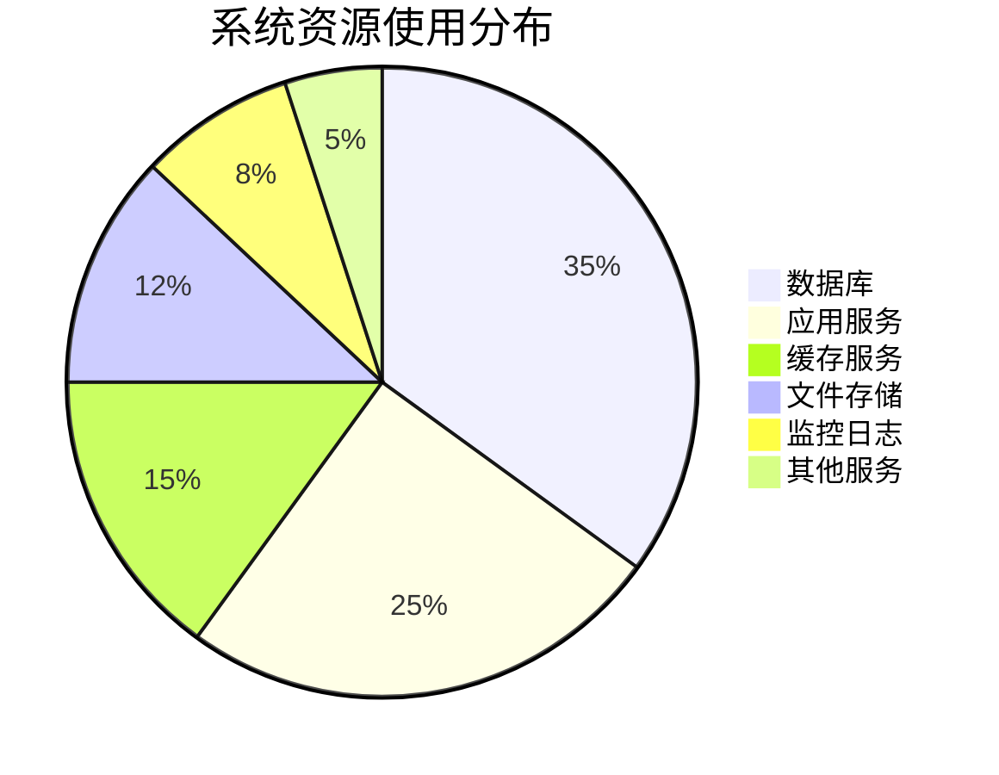

### 10. 象限图 (Quadrant Chart)

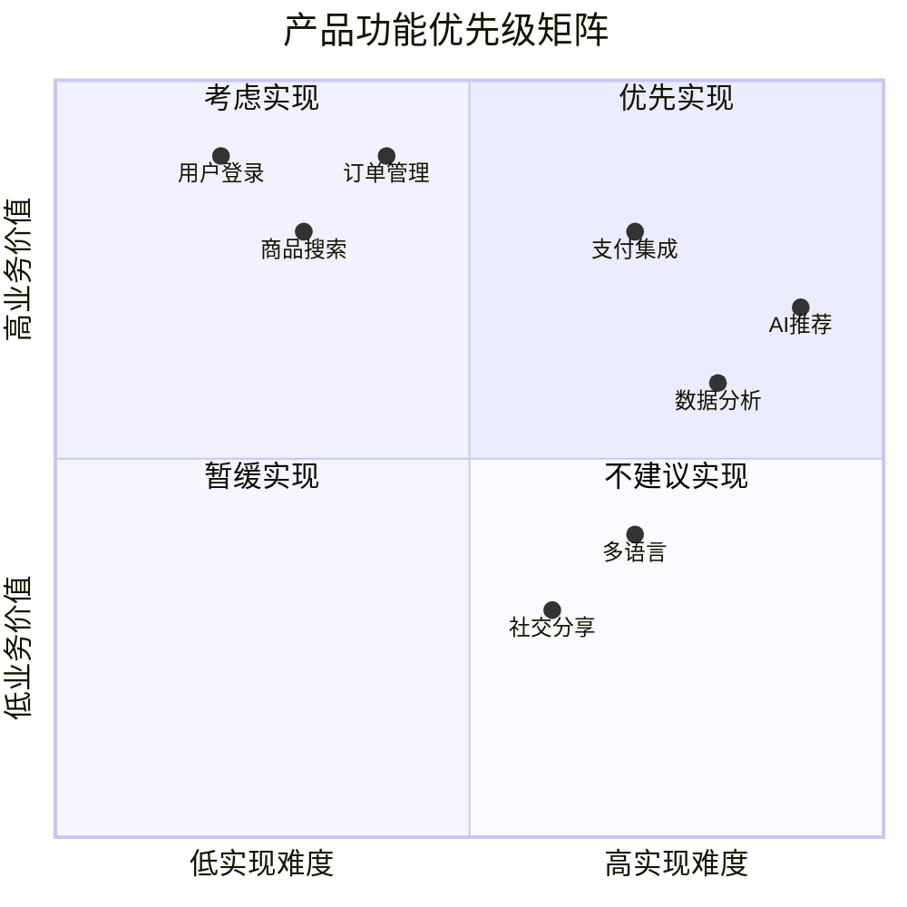

### 11. 时间线图 (Timeline)

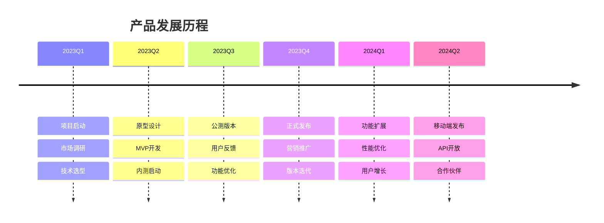

### 12. 架构图 (C4 Model)

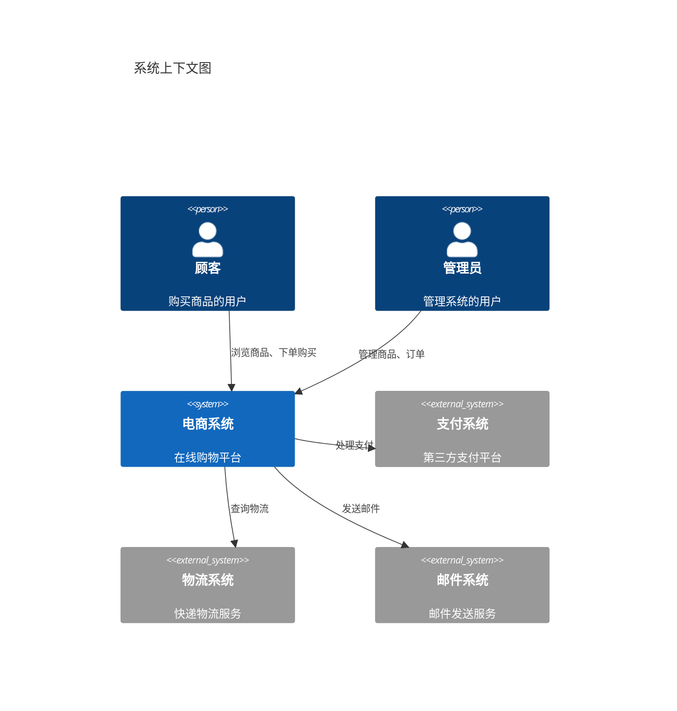

---

## 🎨 Mermaid图表样式定制

### 主题设置

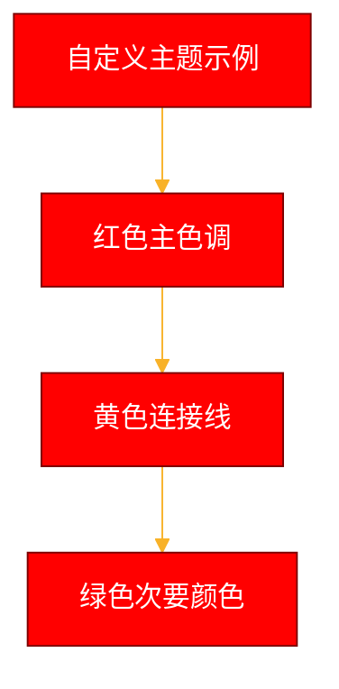

### 自定义样式

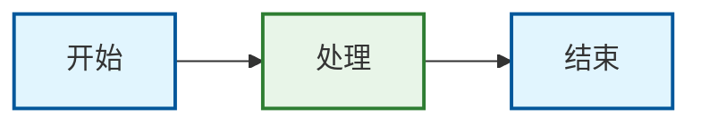

---

## 💡 Mermaid图表最佳实践

### ✅ 推荐做法

1. **简洁明了** - 避免过于复杂的图表
2. **一致性** - 保持命名和样式的一致
3. **合理布局** - 使用适当的方向和间距
4. **颜色搭配** - 使用专业的配色方案
5. **文档化** - 为图表添加说明和注释

### 📋 图表选择指南

| 使用场景 | 推荐图表类型 | 优势 |
|----------|--------------|------|
| **业务流程** | 流程图 | 清晰展示步骤和决策点 |
| **系统交互** | 时序图 | 显示时间顺序和消息传递 |
| **项目管理** | 甘特图 | 可视化项目进度和依赖 |
| **数据模型** | 类图/ER图 | 展示实体关系和结构 |
| **状态变化** | 状态图 | 清晰显示状态转换 |
| **数据分布** | 饼图 | 直观显示比例关系 |
| **系统架构** | C4图 | 分层展示系统结构 |

### 🔧 工具支持

Mermaid图表支持多种平台：

- ✅ **GitHub/GitLab** - 原生支持
- ✅ **VS Code** - 扩展插件
- ✅ **Notion** - 代码块支持
- ✅ **Markdown编辑器** - 大部分支持
- ✅ **在线编辑器** - mermaid.live

---

## 🚀 使用示例

### 在Markdown中使用

````markdown
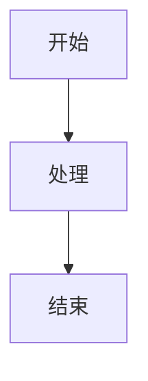
````

### 在HTML中使用

```html
<div class="mermaid">
flowchart TD
    A[开始] --> B[处理]
    B --> C[结束]
</div>

<script src="https://cdn.jsdelivr.net/npm/mermaid/dist/mermaid.min.js"></script>
<script>mermaid.initialize({startOnLoad:true});</script>
```

---

## 📚 相关文档

- [PlantUML图表对比](图表类型展示.md#plantuml图表类型)
- [SVG图表支持](SVG图表支持说明.md)
- [系统架构图模板](系统架构图模板.md)

---

**创建时间**：2025年7月15日  
**更新时间**：2025年7月15日  
**版本号**：v1.0
