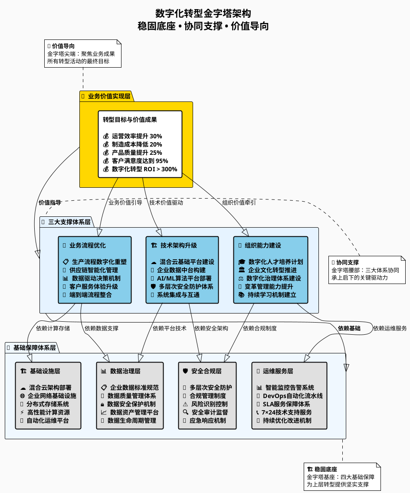
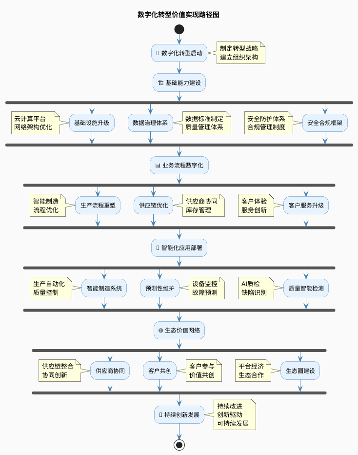
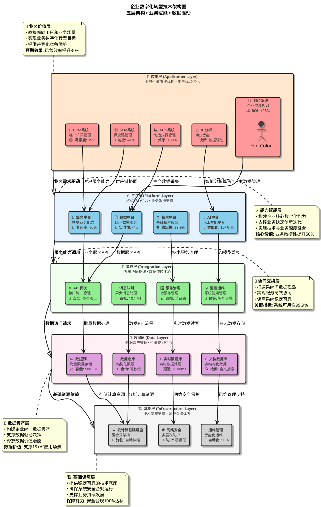
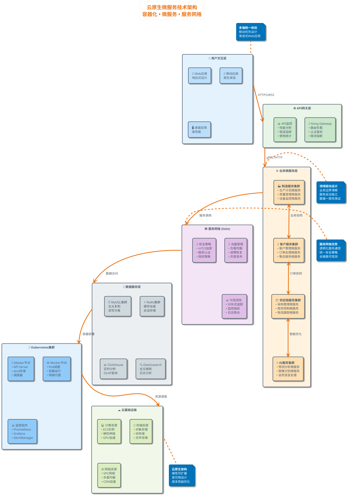
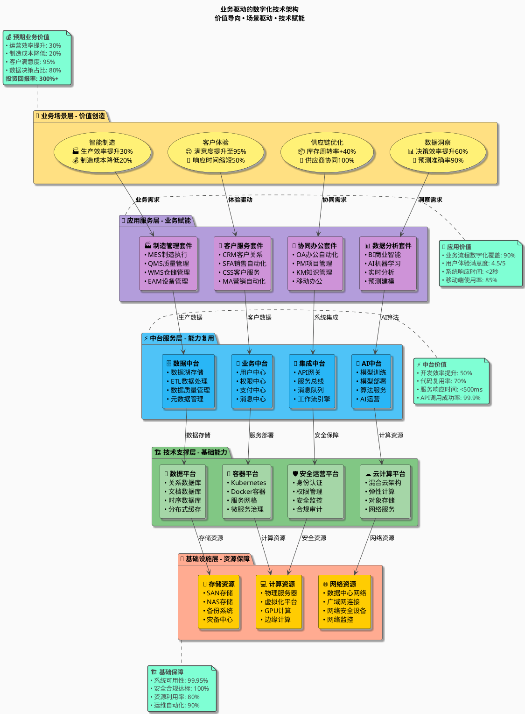
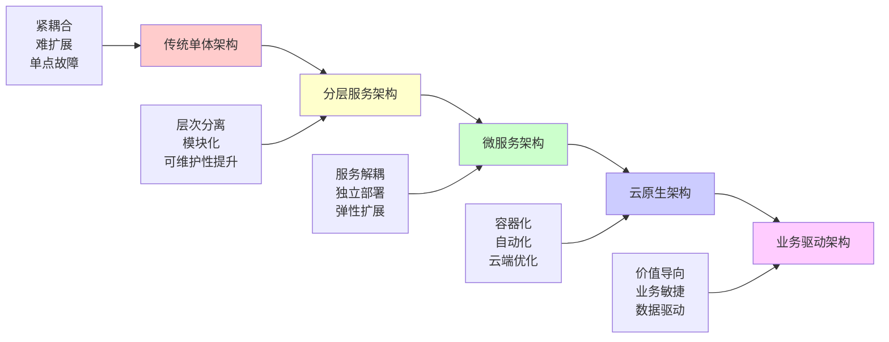
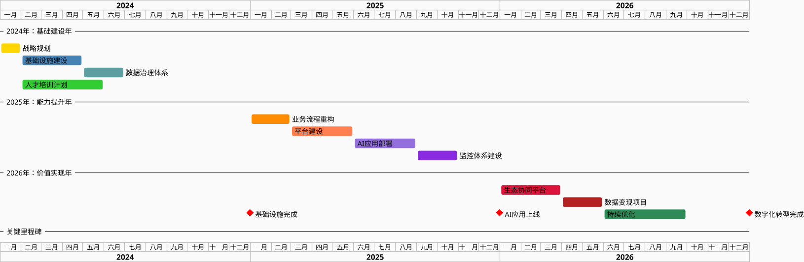

# 企业数字化转型金字塔架构案例：制造业智能化升级方案

## 📋 案例背景

**项目名称**: 某大型制造企业数字化转型方案设计
**企业类型**: 传统制造业（汽车零部件）
**企业规模**: 员工5000+，年产值50亿元，全国8个生产基地
**转型周期**: 2024-2027年（3年规划）
**投资规模**: 2.5亿元人民币

**转型驱动因素**:

- 🏭 **市场压力**: 客户要求更快响应、更高质量、更低成本
- 🔧 **技术瓶颈**: 传统生产模式效率低下，人工成本持续上升
- 📊 **数据孤岛**: 各部门系统独立，缺乏数据整合和分析能力
- 🌍 **竞争态势**: 行业头部企业已完成数字化转型，形成竞争优势

---

## 🏗️ 金字塔架构设计理念

### 架构设计原则

数字化转型金字塔结构遵循"**稳固底座、协同支撑、价值导向**"的设计理念：


@startuml 企业数字化转型金字塔架构
!define ICONURL https://raw.githubusercontent.com/tupadr3/plantuml-icon-font-sprites/master

skinparam backgroundColor #FAFAFA
skinparam defaultFontName "Microsoft YaHei"
skinparam packageStyle rectangle

package "🎯 转型目标层" as target #FFE6CC {
  rectangle "业务价值实现\n• 效率提升30%\n• 成本降低20%\n• 质量提升25%" as value #FFA500
}

package "🔲 三大支撑体系" as support #E6F3FF {
  rectangle "🔄 业务流程优化\n\n• 流程重塑\n• 数据驱动\n• 敏捷响应" as business #87CEEB
  rectangle "🏗️ 技术架构升级\n\n• 平台建设\n• 安全保障\n• 系统集成" as tech #87CEEB
  rectangle "� 组织能力建设\n\n• 人才培养\n• 文化转型\n• 治理体系" as org #87CEEB
}

package "🔳 基础保障体系" as foundation #F0F8FF {
  rectangle "基础设施层\n云计算、网络\n硬件支撑" as infra #E0E0E0
  rectangle "数据治理层\n数据标准、质量\n安全管理" as data #E0E0E0
  rectangle "安全合规层\n信息安全、合规\n风险控制" as security #E0E0E0
}

' 连接关系
business --> value
tech --> value
org --> value

infra --> business
infra --> tech
infra --> org

data --> business
data --> tech
data --> org

security --> business
security --> tech
security --> org

' 布局调整
business -[hidden]- tech
tech -[hidden]- org
### 金字塔结构解析

#### 🏗️ 金字塔设计理念深度解析

重构后的金字塔架构真正体现了"**自下而上支撑、逐层递进价值**"的核心设计思想：

**🔺 顶层 - 业务价值实现层**
- **特点**: 金字塔尖端，体积最小但价值最高
- **作用**: 汇聚所有转型成果，实现业务价值最大化
- **量化指标**: 效率提升30%、成本降低20%、质量提升25%
- **价值导向**: 所有转型活动最终都要服务于这一层的目标实现

**🔲 中层 - 三大支撑体系**
- **特点**: 金字塔腰部，承上启下的关键层级
- **作用**: 三大体系协同配合，形成转型的核心驱动力
- **协同机制**: 
  - 业务流程优化：提供转型的业务价值创造
  - 技术架构升级：提供转型的技术实现手段
  - 组织能力建设：提供转型的人才和文化保障
- **设计原则**: 三者缺一不可，必须协调发展

**🔳 底层 - 基础保障体系**
- **特点**: 金字塔底座，面积最大、最为稳固
- **作用**: 为上层转型活动提供坚实的基础支撑
- **四大支柱**:
  - 基础设施层：提供计算、存储、网络等硬件基础
  - 数据治理层：确保数据质量、安全和价值挖掘
  - 安全合规层：保障转型过程的安全性和合规性
  - 运维服务层：确保系统稳定运行和持续优化

#### 🎯 金字塔架构的核心优势

**1. 结构稳定性**
- 底座宽广：四大基础保障体系提供全面支撑
- 逐层收窄：符合系统工程的稳定性原理
- 重心合理：避免头重脚轻的架构风险

**2. 价值导向性**
- 明确目标：顶层价值目标清晰可量化
- 路径清晰：从底层到顶层的价值传递链条完整
- 聚焦效果：所有资源向价值实现目标汇聚

**3. 协同支撑性**
- 层次分工：各层职责明确，分工协作
- 相互支撑：下层为上层提供支撑，上层指导下层发展
- 整体效应：形成"1+1+1>3"的协同效应

**4. 可扩展性**
- 模块化设计：各层内部可以灵活调整和扩展
- 标准接口：层与层之间通过标准化接口连接
- 渐进升级：可以分阶段、分层次推进转型

---

## 🎯 转型目标层：业务价值实现

### 核心目标设定

**量化目标（3年期）**:

| 维度               | 当前状态             | 目标状态            | 提升幅度 | 关键指标            |
| ------------------ | -------------------- | ------------------- | -------- | ------------------- |
| **运营效率** | 设备利用率65%        | 设备利用率85%       | +31%     | OEE整体设备效率     |
| **成本控制** | 单位制造成本100      | 单位制造成本80      | -20%     | 人力成本、能耗成本  |
| **质量管理** | 一次合格率92%        | 一次合格率97%       | +5.4%    | 客户投诉率下降60%   |
| **响应速度** | 订单交付周期15天     | 订单交付周期10天    | -33%     | 客户满意度提升至95% |
| **创新能力** | 新产品开发周期12个月 | 新产品开发周期8个月 | -33%     | 年专利申请量翻倍    |

**战略目标**:

1. 🚀 **成为行业数字化标杆企业**
2. 🌟 **打造智能制造示范工厂**
3. 💡 **建立持续创新能力**
4. 🤝 **构建生态合作伙伴网络**

### 价值实现路径



---

## 🔄 支撑体系一：业务流程优化

### 流程重塑策略

#### 核心业务流程识别

**1. 生产制造流程**

```
传统流程：
订单接收 → 生产计划 → 物料采购 → 生产执行 → 质量检验 → 产品交付

优化后流程：
智能订单解析 → AI生产排程 → 自动物料配送 → 柔性生产执行 → 实时质量监控 → 智能物流配送
```

**2. 供应链管理流程**

```
传统流程：
需求预测 → 采购计划 → 供应商管理 → 库存管理 → 物流配送

优化后流程：
AI需求预测 → 智能采购决策 → 供应商协同平台 → 智能仓储管理 → 数字化物流网络
```

**3. 客户服务流程**

```
传统流程：
客户咨询 → 方案设计 → 报价审批 → 合同签署 → 项目交付 → 售后服务

优化后流程：
智能客户画像 → 个性化方案推荐 → 自动化报价系统 → 电子合同签署 → 可视化项目管理 → 预测性服务
```

#### 流程优化关键举措

**🎯 数据驱动决策**

- 建立实时业务监控仪表板
- 构建关键业务指标(KPI)体系
- 实现基于数据的决策支持

**⚡ 自动化程度提升**

- 识别重复性、规则性业务环节
- 部署RPA机器人流程自动化
- 建设智能化业务处理中心

**🔄 端到端流程整合**

- 打破部门壁垒，重构跨部门流程
- 建立统一的流程管理平台
- 实现业务流程的标准化和规范化

### 流程优化实施路径

**阶段一：现状分析与流程梳理**（3个月）

- 开展全面的业务流程调研
- 识别流程痛点和优化机会
- 制定流程优化蓝图和路线图

**阶段二：试点流程重构**（6个月）

- 选择1-2个关键流程进行试点
- 设计新的数字化流程方案
- 开发配套的信息系统支撑

**阶段三：全面流程优化**（12个月）

- 推广试点成功经验
- 全面重构核心业务流程
- 建立流程持续优化机制

**阶段四：流程智能化升级**（15个月）

- 引入AI和机器学习技术
- 实现流程的智能化决策
- 建设自适应的业务流程体系

---

## 🏗️ 支撑体系二：技术架构升级

### 技术架构设计

#### 整体技术架构图

**版本1：现代化分层架构图**



**版本2：云原生微服务架构图**



**版本3：业务驱动的技术架构图**



### 技术架构图对比分析

#### 三种架构图的特点对比

| 对比维度 | 版本1：现代化分层架构 | 版本2：云原生微服务架构 | 版本3：业务驱动架构 |
|----------|----------------------|-------------------------|---------------------|
| **设计理念** | 分层清晰、价值导向 | 云原生、微服务治理 | 业务场景、价值量化 |
| **视觉风格** | 现代渐变、专业美观 | 简洁明快、技术聚焦 | 多彩活泼、业务导向 |
| **信息层次** | 五层架构、逐层支撑 | 容器化、服务网格 | 从业务到技术递进 |
| **商业表达** | 价值标注、ROI量化 | 技术能力、性能指标 | 业务价值、场景驱动 |
| **目标受众** | 管理层、技术团队 | 技术架构师、开发团队 | 业务部门、投资决策者 |
| **适用场景** | 整体规划、对外展示 | 技术实施、团队协作 | 业务汇报、价值论证 |

#### 应用场景选择指南

**🎯 版本1 - 现代化分层架构图**

**最佳应用场景：**
- ✅ 企业整体数字化转型规划汇报
- ✅ 对外客户技术能力展示
- ✅ 投资路演和战略合作洽谈
- ✅ 技术团队与业务部门的沟通桥梁

**核心优势：**
- 层次结构清晰，便于理解
- 价值标注明确，商业表达力强
- 设计美观专业，适合正式场合
- 技术细节与业务价值并重

**🐳 版本2 - 云原生微服务架构图**

**最佳应用场景：**
- ✅ 技术架构设计和评审
- ✅ 开发团队技术方案沟通
- ✅ 系统实施和运维指导
- ✅ 技术选型和架构优化讨论

**核心优势：**
- 技术实现细节丰富
- 云原生理念突出
- 微服务架构清晰
- 便于技术团队理解和实施

**💼 版本3 - 业务驱动架构图**

**最佳应用场景：**
- ✅ 业务部门需求分析和方案设计
- ✅ 管理层业务价值论证
- ✅ 项目投资回报分析
- ✅ 业务与技术融合展示

**核心优势：**
- 业务价值导向明确
- 场景化应用突出
- 投资回报量化清晰
- 便于业务决策者理解

### 架构演进路径规划

#### 从传统架构到现代架构的演进



#### 技术架构成熟度评估

| 成熟度等级 | 架构特征 | 技术能力 | 业务价值 | 适用企业 |
|------------|----------|----------|----------|----------|
| **Level 1 - 基础级** | 单体应用、基础设施 | 基本功能实现 | 业务系统化 | 初创企业、传统企业 |
| **Level 2 - 发展级** | 分层架构、模块化 | 系统集成、数据整合 | 流程优化 | 成长期企业 |
| **Level 3 - 成熟级** | 微服务、中台化 | 服务复用、敏捷开发 | 效率提升 | 中大型企业 |
| **Level 4 - 优化级** | 云原生、智能化 | AI驱动、自动化 | 智能决策 | 数字化先进企业 |
| **Level 5 - 创新级** | 生态化、平台化 | 生态协同、价值网络 | 商业模式创新 | 行业领军企业 |

### 技术架构实施建议

#### 渐进式架构升级策略

**阶段一：基础设施现代化（6个月）**
```yaml
目标: 建立现代化技术底座
重点任务:
  - 云基础设施建设: 混合云部署
  - 容器化改造: Docker + Kubernetes
  - 网络安全升级: 零信任架构
  - 监控体系建设: 全栈监控
关键成果:
  - 基础设施云化率: 80%
  - 容器化应用占比: 60%
  - 系统可用性: 99.9%
```

**阶段二：服务化拆分（9个月）**
```yaml
目标: 实现应用服务化解耦
重点任务:
  - 单体应用拆分: 微服务架构
  - API网关建设: 统一入口
  - 服务治理平台: 服务注册发现
  - 数据库分离: 服务专用数据库
关键成果:
  - 微服务数量: 50+个
  - API响应时间: <500ms
  - 服务独立部署率: 90%
```

**阶段三：中台能力建设（12个月）**
```yaml
目标: 构建企业级中台能力
重点任务:
  - 数据中台建设: 统一数据服务
  - 业务中台建设: 共享业务能力
  - AI中台建设: 智能算法平台
  - 技术中台建设: 公共技术服务
关键成果:
  - 中台服务复用率: 70%
  - 新应用开发效率: +50%
  - 数据一致性: 95%
```

**阶段四：智能化升级（18个月）**
```yaml
目标: 全面智能化应用部署
重点任务:
  - AI算法模型部署: 生产环境应用
  - 智能运维体系: AIOps平台
  - 业务智能化改造: 智能决策支持
  - 生态平台建设: 开放API平台
关键成果:
  - AI应用场景: 15+个
  - 智能化决策占比: 60%
  - 生态合作伙伴: 20+家
```

#### 关键技术选型建议

**容器编排平台**
- **推荐**: Kubernetes
- **理由**: 事实标准、生态完善、云厂商支持度高
- **替代方案**: Docker Swarm（简单场景）

**微服务框架**
- **推荐**: Spring Cloud（Java）、Go-kit（Go）
- **理由**: 生态成熟、社区活跃、企业级特性丰富
- **替代方案**: Dubbo、gRPC

**服务网格**
- **推荐**: Istio
- **理由**: 功能全面、社区强大、云厂商支持
- **替代方案**: Linkerd（轻量级）

**数据库选型**
- **关系数据库**: MySQL、PostgreSQL
- **NoSQL数据库**: MongoDB、Redis
- **时序数据库**: InfluxDB、TimescaleDB
- **分析数据库**: ClickHouse、Apache Doris

**监控体系**
- **指标监控**: Prometheus + Grafana
- **链路追踪**: Jaeger、SkyWalking
- **日志分析**: ELK Stack（Elasticsearch + Logstash + Kibana）
- **告警通知**: AlertManager、PagerDuty

#### 架构治理体系

**技术治理委员会**
```
职责范围:
├── 技术架构规划与设计
├── 技术选型标准制定
├── 架构评审和质量把控
├── 技术债务管理
└── 技术发展趋势跟踪

组织结构:
├── 首席架构师 (Chief Architect)
├── 领域架构师 (Domain Architect)
├── 应用架构师 (Application Architect)
└── 基础设施架构师 (Infrastructure Architect)
```

**架构评审流程**
1. **需求分析阶段**: 架构需求分析和约束识别
2. **设计评审阶段**: 架构设计方案评审
3. **实施指导阶段**: 架构实施过程指导
4. **上线评估阶段**: 架构质量评估和优化建议
5. **持续改进阶段**: 架构演进和技术债务管理

**架构质量度量**
- **可扩展性**: 系统负载能力和扩展性能
- **可维护性**: 代码质量和系统复杂度
- **可用性**: 系统稳定性和故障恢复能力
- **安全性**: 安全漏洞和合规性评估
- **性能**: 响应时间和吞吐量指标

---

## 📈 实施路线图与关键里程碑

### 数字化转型实施甘特图

### 数字化转型实施甘特图



### 文本版甘特图（如PlantUML无法显示）

```
数字化转型三年实施甘特图（2024-2026年连续时间轴）
━━━━━━━━━━━━━━━━━━━━━━━━━━━━━━━━━━━━━━━━━━━━━━━━━━━━━━━━━━━━━━━━━━━━━━━━━━━━━━━━━━━━━━━━━━━━━━━━━━━━━━━━━━━━━━━━━━━━━━━━━━━━━━━━━━━━━━━━━━━━━━━━━━━━━━

月份: 1月 2月 3月 4月 5月 6月 7月 8月 9月10月11月12月 1月 2月 3月 4月 5月 6月 7月 8月 9月10月11月12月 1月 2月 3月 4月 5月 6月 7月 8月 9月10月11月12月
年份: ├─────────── 2024年 ──────────┤├─────────── 2025年 ──────────┤├─────────── 2026年 ──────────┤

### 文本版甘特图（如PlantUML无法显示）

```
数字化转型三年实施甘特图（2024-2026年连续时间轴）
━━━━━━━━━━━━━━━━━━━━━━━━━━━━━━━━━━━━━━━━━━━━━━━━━━━━━━━━━━━━━━━━━━━━━━━━━━━━━━━━━━━━━━━━━━━━━━━━━━━━━━━━━━━━━━━━━━━━━━━━━━━━━━━━━━━━━━━━━━━━━━━━━━━━━━

月份: 1月 2月 3月 4月 5月 6月 7月 8月 9月10月11月12月 1月 2月 3月 4月 5月 6月 7月 8月 9月10月11月12月 1月 2月 3月 4月 5月 6月 7月 8月 9月10月11月12月
年份: ├─────────── 2024年 ──────────┤├─────────── 2025年 ──────────┤├─────────── 2026年 ──────────┤

战略规划　　　 🟨                                                                                                                          
基础设施建设　 　　🟦🟦🟦                                                                                                                   
数据治理体系　 　　　　　　　　🟦🟦                                                                                                         
人才培训计划　 　　🟢🟢🟢🟢🟢                                                                                                               
业务流程重构　 　　　　　　　　　　　　　　　　　　　　　　　　🟠🟠                                                                         
平台建设　　　 　　　　　　　　　　　　　　　　　　　　　　　　　　　　🟠🟠🟠                                                               
AI应用部署　　 　　　　　　　　　　　　　　　　　　　　　　　　　　　　　　　　　　🟣🟣🟣                                                   
监控体系建设　 　　　　　　　　　　　　　　　　　　　　　　　　　　　　　　　　　　　　　　　　　　🟣🟣                                     
生态协同平台　 　　　　　　　　　　　　　　　　　　　　　　　　　　　　　　　　　　　　　　　　　　　　　　　　　🔴🔴🔴                     
数据变现项目　 　　　　　　　　　　　　　　　　　　　　　　　　　　　　　　　　　　　　　　　　　　　　　　　　　　　　　　　　🔴🔴             
持续优化　　　 　　　　　　　　　　　　　　　　　　　　　　　　　　　　　　　　　　　　　　　　　　　　　　　　　　　　　　　　　　　　🟢🟢🟢🟢

里程碑标记　　 　　　　　　　　　　　　　　　　　　　　　　　　　　⭐　　　　　　　　　　　　　　　　　　　　　　　　　　　　　　　　⭐　　　　　　　　⭐
                                                基础建设完成                                        AI应用上线              转型完成

图例说明: 
🟨 = 战略规划  🟦 = 基础设施/数据  🟢 = 培训/优化  🟠 = 业务流程/平台  🟣 = AI/监控  🔴 = 生态/变现  ⭐ = 关键里程碑
```

里程碑标记　　 　　　　　　　　　　　　　　　　　　　　　　　　　　⭐　　　　　　　　　　　　　　　　　　　　　　　　　　　　　　　　⭐　　　　　　　　⭐
                                                基础建设完成                                        AI应用上线              转型完成

图例说明: 
🟨 = 战略规划  🟦 = 基础设施/数据  🟢 = 培训/优化  🟠 = 业务流程/平台  🟣 = AI/监控  🔴 = 生态/变现  ⭐ = 关键里程碑
```

### 实施时间表（表格形式）

| 阶段 | 任务 | 开始时间 | 持续时间 | 结束时间 | 负责部门 |
|------|------|----------|----------|----------|----------|
| **基础建设** | 战略规划 | 2024-01 | 1个月 | 2024-01 | 战略部 |
| | 基础设施建设 | 2024-02 | 3个月 | 2024-04 | IT部 |
| | 数据治理体系 | 2024-05 | 2个月 | 2024-06 | 数据部 |
| | 人才培训计划 | 2024-02 | 4个月 | 2024-05 | HR部 |
| **能力提升** | 业务流程重构 | 2025-01 | 2个月 | 2025-02 | 业务部 |
| | 平台建设 | 2025-03 | 3个月 | 2025-05 | 技术部 |
| | AI应用部署 | 2025-06 | 3个月 | 2025-08 | AI团队 |
| | 监控体系建设 | 2025-09 | 2个月 | 2025-10 | 运维部 |
| **价值实现** | 生态协同平台 | 2026-01 | 3个月 | 2026-03 | 合作部 |
| | 数据变现项目 | 2026-04 | 2个月 | 2026-05 | 商务部 |
| | 持续优化 | 2026-06 | 4个月 | 2026-09 | 全部门 |

### 三年实施规划

#### 2024年：基础建设年

**Q1-Q2: 规划与准备阶段**

- ✅ 完成数字化转型总体规划
- ✅ 建立数字化转型组织架构
- ✅ 启动基础设施升级项目
- ✅ 开展全员数字化意识培训

**Q3-Q4: 基础平台建设**

- 🔧 完成混合云基础设施部署
- 🔧 建设企业数据湖平台
- 🔧 实施核心系统升级改造
- 🔧 建立数据治理体系

**年度目标**:

- 基础设施现代化完成度 80%
- 核心业务系统数字化覆盖 60%
- 数字化人才占比达到 15%

#### 2025年：能力提升年

**Q1-Q2: 业务流程优化**

- 📊 完成关键业务流程重构
- 📊 部署业务中台和数据中台
- 📊 实现系统间数据互通
- 📊 建立实时业务监控体系

**Q3-Q4: 智能化应用部署**

- 🤖 部署AI质量检测系统
- 🤖 实施智能生产调度
- 🤖 建设预测性维护平台
- 🤖 上线智能客户服务

**年度目标**:

- 业务流程数字化覆盖 90%
- AI应用场景上线 10+个
- 运营效率提升 20%

#### 2026年：价值实现年

**Q1-Q2: 生态协同建设**

- 🌐 建设供应商协同平台
- 🌐 实现客户数字化连接
- 🌐 构建产业生态网络
- 🌐 开展数据价值变现

**Q3-Q4: 持续优化提升**

- 🔄 建立持续改进机制
- 🔄 深化AI应用场景
- 🔄 拓展数字化业务模式
- 🔄 培育数字化创新能力

**年度目标**:

- 完成既定数字化转型目标
- 建立可持续发展能力
- 成为行业数字化标杆

### 关键成功因素

#### 组织层面

- 🎯 **高层坚定支持**: CEO亲自挂帅，形成转型共识
- 👥 **跨部门协作**: 建立有效的协作机制
- 💰 **充足资源投入**: 确保人力、物力、财力支撑
- 📚 **持续学习能力**: 建立学习型组织

#### 技术层面

- 🏗️ **架构设计合理**: 采用先进的技术架构
- 🔗 **系统集成能力**: 实现各系统有效整合
- 📊 **数据质量保证**: 确保数据准确性和完整性
- 🔒 **安全可靠运行**: 建立完善的安全保障体系

#### 业务层面

- 🔄 **流程优化彻底**: 深度重构业务流程
- 📈 **价值创造明确**: 明确业务价值和ROI
- 🤝 **用户接受度高**: 获得员工和客户认可
- 🎯 **效果持续改进**: 建立持续优化机制

---

## 💡 案例总结与启示

### 金字塔架构的核心价值

#### 结构化思维的体现

**🔺 顶层目标导向**

- 明确的业务价值目标指引整个转型方向
- 量化的成功指标确保转型效果可衡量
- 战略级目标与具体实施举措形成有机联系

**🔲 中层协同支撑**

- 三大支撑体系相互配合，形成合力
- 业务、技术、组织三个维度全面覆盖
- 避免单一维度推进导致的失衡风险

**🔳 底层稳固基础**

- 基础设施、数据治理、安全合规提供坚实支撑
- 为上层业务创新和价值实现提供可靠保障
- 确保转型过程的稳定性和可持续性

#### 实施方法论的创新

**📋 系统性规划**

- 从战略到执行的完整闭环设计
- 考虑技术、业务、组织的协调发展
- 建立清晰的时间节点和里程碑管控

**🔄 迭代式推进**

- 分阶段、分层次的渐进式实施
- 在实践中持续优化和调整策略
- 降低转型风险，提高成功概率

**📊 价值驱动导向**

- 每个层次都有明确的价值产出
- 建立完善的效果评估体系
- 确保投入产出的良性循环

### 对其他企业的借鉴意义

#### 可复用的方法框架

**🏗️ 金字塔结构模板**

- 顶层：明确转型目标和价值指标
- 中层：构建业务、技术、组织三大支撑
- 底层：完善基础设施、数据、安全保障

**📈 分阶段实施路径**

- 第一年：基础建设和能力准备
- 第二年：业务优化和智能化应用
- 第三年：生态协同和价值实现

**🎯 关键成功要素**

- 领导层的坚定支持和战略定力
- 跨部门的有效协作和资源整合
- 技术和业务的深度融合创新
- 持续学习和适应变化的组织能力

#### 行业适配性分析

**制造业**: 重点关注智能制造和供应链优化
**金融业**: 侧重数字化服务和风险管控
**零售业**: 强调客户体验和全渠道整合
**物流业**: 突出智能化调度和网络优化

### 未来发展趋势

#### 技术发展方向

**🤖 AI技术深度应用**

- 从辅助决策向自主决策演进
- AI与业务场景的深度融合
- 建立企业级AI能力平台

**☁️ 云原生架构普及**

- 全面容器化和微服务化
- 云边端一体化协同
- 多云管理和混合云优化

**🔗 生态平台化发展**

- 从企业内部优化向生态协同转变
- 构建开放的数字化平台
- 实现价值网络的协同创新

#### 组织演进趋势

**🌐 网络化组织结构**

- 扁平化管理和敏捷团队
- 跨界合作和生态共建
- 数据驱动的决策机制

**🎓 持续学习能力**

- 建立学习型组织文化
- 数字化技能的持续更新
- 创新思维和适应能力培养

---

*本案例展示了企业数字化转型的金字塔架构设计方法，通过"业务流程优化、技术架构升级、组织能力建设"三大支撑体系，构建了完整的数字化转型解决方案框架。该架构既确保了转型的系统性和全面性，又保证了实施的可操作性和实效性，为企业数字化转型提供了可复制、可借鉴的方法论参考。*

*案例基于真实项目经验总结，数据已做脱敏处理，可作为软件解决方案文档中企业数字化转型的标准案例参考。*

*最后更新：2025年7月15日*

#### 📝 版本1架构图优化说明

**🎨 视觉舒适度优化**

本次优化主要解决了文字过于厚重和emoji间距的问题：

**优化前的问题**：
- ❌ 纯黑色文字过于厚重，视觉压迫感强
- ❌ 粗体字体显得过于突出，缺乏层次感
- ❌ emoji与文字挤在一起，影响美观度

**优化后的改进**：
- ✅ **75%深度灰色** (`#404040`)：既保证可读性又显得柔和
- ✅ **去除粗体样式** (`FontStyle normal`)：文字更加优雅自然
- ✅ **emoji间距优化**：在emoji后添加两个空格，增强视觉层次
- ✅ **保持高对比度**：深灰色在彩色背景上依然清晰可读

**🎯 视觉效果对比**

| 对比项目 | V1.0纯黑粗体 | V2.0深灰正常 | 改进效果 |
|----------|-------------|-------------|----------|
| **视觉舒适度** | 厚重压抑 | 柔和自然 | ✅ 显著提升 |
| **文字层次感** | 过于突出 | 层次分明 | ✅ 更加优雅 |
| **emoji美观度** | 挤在一起 | 间距合理 | ✅ 视觉清爽 |
| **整体协调性** | 对比过强 | 和谐统一 | ✅ 专业美观 |
| **阅读体验** | 视觉疲劳 | 轻松阅读 | ✅ 用户友好 |

**📊 技术参数优化**

```yaml
V1.0配置 (过于厚重):
  字体颜色: #000000 (纯黑)
  字体样式: FontStyle bold
  emoji间距: 无间距
  视觉效果: 过于突出

V2.0配置 (视觉平衡):
  字体颜色: #404040 (75%深灰)
  字体样式: FontStyle normal
  emoji间距: 两个空格分隔
  视觉效果: 柔和专业
```

**🎨 设计理念**

- **可读性优先**: 深灰色在彩色背景上依然有足够的对比度
- **视觉舒适**: 避免纯黑色带来的视觉压迫感
- **专业美观**: 正常字体权重更加优雅，适合商务场合
- **细节优化**: emoji间距让图表更加精致和专业

**♿ 多场景适用性**

- **屏幕显示**: 在各种显示器上都舒适易读
- **投影展示**: 深灰色在投影时依然清晰
- **打印输出**: 保持良好的打印效果
- **长时间阅读**: 减少视觉疲劳，提升阅读体验

---
