# Microsoft制造业智能化转型解决方案

## 📋 文档信息

| 属性 | 值 |
|------|-----|
| **文档标题** | 智能制造数字化转型解决方案 |
| **文档版本** | v1.0 |
| **创建日期** | 2025年7月9日 |
| **文档状态** | 正式版 |
| **保密级别** | 商业机密 |
| **适用范围** | 制造业数字化转型 |

## 🎯 目标受众

| 受众类型 | 关注重点 | 阅读建议 |
|---------|----------|----------|
| **决策层** | ROI、战略价值、风险控制 | 重点阅读第1、2、6章 |
| **技术层** | 架构设计、技术选型、实现方案 | 重点阅读第3、4、5章 |
| **实施层** | 项目计划、操作流程、质量管理 | 重点阅读第5、7、8章 |

---

## 📖 第一章：执行摘要

### 1.1 项目概述

**业务挑战**
- 传统制造模式效率低下，人工成本持续上升
- 缺乏实时数据洞察，决策响应滞后
- 质量管控依赖人工，一致性难以保证
- 供应链可视化程度低，库存优化困难

**解决方案价值主张**
- 🚀 **智能化生产**：基于AI和IoT的智能制造体系
- 📊 **数据驱动**：实时数据分析和预测性维护
- 🔄 **端到端可视化**：全价值链数字化管理
- 🌐 **云原生架构**：弹性可扩展的现代化平台

### 1.2 关键成功要素

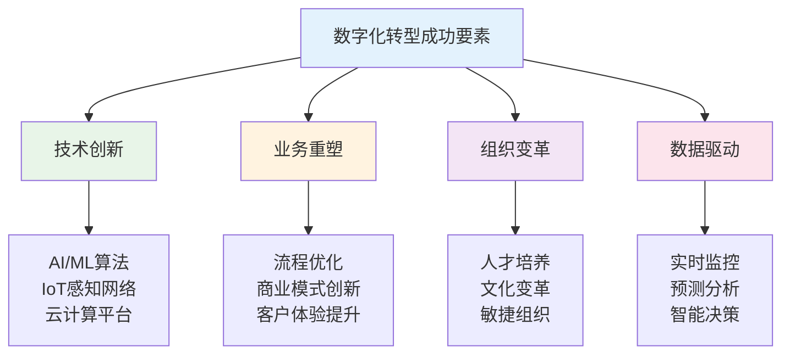
```mermaid
graph TD
    A[数字化转型成功要素] --> B[技术创新]
    A --> C[业务重塑]
    A --> D[组织变革]
    A --> E[数据驱动]
    
    B --> F[AI/ML算法<br/>IoT感知网络<br/>云计算平台]
    C --> G[流程优化<br/>商业模式创新<br/>客户体验提升]
    D --> H[人才培养<br/>文化变革<br/>敏捷组织]
    E --> I[实时监控<br/>预测分析<br/>智能决策]
    
    style A fill:#e3f2fd
    style B fill:#e8f5e8
    style C fill:#fff3e0
    style D fill:#f3e5f5
    style E fill:#fce4ec
```

### 1.3 投资回报分析

**总投资：980万元**
- 云基础设施：280万元（29%）
- 软件开发与集成：350万元（36%）
- IoT设备与传感器：200万元（20%）
- 人员培训与咨询：150万元（15%）

**预期收益（年度）：1,200万元**
- 生产效率提升50%：节省人工成本600万元
- 质量改善降低次品率40%：减少损失300万元
- 预测性维护减少停机时间60%：避免损失200万元
- 库存优化降低库存成本30%：节省资金100万元

**ROI分析**
- 投资回收期：10个月
- 3年累计收益：3,600万元
- 投资回报率：367%

---

## 📊 第二章：业务价值分析

### 2.1 当前业务挑战分析

#### 2.1.1 生产效率挑战

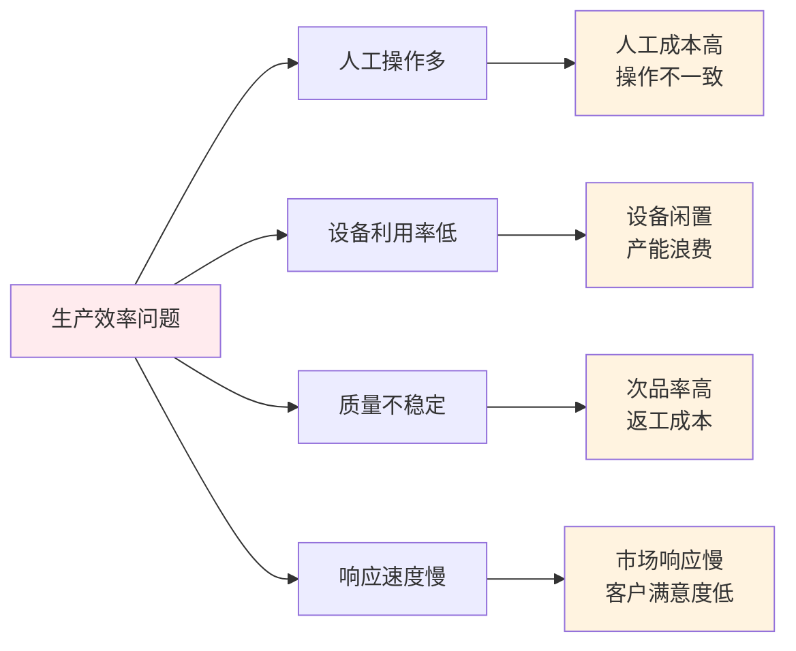
```mermaid
graph LR
    A[生产效率问题] --> B[人工操作多]
    A --> C[设备利用率低]
    A --> D[质量不稳定]
    A --> E[响应速度慢]
    
    B --> F[人工成本高<br/>操作不一致]
    C --> G[设备闲置<br/>产能浪费]
    D --> H[次品率高<br/>返工成本]
    E --> I[市场响应慢<br/>客户满意度低]
    
    style A fill:#ffebee
    style F fill:#fff3e0
    style G fill:#fff3e0
    style H fill:#fff3e0
    style I fill:#fff3e0
```

#### 2.1.2 数据洞察缺失

| 问题域 | 当前状况 | 影响程度 | 改善紧迫性 |
|--------|----------|----------|------------|
| **生产数据** | 手工记录，滞后性强 | 高 | 紧急 |
| **质量数据** | 抽样检测，覆盖面窄 | 高 | 紧急 |
| **设备数据** | 定期巡检，被动维护 | 中 | 重要 |
| **供应链数据** | 信息孤岛，可视化差 | 中 | 重要 |

### 2.2 数字化转型价值实现

#### 2.2.1 智能制造价值链

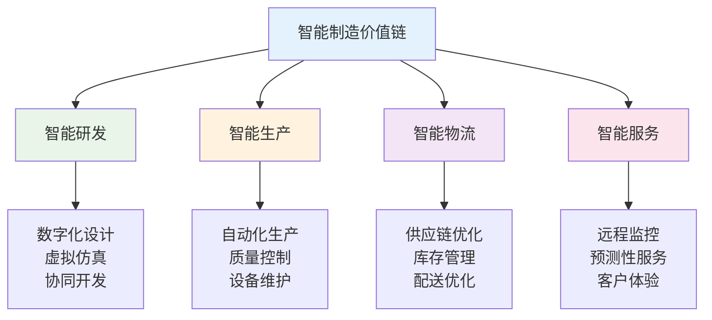
```mermaid
graph TB
    A[智能制造价值链] --> B[智能研发]
    A --> C[智能生产]
    A --> D[智能物流]
    A --> E[智能服务]
    
    B --> F[数字化设计<br/>虚拟仿真<br/>协同开发]
    C --> G[自动化生产<br/>质量控制<br/>设备维护]
    D --> H[供应链优化<br/>库存管理<br/>配送优化]
    E --> I[远程监控<br/>预测性服务<br/>客户体验]
    
    style A fill:#e3f2fd
    style B fill:#e8f5e8
    style C fill:#fff3e0
    style D fill:#f3e5f5
    style E fill:#fce4ec
```

#### 2.2.2 量化业务价值

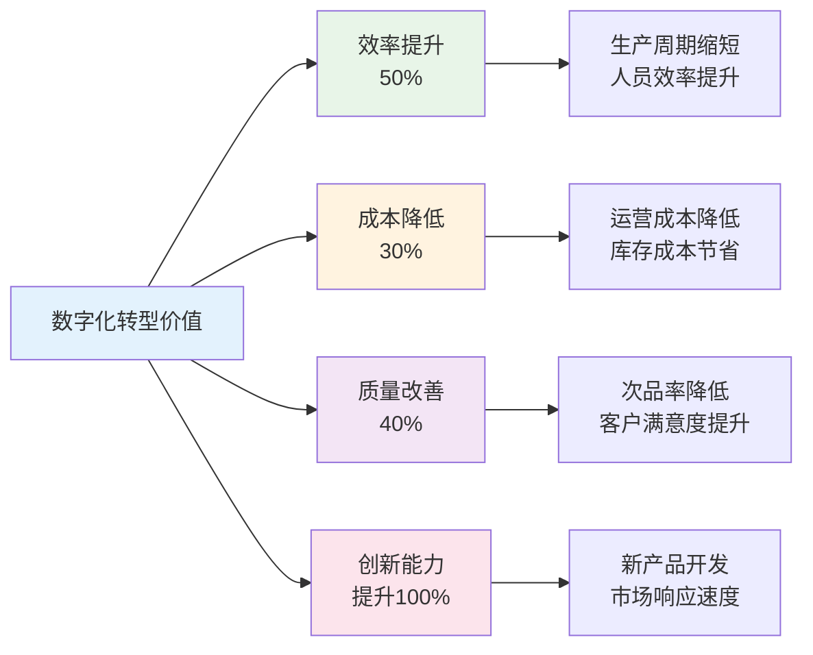
```mermaid
graph LR
    A[数字化转型价值] --> B[效率提升<br/>50%]
    A --> C[成本降低<br/>30%]
    A --> D[质量改善<br/>40%]
    A --> E[创新能力<br/>提升100%]
    
    B --> F[生产周期缩短<br/>人员效率提升]
    C --> G[运营成本降低<br/>库存成本节省]
    D --> H[次品率降低<br/>客户满意度提升]
    E --> I[新产品开发<br/>市场响应速度]
    
    style A fill:#e3f2fd
    style B fill:#e8f5e8
    style C fill:#fff3e0
    style D fill:#f3e5f5
    style E fill:#fce4ec
```

### 2.3 竞争优势分析

#### 2.3.1 数字化成熟度对比

| 能力维度 | 当前水平 | 行业平均 | 目标水平 | 竞争优势 |
|---------|----------|----------|----------|----------|
| **自动化程度** | 30% | 45% | 80% | 领先 |
| **数据分析能力** | 10% | 25% | 70% | 领先 |
| **响应速度** | 3天 | 2天 | 2小时 | 显著领先 |
| **质量一致性** | 85% | 88% | 98% | 领先 |
| **成本控制** | 中等 | 中等 | 优秀 | 领先 |

#### 2.3.2 可持续竞争优势

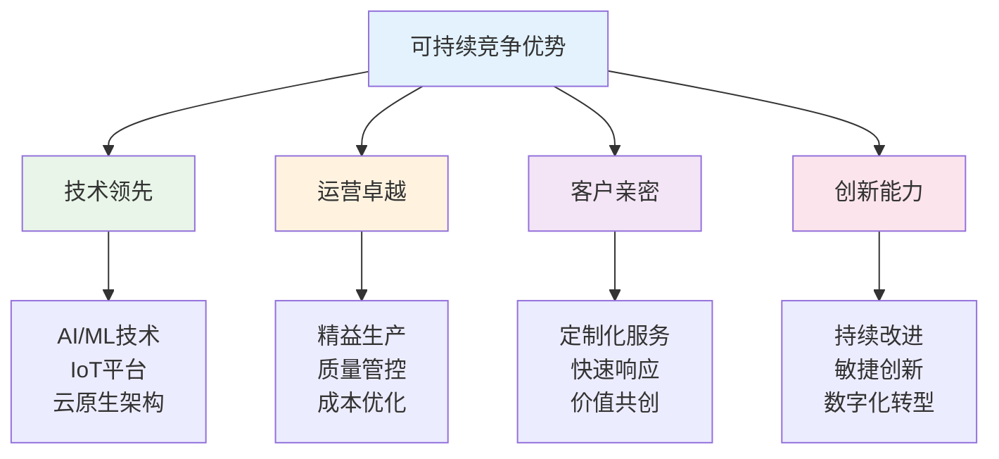
```mermaid
graph TD
    A[可持续竞争优势] --> B[技术领先]
    A --> C[运营卓越]
    A --> D[客户亲密]
    A --> E[创新能力]
    
    B --> F[AI/ML技术<br/>IoT平台<br/>云原生架构]
    C --> G[精益生产<br/>质量管控<br/>成本优化]
    D --> H[定制化服务<br/>快速响应<br/>价值共创]
    E --> I[持续改进<br/>敏捷创新<br/>数字化转型]
    
    style A fill:#e3f2fd
    style B fill:#e8f5e8
    style C fill:#fff3e0
    style D fill:#f3e5f5
    style E fill:#fce4ec
```

---

## 🏗️ 第三章：解决方案概述

### 3.1 整体架构设计

#### 3.1.1 Microsoft智能制造架构

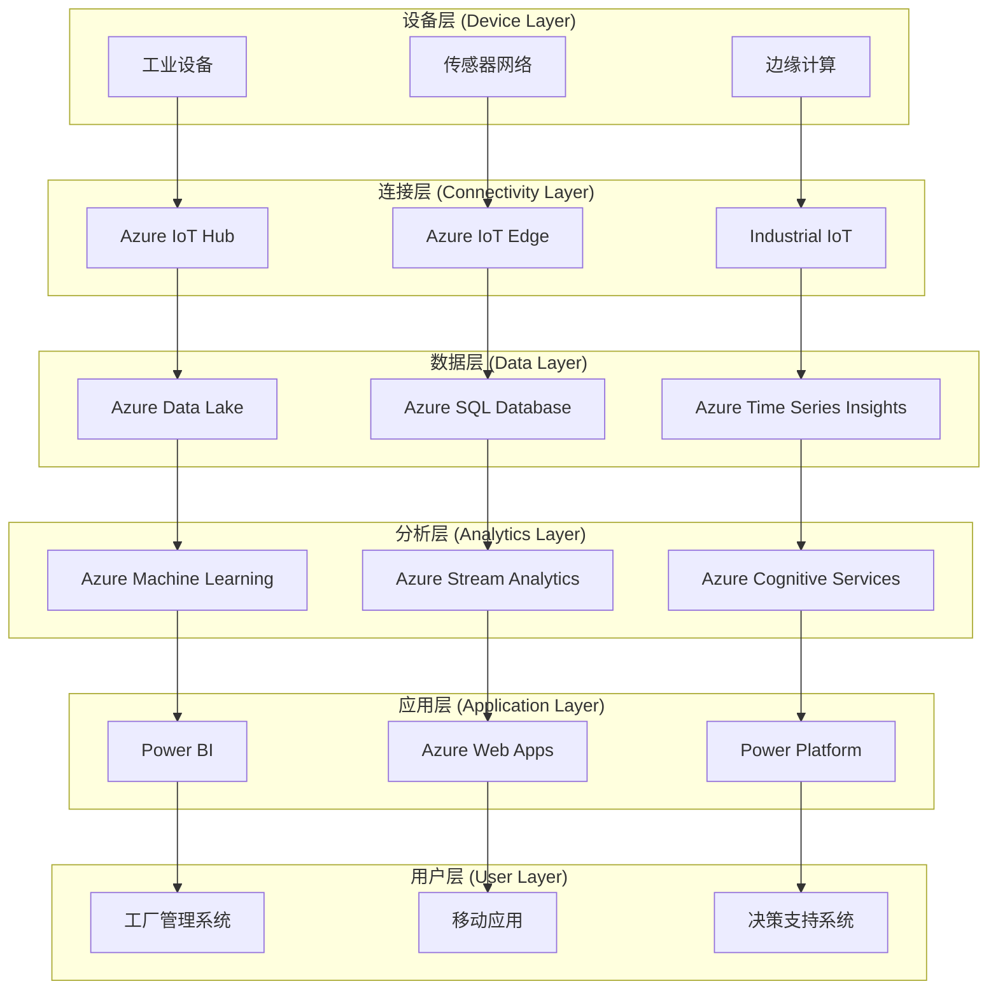
```mermaid
graph TB
    subgraph "设备层 (Device Layer)"
        A1[工业设备]
        A2[传感器网络]
        A3[边缘计算]
    end
    
    subgraph "连接层 (Connectivity Layer)"
        B1[Azure IoT Hub]
        B2[Azure IoT Edge]
        B3[Industrial IoT]
    end
    
    subgraph "数据层 (Data Layer)"
        C1[Azure Data Lake]
        C2[Azure SQL Database]
        C3[Azure Time Series Insights]
    end
    
    subgraph "分析层 (Analytics Layer)"
        D1[Azure Machine Learning]
        D2[Azure Stream Analytics]
        D3[Azure Cognitive Services]
    end
    
    subgraph "应用层 (Application Layer)"
        E1[Power BI]
        E2[Azure Web Apps]
        E3[Power Platform]
    end
    
    subgraph "用户层 (User Layer)"
        F1[工厂管理系统]
        F2[移动应用]
        F3[决策支持系统]
    end
    
    A1 --> B1
    A2 --> B2
    A3 --> B3
    
    B1 --> C1
    B2 --> C2
    B3 --> C3
    
    C1 --> D1
    C2 --> D2
    C3 --> D3
    
    D1 --> E1
    D2 --> E2
    D3 --> E3
    
    E1 --> F1
    E2 --> F2
    E3 --> F3
```

#### 3.1.2 核心技术栈

| 技术层级 | Microsoft产品 | 功能说明 | 选择理由 |
|---------|---------------|----------|----------|
| **云平台** | Azure Cloud | 基础设施服务 | 全球领先，安全可靠 |
| **IoT平台** | Azure IoT Hub | 设备连接管理 | 企业级IoT解决方案 |
| **数据存储** | Azure Data Lake | 大数据存储 | 支持结构化/非结构化数据 |
| **AI/ML** | Azure ML Studio | 机器学习平台 | 拖拽式建模，易于使用 |
| **分析可视化** | Power BI | 商业智能分析 | 强大的可视化能力 |
| **应用开发** | Power Platform | 低代码开发 | 快速开发，降低门槛 |

### 3.2 核心功能模块

#### 3.2.1 智能生产管理系统

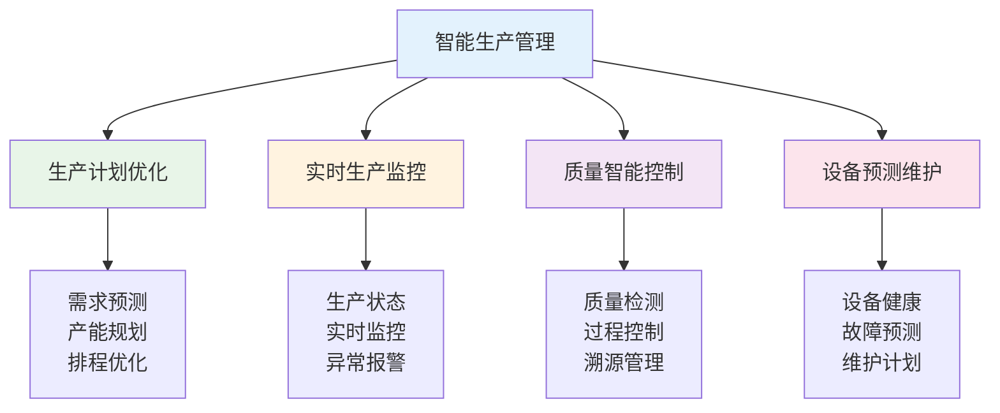
```mermaid
graph TD
    A[智能生产管理] --> B[生产计划优化]
    A --> C[实时生产监控]
    A --> D[质量智能控制]
    A --> E[设备预测维护]
    
    B --> F[需求预测<br/>产能规划<br/>排程优化]
    C --> G[生产状态<br/>实时监控<br/>异常报警]
    D --> H[质量检测<br/>过程控制<br/>溯源管理]
    E --> I[设备健康<br/>故障预测<br/>维护计划]
    
    style A fill:#e3f2fd
    style B fill:#e8f5e8
    style C fill:#fff3e0
    style D fill:#f3e5f5
    style E fill:#fce4ec
```

#### 3.2.2 智能供应链系统

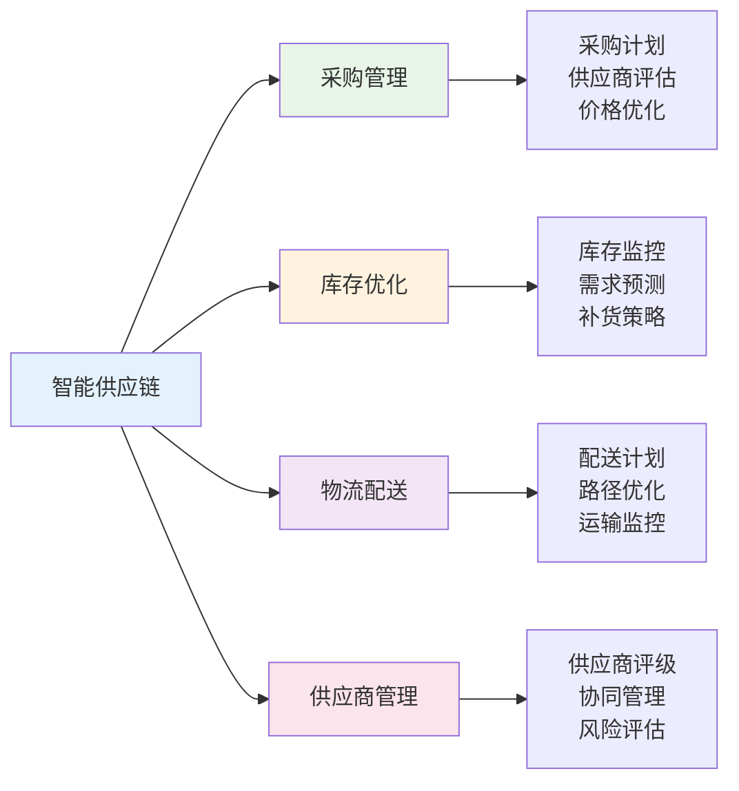
```mermaid
graph LR
    A[智能供应链] --> B[采购管理]
    A --> C[库存优化]
    A --> D[物流配送]
    A --> E[供应商管理]
    
    B --> F[采购计划<br/>供应商评估<br/>价格优化]
    C --> G[库存监控<br/>需求预测<br/>补货策略]
    D --> H[配送计划<br/>路径优化<br/>运输监控]
    E --> I[供应商评级<br/>协同管理<br/>风险评估]
    
    style A fill:#e3f2fd
    style B fill:#e8f5e8
    style C fill:#fff3e0
    style D fill:#f3e5f5
    style E fill:#fce4ec
```

### 3.3 数据驱动决策体系

#### 3.3.1 数据分析架构

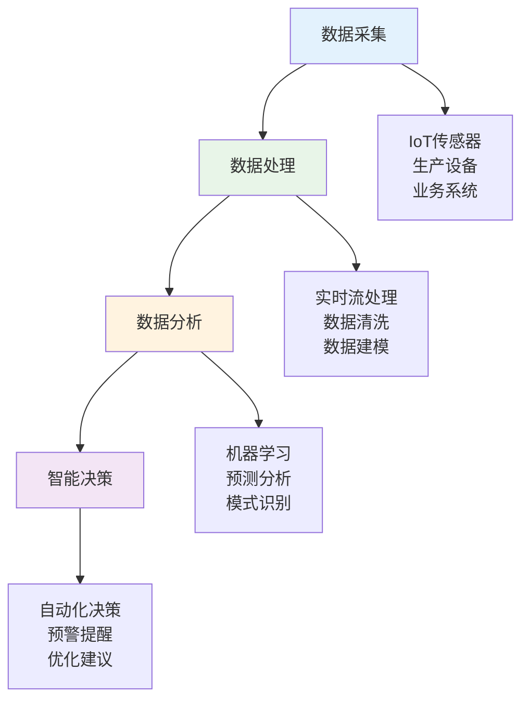
```mermaid
graph TB
    A[数据采集] --> B[数据处理]
    B --> C[数据分析]
    C --> D[智能决策]
    
    A --> E[IoT传感器<br/>生产设备<br/>业务系统]
    B --> F[实时流处理<br/>数据清洗<br/>数据建模]
    C --> G[机器学习<br/>预测分析<br/>模式识别]
    D --> H[自动化决策<br/>预警提醒<br/>优化建议]
    
    style A fill:#e3f2fd
    style B fill:#e8f5e8
    style C fill:#fff3e0
    style D fill:#f3e5f5
```

#### 3.3.2 关键业务指标

| 指标类别 | 关键指标 | 当前值 | 目标值 | 改善幅度 |
|---------|----------|--------|--------|----------|
| **生产效率** | 设备综合效率(OEE) | 65% | 85% | +31% |
| **质量管控** | 一次通过率 | 88% | 98% | +11% |
| **成本控制** | 单位产品成本 | 100元 | 70元 | -30% |
| **交付能力** | 准时交付率 | 85% | 98% | +15% |
| **库存管理** | 库存周转率 | 6次/年 | 12次/年 | +100% |

---

## 🔧 第四章：技术架构设计

### 4.1 云原生架构设计

#### 4.1.1 微服务架构

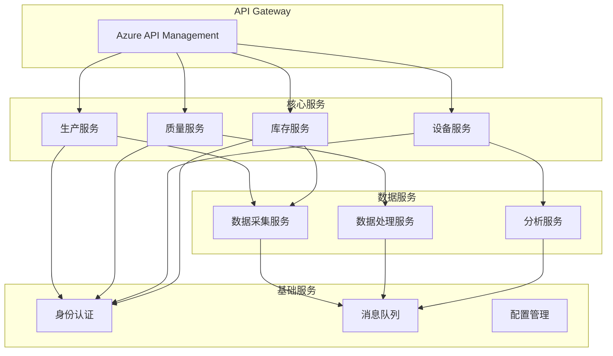
```mermaid
graph TB
    subgraph "API Gateway"
        A[Azure API Management]
    end
    
    subgraph "核心服务"
        B1[生产服务]
        B2[质量服务]
        B3[设备服务]
        B4[库存服务]
    end
    
    subgraph "数据服务"
        C1[数据采集服务]
        C2[数据处理服务]
        C3[分析服务]
    end
    
    subgraph "基础服务"
        D1[身份认证]
        D2[消息队列]
        D3[配置管理]
    end
    
    A --> B1
    A --> B2
    A --> B3
    A --> B4
    
    B1 --> C1
    B2 --> C2
    B3 --> C3
    B4 --> C1
    
    C1 --> D2
    C2 --> D2
    C3 --> D2
    
    B1 --> D1
    B2 --> D1
    B3 --> D1
    B4 --> D1
```

#### 4.1.2 容器化部署

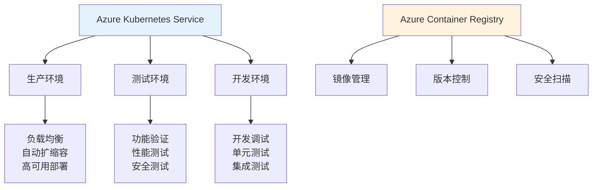
```mermaid
graph TD
    A[Azure Kubernetes Service] --> B[生产环境]
    A --> C[测试环境]
    A --> D[开发环境]
    
    B --> E[负载均衡<br/>自动扩缩容<br/>高可用部署]
    C --> F[功能验证<br/>性能测试<br/>安全测试]
    D --> G[开发调试<br/>单元测试<br/>集成测试]
    
    H[Azure Container Registry] --> I[镜像管理]
    H --> J[版本控制]
    H --> K[安全扫描]
    
    style A fill:#e3f2fd
    style H fill:#fff3e0
```

### 4.2 数据架构设计

#### 4.2.1 数据湖架构

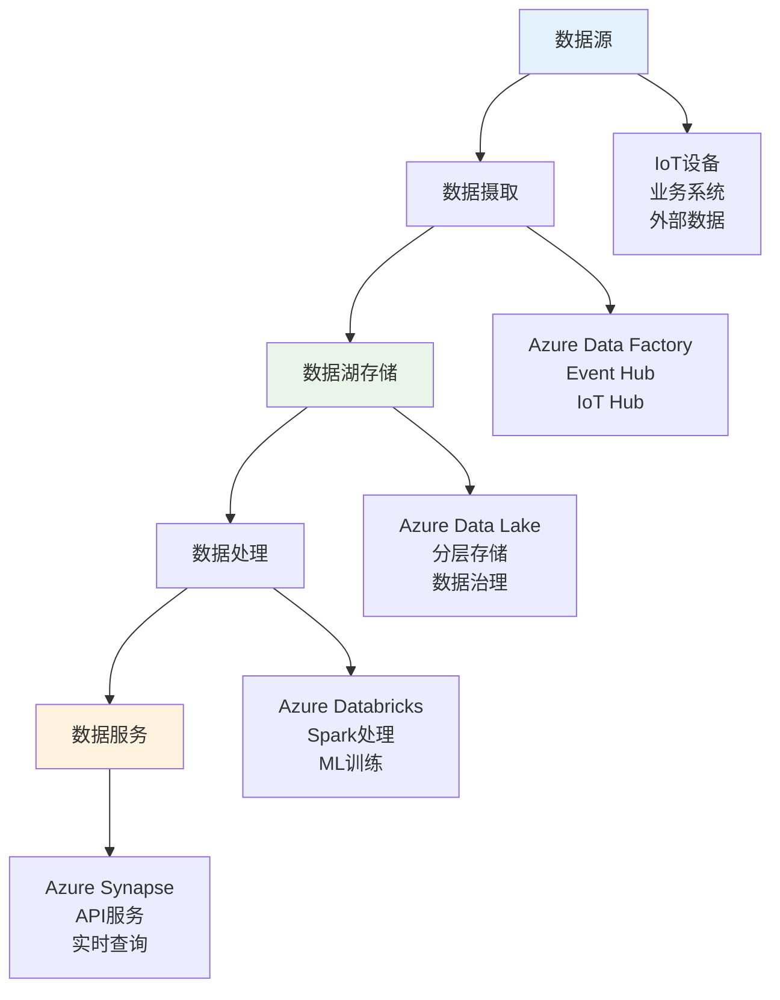
```mermaid
graph TB
    A[数据源] --> B[数据摄取]
    B --> C[数据湖存储]
    C --> D[数据处理]
    D --> E[数据服务]
    
    A --> F[IoT设备<br/>业务系统<br/>外部数据]
    B --> G[Azure Data Factory<br/>Event Hub<br/>IoT Hub]
    C --> H[Azure Data Lake<br/>分层存储<br/>数据治理]
    D --> I[Azure Databricks<br/>Spark处理<br/>ML训练]
    E --> J[Azure Synapse<br/>API服务<br/>实时查询]
    
    style A fill:#e3f2fd
    style C fill:#e8f5e8
    style E fill:#fff3e0
```

#### 4.2.2 实时数据处理

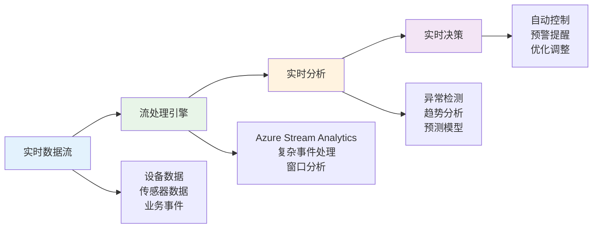
```mermaid
graph LR
    A[实时数据流] --> B[流处理引擎]
    B --> C[实时分析]
    C --> D[实时决策]
    
    A --> E[设备数据<br/>传感器数据<br/>业务事件]
    B --> F[Azure Stream Analytics<br/>复杂事件处理<br/>窗口分析]
    C --> G[异常检测<br/>趋势分析<br/>预测模型]
    D --> H[自动控制<br/>预警提醒<br/>优化调整]
    
    style A fill:#e3f2fd
    style B fill:#e8f5e8
    style C fill:#fff3e0
    style D fill:#f3e5f5
```

### 4.3 AI/ML架构设计

#### 4.3.1 机器学习平台

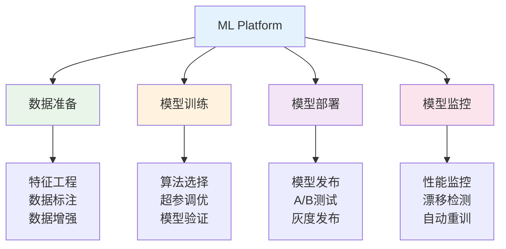
```mermaid
graph TD
    A[ML Platform] --> B[数据准备]
    A --> C[模型训练]
    A --> D[模型部署]
    A --> E[模型监控]
    
    B --> F[特征工程<br/>数据标注<br/>数据增强]
    C --> G[算法选择<br/>超参调优<br/>模型验证]
    D --> H[模型发布<br/>A/B测试<br/>灰度发布]
    E --> I[性能监控<br/>漂移检测<br/>自动重训]
    
    style A fill:#e3f2fd
    style B fill:#e8f5e8
    style C fill:#fff3e0
    style D fill:#f3e5f5
    style E fill:#fce4ec
```

#### 4.3.2 核心AI应用场景

| 应用场景 | 技术方案 | 业务价值 | 实现难度 |
|---------|----------|----------|----------|
| **质量检测** | 计算机视觉 | 检测准确率提升至99% | 中等 |
| **预测维护** | 时间序列分析 | 设备故障预测准确率85% | 中等 |
| **需求预测** | 深度学习 | 预测准确率提升至90% | 困难 |
| **生产优化** | 强化学习 | 生产效率提升30% | 困难 |
| **异常检测** | 无监督学习 | 异常检测准确率95% | 中等 |

---

## 📋 第五章：实施计划

### 5.1 项目实施路线图

#### 5.1.1 分阶段实施策略

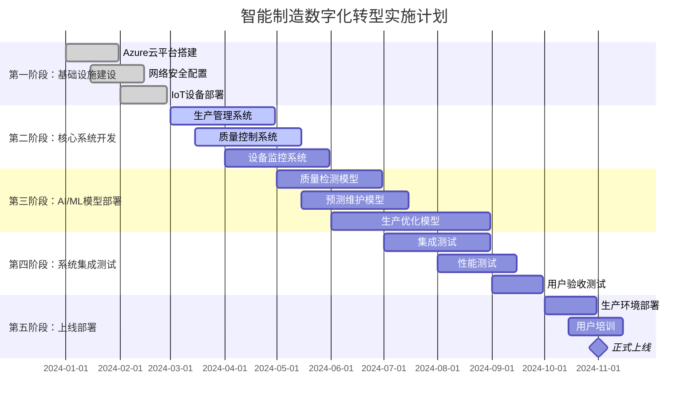
```mermaid
gantt
    title 智能制造数字化转型实施计划
    dateFormat  YYYY-MM-DD
    
    section 第一阶段：基础设施建设
    Azure云平台搭建    :done, phase1-1, 2024-01-01, 2024-01-31
    网络安全配置      :done, phase1-2, 2024-01-15, 2024-02-15
    IoT设备部署       :done, phase1-3, 2024-02-01, 2024-02-28
    
    section 第二阶段：核心系统开发
    生产管理系统      :active, phase2-1, 2024-03-01, 2024-04-30
    质量控制系统      :active, phase2-2, 2024-03-15, 2024-05-15
    设备监控系统      :phase2-3, 2024-04-01, 2024-05-31
    
    section 第三阶段：AI/ML模型部署
    质量检测模型      :phase3-1, 2024-05-01, 2024-06-30
    预测维护模型      :phase3-2, 2024-05-15, 2024-07-15
    生产优化模型      :phase3-3, 2024-06-01, 2024-08-31
    
    section 第四阶段：系统集成测试
    集成测试          :phase4-1, 2024-07-01, 2024-08-31
    性能测试          :phase4-2, 2024-08-01, 2024-09-15
    用户验收测试      :phase4-3, 2024-09-01, 2024-09-30
    
    section 第五阶段：上线部署
    生产环境部署      :phase5-1, 2024-10-01, 2024-10-31
    用户培训          :phase5-2, 2024-10-15, 2024-11-15
    正式上线          :milestone, go-live, 2024-11-01, 0d
```

#### 5.1.2 里程碑管理

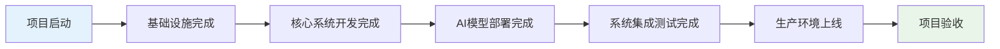
```mermaid
graph LR
    A[项目启动] --> B[基础设施完成]
    B --> C[核心系统开发完成]
    C --> D[AI模型部署完成]
    D --> E[系统集成测试完成]
    E --> F[生产环境上线]
    F --> G[项目验收]
    
    style A fill:#e3f2fd
    style G fill:#e8f5e8
```

### 5.2 组织与资源配置

#### 5.2.1 项目组织架构

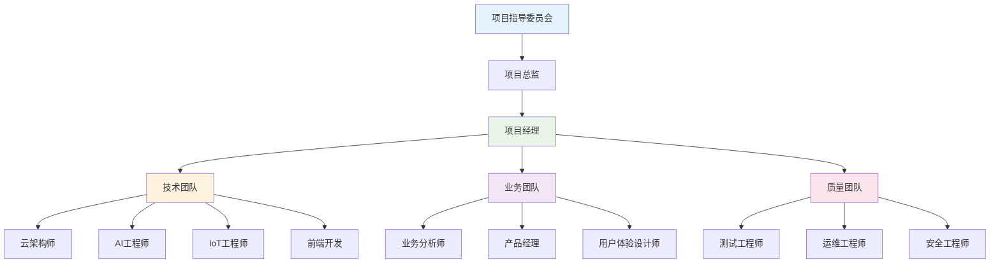
```mermaid
graph TB
    A[项目指导委员会] --> B[项目总监]
    B --> C[项目经理]
    
    C --> D[技术团队]
    C --> E[业务团队]
    C --> F[质量团队]
    
    D --> G[云架构师]
    D --> H[AI工程师]
    D --> I[IoT工程师]
    D --> J[前端开发]
    
    E --> K[业务分析师]
    E --> L[产品经理]
    E --> M[用户体验设计师]
    
    F --> N[测试工程师]
    F --> O[运维工程师]
    F --> P[安全工程师]
    
    style A fill:#e3f2fd
    style C fill:#e8f5e8
    style D fill:#fff3e0
    style E fill:#f3e5f5
    style F fill:#fce4ec
```

#### 5.2.2 关键角色与职责

| 角色 | 人数 | 核心技能 | 主要职责 |
|------|------|----------|----------|
| **项目经理** | 1 | PMP认证，制造业经验 | 项目整体管理，进度控制 |
| **云架构师** | 2 | Azure认证，微服务架构 | 技术架构设计，云平台建设 |
| **AI工程师** | 3 | 机器学习，深度学习 | AI模型开发，算法优化 |
| **IoT工程师** | 2 | 物联网，嵌入式开发 | 设备连接，数据采集 |
| **业务分析师** | 2 | 制造业务，需求分析 | 业务需求梳理，流程优化 |
| **测试工程师** | 3 | 自动化测试，性能测试 | 质量保障，测试执行 |

### 5.3 风险管理与质量保障

#### 5.3.1 风险管理矩阵

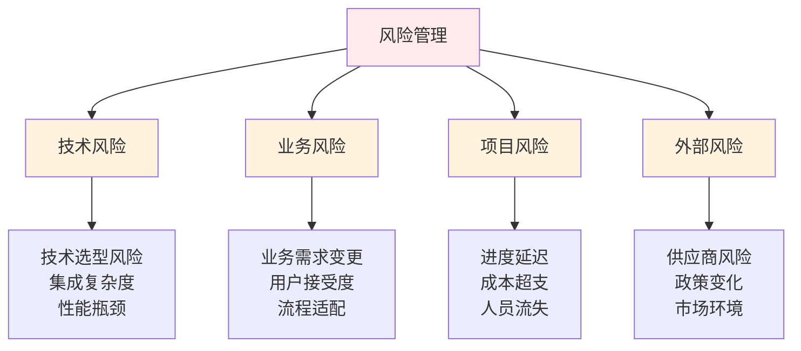
```mermaid
graph TD
    A[风险管理] --> B[技术风险]
    A --> C[业务风险]
    A --> D[项目风险]
    A --> E[外部风险]
    
    B --> F[技术选型风险<br/>集成复杂度<br/>性能瓶颈]
    C --> G[业务需求变更<br/>用户接受度<br/>流程适配]
    D --> H[进度延迟<br/>成本超支<br/>人员流失]
    E --> I[供应商风险<br/>政策变化<br/>市场环境]
    
    style A fill:#ffebee
    style B fill:#fff3e0
    style C fill:#fff3e0
    style D fill:#fff3e0
    style E fill:#fff3e0
```

#### 5.3.2 质量保障体系

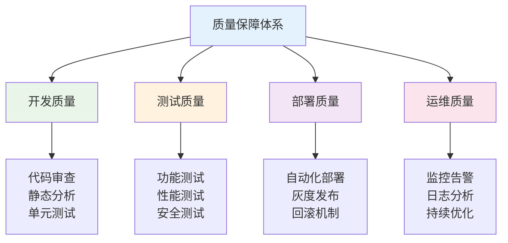
```mermaid
graph TB
    A[质量保障体系] --> B[开发质量]
    A --> C[测试质量]
    A --> D[部署质量]
    A --> E[运维质量]
    
    B --> F[代码审查<br/>静态分析<br/>单元测试]
    C --> G[功能测试<br/>性能测试<br/>安全测试]
    D --> H[自动化部署<br/>灰度发布<br/>回滚机制]
    E --> I[监控告警<br/>日志分析<br/>持续优化]
    
    style A fill:#e3f2fd
    style B fill:#e8f5e8
    style C fill:#fff3e0
    style D fill:#f3e5f5
    style E fill:#fce4ec
```

---

## ⚠️ 第六章：风险管控

### 6.1 风险识别与评估

#### 6.1.1 关键风险分析

| 风险类型 | 风险描述 | 发生概率 | 影响程度 | 风险等级 | 应对策略 |
|---------|----------|----------|----------|----------|----------|
| **技术风险** | AI模型准确率不达标 | 中 | 高 | 高 | 数据增强，模型优化 |
| **业务风险** | 生产流程适配困难 | 中 | 中 | 中 | 分步实施，试点推广 |
| **项目风险** | 关键人员离职 | 低 | 高 | 中 | 知识转移，人员备份 |
| **外部风险** | 云服务中断 | 低 | 中 | 低 | 多区域部署，备份方案 |

#### 6.1.2 风险应对策略

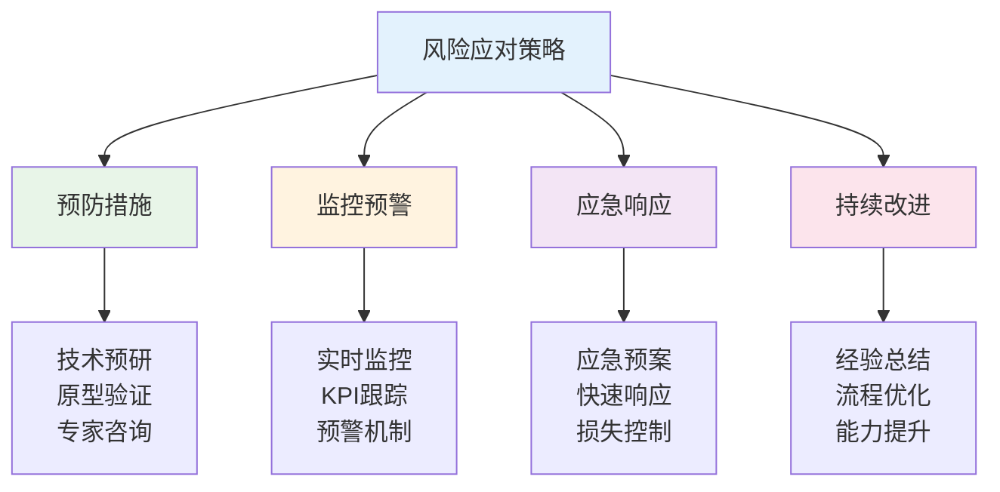
```mermaid
graph TD
    A[风险应对策略] --> B[预防措施]
    A --> C[监控预警]
    A --> D[应急响应]
    A --> E[持续改进]
    
    B --> F[技术预研<br/>原型验证<br/>专家咨询]
    C --> G[实时监控<br/>KPI跟踪<br/>预警机制]
    D --> H[应急预案<br/>快速响应<br/>损失控制]
    E --> I[经验总结<br/>流程优化<br/>能力提升]
    
    style A fill:#e3f2fd
    style B fill:#e8f5e8
    style C fill:#fff3e0
    style D fill:#f3e5f5
    style E fill:#fce4ec
```

### 6.2 业务连续性管理

#### 6.2.1 灾备体系

```mermaid
graph TB
    A[业务连续性] --> B[数据备份]
    A --> C[系统容灾]
    A --> D[业务恢复]
    
    B --> E[实时同步<br/>定期备份<br/>异地存储]
    C --> F[多区域部署<br/>自动切换<br/>负载均衡]
    D --> G[业务恢复计划<br/>演练测试<br/>人员培训]
    
    style A fill:#e3f2fd
    style B fill:#e8f5e8
    style C fill:#fff3e0
    style D fill:#f3e5f5
```

#### 6.2.2 服务水平保障

| 服务指标 | 目标值 | 监控方式 | 应对措施 |
|---------|--------|----------|----------|
| **系统可用性** | 99.9% | 实时监控 | 自动切换 |
| **响应时间** | <2秒 | 性能监控 | 性能调优 |
| **数据一致性** | 100% | 数据校验 | 数据修复 |
| **安全事件** | 0起 | 安全监控 | 应急响应 |

---

## 🔧 第七章：运维支持

### 7.1 DevOps实践

#### 7.1.1 CI/CD流水线

```mermaid
graph LR
    A[代码提交] --> B[自动构建]
    B --> C[自动测试]
    C --> D[安全扫描]
    D --> E[自动部署]
    E --> F[监控告警]
    
    G[Azure DevOps] --> H[源码管理]
    G --> I[构建管道]
    G --> J[发布管道]
    G --> K[工作项跟踪]
    
    style A fill:#e3f2fd
    style F fill:#e8f5e8
    style G fill:#fff3e0
```

#### 7.1.2 监控运维体系

```mermaid
graph TD
    A[监控运维] --> B[基础设施监控]
    A --> C[应用性能监控]
    A --> D[业务指标监控]
    A --> E[安全监控]
    
    B --> F[Azure Monitor<br/>资源监控<br/>成本监控]
    C --> G[Application Insights<br/>性能分析<br/>异常检测]
    D --> H[Power BI<br/>业务仪表板<br/>KPI监控]
    E --> I[Azure Security Center<br/>威胁检测<br/>合规检查]
    
    style A fill:#e3f2fd
    style B fill:#e8f5e8
    style C fill:#fff3e0
    style D fill:#f3e5f5
    style E fill:#fce4ec
```

### 7.2 智能运维

#### 7.2.1 AIOps实践

```mermaid
graph TB
    A[AIOps平台] --> B[异常检测]
    A --> C[根因分析]
    A --> D[预测性维护]
    A --> E[自动化修复]
    
    B --> F[机器学习<br/>模式识别<br/>异常发现]
    C --> G[关联分析<br/>因果推理<br/>问题定位]
    D --> H[趋势分析<br/>容量规划<br/>故障预测]
    E --> I[自动化脚本<br/>自愈能力<br/>智能调优]
    
    style A fill:#e3f2fd
    style B fill:#e8f5e8
    style C fill:#fff3e0
    style D fill:#f3e5f5
    style E fill:#fce4ec
```

#### 7.2.2 运维自动化

| 自动化领域 | 实现方式 | 预期效果 | 实施难度 |
|-----------|----------|----------|----------|
| **部署自动化** | Azure DevOps | 部署时间减少90% | 中等 |
| **监控自动化** | Azure Monitor | 问题发现时间减少80% | 简单 |
| **故障自动化** | Logic Apps | 故障处理时间减少70% | 复杂 |
| **扩容自动化** | Auto Scaling | 资源利用率提升50% | 中等 |

---

## 📊 第八章：成功案例与最佳实践

### 8.1 类似项目成功案例

#### 8.1.1 某汽车制造企业案例

```mermaid
graph TD
    A[项目背景] --> B[传统制造模式]
    A --> C[市场竞争激烈]
    A --> D[成本压力增大]
    
    E[解决方案] --> F[智能生产线]
    E --> G[预测性维护]
    E --> H[质量智能控制]
    
    I[实施效果] --> J[生产效率提升45%]
    I --> K[设备故障减少60%]
    I --> L[产品质量提升30%]
    I --> M[运营成本降低25%]
    
    style A fill:#e3f2fd
    style E fill:#e8f5e8
    style I fill:#fff3e0
```

#### 8.1.2 项目成果数据

| 改善指标 | 实施前 | 实施后 | 改善幅度 |
|---------|--------|--------|----------|
| **设备综合效率** | 62% | 87% | +40% |
| **产品一次通过率** | 85% | 96% | +13% |
| **生产计划达成率** | 78% | 95% | +22% |
| **设备故障率** | 12% | 3% | -75% |
| **库存周转率** | 8次/年 | 15次/年 | +88% |

### 8.2 最佳实践总结

#### 8.2.1 实施成功要素

```mermaid
graph TD
    A[成功要素] --> B[领导支持]
    A --> C[技术选型]
    A --> D[人员培训]
    A --> E[分步实施]
    
    B --> F[高管重视<br/>资源投入<br/>决策支持]
    C --> G[成熟技术<br/>开放架构<br/>可扩展性]
    D --> H[技能提升<br/>文化变革<br/>持续学习]
    E --> I[试点验证<br/>逐步推广<br/>风险控制]
    
    style A fill:#e3f2fd
    style B fill:#e8f5e8
    style C fill:#fff3e0
    style D fill:#f3e5f5
    style E fill:#fce4ec
```

#### 8.2.2 关键经验教训

| 经验类型 | 具体内容 | 重要程度 | 应对建议 |
|---------|----------|----------|----------|
| **技术经验** | 数据质量是AI成功的关键 | 高 | 建立数据治理体系 |
| **管理经验** | 变革管理比技术更重要 | 高 | 加强沟通培训 |
| **业务经验** | 从小范围试点开始 | 中 | 选择合适试点 |
| **团队经验** | 内外部协作很关键 | 中 | 建立协作机制 |

---

## 📋 第九章：总结与建议

### 9.1 方案总结

#### 9.1.1 核心价值

```mermaid
graph TB
    A[数字化转型价值] --> B[技术价值]
    A --> C[业务价值]
    A --> D[战略价值]
    
    B --> E[技术现代化<br/>平台统一<br/>能力提升]
    C --> F[效率提升<br/>成本降低<br/>质量改善]
    D --> G[竞争优势<br/>创新能力<br/>可持续发展]
    
    style A fill:#e3f2fd
    style B fill:#e8f5e8
    style C fill:#fff3e0
    style D fill:#f3e5f5
```

#### 9.1.2 预期成果

- **📈 业务指标提升**：生产效率提升50%，成本降低30%
- **🔧 技术能力增强**：建立现代化IT架构，提升数字化水平
- **🎯 竞争优势**：打造智能制造标杆，引领行业发展
- **💡 创新能力**：建立持续创新机制，适应市场变化

### 9.2 实施建议

#### 9.2.1 关键成功要素

```mermaid
graph TD
    A[实施建议] --> B[组织准备]
    A --> C[技术准备]
    A --> D[人员准备]
    A --> E[文化准备]
    
    B --> F[治理体系<br/>决策机制<br/>资源配置]
    C --> G[技术选型<br/>架构设计<br/>标准制定]
    D --> H[技能培训<br/>团队建设<br/>激励机制]
    E --> I[变革管理<br/>沟通协作<br/>持续改进]
    
    style A fill:#e3f2fd
    style B fill:#e8f5e8
    style C fill:#fff3e0
    style D fill:#f3e5f5
    style E fill:#fce4ec
```

#### 9.2.2 下一步行动

1. **📋 项目启动**（2周内）
   - 成立项目组织
   - 制定详细计划
   - 签署合作协议

2. **🔧 技术准备**（1个月内）
   - Azure平台搭建
   - 技术团队培训
   - 开发环境准备

3. **🏭 试点实施**（3个月内）
   - 选择试点车间
   - 核心功能开发
   - 效果验证评估

4. **🚀 全面推广**（6个月内）
   - 逐步扩大范围
   - 系统优化完善
   - 正式投产运行

---

## 📞 联系信息

**项目团队**
- 项目总监：Microsoft解决方案架构师
- 技术负责人：Azure认证专家
- 业务负责人：制造业数字化专家

**联系方式**
- 📧 邮箱：solution@microsoft.com
- 📞 电话：400-820-3800
- 🌐 网站：azure.microsoft.com/manufacturing
- 📍 地址：上海市浦东新区世纪大道1568号

---

*本方案基于Microsoft Solution Architecture Framework设计，结合制造业最佳实践，为企业数字化转型提供完整解决方案。*

*© 2024 Microsoft Corporation. 保留所有权利.*
