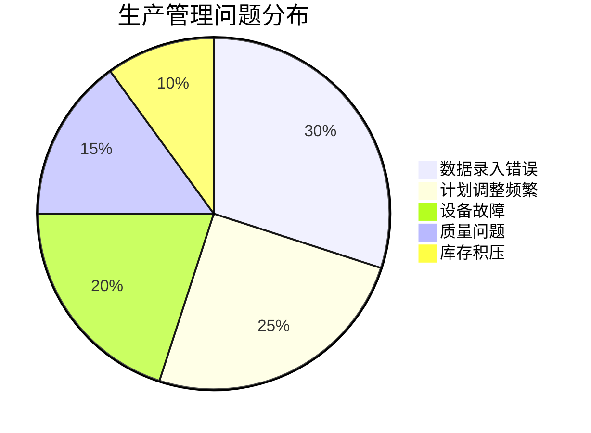
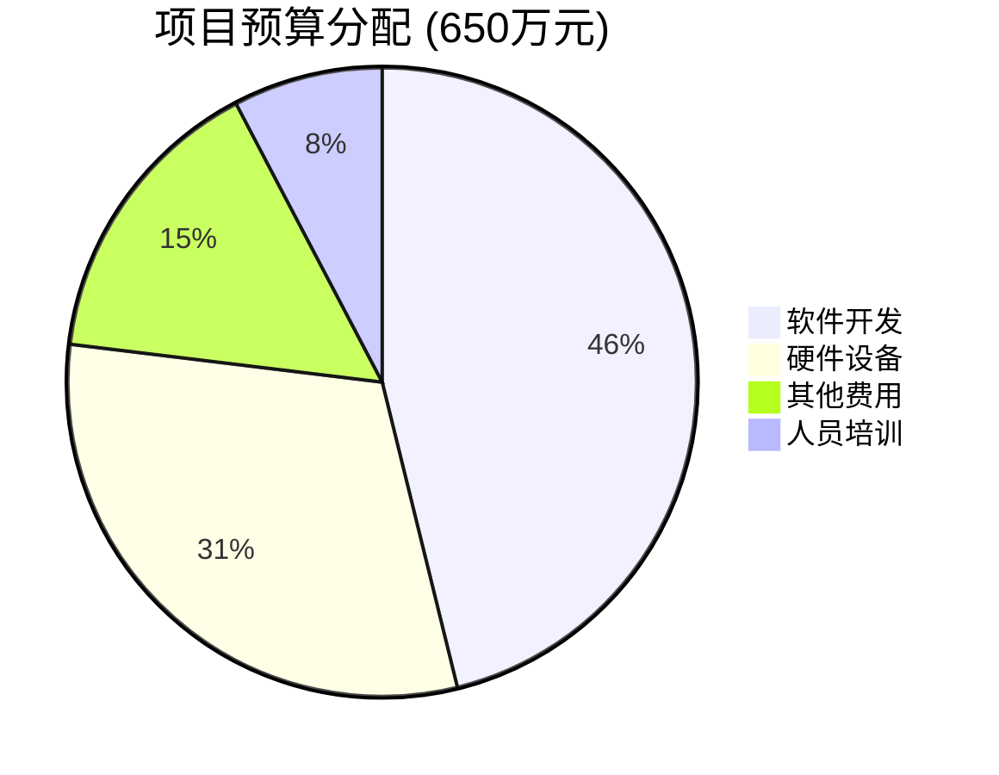
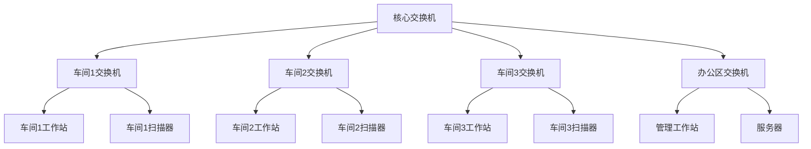
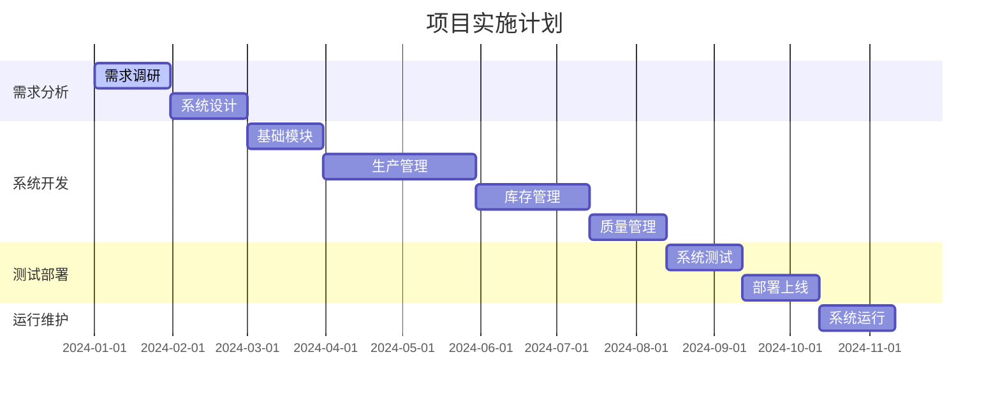

# 制造业智能化升级方案

## 项目概述

### 项目背景

#### 行业发展趋势
随着工业4.0时代的到来，制造业数字化转型已成为全球制造业发展的主要趋势。德国提出的工业4.0、美国的工业互联网、中国的智能制造2025等国家战略，都将制造业智能化升级作为核心内容。

**全球制造业发展现状：**
- 发达国家制造业回归，竞争加剧
- 新兴技术快速发展，IoT、大数据、人工智能等技术逐步成熟
- 客户需求日益个性化，大规模定制成为趋势
- 环保要求日益严格，绿色制造成为必然要求

**国内制造业发展环境：**
- 《中国制造2025》明确提出智能制造是主攻方向
- 政府出台多项政策支持制造业升级，提供资金和税收优惠
- 人口红利逐步消失，劳动力成本持续上升
- 消费升级推动制造业向高质量发展转型

#### 企业发展背景
我公司成立于2008年，是一家专业从事机械制造的中型企业，主要产品包括精密机械零部件、自动化设备等。经过十多年的发展，公司已成为本地区的知名制造企业。

**企业发展历程：**
- 2008年：公司成立，初期主要从事代工生产
- 2012年：建立自主品牌，开始独立研发
- 2015年：通过ISO9001质量管理体系认证
- 2018年：年产值突破1亿元，员工达到250人
- 2020年：受疫情影响，生产经营遇到挑战
- 2023年：市场竞争加剧，利润空间压缩

**企业基本情况：**
- 注册资本：5000万元
- 员工人数：250人
- 年产值：1.2亿元
- 主要产品：精密机械零部件、自动化设备
- 主要客户：汽车制造、电子制造、医疗器械等行业

**企业核心竞争力：**
- 具备较强的技术研发能力
- 拥有完善的质量管理体系
- 建立了稳定的客户关系
- 拥有经验丰富的管理团队

#### 面临的挑战
近年来，公司面临着内外部环境的多重挑战：

**外部挑战：**
- 市场竞争日趋激烈，价格战频发
- 原材料价格上涨，成本压力增大
- 客户要求不断提高，交期更短、质量更高
- 环保政策收紧，合规成本增加
- 疫情反复影响，供应链不稳定

**内部挑战：**
- 生产管理方式落后，效率提升困难
- 人员流动性大，培训成本高
- 质量控制手段单一，一致性难以保证
- 库存管理混乱，资金占用过多
- 信息化程度低，决策缺乏数据支撑

#### 发展机遇
虽然面临挑战，但公司也迎来了重要的发展机遇：

**政策机遇：**
- 国家大力支持制造业升级转型
- 地方政府出台专项扶持政策
- 提供技术改造资金补贴
- 税收优惠政策支持

**技术机遇：**
- 信息化技术日趋成熟，实施成本降低
- 工业互联网平台快速发展
- 人工智能技术在制造业应用增多
- 云计算、大数据等技术普及

**市场机遇：**
- 高端制造需求增长
- 定制化生产成为趋势
- 新兴行业带来新的市场机会
- 国际化发展空间广阔

#### 转型需求分析
基于对内外部环境的分析，公司急需通过信息化手段实现转型升级：

**提升运营效率的需求：**
- 生产效率亟需提升，应对成本压力
- 质量管理需要标准化，确保产品一致性
- 库存管理需要优化，降低资金占用
- 设备利用率需要提高，提升投资回报

**增强竞争力的需求：**
- 快速响应市场变化的能力
- 提供高质量、个性化产品的能力
- 降低生产成本的能力
- 建立可持续发展的能力

**满足客户需求的需求：**
- 提高产品质量的稳定性
- 缩短产品交付周期
- 增强服务响应能力
- 提供产品追溯服务

**企业管理升级的需求：**
- 建立数据驱动的决策体系
- 提高管理效率和准确性
- 建立标准化的业务流程
- 增强风险控制能力

#### 项目启动契机
在深入分析内外部环境后，公司高层决定启动制造业智能化升级项目：

**决策依据：**
- 市场竞争压力日益增大
- 传统管理模式已难以适应发展需求
- 信息化技术日趋成熟，实施条件具备
- 政府政策支持，资金来源有保障

**项目启动时机：**
- 公司财务状况良好，有能力承担项目投资
- 管理层对信息化建设达成共识
- 技术人员具备一定的信息化基础
- 市场环境相对稳定，有利于项目实施

**预期效果：**
通过本项目的实施，期望实现企业管理模式的根本性转变，建立现代化的生产管理体系，提升企业整体竞争力，为企业的可持续发展奠定坚实基础。

### 现状分析

#### 生产管理现状
目前公司生产管理主要依靠人工操作和纸质记录，存在以下问题：

**生产计划管理：**
- 生产计划制定主要依靠经验，缺乏科学的数据支撑
- 计划调整频繁，平均每周调整2-3次，影响生产稳定性
- 各工序间协调困难，经常出现瓶颈工序影响整体进度
- 生产进度跟踪不及时，管理层难以掌握实际生产状况

**数据管理现状：**
- 生产数据记录不及时，统计分析困难
- 大量数据采用手工记录，错误率高达15%
- 各部门数据格式不统一，汇总困难
- 历史数据查询困难，影响决策制定

**设备管理现状：**
- 设备运行状态监控不实时，故障发现滞后
- 设备维护主要依靠计划维护，缺乏预防性维护
- 设备利用率数据不准确，无法优化设备配置
- 设备故障平均停机时间4小时，影响生产计划

#### 库存管理现状
**库存结构分析：**
- 原材料库存：约占总库存价值的60%
- 半成品库存：约占总库存价值的25%
- 成品库存：约占总库存价值的15%
- 总库存价值约2000万元，库存周转率仅为4次/年

**库存管理问题：**
- 库存管理混乱，经常出现缺料或积压情况
- 库存盘点工作量大，每月需要5人工作3天完成
- 安全库存设置不合理，部分物料长期积压
- 库存成本居高不下，资金占用严重
- 物料追溯困难，影响质量问题的快速定位

**采购管理现状：**
- 采购计划主要依靠经验制定，准确性不高
- 紧急采购频繁，平均每月10次以上
- 供应商管理缺乏系统性，评估标准不统一
- 采购成本控制困难，议价能力有限

#### 质量管理现状
**质量检测现状：**
- 质量检测依赖人工，一致性难以保证
- 质检人员技能水平参差不齐，检测标准执行不统一
- 质检数据记录不规范，追溯困难
- 质检效率低，影响生产节拍

**质量问题分析：**
- 产品合格率约95%，低于行业平均水平97%
- 客户投诉率约为3%，主要集中在外观和功能缺陷
- 质量成本占总成本的8%，高于行业平均水平6%
- 质量问题处理周期长，平均需要5天时间

**质量管理体系：**
- 质量管理制度不完善，执行力度不够
- 质量培训不足，员工质量意识有待提高
- 质量数据分析不充分，改进措施针对性不强
- 供应商质量管理薄弱，来料质量不稳定

#### 人员管理现状
**人员结构分析：**
- 管理人员：50人，占总人数的20%
- 技术人员：30人，占总人数的12%
- 生产人员：150人，占总人数的60%
- 辅助人员：20人，占总人数的8%

**人员管理问题：**
- 员工技能水平参差不齐，培训体系不完善
- 员工流动性大，年离职率约25%
- 工作效率不高，人均产值低于行业平均水平
- 激励机制不完善，员工积极性有待提高

#### 信息化现状
**现有系统概况：**
- 财务系统：使用用友U8，功能相对完善
- 人事系统：使用简单的考勤系统
- 办公系统：使用基础的OA系统
- 生产系统：无统一的生产管理系统

**信息化问题：**
- 各部门信息孤岛严重，协调困难
- 数据重复录入，工作效率低
- 系统间数据不一致，影响决策准确性
- 信息安全意识不强，数据保护措施不足

#### 竞争环境分析
**市场竞争现状：**
- 行业竞争激烈，利润空间不断压缩
- 客户对产品质量和交期要求越来越高
- 劳动力成本持续上升，人力优势逐步丧失
- 环保要求日益严格，合规成本增加

**竞争对手分析：**
- 主要竞争对手已实施信息化系统，生产效率领先
- 部分竞争对手采用自动化生产线，成本优势明显
- 行业标杆企业已开始数字化转型，智能化水平较高

**发展机遇：**
- 国家政策支持制造业升级，有相关资金扶持
- 工业互联网技术日趋成熟，实施条件具备
- 公司具备一定的技术基础和人才储备
- 客户对产品质量和服务要求提高，为高端化发展提供机会

### 现状问题分析图表

**当前问题统计：**


**生产效率对比：**
```
当前生产效率指标：
┌─────────────────────────────────────┐
│  指标        │  当前值  │  目标值    │
├─────────────────────────────────────┤
│  生产效率    │   100%   │   120%     │
│  设备利用率  │    75%   │    86%     │
│  合格率      │    95%   │    98%     │
│  库存周转    │  4次/年  │  5次/年    │
└─────────────────────────────────────┘
```

### 项目目标

#### 总体目标
本项目旨在通过信息化手段，对现有制造业系统进行智能化升级，建立完善的生产管理信息系统，提升企业整体竞争力。

#### 具体目标

**1. 建立统一的生产管理信息系统**
- 构建集成化的生产管理平台，统一各部门业务流程
- 实现生产计划、执行、监控的全过程管理
- 建立实时数据采集和分析系统
- 提供移动端访问能力，支持现场管理

**2. 提升生产效率和产品质量**
- 生产效率提升20%以上
- 产品合格率从95%提升至98%
- 设备利用率提升15%
- 生产计划完成率达到90%以上
- 减少生产停工时间50%

**3. 降低运营成本和管理成本**
- 人工成本降低15%
- 库存成本降低10%
- 质量成本降低25%
- 管理成本降低20%
- 年度总成本节约约155万元

**4. 增强企业市场竞争能力**
- 提高客户满意度，客户投诉率降低至1%以下
- 缩短产品交付周期20%
- 提升产品质量稳定性
- 增强快速响应市场变化的能力
- 建立数据驱动的决策体系

#### 分项目标

**生产管理目标：**
- 实现生产计划的自动化制定和优化
- 建立实时生产监控体系
- 提高生产协调效率
- 实现生产数据的实时采集和分析

**库存管理目标：**
- 实现库存的精确管理和实时监控
- 优化库存结构，提高库存周转率
- 建立智能化的采购建议系统
- 实现物料的全程追溯

**质量管理目标：**
- 建立标准化的质量管理流程
- 提高质量检测的准确性和效率
- 实现质量数据的统计分析
- 建立质量预警和改进机制

**成本管理目标：**
- 实现成本的精细化管理
- 提供准确的成本分析报告
- 建立成本控制预警机制
- 优化资源配置，降低成本

#### 技术目标

**系统性能目标：**
- 系统响应时间：< 3秒
- 系统可用性：> 99.5%
- 并发用户数：支持100个用户同时在线
- 数据准确性：> 99.8%

**系统功能目标：**
- 覆盖90%以上的核心业务流程
- 支持移动端操作
- 提供丰富的报表和图表展示
- 支持与现有系统的集成

**系统扩展性目标：**
- 支持业务规模扩大2倍
- 支持新功能模块的快速开发
- 支持多工厂的集中管理
- 支持未来技术升级

#### 管理目标

**组织效率目标：**
- 减少管理层级，提高决策效率
- 加强部门间协作，消除信息孤岛
- 提高员工工作效率和满意度
- 建立学习型组织，提升整体素质

**数据管理目标：**
- 建立企业级数据中心
- 实现数据的统一管理和共享
- 提高数据质量和一致性
- 建立数据安全保障体系

**流程优化目标：**
- 梳理和优化业务流程
- 标准化作业程序
- 减少不必要的审批环节
- 提高流程执行效率

#### 预期效果量化指标

| 指标类别 | 当前水平 | 目标水平 | 改善幅度 |
|---------|----------|----------|----------|
| 生产效率 | 基准100% | 120% | +20% |
| 产品合格率 | 95% | 98% | +3% |
| 设备利用率 | 75% | 86% | +15% |
| 库存周转率 | 4次/年 | 5次/年 | +25% |
| 生产计划完成率 | 75% | 90% | +20% |
| 客户投诉率 | 3% | 1% | -67% |
| 人工成本 | 基准100% | 85% | -15% |
| 库存成本 | 基准100% | 90% | -10% |
| 质量成本 | 8% | 6% | -25% |
| 交付周期 | 15天 | 12天 | -20% |

#### 成功标准

**项目成功标准：**
- 系统按时上线运行
- 用户培训完成率100%
- 系统功能测试通过率100%
- 用户满意度达到80%以上
- 项目预算控制在批准范围内

**业务成功标准：**
- 核心业务流程系统化率90%以上
- 数据准确性提升至99%以上
- 业务处理效率提升20%以上
- 系统稳定运行，故障率低于1%

**经济效益标准：**
- 投资回收期不超过5年
- 年度成本节约达到预期目标
- 为企业创造可持续的经济价值
- 提升企业整体盈利能力

### 项目范围

#### 业务范围
本项目将覆盖公司核心业务流程，实现生产、管理、服务的全面信息化。

**核心业务模块：**
1. **生产管理**
   - 生产计划制定与调整
   - 工艺流程管理
   - 生产进度跟踪
   - 现场数据采集
   - 异常处理与报警

2. **库存管理**
   - 原材料管理
   - 半成品管理
   - 成品管理
   - 库位管理
   - 盘点管理

3. **质量管理**
   - 来料检验
   - 过程检验
   - 成品检验
   - 不合格品处理
   - 质量分析

4. **设备管理**
   - 设备档案管理
   - 维护计划管理
   - 故障记录管理
   - 备件管理

5. **报表分析**
   - 生产报表
   - 质量报表
   - 库存报表
   - 成本分析报表

#### 组织范围
项目涉及公司多个部门和层级，需要全员参与配合。

**涉及部门：**
- **生产部门**：3个生产车间，150名生产人员
- **质检部门**：1个质检科，15名质检人员
- **仓储部门**：1个仓库，20名仓管人员
- **技术部门**：1个技术科，12名技术人员
- **管理部门**：50名管理人员

**用户角色定义：**
- 系统管理员：负责系统维护和用户管理
- 生产经理：负责生产计划和调度
- 车间主任：负责现场生产管理
- 质检员：负责产品质量检验
- 仓管员：负责库存管理
- 操作员：负责数据录入和查询

#### 技术范围
项目将建设完整的信息化基础设施和应用系统。

**硬件范围：**
- 服务器设备：应用服务器、数据库服务器、备份服务器
- 网络设备：交换机、路由器、防火墙
- 终端设备：工作站、移动终端、打印设备
- 存储设备：存储阵列、备份设备

**软件范围：**
- 系统软件：操作系统、数据库软件、中间件
- 开发工具：开发环境、测试工具、版本控制
- 应用系统：生产管理系统、质量管理系统等
- 第三方软件：报表工具、控件库等

**数据范围：**
- 基础数据：产品、工艺、人员、设备等基础信息
- 业务数据：生产、质量、库存等业务数据
- 统计数据：各类报表和分析数据
- 历史数据：历史业务数据的迁移和整理

#### 功能范围
系统将提供完整的业务功能支持。

**包含功能：**
- 生产计划管理
- 生产执行管理
- 质量管理
- 库存管理
- 设备管理
- 报表分析
- 系统管理
- 移动应用

**不包含功能：**
- 财务管理（与现有财务系统集成）
- 人力资源管理（与现有HR系统集成）
- 客户关系管理（后续阶段考虑）
- 供应商管理（后续阶段考虑）

#### 实施范围
项目将采用分阶段实施的方式。

**第一阶段：核心模块实施**
- 生产管理系统
- 质量管理系统
- 基础数据管理
- 涉及人员：100人

**第二阶段：扩展模块实施**
- 库存管理系统
- 设备管理系统
- 报表分析系统
- 涉及人员：150人

**第三阶段：优化完善**
- 系统优化
- 功能完善
- 全员应用
- 涉及人员：250人

#### 地理范围
项目实施地点为公司总部及生产基地。

**实施地点：**
- 总部办公楼：管理系统部署
- 生产车间：现场终端部署
- 仓储区域：库存管理系统部署
- 质检中心：质量管理系统部署

**网络覆盖：**
- 有线网络：覆盖办公区域和主要生产区域
- 无线网络：覆盖生产车间和仓储区域
- 移动网络：支持移动终端应用

#### 时间范围
项目总工期为11个月，分4个阶段实施。

**项目时间表：**
- 第一阶段：需求分析与设计（2个月）
- 第二阶段：系统开发（6个月）
- 第三阶段：测试部署（2个月）
- 第四阶段：上线运行（1个月）

**关键时间节点：**
- 项目启动：2024年1月
- 需求确认：2024年3月
- 开发完成：2024年9月
- 系统上线：2024年12月

#### 成本范围
项目总预算为650万元。

**预算分配：**
- 软件开发：300万元（46%）
- 硬件设备：200万元（31%）
- 人员培训：50万元（8%）
- 其他费用：100万元（15%）

#### 成本分配图表


### 质量范围
项目将建立完善的质量保证体系。

**质量目标：**
- 系统功能完整性：100%
- 系统性能达标率：100%
- 用户验收通过率：100%
- 缺陷修复率：100%

**质量保证措施：**
- 建立质量管理体系
- 执行严格的测试流程
- 进行用户验收测试
- 建立缺陷跟踪机制

#### 风险范围
项目存在多方面风险需要管控。

**技术风险：**
- 技术选型风险
- 系统集成风险
- 性能风险
- 安全风险

**管理风险：**
- 进度风险
- 质量风险
- 成本风险
- 人员风险

**业务风险：**
- 用户接受度风险
- 业务适配风险
- 流程变更风险
- 数据迁移风险

#### 项目边界
明确项目的边界和接口。

**项目内容：**
- 系统设计和开发
- 硬件采购和安装
- 系统集成和测试
- 用户培训和支持
- 第一年维护服务

**项目外内容：**
- 现有系统的维护
- 基础设施的日常运维
- 长期的技术支持
- 业务流程的重新设计

**接口管理：**
- 与现有财务系统的接口
- 与现有HR系统的接口
- 与第三方系统的接口
- 数据交换标准定义

## 技术方案

### 系统架构
基于多年软件开发经验，我们选择了稳定可靠的传统三层架构模式：

#### 数据层
- 采用Microsoft SQL Server 2016数据库
- 支持事务处理和数据完整性约束
- 具备良好的并发性能和安全机制
- 提供数据备份和恢复功能

#### 业务层
- 基于.NET Framework 4.7平台开发
- 采用三层架构设计模式
- 实现业务逻辑和数据访问分离
- 支持多用户并发访问

#### 表示层
- 使用WinForms技术开发桌面应用程序
- 集成DevExpress控件库提升用户体验
- 支持多窗口界面和灵活的界面布局
- 提供丰富的报表和图表展示功能

### 技术选型说明

#### 开发技术栈
- **开发语言**：C# - Microsoft官方推荐的企业级开发语言
- **数据库**：SQL Server 2016 - 企业级关系型数据库
- **开发框架**：.NET Framework 4.7 - 成熟稳定的开发框架
- **前端技术**：WinForms + DevExpress - 功能强大的桌面应用解决方案

#### 选型理由
1. **技术成熟度高**：所选技术均为市场验证多年的成熟技术
2. **开发团队熟悉**：公司现有开发团队对.NET技术栈非常熟悉
3. **维护成本低**：传统架构便于后期维护和扩展
4. **性能稳定**：经过大量项目验证，性能表现稳定可靠

### 系统架构图
```
┌─────────────────────────────────────┐
│              表示层                  │
│        WinForms客户端               │
│     (DevExpress控件库)              │
└─────────────────────────────────────┘
                    │
┌─────────────────────────────────────┐
│              业务层                  │
│         .NET Framework              │
│        业务逻辑处理模块              │
└─────────────────────────────────────┘
                    │
┌─────────────────────────────────────┐
│              数据层                  │
│        SQL Server 2016              │
│         数据存储与管理               │
└─────────────────────────────────────┘
```

### 网络拓扑图


### 功能模块详述

#### 1. 生产管理系统
**主要功能：**
- 生产计划管理：制定和调整生产计划，支持按订单和按库存生产
- 工艺管理：管理产品工艺流程，设定工艺参数和质量标准
- 生产调度：实时监控生产进度，协调各工序间的衔接
- 数据采集：记录生产过程中的关键数据和异常情况

**技术实现：**
- 采用C#开发，集成条码扫描功能
- 数据实时更新，支持多用户同时操作
- 提供生产报表和统计分析功能

#### 2. 库存管理系统
**主要功能：**
- 入库管理：处理原材料和成品的入库操作
- 出库管理：管理生产领料和产品发货
- 库存查询：实时查询库存数量和库位信息
- 盘点管理：定期进行库存盘点，调整账实差异

**技术实现：**
- 支持条码和RFID标签管理
- 集成自动计算安全库存和采购建议
- 提供库存报警和过期提醒功能

#### 3. 质量管理系统
**主要功能：**
- 质检计划：制定产品质检计划和抽检标准
- 质检记录：记录质检过程和结果数据
- 不合格品处理：管理不合格品的返工和报废流程
- 质量分析：统计分析质量数据，生成质量报告

**技术实现：**
- 支持多种检测设备数据接口
- 集成SPC统计过程控制功能
- 提供质量趋势分析和预警机制

#### 4. 报表系统
**主要功能：**
- 生产报表：生产效率、产量统计、设备利用率
- 库存报表：库存周转率、呆滞物料分析
- 质量报表：合格率统计、质量成本分析
- 综合报表：成本分析、利润分析等管理报表

**技术实现：**
- 使用DevExpress报表控件
- 支持Excel导出和打印功能
- 提供图表和仪表盘展示

### 数据库设计
数据库采用关系型设计，主要数据表包括：
- 产品基础信息表
- 生产计划表
- 库存信息表
- 质检记录表
- 用户权限表
- 系统日志表

### 接口设计
系统预留数据接口，支持与ERP、财务系统等第三方系统集成：
- Web Service接口
- 数据库直连接口
- Excel导入导出接口

## 实施计划

### 项目分阶段实施策略
为确保项目顺利实施，降低实施风险，采用分阶段实施方案：

### 第一阶段：需求分析与系统设计（2个月）
**时间：第1-2个月**

**主要工作内容：**
- 深入调研现有业务流程和管理模式
- 收集各部门用户需求和功能要求
- 分析现有系统和数据现状
- 制定详细的系统功能规格说明书
- 完成数据库设计和系统架构设计
- 制定编码规范和开发标准

**交付成果：**
- 需求分析报告
- 系统设计说明书
- 数据库设计文档
- 项目开发计划

**人员配置：**
- 项目经理：1人
- 业务分析师：2人
- 系统架构师：1人
- 数据库设计师：1人

### 第二阶段：系统开发（6个月）
**时间：第3-8个月**

**主要工作内容：**
- 搭建开发环境和数据库环境
- 开发各功能模块和业务逻辑
- 进行单元测试和模块集成测试
- 完成用户界面设计和开发
- 集成第三方控件和组件
- 编写系统操作手册和技术文档

**开发顺序：**
1. 基础数据管理模块（1个月）
2. 生产管理系统（2个月）
3. 库存管理系统（1.5个月）
4. 质量管理系统（1个月）
5. 报表系统（0.5个月）

**人员配置：**
- 项目经理：1人
- 高级开发工程师：3人
- 初级开发工程师：2人
- 测试工程师：1人
- UI设计师：1人

### 第三阶段：测试部署（2个月）
**时间：第9-10个月**

**主要工作内容：**
- 系统集成测试和性能测试
- 用户验收测试
- 生产环境部署和配置
- 数据迁移和初始化
- 系统安全测试和漏洞修复
- 制作培训材料和操作手册

**测试内容：**
- 功能测试：验证所有功能模块正常运行
- 性能测试：验证系统在高并发下的性能表现
- 安全测试：验证系统的安全防护能力
- 兼容性测试：验证与现有系统的兼容性

**人员配置：**
- 项目经理：1人
- 测试工程师：2人
- 系统管理员：1人
- 网络工程师：1人

### 第四阶段：上线运行（1个月）
**时间：第11个月**

**主要工作内容：**
- 用户培训和系统推广
- 系统正式上线运行
- 解决上线初期问题
- 收集用户反馈并优化
- 系统运维和技术支持
- 项目验收和总结

**培训计划：**
- 管理人员培训：2天
- 操作人员培训：3天
- 系统管理员培训：5天

**人员配置：**
- 项目经理：1人
- 技术支持工程师：2人
- 培训师：1人

#### 项目实施甘特图


### 项目里程碑
- M1：需求分析完成（第2个月末）
- M2：系统设计完成（第2个月末）
- M3：核心模块开发完成（第6个月末）
- M4：系统测试完成（第10个月末）
- M5：系统正式上线（第11个月末）

### 项目风险控制
- 每周召开项目进度会议
- 每月进行项目阶段评审
- 建立问题反馈和解决机制
- 制定应急预案和风险应对措施

## 预算估算

### 项目投资构成
项目总预算为650万元，具体分配如下：

### 软件开发费用：300万元（46%）
**人力成本：**
- 项目经理：1人 × 11个月 × 2.5万/月 = 27.5万元
- 系统架构师：1人 × 3个月 × 3万/月 = 9万元
- 高级开发工程师：3人 × 8个月 × 2万/月 = 48万元
- 初级开发工程师：2人 × 6个月 × 1.2万/月 = 14.4万元
- 测试工程师：2人 × 4个月 × 1.5万/月 = 12万元
- UI设计师：1人 × 2个月 × 1.8万/月 = 3.6万元
- 业务分析师：2人 × 2个月 × 2万/月 = 8万元

**软件开发工具：**
- Visual Studio开发工具：10万元
- DevExpress控件库：15万元
- 数据库设计工具：5万元
- 测试工具软件：8万元

**第三方组件和服务：**
- 报表组件：20万元
- 条码控件：8万元
- 加密组件：5万元
- 技术咨询服务：15万元

**项目管理费用：**
- 项目管理工具：3万元
- 文档编写：10万元
- 培训材料制作：5万元
- 其他杂项费用：7万元

**小计：300万元**

### 硬件设备费用：200万元（31%）
**服务器设备：**
- 应用服务器：2台 × 15万/台 = 30万元
- 数据库服务器：2台 × 20万/台 = 40万元
- 备份服务器：1台 × 12万/台 = 12万元

**网络设备：**
- 核心交换机：2台 × 8万/台 = 16万元
- 接入交换机：10台 × 0.5万/台 = 5万元
- 防火墙设备：1台 × 10万/台 = 10万元
- 路由器设备：2台 × 3万/台 = 6万元

**终端设备：**
- 工作站电脑：50台 × 0.8万/台 = 40万元
- 条码扫描器：30台 × 0.2万/台 = 6万元
- 标签打印机：10台 × 0.3万/台 = 3万元
- 移动终端：20台 × 0.4万/台 = 8万元

**存储设备：**
- 存储阵列：1套 × 18万/套 = 18万元
- 磁带库备份：1套 × 6万/套 = 6万元

**小计：200万元**

### 人员培训费用：50万元（8%）
**培训师费用：**
- 外部培训师：20天 × 0.8万/天 = 16万元
- 内部培训师：30天 × 0.3万/天 = 9万元

**培训场地和设备：**
- 培训教室租赁：15万元
- 培训设备采购：10万元

**小计：50万元**

### 其他费用：100万元（15%）
**系统集成费用：**
- 系统安装调试：20万元
- 数据迁移服务：15万元
- 系统优化调优：10万元

**项目实施费用：**
- 差旅费用：12万元
- 通讯费用：3万元
- 办公用品：5万元

**质量保证费用：**
- 第三方测试：15万元
- 安全评估：8万元
- 性能测试：7万元

**维护支持费用：**
- 第一年维护费用：15万元

**小计：100万元**

### 成本效益分析
```
投资回收期分析：
年度效益：155万元
投资总额：650万元
回收期：4.2年

年度效益构成：
┌─────────────────────────────────────┐
│  效益项目        │  金额(万元)      │
├─────────────────────────────────────┤
│  人工成本节省    │       80         │
│  库存优化收益    │       30         │
│  质量改善节省    │       20         │
│  管理效率提升    │       25         │
│  总计            │      155         │
└─────────────────────────────────────┘
```

### 付款方式
- 项目启动：支付30%（195万元）
- 系统开发完成：支付40%（260万元）
- 系统上线运行：支付25%（162.5万元）
- 验收合格后：支付5%（32.5万元）

## 预期效果

### 生产效率提升
**目标：提升生产效率约20%**

通过信息化系统的实施，预期在以下方面实现生产效率提升：

**生产计划优化：**
- 减少生产计划调整时间50%
- 提高生产计划执行率至90%以上
- 降低因计划不当造成的停工时间

**数据采集自动化：**
- 生产数据实时采集，减少人工录入时间80%
- 提高数据准确性至98%以上
- 加快统计分析速度，从每天1次提升到实时分析

**工艺流程规范化：**
- 标准化作业流程，减少操作差异
- 提高新员工培训效率30%
- 降低因操作不当导致的返工率

### 人工成本降低
**目标：降低人工成本约15%**

**管理人员工作效率提升：**
- 减少手工统计和报表制作时间60%
- 提高决策效率，缩短决策周期
- 优化人员配置，减少重复劳动

**一线操作人员效率提升：**
- 简化操作流程，提高操作效率
- 减少因等待信息而造成的idle时间
- 提高设备利用率和人员利用率

**管理成本节省：**
- 减少纸质单据和报表打印成本
- 降低信息传递和沟通成本
- 减少因信息不准确造成的损失

### 库存管理优化
**目标：减少库存积压约10%**

**库存周转率提升：**
- 实时掌握库存状况，避免过量采购
- 优化安全库存设置，减少库存积压
- 加快库存周转，释放资金占用

**采购计划优化：**
- 根据生产计划自动生成采购建议
- 减少紧急采购和停工待料情况
- 提高采购计划的准确性和时效性

**仓库管理效率：**
- 优化库位管理，提高存取效率
- 减少库存盘点时间和人力成本
- 降低因管理不当造成的物料损失

### 质量管控改善
**产品合格率提升：**
- 通过系统化质检流程，提高产品合格率2-3%
- 减少因质量问题导致的客户投诉
- 建立质量追溯体系，快速定位质量问题

**质检效率提升：**
- 标准化质检流程，提高质检效率20%
- 减少人为因素对质检结果的影响
- 建立质量数据库，积累质量改进经验

### 管理决策支持
**决策效率提升：**
- 提供实时的生产和经营数据
- 支持多维度的数据分析和报表
- 为管理决策提供科学依据

**信息共享改善：**
- 打破部门间信息孤岛
- 提高信息传递的及时性和准确性
- 增强部门间协作效率

### 量化效益预测
根据同行业实施经验和公司实际情况，预测项目实施后的量化效益：

| 效益项目 | 当前状况 | 目标状况 | 改善幅度 | 年度效益 |
|---------|----------|----------|----------|----------|
| 生产效率 | 基准100% | 120% | +20% | 节省人工成本60万 |
| 库存周转 | 4次/年 | 5次/年 | +25% | 释放资金200万 |
| 产品合格率 | 95% | 98% | +3% | 减少损失15万 |
| 管理效率 | 基准100% | 130% | +30% | 节省管理成本25万 |

**年度综合效益：约300万元**
**投资回收期：约2.2年**

## 风险评估

### 技术风险分析

#### 1. 技术选型风险
**风险描述：**
虽然选择的技术栈相对成熟，但.NET Framework已经逐步被.NET Core替代，可能面临技术过时的风险。

**风险等级：**中等

**可能影响：**
- 未来技术升级困难
- 第三方组件支持逐步减少
- 新功能扩展受限

**应对措施：**
- 密切关注Microsoft技术路线图
- 预留技术升级的接口和架构设计
- 与软件供应商保持良好合作关系

#### 2. 系统集成风险
**风险描述：**
与现有ERP、财务系统等第三方系统集成可能遇到接口不兼容问题。

**风险等级：**中等

**可能影响：**
- 数据无法正常交换
- 业务流程中断
- 集成开发工作量增加

**应对措施：**
- 提前进行接口测试和验证
- 制定详细的数据迁移方案
- 准备备用的数据交换方案

#### 3. 新技术学习成本风险
**风险描述：**
开发团队对DevExpress等新控件库需要学习时间，可能影响开发进度。

**风险等级：**低

**可能影响：**
- 开发周期延长
- 开发质量受影响
- 增加培训成本

**应对措施：**
- 安排技术培训和学习时间
- 聘请有经验的技术顾问
- 采用分步实施的方式降低风险

### 项目管理风险

#### 1. 进度风险
**风险描述：**
项目开发周期较长（11个月），可能因各种因素导致进度延期。

**风险等级：**高

**可能影响：**
- 项目无法按时交付
- 增加项目成本
- 影响业务运营

**具体风险因素：**
- 需求变更频繁
- 开发人员流失
- 技术难题解决困难
- 用户配合度不高

**应对措施：**
- 制定详细的项目计划和里程碑
- 建立严格的需求变更控制流程
- 准备关键人员的备用方案
- 加强与用户的沟通协调
- 设置15%的时间缓冲

#### 2. 质量风险
**风险描述：**
系统功能复杂，测试工作量大，可能存在未发现的缺陷。

**风险等级：**中等

**可能影响：**
- 系统上线后出现严重bug
- 影响正常业务运营
- 增加维护成本

**应对措施：**
- 制定完善的测试计划
- 进行充分的用户验收测试
- 建立系统监控和日志机制
- 制定应急响应预案

### 成本风险分析

#### 1. 成本超支风险
**风险描述：**
项目实施过程中可能因需求变更、技术难题等导致成本超支。

**风险等级：**中等

**可能原因：**
- 需求范围扩大
- 技术实现复杂度超预期
- 硬件设备价格上涨
- 第三方服务费用增加

**预期超支范围：**5-15%

**应对措施：**
- 严格控制需求变更
- 设置10%的预算预留
- 加强成本监控和控制
- 与供应商签订固定价格合同

#### 2. 人员成本风险
**风险描述：**
关键技术人员离职或成本上涨可能影响项目预算。

**风险等级：**中等

**应对措施：**
- 与关键人员签订项目期间的工作合同
- 准备替代人员方案
- 考虑部分工作外包的可能性

### 业务风险评估

#### 1. 用户接受度风险
**风险描述：**
用户对新系统的接受程度可能不高，影响系统推广使用。

**风险等级：**高

**可能原因：**
- 操作习惯改变困难
- 培训不充分
- 系统易用性不够
- 缺乏管理层支持

**应对措施：**
- 加强用户培训和宣传
- 设计友好的用户界面
- 建立激励机制鼓励使用
- 获得管理层的明确支持
- 安排试运行和逐步推广

#### 2. 业务流程适配风险
**风险描述：**
系统设计可能与实际业务流程不完全匹配。

**风险等级：**中等

**应对措施：**
- 深入调研现有业务流程
- 与业务用户密切沟通
- 设计灵活的配置功能
- 准备流程优化建议

### 外部环境风险

#### 1. 供应商风险
**风险描述：**
软硬件供应商可能出现服务中断或支持不力的情况。

**风险等级：**低

**应对措施：**
- 选择知名度高的供应商
- 签订详细的服务级别协议
- 准备备选供应商方案

#### 2. 政策变化风险
**风险描述：**
行业政策或标准变化可能影响系统设计要求。

**风险等级：**低

**应对措施：**
- 关注行业政策动向
- 设计具有一定灵活性的系统架构

#### 风险评估矩阵
```mermaid
quadrant-1 高概率-高影响
    quadrant-2 低概率-高影响
    quadrant-3 低概率-低影响
    quadrant-4 高概率-低影响
    
    进度延期: [0.8, 0.7]
    成本超支: [0.6, 0.6]
    用户接受度: [0.7, 0.8]
    技术风险: [0.4, 0.5]
    人员流失: [0.5, 0.4]
    系统集成: [0.3, 0.6]
```

**风险影响分析：**
```
风险等级统计：
┌─────────────────────────────────────┐
│  风险等级    │  数量  │  占比        │
├─────────────────────────────────────┤
│  高风险      │    3   │    30%       │
│  中风险      │    5   │    50%       │
│  低风险      │    2   │    20%       │
└─────────────────────────────────────┘
```

### 风险控制措施总结

1. **建立风险管理机制**
   - 定期评估项目风险
   - 建立风险报告制度
   - 制定风险应对预案

2. **加强项目管理**
   - 采用成熟的项目管理方法
   - 建立项目监控体系
   - 加强团队沟通协作

3. **技术风险控制**
   - 进行技术预研和验证
   - 建立技术评审机制
   - 准备技术支持资源

4. **成本风险控制**
   - 建立成本监控体系
   - 严格控制变更管理
   - 设置合理的预算预留

## 结论

### 项目总结
本制造业智能化升级方案基于公司现状和发展需求，采用了成熟稳定的技术栈进行系统设计和开发。方案涵盖了生产管理、库存管理、质量管理等核心业务模块，能够有效解决当前生产管理中存在的问题。

### 技术方案优势
1. **技术成熟稳定**：采用Microsoft .NET Framework 4.7和SQL Server 2016，技术成熟度高
2. **开发风险可控**：开发团队熟悉技术栈，开发风险相对较低
3. **维护成本合理**：传统三层架构便于后期维护和功能扩展
4. **用户体验良好**：WinForms配合DevExpress控件，界面友好操作简便

### 实施建议
1. **尽快启动项目**：考虑到市场竞争和成本上升压力，建议尽快启动项目实施
2. **分阶段实施**：采用分阶段实施策略，降低项目风险，确保每阶段目标达成
3. **加强培训**：重视用户培训和系统推广，确保系统能够得到有效应用
4. **持续优化**：系统上线后持续收集用户反馈，不断优化和完善系统功能

### 预期收益
项目实施后预期每年可节约成本约155万元，投资回收期约4.2年，具有良好的经济效益。同时，系统的实施将显著提升企业的管理水平和市场竞争力。

### 风险提示
虽然方案采用成熟技术，但仍需注意以下风险：
- 项目进度控制
- 用户接受度
- 系统集成复杂度
- 成本控制

建议加强项目管理，做好风险预案，确保项目成功实施。

---

联系人：张工程师
电话：138-0000-0000
邮箱：zhang@company.com
