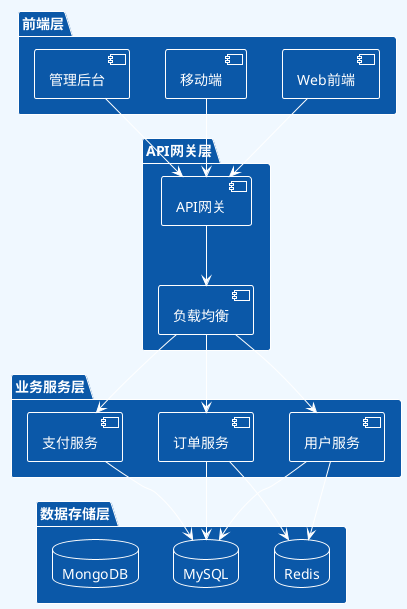
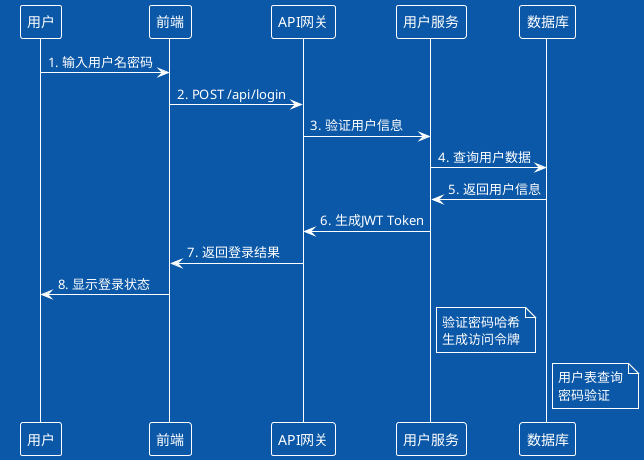
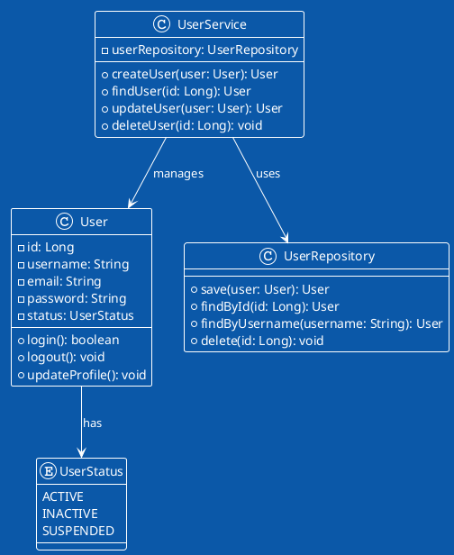
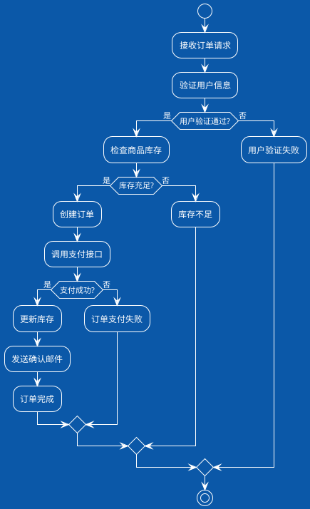
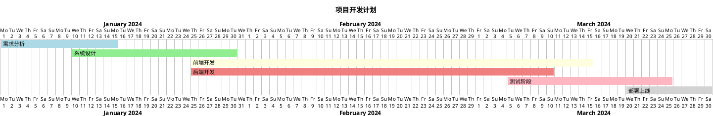
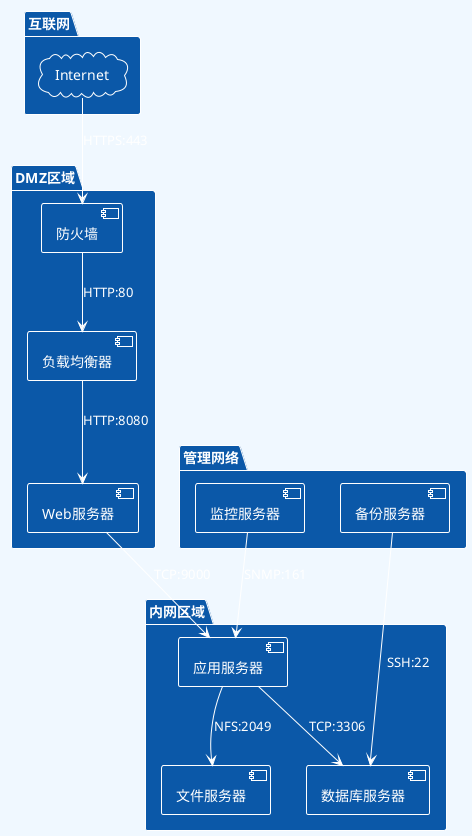
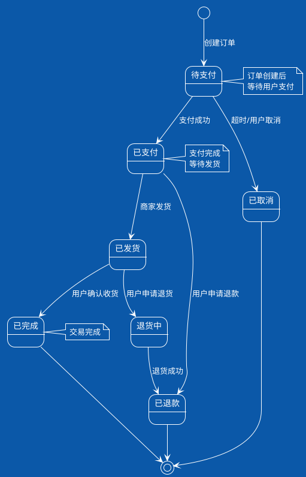
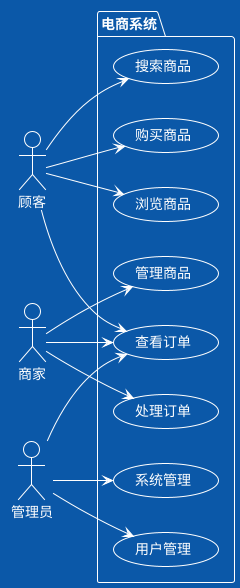
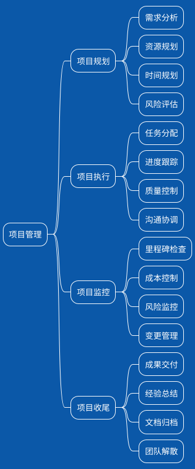

# 图表类型展示

## 📋 目录
- [PlantUML图表类型](#plantuml图表类型)
- [文本图表类型](#文本图表类型)
- [应用场景说明](#应用场景说明)

---

## 🎨 PlantUML图表类型

### 1. 系统架构图



### 2. 时序图



### 3. 类图



### 4. 流程图



### 5. 甘特图



### 6. 网络拓扑图



### 7. 状态图



### 8. 用例图



### 9. 思维导图



---

## 📊 文本图表类型

### 1. ASCII进度条

```
项目进度：
需求分析  ████████████████████ 100% ✅
系统设计  ███████████████████▌ 95%  🔄
前端开发  ████████████▌        60%  🔄
后端开发  ██████████████▌      70%  🔄
测试阶段  ████▌                20%  ⏳
部署上线  ▌                    5%   ⏳
```

### 2. 彩色状态图表

```
服务状态监控：
🟢 Web服务器     ┃ 正常运行 ┃ CPU: 45% ┃ 内存: 60%
🟢 API服务器     ┃ 正常运行 ┃ CPU: 52% ┃ 内存: 48%
🟡 数据库服务器  ┃ 高负载   ┃ CPU: 85% ┃ 内存: 90%
🔴 缓存服务器    ┃ 服务异常 ┃ CPU: --% ┃ 内存: --%
🟢 文件服务器    ┃ 正常运行 ┃ CPU: 25% ┃ 内存: 35%
```

### 3. 数据表格

```
| 指标项目 | 当前值 | 目标值 | 完成率 | 趋势 |
|----------|--------|--------|--------|------|
| 用户注册 | 8,520  | 10,000 | 85.2%  | ↗️   |
| 日活用户 | 12,350 | 15,000 | 82.3%  | ↗️   |
| 订单转化 | 3.2%   | 4.0%   | 80.0%  | ↘️   |
| 平均响应 | 245ms  | 200ms  | 81.7%  | ↘️   |
| 系统可用 | 99.8%  | 99.9%  | 99.9%  | ↗️   |
```

### 4. 层级结构图

```
组织架构
├── 总经理
│   ├── 技术总监
│   │   ├── 后端开发团队
│   │   │   ├── Java开发工程师 (3人)
│   │   │   ├── Python开发工程师 (2人)
│   │   │   └── 数据库工程师 (1人)
│   │   ├── 前端开发团队
│   │   │   ├── React开发工程师 (2人)
│   │   │   ├── Vue开发工程师 (2人)
│   │   │   └── UI/UX设计师 (1人)
│   │   └── 运维团队
│   │       ├── 系统运维工程师 (2人)
│   │       └── DevOps工程师 (1人)
│   ├── 产品总监
│   │   ├── 产品经理 (2人)
│   │   └── 需求分析师 (1人)
│   └── 质量总监
│       ├── 测试工程师 (3人)
│       └── 质量保证专员 (1人)
```

### 5. 时间线图表

```
项目里程碑时间线：

2024年1月 🟨🟨🟨🟨🟨🟨🟨🟨🟨🟨🟨🟨🟨🟨🟨 需求分析阶段
         ├─ 01/05: 项目启动会议
         ├─ 01/15: 需求文档评审
         └─ 01/30: 需求确认完成

2024年2月 🟦🟦🟦🟦🟦🟦🟦🟦🟦🟦🟦🟦🟦🟦🟦 系统设计阶段
         ├─ 02/10: 架构设计评审
         ├─ 02/20: 数据库设计完成
         └─ 02/28: 接口设计完成

2024年3月 🟢🟢🟢🟢🟢🟢🟢🟢🟢🟢🟢🟢🟢🟢🟢 开发实施阶段
         ├─ 03/15: 前端界面完成
         ├─ 03/25: 后端接口完成
         └─ 03/31: 系统集成完成

2024年4月 🟠🟠🟠🟠🟠🟠🟠🟠🟠🟠🟠🟠🟠🟠🟠 测试验收阶段
         ├─ 04/10: 功能测试完成
         ├─ 04/20: 性能测试完成
         └─ 04/30: 用户验收完成

2024年5月 🟣🟣🟣🟣🟣🟣🟣🟣🟣🟣🟣🟣🟣🟣🟣 上线部署阶段
         ├─ 05/05: 生产环境部署
         ├─ 05/10: 数据迁移完成
         └─ 05/15: 正式上线运行
```

---

## 🎯 应用场景说明

### PlantUML图表适用场景：
- ✅ **技术文档** - 系统架构、API设计、数据库设计
- ✅ **项目管理** - 流程图、时序图、甘特图
- ✅ **业务分析** - 用例图、活动图、状态图
- ✅ **团队协作** - 标准化的图表格式，易于版本控制

### 文本图表适用场景：
- ✅ **快速展示** - 简单直观，无需特殊工具
- ✅ **报告总结** - 适合文档、邮件、聊天工具
- ✅ **状态监控** - 实时数据展示，动态更新
- ✅ **移动设备** - 在任何设备上都能正常显示

### 选择建议：

| 需求场景 | 推荐图表类型 | 理由 |
|----------|--------------|------|
| **系统架构设计** | PlantUML架构图 | 专业、标准、可维护 |
| **API接口文档** | PlantUML时序图 | 清晰展示交互流程 |
| **项目进度管理** | PlantUML甘特图 | 专业的项目管理工具 |
| **状态监控报告** | 文本状态图表 | 实时性强、易于自动化 |
| **简单数据展示** | 文本表格图表 | 快速、直观、通用性好 |
| **移动端展示** | Emoji彩色图表 | 视觉友好、兼容性好 |

---

**创建时间**：2024年7月15日  
**更新时间**：2024年7月15日  
**版本号**：v1.0
