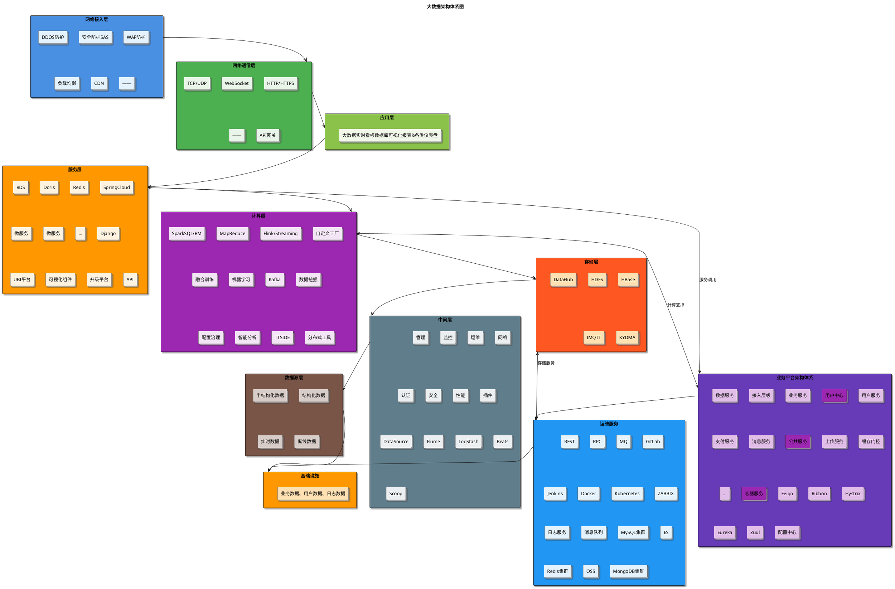

# 大数据架构体系图

## 📋 架构概览

本文档展示了企业级大数据架构体系的完整设计，包含从网络接入到数据存储的全栈技术架构。

## 🏗️ 架构层次设计

### 整体架构图



## ⚠️ PlantUML局限性说明

**PlantUML在复杂架构图方面的局限性：**
- ❌ 自动布局难以精确控制位置
- ❌ 复杂分组和嵌套支持有限
- ❌ 图标和视觉效果相对简单
- ❌ 无法完美还原复杂的UI设计

## 🔧 推荐的替代方案

### 方案1：Draw.io (推荐) ⭐⭐⭐⭐⭐

**优势：**
- ✅ 完全免费，基于Web的绘图工具
- ✅ 支持拖拽布局，可以完美还原截图效果
- ✅ 丰富的图标库和模板
- ✅ 支持导出为多种格式(PNG、SVG、PDF等)
- ✅ 可以嵌入到Markdown文档中

**使用步骤：**
1. 访问 https://app.diagrams.net/
2. 选择"Create New Diagram"
3. 使用拖拽方式重建架构图
4. 导出为SVG格式嵌入文档

### 方案2：Visio (企业级) ⭐⭐⭐⭐

**优势：**
- ✅ 微软企业级绘图工具
- ✅ 丰富的架构图模板
- ✅ 精确的布局控制
- ✅ 专业的视觉效果

**劣势：**
- ❌ 需要付费许可证
- ❌ 仅支持Windows平台

### 方案3：Lucidchart ⭐⭐⭐⭐

**优势：**
- ✅ 专业的在线绘图工具
- ✅ 协作功能强大
- ✅ 丰富的模板库
- ✅ 支持多种导出格式

**劣势：**
- ❌ 免费版功能有限
- ❌ 需要付费订阅

### 方案4：优化的PlantUML版本 ⭐⭐⭐

让我尝试优化PlantUML代码，虽然无法完美还原，但可以改善布局：

```plantuml
@startuml 大数据架构体系图优化版

!define ICONURL https://raw.githubusercontent.com/tupadr3/plantuml-icon-font-sprites/master
!include ICONURL/common.puml
!include ICONURL/font-awesome-5/database.puml
!include ICONURL/font-awesome-5/server.puml
!include ICONURL/font-awesome-5/cloud.puml

skinparam backgroundColor #F8F9FA
skinparam defaultFontName "Microsoft YaHei"
skinparam shadowing false
skinparam packageStyle rectangle
skinparam roundcorner 8

title **大数据架构体系图** (PlantUML优化版)

!$BLUE = "#4A90E2"
!$GREEN = "#4CAF50"
!$ORANGE = "#FF9800"
!$PURPLE = "#9C27B0"
!$RED = "#FF5722"
!$GRAY = "#607D8B"

' 左侧主架构
rectangle "大数据架构体系" as main_arch {
  
  ' 网络接入层
  package "网络接入层" <<$BLUE>> {
    rectangle "DDOS\n防护" as ddos #E3F2FD
    rectangle "安全防护\nSAS" as sas #E3F2FD
    rectangle "WAF\n防护" as waf #E3F2FD
    rectangle "负载\n均衡" as lb #E3F2FD
    rectangle "CDN" as cdn #E3F2FD
    
    ddos -[hidden]right- sas
    sas -[hidden]right- waf
    waf -[hidden]right- lb
    lb -[hidden]right- cdn
  }
  
  ' 网络通信层
  package "网络通信层" <<$GREEN>> {
    rectangle "WebSocket" as ws #E8F5E8
    rectangle "HTTP/HTTPS" as http #E8F5E8
    rectangle "TCP/UDP" as tcp #E8F5E8
    rectangle "API网关" as api_gw #E8F5E8
    
    ws -[hidden]right- http
    http -[hidden]right- tcp
    tcp -[hidden]right- api_gw
  }
  
  ' 应用层
  package "应用层" <<$GREEN>> {
    rectangle "大数据实时看板\n数据库可视化报表\n各类仪表盘" as dashboard #F1F8E9
  }
  
  ' 服务层
  package "服务层" <<$ORANGE>> {
    rectangle "RDS" as rds #FFF3E0
    rectangle "Doris" as doris #FFF3E0
    rectangle "Redis" as redis #FFF3E0
    rectangle "SpringCloud" as sc #FFF3E0
    rectangle "微服务" as ms1 #FFF3E0
    rectangle "微服务" as ms2 #FFF3E0
    rectangle "Django" as django #FFF3E0
    rectangle "UBI平台" as ubi #FFF3E0
    rectangle "升级平台" as upgrade #FFF3E0
    rectangle "API" as api #FFF3E0
    
    rds -[hidden]right- doris
    doris -[hidden]right- redis
    redis -[hidden]right- sc
    sc -[hidden]right- ms1
    ms1 -[hidden]right- ms2
    ms2 -[hidden]down- django
    django -[hidden]right- ubi
    ubi -[hidden]right- upgrade
    upgrade -[hidden]right- api
  }
  
  ' 计算层
  package "计算层" <<$PURPLE>> {
    rectangle "SparkSQL/RM" as spark #F3E5F5
    rectangle "MapReduce" as mr #F3E5F5
    rectangle "Flink/Streaming" as flink #F3E5F5
    rectangle "机器学习" as ml #F3E5F5
    rectangle "Kafka" as kafka #F3E5F5
    rectangle "数据挖掘" as dm #F3E5F5
    
    spark -[hidden]right- mr
    mr -[hidden]right- flink
    flink -[hidden]down- ml
    ml -[hidden]right- kafka
    kafka -[hidden]right- dm
  }
  
  ' 存储层
  package "存储层" <<$RED>> {
    rectangle "HDFS" as hdfs #FFEBEE
    rectangle "HBase" as hbase #FFEBEE
    rectangle "DataHub" as dh #FFEBEE
    rectangle "IMQTT" as imqtt #FFEBEE
    rectangle "KYDMA" as kydma #FFEBEE
    
    hdfs -[hidden]right- hbase
    hbase -[hidden]right- dh
    dh -[hidden]right- imqtt
    imqtt -[hidden]right- kydma
  }
  
  ' 中间层
  package "中间层" <<$GRAY>> {
    rectangle "DataSource" as ds #ECEFF1
    rectangle "Flume" as flume #ECEFF1
    rectangle "LogStash" as ls #ECEFF1
    rectangle "Beats" as beats #ECEFF1
    rectangle "Scoop" as scoop #ECEFF1
    
    ds -[hidden]right- flume
    flume -[hidden]right- ls
    ls -[hidden]right- beats
    beats -[hidden]right- scoop
  }
  
  ' 数据源层
  package "数据源层" <<$GRAY>> {
    rectangle "半结构化数据" as semi #D7CCC8
    rectangle "结构化数据" as struct #D7CCC8
    rectangle "实时数据" as real #D7CCC8
    rectangle "离线数据" as offline #D7CCC8
    
    semi -[hidden]right- struct
    struct -[hidden]right- real
    real -[hidden]right- offline
  }
}

' 右侧业务平台
rectangle "业务平台架构体系" as business_platform {
  package "接入层级" <<$PURPLE>> {
    rectangle "用户中心" as uc #E1BEE7
    rectangle "公共服务" as ps #E1BEE7
    rectangle "容器服务" as cs #E1BEE7
  }
}

' 右侧工具栏
rectangle "运维服务" as devops {
  rectangle "REST/RPC/MQ" as protocols #E3F2FD
  rectangle "GitLab/Jenkins" as ci #E3F2FD
  rectangle "Docker/K8s" as containers #E3F2FD
  rectangle "监控/日志" as monitoring #E3F2FD
  rectangle "存储集群" as storage #E3F2FD
}

' 底层基础设施
package "基础设施" <<$ORANGE>> {
  rectangle "业务数据、用户数据、日志数据" as infra_data #FFE0B2
}

' 垂直布局强制
ddos -[hidden]down- ws
ws -[hidden]down- dashboard
dashboard -[hidden]down- rds
rds -[hidden]down- spark
spark -[hidden]down- hdfs
hdfs -[hidden]down- ds
ds -[hidden]down- semi
semi -[hidden]down- infra_data

' 水平布局
main_arch -[hidden]right- business_platform
business_platform -[hidden]right- devops

@enduml
```

## ⚠️ PlantUML局限性说明

**PlantUML在复杂架构图方面的局限性：**
- ❌ 自动布局难以精确控制位置
- ❌ 复杂分组和嵌套支持有限
- ❌ 图标和视觉效果相对简单
- ❌ 无法完美还原复杂的UI设计

## 🔧 推荐的替代方案

### 方案1：Draw.io (推荐) ⭐⭐⭐⭐⭐

**优势：**
- ✅ 完全免费，基于Web的绘图工具
- ✅ 支持拖拽布局，可以完美还原截图效果
- ✅ 丰富的图标库和模板
- ✅ 支持导出为多种格式(PNG、SVG、PDF等)
- ✅ 可以嵌入到Markdown文档中

**使用步骤：**
1. 访问 https://app.diagrams.net/
2. 选择"Create New Diagram"
3. 使用拖拽方式重建架构图
4. 导出为SVG格式嵌入文档

### 方案2：Visio (企业级) ⭐⭐⭐⭐

**优势：**
- ✅ 微软企业级绘图工具
- ✅ 丰富的架构图模板
- ✅ 精确的布局控制
- ✅ 专业的视觉效果

**劣势：**
- ❌ 需要付费许可证
- ❌ 仅支持Windows平台

### 方案3：Lucidchart ⭐⭐⭐⭐

**优势：**
- ✅ 专业的在线绘图工具
- ✅ 协作功能强大
- ✅ 丰富的模板库
- ✅ 支持多种导出格式

**劣势：**
- ❌ 免费版功能有限
- ❌ 需要付费订阅

### 方案4：优化的PlantUML版本 ⭐⭐⭐

让我尝试优化PlantUML代码，虽然无法完美还原，但可以改善布局：

```plantuml
@startuml 大数据架构体系图优化版

!define ICONURL https://raw.githubusercontent.com/tupadr3/plantuml-icon-font-sprites/master
!include ICONURL/common.puml
!include ICONURL/font-awesome-5/database.puml
!include ICONURL/font-awesome-5/server.puml
!include ICONURL/font-awesome-5/cloud.puml

skinparam backgroundColor #F8F9FA
skinparam defaultFontName "Microsoft YaHei"
skinparam shadowing false
skinparam packageStyle rectangle
skinparam roundcorner 8

title **大数据架构体系图** (PlantUML优化版)

!$BLUE = "#4A90E2"
!$GREEN = "#4CAF50"
!$ORANGE = "#FF9800"
!$PURPLE = "#9C27B0"
!$RED = "#FF5722"
!$GRAY = "#607D8B"

' 左侧主架构
rectangle "大数据架构体系" as main_arch {
  
  ' 网络接入层
  package "网络接入层" <<$BLUE>> {
    rectangle "DDOS\n防护" as ddos #E3F2FD
    rectangle "安全防护\nSAS" as sas #E3F2FD
    rectangle "WAF\n防护" as waf #E3F2FD
    rectangle "负载\n均衡" as lb #E3F2FD
    rectangle "CDN" as cdn #E3F2FD
    
    ddos -[hidden]right- sas
    sas -[hidden]right- waf
    waf -[hidden]right- lb
    lb -[hidden]right- cdn
  }
  
  ' 网络通信层
  package "网络通信层" <<$GREEN>> {
    rectangle "WebSocket" as ws #E8F5E8
    rectangle "HTTP/HTTPS" as http #E8F5E8
    rectangle "TCP/UDP" as tcp #E8F5E8
    rectangle "API网关" as api_gw #E8F5E8
    
    ws -[hidden]right- http
    http -[hidden]right- tcp
    tcp -[hidden]right- api_gw
  }
  
  ' 应用层
  package "应用层" <<$GREEN>> {
    rectangle "大数据实时看板\n数据库可视化报表\n各类仪表盘" as dashboard #F1F8E9
  }
  
  ' 服务层
  package "服务层" <<$ORANGE>> {
    rectangle "RDS" as rds #FFF3E0
    rectangle "Doris" as doris #FFF3E0
    rectangle "Redis" as redis #FFF3E0
    rectangle "SpringCloud" as sc #FFF3E0
    rectangle "微服务" as ms1 #FFF3E0
    rectangle "微服务" as ms2 #FFF3E0
    rectangle "Django" as django #FFF3E0
    rectangle "UBI平台" as ubi #FFF3E0
    rectangle "升级平台" as upgrade #FFF3E0
    rectangle "API" as api #FFF3E0
    
    rds -[hidden]right- doris
    doris -[hidden]right- redis
    redis -[hidden]right- sc
    sc -[hidden]right- ms1
    ms1 -[hidden]right- ms2
    ms2 -[hidden]down- django
    django -[hidden]right- ubi
    ubi -[hidden]right- upgrade
    upgrade -[hidden]right- api
  }
  
  ' 计算层
  package "计算层" <<$PURPLE>> {
    rectangle "SparkSQL/RM" as spark #F3E5F5
    rectangle "MapReduce" as mr #F3E5F5
    rectangle "Flink/Streaming" as flink #F3E5F5
    rectangle "机器学习" as ml #F3E5F5
    rectangle "Kafka" as kafka #F3E5F5
    rectangle "数据挖掘" as dm #F3E5F5
    
    spark -[hidden]right- mr
    mr -[hidden]right- flink
    flink -[hidden]down- ml
    ml -[hidden]right- kafka
    kafka -[hidden]right- dm
  }
  
  ' 存储层
  package "存储层" <<$RED>> {
    rectangle "HDFS" as hdfs #FFEBEE
    rectangle "HBase" as hbase #FFEBEE
    rectangle "DataHub" as dh #FFEBEE
    rectangle "IMQTT" as imqtt #FFEBEE
    rectangle "KYDMA" as kydma #FFEBEE
    
    hdfs -[hidden]right- hbase
    hbase -[hidden]right- dh
    dh -[hidden]right- imqtt
    imqtt -[hidden]right- kydma
  }
  
  ' 中间层
  package "中间层" <<$GRAY>> {
    rectangle "DataSource" as ds #ECEFF1
    rectangle "Flume" as flume #ECEFF1
    rectangle "LogStash" as ls #ECEFF1
    rectangle "Beats" as beats #ECEFF1
    rectangle "Scoop" as scoop #ECEFF1
    
    ds -[hidden]right- flume
    flume -[hidden]right- ls
    ls -[hidden]right- beats
    beats -[hidden]right- scoop
  }
  
  ' 数据源层
  package "数据源层" <<$GRAY>> {
    rectangle "半结构化数据" as semi #D7CCC8
    rectangle "结构化数据" as struct #D7CCC8
    rectangle "实时数据" as real #D7CCC8
    rectangle "离线数据" as offline #D7CCC8
    
    semi -[hidden]right- struct
    struct -[hidden]right- real
    real -[hidden]right- offline
  }
}

' 右侧业务平台
rectangle "业务平台架构体系" as business_platform {
  package "接入层级" <<$PURPLE>> {
    rectangle "用户中心" as uc #E1BEE7
    rectangle "公共服务" as ps #E1BEE7
    rectangle "容器服务" as cs #E1BEE7
  }
}

' 右侧工具栏
rectangle "运维服务" as devops {
  rectangle "REST/RPC/MQ" as protocols #E3F2FD
  rectangle "GitLab/Jenkins" as ci #E3F2FD
  rectangle "Docker/K8s" as containers #E3F2FD
  rectangle "监控/日志" as monitoring #E3F2FD
  rectangle "存储集群" as storage #E3F2FD
}

' 底层基础设施
package "基础设施" <<$ORANGE>> {
  rectangle "业务数据、用户数据、日志数据" as infra_data #FFE0B2
}

' 垂直布局强制
ddos -[hidden]down- ws
ws -[hidden]down- dashboard
dashboard -[hidden]down- rds
rds -[hidden]down- spark
spark -[hidden]down- hdfs
hdfs -[hidden]down- ds
ds -[hidden]down- semi
semi -[hidden]down- infra_data

' 水平布局
main_arch -[hidden]right- business_platform
business_platform -[hidden]right- devops

@enduml
```

## 📋 Draw.io详细操作指南

### 🚀 快速开始

1. **打开Draw.io**
   - 访问 https://app.diagrams.net/
   - 点击"Create New Diagram"
   - 选择"Blank Diagram"

2. **设置画布**
   - 选择合适的画布大小
   - 设置背景色为白色
   - 启用网格辅助线

### 🎨 重建架构图步骤

#### 第一步：创建主体框架
```
1. 从左侧面板拖拽"Rectangle"创建各层框架
2. 设置颜色：
   - 网络接入层：#4A90E2 (蓝色)
   - 网络通信层：#4CAF50 (绿色)
   - 应用层：#8BC34A (浅绿)
   - 服务层：#FF9800 (橙色)
   - 计算层：#9C27B0 (紫色)
   - 存储层：#FF5722 (红色)
   - 中间层：#607D8B (灰色)
   - 数据源层：#795548 (棕色)
```

#### 第二步：添加组件
```
1. 在每层内添加具体组件
2. 使用"Rectangle"创建组件框
3. 调整大小和位置
4. 添加文字标签
5. 设置合适的颜色
```

#### 第三步：添加右侧模块
```
1. 创建"业务平台架构体系"模块
2. 添加用户中心、公共服务、容器服务
3. 创建运维服务工具栏
4. 添加各种技术组件
```

#### 第四步：添加连接线
```
1. 使用"Arrow"工具连接相关组件
2. 设置实线和虚线
3. 调整线条样式和颜色
4. 添加标签说明
```

#### 第五步：优化细节
```
1. 调整字体大小和样式
2. 对齐所有组件
3. 统一间距和布局
4. 添加图标和装饰
```

### 💡 Draw.io使用技巧

**快捷键：**
- `Ctrl + D`: 复制粘贴
- `Ctrl + G`: 组合对象
- `Ctrl + Shift + G`: 取消组合
- `Alt + 拖拽`: 复制对象
- `Shift + 拖拽`: 约束移动方向

**布局技巧：**
- 使用"Arrange"菜单进行对齐
- 使用"Layout"菜单自动排列
- 使用图层管理复杂图形
- 使用参考线精确定位

**样式技巧：**
- 复制格式：选中对象 → 右键 → "Copy Style"
- 批量修改：选中多个对象 → 统一修改属性
- 创建样式库：保存常用样式为模板

### 📤 导出和使用

1. **导出SVG格式**
   - File → Export as → SVG
   - 勾选"Include a copy of my diagram"
   - 保存到项目的images文件夹

2. **嵌入到Markdown**
   ```markdown
   
   ```

3. **导出PNG格式**
   - File → Export as → PNG
   - 设置合适的分辨率(建议300 DPI)
   - 适合在文档中使用

### 🔄 版本管理

**保存在云端：**
- 可以保存到Google Drive、OneDrive等
- 支持实时协作编辑
- 自动版本历史记录

**本地保存：**
- File → Save as → 选择.drawio格式
- 可以随时重新编辑
- 建议定期备份

---

## 🆚 方案对比总结

| 方案 | 视觉效果 | 操作难度 | 成本 | 协作性 | 维护性 |
|------|----------|----------|------|--------|--------|
| **Draw.io** | ⭐⭐⭐⭐⭐ | ⭐⭐⭐ | 免费 | ⭐⭐⭐⭐ | ⭐⭐⭐⭐⭐ |
| **Visio** | ⭐⭐⭐⭐⭐ | ⭐⭐⭐⭐ | 付费 | ⭐⭐⭐ | ⭐⭐⭐⭐ |
| **Lucidchart** | ⭐⭐⭐⭐⭐ | ⭐⭐⭐⭐ | 付费 | ⭐⭐⭐⭐⭐ | ⭐⭐⭐⭐ |
| **PlantUML** | ⭐⭐⭐ | ⭐⭐⭐⭐ | 免费 | ⭐⭐⭐⭐⭐ | ⭐⭐⭐⭐⭐ |

**最终推荐：Draw.io** 🏆
- 完全免费且功能强大
- 可以完美还原截图效果
- 支持多种导出格式
- 便于团队协作和维护

## 🎯 最佳实践建议

**对于您的需求，我强烈推荐以下方案：**

### ✅ 推荐方案：Draw.io + Markdown

1. **使用Draw.io绘制原图**
   - 访问 https://app.diagrams.net/
   - 完全按照截图重建架构图
   - 导出为SVG格式

2. **在Markdown中引用**
   ```markdown
   
   ```

3. **优势**
   - 完美还原截图效果
   - 支持矢量图形，缩放不失真
   - 可以随时编辑和更新

## 🎯 架构层次详解

### 1. 网络接入层
- **DDOS防护**: 分布式拒绝服务攻击防护
- **安全防护SAS**: 安全访问服务
- **WAF防护**: Web应用防火墙
- **负载均衡**: 流量分发和负载均衡
- **CDN**: 内容分发网络

### 2. 网络通信层
- **WebSocket**: 实时双向通信协议
- **HTTP/HTTPS**: 标准Web通信协议
- **TCP/UDP**: 传输层协议
- **API网关**: 统一API管理和路由

### 3. 应用层
- **可视化看板**: 大数据实时看板
- **数据库可视化**: 数据库状态和性能监控
- **报表系统**: 各类业务报表
- **仪表盘**: 业务指标展示

### 4. 服务层
- **数据存储**: RDS、Doris、Redis
- **微服务架构**: SpringCloud微服务生态
- **数据处理**: Django、UBI平台
- **接口服务**: 升级平台、API服务

### 5. 计算层
- **批处理**: SparkSQL、MapReduce
- **实时计算**: Flink、Streaming
- **机器学习**: ML平台、数据挖掘
- **消息队列**: Kafka消息中间件

### 6. 存储层
- **分布式文件系统**: HDFS
- **NoSQL数据库**: HBase
- **数据湖**: DataHub
- **消息队列**: IMQTT、KYDMA

### 7. 中间层
- **系统管理**: 管理、监控、运维
- **网络安全**: 认证、安全、性能
- **数据采集**: DataSource、Flume、LogStash

### 8. 数据源层
- **半结构化数据**: JSON、XML等
- **结构化数据**: 关系型数据库
- **实时数据**: 流式数据
- **离线数据**: 批量数据

## 🚀 业务平台架构

### 接入层级
- **接入层级**: 统一接入管理
- **业务服务**: 业务逻辑处理

### 用户中心
- **用户服务**: 用户管理和认证
- **数据服务**: 数据统一服务
- **支付服务**: 支付处理
- **消息服务**: 消息推送

### 公共服务
- **上传服务**: 文件上传处理
- **缓存门控**: 缓存管理

### 容器服务
- **Feign**: 服务间调用
- **Ribbon**: 负载均衡
- **Hystrix**: 熔断器
- **Eureka**: 服务注册发现
- **Zuul**: API网关
- **配置中心**: 统一配置管理

## 🛠️ 运维服务工具

### 通信协议
- **REST**: RESTful API
- **RPC**: 远程过程调用
- **MQ**: 消息队列

### 持续集成
- **GitLab**: 代码管理
- **Jenkins**: 持续集成

### 容器化
- **Docker**: 容器化平台
- **Kubernetes**: 容器编排

### 监控运维
- **ZABBIX**: 系统监控
- **日志服务**: 日志收集分析

### 数据存储
- **MySQL集群**: 关系型数据库
- **Redis集群**: 缓存数据库
- **ES**: 搜索引擎
- **MongoDB集群**: 文档数据库
- **OSS**: 对象存储服务

## 📊 技术选型说明

### 大数据处理
- **Apache Spark**: 大数据统一分析引擎
- **Apache Flink**: 实时计算引擎
- **Apache Kafka**: 分布式流处理平台
- **Apache Hadoop**: 分布式存储和计算框架

### 微服务架构
- **Spring Cloud**: 微服务开发框架
- **Docker + Kubernetes**: 容器化部署
- **Netflix OSS**: 微服务治理组件

### 数据存储
- **MySQL**: 事务型数据存储
- **Redis**: 高性能缓存
- **Elasticsearch**: 全文搜索
- **MongoDB**: 文档型数据库

## 🎯 架构优势

### 1. 分层解耦
- 清晰的分层架构设计
- 各层职责明确，便于维护
- 支持独立扩展和升级

### 2. 高可用性
- 多层次的容错机制
- 负载均衡和故障转移
- 实时监控和告警

### 3. 弹性扩展
- 基于容器的弹性扩展
- 微服务架构支持水平扩展
- 云原生架构设计

### 4. 安全可靠
- 多层次安全防护
- 数据加密和访问控制
- 完善的审计和监控

---

**文档版本**: v1.0  
**创建时间**: 2025年7月18日  
**作者**: 架构设计团队  
**适用范围**: 企业级大数据平台架构设计参考
