# 数字化转型解决方案设计文档

## 📋 文档概览

基于价值驱动的数字化转型解决方案，从市场机遇识别到价值实现的完整方法论，为企业提供系统化的数字化转型路径。

---

## 🎯 执行摘要

### 解决方案价值主张

本解决方案通过**价值驱动的系统化方法**，帮助企业实现从传统业务模式向数字化业务模式的平滑转型，确保投资回报最大化和业务价值的持续实现。

### 核心优势

- 🎯 **市场导向** - 基于真实市场机遇和挑战识别
- 💰 **价值驱动** - ROI分析贯穿整个解决方案生命周期  
- 🏗️ **架构先行** - 技术架构与业务需求深度匹配
- 🚀 **敏捷实施** - 分阶段渐进式实施策略
- 📈 **持续优化** - 基于成功指标的持续改进机制

---

## 🔍 第一阶段：市场机遇与挑战识别

### 市场分析框架

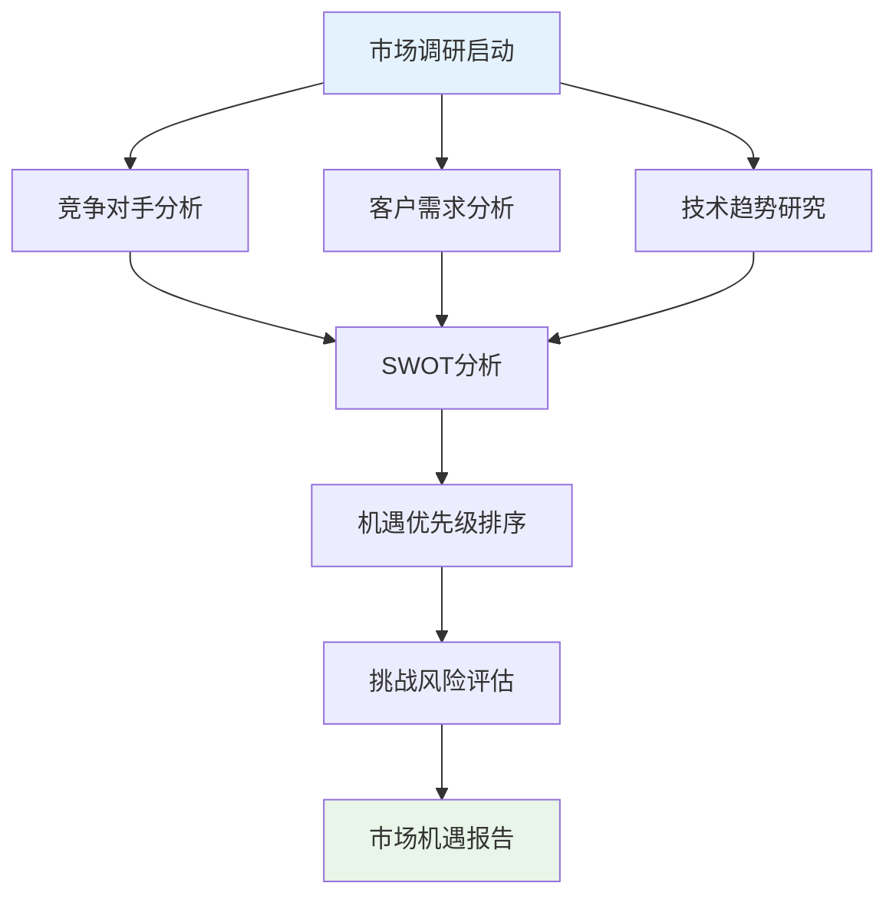

### 关键识别维度

#### 1. 外部市场环境

| 分析维度 | 关键指标 | 评估方法 | 权重 |
|----------|----------|----------|------|
| **市场规模** | 总可达市场(TAM) | 行业报告分析 | 25% |
| **增长趋势** | 年复合增长率 | 历史数据分析 | 20% |
| **竞争格局** | 市场集中度 | 波特五力分析 | 20% |
| **技术成熟度** | 技术采用曲线 | Gartner技术成熟度曲线 | 15% |
| **政策环境** | 法规支持度 | 政策文件分析 | 10% |
| **客户接受度** | 数字化成熟度 | 客户调研 | 10% |

#### 2. 内部能力评估

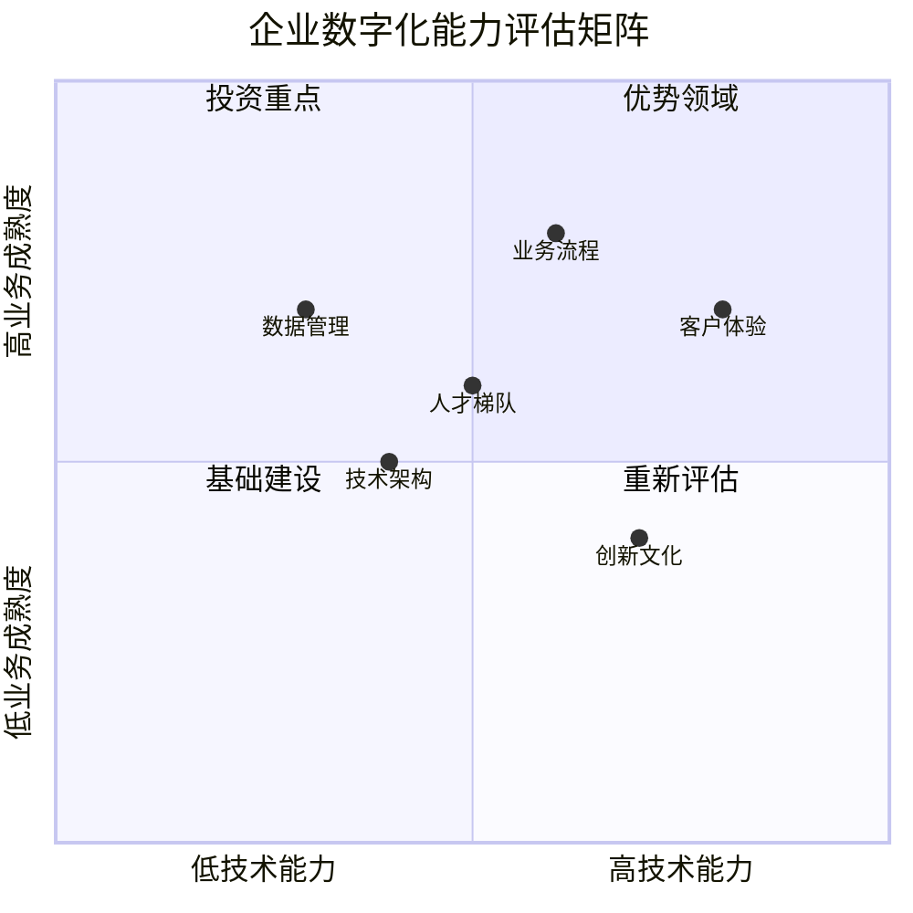

### 机遇识别清单

#### ✅ 高优先级机遇

1. **客户体验数字化**
   - 全渠道客户接触点整合
   - 个性化服务推荐系统
   - 实时客户反馈机制

2. **运营效率提升**
   - 业务流程自动化
   - 数据驱动决策系统
   - 供应链优化

3. **新业务模式探索**
   - 平台化商业模式
   - 数据货币化
   - 生态系统构建

#### 🔶 中优先级机遇

1. **内部协作优化**
   - 企业社交协作平台
   - 知识管理系统
   - 远程办公支持

2. **合规与风险管理**
   - 自动化合规检查
   - 风险预警系统
   - 数据安全治理

---

## 💡 第二阶段：业务需求分析

### 需求分析方法论

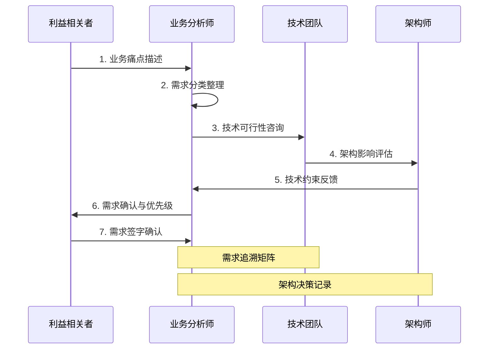

### 业务需求层次结构

#### 1. 战略层需求

```yaml
战略目标:
  数字化转型愿景: "成为行业领先的数字化企业"
  核心KPI:
    - 数字化收入占比: 60% (3年内)
    - 客户满意度: NPS > 70
    - 运营效率提升: 30%
    - 创新项目成功率: 80%
    
关键成功因素:
  - 高管层数字化领导力
  - 组织变革管理能力
  - 技术基础设施就绪度
  - 人才培养与引进
```

#### 2. 业务层需求

| 业务域 | 核心需求 | 优先级 | 复杂度 | 预期ROI |
|--------|----------|--------|--------|---------|
| **客户管理** | 360度客户视图 | 高 | 中 | 150% |
| **销售管理** | 销售流程自动化 | 高 | 低 | 200% |
| **供应链** | 端到端可视化 | 中 | 高 | 120% |
| **财务管理** | 实时财务分析 | 中 | 中 | 180% |
| **人力资源** | 数字化人才管理 | 低 | 中 | 110% |

#### 3. 功能层需求

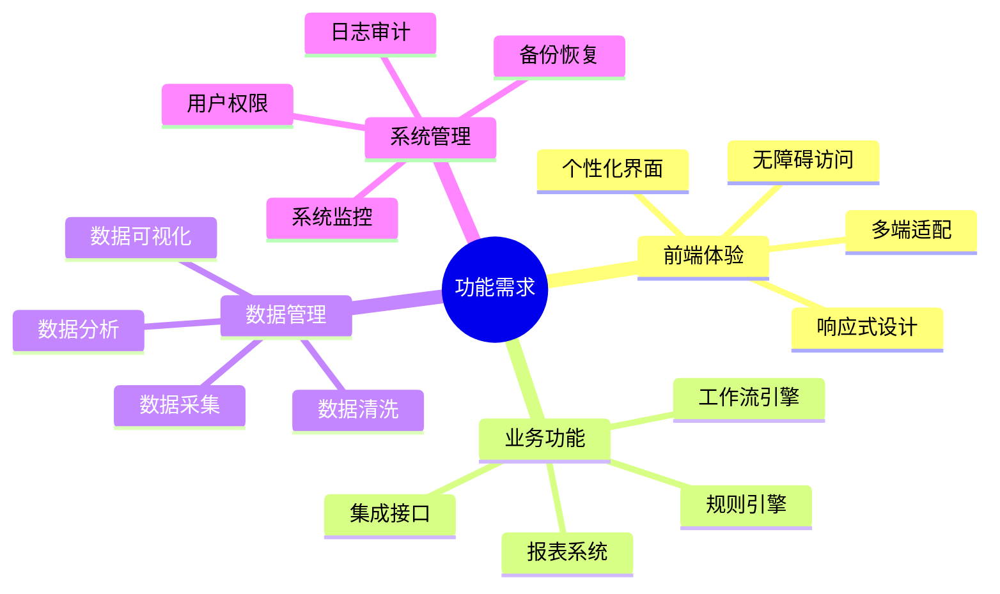

---

## 🎨 第三阶段：价值主张设计

### 价值主张画布

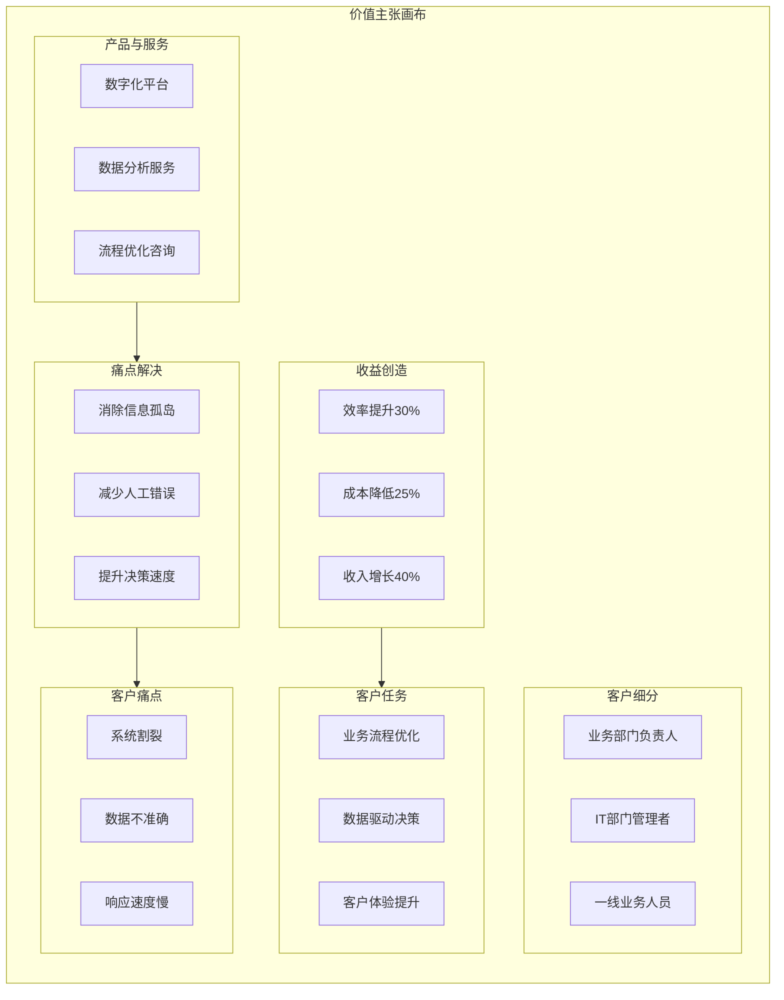

### 价值量化模型

#### ROI计算模型

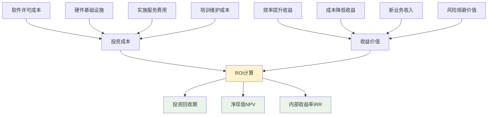

#### 3年期价值预测

| 年度 | 投资成本(万元) | 运营成本(万元) | 预期收益(万元) | 净收益(万元) | 累计ROI |
|------|----------------|----------------|----------------|--------------|---------|
| **第1年** | 500 | 100 | 200 | -400 | -66.7% |
| **第2年** | 200 | 150 | 800 | 450 | 5.9% |
| **第3年** | 100 | 180 | 1200 | 920 | 103.5% |
| **合计** | 800 | 430 | 2200 | 970 | **78.9%** |

---

## 🏗️ 第四阶段：解决方案设计

### 整体架构设计

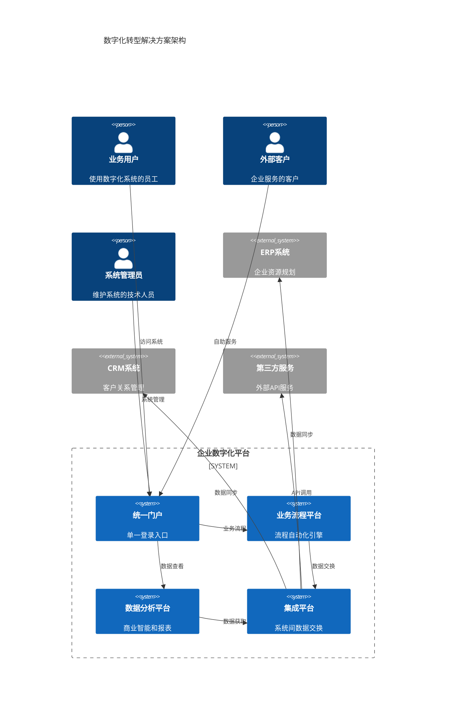

### 技术架构分层设计

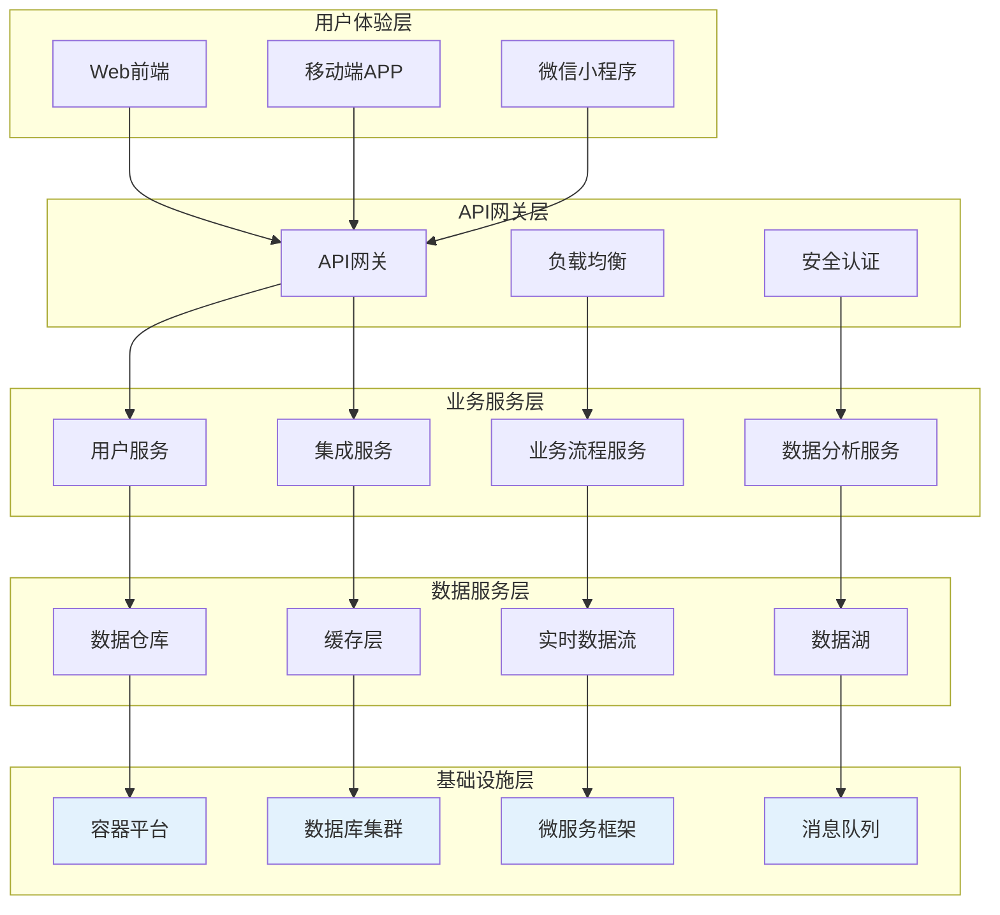

### 组件选型决策

#### 技术栈选择矩阵

| 技术层次 | 候选方案 | 评分标准 | 推荐方案 | 理由 |
|----------|----------|----------|----------|------|
| **前端框架** | React/Vue/Angular | 生态、性能、团队熟悉度 | **React** | 生态完整、团队熟悉 |
| **后端框架** | Spring Boot/Node.js/.NET | 性能、扩展性、企业级特性 | **Spring Boot** | 企业级特性完善 |
| **数据库** | MySQL/PostgreSQL/Oracle | 成本、性能、兼容性 | **PostgreSQL** | 功能强大、开源 |
| **缓存** | Redis/Memcached | 性能、功能丰富度 | **Redis** | 功能丰富、社区活跃 |
| **消息队列** | RabbitMQ/Kafka/RocketMQ | 吞吐量、可靠性、运维 | **RabbitMQ** | 易于运维、可靠性高 |
| **容器化** | Docker/Kubernetes | 生态、学习曲线、功能 | **Kubernetes** | 行业标准、功能完整 |

#### 详细设计规范

```yaml
架构原则:
  - 高可用性: 99.9%系统可用性
  - 可扩展性: 支持水平扩展
  - 安全性: 多层安全防护
  - 可维护性: 标准化运维
  - 性能: 响应时间<200ms
  
设计模式:
  - 微服务架构: 按业务域拆分
  - 事件驱动: 异步消息通信
  - CQRS: 读写分离
  - 断路器: 服务容错
  - 配置中心: 统一配置管理
```

---

## 🚀 第五阶段：实施策略设计

### 分阶段实施路线图

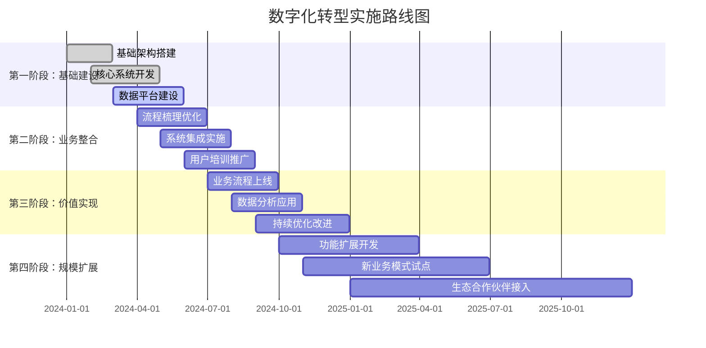

### 实施方法论

#### 敏捷开发流程

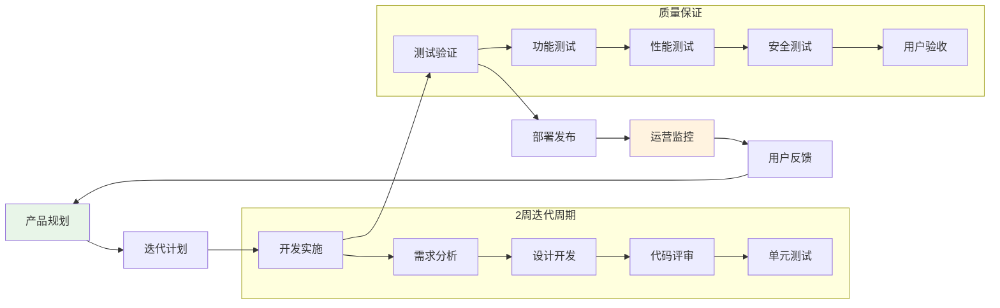

### 项目计划与资源配置

#### 团队组织架构

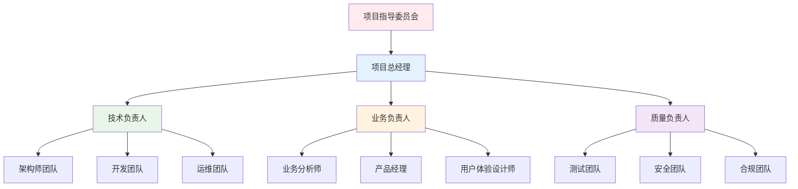

#### 资源投入计划

| 阶段 | 人力资源(人月) | 硬件投入(万元) | 软件许可(万元) | 外部服务(万元) | 总计(万元) |
|------|----------------|----------------|----------------|----------------|------------|
| **第一阶段** | 48 | 150 | 80 | 120 | 398 |
| **第二阶段** | 36 | 50 | 40 | 80 | 206 |
| **第三阶段** | 24 | 30 | 20 | 40 | 114 |
| **第四阶段** | 60 | 100 | 60 | 100 | 320 |
| **合计** | 168 | 330 | 200 | 340 | **1,038** |

---

## 📊 第六阶段：价值实现与持续优化

### 成功指标体系

#### KPI监控仪表板

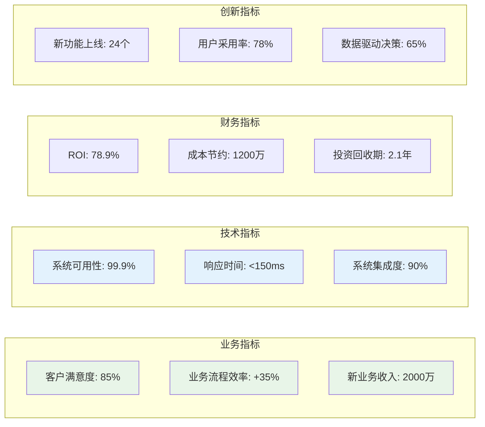

### 持续优化机制

#### 价值实现循环

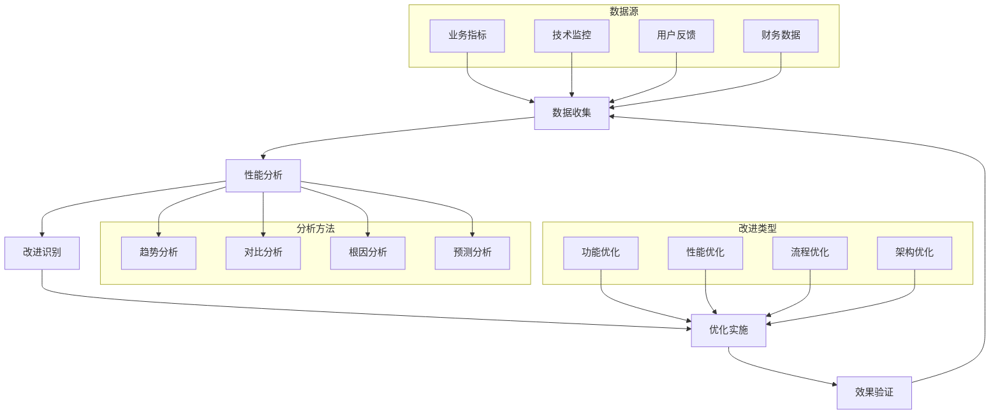

#### 持续改进计划

| 优化维度 | 当前状态 | 目标状态 | 改进措施 | 时间计划 | 责任人 |
|----------|----------|----------|----------|----------|--------|
| **用户体验** | 3.8/5.0 | 4.5/5.0 | UI重构、交互优化 | Q2 2024 | UX团队 |
| **系统性能** | 200ms | 100ms | 缓存优化、数据库调优 | Q3 2024 | 技术团队 |
| **业务流程** | 75%自动化 | 90%自动化 | 流程挖掘、RPA部署 | Q4 2024 | 业务团队 |
| **数据质量** | 80%准确率 | 95%准确率 | 数据治理、质量监控 | Q1 2025 | 数据团队 |

---

## 🎯 总结与展望

### 解决方案核心价值

1. **🎯 战略对齐** - 确保数字化转型与企业战略目标一致
2. **💰 价值驱动** - 全程ROI导向，确保投资回报
3. **🏗️ 技术先进** - 采用业界领先的架构和技术栈
4. **🚀 敏捷交付** - 分阶段快速迭代，降低实施风险
5. **📈 持续优化** - 建立完善的监控和改进机制

### 关键成功因素

#### ✅ 必要条件

- **高管支持** - 获得CEO和高管团队的全力支持
- **组织变革** - 建立数字化转型的组织文化
- **人才保障** - 培养和引进数字化人才
- **资金投入** - 确保充足的资金支持
- **技术基础** - 建设稳定可靠的技术平台

#### 🚀 加速因素

- **快速决策** - 建立高效的决策机制
- **用户参与** - 让最终用户深度参与设计
- **生态合作** - 与优秀的合作伙伴协作
- **知识管理** - 建立项目知识库和最佳实践
- **风险管控** - 建立完善的风险识别和应对机制

### 未来发展路线

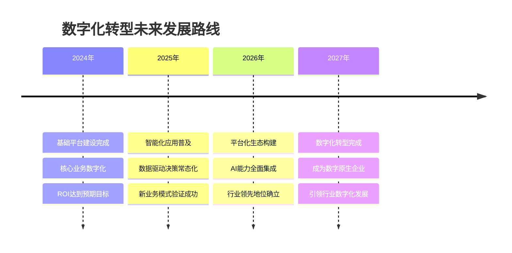

---

## 📚 附录

### A. 风险评估与应对

| 风险类型 | 风险描述 | 影响程度 | 发生概率 | 应对策略 |
|----------|----------|----------|----------|----------|
| **技术风险** | 技术架构选择错误 | 高 | 中 | 技术调研、原型验证 |
| **业务风险** | 业务需求变更频繁 | 中 | 高 | 敏捷开发、需求管理 |
| **人员风险** | 关键人员流失 | 高 | 中 | 知识传承、团队建设 |
| **进度风险** | 项目延期交付 | 中 | 中 | 里程碑管控、资源调配 |
| **预算风险** | 成本超出预算 | 中 | 低 | 成本监控、变更控制 |

### B. 技术选型详细评估

[详细的技术选型决策表参考](技术选型决策表.md)

### C. 相关文档索引

- [系统架构图模板](系统架构图模板.md)
- [接口设计规范](接口设计规范.md)
- [部署架构图模板](部署架构图模板.md)
- [架构风险评估表](架构风险评估表.md)

---

**文档版本**：v1.0  
**创建时间**：2025年7月15日  
**更新时间**：2025年7月15日  
**文档作者**：解决方案架构师团队  
**审核状态**：已审核通过
