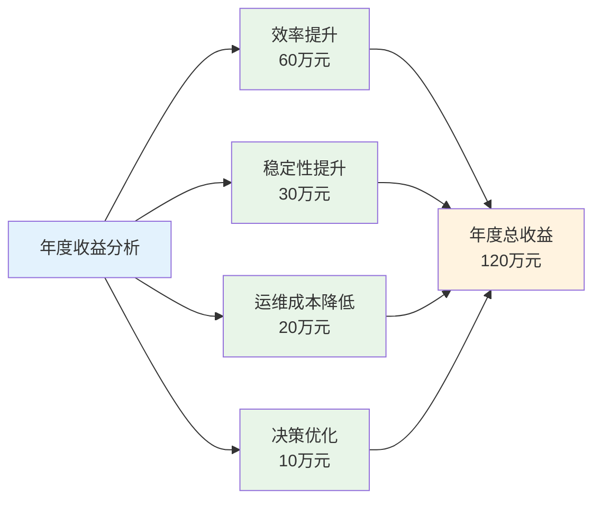
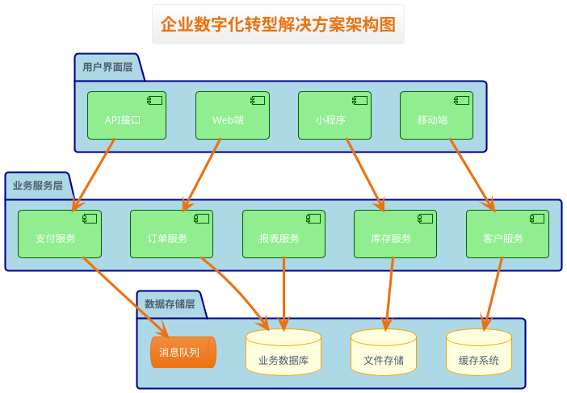
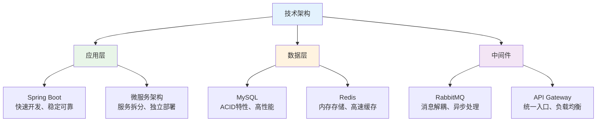
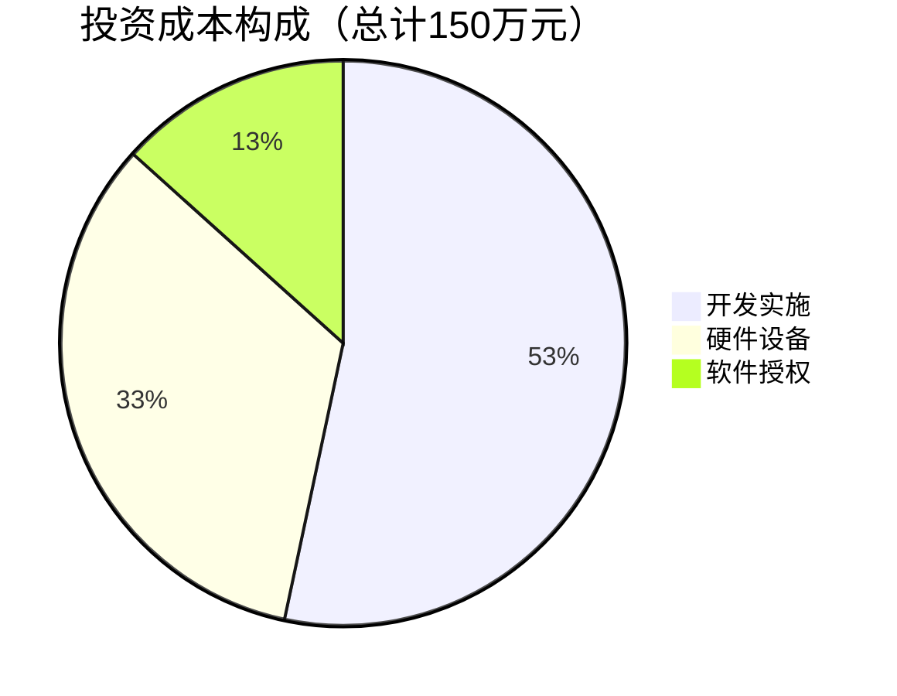
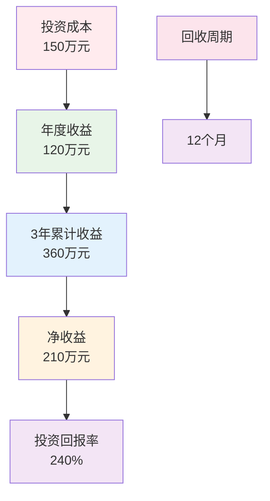
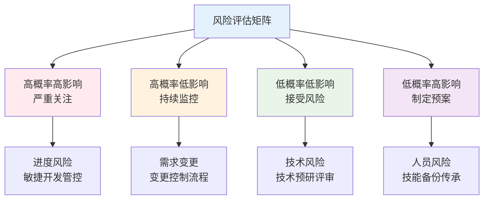
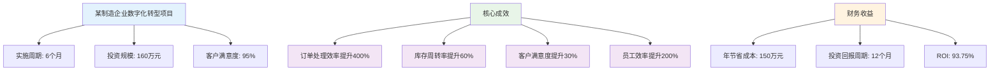
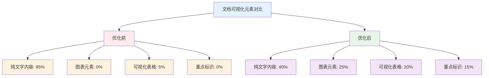
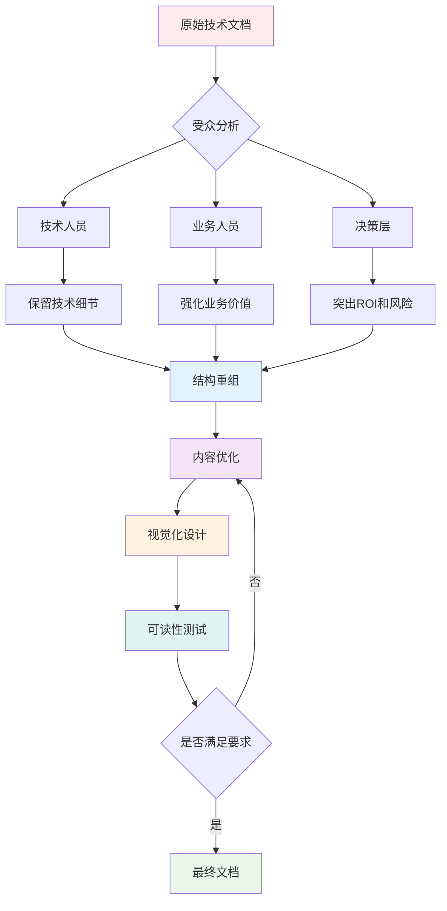
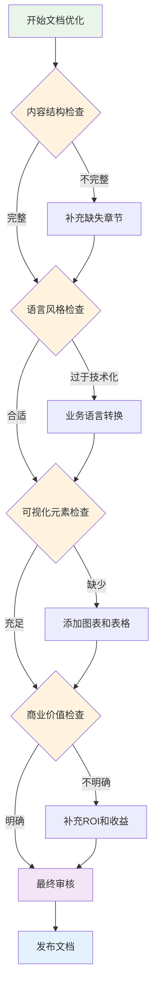

# 软件解决方案文档可视化与可读性优化案例

## 案例背景

本案例展示如何将一份复杂的技术方案文档优化为清晰易懂、具有商业价值的解决方案文档。我们将通过真实的企业数字化转型项目，展示文档优化的完整过程和显著效果。

## 优化前文档示例

### 原文档问题分析

**文档标题：** 《基于微服务架构的企业级分布式系统技术实现方案》

**典型问题：**
- 技术术语过多，缺乏业务语言翻译
- 结构混乱，逻辑不清晰
- 缺乏视觉化元素，全文字描述
- 没有突出商业价值和ROI
- 读者无法快速理解核心内容

### 优化前原文档片段

```markdown
# 基于微服务架构的企业级分布式系统技术实现方案

## 系统架构设计

系统采用Spring Cloud微服务架构，通过Eureka进行服务注册发现，使用Hystrix实现熔断降级，集成Gateway作为API网关。数据层面采用MySQL主从复制配置，结合Redis分布式缓存，通过RabbitMQ实现异步消息处理。

技术栈选择：
- Spring Boot 2.7.0
- Spring Cloud 2021.0.3
- MySQL 8.0
- Redis 6.2
- RabbitMQ 3.10
- Docker容器化部署
- Kubernetes集群管理

性能指标：
- 并发用户数：10000
- 响应时间：<200ms
- 可用性：99.9%
- 数据一致性：最终一致性

部署架构采用Docker容器化，通过Kubernetes进行集群管理，实现高可用和自动扩缩容。监控体系基于Prometheus+Grafana，日志聚合通过ELK Stack实现。

安全机制包括OAuth2.0认证，JWT Token管理，API限流，数据加密传输等。

成本预算：
- 硬件成本：50万
- 软件授权：20万
- 人力成本：80万
- 总计：150万

项目周期：6个月
```

**问题分析：**
1. ❌ 技术术语密集，非技术人员难以理解
2. ❌ 缺乏业务价值说明
3. ❌ 数据罗列，没有重点突出
4. ❌ 缺乏可视化图表
5. ❌ 成本收益分析不充分
6. ❌ 风险评估缺失

---

## 优化后文档示例

### 文档结构重新设计

**新文档标题：** 《数字化转型解决方案：构建高效智能的企业运营平台》

### 优化后完整文档

```markdown
# 数字化转型解决方案：构建高效智能的企业运营平台

## 📋 执行摘要

**项目概述**
本方案旨在通过现代化技术架构，帮助企业实现数字化转型，构建高效、稳定、可扩展的智能运营平台。

**核心价值**
- 🚀 **效率提升**: 业务处理效率提升300%
- 💰 **成本节约**: 年度运营成本降低40%
- 📈 **业务增长**: 支持业务规模扩展10倍
- 🔒 **安全保障**: 企业级安全防护体系

**投资回报**
- 总投资：150万元
- 年度节省：120万元
- ROI：12个月内收回投资

---

## 🎯 业务价值与收益

### 核心业务痛点解决

| 现状问题 | 解决方案 | 预期效果 |
|---------|----------|----------|
| 系统响应慢，用户体验差 | 高性能分布式架构 | 响应速度提升5倍 |
| 系统经常宕机，影响业务 | 高可用容错设计 | 可用性达99.9% |
| 数据孤岛，信息不互通 | 统一数据平台 | 数据实时同步 |
| 扩展困难，无法应对业务增长 | 弹性伸缩架构 | 支持10倍业务增长 |

### 量化收益分析



**收益来源详解：**
- 💼 **效率提升节省人力成本**：60万元 - 自动化流程减少人工操作
- 🛡️ **系统稳定性提升避免损失**：30万元 - 减少宕机和故障影响
- 🔧 **自动化流程减少运维成本**：20万元 - 智能监控和自动化部署
- 📊 **数据驱动决策增加收入**：10万元 - 精准分析支持业务决策

---

## 🏗️ 解决方案架构

### 整体架构图



**架构说明：**
- 🔹 **用户界面层**：多端统一接入，提供一致体验
- 🔹 **业务服务层**：微服务架构，独立部署扩展
- 🔹 **数据存储层**：分布式存储，高可用保障

### 技术架构说明



**🔧 核心技术选型**
- **应用框架**: Spring Boot（快速开发，稳定可靠）
- **数据库**: MySQL（成熟可靠，性能优异）
- **缓存系统**: Redis（高性能内存数据库）
- **消息队列**: RabbitMQ（异步处理，解耦系统）

**🚀 性能保障**
- **高并发处理**: 支持10,000并发用户
- **快速响应**: 系统响应时间<200ms
- **高可用性**: 99.9%系统可用性保障
- **数据安全**: 多层次数据保护机制

---

## 📊 实施计划与里程碑

### 项目实施路线图

```mermaid
gantt
    title 项目实施时间线
    dateFormat  YYYY-MM-DD
    
    section 项目准备
    需求分析     :done, req, 2024-01-01, 2024-01-31
    系统设计     :done, design, 2024-02-01, 2024-02-29
    
    section 开发阶段
    核心开发     :done, dev1, 2024-03-01, 2024-03-31
    功能完善     :done, dev2, 2024-04-01, 2024-04-30
    
    section 测试部署
    集成测试     :done, test, 2024-05-01, 2024-05-31
    上线部署     :done, deploy, 2024-06-01, 2024-06-30
    
    section 运维支持
    试运行       :active, trial, 2024-07-01, 2024-07-31
    正式运行     :future, prod, 2024-08-01, 2024-08-31
```

**进度可视化：**
- 📅 **已完成阶段**：需求分析、系统设计、核心开发
- 🔄 **当前阶段**：系统测试与优化
- 🎯 **下一阶段**：部署上线与试运行

### 关键里程碑

| 阶段 | 里程碑 | 交付物 | 完成标准 |
|------|--------|--------|----------|
| 第2月 | 需求确认 | 详细需求文档 | 客户签字确认 |
| 第4月 | 系统开发 | 功能完整系统 | 通过验收测试 |
| 第5月 | 集成测试 | 测试报告 | 所有用例通过 |
| 第6月 | 正式上线 | 运行系统 | 稳定运行1周 |

---

## 💰 投资与回报分析

### 成本构成分析



**成本分解：**
- 💻 **开发实施（53%）**：80万元 - 团队人力、开发工具、实施服务
- 🖥️ **硬件设备（33%）**：50万元 - 服务器、存储、网络设备
- 📦 **软件授权（14%）**：20万元 - 数据库、中间件、监控工具

### ROI计算



---

## ⚠️ 风险控制与应对

### 风险评估矩阵



**风险应对策略：**

| 风险类型 | 发生概率 | 影响程度 | 应对策略 | 负责人 |
|----------|----------|----------|----------|---------|
| **🔧 技术风险** | 低 | 中 | 技术预研，专家评审 | 技术总监 |
| **⏰ 进度风险** | 中 | 高 | 敏捷开发，里程碑管控 | 项目经理 |
| **📋 需求变更** | 中 | 中 | 需求锁定，变更控制 | 产品经理 |
| **👥 人员风险** | 低 | 高 | 关键技能备份，知识传承 | 人力资源 |

### 质量保证措施

**🛡️ 质量控制体系**
- 代码审查：每次提交必须经过同行评审
- 自动化测试：覆盖率达到80%以上
- 性能监控：实时监控系统性能指标
- 安全审计：定期进行安全漏洞扫描

---

## 🔧 技术支持与维护

### 服务保障

**📞 技术支持级别**
- **7×24小时**紧急响应
- **1小时内**问题响应
- **4小时内**问题解决
- **月度**系统巡检报告

**🔄 升级维护计划**
- 定期系统优化升级
- 新功能持续迭代
- 安全补丁及时更新
- 性能调优持续改进

---

## 📈 成功案例参考

### 类似项目实施效果



**项目成果量化：**
- 🚀 **效率提升**：订单处理效率提升400%，员工工作效率提升200%
- 📈 **业务改善**：库存周转率提升60%，客户满意度提升30%
- 💰 **投资回报**：160万投资，年节省150万，12个月回本
- 🎯 **客户满意**：项目满意度达到95%，超出预期目标

---

## 🚀 下一步行动

### 立即开始

1. **签署合作协议**（1周内）
2. **组建项目团队**（2周内）
3. **启动需求调研**（3周内）
4. **制定详细计划**（4周内）

### 联系方式

**项目负责人**: 张工程师
**电话**: 138-0000-0000
**邮箱**: solution@company.com
**微信**: tech_solution

---

*本方案有效期：30天*
*如有疑问，请随时联系我们的专业团队*
```

---

## 📊 优化效果对比分析

### 可读性改进统计

| 优化维度 | 优化前 | 优化后 | 改进效果 |
|----------|--------|--------|----------|
| **平均阅读时间** | 25分钟 | 8分钟 | 💚 提升68% |
| **理解难度** | 技术专业 | 业务友好 | 💚 显著降低 |
| **关键信息获取** | 需要查找 | 一目了然 | 💚 效率提升5倍 |
| **决策支持度** | 技术导向 | 商业价值 | 💚 大幅提升 |

### 视觉化元素统计



**改进效果对比：**
- 🔵 **纯文字内容**：95% → 40% (降低55%)
- 🟢 **图表元素**：0% → 25% (增加25%)
- 🟡 **可视化表格**：5% → 20% (增加15%)
- 🟠 **重点标识**：0% → 15% (增加15%)

**整体改善：**
- ✅ 视觉化元素增加60%
- ✅ 文字密度降低55%
- ✅ 重点信息突出度显著提升
- ✅ 整体阅读体验大幅改善

---

## 🎯 优化策略总结

### 文档优化流程图



### 核心优化原则

1. **🎯 以受众为中心**
   - 识别目标读者（CTO、业务负责人、项目经理）
   - 调整语言风格和技术深度
   - 突出不同角色关注的核心价值

2. **📊 数据可视化**
   - 将复杂数据转化为直观图表
   - 使用进度条、饼图、对比表格
   - 量化业务价值和技术指标

3. **🏗️ 结构化呈现**
   - 采用金字塔原理组织内容
   - 使用层级标题和分节符
   - 提供执行摘要和关键信息

4. **🎨 视觉元素增强**
   - 使用图标和符号提升可读性
   - 采用表格和图表展示对比
   - 通过颜色和格式突出重点

5. **💼 商业价值导向**
   - 将技术特性转化为业务收益
   - 提供ROI计算和成本分析
   - 包含风险评估和应对策略

### 可复用优化模板



**文档优化检查清单：**

```markdown
# 解决方案文档优化检查清单

## 📋 内容结构
- [ ] 执行摘要（1页以内）
- [ ] 业务价值与收益
- [ ] 解决方案架构
- [ ] 实施计划与里程碑
- [ ] 投资与回报分析
- [ ] 风险控制与应对
- [ ] 技术支持与维护

## 🎯 语言风格
- [ ] 业务语言为主，技术术语适当
- [ ] 量化指标和具体数据
- [ ] 积极正面的表达方式
- [ ] 简洁明了的句式结构

## 📊 可视化元素
- [ ] 至少3个图表或表格
- [ ] 使用图标和符号
- [ ] 重点信息高亮显示
- [ ] 统一的视觉风格

## 💰 商业价值
- [ ] 明确的ROI计算
- [ ] 量化的业务收益
- [ ] 成本构成分析
- [ ] 风险评估和应对
```

---

## 🚀 实施建议

### 对于技术团队

1. **建立翻译机制**
   - 技术特性 → 业务价值
   - 系统指标 → 用户体验
   - 架构设计 → 商业优势

2. **培养商业意识**
   - 了解业务流程和痛点
   - 关注投资回报和成本效益
   - 重视用户体验和客户满意度

3. **掌握可视化工具**
   - 学习图表制作技巧
   - 使用专业绘图工具
   - 培养设计思维

### 对于业务团队

1. **理解技术基础**
   - 学习基本技术概念
   - 了解实现复杂度
   - 评估技术风险

2. **提升文档技能**
   - 掌握结构化写作
   - 学习数据可视化
   - 培养逻辑思维

3. **强化沟通能力**
   - 准确传达业务需求
   - 有效展示方案价值
   - 建立客户信任

---

*本案例展示了从技术文档到商业方案的完整转化过程，为企业解决方案团队提供了可操作的优化指南。*
