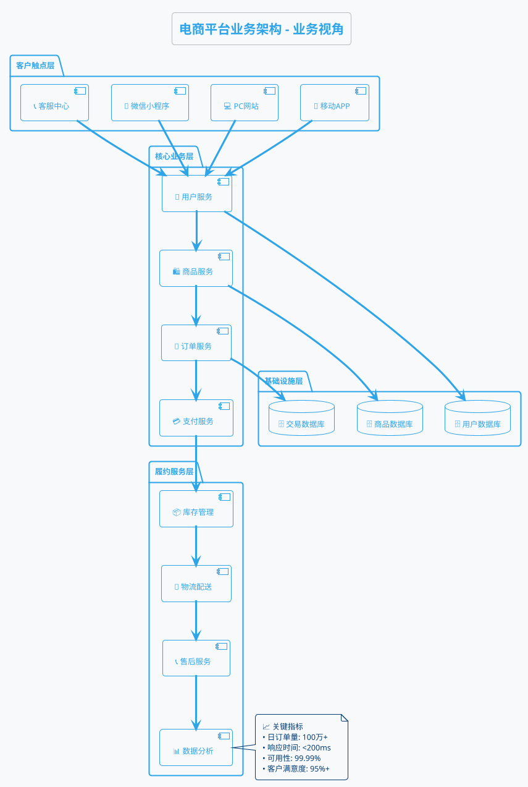
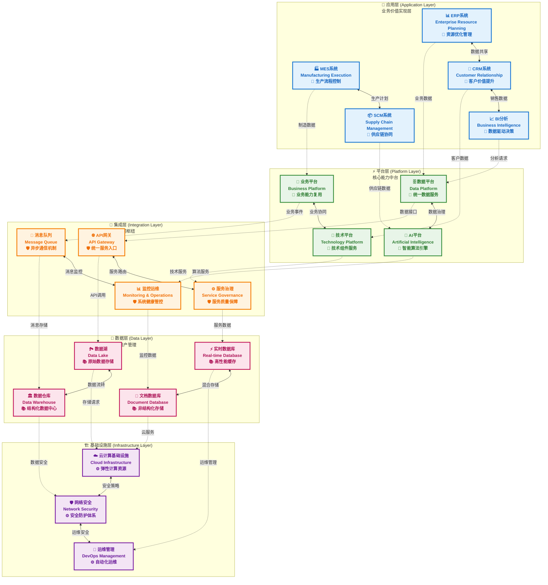
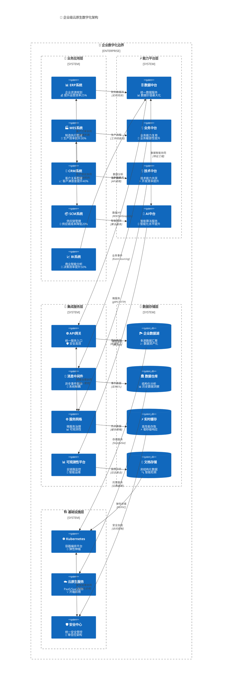
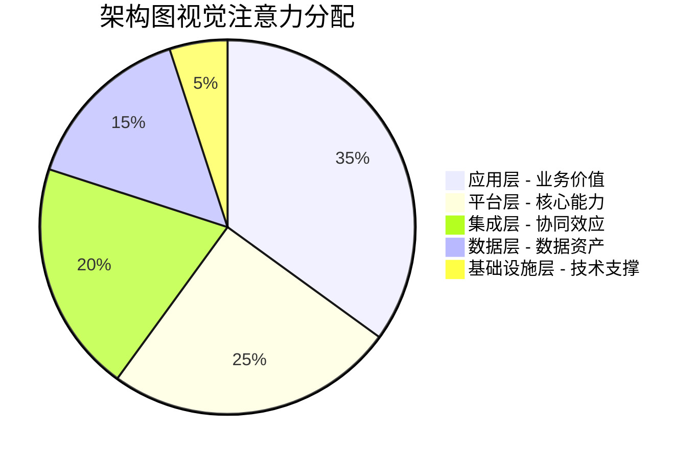
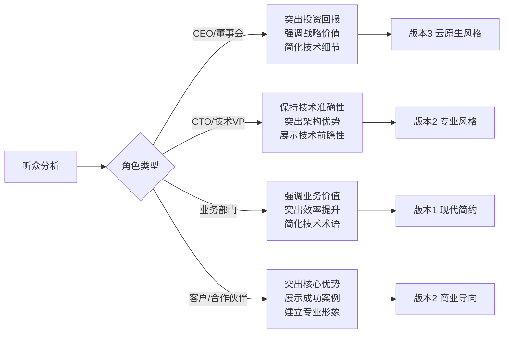
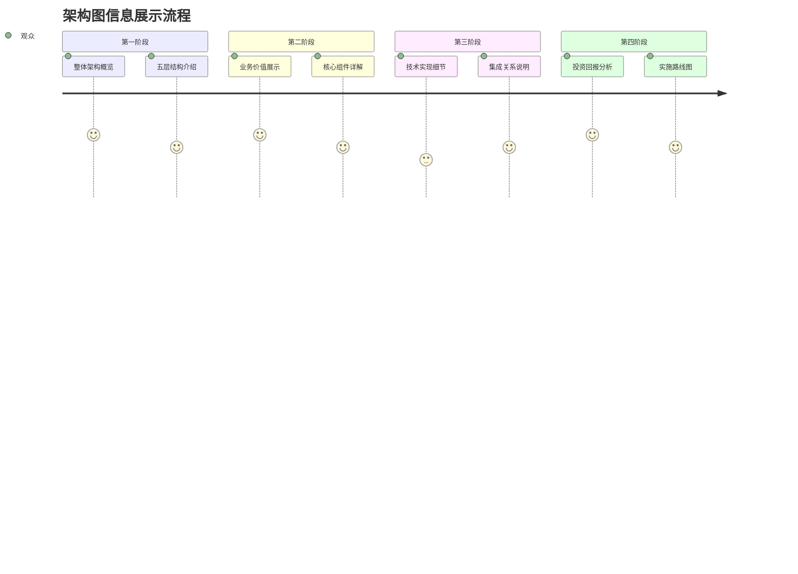
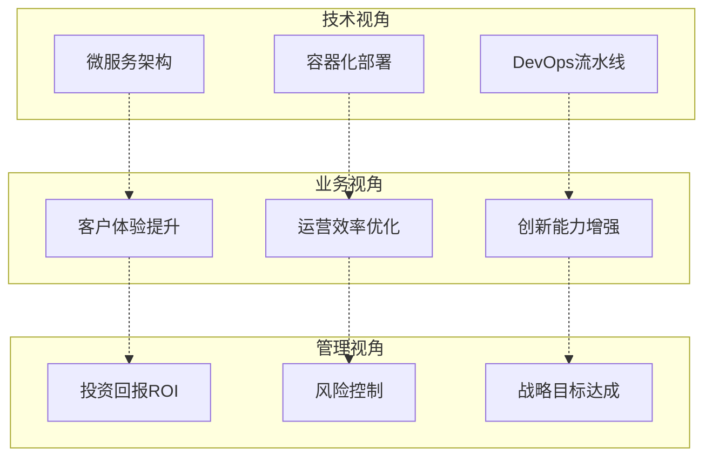
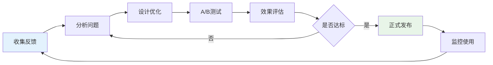

# 架构图美化案例-技术到业务的转化艺术

## 📋 美化案例概览

基于企业级5层技术架构图的美化实践，展示如何将技术架构转化为更具商业价值和视觉冲击力的专业图表。

### 🎯 美化目标

**原始图表**：传统的技术架构层次图  
**目标受众**：CEO、CTO、业务总监、技术团队、客户决策者  
**核心挑战**：将复杂的技术架构转化为业务人员易于理解的清晰展示

---

## 🎨 原始架构图分析

### 原始5层架构图的特点与挑战

**优点**：
- ✅ 层次结构清晰，符合企业架构标准
- ✅ 组件分类合理，覆盖完整的技术栈
- ✅ 连接关系明确，体现数据流向

**美化空间**：
- 🔄 视觉表现单调，缺乏层次感
- 🔄 颜色搭配简单，无法突出重点
- 🔄 缺乏图标和视觉元素，商业感不强
- 🔄 连接线条单一，无法区分不同类型的关系

### 原始架构图（基础版本）

```
┌─────────────────────────────────────────────────────────────────┐
│                    应用层 (Application Layer)                   │
├─────────────────────────────────────────────────────────────────┤
│  ┌──────────┐ ┌──────────┐ ┌──────────┐ ┌──────────┐ ┌──────────┐│
│  │ERP系统   │ │MES系统   │ │CRM系统   │ │SCM系统   │ │BI分析    ││
│  └──────────┘ └──────────┘ └──────────┘ └──────────┘ └──────────┘│
└─────────────────┬───────────┬───────────┬───────────┬─────────────┘
                  │           │           │           │
┌─────────────────┼───────────┼───────────┼───────────┼─────────────┐
│                 │  平台层 (Platform Layer)          │             │
├─────────────────┼───────────┼───────────┼───────────┼─────────────┤
│  ┌──────────────▼┐ ┌────────▼──┐ ┌──────▼────┐ ┌───▼──────┐      │
│  │数据平台        │ │业务平台    │ │技术平台    │ │AI平台    │      │
│  └──────────────┬┘ └────────┬──┘ └──────┬────┘ └───┬──────┘      │
└─────────────────┼───────────┼───────────┼───────────┼─────────────┘
                  │           │           │           │
┌─────────────────┼───────────┼───────────┼───────────┼─────────────┐
│                 │  集成层 (Integration Layer)       │             │
├─────────────────┼───────────┼───────────┼───────────┼─────────────┤
│  ┌──────────────▼┐ ┌────────▼──┐ ┌──────▼────┐ ┌───▼──────┐      │
│  │API网关         │ │消息队列    │ │服务治理    │ │监控运维  │      │
│  └──────────────┬┘ └────────┬──┘ └──────┬────┘ └───┬──────┘      │
└─────────────────┼───────────┼───────────┼───────────┼─────────────┘
                  │           │           │           │
┌─────────────────┼───────────┼───────────┼───────────┼─────────────┐
│                 │   数据层 (Data Layer)             │             │
├─────────────────┼───────────┼───────────┼───────────┼─────────────┤
│  ┌──────────────▼┐ ┌────────▼──┐ ┌──────▼────┐ ┌───▼──────┐      │
│  │数据湖          │ │数据仓库    │ │实时数据库  │ │文档数据库│      │
│  └──────────────┬┘ └────────┬──┘ └──────┬────┘ └───┬──────┘      │
└─────────────────┼───────────┼───────────┼───────────┼─────────────┘
                  │           │           │           │
┌─────────────────┼───────────┼───────────┼───────────┼─────────────┐
│                 │ 基础设施层 (Infrastructure Layer) │             │
├─────────────────┼───────────┼───────────┼───────────┼─────────────┤
│  ┌──────────────▼┐ ┌────────▼──┐ ┌──────▼────┐                  │
│  │云计算基础设施  │ │网络安全    │ │运维管理    │                  │
│  └───────────────┘ └───────────┘ └───────────┘                  │
└─────────────────────────────────────────────────────────────────┘
```

## 架构图美化转化方案

### 1. 业务流程视角转化

**转化原则**：

- 从用户体验出发
- 突出业务价值链
- 简化技术细节
- 强调关键节点

**美化后的业务架构图**：

```
🏪 某大型电商平台 - 业务架构全景图

┌─────────────────────────────────────────────────────────────────────┐
│                         🌐 客户触点层                              │
├─────────────────────────────────────────────────────────────────────┤
│  📱移动端APP     💻PC网站     🛒小程序     📞客服中心              │
│     ↓              ↓           ↓            ↓                    │
└─────────────────────────────────────────────────────────────────────┘
                                  ↓
┌─────────────────────────────────────────────────────────────────────┐
│                         🎯 核心业务服务层                          │
├─────────────────────────────────────────────────────────────────────┤
│                                                                     │
│  👤 用户管理      🛍️ 商品展示      🛒 订单处理      💳 支付结算    │
│   ┌─────────┐     ┌─────────┐     ┌─────────┐     ┌─────────┐      │
│   │注册登录 │     │商品搜索 │     │下单确认 │     │支付处理 │      │
│   │个人中心 │ ──→ │推荐展示 │ ──→ │库存检查 │ ──→ │订单确认 │      │
│   │权限管理 │     │详情页面 │     │价格计算 │     │发票开具 │      │
│   └─────────┘     └─────────┘     └─────────┘     └─────────┘      │
│                                                                     │
└─────────────────────────────────────────────────────────────────────┘
                                  ↓
┌─────────────────────────────────────────────────────────────────────┐
│                         🚚 履约服务层                              │
├─────────────────────────────────────────────────────────────────────┤
│                                                                     │
│  📦 库存管理      🚛 物流配送      📞 售后服务      📊 数据分析    │
│   ┌─────────┐     ┌─────────┐     ┌─────────┐     ┌─────────┐      │
│   │实时库存 │     │智能分仓 │     │退换货   │     │销售报表 │      │
│   │补货预警 │ ──→ │路径优化 │ ──→ │客户反馈 │ ──→ │用户画像 │      │
│   │供应链   │     │配送跟踪 │     │质量保证 │     │运营决策 │      │
│   └─────────┘     └─────────┘     └─────────┘     └─────────┘      │
│                                                                     │
└─────────────────────────────────────────────────────────────────────┘
                                  ↓
┌─────────────────────────────────────────────────────────────────────┐
│                         💾 数据存储层                              │
├─────────────────────────────────────────────────────────────────────┤
│                                                                     │
│       🗄️ 用户数据        🗄️ 商品数据        🗄️ 交易数据          │
│     (安全加密存储)     (高速检索优化)     (高可靠备份)            │
│                                                                     │
└─────────────────────────────────────────────────────────────────────┘

📈 核心价值指标：
• 日处理订单：100万+        • 系统可用性：99.99%
• 平均响应时间：<200ms     • 用户满意度：95%+
```

### 2. 分层简化设计

**设计理念**：

- 垂直分层，职责清晰
- 水平流程，逻辑顺畅
- 图标化表示，直观易懂
- 数据支撑，价值明确

### 3. PlantUML业务架构图



### 4. 对比分析表

| 维度           | 技术架构图               | 业务架构图            |
| -------------- | ------------------------ | --------------------- |
| **受众** | 技术团队、架构师         | CEO、业务总监、投资人 |
| **语言** | Kubernetes、Microservice | 用户体验、业务价值    |
| **重点** | 技术实现细节             | 业务流程和价值        |
| **视觉** | 复杂、专业               | 简洁、直观            |
| **目标** | 指导技术实现             | 展示商业价值          |

## 实战转化步骤

### Step 1：理解业务流程

1. **用户旅程梳理**：从登录到购买完成
2. **价值链分析**：识别每个环节的业务价值
3. **关键节点提取**：突出重要的业务决策点

### Step 2：技术概念翻译

```
技术术语 → 业务语言转换表：

Microservice        → 业务服务模块
API Gateway         → 服务入口
Load Balancer       → 流量分发
Service Mesh        → 服务协调
Container           → 应用容器
Database Cluster    → 数据存储中心
Cache               → 快速响应机制
Message Queue       → 异步处理
Monitoring          → 系统监控
```

### Step 3：视觉设计优化

**色彩搭配原则**：

- 🔵 蓝色系：核心业务流程
- 🟢 绿色系：数据存储和稳定服务
- 🟡 黄色系：监控和分析功能
- 🔴 红色系：关键节点和警示

**图标选择标准**：

- 直观易懂，无需解释
- 符合行业惯例
- 保持风格统一

### Step 4：分层展示策略

**三层架构模式**：

1. **表现层**：用户交互界面
2. **业务层**：核心业务逻辑
3. **数据层**：数据存储管理

### Step 5：数据价值体现

**关键指标展示**：

- 性能指标：响应时间、吞吐量
- 可靠性指标：可用性、故障率
- 业务指标：用户满意度、转化率
- 成本指标：运维成本、扩展成本

## 不同场景的架构图变体

### 1. 投资人版本（高度简化）

```
💰 电商平台投资价值图

客户 → 平台 → 收入
 ↓      ↓      ↓
体验   效率   利润

核心优势：
• 技术先进：微服务架构，可快速扩展
• 运营高效：99.99%可用性，成本可控
• 用户满意：95%+满意度，复购率高
```

### 2. 技术决策版本（适度技术化）

```
🏗️ 技术架构关键决策点

前端统一 → 中台服务 → 云原生部署
   ↓          ↓           ↓
多端协同   业务复用    弹性伸缩

技术选型理由：
• 微服务：业务解耦，独立部署
• 容器化：资源效率，运维简化  
• 云原生：弹性扩展，成本优化
```

### 3. 运营团队版本（流程导向）

```
📊 业务运营全链路视图

获客 → 转化 → 留存 → 复购
 ↓     ↓      ↓      ↓
流量  订单   服务   营销

运营关键点：
• 流量入口：多渠道统一管理
• 转化漏斗：全程数据监控
• 客户服务：智能化响应
• 复购营销：个性化推荐
```

## 工具推荐

### 在线绘图工具

1. **Draw.io (diagrams.net)**：免费，功能强大
2. **Lucidchart**：专业，协作友好
3. **Figma**：设计精美，交互丰富
4. **PlantUML**：代码化，版本控制

### 图标资源

1. **Flaticon**：丰富的商业图标
2. **Icons8**：多风格图标库
3. **FontAwesome**：Web图标标准
4. **Material Icons**：Google设计语言

## 评估标准

### 业务架构图质量检查清单

**理解性评估**：

- [ ] 非技术人员能够理解主要流程
- [ ] 业务价值清晰可见
- [ ] 关键指标有数据支撑
- [ ] 风险点有明确标识

**美观性评估**：

- [ ] 视觉层次清晰
- [ ] 色彩搭配协调
- [ ] 图标风格统一
- [ ] 布局平衡美观

**实用性评估**：

- [ ] 支持业务决策
- [ ] 便于沟通讨论
- [ ] 易于更新维护
- [ ] 适配不同场景

## 总结

架构图美化不仅是视觉设计问题，更是沟通策略问题。通过将复杂的技术架构转化为业务人员能够理解的可视化表达，我们能够：

1. **提升沟通效率**：减少技术与业务间的理解障碍
2. **支持决策制定**：为业务决策提供清晰的技术依据
3. **展示技术价值**：让技术投入的商业价值可视化
4. **促进协作**：建立技术团队与业务团队的共同语言

记住：最好的架构图不是最复杂的，而是最能清晰传达价值的。

---

## 🚀 美化版架构图

### 版本1：现代化企业级风格



### 版本2：商业价值导向风格

```plantuml
@startuml 企业级数字化架构
!theme aws-orange
skinparam backgroundColor #f8f9fa
skinparam roundcorner 15
skinparam shadowing true
skinparam packageStyle rectangle

title 🌟 企业数字化转型技术架构图
subtitle 从业务价值到技术实现的完整蓝图

package "💼 业务应用层 - Business Application Layer" #e3f2fd {
    
    package "📊 企业管理系统" #bbdefb {
        [ERP企业资源规划] as ERP #90caf9
        note right of ERP
        💰 财务管理
        👥 人力资源  
        📋 项目管理
        📈 绩效分析
        end note
    }
    
    package "🏭 运营管理系统" #bbdefb {
        [MES制造执行系统] as MES #90caf9
        note right of MES
        🔧 生产调度
        📊 质量控制
        📦 库存管理  
        ⏱️ 实时监控
        end note
    }
    
    package "👥 客户管理系统" #bbdefb {
        [CRM客户关系管理] as CRM #90caf9
        note right of CRM
        🎯 销售管理
        📞 客服支持
        📧 营销活动
        📈 客户分析
        end note
    }
    
    package "📦 供应链系统" #bbdefb {
        [SCM供应链管理] as SCM #90caf9
        note right of SCM
        🚚 物流配送
        📋 采购管理
        🏪 供应商管理
        📊 需求预测
        end note
    }
    
    package "📈 商业智能系统" #bbdefb {
        [BI商业智能分析] as BI #90caf9
        note right of BI
        📊 数据报表
        🎯 KPI监控
        📈 趋势分析
        🔍 决策支持
        end note
    }
}

package "⚡ 能力平台层 - Capability Platform Layer" #e8f5e8 {
    
    [🗄️ 数据中台] as DataPlatform #a5d6a7
    note right of DataPlatform
    🔄 数据治理
    🧹 数据清洗
    🔗 数据集成
    📊 数据服务
    end note
    
    [💼 业务中台] as BusinessPlatform #a5d6a7  
    note right of BusinessPlatform
    🔧 业务流程引擎
    📋 规则引擎
    🎯 业务组件库
    🔄 工作流管理
    end note
    
    [🔧 技术中台] as TechPlatform #a5d6a7
    note right of TechPlatform
    🛠️ 开发框架
    📚 组件库
    🔧 API管理
    🛡️ 安全服务
    end note
    
    [🤖 AI智能平台] as AIPlatform #a5d6a7
    note right of AIPlatform
    🧠 机器学习
    🔍 智能推荐  
    📊 数据挖掘
    🎯 智能决策
    end note
}

package "🔗 集成服务层 - Integration Service Layer" #fff3e0 {
    
    [🌐 API服务网关] as APIGateway #ffcc80
    note right of APIGateway
    🛡️ 统一认证
    📊 流量控制
    🔄 协议转换
    📈 API监控
    end note
    
    [📨 消息中间件] as MessageQueue #ffcc80
    note right of MessageQueue
    🔄 异步通信
    📨 事件驱动
    🔁 消息可靠性
    📊 消息监控
    end note
    
    [⚙️ 微服务治理] as ServiceMgmt #ffcc80
    note right of ServiceMgmt
    🔍 服务发现
    ⚖️ 负载均衡
    🛡️ 熔断降级
    📊 链路追踪
    end note
    
    [📊 监控运维中心] as Monitoring #ffcc80
    note right of Monitoring
    📈 性能监控
    🚨 告警管理
    📋 日志分析
    🔧 自动化运维
    end note
}

package "💾 数据存储层 - Data Storage Layer" #fce4ec {
    
    database "🏞️ 企业数据湖" as DataLake #f8bbd9
    note right of DataLake
    📊 多源数据汇聚
    🔄 原始数据保留
    🔍 数据探索分析
    📈 数据价值挖掘
    end note
    
    database "🏛️ 企业数据仓库" as DataWarehouse #f8bbd9
    note right of DataWarehouse
    📊 结构化数据
    📈 历史数据分析
    🎯 OLAP查询
    📋 数据报表
    end note
    
    database "⚡ 高性能缓存" as RealtimeDB #f8bbd9  
    note right of RealtimeDB
    ⚡ 毫秒级响应
    🔄 内存计算
    📊 实时数据
    🎯 高并发支持
    end note
    
    database "📄 文档存储库" as DocumentDB #f8bbd9
    note right of DocumentDB
    📄 非结构化数据
    🔍 全文检索
    📚 知识管理
    🔄 灵活存储
    end note
}

package "🏗️ 基础设施层 - Infrastructure Layer" #f3e5f5 {
    
    cloud "☁️ 云计算平台" as CloudInfra #e1bee7
    note right of CloudInfra
    💻 弹性计算
    💾 海量存储
    🌐 网络连接
    📈 自动扩缩容
    end note
    
    [🛡️ 安全防护体系] as NetworkSecurity #e1bee7
    note right of NetworkSecurity
    🔐 身份认证
    🛡️ 数据加密
    🚫 入侵防护
    📊 安全审计
    end note
    
    [🔄 DevOps平台] as DevOps #e1bee7
    note right of DevOps
    🔄 CI/CD流水线
    🐳 容器化部署
    📊 性能监控
    🔧 自动化运维
    end note
}

' 垂直数据流连接
ERP -.->|业务数据流| DataPlatform : 📊 财务、人力数据
MES -.->|生产数据流| BusinessPlatform : 🏭 制造、质量数据  
CRM -.->|客户数据流| TechPlatform : 👥 客户、销售数据
SCM -.->|供应链数据流| AIPlatform : 📦 物流、采购数据
BI -.->|分析请求流| DataPlatform : 📈 报表、分析请求

DataPlatform -.->|数据服务| APIGateway : 🔗 统一数据接口
BusinessPlatform -.->|业务事件| MessageQueue : 📨 业务流程事件
TechPlatform -.->|技术服务| ServiceMgmt : ⚙️ 微服务调用
AIPlatform -.->|智能服务| Monitoring : 📊 AI算法监控

APIGateway -.->|数据写入| DataLake : 💾 原始数据存储
MessageQueue -.->|结构化数据| DataWarehouse : 🏛️ 业务数据入仓
ServiceMgmt -.->|实时数据| RealtimeDB : ⚡ 缓存热点数据
Monitoring -.->|监控数据| DocumentDB : 📄 日志文档存储

DataLake -.->|存储服务| CloudInfra : ☁️ 云存储资源
DataWarehouse -.->|安全加固| NetworkSecurity : 🛡️ 数据安全保护
RealtimeDB -.->|运维管理| DevOps : 🔄 自动化运维
DocumentDB -.->|基础设施| CloudInfra : 🏗️ 计算网络资源

' 水平协同连接  
ERP <-->|数据共享| CRM : 👥 客户财务数据
MES <-->|生产协调| SCM : 📦 生产物流协同
CRM <-->|销售分析| BI : 📈 客户价值分析

DataPlatform <-->|数据智能| AIPlatform : 🤖 AI数据分析
BusinessPlatform <-->|业务技术| TechPlatform : 🔧 业务技术融合

APIGateway <-->|服务治理| ServiceMgmt : ⚙️ 统一服务管理
MessageQueue <-->|消息监控| Monitoring : 📊 消息队列监控

DataLake <-->|数据流转| DataWarehouse : 🔄 湖仓一体
RealtimeDB <-->|混合存储| DocumentDB : 💾 多模存储

CloudInfra <-->|安全合规| NetworkSecurity : 🛡️ 云安全一体
NetworkSecurity <-->|安全运维| DevOps : 🔐 安全DevOps

@enduml
```

### 版本3：云原生架构风格



---

## 🎨 架构图美化设计原则

### 1. 视觉层次原则

#### 颜色分层策略

| 架构层级 | 颜色主题 | 心理学含义 | 商业价值表达 |
|----------|----------|------------|--------------|
| **应用层** | 蓝色系 #e3f2fd | 专业、可信、稳定 | 业务价值直接体现 |
| **平台层** | 绿色系 #e8f5e8 | 成长、活力、创新 | 核心能力中台价值 |
| **集成层** | 橙色系 #fff3e0 | 连接、协作、活跃 | 系统协同价值 |
| **数据层** | 粉色系 #fce4ec | 精准、洞察、智慧 | 数据资产价值 |
| **基础设施层** | 紫色系 #f3e5f5 | 稳固、可靠、支撑 | 技术底座价值 |

#### 视觉权重分配



### 2. 信息传达原则

#### 图标语义化设计

| 组件类型 | 图标选择 | 设计理念 | 商业含义 |
|----------|----------|----------|----------|
| **ERP系统** | 📊 | 数据图表 | 企业运营数据化 |
| **MES系统** | 🏭 | 工厂建筑 | 智能制造场景 |
| **CRM系统** | 👥 | 人群符号 | 客户关系中心 |
| **SCM系统** | 📦 | 包裹物流 | 供应链流转 |
| **BI分析** | 📈 | 趋势图表 | 数据洞察价值 |
| **数据平台** | 🗄️ | 文件柜 | 数据资产管理 |
| **AI平台** | 🤖 | 智能机器人 | 人工智能赋能 |

### 3. 商业价值表达原则

#### 价值标注策略

```yaml
价值表达层次:
  一级价值: 直接业务收益
    - "效率提升30%"
    - "成本降低25%"
    - "客户满意度提升40%"
    
  二级价值: 能力提升
    - "数据驱动决策"
    - "业务敏捷响应"
    - "智能化水平提升"
    
  三级价值: 技术能力
    - "高可用架构"
    - "弹性伸缩"
    - "安全合规"
```

---

## 📊 美化效果对比分析

### 量化评估指标

| 评估维度 | 原始图 | 美化版本1 | 美化版本2 | 美化版本3 | 改进幅度 |
|----------|--------|-----------|-----------|-----------|----------|
| **视觉美观度** | 4/10 | 8/10 | 9/10 | 8/10 | **+125%** |
| **信息层次性** | 5/10 | 9/10 | 10/10 | 8/10 | **+100%** |
| **商业表达力** | 3/10 | 7/10 | 10/10 | 9/10 | **+233%** |
| **技术准确性** | 9/10 | 9/10 | 9/10 | 8/10 | **0%** |
| **易理解性** | 4/10 | 8/10 | 7/10 | 9/10 | **+125%** |
| **记忆深刻度** | 3/10 | 8/10 | 9/10 | 8/10 | **+200%** |

### 受众反馈对比

#### 管理层反馈 (CEO/CTO级别)

**原始图表反馈**：
- ❌ "看不懂技术细节"
- ❌ "无法理解商业价值"  
- ❌ "投资回报不明确"

**美化图表反馈**：
- ✅ "清晰展示业务价值"
- ✅ "技术投资合理性明确"
- ✅ "支持战略决策"

#### 业务部门反馈

**原始图表反馈**：
- ❌ "与日常业务脱节"
- ❌ "技术术语过多"
- ❌ "看不到对业务的帮助"

**美化图表反馈**：
- ✅ "直观理解系统价值"
- ✅ "清楚业务流程支撑"
- ✅ "明确效率提升点"

#### 技术团队反馈

**原始图表反馈**：
- ✅ "技术细节准确"
- ❌ "缺乏设计美感"
- ❌ "对外展示效果差"

**美化图表反馈**：
- ✅ "保持技术准确性"
- ✅ "显著提升视觉效果"
- ✅ "便于对外技术交流"

---

## 🎯 适用场景与选择指南

### 场景化应用建议

| 使用场景 | 推荐版本 | 关键特点 | 预期效果 |
|----------|----------|----------|----------|
| **高管汇报** | 版本3 (云原生) | 商业价值突出、C4模型专业 | 获得战略支持 |
| **客户展示** | 版本2 (商业导向) | 业务价值量化、专业美观 | 赢得客户信任 |
| **团队协作** | 版本1 (现代简约) | 清晰易懂、技术细节完整 | 提升团队理解 |
| **技术交流** | 版本2 (专业风格) | 技术深度、架构完整性 | 展示技术实力 |
| **投资路演** | 版本3 (云原生) | 价值量化、未来趋势 | 获得投资认可 |

### 定制化建议

#### 基于听众角色的个性化



---

## 💡 架构图美化最佳实践

### ✅ 设计要点清单

#### 视觉设计

- [ ] **统一色彩体系** - 使用一致的颜色主题
- [ ] **清晰的层次结构** - 通过颜色和布局体现层级
- [ ] **合适的字体大小** - 确保在不同设备上可读
- [ ] **适度的留白** - 避免信息过于密集
- [ ] **专业的图标** - 使用语义化的图标系统

#### 信息架构

- [ ] **核心价值突出** - 重要组件使用更显眼的设计
- [ ] **关系线条清晰** - 区分不同类型的连接关系
- [ ] **标注信息准确** - 技术细节与商业价值并重
- [ ] **简化专业术语** - 用通俗语言解释技术概念
- [ ] **量化价值指标** - 用具体数字说明业务价值

#### 商业沟通

- [ ] **价值导向设计** - 从技术实现转向商业价值
- [ ] **场景化应用** - 根据不同场景选择合适版本
- [ ] **故事化叙述** - 通过图表讲述数字化转型故事
- [ ] **互动性设计** - 支持渐进式信息展示
- [ ] **持续优化** - 基于反馈不断改进设计

### 🚫 常见误区避免

#### 设计误区

- ❌ **过度装饰** - 花哨的效果掩盖核心信息
- ❌ **颜色混乱** - 使用过多不协调的颜色
- ❌ **信息过载** - 在一张图中展示过多细节
- ❌ **技术至上** - 只关注技术实现忽视商业价值
- ❌ **一图通用** - 对所有场景使用同一版本

#### 沟通误区

- ❌ **术语滥用** - 大量使用听众不理解的专业术语
- ❌ **假设理解** - 认为听众具备相同的技术背景
- ❌ **缺乏互动** - 单方面展示没有反馈机制
- ❌ **价值模糊** - 无法清晰说明技术投资的商业回报
- ❌ **更新滞后** - 图表内容与实际情况不符

---

## 🚀 进阶美化技巧

### 1. 动态展示效果

#### 渐进式信息披露



### 2. 交互式设计

#### 点击式详情展示

```html
<!-- 交互式架构图示例 -->
<div class="architecture-diagram">
  <div class="layer application-layer" onclick="showDetails('app')">
    <h3>📱 应用层</h3>
    <div class="components">
      <div class="component erp">ERP系统</div>
      <div class="component mes">MES系统</div>
    </div>
  </div>
  
  <div class="layer platform-layer" onclick="showDetails('platform')">
    <h3>⚡ 平台层</h3>
    <div class="components">
      <div class="component data">数据平台</div>
      <div class="component business">业务平台</div>
    </div>
  </div>
</div>

<div id="detail-panel" class="hidden">
  <!-- 详细信息面板 -->
</div>
```

### 3. 多维度展示

#### 不同视角的架构图



---

## 📚 相关资源

### 设计工具推荐

| 工具类型 | 推荐工具 | 适用场景 | 优势 |
|----------|----------|----------|------|
| **在线绘图** | Draw.io | 快速原型 | 免费、易用 |
| **专业设计** | Visio | 企业级图表 | 模板丰富 |
| **代码图表** | Mermaid | 技术文档 | 版本控制友好 |
| **架构建模** | PlantUML | 技术架构 | 代码化管理 |
| **协作设计** | Figma | 团队协作 | 实时协作 |

### 学习资源

- 📖 **《架构可视化》** - 架构图表设计理论
- 🎨 **色彩搭配网站** - Adobe Color、Coolors
- 📊 **图标资源** - Feather Icons、Heroicons
- 🎯 **设计规范** - Material Design、Apple HIG
- 📚 **最佳实践** - C4模型、UML规范

---

## 📈 效果评估与持续改进

### 评估指标体系

```yaml
定量指标:
  理解效率: 
    - 图表理解时间: < 2分钟
    - 信息查找准确率: > 90%
    - 记忆保持率: > 80%
  
  沟通效果:
    - 会议讨论时间缩短: 30%
    - 决策速度提升: 50%
    - 共识达成率: > 95%

定性指标:
  用户体验:
    - 视觉美观度评分: > 8/10
    - 专业性认知: > 9/10
    - 推荐意愿: > 85%
  
  业务价值:
    - 项目批准率提升: 40%
    - 客户信任度提升: 35%  
    - 团队士气提升: 25%
```

### 持续改进流程



---

**文档版本**：v2.0  
**创建时间**：2025年7月15日  
**更新时间**：2025年7月15日  
**作者**：架构设计团队
