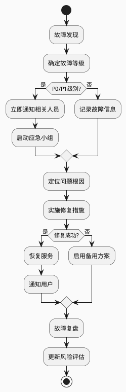

# 架构风险评估表

## 📋 模板使用说明

本模板用于系统化地识别、评估和管理系统架构设计中的各类风险，确保项目成功交付并降低后期维护成本。

---

## 🎯 风险评估概览

### 项目基本信息

| 项目名称 | [项目名称] |
|----------|------------|
| 评估日期 | [评估日期] |
| 评估人员 | [评估团队] |
| 项目阶段 | 需求分析/设计/开发/测试/部署 |
| 系统类型 | Web应用/移动应用/企业系统/其他 |

### 风险等级定义

| 等级 | 影响程度 | 发生概率 | 风险值计算 | 应对优先级 |
|------|----------|----------|------------|------------|
| **🔴 高风险** | 严重影响项目成功 | 很可能发生 | 影响×概率≥6 | 立即处理 |
| **🟡 中风险** | 中等影响 | 可能发生 | 影响×概率=3-5 | 重点关注 |
| **🟢 低风险** | 轻微影响 | 不太可能发生 | 影响×概率≤2 | 定期监控 |

**评分标准**：影响程度和发生概率均为1-3分（1=低，2=中，3=高）

---

## 🏗️ 架构风险评估矩阵

### 1. 技术架构风险

| 风险编号 | 风险描述 | 风险分类 | 影响程度 | 发生概率 | 风险等级 | 潜在后果 | 应对策略 | 负责人 | 状态 |
|----------|----------|----------|----------|----------|----------|----------|----------|--------|------|
| AR-001 | 选用不成熟的技术栈导致开发困难 | 技术选型 | 3 | 2 | 🟡 中 | 开发延期、质量问题 | 选择成熟稳定的技术 | [负责人] | 待处理 |
| AR-002 | 单点故障风险 | 可用性 | 3 | 2 | 🟡 中 | 系统不可用 | 设计冗余机制 | [负责人] | 待处理 |
| AR-003 | 数据库性能瓶颈 | 性能 | 2 | 3 | 🟡 中 | 响应缓慢 | 数据库优化、缓存 | [负责人] | 待处理 |
| AR-004 | 安全漏洞风险 | 安全性 | 3 | 2 | 🟡 中 | 数据泄露 | 安全审计、加密 | [负责人] | 待处理 |
| AR-005 | 扩展性不足 | 可扩展性 | 2 | 2 | 🟢 低 | 系统无法支撑业务增长 | 微服务架构 | [负责人] | 待处理 |

### 2. 业务架构风险

| 风险编号 | 风险描述 | 风险分类 | 影响程度 | 发生概率 | 风险等级 | 潜在后果 | 应对策略 | 负责人 | 状态 |
|----------|----------|----------|----------|----------|----------|----------|----------|--------|------|
| BR-001 | 业务需求理解偏差 | 需求管理 | 3 | 2 | 🟡 中 | 功能不符合期望 | 需求澄清、原型验证 | [负责人] | 待处理 |
| BR-002 | 业务流程复杂度过高 | 复杂性 | 2 | 2 | 🟢 低 | 用户体验差 | 流程简化 | [负责人] | 待处理 |
| BR-003 | 数据模型设计不合理 | 数据设计 | 3 | 2 | 🟡 中 | 后期重构困难 | 数据建模评审 | [负责人] | 待处理 |

### 3. 运维架构风险

| 风险编号 | 风险描述 | 风险分类 | 影响程度 | 发生概率 | 风险等级 | 潜在后果 | 应对策略 | 负责人 | 状态 |
|----------|----------|----------|----------|----------|----------|----------|----------|--------|------|
| OR-001 | 部署流程复杂易出错 | 部署 | 2 | 3 | 🟡 中 | 部署失败 | 自动化部署 | [负责人] | 待处理 |
| OR-002 | 监控告警不完善 | 监控 | 2 | 2 | 🟢 低 | 问题发现滞后 | 完善监控体系 | [负责人] | 待处理 |
| OR-003 | 备份恢复机制缺失 | 灾备 | 3 | 1 | 🟡 中 | 数据丢失 | 建立备份策略 | [负责人] | 待处理 |

---

## 📊 风险热力图

### 风险分布矩阵

```
发生概率 ↑
     3  │    OR-001  │  AR-003   │          │
        │            │           │          │
     2  │  BR-002    │  AR-001   │  AR-004  │
        │  OR-002    │  BR-001   │  AR-002  │
        │            │  BR-003   │  OR-003  │
     1  │            │           │          │
        └────────────┼───────────┼──────────┤
        1            2           3    → 影响程度

图例: 🟢 低风险  🟡 中风险  🔴 高风险
```

### 风险统计

| 风险等级 | 数量 | 占比 | 趋势 |
|----------|------|------|------|
| 🔴 高风险 | 0 | 0% | ➡️ |
| 🟡 中风险 | 6 | 75% | ⬆️ |
| 🟢 低风险 | 2 | 25% | ⬇️ |
| **总计** | **8** | **100%** | - |

---

## 🎯 关键风险深度分析

### 高风险项详细分析

#### [暂无高风险项]

### 重点中风险项分析

#### AR-003: 数据库性能瓶颈

**风险详情**：
- **触发条件**：用户并发量超过1000，查询响应时间超过3秒
- **影响范围**：所有依赖数据库的功能模块
- **业务影响**：用户体验下降，可能导致用户流失

**应对方案**：
1. **短期措施**：
   - 添加数据库连接池
   - 优化慢查询SQL
   - 增加Redis缓存

2. **长期措施**：
   - 数据库读写分离
   - 分库分表
   - 引入ElasticSearch

**实施计划**：
- Week 1-2: 连接池优化和缓存
- Week 3-4: SQL优化
- Month 2-3: 读写分离方案

**成功指标**：
- 查询响应时间<1秒
- 支持5000并发用户
- 数据库CPU使用率<70%

#### AR-001: 技术栈不成熟风险

**风险详情**：
- **触发条件**：选用发布不到1年的框架或工具
- **影响范围**：开发效率、系统稳定性
- **业务影响**：项目延期、维护成本增加

**应对方案**：
1. **技术选型原则**：
   - 优先选择LTS版本
   - 社区活跃度高的技术
   - 有成功案例的技术栈

2. **风险缓解**：
   - 建立技术调研机制
   - 制定技术升级计划
   - 培训团队新技术

**实施计划**：
- Week 1: 技术调研和评估
- Week 2: POC验证
- Week 3: 团队培训

---

## 🛡️ 风险应对策略

### 风险应对类型

| 应对类型 | 定义 | 适用场景 | 实施方法 |
|----------|------|----------|----------|
| **规避** | 完全消除风险 | 高风险且有替代方案 | 更改设计、技术选型 |
| **缓解** | 降低风险概率或影响 | 中高风险 | 增加检查点、备用方案 |
| **转移** | 将风险转移给第三方 | 技术风险 | 外包、采购成熟产品 |
| **接受** | 承认风险并制定应急计划 | 低风险或成本过高 | 监控、应急预案 |

### 风险应对计划

| 风险编号 | 应对类型 | 具体措施 | 实施时间 | 预算 | 负责人 | 完成标准 |
|----------|----------|----------|----------|------|--------|----------|
| AR-001 | 缓解 | 技术选型评审 | Week 1 | 0 | [负责人] | 完成评审报告 |
| AR-002 | 缓解 | 设计高可用架构 | Week 2-3 | 5万 | [负责人] | 99.9%可用性 |
| AR-003 | 缓解 | 性能优化方案 | Month 1 | 3万 | [负责人] | 响应时间<1s |
| BR-001 | 缓解 | 需求评审机制 | Week 1 | 0 | [负责人] | 需求确认文档 |

---

## 📈 风险监控与跟踪

### 监控指标

| 风险类别 | 监控指标 | 阈值 | 监控频率 | 告警方式 |
|----------|----------|------|----------|----------|
| **性能风险** | 响应时间 | >3秒 | 实时 | 短信、邮件 |
| **可用性风险** | 系统可用性 | <99% | 实时 | 电话、短信 |
| **安全风险** | 异常访问 | >100次/分钟 | 实时 | 立即告警 |
| **容量风险** | CPU使用率 | >80% | 每5分钟 | 邮件 |
| **容量风险** | 内存使用率 | >85% | 每5分钟 | 邮件 |

### 风险评审计划

| 评审类型 | 频率 | 参与人员 | 评审内容 |
|----------|------|----------|----------|
| **日常监控** | 每日 | 运维团队 | 监控指标检查 |
| **风险评审** | 每周 | 技术团队 | 风险状态更新 |
| **架构评审** | 每月 | 架构师、项目经理 | 架构风险全面评估 |
| **里程碑评审** | 关键节点 | 全项目组 | 整体风险状况 |

---

## 📋 应急响应预案

### 故障等级定义

| 等级 | 定义 | 响应时间 | 通知范围 |
|------|------|----------|----------|
| **P0 - 紧急** | 系统完全不可用 | 15分钟 | 全体相关人员 |
| **P1 - 严重** | 核心功能异常 | 30分钟 | 技术团队、管理层 |
| **P2 - 重要** | 部分功能异常 | 2小时 | 技术团队 |
| **P3 - 一般** | 轻微影响 | 24小时 | 责任人 |

### 应急响应流程



### 关键联系人

| 角色 | 姓名 | 电话 | 邮箱 | 备注 |
|------|------|------|------|------|
| **架构师** | [姓名] | [电话] | [邮箱] | 技术决策 |
| **运维负责人** | [姓名] | [电话] | [邮箱] | 故障处理 |
| **项目经理** | [姓名] | [电话] | [邮箱] | 协调沟通 |
| **产品负责人** | [姓名] | [电话] | [邮箱] | 业务影响评估 |

---

## ✅ 风险评估总结

### 评估结论

1. **整体风险等级**：🟡 中等风险
2. **主要风险点**：性能、技术选型、需求理解
3. **风险趋势**：可控，需持续关注
4. **建议措施**：加强技术评审、完善监控体系

### 后续行动计划

| 优先级 | 行动项 | 负责人 | 完成时间 | 状态 |
|--------|--------|--------|----------|------|
| 高 | 完成技术选型评审 | [负责人] | [日期] | 待开始 |
| 高 | 建立性能监控体系 | [负责人] | [日期] | 进行中 |
| 中 | 制定应急响应流程 | [负责人] | [日期] | 待开始 |
| 中 | 团队技术培训 | [负责人] | [日期] | 待开始 |

### 评审确认

| 角色 | 姓名 | 签字 | 日期 |
|------|------|------|------|
| **架构师** | [姓名] | [签字] | [日期] |
| **项目经理** | [姓名] | [签字] | [日期] |
| **技术负责人** | [姓名] | [签字] | [日期] |

---

## 📚 相关文档

- [系统架构图模板](系统架构图模板.md)
- [技术选型决策表](技术选型决策表.md)
- [接口设计规范](接口设计规范.md)
- [部署架构图模板](部署架构图模板.md)

---

**创建时间**：{当前日期}  
**更新时间**：{当前日期}  
**版本号**：v1.0
