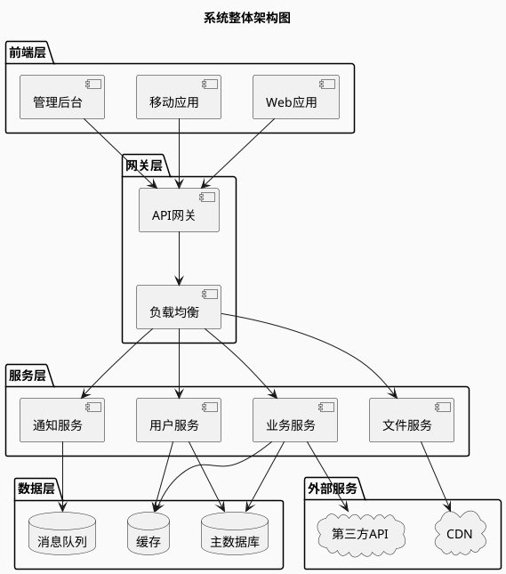
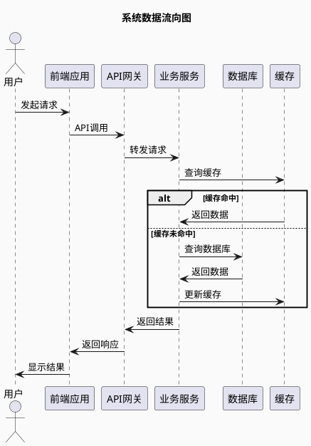

# 系统架构图模板

## 📋 模板使用说明

本模板用于绘制清晰、标准化的系统架构图，帮助团队理解系统整体结构和组件关系。

---

## 🏗️ 系统架构图

### 整体架构概览



### 核心组件说明

| 层次 | 组件名称 | 主要职责 | 技术选型 |
|------|----------|----------|----------|
| **前端层** | Web应用 | 用户界面展示和交互 | React/Vue/Angular |
| | 移动应用 | 移动端用户界面 | React Native/Flutter |
| | 管理后台 | 系统管理界面 | React/Vue |
| **网关层** | API网关 | 请求路由、鉴权、限流 | Spring Gateway/Kong |
| | 负载均衡 | 流量分发 | Nginx/HAProxy |
| **服务层** | 用户服务 | 用户管理、认证授权 | Spring Boot/Node.js |
| | 业务服务 | 核心业务逻辑 | Spring Boot/Node.js |
| | 通知服务 | 消息推送 | Spring Boot |
| | 文件服务 | 文件上传下载 | FastDFS/OSS |
| **数据层** | 主数据库 | 业务数据存储 | MySQL/PostgreSQL |
| | 缓存 | 热点数据缓存 | Redis/Memcached |
| | 消息队列 | 异步消息处理 | RabbitMQ/Kafka |

### 数据流向图



### 部署架构图

```plantuml
@startuml
!define AWSPUML https://raw.githubusercontent.com/awslabs/aws-icons-for-plantuml/v15.0/dist
!includeurl AWSPUML/AWSCommon.puml
!includeurl AWSPUML/ApplicationIntegration/APIGateway.puml
!includeurl AWSPUML/Compute/EC2.puml
!includeurl AWSPUML/Database/RDS.puml

skinparam backgroundColor #FAFAFA
skinparam defaultFontName "Microsoft YaHei"

title 系统部署架构图

package "生产环境" {
  package "Web层" {
    EC2(web1, "Web服务器1", "")
    EC2(web2, "Web服务器2", "")
  }
  
  package "应用层" {
    EC2(app1, "应用服务器1", "")
    EC2(app2, "应用服务器2", "")
  }
  
  package "数据层" {
    RDS(db, "主数据库", "")
    EC2(cache, "缓存服务器", "")
  }
}

APIGateway(gateway, "负载均衡器", "")

gateway --> web1
gateway --> web2
web1 --> app1
web1 --> app2
web2 --> app1
web2 --> app2
app1 --> db
app2 --> db
app1 --> cache
app2 --> cache

@enduml
```

---

## 📝 架构设计检查清单

### ✅ 功能性检查
- [ ] 业务需求是否完全覆盖
- [ ] 功能模块划分是否合理
- [ ] 接口定义是否清晰
- [ ] 数据流转是否完整

### ✅ 非功能性检查
- [ ] 性能要求是否满足
- [ ] 可靠性设计是否充分
- [ ] 安全性措施是否完备
- [ ] 可维护性是否良好

### ✅ 技术选型检查
- [ ] 技术栈是否成熟稳定
- [ ] 团队技术能力是否匹配
- [ ] 技术生态是否完善
- [ ] 后续升级路径是否清晰

---

## 🎯 模板定制指南

### 1. 根据项目规模调整
- **小型项目**：简化为单体架构
- **中型项目**：采用分层架构
- **大型项目**：采用微服务架构

### 2. 根据业务特点调整
- **高并发场景**：增加缓存和负载均衡
- **数据密集型**：优化数据存储和查询
- **实时性要求**：增加消息队列和推送

### 3. 根据团队情况调整
- **技术栈熟悉度**：选择团队擅长的技术
- **人员规模**：匹配架构复杂度
- **维护能力**：考虑长期运维成本

---

## 📚 相关文档

- [技术选型决策表](技术选型决策表.md)
- [架构风险评估表](架构风险评估表.md)
- [接口设计规范](接口设计规范.md)
- [部署架构图模板](部署架构图模板.md)

---

**创建时间**：{当前日期}  
**更新时间**：{当前日期}  
**版本号**：v1.0
