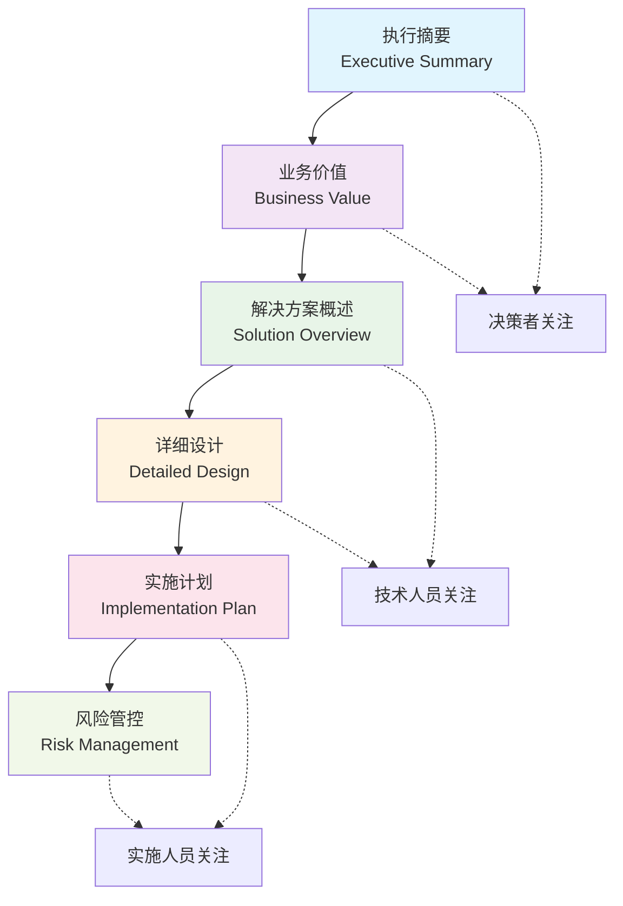
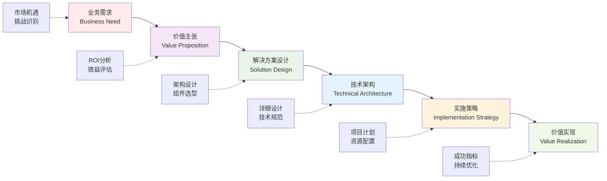
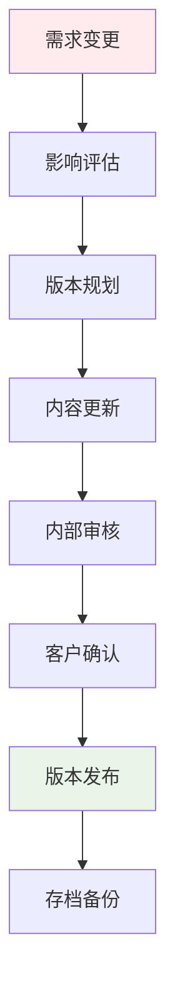

# 🏗️ 解决方案文档核心框架与标准结构

## 构建专业化、标准化的解决方案文档体系

### 📋 今日议题
- 国际标准文档框架分析
- 文档层次结构设计
- 逻辑递进关系构建
- 读者分层设计策略
- 版本管理最佳实践

### 🎯 学习目标
- 掌握主流文档框架
- 理解文档结构逻辑
- 学会差异化表达
- 建立版本管理流程

---

# 🌐 国际标准文档框架

## IBM Solution Architecture Framework

### 🔧 核心组件
- **Business Architecture** - 业务架构
- **Information Architecture** - 信息架构  
- **Application Architecture** - 应用架构
- **Technology Architecture** - 技术架构

### 📊 关键特点
- 企业级成熟度模型
- 端到端解决方案覆盖
- 标准化交付物定义

## Microsoft Solution Architecture

### 🏢 框架结构
- **Solution Overview** - 解决方案概述
- **Business Value** - 业务价值
- **Technical Design** - 技术设计
- **Implementation Guide** - 实施指南

### ⭐ 优势特色
- 云原生架构导向
- 敏捷交付方法论
- 微软生态深度集成

---

# 📚 文档层次结构设计

---

# 📋 各层级详细结构

## 1️⃣ 执行摘要 (Executive Summary)
- **问题陈述**：业务挑战与机遇识别
- **解决方案价值**：核心价值主张概述
- **投资收益**：ROI预期与关键指标
- **实施时间线**：关键里程碑时间点

## 2️⃣ 业务价值 (Business Value)
- **现状分析**：As-Is业务流程分析
- **目标愿景**：To-Be业务目标定义
- **价值量化**：成本节约与收益提升
- **竞争优势**：差异化价值主张

---

# 📋 各层级详细结构（续）

## 3️⃣ 解决方案概述 (Solution Overview)
- **架构蓝图**：整体解决方案架构图
- **核心组件**：关键技术组件说明
- **集成方案**：系统集成策略
- **技术选型**：技术栈选择依据

## 4️⃣ 详细设计 (Detailed Design)
- **系统架构**：详细技术架构设计
- **数据模型**：数据结构与流转设计
- **接口规范**：API设计与集成规范
- **安全设计**：安全架构与防护措施

---

# 📋 各层级详细结构（完）

## 5️⃣ 实施计划 (Implementation Plan)
- **项目规划**：详细项目实施计划
- **资源配置**：人力、技术资源安排
- **里程碑管理**：关键节点与交付物
- **质量保障**：测试策略与验收标准

## 6️⃣ 风险管控 (Risk Management)
- **风险识别**：技术、业务、项目风险
- **影响评估**：风险概率与影响程度
- **应对策略**：预防措施与应急预案
- **监控机制**：风险跟踪与预警体系

---

# 🔄 逻辑递进关系

## 从业务价值到技术实现的完整链条

---

# 👥 读者分层设计策略

## 🏢 决策者版本
### 关注重点
- **业务价值** - ROI、竞争优势
- **投资回报** - 成本效益分析
- **风险评估** - 主要风险与应对
- **时间规划** - 关键里程碑

### 表达特点
- 高度概括，突出重点
- 图表化展示数据
- 执行摘要为核心
- 避免技术细节

## 👨‍💻 技术版本
### 关注重点
- **架构设计** - 技术架构详图
- **技术选型** - 技术栈与依据
- **集成方案** - 系统集成策略
- **安全设计** - 安全架构方案

### 表达特点
- 技术深度与广度并重
- 详细的架构图解
- 具体的技术规范
- 可操作的设计文档

---

# 👥 读者分层设计策略（续）

## 🔧 实施版本
### 关注重点
- **项目计划** - 详细实施时间线
- **资源需求** - 人力技术资源
- **交付标准** - 质量与验收标准
- **风险应对** - 具体应对措施

### 表达特点
- 操作性强，步骤清晰
- 详细的计划甘特图
- 具体的资源清单
- 可执行的作业指导

## 📊 差异化表达示例

| 层面 | 决策者 | 技术人员 | 实施人员 |
|------|--------|----------|----------|
| **云架构** | 降本增效30% | 微服务+容器化 | K8s部署方案 |
| **数据安全** | 合规风险控制 | 加密+访问控制 | 安全配置清单 |
| **集成方案** | 系统统一管理 | RESTful API | 接口调试文档 |

---

# 📝 文档版本管理

## 🔄 迭代更新流程

## 📋 变更追踪机制

### 版本命名规范
- **主版本**：V1.0, V2.0 (重大变更)
- **次版本**：V1.1, V1.2 (功能增加)
- **修订版**：V1.1.1 (错误修正)

### 变更日志格式
- **变更日期**：2025-07-14
- **变更类型**：新增/修改/删除
- **变更内容**：具体变更描述
- **影响范围**：受影响的章节

---

# 📝 文档版本管理（续）

## ✅ 审批流程设计

### 三级审批机制
1. **内容审核** - 技术负责人审核技术准确性
2. **质量审核** - 质量经理审核文档规范性  
3. **客户确认** - 客户代表确认需求符合性

### 审批记录管理
- **审批人员**：姓名、角色、日期
- **审批意见**：通过/修改/拒绝
- **修改建议**：具体修改要求
- **确认签字**：电子签名确认

---

# 🛠️ 实践工具与模板

## 📋 推荐工具

### 📝 文档编写工具
- **Notion** - 协作文档平台
- **Confluence** - 企业知识管理
- **GitBook** - 技术文档撰写
- **Markdown** - 轻量级标记语言

### 🎨 图表绘制工具
- **Lucidchart** - 专业流程图
- **Draw.io** - 免费架构图
- **Visio** - Microsoft图表工具
- **Miro** - 在线协作白板

## 📄 模板资源

### 🗂️ 标准模板库
- **执行摘要模板**
- **技术架构模板** 
- **项目计划模板**
- **风险评估模板**

### 📊 图表模板库
- **解决方案架构图**
- **业务流程图**
- **数据流程图**
- **部署架构图**

---

# 📈 质量评估与持续改进

## 文档质量评估维度

| 评估维度 | 评分标准 | 权重 | 目标值 |
|----------|----------|------|--------|
| **完整性** | 内容覆盖度 | 25% | ≥90% |
| **准确性** | 技术正确性 | 30% | ≥95% |
| **清晰性** | 表达清楚度 | 20% | ≥85% |
| **一致性** | 格式统一性 | 15% | ≥90% |
| **实用性** | 可操作性 | 10% | ≥80% |

### 🔄 持续改进机制
- **定期评审**：季度文档质量评审
- **反馈收集**：客户与内部团队反馈
- **最佳实践**：优秀案例总结推广
- **模板更新**：基于反馈优化模板

---

# 🎯 成功案例分享

## 📊 某大型制造企业数字化转型方案

### 项目背景
- 传统制造向智能制造转型
- 多系统集成复杂度高
- 投资金额超过5000万

### 文档框架应用
- **决策者版本**：聚焦ROI与战略价值
- **技术版本**：详述IoT+AI架构
- **实施版本**：分阶段部署计划

## 📈 项目成功关键因素

### 🎯 文档价值体现
- **决策效率**：决策时间缩短60%
- **理解一致性**：跨部门理解统一
- **实施精度**：按计划完成率95%
- **风险控制**：重大风险零发生

### 💡 经验总结
- 分层设计提升沟通效率
- 标准框架确保内容完整
- 版本管理保证文档时效性

---

# 🔮 未来发展趋势

## 🤖 AI赋能文档创作

### 智能化趋势
- **自动生成**：基于需求自动生成文档框架
- **智能审核**：AI辅助内容质量检查
- **动态更新**：实时同步项目变更
- **多语言支持**：自动翻译与本地化

### 技术发展方向
- 大语言模型应用
- 知识图谱构建
- 自然语言处理
- 机器学习优化

## 🌐 协作模式演进

### 新兴模式
- **实时协作**：多人同时编辑
- **版本控制**：Git式版本管理
- **自动化工作流**：CI/CD集成
- **移动办公**：移动端编辑支持

### 平台生态
- 云原生文档平台
- 开放API生态
- 第三方工具集成
- 行业标准统一

---

# 📝 总结与行动计划

## 关键要点回顾

### 🎯 核心收获
1. **国际标准框架**：IBM与Microsoft框架的特点与应用
2. **层次结构设计**：六层结构的逻辑递进关系
3. **读者分层策略**：差异化表达提升沟通效果
4. **版本管理机制**：确保文档质量与时效性

### 🚀 行动建议
- [ ] 建立企业标准文档模板库
- [ ] 制定分层表达规范与指南
- [ ] 实施版本管理与审批流程
- [ ] 培训团队标准化文档技能

---

# 🙏 谢谢聆听

## 📞 联系方式

**讲师**：解决方案架构专家  
**邮箱**：solution.architect@company.com  
**微信**：SolutionExpert2025  
**电话**：138-0000-0000

### 💭 Q&A 环节

> 欢迎提出您的问题，让我们共同探讨解决方案文档的最佳实践！

---
