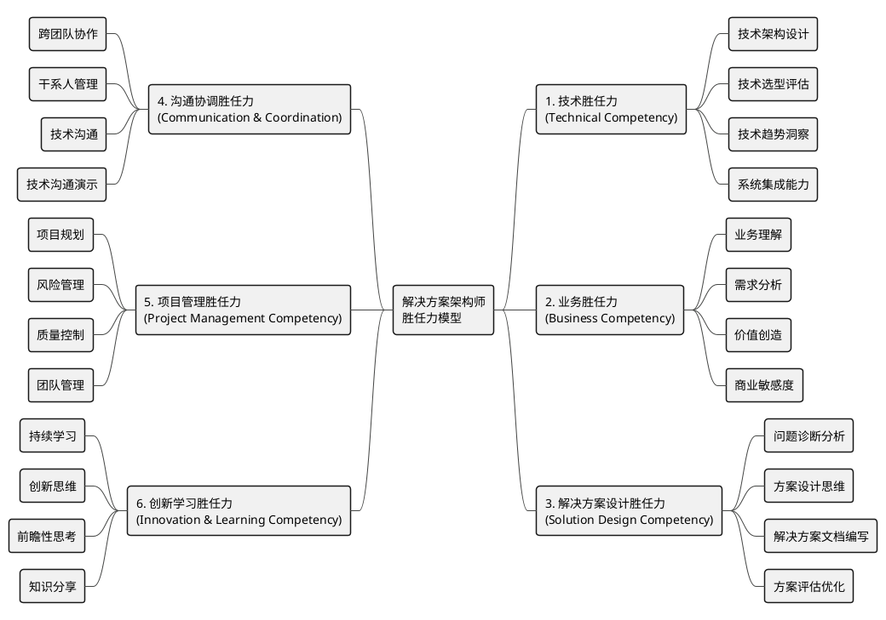
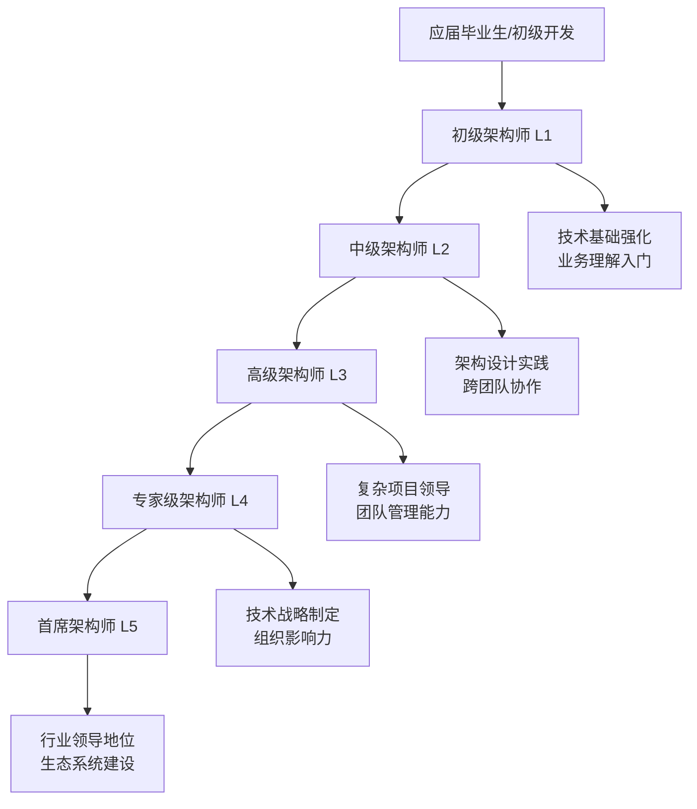
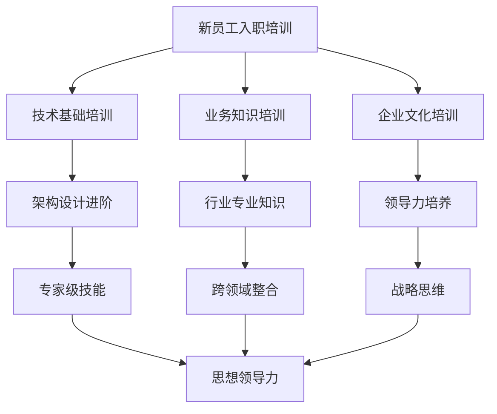
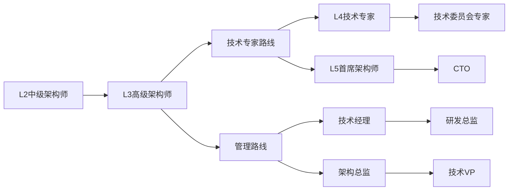

# 解决方案架构师胜任力模型

## 📋 目录

1. [胜任力模型概述](#胜任力模型概述)
2. [能力模型框架](#能力模型框架)
3. [核心胜任力详解](#核心胜任力详解)
4. [能力级别定义](#能力级别定义)
5. [评估体系](#评估体系)
6. [发展路径](#发展路径)
7. [实际应用](#实际应用)
8. [参考资源](#参考资源)

---

## 🎯 胜任力模型概述

### 模型定义
解决方案架构师胜任力模型是一个综合性的能力框架，旨在定义解决方案架构师在不同工作场景下所需具备的知识、技能、行为和态度，为人才选拔、培养、评价和发展提供科学依据。

### 模型价值
- **个人发展**：为架构师提供明确的能力发展方向和路径
- **组织管理**：为企业提供人才评估、培养和晋升的标准
- **团队建设**：优化团队结构，提升整体能力水平
- **项目成功**：确保架构师具备项目成功所需的关键能力

### 适用范围
- 解决方案架构师
- 企业架构师
- 技术架构师
- 系统架构师
- 云架构师

---

## 🏗️ 能力模型框架



---

## 🎯 核心胜任力详解

### 1. 技术胜任力 (Technical Competency)

#### 1.1 技术架构设计
**定义**: 设计满足业务需求的技术架构方案

**关键能力**:
- 架构模式理解与应用
- 非功能性需求分析
- 架构权衡决策
- 架构文档编写

**行为表现**:
- 能够设计高可用、可扩展的系统架构
- 熟练运用设计模式和架构模式
- 能够平衡性能、成本、安全等因素
- 产出清晰的架构设计文档

#### 1.2 技术选型评估
**定义**: 基于项目需求选择合适的技术栈

**关键能力**:
- 技术栈对比分析
- 技术成熟度评估
- 团队技能匹配
- 技术风险评估

**行为表现**:
- 能够客观评估不同技术方案的优缺点
- 考虑技术的学习成本和维护成本
- 基于团队能力做出现实的技术选择
- 制定技术演进和迁移策略

#### 1.3 技术趋势洞察
**定义**: 跟踪和理解技术发展趋势

**关键能力**:
- 新兴技术跟踪
- 技术趋势分析
- 技术影响评估
- 技术路线规划

**行为表现**:
- 持续关注行业技术动态
- 能够识别有价值的新技术
- 评估新技术对业务的潜在影响
- 制定技术引入和升级计划

#### 1.4 系统集成能力
**定义**: 整合不同系统和组件的能力

**关键能力**:
- 接口设计
- 数据集成
- 服务编排
- 系统互操作性

**行为表现**:
- 设计清晰的系统边界和接口
- 处理复杂的数据同步和一致性问题
- 协调多个系统的协同工作
- 确保系统的兼容性和可扩展性

### 2. 业务胜任力 (Business Competency)

#### 2.1 业务理解
**定义**: 深入理解客户业务和行业特点

**关键能力**:
- 业务流程分析
- 行业知识积累
- 业务痛点识别
- 业务模式理解

**行为表现**:
- 能够快速理解客户的业务流程
- 掌握所在行业的专业知识
- 准确识别业务痛点和改进机会
- 理解不同业务模式的特点

#### 2.2 需求分析
**定义**: 准确理解和分析业务需求

**关键能力**:
- 需求挖掘
- 需求分析
- 需求管理
- 需求追踪

**行为表现**:
- 通过有效沟通挖掘真实需求
- 能够区分功能性和非功能性需求
- 管理需求变更和优先级
- 建立需求与技术实现的追溯关系

#### 2.3 价值创造
**定义**: 通过技术方案为业务创造价值

**关键能力**:
- 价值识别
- ROI分析
- 价值量化
- 价值传递

**行为表现**:
- 识别技术方案的业务价值点
- 进行投资回报率分析
- 量化技术改进带来的业务收益
- 有效传递技术价值给业务方

#### 2.4 商业敏感度
**定义**: 对商业环境和市场变化的敏感性

**关键能力**:
- 市场趋势感知
- 竞争对手分析
- 商业机会识别
- 成本效益意识

**行为表现**:
- 关注市场和竞争对手动态
- 识别新的商业机会
- 在技术决策中考虑成本效益
- 平衡短期需求和长期发展

### 3. 解决方案设计胜任力 (Solution Design Competency)

#### 3.1 问题诊断分析
**定义**: 系统性识别和分析客户业务问题的能力

**关键能力**:
- 客户需求挖掘
- 业务流程分析
- 现有系统评估
- 根因分析

**行为表现**:
- 运用需求冰山模型识别表象需求与深层需求
- 通过业务流程梳理发现瓶颈和痛点
- 系统评估现有技术架构的健康度和技术债务
- 运用5Why分析法、鱼骨图等工具进行根因分析

#### 3.2 方案设计思维
**定义**: 运用系统性思维框架设计解决方案的能力

**关键能力**:
- 金字塔原理应用
- MECE原则运用
- 系统思维分析
- 设计思维驱动

**行为表现**:
- 运用金字塔原理构建方案逻辑结构
- 应用MECE原则确保方案完整性和独立性
- 运用系统思维分析复杂问题的要素、结构、功能
- 基于设计思维五步法(共情、定义、构思、原型、测试)优化用户体验

#### 3.3 解决方案文档编写
**定义**: 编写专业、清晰、有说服力的解决方案文档的能力

**关键能力**:
- 文档框架设计
- 价值主张表达
- 技术方案业务化表达
- 文档可视化设计

**行为表现**:
- 设计符合国际标准的解决方案文档框架结构
- 运用价值主张画布清晰表达业务价值和ROI
- 将复杂技术方案转化为业务人员易懂的表达
- 运用图表、流程图、架构图等可视化元素提升文档可读性

#### 3.4 方案评估优化
**定义**: 评估方案质量并持续优化改进的能力

**关键能力**:
- 方案对比分析
- 风险效益评估
- 可行性分析
- 迭代优化

**行为表现**:
- 运用方案对比矩阵进行多方案评估
- 进行全面的风险识别和影响评估
- 从技术、商业、实施等维度评估方案可行性
- 基于反馈和变化持续优化方案设计

### 4. 沟通协调胜任力 (Communication & Coordination Competency)

#### 4.1 跨团队协作
**定义**: 与不同团队有效协作的能力

**关键能力**:
- 团队协作
- 冲突解决
- 共识建立
- 资源协调

**行为表现**:
- 主动与相关团队建立合作关系
- 有效解决团队间的冲突和分歧
- 推动不同团队达成共识
- 协调跨团队的资源和时间安排

#### 4.2 干系人管理
**定义**: 管理项目相关干系人的能力

**关键能力**:
- 干系人识别
- 需求平衡
- 关系维护
- 影响力建立

**行为表现**:
- 准确识别项目关键干系人
- 平衡不同干系人的需求和期望
- 维护良好的干系人关系
- 建立自己在组织中的影响力

#### 4.3 技术沟通
**定义**: 向不同受众清晰传达技术信息

**关键能力**:
- 技术表达
- 受众适配
- 视觉化呈现
- 说服能力

**行为表现**:
- 用通俗易懂的语言解释复杂技术
- 根据受众调整沟通方式和内容
- 运用图表、模型等视觉化手段
- 有效说服他人接受技术方案

#### 4.4 技术沟通演示
**定义**: 通过演示和展示有效传达技术方案

**关键能力**:
- 方案演示设计
- 可视化呈现
- 演讲技巧
- 互动沟通

**行为表现**:
- 设计清晰的方案演示结构和流程
- 运用图表、模型等可视化手段增强理解
- 掌握有效的演讲和展示技巧
- 与听众进行有效的互动和问答

### 5. 项目管理胜任力 (Project Management Competency)

#### 5.1 项目规划
**定义**: 制定合理的项目计划的能力

**关键能力**:
- 工作分解
- 时间估算
- 资源规划
- 里程碑设定

**行为表现**:
- 将复杂项目分解为可管理的任务
- 准确估算任务时间和工作量
- 合理规划人力和技术资源
- 设定清晰的项目里程碑

#### 5.2 风险管理
**定义**: 识别、评估和应对项目风险

**关键能力**:
- 风险识别
- 风险评估
- 风险应对
- 风险监控

**行为表现**:
- 主动识别技术和业务风险
- 评估风险的影响程度和发生概率
- 制定有效的风险应对策略
- 持续监控风险状态变化

#### 5.3 质量控制
**定义**: 确保项目交付质量的能力

**关键能力**:
- 质量标准制定
- 质量检查
- 质量改进
- 质量文化建设

**行为表现**:
- 制定明确的质量标准和检查点
- 建立有效的质量检查机制
- 持续改进项目质量管理流程
- 在团队中建立质量意识

#### 5.4 团队管理
**定义**: 管理和指导技术团队的能力

**关键能力**:
- 团队建设
- 人员培养
- 绩效管理
- 激励机制

**行为表现**:
- 建设高效协作的技术团队
- 指导和培养团队成员
- 设定合理的绩效目标和考核
- 建立有效的激励和认可机制

### 6. 创新学习胜任力 (Innovation & Learning Competency)

#### 6.1 持续学习
**定义**: 主动学习新知识和技能的能力

**关键能力**:
- 学习方法
- 知识更新
- 技能提升
- 经验总结

**行为表现**:
- 掌握高效的学习方法和工具
- 及时更新专业知识和技能
- 主动参与培训和学习活动
- 定期总结和反思工作经验

#### 6.2 创新思维
**定义**: 运用创新思维解决问题的能力

**关键能力**:
- 创新意识
- 创新方法
- 创新实践
- 创新推广

**行为表现**:
- 具备强烈的创新意识和动机
- 掌握系统性的创新方法和工具
- 在实际工作中尝试创新解决方案
- 推广成功的创新实践

#### 6.3 前瞻性思考
**定义**: 对未来趋势的预见和规划能力

**关键能力**:
- 趋势分析
- 场景规划
- 战略思维
- 长远规划

**行为表现**:
- 分析技术和业务发展趋势
- 规划不同情况下的应对方案
- 具备战略层面的思考能力
- 制定中长期的技术发展计划

#### 6.4 知识分享
**定义**: 分享知识和经验的能力

**关键能力**:
- 知识整理
- 经验萃取
- 分享技巧
- 影响传播

**行为表现**:
- 系统整理和沉淀专业知识
- 萃取可复用的工作经验
- 掌握有效的知识分享技巧
- 扩大知识和经验的影响范围

---

## 📊 能力级别定义

### 级别框架

| 级别 | 名称 | 总体特征 | 工作年限 | 项目规模 |
|------|------|----------|----------|----------|
| L1 | 初级架构师 | 在指导下完成基础架构工作 | 0-2年 | 小型项目 |
| L2 | 中级架构师 | 独立完成中等复杂度架构设计 | 2-5年 | 中型项目 |
| L3 | 高级架构师 | 领导复杂项目的架构设计 | 5-8年 | 大型项目 |
| L4 | 专家级架构师 | 技术领域专家和团队领导者 | 8-12年 | 企业级项目 |
| L5 | 首席架构师 | 组织级技术战略制定者 | 12年以上 | 战略级项目 |

### 各维度能力级别矩阵

#### 技术胜任力级别

| 能力项 | L1初级 | L2中级 | L3高级 | L4专家 | L5首席 |
|--------|--------|--------|--------|--------|--------|
| **技术架构设计** | 理解基本架构模式<br/>参与简单架构设计 | 独立设计中等复杂度架构<br/>运用常见架构模式 | 设计复杂系统架构<br/>创新性运用架构模式 | 设计企业级架构<br/>定义架构标准和规范 | 制定组织级架构战略<br/>引领架构技术发展 |
| **技术选型评估** | 了解主流技术栈<br/>参与技术调研 | 独立进行技术选型<br/>评估技术可行性 | 主导复杂项目技术选型<br/>平衡多种约束条件 | 制定技术选型标准<br/>指导团队技术决策 | 制定组织技术战略<br/>引领技术方向 |
| **技术趋势洞察** | 学习新兴技术<br/>了解技术发展动态 | 跟踪相关技术趋势<br/>评估新技术价值 | 深度研究技术趋势<br/>制定技术引入计划 | 预判技术发展方向<br/>建立技术前瞻体系 | 引领行业技术趋势<br/>影响技术生态发展 |
| **系统集成能力** | 理解系统接口<br/>参与集成测试 | 设计系统接口<br/>处理常见集成问题 | 设计复杂集成方案<br/>解决疑难集成问题 | 制定集成架构标准<br/>指导大规模集成 | 规划企业集成战略<br/>建立集成能力体系 |

#### 业务胜任力级别

| 能力项 | L1初级 | L2中级 | L3高级 | L4专家 | L5首席 |
|--------|--------|--------|--------|--------|--------|
| **业务理解** | 了解基本业务流程<br/>理解项目背景 | 深入理解业务领域<br/>识别业务需求 | 成为业务领域专家<br/>洞察业务本质 | 跨领域业务专家<br/>指导业务创新 | 战略级业务洞察<br/>引领业务变革 |
| **需求分析** | 理解功能需求<br/>参与需求讨论 | 独立分析业务需求<br/>识别非功能需求 | 主导复杂需求分析<br/>处理需求冲突 | 建立需求分析体系<br/>指导需求管理 | 制定需求战略<br/>驱动需求创新 |
| **价值创造** | 理解技术价值<br/>参与价值评估 | 识别项目价值点<br/>量化技术收益 | 创造显著业务价值<br/>优化价值实现 | 建立价值评估体系<br/>最大化组织价值 | 制定价值战略<br/>引领价值创新 |
| **商业敏感度** | 了解商业基础<br/>关注成本效益 | 理解商业模式<br/>分析市场竞争 | 洞察商业机会<br/>制定商业策略 | 建立商业思维<br/>指导商业决策 | 制定商业战略<br/>引领商业创新 |

#### 解决方案设计胜任力级别

| 能力项 | L1初级 | L2中级 | L3高级 | L4专家 | L5首席 |
|--------|--------|--------|--------|--------|--------|
| **问题诊断分析** | 识别表面问题<br/>收集基础信息 | 运用分析工具<br/>挖掘深层需求 | 系统性问题诊断<br/>洞察根本原因 | 建立诊断体系<br/>指导问题分析 | 制定诊断战略<br/>引领分析方法 |
| **方案设计思维** | 理解设计原理<br/>参与方案设计 | 运用设计框架<br/>独立设计方案 | 建立设计思维<br/>创新设计方法 | 建立设计标准<br/>指导设计工作 | 制定设计战略<br/>引领设计创新 |
| **解决方案文档编写** | 编写基础方案文档<br/>参与文档评审 | 独立编写完整方案<br/>运用标准框架 | 建立文档标准<br/>创新表达方式 | 制定文档规范<br/>建设文档体系 | 制定文档战略<br/>引领文档标准 |
| **方案评估优化** | 参与方案评估<br/>提出改进建议 | 建立评估标准<br/>优化方案设计 | 建立评估体系<br/>引领方案创新 | 制定评估策略<br/>建设优化文化 | 制定优化战略<br/>引领评估标准 |

#### 沟通协调胜任力级别

| 能力项 | L1初级 | L2中级 | L3高级 | L4专家 | L5首席 |
|--------|--------|--------|--------|--------|--------|
| **跨团队协作** | 配合团队工作<br/>参与协作活动 | 主动协调资源<br/>促进团队合作 | 领导跨团队协作<br/>建立协作机制 | 建立协作文化<br/>优化协作效率 | 制定协作战略<br/>引领协作变革 |
| **干系人管理** | 了解项目干系人<br/>维护工作关系 | 主动管理干系人<br/>平衡各方需求 | 建立干系人网络<br/>影响关键决策 | 构建影响力体系<br/>推动组织变革 | 建立生态网络<br/>引领行业发展 |
| **技术沟通** | 清晰表达技术观点<br/>参与技术讨论 | 向业务方解释技术<br/>制作技术演示 | 影响技术决策<br/>建立技术共识 | 建立沟通标准<br/>培养沟通能力 | 制定沟通战略<br/>引领沟通文化 |
| **技术沟通演示** | 基础技术演示<br/>参与方案展示 | 独立进行技术演示<br/>设计演示流程 | 高效的方案演示<br/>推广演示文化 | 制定演示标准<br/>建设展示体系 | 制定演示战略<br/>引领展示文化 |

#### 项目管理胜任力级别

| 能力项 | L1初级 | L2中级 | L3高级 | L4专家 | L5首席 |
|--------|--------|--------|--------|--------|--------|
| **项目规划** | 参与项目规划<br/>完成分配任务 | 独立制定项目计划<br/>管理项目进度 | 规划复杂项目<br/>优化项目流程 | 建立规划标准<br/>指导项目规划 | 制定项目战略<br/>引领项目管理 |
| **风险管理** | 识别基础风险<br/>参与风险评估 | 建立风险清单<br/>制定应对措施 | 建立风险体系<br/>预防重大风险 | 制定风险策略<br/>建设风险文化 | 制定风险战略<br/>引领风险管理 |
| **质量控制** | 遵守质量标准<br/>参与质量检查 | 建立质量流程<br/>监控质量指标 | 建立质量体系<br/>持续质量改进 | 制定质量策略<br/>建设质量文化 | 制定质量战略<br/>引领质量管理 |
| **团队管理** | 协助团队工作<br/>支持团队目标 | 指导团队成员<br/>协调团队工作 | 建设高效团队<br/>培养团队能力 | 建立管理体系<br/>培养管理人才 | 制定人才战略<br/>引领团队发展 |

#### 创新学习胜任力级别

| 能力项 | L1初级 | L2中级 | L3高级 | L4专家 | L5首席 |
|--------|--------|--------|--------|--------|--------|
| **持续学习** | 主动学习新技术<br/>参与培训活动 | 建立学习体系<br/>指导他人学习 | 引领技术学习<br/>建设学习文化 | 制定学习策略<br/>建设学习组织 | 制定学习战略<br/>引领学习变革 |
| **创新思维** | 思考改进方法<br/>提出优化建议 | 创新解决方案<br/>推广创新实践 | 引领技术创新<br/>建设创新文化 | 制定创新策略<br/>建设创新体系 | 制定创新战略<br/>引领创新生态 |
| **前瞻性思考** | 关注技术趋势<br/>思考未来发展 | 分析发展趋势<br/>制定应对计划 | 预判技术方向<br/>制定前瞻策略 | 建立前瞻体系<br/>指导战略规划 | 制定前瞻战略<br/>引领未来发展 |
| **知识分享** | 分享工作经验<br/>参与技术交流 | 主动分享知识<br/>建立分享机制 | 建设知识体系<br/>推广分享文化 | 制定分享策略<br/>建设知识组织 | 制定知识战略<br/>引领知识生态 |

---

## 📋 评估体系

### 评估维度和权重

| 胜任力维度 | 权重比例 | 评估方式 | 评估周期 |
|------------|----------|----------|----------|
| 技术胜任力 | 25% | 技术评审 + 项目考核 | 季度 |
| 业务胜任力 | 20% | 业务理解测试 + 客户反馈 | 半年 |
| 解决方案设计胜任力 | 25% | 方案质量评估 + 文档评审 | 季度 |
| 沟通协调胜任力 | 15% | 360度评估 + 协作效果 | 半年 |
| 项目管理胜任力 | 10% | 项目成果 + 管理效果 | 季度 |
| 创新学习胜任力 | 5% | 学习成果 + 创新贡献 | 年度 |

### 评估方法

#### 1. 技术评审 (Technical Review)
- **代码评审**: 检查架构设计代码质量
- **方案评审**: 评估技术方案的合理性和创新性
- **技术答辩**: 面对面技术问题讨论
- **同行评议**: 技术专家的专业评价

#### 2. 项目考核 (Project Assessment)
- **项目成果**: 项目交付质量和效果
- **问题解决**: 关键技术问题的解决能力
- **团队贡献**: 在团队中的技术贡献度
- **客户满意度**: 客户对技术方案的满意程度

#### 3. 360度评估 (360-Degree Feedback)
- **上级评价**: 直接主管的综合评价
- **同事评价**: 合作同事的协作评价
- **下级评价**: 团队成员的领导力评价
- **客户评价**: 外部客户的服务评价

#### 4. 行为面试 (Behavioral Interview)
- **STAR方法**: 情境-任务-行动-结果的行为描述
- **案例分析**: 实际工作案例的深度分析
- **情景模拟**: 模拟工作场景的问题处理
- **价值观考察**: 工作态度和价值观念评估

### 评估工具

#### 1. 胜任力评估表
```
胜任力评估表 - 解决方案架构师

被评估人: ___________  评估人: ___________  评估日期: ___________

【技术胜任力评估】
□ L1 □ L2 □ L3 □ L4 □ L5
具体表现: ________________________________
改进建议: ________________________________

【业务胜任力评估】
□ L1 □ L2 □ L3 □ L4 □ L5
具体表现: ________________________________
改进建议: ________________________________

... (其他维度类似)

总体评价: ________________________________
发展建议: ________________________________
```

#### 2. 项目评估矩阵
| 评估项目 | 权重 | 评分标准 | 实际得分 | 备注 |
|----------|------|----------|----------|------|
| 技术方案质量 | 25% | 1-5分 | ___ | |
| 解决方案设计质量 | 25% | 1-5分 | ___ | |
| 项目交付质量 | 20% | 1-5分 | ___ | |
| 团队协作效果 | 15% | 1-5分 | ___ | |
| 客户满意度 | 10% | 1-5分 | ___ | |
| 创新贡献 | 5% | 1-5分 | ___ | |

#### 3. 能力发展追踪表
| 能力项 | 当前级别 | 目标级别 | 发展计划 | 预期时间 | 完成状态 |
|--------|----------|----------|----------|----------|----------|
| 技术架构设计 | L2 | L3 | 参与大型项目 | 6个月 | 进行中 |
| 业务理解 | L2 | L3 | 行业知识学习 | 3个月 | 已完成 |
| 解决方案文档编写 | L1 | L2 | 文档培训+实践 | 4个月 | 计划中 |
| 问题诊断分析 | L2 | L3 | 方法论培训 | 3个月 | 进行中 |
| ... | ... | ... | ... | ... | ... |

---

## 🚀 发展路径

### 整体发展路径图



### 分级发展策略

#### L1 → L2 发展路径 (1-2年)
**发展重点**: 技术基础扎实，业务理解加深

**关键发展任务**:
1. **技术能力强化**
   - 深入学习主流架构模式和设计原则
   - 参与至少3个中等规模项目的架构设计
   - 掌握2-3个主流技术栈的深度应用

2. **业务理解提升**
   - 深入了解所在行业的业务特点
   - 参与需求分析和业务流程梳理
   - 建立技术与业务的关联思维

3. **沟通能力培养**
   - 学习向非技术人员解释技术概念
   - 参与客户沟通和需求确认
   - 提升技术文档编写能力

**推荐学习资源**:
- [系统设计入门](https://github.com/donnemartin/system-design-primer)
- [微服务架构模式](https://microservices.io/)
- [云设计模式](https://docs.microsoft.com/en-us/azure/architecture/patterns/)

**评估标准**:
- 能够独立设计中等复杂度的技术方案
- 理解业务需求并转化为技术需求
- 与团队成员有效协作

#### L2 → L3 发展路径 (2-3年)
**发展重点**: 领导能力培养，复杂问题解决

**关键发展任务**:
1. **架构领导力**
   - 主导大型项目的架构设计
   - 建立架构评审和决策流程
   - 指导初级架构师的成长

2. **跨领域整合**
   - 整合多个业务领域的需求
   - 设计跨系统的集成方案
   - 平衡技术债务和新功能开发

3. **影响力建设**
   - 在组织内建立技术影响力
   - 推动技术标准和最佳实践
   - 参与技术社区和行业交流

**推荐学习资源**:
- [企业架构框架(TOGAF)](https://www.opengroup.org/togaf)
- [大型互联网公司技术博客](https://netflixtechblog.com/)
- [架构师修炼之道](https://martinfowler.com/architecture/)

**评估标准**:
- 成功领导复杂项目的架构设计
- 在组织内具有技术影响力
- 培养出合格的初中级架构师

#### L3 → L4 发展路径 (2-3年)
**发展重点**: 战略思维培养，组织能力建设

**关键发展任务**:
1. **技术战略制定**
   - 制定部门级的技术发展战略
   - 建立技术选型和评估体系
   - 推动技术创新和研发投入

2. **组织能力建设**
   - 建设高效的架构师团队
   - 建立架构治理体系
   - 推动技术文化和最佳实践

3. **外部影响力**
   - 成为行业技术专家
   - 参与技术标准制定
   - 建立外部合作网络

**推荐学习资源**:
- [企业级架构设计](https://www.ibm.com/cloud/architecture)
- [技术管理实践](https://www.thoughtworks.com/insights)
- [创新管理理论](https://hbr.org/topic/innovation)

**评估标准**:
- 制定并执行成功的技术战略
- 建设高效的技术团队
- 在行业内具有专家声誉

#### L4 → L5 发展路径 (3-5年)
**发展重点**: 生态系统建设，行业领导力

**关键发展任务**:
1. **生态系统建设**
   - 建立技术生态系统
   - 推动行业标准发展
   - 建立产学研合作网络

2. **思想领导力**
   - 发表行业影响力的技术观点
   - 引领技术发展方向
   - 培养下一代技术领袖

3. **商业价值创造**
   - 通过技术创新创造商业价值
   - 推动数字化转型
   - 建立可持续的技术能力

**推荐学习资源**:
- [战略管理理论](https://www.mckinsey.com/featured-insights)
- [技术趋势研究](https://www.gartner.com/en/research)
- [领导力发展](https://www.ccl.org/)

**评估标准**:
- 在行业内具有领导地位
- 创造显著的商业价值
- 培养出优秀的技术领袖

### 发展支持体系

#### 1. 导师制度 (Mentorship Program)
- **导师配置**: 每位架构师配备上级导师
- **指导内容**: 技术发展、职业规划、能力提升
- **指导方式**: 定期面谈、项目指导、经验分享
- **评估机制**: 导师评估、被指导者反馈

#### 2. 轮岗机制 (Job Rotation)
- **技术轮岗**: 在不同技术领域间轮岗
- **业务轮岗**: 在不同业务领域间轮岗
- **职能轮岗**: 在技术和管理职能间轮岗
- **地域轮岗**: 在不同地区和文化间轮岗

#### 3. 项目历练 (Project Assignment)
- **递进式项目**: 从简单到复杂的项目安排
- **跨领域项目**: 涉及多个技术和业务领域
- **创新项目**: 探索新技术和新模式的项目
- **国际项目**: 参与国际化项目和合作

#### 4. 学习发展 (Learning & Development)
- **内部培训**: 定期的技术和管理培训
- **外部培训**: 参加行业会议和专业培训
- **认证考试**: 支持相关的专业认证考试
- **学位教育**: 支持继续教育和学位提升

---

## 🎯 实际应用

### 在招聘中的应用

#### 1. 职位描述设计
```
职位: 高级解决方案架构师 (L3)

任职要求:
【技术胜任力】
• 5年以上系统架构设计经验
• 精通分布式系统、微服务架构等主流架构模式
• 熟悉云计算平台(AWS/Azure/GCP)的架构服务
• 具备大型项目的技术选型和架构决策经验

【业务胜任力】
• 深入理解至少一个行业领域的业务特点
• 具备从业务需求到技术方案的转化能力
• 能够进行技术方案的ROI分析和价值评估

【沟通协调胜任力】
• 优秀的跨团队协作和沟通能力
• 能够向不同层级的干系人清晰表达技术观点
• 具备技术团队的领导和管理经验

【项目管理胜任力】
• 主导过至少3个大型项目的架构设计和实施
• 具备项目风险识别和管控经验
• 能够建立有效的质量控制体系

【创新学习胜任力】
• 持续关注技术发展趋势，具备前瞻性思维
• 有技术创新和最佳实践推广经验
• 具备知识分享和团队培养能力
```

#### 2. 面试评估体系
```
面试流程设计:

第一轮: 技术基础面试 (60分钟)
• 架构设计题目 (30分钟)
• 技术深度问答 (20分钟)
• 技术趋势讨论 (10分钟)

第二轮: 业务理解面试 (45分钟)
• 业务场景分析 (25分钟)
• 需求转化案例 (15分钟)
• 价值创造讨论 (5分钟)

第三轮: 综合能力面试 (60分钟)
• 项目管理案例 (20分钟)
• 团队协作情景 (20分钟)
• 沟通展示能力 (20分钟)

第四轮: 文化匹配面试 (30分钟)
• 价值观匹配 (15分钟)
• 发展规划讨论 (15分钟)
```

#### 3. 背景调查重点
- 项目成果和技术贡献验证
- 团队协作和领导能力确认
- 学习能力和成长潜力评估
- 职业操守和价值观念考察

### 在培训中的应用

#### 1. 培训体系设计


#### 2. 培训内容设计

**L1级别培训重点**:
- 架构基础理论和设计原则
- 主流技术栈和开发工具
- 业务分析和需求理解方法
- 团队协作和沟通技巧

**L2级别培训重点**:
- 复杂系统架构设计
- 技术选型和评估方法
- 项目管理和风险控制
- 客户沟通和方案展示

**L3级别培训重点**:
- 企业架构和技术战略
- 团队建设和人才培养
- 创新管理和技术推广
- 行业洞察和趋势分析

**L4+级别培训重点**:
- 战略规划和执行
- 生态系统建设
- 思想领导力培养
- 国际化视野拓展

#### 3. 培训效果评估
- **学习成果评估**: 知识掌握和技能提升测试
- **应用效果评估**: 工作中的实际应用效果
- **行为改变评估**: 工作行为和态度的改变
- **业务影响评估**: 对业务结果的积极影响

### 在绩效管理中的应用

#### 1. 绩效目标设定
```
年度绩效目标设定模板:

【技术胜任力目标】
• 主导完成X个大型项目的架构设计
• 技术方案获得客户/业务方认可度达到X%
• 推广X项技术创新或最佳实践

【业务胜任力目标】
• 深入了解X个新业务领域
• 完成X个业务价值分析报告
• 业务需求理解准确率达到X%

【沟通协调胜任力目标】
• 跨团队协作项目成功率达到X%
• 干系人满意度评分达到X分
• 完成X次技术分享或培训

【项目管理胜任力目标】
• 项目按时交付率达到X%
• 项目质量评分达到X分
• 团队成员满意度达到X%

【创新学习胜任力目标】
• 学习掌握X项新技术
• 发表X篇技术文章或分享
• 培养X名初级架构师
```

#### 2. 绩效评估过程
- **季度回顾**: 定期检查目标完成情况
- **半年评估**: 中期绩效评估和调整
- **年度考核**: 全面绩效评估和等级确定
- **发展规划**: 基于评估结果制定发展计划

#### 3. 绩效结果应用
- **薪酬调整**: 基于绩效结果进行薪酬调整
- **职级晋升**: 作为职级晋升的重要依据
- **培训发展**: 针对性的培训和发展计划
- **岗位调整**: 基于能力特点的岗位优化

### 在职业发展中的应用

#### 1. 个人发展规划
```
个人发展规划模板:

当前状态评估:
• 当前级别: L2 中级架构师
• 优势能力: 技术架构设计、系统集成
• 发展机会: 业务理解、团队管理
• 兴趣方向: 云计算、人工智能

发展目标设定:
• 短期目标(1年): 晋升到L3高级架构师
• 中期目标(3年): 成为某技术领域专家
• 长期目标(5年): 担任技术管理职位

发展行动计划:
• 技能提升: 参加云计算认证培训
• 实践机会: 申请参与AI项目
• 网络建设: 加入技术社区和行业协会
• 导师指导: 寻找资深架构师作为导师
```

#### 2. 职业通道设计


#### 3. 发展支持机制
- **导师制度**: 为每位架构师配备发展导师
- **轮岗机会**: 提供跨部门、跨业务的轮岗机会
- **学习基金**: 支持参加外部培训和认证考试
- **项目分配**: 基于发展需要分配挑战性项目
- **内部分享**: 建立技术分享和知识传递平台

---

## 📚 参考资源

### 胜任力模型理论基础

#### 1. 经典理论文献
- **《胜任力模型》** - 斯宾塞夫妇著
- **《胜任力导向的人力资源管理》** - 彭剑锋著
- **《架构师修炼之道》** - Grady Booch著
- **《软件架构师的12项修炼》** - Dave Hendricksen著

#### 2. 行业标准参考
- **TOGAF® 架构师认证标准**
- **IEEE 软件工程知识体系(SWEBOK)**
- **Project Management Body of Knowledge (PMBOK)**
- **Business Analysis Body of Knowledge (BABOK)**

### 技术能力发展资源

#### 1. 在线学习平台
- **[AWS Training and Certification](https://aws.amazon.com/training/)**
- **[Microsoft Learn](https://docs.microsoft.com/en-us/learn/)**
- **[Google Cloud Training](https://cloud.google.com/training)**
- **[Coursera Software Architecture](https://www.coursera.org/courses?query=software%20architecture)**

#### 2. 技术社区和博客
- **[High Scalability](http://highscalability.com/)**
- **[InfoQ Software Architecture](https://www.infoq.com/software-architecture/)**
- **[ThoughtWorks Insights](https://www.thoughtworks.com/insights)**
- **[Martin Fowler's Bliki](https://martinfowler.com/)**

#### 3. 开源项目学习
- **[Apache Software Foundation](https://www.apache.org/)**
- **[Cloud Native Computing Foundation](https://www.cncf.io/)**
- **[Linux Foundation](https://www.linuxfoundation.org/)**
- **[GitHub Trending](https://github.com/trending)**

### 业务能力发展资源

#### 1. 行业知识平台
- **[McKinsey Insights](https://www.mckinsey.com/featured-insights)**
- **[Gartner Research](https://www.gartner.com/en/research)**
- **[Forrester Research](https://www.forrester.com/research/)**
- **[IDC Analysis](https://www.idc.com/)**

#### 2. 商业分析资源
- **[Harvard Business Review](https://hbr.org/)**
- **[MIT Sloan Management Review](https://sloanreview.mit.edu/)**
- **[Business Analysis Institute](https://www.businessanalysis.com/)**
- **[International Institute of Business Analysis](https://www.iiba.org/)**

### 沟通协调能力资源

#### 1. 沟通技巧培训
- **[Toastmasters International](https://www.toastmasters.org/)**
- **[Dale Carnegie Training](https://www.dalecarnegie.com/)**
- **[LinkedIn Learning - Communication](https://www.linkedin.com/learning/topics/communication)**

#### 2. 领导力发展
- **[Center for Creative Leadership](https://www.ccl.org/)**
- **[Harvard Business School Executive Education](https://www.exed.hbs.edu/)**
- **[Stanford Graduate School of Business](https://www.gsb.stanford.edu/executive-education)**

### 项目管理能力资源

#### 1. 项目管理认证
- **[Project Management Institute (PMI)](https://www.pmi.org/)**
- **[PRINCE2 Certification](https://www.axelos.com/best-practice-solutions/prince2)**
- **[Scrum.org Certification](https://www.scrum.org/)**
- **[Scaled Agile Framework (SAFe)](https://www.scaledagile.com/)**

#### 2. 敏捷开发资源
- **[Agile Alliance](https://www.agilealliance.org/)**
- **[Scrum Alliance](https://www.scrumalliance.org/)**
- **[Lean Enterprise Institute](https://www.lean.org/)**

### 创新学习能力资源

#### 1. 创新方法论
- **[IDEO Design Thinking](https://designthinking.ideo.com/)**
- **[Stanford d.school](https://dschool.stanford.edu/)**
- **[MIT OpenCourseWare](https://ocw.mit.edu/)**

#### 2. 技术趋势研究
- **[Gartner Hype Cycle](https://www.gartner.com/en/research/methodologies/gartner-hype-cycle)**
- **[ThoughtWorks Technology Radar](https://www.thoughtworks.com/radar)**
- **[IEEE Computer Society](https://www.computer.org/)**

### 评估工具和模板

#### 1. 能力评估工具
- **[胜任力评估表模板](./templates/competency-assessment-template.xlsx)**
- **[360度反馈表模板](./templates/360-feedback-template.xlsx)**
- **[项目绩效评估表模板](./templates/project-performance-template.xlsx)**

#### 2. 发展规划工具
- **[个人发展计划模板](./templates/individual-development-plan.docx)**
- **[能力发展追踪表模板](./templates/competency-tracking-template.xlsx)**
- **[学习资源推荐清单](./templates/learning-resources-checklist.xlsx)**

### 相关文档链接

#### 内部文档
- **[优秀软件解决方案文档资源汇总](./优秀软件解决方案文档资源汇总.md)**
- **[软件解决方案文档快速参考指南](./软件解决方案文档快速参考指南.md)**
- **[软件解决方案文档导航中心](./软件解决方案文档导航中心.md)**

#### 外部参考
- **[TOGAF® Standard](https://www.opengroup.org/togaf)**
- **[AWS Well-Architected Framework](https://aws.amazon.com/architecture/well-architected/)**
- **[Google Cloud Architecture Framework](https://cloud.google.com/architecture/framework)**
- **[Microsoft Azure Architecture Center](https://docs.microsoft.com/en-us/azure/architecture/)**

---

## 📝 附录

### A. 胜任力评估表模板
[详见独立文档: 胜任力评估表模板.xlsx]

### B. 发展计划模板
[详见独立文档: 个人发展计划模板.docx]

### C. 面试评估指南
[详见独立文档: 架构师面试评估指南.pdf]

### D. 培训课程大纲
[详见独立文档: 架构师培训课程大纲.docx]

---

*文档版本: v1.0*  
*最后更新: 2025年7月14日*  
*编制部门: 技术发展中心*  
*审核人: 技术总监*  
*批准人: CTO*
