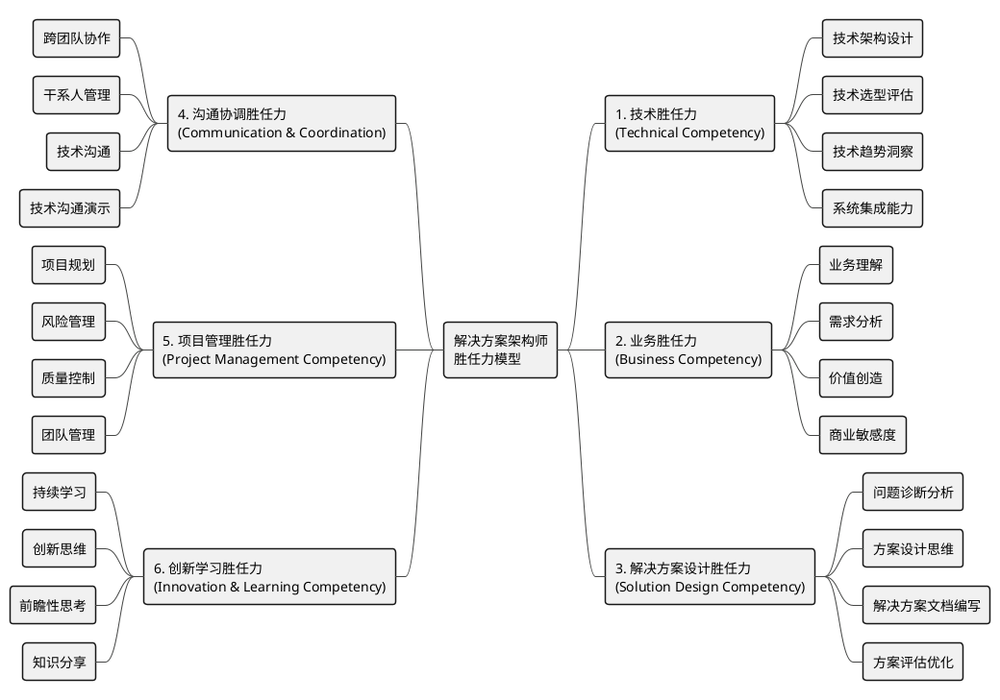
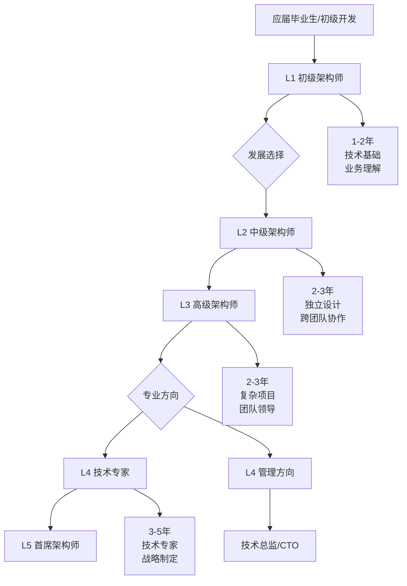

# 解决方案架构师胜任力模型总览

## 🎯 模型概述

解决方案架构师胜任力模型是一个六维度、五级别的综合能力评估框架，旨在为解决方案架构师的选拔、培养、评价和发展提供科学依据。

---

## 🏗️ 六大胜任力维度

---

## 📊 五级能力等级

| 级别 | 名称 | 核心特征 | 工作年限 | 典型职责 |
|------|------|----------|----------|----------|
| **L5** | 首席架构师 | 组织级技术战略制定者 | 12年以上 | 制定技术战略、引领行业发展 |
| **L4** | 专家级架构师 | 技术领域专家和团队领导者 | 8-12年 | 建立技术标准、指导团队发展 |
| **L3** | 高级架构师 | 领导复杂项目的架构设计 | 5-8年 | 主导大型项目、建立技术体系 |
| **L2** | 中级架构师 | 独立完成中等复杂度架构设计 | 2-5年 | 独立架构设计、跨团队协作 |
| **L1** | 初级架构师 | 在指导下完成基础架构工作 | 0-2年 | 参与架构设计、学习成长 |

---

## 🎯 关键能力要求

### 1. 技术胜任力 (权重35%)

#### 🔧 技术架构设计
- **L1**: 理解基本架构模式，参与简单架构设计
- **L2**: 独立设计中等复杂度架构，运用常见架构模式
- **L3**: 设计复杂系统架构，创新性运用架构模式
- **L4**: 设计企业级架构，定义架构标准和规范
- **L5**: 制定组织级架构战略，引领架构技术发展

#### ⚖️ 技术选型评估
- **L1**: 了解主流技术栈，参与技术调研
- **L2**: 独立进行技术选型，评估技术可行性
- **L3**: 主导复杂项目技术选型，平衡多种约束条件
- **L4**: 制定技术选型标准，指导团队技术决策
- **L5**: 制定组织技术战略，引领技术方向

### 2. 业务胜任力 (权重20%)

#### 🏢 业务理解
- **L1**: 了解基本业务流程，理解项目背景
- **L2**: 深入理解业务领域，识别业务需求
- **L3**: 成为业务领域专家，洞察业务本质
- **L4**: 跨领域业务专家，指导业务创新
- **L5**: 战略级业务洞察，引领业务变革

#### 💰 价值创造
- **L1**: 理解技术价值，参与价值评估
- **L2**: 识别项目价值点，量化技术收益
- **L3**: 创造显著业务价值，优化价值实现
- **L4**: 建立价值评估体系，最大化组织价值
- **L5**: 制定价值战略，引领价值创新

### 3. 解决方案设计胜任力 (权重25%)

#### 🔍 问题诊断分析
- **L1**: 识别表面问题，收集基础信息
- **L2**: 运用分析工具，挖掘深层需求
- **L3**: 系统性问题诊断，洞察根本原因
- **L4**: 建立诊断体系，指导问题分析
- **L5**: 制定诊断战略，引领分析方法

#### 💡 方案设计思维
- **L1**: 理解设计原理，参与方案设计
- **L2**: 运用设计框架，独立设计方案
- **L3**: 建立设计思维，创新设计方法
- **L4**: 建立设计标准，指导设计工作
- **L5**: 制定设计战略，引领设计创新

#### 📝 解决方案文档编写
- **L1**: 编写基础方案文档，参与文档评审
- **L2**: 独立编写完整方案，运用标准框架
- **L3**: 建立文档标准，创新表达方式
- **L4**: 制定文档规范，建设文档体系
- **L5**: 制定文档战略，引领文档标准

#### ⚖️ 方案评估优化
- **L1**: 参与方案评估，提出改进建议
- **L2**: 建立评估标准，优化方案设计
- **L3**: 建立评估体系，引领方案创新
- **L4**: 制定评估策略，建设优化文化
- **L5**: 制定优化战略，引领评估标准

### 4. 沟通协调胜任力 (权重15%)

#### 🤝 跨团队协作
- **L1**: 配合团队工作，参与协作活动
- **L2**: 主动协调资源，促进团队合作
- **L3**: 领导跨团队协作，建立协作机制
- **L4**: 建立协作文化，优化协作效率
- **L5**: 制定协作战略，引领协作变革

#### 👥 干系人管理
- **L1**: 了解项目干系人，维护工作关系
- **L2**: 主动管理干系人，平衡各方需求
- **L3**: 建立干系人网络，影响关键决策
- **L4**: 构建影响力体系，推动组织变革
- **L5**: 建立生态网络，引领行业发展

#### 🗣️ 技术沟通
- **L1**: 清晰表达技术观点，参与技术讨论
- **L2**: 向业务方解释技术，制作技术演示
- **L3**: 影响技术决策，建立技术共识
- **L4**: 建立沟通标准，培养沟通能力
- **L5**: 制定沟通战略，引领沟通文化

#### 🎤 技术沟通演示
- **L1**: 基础技术演示，参与方案展示
- **L2**: 独立进行技术演示，设计演示流程
- **L3**: 高效的方案演示，推广演示文化
- **L4**: 制定演示标准，建设展示体系
- **L5**: 制定演示战略，引领展示文化

### 5. 项目管理胜任力 (权重10%)

#### 📋 项目规划
- **L1**: 参与项目规划，完成分配任务
- **L2**: 独立制定项目计划，管理项目进度
- **L3**: 规划复杂项目，优化项目流程
- **L4**: 建立规划标准，指导项目规划
- **L5**: 制定项目战略，引领项目管理

#### ⚠️ 风险管理
- **L1**: 识别基础风险，参与风险评估
- **L2**: 建立风险清单，制定应对措施
- **L3**: 建立风险体系，预防重大风险
- **L4**: 制定风险策略，建设风险文化
- **L5**: 制定风险战略，引领风险管理

#### ✅ 质量控制
- **L1**: 遵守质量标准，参与质量检查
- **L2**: 建立质量流程，监控质量指标
- **L3**: 建立质量体系，持续质量改进
- **L4**: 制定质量策略，建设质量文化
- **L5**: 制定质量战略，引领质量管理

#### 👨‍💼 团队管理
- **L1**: 协助团队工作，支持团队目标
- **L2**: 指导团队成员，协调团队工作
- **L3**: 建设高效团队，培养团队能力
- **L4**: 建立管理体系，培养管理人才
- **L5**: 制定人才战略，引领团队发展

### 6. 创新学习胜任力 (权重5%)

#### 📚 持续学习
- **L1**: 主动学习新技术，参与培训活动
- **L2**: 建立学习体系，指导他人学习
- **L3**: 引领技术学习，建设学习文化
- **L4**: 制定学习策略，建设学习组织
- **L5**: 制定学习战略，引领学习变革

#### 💡 创新思维
- **L1**: 思考改进方法，提出优化建议
- **L2**: 创新解决方案，推广创新实践
- **L3**: 引领技术创新，建设创新文化
- **L4**: 制定创新策略，建设创新体系
- **L5**: 制定创新战略，引领创新生态

#### 🔮 前瞻性思考
- **L1**: 关注技术趋势，思考未来发展
- **L2**: 分析发展趋势，制定应对计划
- **L3**: 预判技术方向，制定前瞻策略
- **L4**: 建立前瞻体系，指导战略规划
- **L5**: 制定前瞻战略，引领未来发展

#### 🤝 知识分享
- **L1**: 分享工作经验，参与技术交流
- **L2**: 主动分享知识，建立分享机制
- **L3**: 建设知识体系，推广分享文化
- **L4**: 制定分享策略，建设知识组织
- **L5**: 制定知识战略，引领知识生态

---

## 🚀 发展路径

### 典型职业发展轨迹

### 各级别发展重点

#### L1 → L2 发展路径
- **技术能力**: 掌握主流架构模式，完成中型项目设计
- **业务理解**: 深入了解1-2个业务领域
- **沟通技巧**: 学会向非技术人员解释技术概念
- **时间周期**: 1-2年

#### L2 → L3 发展路径  
- **领导能力**: 主导大型项目架构设计
- **影响力**: 在组织内建立技术影响力
- **跨领域**: 整合多业务领域需求
- **时间周期**: 2-3年

#### L3 → L4 发展路径
- **战略思维**: 制定部门级技术发展战略
- **团队建设**: 建设高效的架构师团队
- **行业专家**: 成为特定领域的技术专家
- **时间周期**: 2-3年

#### L4 → L5 发展路径
- **生态建设**: 建立技术生态系统
- **思想领导**: 发表行业影响力的技术观点
- **商业价值**: 通过技术创新创造显著商业价值
- **时间周期**: 3-5年

---

## 📋 评估与应用

### 评估维度权重
- **技术胜任力**: 25% - 核心专业能力
- **业务胜任力**: 20% - 业务价值创造
- **解决方案设计胜任力**: 25% - 方案设计核心能力  
- **沟通协调胜任力**: 15% - 协作影响力
- **项目管理胜任力**: 10% - 执行落地能力
- **创新学习胜任力**: 5% - 持续发展能力

### 应用场景
- **招聘选拔**: 制定职位要求，设计面试流程
- **绩效考核**: 设定绩效目标，评估工作表现
- **培训发展**: 识别能力短板，制定培训计划
- **职业规划**: 明确发展方向，设计成长路径
- **团队建设**: 优化团队结构，提升整体能力

### 评估方法
- **技术评审**: 代码评审、方案评审、技术答辩
- **项目考核**: 项目成果、问题解决、团队贡献
- **360度评估**: 上级、同事、下级、客户多角度评价
- **行为面试**: STAR方法、案例分析、情景模拟

---

## 📚 学习资源推荐

### 技术能力提升
- **系统设计**: [System Design Primer](https://github.com/donnemartin/system-design-primer)
- **架构模式**: [Microservices.io](https://microservices.io/)
- **云计算**: [AWS/Azure/GCP 架构指南](./优秀软件解决方案文档资源汇总.md)
- **企业架构**: [TOGAF 框架](https://www.opengroup.org/togaf)

### 业务能力发展  
- **行业洞察**: [McKinsey Insights](https://www.mckinsey.com/featured-insights)
- **商业分析**: [Harvard Business Review](https://hbr.org/)
- **需求分析**: [Business Analysis Body of Knowledge](https://www.iiba.org/)

### 软技能培养
- **沟通技巧**: [Toastmasters International](https://www.toastmasters.org/)
- **领导力**: [Center for Creative Leadership](https://www.ccl.org/)
- **项目管理**: [Project Management Institute](https://www.pmi.org/)

---

## 🎯 快速自评

### 30秒快速自评

请根据您当前的能力水平，在每个维度选择最符合的级别：

**技术胜任力**: □ L1 □ L2 □ L3 □ L4 □ L5  
**业务胜任力**: □ L1 □ L2 □ L3 □ L4 □ L5  
**解决方案设计胜任力**: □ L1 □ L2 □ L3 □ L4 □ L5
**沟通协调胜任力**: □ L1 □ L2 □ L3 □ L4 □ L5  
**项目管理胜任力**: □ L1 □ L2 □ L3 □ L4 □ L5  
**创新学习胜任力**: □ L1 □ L2 □ L3 □ L4 □ L5  

**综合评估**: 最常选择的级别即为您当前的大致水平

### 发展优先级判断

**最需要提升的3个能力**:
1. ________________________________
2. ________________________________  
3. ________________________________

**下一步行动计划**:
- ________________________________
- ________________________________
- ________________________________

---

## 📖 相关文档

- **[完整胜任力模型文档](./解决方案架构师胜任力模型.md)** - 详细的能力定义和发展指南
- **[胜任力评估工具](./解决方案架构师胜任力评估工具.md)** - 专业的能力评估表格
- **[软件解决方案文档资源汇总](./优秀软件解决方案文档资源汇总.md)** - 学习资源推荐

---

*基于科学的胜任力模型理论，结合解决方案架构师岗位特点制定*  
*适用于个人发展规划、团队能力建设、组织人才管理*

*最后更新: 2025年7月14日*
