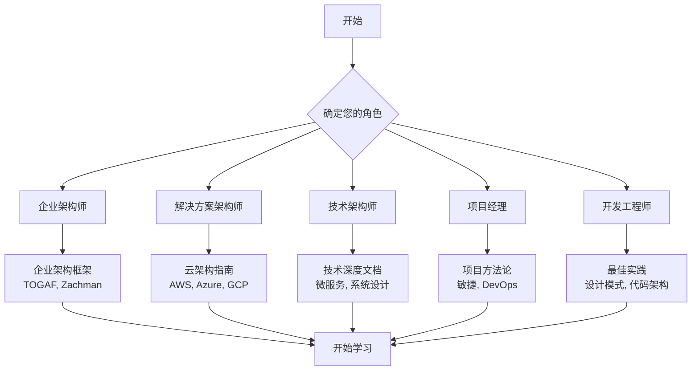
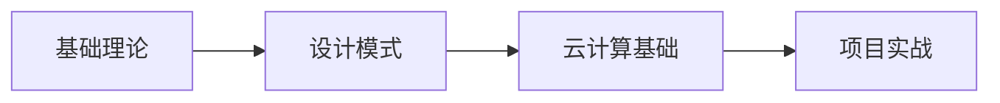
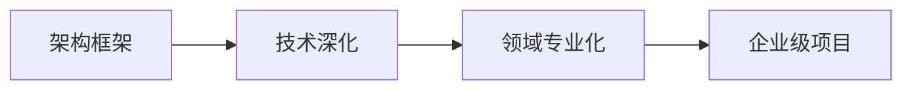
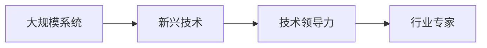

# 软件解决方案文档导航中心

## 🎯 欢迎来到解决方案文档资源中心

这里汇集了从业务价值到技术实现完整链条的优秀软件解决方案文档。无论您是企业架构师、解决方案架构师、技术负责人还是项目经理，都能在这里找到适合的参考资料。

---

## 🗺️ 导航地图



---

## 📚 核心文档

### 1. 📖 [优秀软件解决方案文档资源汇总](./优秀软件解决方案文档资源汇总.md)
> **主文档** - 包含37个精选的软件解决方案文档资源
> 
> 🔥 **亮点**: 涵盖企业架构、云计算、AI、区块链等全技术栈
> 
> ⏱️ **阅读时间**: 30-45分钟

### 2. 🚀 [软件解决方案文档快速参考指南](./软件解决方案文档快速参考指南.md)
> **快速查找** - 按角色、技术、时间投入分类的快速参考
> 
> 🔥 **亮点**: 对比表格、质量评级、实用工具推荐
> 
> ⏱️ **阅读时间**: 10-15分钟

### 3. 🎨 [解决方案文档核心框架演示](./解决方案文档核心框架演示.md)
> **实战模板** - Marp演示文档，展示文档编写最佳实践
> 
> 🔥 **亮点**: 可视化框架、实际案例、实用模板
> 
> ⏱️ **阅读时间**: 20-30分钟

---

## 🎯 按角色快速导航

### 👨‍💼 企业架构师
```
📋 关注点: 业务与技术对齐、标准化、治理
🎯 推荐文档:
  • TOGAF 企业架构框架
  • Zachman Framework
  • McKinsey Digital Insights
  • DoDAF 国防部架构框架
```
**[立即查看企业架构师专用资源 →](./优秀软件解决方案文档资源汇总.md#企业架构框架)**

### 👨‍💻 解决方案架构师
```
📋 关注点: 技术选型、架构设计、实施策略
🎯 推荐文档:
  • AWS/Azure/GCP 架构指南
  • 云设计模式
  • 微服务架构
  • 系统设计入门
```
**[立即查看解决方案架构师专用资源 →](./优秀软件解决方案文档资源汇总.md#云原生解决方案)**

### 🔧 技术架构师
```
📋 关注点: 技术深度、性能优化、系统设计
🎯 推荐文档:
  • Martin Fowler 架构指南
  • 系统设计入门
  • 技术公司工程博客
  • 开源项目架构文档
```
**[立即查看技术架构师专用资源 →](./优秀软件解决方案文档资源汇总.md#系统设计指南)**

### 📊 数据架构师
```
📋 关注点: 数据战略、分析平台、数据治理
🎯 推荐文档:
  • 现代数据堆栈
  • 实时数据分析
  • 数据湖和数据仓库
  • 数据网格架构
```
**[立即查看数据架构师专用资源 →](./优秀软件解决方案文档资源汇总.md#数据驱动解决方案)**

### 🛡️ 安全架构师
```
📋 关注点: 安全策略、合规性、风险管理
🎯 推荐文档:
  • 零信任安全架构
  • 云安全框架
  • DevSecOps实践
  • 合规标准指南
```
**[立即查看安全架构师专用资源 →](./优秀软件解决方案文档资源汇总.md#安全与合规解决方案)**

---

## 🏭 按行业快速导航

### 🏭 制造业
- **数字化转型**: Siemens Digital Industries
- **工业4.0**: GE Digital Solutions
- **智能制造**: 德国工业4.0平台

### 🏦 金融服务
- **金融科技**: AWS Financial Services
- **区块链金融**: Hyperledger Projects
- **风险管理**: Basel III Framework

### 🏥 医疗健康
- **数字化医疗**: Microsoft Healthcare
- **医疗AI**: NVIDIA Clara Platform
- **合规性**: HIPAA Compliance Guide

### 🏢 零售电商
- **电商平台**: Shopify Architecture
- **推荐系统**: Amazon Personalize
- **供应链**: Walmart Tech Blog

### 🎓 教育科技
- **在线教育**: Coursera Engineering
- **学习管理**: Canvas LMS Architecture
- **教育AI**: IBM Watson Education

---

## 🔥 热门技术领域

### 🤖 人工智能
```
🎯 核心资源:
• NVIDIA AI Enterprise - AI解决方案架构
• MLOps.org - 机器学习运营
• OpenAI Platform - AI应用开发
• Google AI Platform - 云端AI服务
```

### ☁️ 云原生
```
🎯 核心资源:
• Cloud Native Computing Foundation
• Kubernetes 官方文档
• 12-Factor App 方法论
• 云设计模式集合
```

### 🔗 区块链
```
🎯 核心资源:
• Hyperledger Foundation
• Ethereum Development Guide
• Web3 Architecture Patterns
• DeFi 协议设计
```

### 📊 大数据
```
🎯 核心资源:
• Apache Foundation Projects
• Databricks Lakehouse Platform
• Snowflake Data Cloud
• Real-time Analytics Guide
```

---

## ⚡ 快速开始

### 🎯 15分钟快速了解
1. 阅读 **[快速参考指南](./软件解决方案文档快速参考指南.md)** (10分钟)
2. 选择适合您角色的资源 (5分钟)

### 📚 1小时深度学习
1. 选择1-2个重点文档深度阅读 (45分钟)
2. 制定学习和实践计划 (15分钟)

### 🚀 一周掌握框架
1. 系统学习选定的架构框架 (5天)
2. 结合实际项目进行验证 (2天)

---

## 📈 学习路径推荐

### 🎓 初级路径 (0-2年经验)


### 🚀 中级路径 (2-5年经验)


### 🏆 高级路径 (5年以上)


**[查看详细学习路径 →](./优秀软件解决方案文档资源汇总.md#推荐学习路径)**

---

## 🛠️ 实用工具箱

### 📝 模板库
- **架构设计文档模板**
- **技术决策记录(ADR)模板**
- **项目规划模板**
- **风险评估模板**

### 🔧 在线工具
- **Draw.io** - 架构图绘制
- **PlantUML** - 代码化图表
- **Miro** - 协作设计
- **Notion** - 知识管理

### 📊 评估框架
- **架构成熟度评估**
- **技术债务分析**
- **ROI计算模型**
- **安全风险评估**

---

## 💡 使用建议

### ✅ 最佳实践
- **按需选择**: 根据具体项目需求选择相关文档
- **实践验证**: 将理论知识应用到实际项目中
- **持续学习**: 定期更新知识，关注技术趋势
- **知识分享**: 与团队分享经验和最佳实践

### ⚠️ 注意事项
- **时效性检查**: 确保参考的文档是最新版本
- **适用性评估**: 考虑文档内容是否适合您的技术栈
- **渐进式学习**: 避免一次性学习过多内容
- **实战导向**: 重视实际应用而非理论记忆

---

## 🤝 社区支持

### 💬 交流平台
- **GitHub Discussions** - 开源项目讨论
- **Stack Overflow** - 技术问题解答
- **Reddit r/softwarearchitecture** - 架构师社区
- **LinkedIn Groups** - 专业人士网络

### 📧 联系方式
- **技术咨询**: 通过GitHub Issues提问
- **文档建议**: 欢迎提供改进建议
- **资源推荐**: 分享您发现的优质资源

---

## 🔄 持续更新

本文档资源库会持续更新，包括：
- 新增优质文档资源
- 更新已有资源的状态
- 补充新兴技术领域
- 完善学习路径

**最后更新**: 2025年7月14日  
**下次更新**: 2025年8月14日

---

*🎯 开始您的架构师成长之旅，选择适合的文档资源，开启学习模式！*
