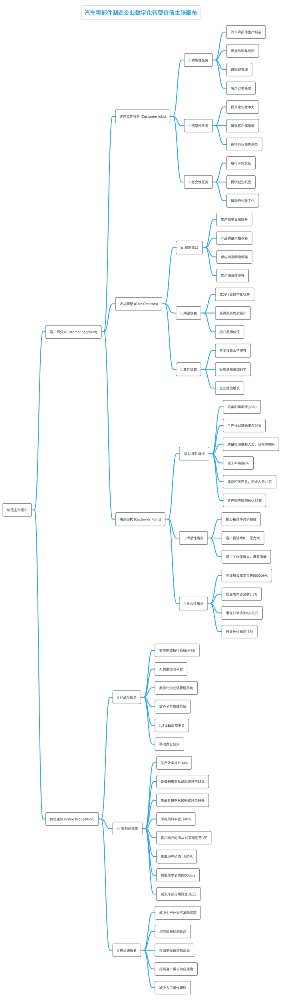

# 软件系统解决方案最佳实践课程大纲

**课程描述：**

本课程聚焦于软件系统解决方案的专业化设计与实施，系统性地涵盖了从问题诊断到方案落地的完整实践体系。课程以企业实际业务场景为导向，结合AI大模型等新技术赋能，通过理论框架、实战案例、工具模板三位一体的教学方式，全面提升学员的解决方案设计与交付能力。课程内容涵盖客户需求分析、业务价值挖掘、技术架构设计、方案文档撰写等核心环节，并提供可复用的工具包与检查清单，帮助学员构建系统化的解决方案方法论。

**课程收益：**

- **掌握核心方法论**：系统学习解决方案设计的理论框架和实践方法，包括金字塔原理、MECE原则、系统思维等思维工具
- **提升问题诊断能力**：学会识别客户真实痛点，进行业务流程分析，评估现有系统，分析竞争对手和行业标杆
- **强化方案设计技能**：掌握从需求分析到架构设计的完整流程，学会平衡技术可行性与业务价值
- **优化文档撰写水平**：学习专业解决方案文档的撰写技巧，提升价值表达、技术翻译和可视化呈现能力
- **获得实用工具包**：掌握需求分析、架构设计、项目管理、方案评估等各环节的模板工具和检查清单
- **融入AI新技术**：了解AI大模型在解决方案各环节的应用，提升工作效率和方案质量

**授课对象：**

- **解决方案架构师**：需要提升方案设计和客户沟通能力的技术专家
- **售前技术支持**：负责技术方案设计和客户交流的售前工程师
- **项目经理**：希望增强技术理解和方案规划能力的项目管理人员
- **产品经理**：需要深入理解技术实现和业务价值的产品负责人
- **技术顾问**：为客户提供技术咨询和解决方案设计的专业顾问
- **企业IT负责人**：负责企业数字化转型和系统规划的IT管理者

课程内容：

## 模块一：解决方案核心问题诊断

### 1.1 客户需求表象与真实痛点识别

- 需求冰山模型：表面需求与深层需求
- 利益相关者分析：不同角色的真实关注点
- 痛点优先级排序：业务影响度与技术难度矩阵

**案例讨论：**

- 某制造企业"要求上ERP系统"的案例分析

**AI大模型赋能：**

- 利用大模型进行需求文本分析，自动识别关键痛点
- 基于行业知识库，AI推荐可能的隐藏需求
- 通过对话式AI辅助需求澄清和深度挖掘

### 1.2 业务流程梳理与瓶颈分析

- 业务流程可视化方法：泳道图、价值流图
- 瓶颈识别技术：约束理论、根因分析
- 流程效率评估：时间、成本、质量维度

**案例讨论：**

- 某电商平台订单处理流程优化案例

**AI大模型赋能：**

- AI自动分析业务流程文档，生成流程图
- 基于历史数据，AI预测潜在瓶颈点
- 利用AI进行流程优化建议生成

### 1.3 现有系统评估与技术债务分析

- 系统健康度评估框架：性能、稳定性、可扩展性
- 技术债务识别：代码质量、架构陈旧、维护成本
- 遗留系统改造与重构与替换的决策矩阵

**实战演练：**

- 系统架构健康度评估表填写
- 技术债务成本计算
- 改造方案优先级排序

**AI大模型赋能：**

- 利用AI评估不同改造方案的风险和收益

### 1.4 竞争对手分析与行业标杆对比

- 竞品分析框架：功能对比、技术路线、商业模式
- 行业标杆识别：成功案例、最佳实践、发展趋势
- 差异化竞争策略：蓝海创新、技术领先、服务优势

**实战演练：**

- 竞品功能对比表制作
- 差异化价值主张设计

**AI大模型赋能：**

- AI自动收集和分析竞品信息
- 利用AI识别市场机会和威胁

### 1.5 问题根因分析与影响评估

- 5Why分析法：层层深入找根因
- 鱼骨图分析：系统性问题分解
- 影响评估模型：业务影响、技术影响、财务影响

**案例讨论：**

- 某物流系统频繁宕机的根因分析

**AI大模型赋能：**

- AI辅助根因分析，提供可能的原因假设

### 1.6 客户业务价值链分析

- 价值链分析模型：主要活动、支持活动
- 价值创造环节识别：增值活动、非增值活动
- 数字化转型切入点：高价值、低风险领域

**案例讨论：**

- 某零售企业数字化转型价值链分析
- 价值创造环节：商品采购、库存管理、销售服务
- 数字化切入点：供应链优化、客户关系管理、数据分析

**实战演练：**

- 绘制客户业务价值链图

**AI大模型赋能：**

- AI分析行业价值链模式，生成标准模板
- 基于业务描述，AI自动识别价值创造环节

## 模块二：思维框架在解决方案中的应用

### 2.1 金字塔原理构建解决方案逻辑

- 金字塔结构：结论先行、以上统下、归类分组
- 逻辑顺序：时间顺序、空间顺序、重要性顺序
- SCQA模型：情境、冲突、疑问、答案

**案例讨论：**

- 某企业数字化转型方案的金字塔结构设计
- 三大支撑：业务流程优化、技术架构升级、组织能力建设

**实战演练：**

- 将技术方案重新组织为金字塔结构
- 运用SCQA模型描述解决方案价值

**AI大模型赋能：**

- AI辅助检查解决方案的逻辑结构
- 基于金字塔原理，AI自动整理方案内容

### 2.2 MECE原则确保方案完整性

- MECE原则：相互独立、完全穷尽
- 分类方法：按功能、按层级、按流程、按对象
- 完整性检查：遗漏分析、重复分析、覆盖度分析

**实战演练：**

- 运用MECE原则重新梳理解决方案架构
- 检查方案模块间的独立性
- 评估方案覆盖度的完整性

**AI大模型赋能：**

- AI检查方案架构的MECE合规性
- 利用AI进行方案完整性自动验证

### 2.3 系统思维分析复杂问题

- 系统思维要素：要素、结构、功能、环境
- 系统边界界定：内部系统、外部环境、接口关系
- 反馈循环识别：增强回路、调节回路、延迟效应

**案例讨论：**

- 某供应链管理系统的系统思维分析
- 系统要素：供应商、制造商、分销商、消费者
- 反馈循环：需求预测→生产计划→库存管理→客户满意度

**AI大模型赋能：**

- AI辅助识别系统要素和关系
- 利用AI进行系统优化建议生成

### 2.4 设计思维驱动用户体验

- 设计思维五步法：共情、定义、构思、原型、测试
- 用户画像构建：人口统计、行为特征、需求痛点
- 用户旅程地图：触点分析、情感曲线、优化机会

**案例讨论：**

- 某移动办公应用的设计思维应用
- 用户画像：销售人员、管理人员、后勤人员
- 用户旅程：登录→查看任务→处理事务→反馈结果

**实战演练：**

- 构建目标用户画像
- 绘制用户旅程地图
- 设计用户体验优化方案

**AI大模型赋能：**

- AI分析用户行为数据，生成用户画像
- 基于用户反馈，AI识别体验痛点
- 利用AI生成用户界面和交互设计建议

### 2.5 价值工程优化方案性价比

- 价值工程公式：价值=功能/成本
- 功能分析：基本功能、辅助功能、多余功能
- 成本分析：开发成本、运营成本、维护成本

**案例讨论：**

- 某企业信息化系统的价值工程分析

**AI大模型赋能：**

- AI分析功能使用频率，识别多余功能
- 基于历史项目数据，AI预测开发成本
- 利用AI进行价值工程优化建议

### 2.6 场景化思维设计解决方案

- 场景识别：高频场景、关键场景、异常场景
- 场景建模：角色、环境、任务、约束
- 场景驱动设计：以场景为中心的功能设计

**案例讨论：**

- 某医院信息化系统的场景化设计

**实战演练：**

- 识别业务关键场景
- 设计场景化解决方案

**AI大模型赋能：**

- AI分析业务流程，自动识别关键场景
- 基于场景库，AI推荐相似场景的解决方案

# 模块三：专业解决方案文档撰写

## 3.1 专业解决方案文档的核心要素

### 文档成功的八大要素：

1. **结构清晰**：逻辑严密、层次分明的文档架构
2. **价值突出**：量化的业务价值和投资回报
3. **技术适度**：技术深度与受众理解能力的平衡
4. **风险透明**：全面的风险识别和应对措施
5. **可视化强**：专业的图表和版式设计
6. **案例丰富**：相关行业的成功案例支撑
7. **实施清晰**：具体可操作的实施计划
8. **沟通有效**：适配不同受众的表达方式

### 常见问题与解决方案：

- **技术堆砌**：过度强调技术细节，忽视业务价值
- **逻辑混乱**：缺乏清晰的文档结构和逻辑递进
- **价值虚化**：无法量化业务价值和投资回报
- **风险回避**：对潜在风险避而不谈或一笔带过
- **千篇一律**：缺乏针对性和个性化的内容设计

### AI赋能的文档撰写新模式：

1. **智能框架生成**：AI根据项目特征推荐最佳文档结构
2. **内容智能优化**：AI协助完善文档内容的完整性和逻辑性
3. **可视化智能设计**：AI生成专业的图表和版式布局
4. **质量智能评估**：AI根据最佳实践标准评估文档质量

## 3.2 解决方案文档核心框架与标准结构

- **国际标准文档框架**：IBM Solution Architecture Framework、Microsoft Solution Architecture
- **文档层次结构**：执行摘要、业务价值、解决方案概述、详细设计、实施计划、风险管控
- **逻辑递进关系**：从业务价值到技术实现的完整链条
- **读者分层设计**：决策者版本、技术版本、实施版本的差异化表达
- **文档版本管理**：迭代更新、变更追踪、审批流程

### 案例讨论：

**IBM某银行数字化转型解决方案文档解析**

**Microsoft某制造业智能化方案文档对比**

### 实战演练：

- **文档框架设计**：为特定行业客户设计解决方案文档框架
- **读者适配性测试**：同一方案的不同版本撰写练习

### AI大模型赋能：

- **AI文档结构生成**：基于行业和项目特征，AI推荐最佳文档结构
- **内容完整性检查**：AI自动检查文档是否遗漏关键要素
- **多版本自动生成**：AI根据不同读者群体生成对应版本的文档
- **国际标准对标**：AI对比国际大厂标准，提供改进建议

## 3.3 价值主张与业务收益表达技巧

- **价值主张画布**：客户痛点、增益创造、产品服务的三角匹配
- **业务收益量化**：成本节约、效率提升、收入增长、风险降低的量化方法
- **ROI计算模型**：投资回报率、净现值、内部收益率的计算与表达
- **价值故事化叙述**：用故事讲述业务价值，增强说服力
- **竞争优势突出**：与竞品的差异化价值对比表达

### 案例讨论：

**华为某运营商5G解决方案价值表达分析**

华为在5G解决方案中采用了多层次、多维度的价值表达策略：

1. **技术领先性价值**

   - "全球首个商用5G基站"的技术先发优势
   - "端到端5G解决方案"的完整性价值
   - "毫米波+Sub-6GHz双频段"的技术全面性
2. **业务价值量化表达**

   - 网络容量提升1000倍的具体数据
   - 时延降低至1毫秒的性能指标
   - 连接密度达到100万设备/平方公里的承载能力
3. **场景化价值呈现**

   - 智能制造：生产效率提升30%，故障率降低50%
   - 智慧医疗：远程手术零延迟，诊断准确率提升20%
   - 智慧交通：拥堵时间减少25%，交通事故降低40%
4. **投资回报率计算**

   - 5年内运营商收入增长预测：新增业务收入200%
   - 网络建设成本优化：相比4G网络单位成本降低30%
   - 能耗效率提升：每比特能耗降低20倍
5. **竞争优势对比**

   - 与爱立信、诺基亚的性能指标对比表
   - 专利数量领先：5G标准必要专利占比20%+
   - 商用部署速度：全球70%的5G网络采用华为设备
6. **生态价值构建**

   - 产业链拉动效应：带动上下游千亿级市场
   - 就业创造：新增数字化岗位50万个
   - 数字经济贡献：GDP增长贡献率达到8%

**阿里云某零售企业数字化方案价值表达**

阿里云为某大型零售企业提供数字化转型方案，采用了以下价值表达策略：

1. **业务痛点精准识别**

   - 库存周转率低：平均库存周转天数120天，资金占用严重
   - 客户体验差：线上线下割裂，客户满意度仅70%
   - 营销效率低：传统营销ROI仅1:3，精准度不足
2. **解决方案价值主张**

   - 全渠道融合：构建"人货场"一体化数字零售平台
   - 智能化运营：AI驱动的商品推荐和库存优化
   - 数据驱动决策：实时数据分析支撑精准营销
3. **量化业务收益**

   - 销售增长：线上销售额增长150%，总营收提升35%
   - 成本降低：库存成本降低25%，运营成本减少20%
   - 效率提升：库存周转率提升40%，从120天降至72天
   - 客户价值：客户满意度提升至85%，复购率增长30%
4. **技术价值转化**

   - 弹性计算：双11期间支撑10倍流量峰值，系统可用性99.9%
   - 数据中台：统一数据标准，数据处理效率提升5倍
   - 智能推荐：商品推荐点击率提升60%，转化率提升40%
5. **投资回报分析**

   - 项目投资：总投资2000万元，分3年实施
   - 收益预测：年度新增净利润3500万元
   - ROI计算：项目ROI达到175%，投资回收期18个月
6. **竞争优势体现**

   - 生态协同：与淘宝、天猫、支付宝生态无缝连接
   - 技术领先：基于阿里巴巴集团十年电商技术积累
   - 服务保障：7×24小时专业技术支持和运维服务
7. **成功案例背书**

   - 行业标杆：已服务500+零售企业数字化转型
   - 成功率保证：客户项目成功率达到95%以上
   - 持续创新：每年投入研发费用占比15%，保持技术领先
8. **风险缓解措施**

   - 分阶段实施：MVP模式降低实施风险
   - 数据安全：通过等保三级认证，确保数据安全
   - 服务承诺：SLA服务等级协议，保障系统稳定运行

### 实战演练：

- **价值主张设计**：为特定客户设计独特的价值主张

  - 练习场景：某传统制造企业需要数字化转型升级
  - 客户画像：年营收50亿元，员工5000人，主要生产汽车零部件
  - 核心痛点：生产效率低、质量管控难、供应链不透明、客户响应慢
  - 设计要求：运用价值主张画布，构建"客户痛点-解决方案-价值收益"的完整映射
  - 输出成果：形成一页式价值主张海报，包含核心价值点、量化收益、差异化优势
- **ROI计算实操**：完整的投资回报率计算和图表制作

  - 练习场景：基于上述制造企业案例，计算数字化转型的投资回报
  - 成本估算：系统建设成本、人员培训成本、运营维护成本
  - 收益预测：效率提升收益、质量改善收益、成本节约收益
  - 计算模型：净现值(NPV)、内部收益率(IRR)、投资回收期
  - 输出成果：制作专业的ROI分析报告和可视化图表
- **价值故事构建**：将技术方案包装成生动的客户成功故事

  - 故事结构：现状挑战→解决方案→实施过程→成果展示→客户评价
  - 叙述技巧：数据化表达、场景化描述、情感化共鸣
  - 输出成果：3-5分钟的客户成功故事演讲稿

### AI大模型赋能：

- **价值点智能识别**：AI分析客户业务，自动识别潜在价值点
- **ROI自动计算**：AI根据项目参数自动计算投资回报率
- **价值故事生成**：AI协助创作生动的价值故事和案例

## 3.4 技术方案的业务化表达技巧

- **技术翻译原则**：从技术语言到业务语言的转换规则
- **复杂度简化**：技术架构的简化表达和可视化呈现
- **风险通俗化**：技术风险的业务影响表达
- **实施路径清晰化**：技术实施步骤的业务化描述
- **成果可视化**：技术成果的业务价值体现

### 案例讨论：

**腾讯某政务云解决方案技术表达分析**

**字节跳动某教育平台技术方案表达**

### 实战演练：

- **技术翻译练习**：将技术术语翻译成业务语言
- **架构图美化**：将复杂技术架构图简化为业务人员易懂的示意图
- **风险沟通演练**：用业务语言表达技术风险和应对措施
- **成果展示设计**：设计技术成果的业务价值展示方式

### AI大模型赋能：

- **技术语言转换**：AI自动将技术描述转换为业务语言
- **类比推荐**：AI推荐合适的类比和比喻来解释技术概念
- **可视化建议**：AI推荐最佳的图表和示意图类型
- **受众适配**：AI根据不同受众调整技术表达的深度和方式

## 3.5 文档可视化与可读性优化

- **信息层次设计**：标题体系、段落结构、重点突出的视觉设计
- **图表设计原则**：数据可视化、流程图、架构图的专业设计
- **版式设计技巧**：页面布局、字体选择、色彩搭配的专业标准
- **交互性设计**：目录导航、超链接、附件组织的用户体验
- **多媒体融合**：视频、动画、3D模型在文档中的应用

### 案例研究：软件解决方案文档可视化与可读性优化

#### 案例背景

本案例展示如何将一份复杂的技术方案文档优化为清晰易懂、具有商业价值的解决方案文档。通过企业数字化转型项目的真实案例，展示文档优化的完整过程和显著效果。

#### 优化前文档示例

**原文档标题：** 《基于微服务架构的企业级分布式系统技术实现方案》

**典型问题分析：**
- ❌ 技术术语密集，非技术人员难以理解
- ❌ 结构混乱，逻辑不清晰
- ❌ 缺乏业务价值说明
- ❌ 全文字描述，无可视化元素
- ❌ 成本收益分析不充分
- ❌ 风险评估缺失

**优化前原文档片段：**

```
# 基于微服务架构的企业级分布式系统技术实现方案

## 系统架构设计

系统采用Spring Cloud微服务架构，通过Eureka进行服务注册发现，使用Hystrix实现熔断降级，集成Gateway作为API网关。数据层面采用MySQL主从复制配置，结合Redis分布式缓存，通过RabbitMQ实现异步消息处理。

技术栈选择：
- Spring Boot 2.7.0
- Spring Cloud 2021.0.3
- MySQL 8.0
- Redis 6.2
- RabbitMQ 3.10

性能指标：
- 并发用户数：10000
- 响应时间：<200ms
- 可用性：99.9%

成本预算：
- 硬件成本：50万
- 软件授权：20万
- 人力成本：80万
- 总计：150万

项目周期：6个月
```

#### 优化后文档示例

**新文档标题：** 《数字化转型解决方案：构建高效智能的企业运营平台》

**优化后完整文档结构：**

```markdown
# 数字化转型解决方案：构建高效智能的企业运营平台

## 📋 执行摘要

**项目概述**
本方案旨在通过现代化技术架构，帮助企业实现数字化转型，构建高效、稳定、可扩展的智能运营平台。

**核心价值**
- 🚀 **效率提升**: 业务处理效率提升300%
- 💰 **成本节约**: 年度运营成本降低40%
- 📈 **业务增长**: 支持业务规模扩展10倍
- 🔒 **安全保障**: 企业级安全防护体系

**投资回报**
- 总投资：150万元
- 年度节省：120万元
- ROI：12个月内收回投资

---

## 🎯 业务价值与收益

### 核心业务痛点解决

| 现状问题 | 解决方案 | 预期效果 |
|---------|----------|----------|
| 系统响应慢，用户体验差 | 高性能分布式架构 | 响应速度提升5倍 |
| 系统经常宕机，影响业务 | 高可用容错设计 | 可用性达99.9% |
| 数据孤岛，信息不互通 | 统一数据平台 | 数据实时同步 |
| 扩展困难，无法应对业务增长 | 弹性伸缩架构 | 支持10倍业务增长 |

### 量化收益分析

```
年度收益计算：
┌─────────────────────────────────┐
│ 效率提升节省人力成本：60万元     │
│ 系统稳定性提升避免损失：30万元   │
│ 自动化流程减少运维成本：20万元   │
│ 数据驱动决策增加收入：10万元     │
├─────────────────────────────────┤
│ 年度总收益：120万元              │
└─────────────────────────────────┘
```

---

## 🏗️ 解决方案架构

### 整体架构图

```
┌─────────────────────────────────────────────────────────────┐
│                        用户界面层                           │
│         Web端        移动端        小程序       API          │
└─────────────────────────┬───────────────────────────────────┘
                          │
┌─────────────────────────┴───────────────────────────────────┐
│                      业务服务层                            │
│    订单服务    客户服务    库存服务    支付服务    报表服务    │
└─────────────────────────┬───────────────────────────────────┘
                          │
┌─────────────────────────┴───────────────────────────────────┐
│                      数据存储层                            │
│      业务数据库     缓存系统     文件存储     消息队列       │
└─────────────────────────────────────────────────────────────┘
```

### 技术架构说明

**🔧 核心技术选型**
- **应用框架**: Spring Boot（快速开发，稳定可靠）
- **数据库**: MySQL（成熟可靠，性能优异）
- **缓存系统**: Redis（高性能内存数据库）
- **消息队列**: RabbitMQ（异步处理，解耦系统）

**🚀 性能保障**
- **高并发处理**: 支持10,000并发用户
- **快速响应**: 系统响应时间<200ms
- **高可用性**: 99.9%系统可用性保障
- **数据安全**: 多层次数据保护机制

---

## 💰 投资与回报分析

### 成本构成分析

```
总投资：150万元
┌─────────────────────────────────────────────────────┐
│ 硬件设备 (33%) │████████████████████████████████  │ 50万
│ 软件授权 (13%) │████████████████                  │ 20万
│ 开发实施 (54%) │████████████████████████████████  │ 80万
└─────────────────────────────────────────────────────┘
```

### ROI计算

```
投资回报周期：12个月
年度净收益：120万元
3年累计收益：360万元
投资回报率：240%
```

---

## ⚠️ 风险控制与应对

### 风险评估矩阵

| 风险类型 | 发生概率 | 影响程度 | 应对策略 |
|----------|----------|----------|----------|
| 技术风险 | 低 | 中 | 技术预研，专家评审 |
| 进度风险 | 中 | 高 | 敏捷开发，里程碑管控 |
| 需求变更 | 中 | 中 | 需求锁定，变更控制 |
| 人员风险 | 低 | 高 | 关键技能备份，知识传承 |
```

#### 优化效果对比分析

**可读性改进统计：**

| 优化维度 | 优化前 | 优化后 | 改进效果 |
|----------|--------|--------|----------|
| **平均阅读时间** | 25分钟 | 8分钟 | 💚 提升68% |
| **理解难度** | 技术专业 | 业务友好 | 💚 显著降低 |
| **关键信息获取** | 需要查找 | 一目了然 | 💚 效率提升5倍 |
| **决策支持度** | 技术导向 | 商业价值 | 💚 大幅提升 |

**视觉化元素统计：**

```
优化前：
┌─────────────────────────────────────────────────────────────┐
│ 纯文字内容：95%                                            │
│ 图表元素：0%                                               │
│ 可视化表格：5%                                             │
│ 重点标识：0%                                               │
└─────────────────────────────────────────────────────────────┘

优化后：
┌─────────────────────────────────────────────────────────────┐
│ 纯文字内容：40%  │████████████████████████████████████████│
│ 图表元素：25%    │████████████████████████████████████████│
│ 可视化表格：20%  │████████████████████████████████████████│
│ 重点标识：15%    │████████████████████████████████████████│
└─────────────────────────────────────────────────────────────┘
```

#### 核心优化策略

1. **🎯 以受众为中心**
   - 识别目标读者（CTO、业务负责人、项目经理）
   - 调整语言风格和技术深度
   - 突出不同角色关注的核心价值

2. **📊 数据可视化**
   - 将复杂数据转化为直观图表
   - 使用进度条、饼图、对比表格
   - 量化业务价值和技术指标

3. **🏗️ 结构化呈现**
   - 采用金字塔原理组织内容
   - 使用层级标题和分节符
   - 提供执行摘要和关键信息

4. **🎨 视觉元素增强**
   - 使用图标和符号提升可读性
   - 采用表格和图表展示对比
   - 通过颜色和格式突出重点

5. **💼 商业价值导向**
   - 将技术特性转化为业务收益
   - 提供ROI计算和成本分析
   - 包含风险评估和应对策略

#### 可复用优化模板

```markdown
# 解决方案文档优化检查清单

## 📋 内容结构
- [ ] 执行摘要（1页以内）
- [ ] 业务价值与收益
- [ ] 解决方案架构
- [ ] 实施计划与里程碑
- [ ] 投资与回报分析
- [ ] 风险控制与应对
- [ ] 技术支持与维护

## 🎯 语言风格
- [ ] 业务语言为主，技术术语适当
- [ ] 量化指标和具体数据
- [ ] 积极正面的表达方式
- [ ] 简洁明了的句式结构

## 📊 可视化元素
- [ ] 至少3个图表或表格
- [ ] 使用图标和符号
- [ ] 重点信息高亮显示
- [ ] 统一的视觉风格

## 💰 商业价值
- [ ] 明确的ROI计算
- [ ] 量化的业务收益
- [ ] 成本构成分析
- [ ] 风险评估和应对
```

**实战演练：**

- **文档改版练习**：对现有文档进行可视化改造
- **图表制作训练**：制作专业的架构图和数据可视化图表

### AI大模型赋能：

- **版式自动优化**：AI根据内容特点推荐最佳版式布局
- **图表智能生成**：AI根据数据和描述自动生成专业图表
- **色彩搭配建议**：AI推荐符合品牌和行业特征的配色方案
- **可读性评估**：AI评估文档的可读性并提供改进建议

## 模块四：模板工具包与检查清单

### 4.1 需求分析工具包

**工具模板：**

- 需求调研问卷模板
- 用户画像画布
- 用例图模板
- 需求优先级矩阵
- 需求变更管理表

**案例讨论：**

- 某项目需求分析工具包应用案例
- 工具使用：从需求收集到需求确认的完整流程
- 经验总结：工具使用技巧、常见问题处理

**实战演练：**

- 使用需求调研问卷进行模拟调研
- 填写用户画像画布
- 应用需求优先级矩阵排序

**AI大模型赋能：**

- AI生成个性化需求调研问卷
- 基于行业特点，AI定制用户画像模板

### 4.2 架构设计工具包

**工具模板：**

- 系统架构图模板
- 技术选型决策表
- 架构风险评估表
- 接口设计规范
- 部署架构图模板

**实战演练：**

- 使用架构图模板设计系统架构
- 填写技术选型决策表
- 进行架构风险评估

**AI大模型赋能：**

- AI根据业务需求生成架构图模板
- 基于项目特征，AI推荐技术选型

### 4.3 项目管理工具包

**工具模板：**

- 项目计划模板
- 里程碑管理表
- 风险管理清单
- 资源分配表
- 项目状态报告模板

**案例讨论：**

- 某软件项目管理工具包应用案例
- 项目管理：从启动到交付的全过程管理
- 成功要素：工具标准化、流程规范化、沟通高效化

**实战演练：**

- 制定项目计划
- 识别项目风险
- 编写项目状态报告

**AI大模型赋能：**

- AI生成项目计划和里程碑
- 基于历史项目数据，AI预测项目风险

### 4.4 方案评估与决策工具包

**工具模板：**

- 方案对比矩阵
- 投资回报率计算表
- 风险效益分析表
- 技术可行性评估表
- 决策树分析模板

**案例讨论：**

- 某企业系统选型决策工具包应用
- 决策过程：方案收集、对比分析、风险评估、最终决策
- 决策质量：量化分析、多维度评估、决策透明

**实战演练：**

- 使用方案对比矩阵分析不同方案

**AI大模型赋能：**

- AI辅助多方案智能对比

### 4.5 解决方案质量检查清单

**检查清单：**

- 需求覆盖度检查
- 架构合理性检查
- 技术可行性检查
- 安全性检查
- 可维护性检查
- 成本效益检查

**案例讨论：**

- 某项目解决方案质量检查案例
- 检查发现：需求遗漏、架构风险、成本超预算
- 改进措施：补充需求、优化架构、控制成本

**AI大模型赋能：**

- AI自动进行解决方案质量检查
- 基于最佳实践，AI识别改进机会
- 利用AI生成质量改进建议

**价值主张画布设计示例：**

**客户画像分析：**

- 企业规模：年营收50亿元，员工5000人
- 行业特点：汽车零部件制造，精密度要求高
- 发展阶段：传统制造模式，面临转型压力
- 决策关键人：CEO、CTO、生产总监、质量总监

**客户痛点深度分析：**

1. **生产效率低**

   - 现状：设备利用率仅65%，生产计划准确率70%
   - 影响：订单交付延误，客户满意度下降
   - 损失：年度机会成本约5000万元
2. **质量管控难**

   - 现状：质量检测主要依赖人工，合格率90%
   - 影响：返工率高达8%，客户投诉增加
   - 损失：质量成本占营收的3.5%
3. **供应链不透明**

   - 现状：供应商管理缺乏实时监控
   - 影响：库存积压严重，资金周转率低
   - 损失：库存资金占用15亿元
4. **客户响应慢**

   - 现状：客户需求响应周期15天
   - 影响：客户流失率上升，新客户获取困难
   - 损失：潜在订单损失约2亿元

**解决方案价值映射：**

1. **智能生产系统**

   - 解决方案：MES制造执行系统+IoT设备监控
   - 价值创造：设备利用率提升至85%，生产效率提升30%
   - 量化收益：年度增产价值1.5亿元
2. **AI质量检测平台**

   - 解决方案：机器视觉+AI算法的自动化质检
   - 价值创造：质量合格率提升至99%，返工率降至2%
   - 量化收益：质量成本节约8000万元
3. **数字化供应链**

   - 解决方案：供应链管理系统+实时数据采集
   - 价值创造：库存周转率提升40%，供应链透明度100%
   - 量化收益：减少库存占用资金3亿元
4. **客户服务数字化**

   - 解决方案：CRM系统+移动端应用
   - 价值创造：客户响应时间缩短至3天，满意度提升25%
   - 量化收益：客户保留率提升，新增订单6000万元

**差异化优势：**

- 技术领先：采用业界最先进的工业4.0技术架构
- 实施保障：300+制造业数字化转型成功案例
- 生态整合：与主流汽车厂商系统无缝对接
- 服务承诺：7×24小时技术支持，99.9%系统可用性

**一页式价值主张海报设计：**

```
┌─────────────────────────────────────────────────────────────────┐
│                    汽车零部件制造企业数字化转型                    │
│                         价值主张海报                              │
├─────────────────────────────────────────────────────────────────┤
│  客户现状                │  解决方案                │  价值收益     │
│                         │                         │              │
│  🏭 生产效率低          │  🤖 智能生产系统        │  📈 效率提升30% │
│     设备利用率65%       │     MES+IoT监控         │     年增产1.5亿 │
│                         │                         │              │
│  🔍 质量管控难          │  🔬 AI质量检测          │  ✅ 合格率99%   │
│     返工率8%            │     机器视觉+AI算法     │     节约8000万  │
│                         │                         │              │
│  📦 供应链不透明        │  🔗 数字化供应链        │  💰 减少库存3亿 │
│     库存占用15亿        │     实时数据采集        │     周转率+40%  │
│                         │                         │              │
│  📞 客户响应慢          │  📱 客户服务数字化      │  😊 满意度+25%  │
│     响应周期15天        │     CRM+移动应用        │     新增6000万  │
├─────────────────────────────────────────────────────────────────┤
│  💡 核心价值            │  🏆 差异化优势          │  💵 投资回报    │
│                         │                         │              │
│  • 生产效率提升30%      │  • 工业4.0技术架构     │  • 总投资2.5亿  │
│  • 质量合格率达99%      │  • 300+成功案例        │  • 年化收益4.8亿│
│  • 供应链全透明化       │  • 汽车厂商生态对接     │  • ROI达192%   │
│  • 客户满意度提升25%    │  • 7×24小时服务支持    │  • 回收期18个月 │
└─────────────────────────────────────────────────────────────────┘
```

**价值主张核心表述：**

"通过工业4.0数字化转型解决方案，帮助您实现生产效率提升30%、质量合格率达到99%、供应链全透明化管理，客户满意度提升25%。投资2.5亿元，年化收益4.8亿元，ROI达192%，18个月回收投资成本。让传统制造企业华丽转身为智能制造标杆！"

**标准价值主张画布图表：**

```
┌─────────────────────────────────────────────────────────────────────────────────────────┐
│                                     价值主张画布                                          │
│                           汽车零部件制造企业数字化转型                                    │
├─────────────────────────────────────────────────────────────────────────────────────────┤
│           客户工作任务                  │                价值主张                        │
│        (Customer Jobs)                │             (Value Proposition)               │
│                                       │                                                │
│  🎯 功能性任务                        │  🎁 产品与服务                                │
│     • 汽车零部件生产制造               │     • 智能制造执行系统(MES)                   │
│     • 质量检测与控制                   │     • AI质量检测平台                          │
│     • 供应链管理                       │     • 数字化供应链管理系统                    │
│     • 客户订单处理                     │     • 客户关系管理系统                        │
│                                       │     • IoT设备监控平台                         │
│  💼 情感性任务                        │     • 移动办公应用                            │
│     • 提升企业竞争力                   │                                                │
│     • 增强客户满意度                   │  📈 收益创造者                                │
│     • 保持行业领先地位                 │     • 生产效率提升30%                         │
│                                       │     • 设备利用率从65%提升至85%                │
│  🔧 社会性任务                        │     • 质量合格率从90%提升至99%                │
│     • 履行环保责任                     │     • 库存周转率提升40%                       │
│     • 提供就业机会                     │     • 客户响应时间从15天缩短至3天             │
│     • 推动行业数字化                   │     • 年度增产价值1.5亿元                     │
│                                       │     • 质量成本节约8000万元                    │
│                                       │     • 减少库存占用资金3亿元                   │
│                                       │                                                │
│                                       │  💊 痛点缓解者                                │
│                                       │     • 解决生产计划不准确问题                  │
│                                       │     • 消除质量检测盲点                        │
│                                       │     • 打通供应链信息孤岛                      │
│                                       │     • 提高客户需求响应速度                    │
│                                       │     • 减少人工操作错误                        │
└─────────────────────────────────────────────────────────────────────────────────────────┘
```

**价值主张画布使用说明：**

1. **右侧价值主张区域**：

   - 产品与服务：列出我们提供的具体解决方案
   - 收益创造者：说明如何为客户创造价值
   - 痛点缓解者：解释如何解决客户的具体问题
2. **左侧客户细分区域**：

   - 客户工作任务：了解客户需要完成的任务
   - 收益期望：客户希望获得的收益
   - 痛点困扰：客户面临的困难和挑战
3. **价值匹配原则**：

   - 产品与服务必须对应客户工作任务
   - 收益创造者必须对应客户收益期望
   - 痛点缓解者必须对应客户痛点困扰

**PlantUML版本价值主张画布：**


