# 部署架构图模板

## 📋 模板使用说明

本模板用于设计和文档化系统的部署架构，包括环境规划、基础设施设计、服务部署和运维监控等方面。

---

## 🎯 部署架构概览

### 整体部署架构

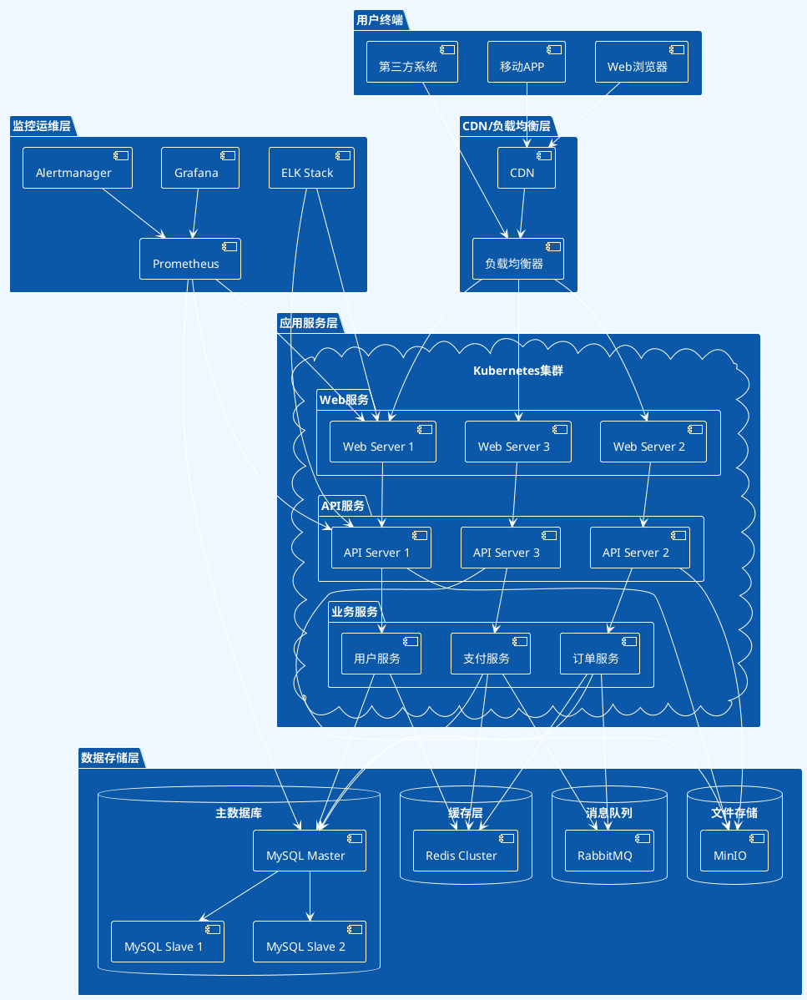

### 网络架构图

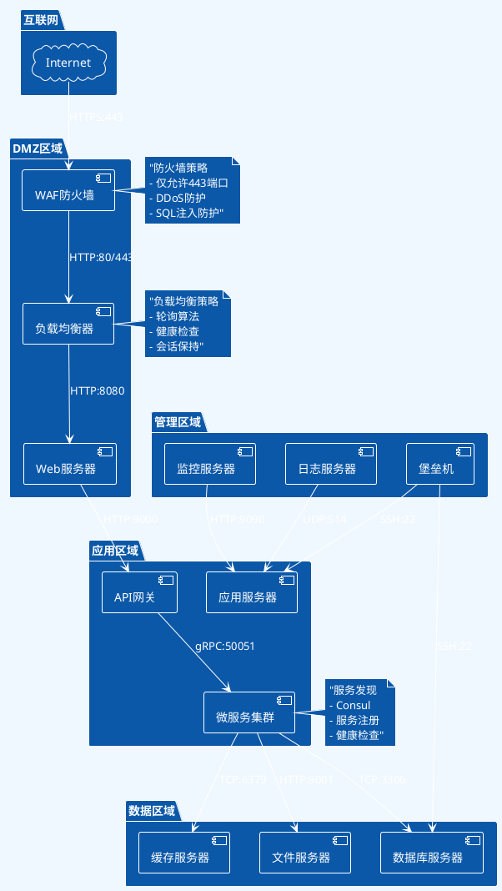

---

## 🏗️ 环境规划

### 环境架构矩阵

| 环境 | 用途 | 配置规模 | 访问控制 | 数据同步 |
|------|------|----------|----------|----------|
| **开发环境** | 日常开发测试 | 最小配置 | 开发团队 | 模拟数据 |
| **测试环境** | 功能验证 | 中等配置 | 测试团队 | 脱敏数据 |
| **预发环境** | 生产验证 | 生产配置 | 运维团队 | 生产数据副本 |
| **生产环境** | 线上服务 | 高可用配置 | 严格控制 | 实时数据 |

### 环境部署拓扑

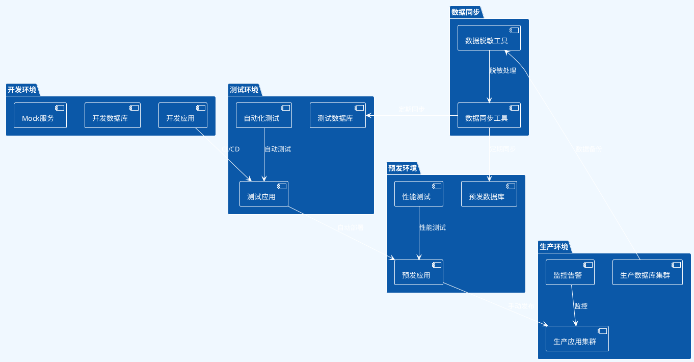

---

## ☁️ 云架构设计

### 多云部署架构

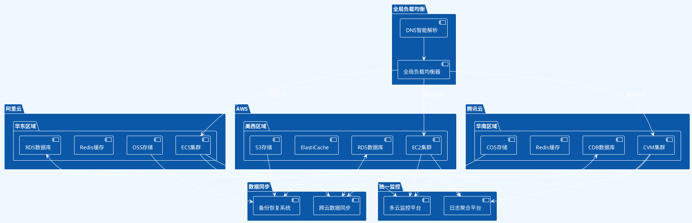

### 容器化部署架构

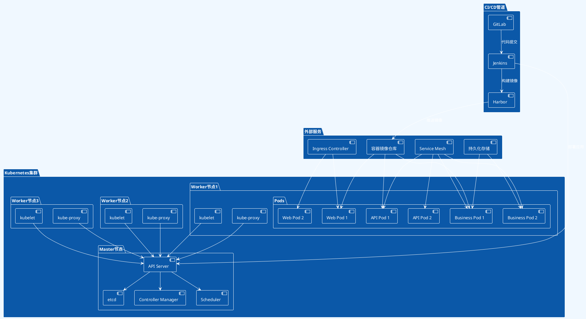

---

## 📊 服务部署规划

### 服务部署策略

| 服务类型 | 部署策略 | 实例数量 | 资源配置 | 扩缩容策略 |
|----------|----------|----------|----------|------------|
| **Web服务** | 蓝绿部署 | 3+ | 2C4G | 基于CPU使用率 |
| **API服务** | 滚动更新 | 5+ | 4C8G | 基于请求量 |
| **业务服务** | 金丝雀发布 | 3+ | 4C8G | 基于业务指标 |
| **数据服务** | 主从部署 | 1主2从 | 8C16G | 手动扩容 |
| **缓存服务** | 集群部署 | 3+ | 2C4G | 基于内存使用率 |

### 部署时序图

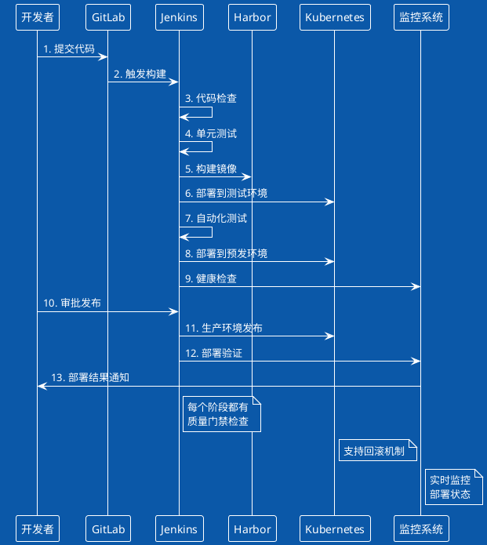

---

## 🔧 基础设施配置

### 服务器配置规范

#### 生产环境配置

```yaml
# Web服务器配置
web_servers:
  instance_type: "c5.xlarge"  # 4vCPU, 8GB RAM
  min_instances: 3
  max_instances: 10
  disk_size: "100GB SSD"
  network: "1Gbps"
  
# API服务器配置
api_servers:
  instance_type: "c5.2xlarge"  # 8vCPU, 16GB RAM
  min_instances: 5
  max_instances: 20
  disk_size: "200GB SSD"
  network: "10Gbps"
  
# 数据库服务器配置
database_servers:
  master:
    instance_type: "r5.4xlarge"  # 16vCPU, 128GB RAM
    disk_size: "2TB SSD"
    iops: 10000
    backup: "daily"
  slaves:
    count: 2
    instance_type: "r5.2xlarge"  # 8vCPU, 64GB RAM
    disk_size: "1TB SSD"
    iops: 5000
    
# 缓存服务器配置
cache_servers:
  redis_cluster:
    nodes: 6
    instance_type: "r5.large"  # 2vCPU, 16GB RAM
    memory: "15GB"
    persistence: true
```

#### 网络配置

```yaml
# VPC网络配置
vpc_config:
  cidr_block: "10.0.0.0/16"
  
  subnets:
    public:
      web_subnet_1: "10.0.1.0/24"  # 可用区1
      web_subnet_2: "10.0.2.0/24"  # 可用区2
      
    private:
      app_subnet_1: "10.0.11.0/24"  # 应用层
      app_subnet_2: "10.0.12.0/24"
      db_subnet_1: "10.0.21.0/24"   # 数据层
      db_subnet_2: "10.0.22.0/24"
      
# 安全组配置
security_groups:
  web_sg:
    inbound:
      - port: 80, source: "0.0.0.0/0"
      - port: 443, source: "0.0.0.0/0"
    outbound:
      - port: 8080, destination: "app_sg"
      
  app_sg:
    inbound:
      - port: 8080, source: "web_sg"
    outbound:
      - port: 3306, destination: "db_sg"
      - port: 6379, destination: "cache_sg"
      
  db_sg:
    inbound:
      - port: 3306, source: "app_sg"
```

---

## 📈 监控运维架构

### 监控架构图

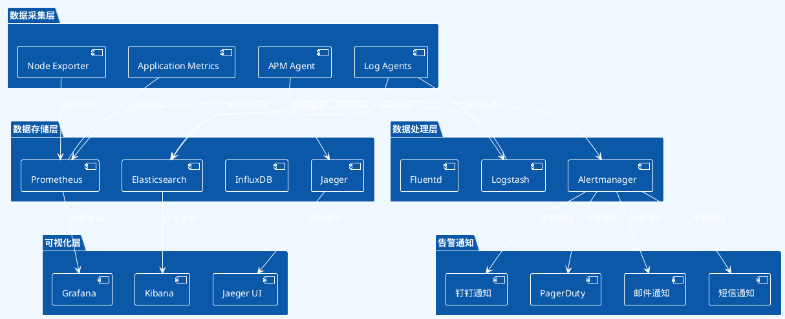

### 监控指标体系

#### 基础设施监控

| 监控维度 | 关键指标 | 告警阈值 | 采集频率 |
|----------|----------|----------|----------|
| **CPU** | 使用率、负载 | >80% | 30s |
| **内存** | 使用率、可用内存 | >85% | 30s |
| **磁盘** | 使用率、IO等待 | >90% | 1m |
| **网络** | 带宽、丢包率 | >80% | 30s |

#### 应用监控

| 监控维度 | 关键指标 | 告警阈值 | 采集频率 |
|----------|----------|----------|----------|
| **请求量** | QPS、TPS | 基线±30% | 1m |
| **响应时间** | 平均、P95、P99 | >1s | 1m |
| **错误率** | 4xx、5xx错误率 | >1% | 1m |
| **业务指标** | 转化率、成功率 | 基线±20% | 5m |

### 日志管理架构

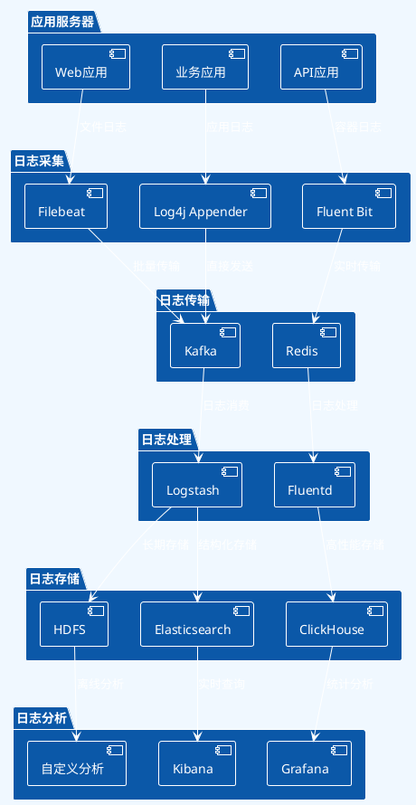

---

## 🔐 安全架构设计

### 安全防护体系

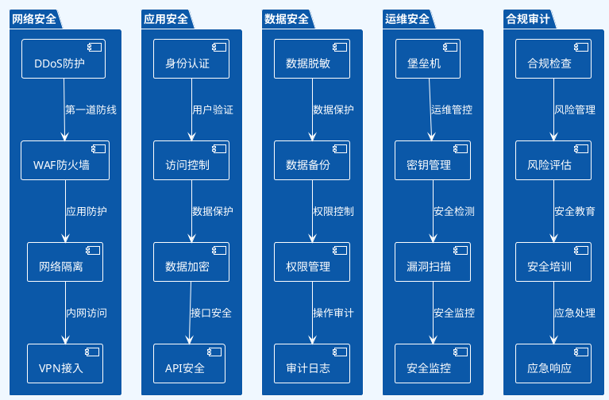

### 安全配置清单

#### 网络安全配置

```yaml
# 防火墙规则
firewall_rules:
  inbound:
    - name: "HTTP"
      port: 80
      protocol: "tcp"
      source: "0.0.0.0/0"
    - name: "HTTPS"
      port: 443
      protocol: "tcp"
      source: "0.0.0.0/0"
    - name: "SSH"
      port: 22
      protocol: "tcp"
      source: "管理IP段"
      
  outbound:
    - name: "Database"
      port: 3306
      protocol: "tcp"
      destination: "数据库IP段"

# SSL/TLS配置
ssl_config:
  certificate: "Let's Encrypt"
  protocols: ["TLSv1.2", "TLSv1.3"]
  cipher_suites: ["ECDHE-RSA-AES256-GCM-SHA384"]
  hsts_enabled: true
  hsts_max_age: 31536000
```

---

## 🚀 容灾备份方案

### 容灾架构图

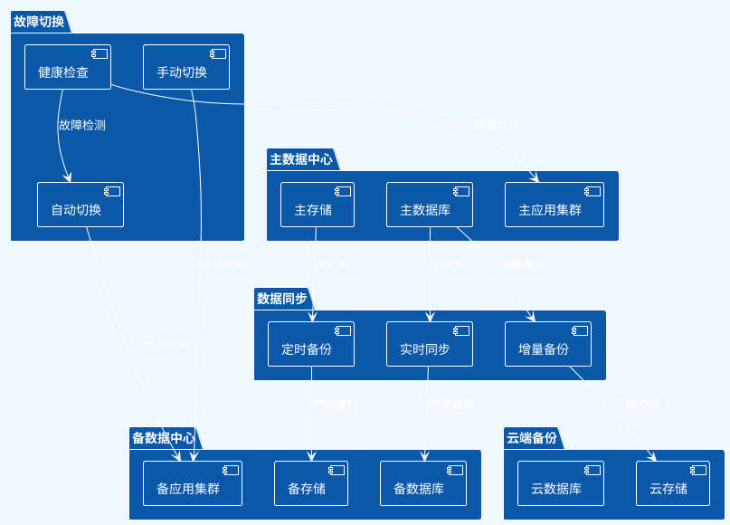

### 备份恢复策略

| 数据类型 | 备份方式 | 备份频率 | 保留时间 | RTO | RPO |
|----------|----------|----------|----------|-----|-----|
| **核心数据库** | 实时同步+定时备份 | 15分钟 | 30天 | <5分钟 | <1分钟 |
| **业务数据** | 增量备份 | 1小时 | 7天 | <30分钟 | <1小时 |
| **文件存储** | 定时同步 | 6小时 | 30天 | <1小时 | <6小时 |
| **配置文件** | 版本控制 | 实时 | 永久 | <10分钟 | 0 |
| **日志数据** | 归档备份 | 1天 | 90天 | <2小时 | <24小时 |

---

## 📋 部署检查清单

### 部署前检查

#### 环境准备

- [ ] **服务器资源**：CPU、内存、磁盘、网络
- [ ] **网络配置**：VPC、子网、安全组、DNS
- [ ] **存储配置**：数据库、缓存、文件存储
- [ ] **负载均衡**：配置、健康检查、SSL证书
- [ ] **域名解析**：DNS配置、SSL证书

#### 应用配置

- [ ] **环境变量**：数据库连接、API密钥、配置参数
- [ ] **数据库初始化**：表结构、初始数据、索引
- [ ] **缓存配置**：Redis连接、缓存策略
- [ ] **消息队列**：队列配置、消费者设置
- [ ] **文件上传**：存储配置、权限设置

#### 安全配置

- [ ] **防火墙规则**：端口开放、IP白名单
- [ ] **SSL证书**：证书安装、HTTPS配置
- [ ] **访问控制**：用户权限、API限流
- [ ] **敏感信息**：密钥管理、数据加密
- [ ] **日志配置**：日志级别、审计日志

### 部署后验证

#### 功能验证

- [ ] **服务可用性**：所有服务正常启动
- [ ] **接口测试**：核心API功能正常
- [ ] **数据库连接**：读写操作正常
- [ ] **缓存功能**：缓存读写正常
- [ ] **文件上传**：文件存储正常

#### 性能验证

- [ ] **响应时间**：接口响应时间符合预期
- [ ] **并发处理**：负载测试通过
- [ ] **资源使用**：CPU、内存使用正常
- [ ] **数据库性能**：查询性能符合预期
- [ ] **网络带宽**：网络传输正常

#### 监控验证

- [ ] **监控数据**：指标采集正常
- [ ] **告警配置**：告警规则生效
- [ ] **日志收集**：日志正常输出
- [ ] **链路追踪**：分布式追踪正常
- [ ] **健康检查**：健康检查接口正常

---

## 🔧 运维工具配置

### CI/CD工具链

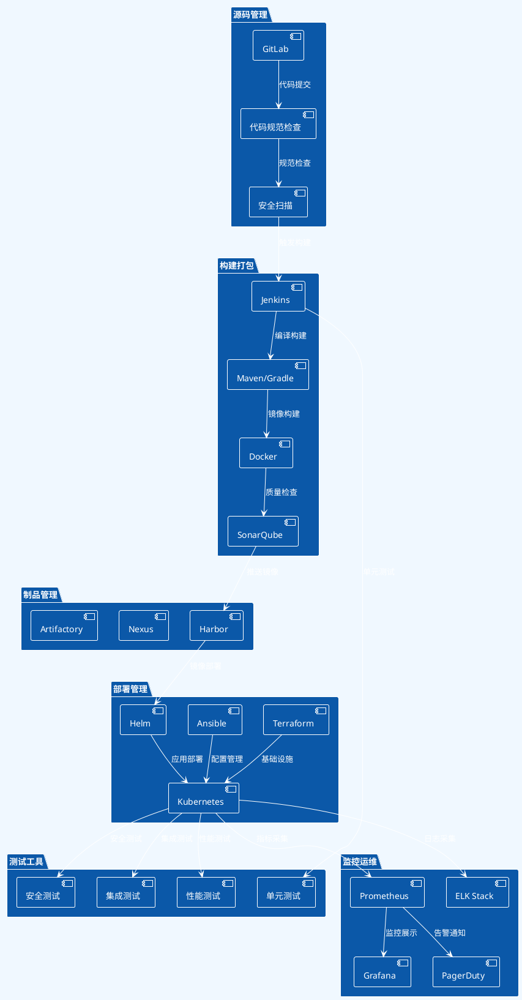

### 运维脚本示例

#### 部署脚本

```bash
#!/bin/bash
# 应用部署脚本

set -e

APP_NAME="myapp"
VERSION=$1
ENVIRONMENT=$2
NAMESPACE="default"

if [ -z "$VERSION" ] || [ -z "$ENVIRONMENT" ]; then
    echo "Usage: $0 <version> <environment>"
    exit 1
fi

echo "部署应用: $APP_NAME"
echo "版本: $VERSION"
echo "环境: $ENVIRONMENT"

# 1. 验证环境
echo "验证Kubernetes连接..."
kubectl cluster-info

# 2. 更新镜像
echo "更新部署镜像..."
kubectl set image deployment/$APP_NAME \
    $APP_NAME=harbor.example.com/$APP_NAME:$VERSION \
    -n $NAMESPACE

# 3. 等待部署完成
echo "等待部署完成..."
kubectl rollout status deployment/$APP_NAME -n $NAMESPACE

# 4. 验证部署
echo "验证部署状态..."
kubectl get pods -l app=$APP_NAME -n $NAMESPACE

# 5. 健康检查
echo "执行健康检查..."
for i in {1..30}; do
    if curl -f http://service-url/health; then
        echo "健康检查通过"
        break
    fi
    echo "健康检查失败，重试中..."
    sleep 10
done

echo "部署完成"
```

#### 回滚脚本

```bash
#!/bin/bash
# 应用回滚脚本

set -e

APP_NAME="myapp"
NAMESPACE="default"

echo "开始回滚应用: $APP_NAME"

# 1. 查看历史版本
echo "查看部署历史..."
kubectl rollout history deployment/$APP_NAME -n $NAMESPACE

# 2. 执行回滚
echo "执行回滚..."
kubectl rollout undo deployment/$APP_NAME -n $NAMESPACE

# 3. 等待回滚完成
echo "等待回滚完成..."
kubectl rollout status deployment/$APP_NAME -n $NAMESPACE

# 4. 验证回滚
echo "验证回滚状态..."
kubectl get pods -l app=$APP_NAME -n $NAMESPACE

echo "回滚完成"
```

---

## 📊 成本优化建议

### 资源成本分析

| 资源类型 | 成本占比 | 优化建议 | 预期节省 |
|----------|----------|----------|----------|
| **计算资源** | 40% | 弹性伸缩、Spot实例 | 20-30% |
| **存储资源** | 25% | 数据分层、压缩 | 15-25% |
| **网络带宽** | 20% | CDN、压缩传输 | 10-20% |
| **数据库** | 10% | 读写分离、缓存 | 15-30% |
| **其他服务** | 5% | 按需使用、预留实例 | 10-15% |

### 自动化运维

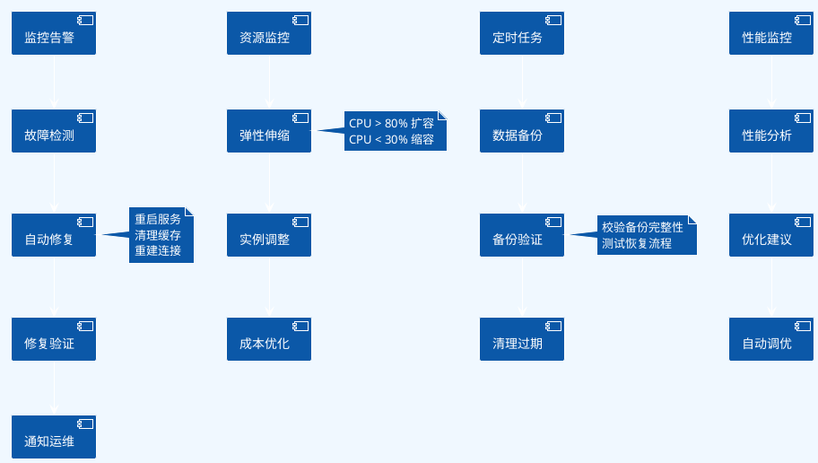

---

## 📚 相关文档

- [系统架构图模板](系统架构图模板.md)
- [技术选型决策表](技术选型决策表.md)
- [架构风险评估表](架构风险评估表.md)
- [接口设计规范](接口设计规范.md)

---

**创建时间**：{当前日期}  
**更新时间**：{当前日期}  
**版本号**：v1.0
