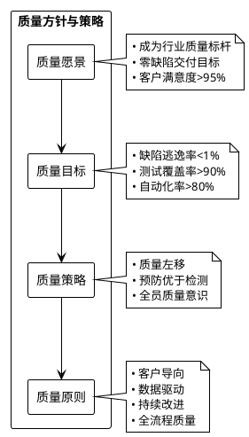
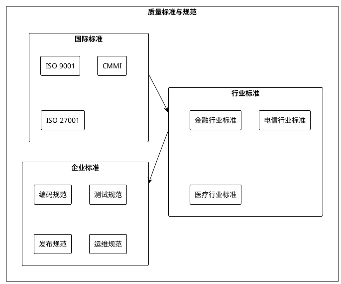
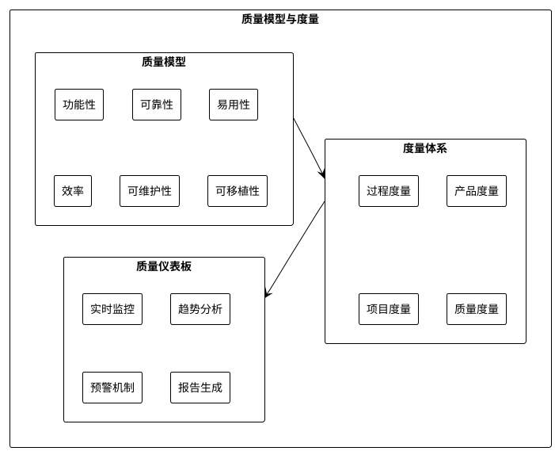
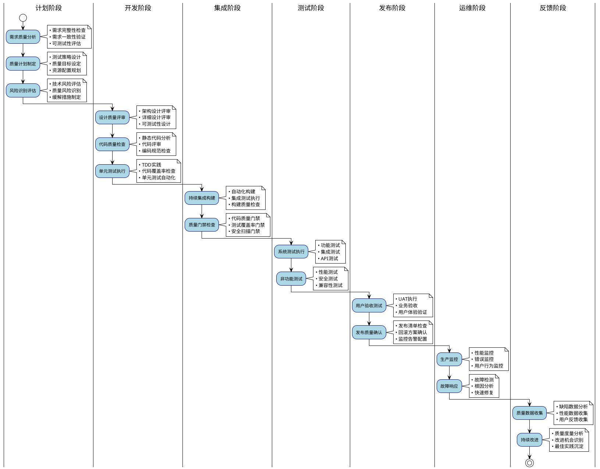
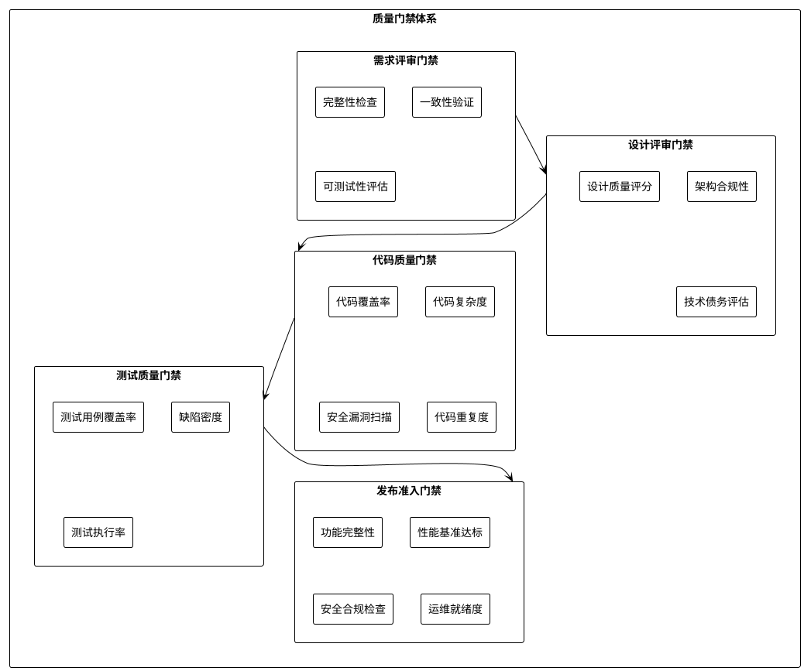
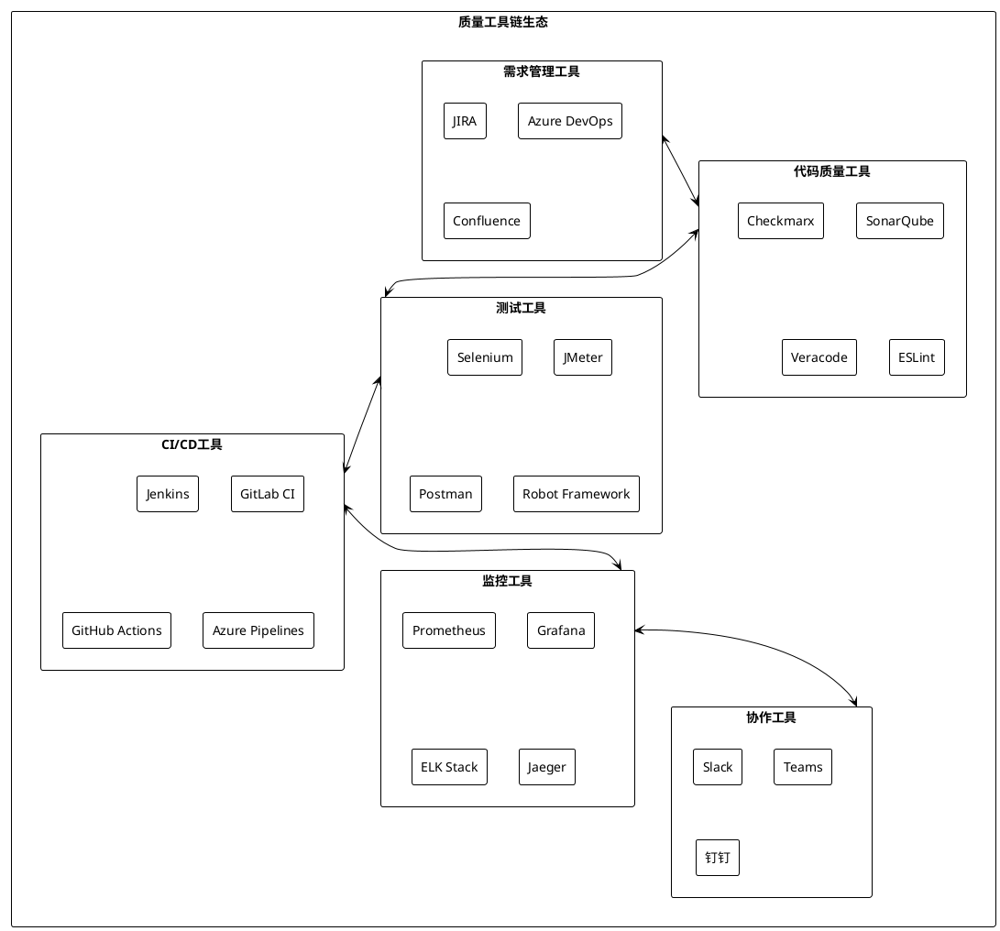
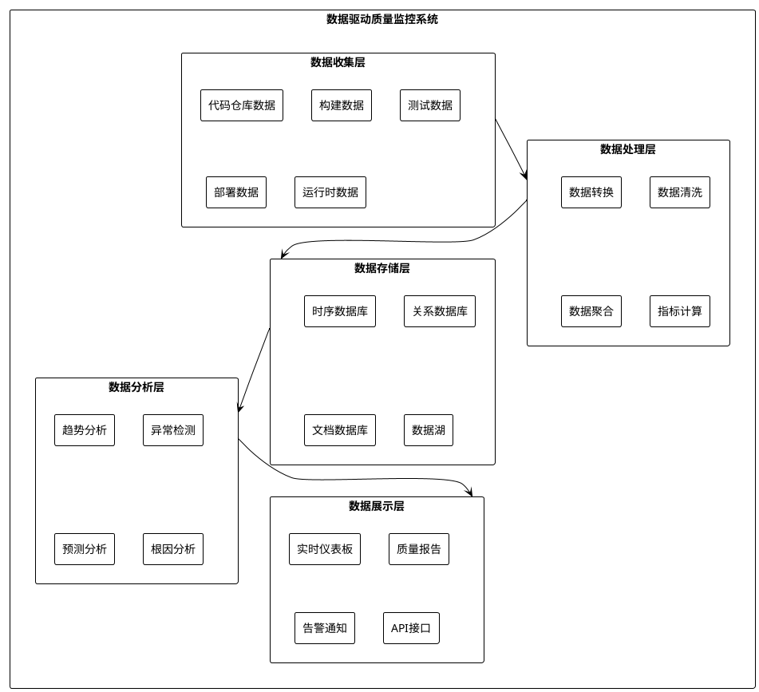
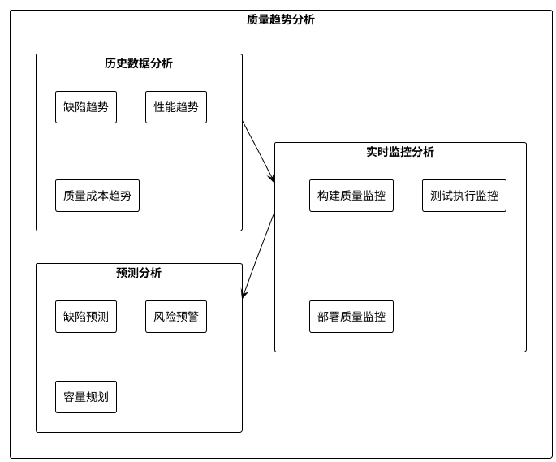
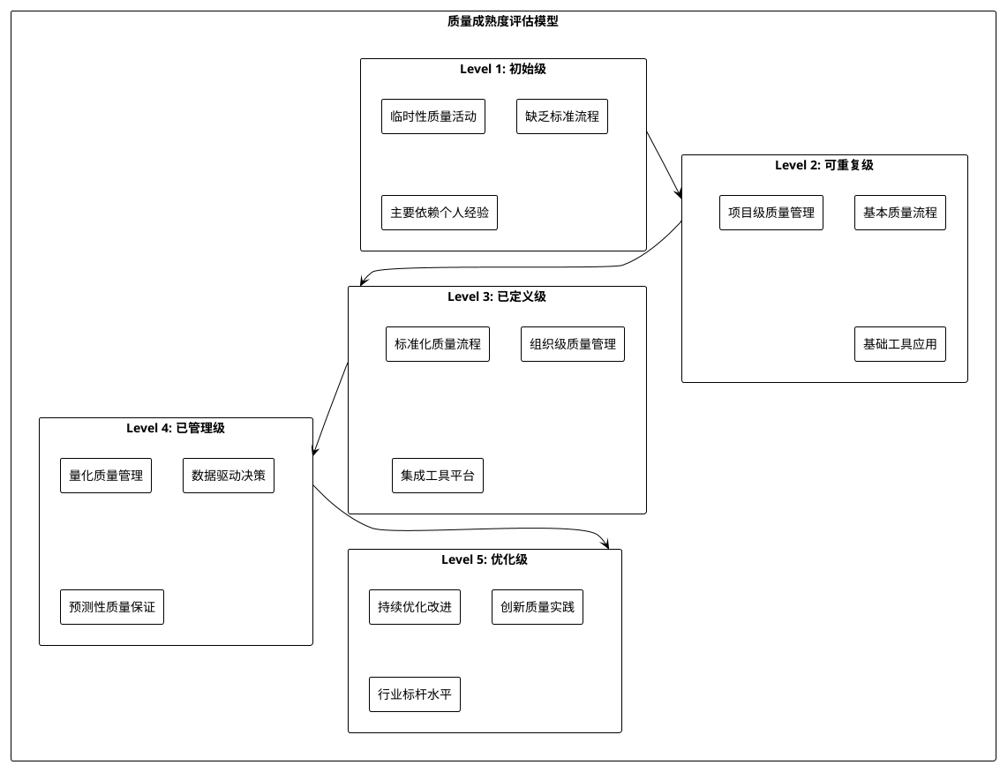

# 软件质量工程体系架构设计

## 📋 概述

基于ThoughtWorks质量灯塔理念，结合DevOps全流程实践，构建现代化软件质量工程体系架构。该体系以"客户需求"为起点，以"客户满意度"为终点，通过组织层次和项目层次的双重保障，确保软件质量的持续改进。

## �️ 质量工程体系架构

### 架构总览

```plantuml
@startuml 软件质量工程体系架构
!theme cerulean-outline
!define ORGANIZATION #E3F2FD
!define DEVOPS #FFF3E0
!define INFRASTRUCTURE #F3E5F5
!define EXTERNAL #E8F5E8

' 设置样式 - 增大字体和组件尺寸
skinparam {
    backgroundColor white
    defaultFontName "Microsoft YaHei"
    defaultFontSize 12
    titleFontSize 18
  
    rectangle {
        FontStyle bold
        FontSize 13
        BorderThickness 3
        Shadowing true
        RoundCorner 10
        MinimumWidth 200
        MinimumHeight 80
    }
  
    note {
        BackgroundColor #FFFDE7
        BorderColor #F57F17
        FontStyle italic
        FontSize 11
        MinimumWidth 180
    }
  
    arrow {
        FontSize 11
        Thickness 2
    }
}

!procedure $org_style()
    skinparam rectangle<<org>> {
        BackgroundColor ORGANIZATION
        BorderColor #1976D2
        FontColor #0D47A1
        FontSize 14
        MinimumWidth 250
        MinimumHeight 100
    }
!endprocedure

!procedure $devops_style()
    skinparam rectangle<<devops>> {
        BackgroundColor DEVOPS
        BorderColor #F57C00
        FontColor #E65100
        FontSize 13
        MinimumWidth 220
        MinimumHeight 90
    }
!endprocedure

!procedure $infra_style()
    skinparam rectangle<<infra>> {
        BackgroundColor INFRASTRUCTURE
        BorderColor #7B1FA2
        FontColor #4A148C
        FontSize 13
        MinimumWidth 240
        MinimumHeight 95
    }
!endprocedure

!procedure $external_style()
    skinparam rectangle<<external>> {
        BackgroundColor EXTERNAL
        BorderColor #388E3C
        FontColor #1B5E20
        FontSize 14
        MinimumWidth 200
        MinimumHeight 70
    }
!endprocedure

$org_style()
$devops_style()
$infra_style()
$external_style()

title <size:20><b>🏗️ 软件质量工程体系架构总览</b></size>\n<size:14><i>基于ThoughtWorks质量灯塔模型的DevOps质量保证体系</i></size>\n

' 外部环境 - 调整布局
rectangle "🎯 <size:14><b>客户需求与期望</b></size>" as INPUT <<external>>
rectangle "📊 <size:14><b>客户满意度与价值交付</b></size>" as OUTPUT <<external>>

' 组织层次 - 优化布局为2x3网格
rectangle "<size:16><b>🏢 组织层次质量管理</b></size>" as ORG <<org>> {
    rectangle "<size:13><b>🎯 质量愿景与战略</b></size>\n<size:11>• 质量方针制定\n• 质量目标设定\n• 质量战略规划</size>" as VISION
    rectangle "<size:13><b>📋 质量标准与规范</b></size>\n<size:11>• 过程标准定义\n• 产品质量规范\n• 服务质量要求</size>" as STANDARD  
    rectangle "<size:13><b>📐 质量模型与度量</b></size>\n<size:11>• 质量评估模型\n• 关键质量指标\n• 度量数据分析</size>" as MODEL
  
    rectangle "<size:13><b>🛠️ 技术工具与平台</b></size>\n<size:11>• 质量工具链\n• 自动化平台\n• 集成开发环境</size>" as TOOLS
    rectangle "<size:13><b>👥 人员能力建设</b></size>\n<size:11>• 技能培训体系\n• 认证管理\n• 团队协作文化</size>" as PEOPLE
    rectangle "<size:13><b>🔄 持续改进机制</b></size>\n<size:11>• 质量评审\n• 问题分析\n• 改进措施实施</size>" as IMPROVE
  
    VISION -right-> STANDARD : "<size:11>指导制定</size>"
    STANDARD -right-> MODEL : "<size:11>量化评估</size>"
    MODEL -down-> TOOLS : "<size:11>工具支撑</size>"
    PEOPLE -up-> IMPROVE : "<size:11>驱动改进</size>"
    IMPROVE -left-> VISION : "<size:11>反馈优化</size>"
    TOOLS -right-> PEOPLE : "<size:11>能力赋能</size>"
}

' DevOps生命周期质量活动 - 采用3x2网格布局
rectangle "<size:16><b>🔄 DevOps生命周期质量活动</b></size>" as PROJECT <<devops>> {
  
    ' 第一行：计划、开发、集成
    rectangle "<size:14><b>📋 计划 Plan</b></size>" as PLAN {
        rectangle "<size:12><b>📝 需求质量分析</b></size>\n<size:10>• 需求完整性检查\n• 可测试性评估\n• 验收标准定义</size>" as REQ_Q
        rectangle "<size:12><b>📊 质量计划制定</b></size>\n<size:10>• 质量目标设定\n• 测试策略规划\n• 质量活动安排</size>" as Q_PLAN
        rectangle "<size:12><b>⚠️ 风险识别评估</b></size>\n<size:10>• 质量风险分析\n• 技术风险评估\n• 缓解措施制定</size>" as RISK
      
        REQ_Q -down-> Q_PLAN
        Q_PLAN -down-> RISK
    }
  
    rectangle "<size:14><b>💻 开发 Dev</b></size>" as DEV {
        rectangle "<size:12><b>🎨 设计质量保证</b></size>\n<size:10>• 架构设计评审\n• 接口设计规范\n• 可维护性检查</size>" as DESIGN_Q
        rectangle "<size:12><b>🔍 代码质量控制</b></size>\n<size:10>• 编码规范检查\n• 静态代码分析\n• 代码覆盖率监控</size>" as CODE_Q
        rectangle "<size:12><b>🧪 单元测试驱动</b></size>\n<size:10>• TDD开发模式\n• 单元测试覆盖\n• Mock对象使用</size>" as UNIT_TEST
      
        DESIGN_Q -down-> CODE_Q
        CODE_Q -down-> UNIT_TEST
    }
  
    rectangle "<size:14><b>🔧 集成 Build</b></size>" as BUILD {
        rectangle "<size:12><b>⚡ 持续集成流水线</b></size>\n<size:10>• 自动化构建\n• 依赖管理\n• 制品版本控制</size>" as CI
        rectangle "<size:12><b>🔗 集成测试验证</b></size>\n<size:10>• 接口测试\n• 组件集成测试\n• 端到端测试</size>" as INT_TEST
        rectangle "<size:12><b>🚪 质量门禁控制</b></size>\n<size:10>• 代码质量检查\n• 测试通过率\n• 安全扫描结果</size>" as GATE
      
        CI -down-> INT_TEST
        INT_TEST -down-> GATE
    }
  
    ' 第二行：测试、发布、运维
    rectangle "<size:14><b>🧪 测试 Test</b></size>" as TEST {
        rectangle "<size:12><b>🖥️ 系统功能测试</b></size>\n<size:10>• 功能完整性验证\n• 业务流程测试\n• 用户场景验证</size>" as SYS_TEST
        rectangle "<size:12><b>⚡ 性能压力测试</b></size>\n<size:10>• 负载测试\n• 压力测试\n• 容量规划验证</size>" as PERF_TEST
        rectangle "<size:12><b>🔒 安全合规测试</b></size>\n<size:10>• 安全漏洞扫描\n• 权限控制验证\n• 数据保护检查</size>" as SEC_TEST
      
        SYS_TEST -down-> PERF_TEST
        PERF_TEST -down-> SEC_TEST
    }
  
    rectangle "<size:14><b>🚀 发布 Release</b></size>" as RELEASE {
        rectangle "<size:12><b>✅ 用户验收测试</b></size>\n<size:10>• UAT测试执行\n• 业务用户验收\n• 上线准备确认</size>" as UAT
        rectangle "<size:12><b>📦 发布质量保证</b></size>\n<size:10>• 发布计划审核\n• 回滚方案准备\n• 发布流程监控</size>" as REL_Q
        rectangle "<size:12><b>🔍 部署验证检查</b></size>\n<size:10>• 环境一致性验证\n• 配置正确性检查\n• 服务可用性确认</size>" as DEPLOY_V
      
        UAT -down-> REL_Q
        REL_Q -down-> DEPLOY_V
    }
  
    rectangle "<size:14><b>🖥️ 运维 Ops</b></size>" as OPS {
        rectangle "<size:12><b>📊 监控告警体系</b></size>\n<size:10>• 实时性能监控\n• 业务指标监控\n• 异常告警机制</size>" as MONITOR
        rectangle "<size:12><b>🚨 故障响应处理</b></size>\n<size:10>• 故障快速定位\n• 应急响应流程\n• 故障根因分析</size>" as INCIDENT
        rectangle "<size:12><b>⚡ 性能持续优化</b></size>\n<size:10>• 系统性能调优\n• 资源使用优化\n• 架构演进升级</size>" as OPTIMIZE
      
        MONITOR -down-> INCIDENT
        INCIDENT -down-> OPTIMIZE
    }
  
    ' 反馈阶段 - 单独放置在下方
    rectangle "<size:14><b>🔄 反馈 Feedback</b></size>" as FEEDBACK {
        rectangle "<size:12><b>👥 用户体验反馈</b></size>\n<size:10>• 用户满意度调研\n• 使用行为分析\n• 改进需求收集</size>" as USER_FB
        rectangle "<size:12><b>📈 质量数据分析</b></size>\n<size:10>• 质量趋势分析\n• 缺陷模式识别\n• 过程效能评估</size>" as Q_ANALYSIS
        rectangle "<size:12><b>💡 持续改进建议</b></size>\n<size:10>• 问题根因分析\n• 改进措施制定\n• 最佳实践总结</size>" as IMPROVE_SUGGEST
      
        USER_FB -right-> Q_ANALYSIS
        Q_ANALYSIS -right-> IMPROVE_SUGGEST
    }
  
    ' 生命周期流程连接 - 更清晰的箭头
    PLAN -right-> DEV : "<size:11><b>需求传递</b></size>"
    DEV -right-> BUILD : "<size:11><b>代码提交</b></size>"
    BUILD -down-> TEST : "<size:11><b>制品交付</b></size>"
    TEST -right-> RELEASE : "<size:11><b>测试通过</b></size>"
    RELEASE -right-> OPS : "<size:11><b>部署上线</b></size>"
    OPS -down-> FEEDBACK : "<size:11><b>运行数据</b></size>"
    FEEDBACK -left-> PLAN : "<size:11><b>改进输入</b></size>"
}

' 质量工程基础设施平台 - 2x2网格布局
rectangle "<size:16><b>🏗️ 质量工程基础设施平台</b></size>" as INFRA <<infra>> {
    rectangle "<size:13><b>📊 数据驱动质量监控</b></size>\n<size:11>• 质量数据采集\n• 实时监控面板\n• 智能异常检测\n• 趋势预测分析</size>" as DATA_SYSTEM
    rectangle "<size:13><b>📚 质量知识管理中心</b></size>\n<size:11>• 最佳实践库\n• 问题解决方案\n• 经验教训总结\n• 知识共享平台</size>" as KNOWLEDGE
  
    rectangle "<size:13><b>🔧 质量工具链平台</b></size>\n<size:11>• 自动化测试工具\n• 代码质量分析\n• 性能测试平台\n• 安全扫描工具</size>" as TOOLCHAIN
    rectangle "<size:13><b>📈 质量度量仪表板</b></size>\n<size:11>• KPI指标展示\n• 质量趋势图表\n• 团队绩效面板\n• 决策支持报告</size>" as DASHBOARD
  
    DATA_SYSTEM <--> KNOWLEDGE : "<size:10>数据驱动知识</size>"
    KNOWLEDGE <--> TOOLCHAIN : "<size:10>知识指导实践</size>"
    TOOLCHAIN <--> DASHBOARD : "<size:10>工具产生数据</size>"
    DASHBOARD <--> DATA_SYSTEM : "<size:10>可视化监控</size>"
}

' 架构层次关系 - 更粗的箭头和更大的标签
ORG =down=> PROJECT : "<size:12><b>🎯 质量策略指导</b>\n<size:11>📋 标准规范传递\n👥 能力建设支撑</size>"
PROJECT =down=> INFRA : "<size:12><b>📊 质量数据产生</b>\n<size:11>🔧 工具平台使用\n📈 监控反馈需求</size>"
INFRA =up=> ORG : "<size:12><b>📊 数据洞察反馈</b>\n<size:11>💡 改进建议输入\n🔍 质量状况报告</size>"

' 外部接口 - 增强箭头
INPUT =right=> ORG : "<size:12><b>需求输入</b></size>"
INPUT =down=> PROJECT : "<size:12><b>业务需求</b></size>"
PROJECT =right=> OUTPUT : "<size:12><b>产品交付</b></size>"
ORG =up=> OUTPUT : "<size:12><b>质量保证</b></size>"

' 质量保证核心理念 - 放大字体
note right of PROJECT
  <size:13><b>🎯 质量左移策略</b></size>
  <size:11>• 早期质量介入
  • 预防胜于检测
  • 全流程质量保证</size>
  
  <size:13><b>📊 数据驱动决策</b></size>
  <size:11>• 量化质量管理
  • 基于数据改进
  • 智能质量分析</size>
  
  <size:13><b>🔄 持续改进文化</b></size>
  <size:11>• 学习型组织
  • 经验共享传承
  • 创新质量实践</size>
end note

@enduml
```



## 🎯 组织层次质量保证

### 质量方针与策略层



### 质量标准与规范层



### 质量模型与度量层



## � DevOps项目层次质量活动

### 完整生命周期质量活动



### 质量门禁体系



## 🛠️ 质量工程基础设施

### 工具链生态



### 数据驱动质量监控系统



## 📊 质量度量体系

### 关键质量指标（KQI）

| 维度               | 指标名称       | 计算公式                          | 目标值  | 数据源       |
| ------------------ | -------------- | --------------------------------- | ------- | ------------ |
| **过程质量** | 需求变更率     | (变更需求数/总需求数) × 100%     | < 20%   | 需求管理工具 |
|                    | 代码评审覆盖率 | (评审代码行数/总代码行数) × 100% | > 90%   | 代码仓库     |
|                    | 构建成功率     | (成功构建次数/总构建次数) × 100% | > 95%   | CI/CD工具    |
| **产品质量** | 代码覆盖率     | (覆盖代码行数/总代码行数) × 100% | > 80%   | 测试工具     |
|                    | 缺陷密度       | 缺陷数/KLOC                       | < 2     | 缺陷管理工具 |
|                    | 技术债务比率   | 技术债务修复时间/开发时间         | < 10%   | 代码质量工具 |
| **服务质量** | 系统可用性     | (总时间-故障时间)/总时间 × 100%  | > 99.9% | 监控系统     |
|                    | 平均响应时间   | Σ响应时间/请求总数               | < 200ms | APM工具      |
|                    | 客户满意度     | 满意用户数/总用户数 × 100%       | > 95%   | 用户调研     |

### 质量趋势分析



## 🎯 质量改进机制

### 持续改进循环

```plantuml
@startuml 质量持续改进循环
!theme plain

(*) --> "质量现状评估"
"质量现状评估" --> "问题识别分析"
"问题识别分析" --> "改进方案设计"
"改进方案设计" --> "试点实施验证"
"试点实施验证" --> "效果评估分析"
"效果评估分析" --> "全面推广应用"
"全面推广应用" --> "标准化固化"
"标准化固化" --> "质量现状评估" : 下一轮改进

note right of "质量现状评估" : • 质量指标收集\n• 基线建立\n• 差距分析

note right of "问题识别分析" : • 根因分析\n• 影响评估\n• 优先级排序

note right of "改进方案设计" : • 方案设计\n• 可行性分析\n• 资源规划

note right of "试点实施验证" : • 小范围试点\n• 数据收集\n• 风险控制

note right of "效果评估分析" : • 效果量化\n• ROI分析\n• 经验总结

note right of "全面推广应用" : • 培训推广\n• 流程优化\n• 工具部署

note right of "标准化固化" : • 标准制定\n• 流程固化\n• 知识沉淀

@enduml
```

## 🏆 质量文化建设

### 质量文化金字塔

```plantuml
@startuml 质量文化金字塔
!theme plain

rectangle "质量文化金字塔" as CULTURE_PYRAMID {
    rectangle "质量愿景与价值观" as VISION_VALUES {
        note right : 零缺陷、客户至上、持续改进
    }
  
    rectangle "质量领导力与承诺" as LEADERSHIP {
        note right : 高层重视、资源投入、身践力行
    }
  
    rectangle "质量制度与流程" as PROCESS {
        note right : 标准规范、流程制度、考核激励
    }
  
    rectangle "质量技能与工具" as SKILLS_TOOLS {
        note right : 专业技能、工具平台、方法实践
    }
  
    rectangle "质量行为与习惯" as BEHAVIOR {
        note right : 日常行为、工作习惯、协作模式
    }
  
    VISION_VALUES --> LEADERSHIP
    LEADERSHIP --> PROCESS
    PROCESS --> SKILLS_TOOLS
    SKILLS_TOOLS --> BEHAVIOR
}

@enduml
```

## 🎮 实施路线图

### 分阶段实施计划

```plantuml
@startuml 质量工程实施路线图
!theme plain

title 软件质量工程体系实施路线图

gantt
    dateFormat  YYYY-MM-DD
    title       质量工程体系建设时间线
    excludes    weekdays 2024-01-01
  
    section 基础建设阶段
    质量策略制定     :done, strategy, 2024-01-01, 30d
    工具平台搭建     :done, platform, 2024-01-15, 45d
    标准规范制定     :done, standard, 2024-02-01, 30d
  
    section 试点推广阶段
    试点项目选择     :active, pilot_select, 2024-03-01, 15d
    试点实施验证     :pilot_impl, after pilot_select, 60d
    经验总结优化     :pilot_optimize, after pilot_impl, 30d
  
    section 全面推广阶段
    培训体系建设     :training, 2024-05-01, 45d
    工具平台优化     :platform_opt, after pilot_optimize, 30d
    全面推广部署     :rollout, after training, 90d
  
    section 持续优化阶段
    效果评估分析     :evaluation, after rollout, 30d
    持续改进优化     :continuous, after evaluation, 365d

@enduml
```

## 📈 成功标准与评估

### 质量成熟度评估模型



## 🎯 结论与展望

该软件质量工程体系架构设计具有以下特点：

1. **全面性**：覆盖DevOps全生命周期的质量活动
2. **系统性**：组织层次与项目层次的有机结合
3. **实用性**：基于成熟的理论框架和最佳实践
4. **可扩展性**：支持渐进式实施和持续优化
5. **数据驱动**：建立完善的质量度量和分析体系

通过该体系的实施，组织能够：

- 建立完善的质量保证机制
- 提升软件交付质量和效率
- 降低质量成本和风险
- 形成持续改进的质量文化
- 实现质量工程的数字化转型

---

*此架构设计为软件质量工程体系建设提供了系统性的指导框架，可根据组织实际情况进行定制化调整。*
