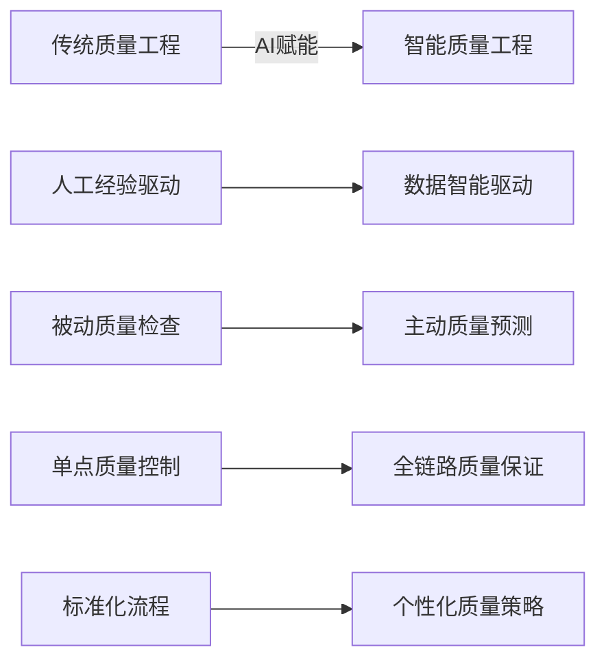
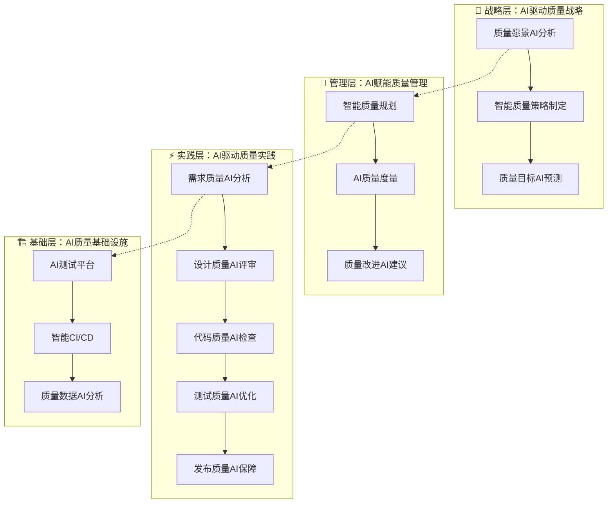
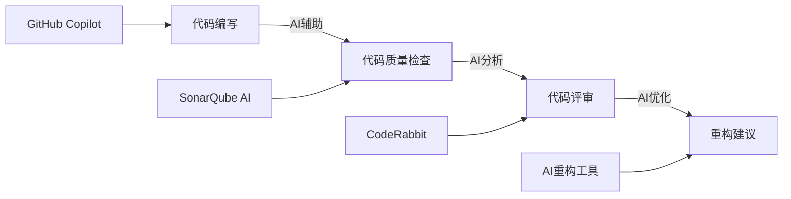
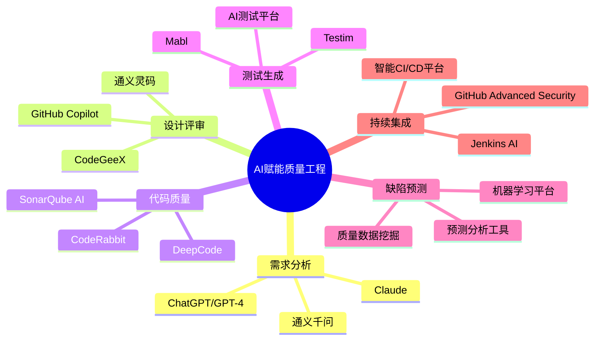

# AI赋能软件质量工程转场思路与全景图

## 📍 转场背景分析

### 当前授课情况总结
- ✅ **传统质量工程体系**：已完成传统QA、QC、测试等概念讲解
- ✅ **ThoughtWorks质量白皮书**：已介绍业界最佳实践和理论框架
- ✅ **质量工程基础**：学员对传统质量保证体系有了清晰认知
- 🎯 **转场目标**：从传统质量工程转向AI赋能的智能化质量工程

---

## 🔄 转场思路设计

### 第一阶段：挑战引入（5分钟）

#### 💡 **从传统质量工程的痛点开始**

**提出核心问题**：
> "刚才我们学习了传统质量工程体系，但在数字化转型的今天，我们面临哪些新挑战？"

**引导学员思考的传统质量工程限制**：

| 传统挑战 | 具体表现 | 影响 |
|---------|----------|-----|
| **效率瓶颈** | 手工测试用例设计、人工代码审查 | 🐌 质量保证效率低下 |
| **覆盖有限** | 依赖经验，难以穷尽边界场景 | ❌ 质量风险遗漏 |
| **成本高昂** | 大量重复性质量工作需要人力 | 💰 质量保证成本居高不下 |
| **反应滞后** | 质量问题发现和修复周期长 | ⏰ 影响交付速度 |
| **规模受限** | 难以应对大规模、高频次发布 | 📈 无法适应敏捷DevOps |

### 第二阶段：价值展示（5分钟）

#### 🚀 **AI赋能带来的质量工程革命**

**核心价值主张**：
> "AI不是替代传统质量工程，而是让质量工程从'手工作坊'升级为'智能工厂'"



**具体价值体现**：

| 提升维度 | 传统方式 | AI赋能方式 | 效果提升 |
|---------|----------|-----------|----------|
| **测试效率** | 手动设计测试用例 | AI自动生成测试用例 | ⚡ 效率提升300% |
| **缺陷发现** | 经验判断 | 机器学习预测 | 🎯 准确率提升180% |
| **代码质量** | 人工Code Review | AI智能代码分析 | 🔍 覆盖率提升250% |
| **风险识别** | 后验分析 | 实时预警 | ⏰ 提前3-5天预警 |

### 第三阶段：转型路径（3分钟）

#### 🗺️ **AI赋能质量工程转型路径**

**三步走战略**：

```
第一步：工具增强 → 第二步：流程智能化 → 第三步：体系化变革
     ↓                    ↓                     ↓
   AI辅助现有工作      重塑质量保证流程      构建智能质量生态
```

**转场过渡语**：
> "接下来，让我们深入了解AI如何在软件质量工程的各个环节发挥作用，构建一个全面的AI赋能质量工程体系。"

---

## 🌐 AI赋能软件质量工程全景图

### 📊 整体架构框架



### 🔍 分层详细解析

#### 🎯 **战略层：AI驱动质量战略**

**1. 质量愿景AI分析**
- **AI应用**：分析行业趋势、竞品质量、用户反馈
- **输出**：数据驱动的质量愿景和目标
- **工具**：ChatGPT/Claude + 业务数据分析

**2. 智能质量策略制定**
- **AI应用**：基于组织现状生成个性化质量策略
- **输出**：智能质量策略路线图
- **工具**：AI策略分析平台

**3. 质量目标AI预测**
- **AI应用**：历史数据分析，预测质量目标达成情况
- **输出**：可达成的质量目标和里程碑
- **工具**：机器学习预测模型

#### 🔧 **管理层：AI赋能质量管理**

**1. 智能质量规划**
```yaml
AI能力:
  - 资源配置优化
  - 风险评估和缓解
  - 质量活动智能排期
应用场景:
  - 项目质量计划自动生成
  - 测试资源智能分配
  - 质量风险动态评估
```

**2. AI质量度量**
```yaml
AI能力:
  - 多维度质量指标自动收集
  - 质量趋势智能分析
  - 质量报告自动生成
应用场景:
  - 实时质量仪表板
  - 质量健康度评估
  - 异常指标智能告警
```

**3. 质量改进AI建议**
```yaml
AI能力:
  - 质量问题根因分析
  - 改进措施智能推荐
  - 改进效果预测
应用场景:
  - 质量改进方案生成
  - 最佳实践智能匹配
  - 改进优先级排序
```

#### ⚡ **实践层：AI驱动质量实践**

**1. 需求阶段AI赋能**

| AI应用场景 | 具体能力 | 工具推荐 | 价值提升 |
|-----------|----------|----------|----------|
| **需求质量分析** | 需求完整性检查、冲突识别 | GPT-4 + 需求管理工具 | 需求缺陷减少70% |
| **可测试性评估** | 自动评估需求可测试程度 | AI需求分析平台 | 测试设计效率↑200% |
| **验收标准生成** | 智能生成验收标准 | Claude + 业务规则引擎 | 验收标准质量↑150% |

**2. 设计阶段AI赋能**

| AI应用场景 | 具体能力 | 工具推荐 | 价值提升 |
|-----------|----------|----------|----------|
| **架构质量分析** | 设计缺陷预测、架构风险评估 | AI代码分析平台 | 设计缺陷减少60% |
| **设计模式推荐** | 智能推荐最优设计模式 | GitHub Copilot + 架构工具 | 设计质量↑180% |
| **可维护性评估** | 代码可维护性预测 | SonarQube AI + 静态分析 | 技术债务减少50% |

**3. 开发阶段AI赋能**



**4. 测试阶段AI赋能**

| AI能力 | 应用场景 | 技术实现 | 效果提升 |
|--------|----------|----------|----------|
| **测试用例生成** | 基于需求和代码自动生成测试用例 | GPT-4 + 代码分析 | 测试覆盖率↑300% |
| **测试数据生成** | 智能生成边界值、异常值测试数据 | AI数据生成器 | 数据准备效率↑500% |
| **缺陷预测** | 基于历史数据预测潜在缺陷 | 机器学习模型 | 缺陷发现率↑200% |
| **测试优化** | 智能选择回归测试案例 | AI测试选择算法 | 测试执行效率↑250% |

**5. 发布阶段AI赋能**

```yaml
质量门禁AI增强:
  - 智能代码质量检查
  - 自动化安全漏洞扫描
  - AI风险评估和发布建议
  - 智能回滚决策支持

生产监控AI赋能:
  - 异常检测和告警
  - 性能问题智能诊断
  - 用户体验质量分析
  - 故障预测和预防
```

#### 🏗️ **基础层：AI质量基础设施**

**1. AI测试平台**
```yaml
平台能力:
  - 测试用例智能管理
  - 自动化测试脚本生成
  - 测试结果智能分析
  - 测试报告自动生成

技术架构:
  - AI引擎: GPT-4 / Claude
  - 执行引擎: Selenium / Playwright
  - 分析引擎: 机器学习算法
  - 数据存储: 测试知识库
```

**2. 智能CI/CD流水线**
```yaml
AI增强能力:
  - 构建失败智能诊断
  - 部署策略AI优化
  - 环境健康度AI监控
  - 流水线性能AI调优

集成方案:
  - Jenkins + AI插件
  - GitHub Actions + AI工具
  - Azure DevOps + AI服务
  - GitLab CI + 智能分析
```

**3. 质量数据AI分析**
```yaml
数据分析能力:
  - 质量趋势预测
  - 异常模式识别
  - 质量因子关联分析
  - 改进效果量化

技术实现:
  - 数据收集: 全生命周期质量数据
  - 数据处理: ETL + 数据清洗
  - 分析引擎: 机器学习算法
  - 可视化: 智能仪表板
```

### 🛠️ **核心AI工具生态图**



### 📈 **AI赋能效果量化**

#### 🎯 **关键质量指标提升**

| 质量指标 | 传统方式基线 | AI赋能目标 | 提升幅度 |
|---------|-------------|-----------|----------|
| **缺陷逃逸率** | 5-10% | <1% | 降低80-90% |
| **测试覆盖率** | 60-70% | >90% | 提升30-50% |
| **代码质量** | 技术债务比率15% | <5% | 改善67% |
| **测试效率** | 人工测试周期5天 | 自动化1天 | 提升400% |
| **缺陷修复时间** | 平均3天 | 平均6小时 | 提升75% |

#### ⚡ **团队效率提升**

```yaml
开发效率:
  - 代码编写速度: ↑200%
  - 代码质量: ↑180%
  - 重构效率: ↑300%

测试效率:
  - 用例设计: ↑500%
  - 测试执行: ↑400%
  - 缺陷发现: ↑250%

质量保证:
  - 风险识别: ↑300%
  - 问题预防: ↑200%
  - 改进效果: ↑150%
```

---

## 🎯 课程转场执行建议

### 💬 **转场话术模板**

**开场引入**：
> "刚才我们深入学习了传统软件质量工程体系，包括QA、QC的职责定位，以及ThoughtWorks提出的质量工程最佳实践。这些理论和方法为我们打下了坚实基础。
> 
> 但是，站在2024年的时间点，我们必须面对一个现实：数字化转型加速、DevOps普及、云原生技术兴起，软件开发的复杂度和速度都在急剧提升。传统质量工程虽然理论完善，但在效率、规模、成本方面遇到了新的挑战。
> 
> 今天，我们将探讨如何借助AI的力量，让质量工程从'手工作坊'升级为'智能工厂'，实现质量保证的革命性提升。"

**价值承诺**：
> "通过接下来的学习，您将掌握：
> - AI如何在软件质量工程各环节发挥作用
> - 具体的AI工具和应用场景
> - AI赋能质量工程的实施路线图
> - 可量化的质量提升效果和ROI"

### 📊 **视觉辅助建议**

1. **对比图表**：传统vs AI赋能的效果对比
2. **全景架构图**：AI赋能质量工程体系架构
3. **工具生态图**：核心AI工具和平台展示
4. **案例展示**：成功的AI赋能质量工程案例
5. **ROI分析**：投入产出比和效果量化

### ⏰ **时间分配建议**

- **转场引入**：5分钟（挑战 + 价值）
- **全景展示**：15分钟（架构 + 分层解析）
- **工具介绍**：10分钟（核心工具生态）
- **案例分享**：5分钟（成功实践）
- **Q&A互动**：5分钟（答疑解惑）

---

## 📚 **相关资源链接**

### 📖 **延伸阅读**
- [AI赋能软件质量工程体系课程设计方案](./AI赋能软件质量工程体系课程设计方案.md)
- [QA工作职责与实践清单](./QA工作职责与实践清单.md)
- [软件质量工程体系架构设计](./软件质量工程体系架构设计.md)

### 🛠️ **推荐工具**
- **需求分析**：GPT-4, Claude, 通义千问
- **代码质量**：GitHub Copilot, SonarQube AI, CodeRabbit
- **测试自动化**：Testim, Mabl, AI测试平台
- **CI/CD增强**：Jenkins AI, GitHub Advanced Security

### 📊 **参考数据**
- ThoughtWorks软件质量白皮书
- GitHub AI编程调研报告
- Stack Overflow开发者调研
- McKinsey数字化转型报告

---

*本文档基于最新的AI技术发展和软件质量工程实践编写，旨在为AI赋能软件质量工程的课程转场提供系统性指导。*
