# Playwright + Deepseek 自然语言驱动端到端测试技术方案

## 📖 概述

本技术方案设计了一个创新的自动化测试框架，结合Microsoft Playwright浏览器自动化技术与Deepseek AI大语言模型，实现了基于自然语言驱动的端到端测试解决方案。该框架允许测试人员使用中文自然语言描述测试场景，AI自动将其转换为可执行的测试步骤，极大降低了自动化测试的门槛。

### 🎯 核心价值

- **降低技术门槛**：测试人员无需编程技能，直接用中文描述测试即可
- **提升测试效率**：AI自动解析转换，快速生成测试用例
- **增强测试覆盖**：智能探索页面，发现潜在测试点
- **简化维护成本**：自动错误恢复和智能元素定位

## 🏗️ 整体架构

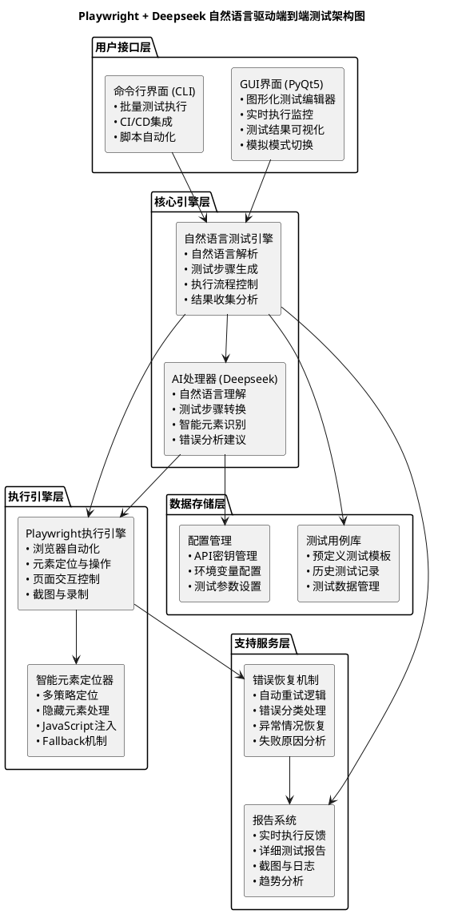

## 🔄 核心流程设计

### 自然语言测试执行流程

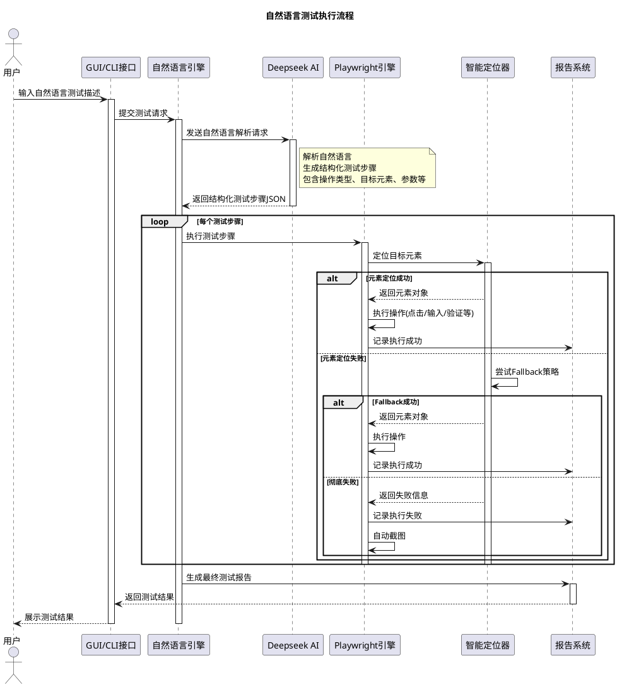

### Deepseek AI解析流程

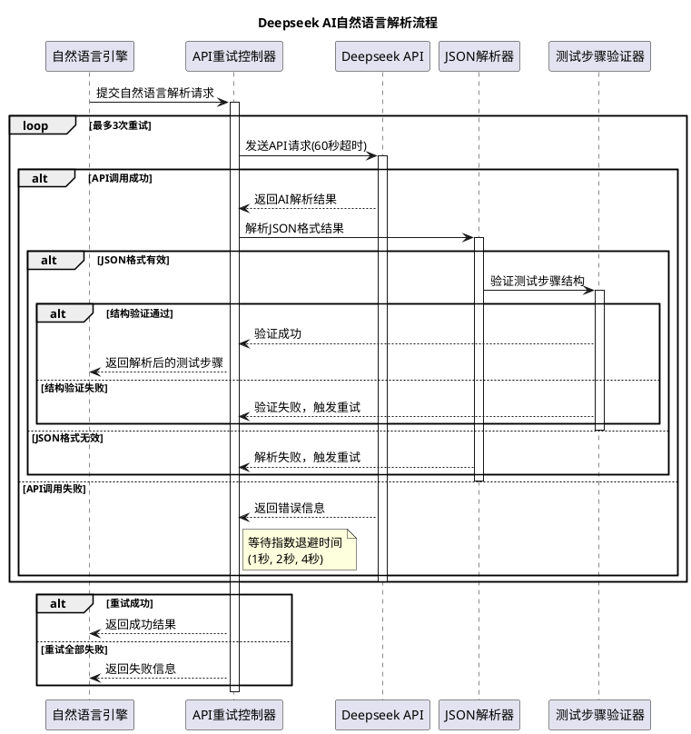

## 🎯 核心技术实现

### 1. 自然语言处理模块

#### Deepseek API集成设计

```python
class DeepseekIntegration:
    """Deepseek AI集成模块"""
    
    def __init__(self):
        self.api_key = self._load_api_key()
        self.base_url = "https://api.deepseek.com"
        self.max_retries = 3
        self.timeout = 60
        
    def parse_natural_language(self, natural_language: str) -> Dict:
        """解析自然语言测试描述"""
        prompt = self._build_parsing_prompt(natural_language)
        
        for attempt in range(self.max_retries):
            try:
                response = self._make_api_call(prompt, self.timeout)
                return self._parse_response(response)
            except Exception as e:
                if attempt < self.max_retries - 1:
                    self._wait_exponential_backoff(attempt)
                else:
                    raise TestParsingError(f"API调用失败: {e}")
```

#### 支持的操作类型映射

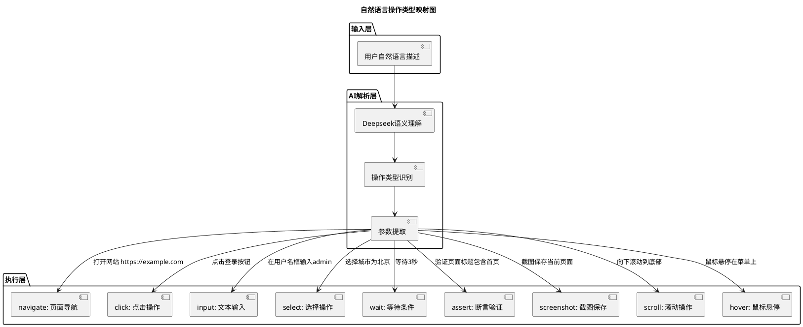

### 2. 智能元素定位机制

#### 多策略定位算法

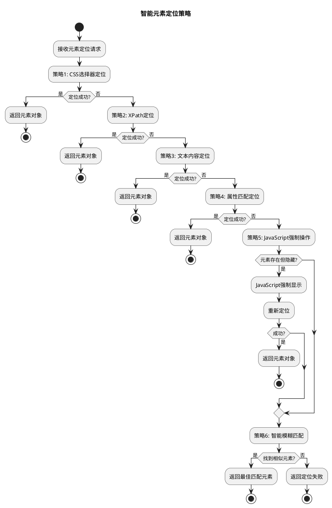

#### 元素定位代码实现

```python
class SmartElementLocator:
    """智能元素定位器"""
    
    async def locate_element(self, page: Page, element_description: str):
        """多策略元素定位"""
        strategies = [
            self._locate_by_css,
            self._locate_by_xpath, 
            self._locate_by_text,
            self._locate_by_attributes,
            self._locate_by_javascript,
            self._locate_by_fuzzy_match
        ]
        
        for strategy in strategies:
            try:
                element = await strategy(page, element_description)
                if element:
                    return element
            except Exception as e:
                self._log_strategy_failure(strategy.__name__, e)
                continue
        
        raise ElementNotFoundError(f"无法定位元素: {element_description}")
    
    async def _locate_by_javascript(self, page: Page, description: str):
        """JavaScript强制操作策略"""
        # 处理隐藏元素的JavaScript注入
        js_code = """
        (description) => {
            const elements = document.querySelectorAll('*');
            for (let el of elements) {
                if (el.style.display === 'none' || el.style.visibility === 'hidden') {
                    if (/* 匹配条件 */) {
                        el.style.display = '';
                        el.style.visibility = 'visible';
                        return el;
                    }
                }
            }
            return null;
        }
        """
        return await page.evaluate(js_code, description)
```

### 3. 错误恢复与重试机制

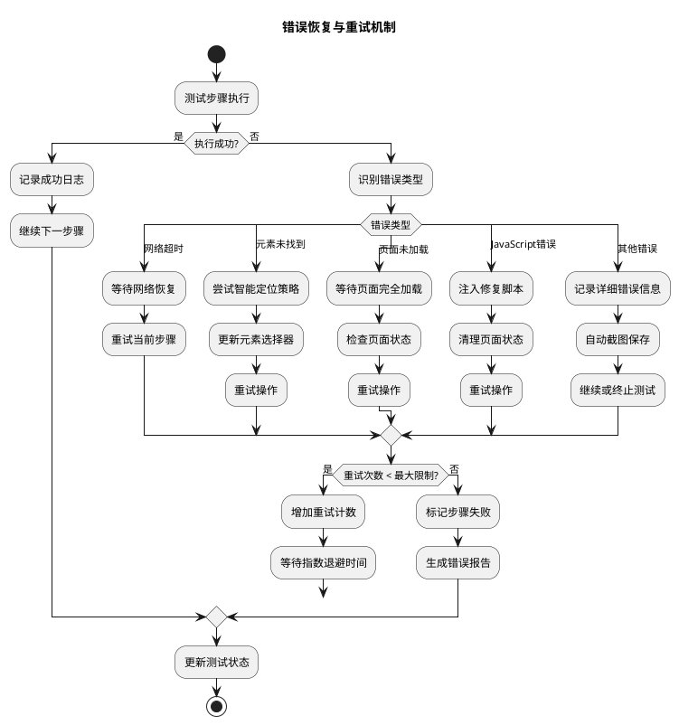

## 📊 测试报告与监控

### 实时监控界面设计

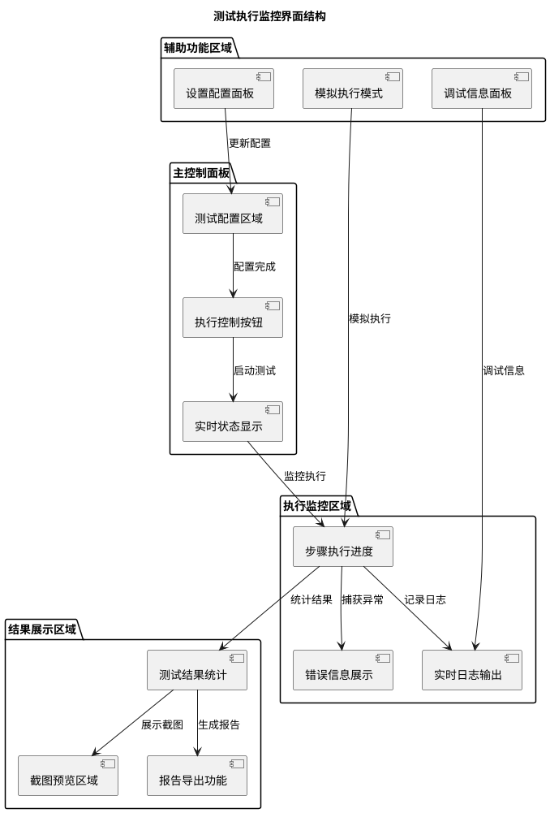

### 测试报告生成流程

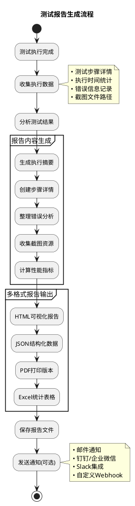

## 🚀 部署与集成方案

### CI/CD集成架构

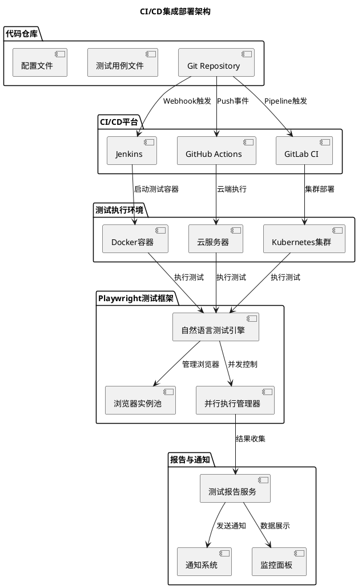

### Docker容器化部署

```dockerfile
# Dockerfile示例
FROM mcr.microsoft.com/playwright/python:v1.40.0-focal

WORKDIR /app

# 安装Python依赖
COPY requirements.txt .
RUN pip install -r requirements.txt

# 安装Playwright浏览器
RUN playwright install

# 复制应用代码
COPY . .

# 设置环境变量
ENV DEEPSEEK_API_KEY=""
ENV HEADLESS_MODE=true
ENV MAX_RETRIES=3

# 暴露端口(如果有GUI界面)
EXPOSE 8080

# 启动命令
CMD ["python", "test_runner.py", "--headless", "--output-dir", "/app/reports"]
```

## 🎯 应用场景与案例

### 典型应用场景

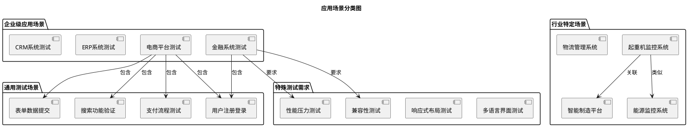

### 起重机系统测试案例

基于现有实现的起重机智能监控系统测试案例：

```markdown
# 起重机故障预测系统端到端测试案例

## 测试场景1: 系统监控功能验证
**自然语言描述:**
```
验证起重机故障预测系统基本功能：
1. 打开系统主页面
2. 点击"数据监控"标签页  
3. 验证数据监控面板正确显示
4. 点击"开始监控"按钮
5. 等待2秒让系统启动
6. 验证监控状态显示为"运行中"
7. 截图保存监控界面
```

## 测试场景2: 故障预测流程测试
**自然语言描述:**
```
测试故障预测功能完整流程：
1. 进入故障预测模块
2. 选择起重机编号"Crane-001" 
3. 设置预测时间范围为"未来24小时"
4. 点击"开始预测"按钮
5. 等待AI分析完成
6. 验证预测结果显示正常
7. 检查风险等级指示器
8. 导出预测报告
```
```

## 🔧 技术实现细节

### 1. 环境配置要求

```yaml
# 系统要求配置文件
system_requirements:
  python_version: ">=3.8"
  node_version: ">=16.0"
  
dependencies:
  core:
    - playwright>=1.40.0
    - asyncio
    - aiohttp
    - PyQt5>=5.15.0
  
  ai_integration:
    - openai
    - tiktoken
    - requests>=2.28.0
  
  testing:
    - pytest>=7.0.0
    - pytest-asyncio
    - pytest-playwright
    
  reporting:
    - jinja2
    - matplotlib
    - pandas
    
system_config:
  max_browsers: 5
  default_timeout: 30000
  screenshot_format: "png"
  video_recording: true
```

### 2. 性能优化策略

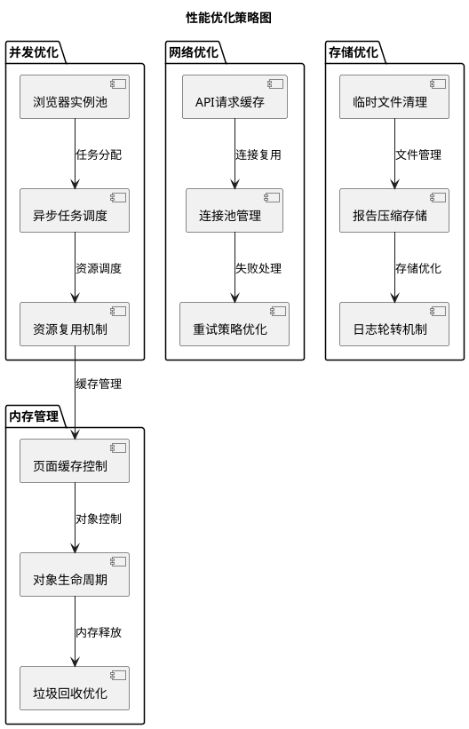

## 📈 扩展功能规划

### 未来功能路线图

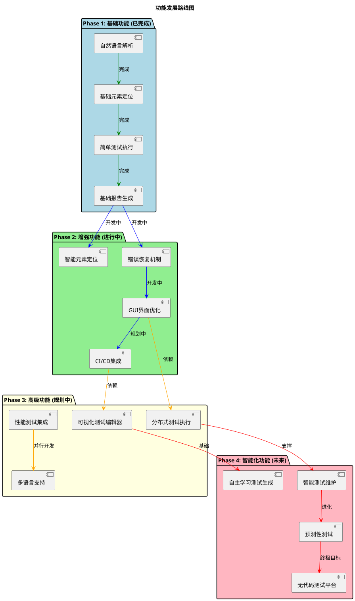

## 🛡️ 安全与稳定性

### 安全架构设计

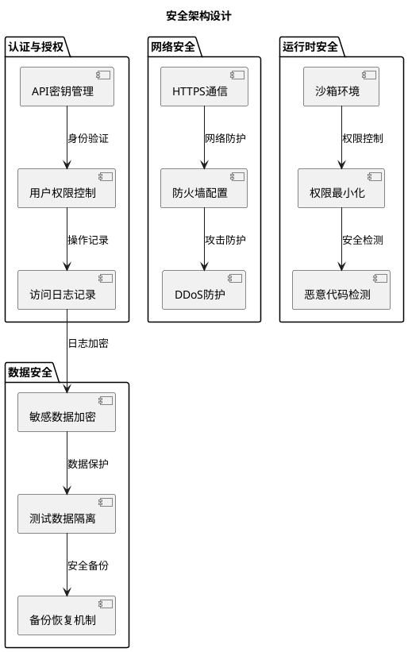

## 📋 实施建议

### 分阶段实施计划

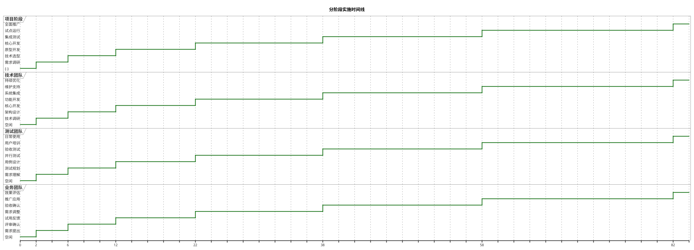

### 团队能力建设

| 角色 | 必备技能 | 培训重点 |
|------|----------|----------|
| **测试工程师** | 基础测试理论 | 自然语言测试描述技巧、工具使用 |
| **开发工程师** | Python/JavaScript | Playwright API、AI集成开发 |
| **DevOps工程师** | CI/CD流程 | 容器化部署、监控配置 |
| **业务分析师** | 业务流程理解 | 测试场景设计、用例规划 |

## 🎯 成功指标

### 关键绩效指标(KPI)

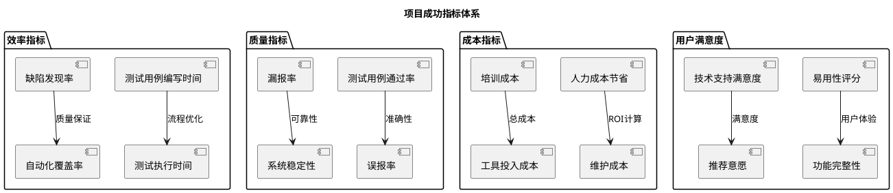

## 🔗 总结

Playwright + Deepseek 自然语言驱动端到端测试技术方案提供了一个创新的自动化测试解决方案，通过AI技术大幅降低了自动化测试的技术门槛，让业务人员也能参与到测试用例的编写中。

### 核心优势

1. **技术门槛低**：自然语言描述，无需编程技能
2. **AI智能化**：Deepseek自动解析和转换测试步骤  
3. **稳定可靠**：完善的错误恢复和重试机制
4. **扩展性强**：支持CI/CD集成和分布式执行
5. **维护简单**：智能元素定位减少维护工作量

### 适用场景

- 敏捷开发团队的快速测试验证
- 业务人员参与的回归测试自动化
- 复杂业务系统的端到端测试
- CI/CD流程中的自动化测试集成

该方案已在起重机智能监控系统中得到验证，具备良好的实用性和扩展性，可为企业数字化转型中的测试自动化建设提供有力支撑。

---

*本文档基于实际项目实践编写，相关代码实现可参考项目仓库中的具体实现。*
