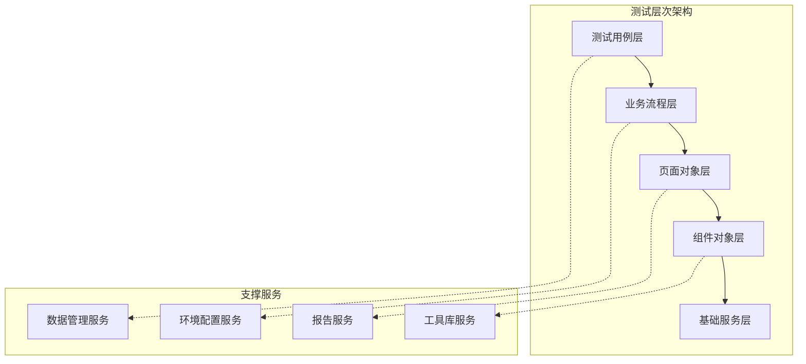

# Playwright自动化UI测试深度实施指南

## 📖 目录
1. [战略思考与测试理念](#战略思考与测试理念)
2. [架构设计原则](#架构设计原则)
3. [技术实施方案](#技术实施方案)
4. [最佳实践模式](#最佳实践模式)
5. [CI/CD集成策略](#cicd集成策略)
6. [维护与优化](#维护与优化)
7. [团队协作机制](#团队协作机制)

## 🎯 战略思考与测试理念

### 1.1 UI测试的价值定位

**测试金字塔中的角色**
```
        /\
       /UI\     <- 少量，关键路径，端到端验证
      /____\
     /      \
    /Integration\ <- 中等数量，服务间交互
   /____________\
  /              \
 /   Unit Tests   \ <- 大量，业务逻辑，快速反馈
/__________________\
```

**UI测试应该覆盖的场景**：
- ✅ 关键业务流程的端到端验证
- ✅ 跨系统集成的用户体验验证
- ✅ 关键用户路径的完整性检查
- ✅ 浏览器兼容性关键功能验证
- ❌ 详细的业务逻辑验证（应在单元测试层）
- ❌ 大量的边界条件测试（应在集成测试层）
- ❌ 性能压力测试（应使用专门的性能测试工具）

### 1.2 Playwright的技术优势分析

| 特性 | Playwright | Selenium | 优势说明 |
|------|------------|----------|----------|
| **多浏览器支持** | Chromium, Firefox, Safari, Edge | Chrome, Firefox, Safari, Edge | 原生支持，更好的兼容性 |
| **执行速度** | 快 | 中等 | 原生浏览器协议，减少通信开销 |
| **并发能力** | 优秀 | 受限 | 内置并发支持，资源利用率高 |
| **等待机制** | 智能自动等待 | 需要显式等待 | 减少测试不稳定性 |
| **调试能力** | 内置调试工具 | 需要第三方工具 | 开发体验更好 |
| **移动端支持** | 原生支持 | 需要Appium | 更好的移动端测试体验 |

### 1.3 成本效益分析

**投入成本**：
- 学习成本：中等（相比Selenium降低30%）
- 开发成本：中等（初期投入，长期收益）
- 维护成本：中等（设计良好的情况下）
- 基础设施成本：低（容器化部署）

**预期收益**：
- 回归测试自动化：节省人力60-80%
- 缺陷发现前置：降低修复成本70%
- 交付信心提升：减少生产环境问题50%
- 开发效率提升：快速反馈机制

## 🏗️ 架构设计原则

### 2.1 整体架构设计



### 2.2 分层设计详解

#### 2.2.1 基础服务层 (Foundation Layer)
```typescript
// 浏览器管理服务
class BrowserManager {
    async createContext(options?: ContextOptions): Promise<BrowserContext> {
        // 浏览器上下文创建和配置
    }
    
    async setupMockAPI(context: BrowserContext): Promise<void> {
        // API模拟服务设置
    }
}

// 配置管理服务
class ConfigManager {
    getEnvironmentConfig(env: string): EnvironmentConfig {
        // 环境配置获取
    }
    
    getTestDataConfig(): TestDataConfig {
        // 测试数据配置
    }
}

// 日志和报告服务
class ReportManager {
    attachScreenshot(testInfo: TestInfo, screenshot: Buffer): void {
        // 截图附加
    }
    
    attachTrace(testInfo: TestInfo, tracePath: string): void {
        // 执行轨迹附加
    }
}
```

#### 2.2.2 组件对象层 (Component Layer)
```typescript
// 可复用UI组件封装
class DataTable {
    constructor(private page: Page, private selector: string) {}
    
    async getRowCount(): Promise<number> {
        return await this.page.locator(`${this.selector} tbody tr`).count();
    }
    
    async getRowData(rowIndex: number): Promise<Record<string, string>> {
        // 获取指定行数据
    }
    
    async sortByColumn(columnName: string): Promise<void> {
        // 按列排序
    }
    
    async filterBy(criteria: FilterCriteria): Promise<void> {
        // 数据过滤
    }
}

class Modal {
    constructor(private page: Page, private modalSelector: string) {}
    
    async waitForOpen(): Promise<void> {
        await this.page.waitForSelector(this.modalSelector, { state: 'visible' });
    }
    
    async close(): Promise<void> {
        await this.page.click('[data-testid="modal-close"]');
        await this.waitForClose();
    }
    
    async waitForClose(): Promise<void> {
        await this.page.waitForSelector(this.modalSelector, { state: 'hidden' });
    }
}
```

#### 2.2.3 页面对象层 (Page Object Layer)
```typescript
class BookListPage {
    constructor(private page: Page) {}
    
    // 页面导航
    async navigate(): Promise<void> {
        await this.page.goto('/books');
        await this.page.waitForLoadState('networkidle');
    }
    
    // 页面组件
    get searchForm() {
        return new SearchForm(this.page, '[data-testid="search-form"]');
    }
    
    get bookTable() {
        return new DataTable(this.page, '[data-testid="book-table"]');
    }
    
    get addBookModal() {
        return new Modal(this.page, '[data-testid="add-book-modal"]');
    }
    
    // 页面级业务操作
    async searchBooks(criteria: SearchCriteria): Promise<void> {
        await this.searchForm.fillCriteria(criteria);
        await this.searchForm.submit();
        await this.bookTable.waitForUpdate();
    }
    
    async addNewBook(bookData: BookData): Promise<void> {
        await this.page.click('[data-testid="add-book-btn"]');
        await this.addBookModal.waitForOpen();
        await this.addBookModal.fillForm(bookData);
        await this.addBookModal.submit();
        await this.addBookModal.waitForClose();
    }
}
```

#### 2.2.4 业务流程层 (Business Flow Layer)
```typescript
class BookManagementFlow {
    constructor(private page: Page) {}
    
    async completeBookPurchaseFlow(bookInfo: BookInfo, paymentInfo: PaymentInfo): Promise<OrderResult> {
        // 复杂业务流程封装
        const catalogPage = new BookCatalogPage(this.page);
        const cartPage = new ShoppingCartPage(this.page);
        const checkoutPage = new CheckoutPage(this.page);
        
        // 1. 搜索和选择图书
        await catalogPage.navigate();
        await catalogPage.searchBook(bookInfo.title);
        await catalogPage.selectBook(bookInfo.isbn);
        
        // 2. 添加到购物车
        await catalogPage.addToCart();
        
        // 3. 检查购物车
        await cartPage.navigate();
        const cartItems = await cartPage.getCartItems();
        expect(cartItems).toContainEqual(expect.objectContaining({
            isbn: bookInfo.isbn,
            title: bookInfo.title
        }));
        
        // 4. 结账流程
        await cartPage.proceedToCheckout();
        await checkoutPage.fillPaymentInfo(paymentInfo);
        const orderResult = await checkoutPage.completeOrder();
        
        return orderResult;
    }
}
```

### 2.3 数据管理策略

#### 2.3.1 测试数据分层管理
```typescript
// 数据工厂模式
class TestDataFactory {
    static createBook(overrides?: Partial<BookData>): BookData {
        return {
            isbn: faker.commerce.isbn(),
            title: faker.commerce.productName(),
            author: faker.person.fullName(),
            price: faker.commerce.price(),
            category: faker.helpers.arrayElement(['Programming', 'AI', 'Data Science']),
            ...overrides
        };
    }
    
    static createUser(role: UserRole = 'customer'): UserData {
        return {
            email: faker.internet.email(),
            password: 'Test123!',
            firstName: faker.person.firstName(),
            lastName: faker.person.lastName(),
            role
        };
    }
}

// 数据状态管理
class TestDataManager {
    private dataStack: TestData[] = [];
    
    async setupTestData(scenario: string): Promise<TestData> {
        const data = await this.createDataForScenario(scenario);
        this.dataStack.push(data);
        return data;
    }
    
    async cleanupTestData(): Promise<void> {
        // 清理测试数据，后进先出
        while (this.dataStack.length > 0) {
            const data = this.dataStack.pop();
            await this.deleteData(data);
        }
    }
}
```

#### 2.3.2 API数据准备策略
```typescript
class APIDataSetup {
    constructor(private apiClient: APIClient) {}
    
    async prepareBookCatalog(books: BookData[]): Promise<void> {
        // 通过API批量创建测试数据
        for (const book of books) {
            await this.apiClient.post('/api/books', book);
        }
    }
    
    async setupUserAccounts(users: UserData[]): Promise<void> {
        // 创建测试用户
        for (const user of users) {
            await this.apiClient.post('/api/users', user);
        }
    }
    
    async cleanupData(testId: string): Promise<void> {
        // 清理特定测试的数据
        await this.apiClient.delete(`/api/test-data/${testId}`);
    }
}
```

## 🔧 技术实施方案

### 3.1 项目结构设计

```
tests/
├── config/
│   ├── playwright.config.ts          # Playwright配置
│   ├── environments.ts               # 环境配置
│   └── test-data-config.ts          # 测试数据配置
├── fixtures/
│   ├── base-fixtures.ts              # 基础fixture
│   ├── auth-fixtures.ts              # 认证fixture
│   └── data-fixtures.ts              # 数据fixture
├── page-objects/
│   ├── base/
│   │   ├── base-page.ts              # 页面基类
│   │   └── base-component.ts         # 组件基类
│   ├── components/
│   │   ├── navigation.ts             # 导航组件
│   │   ├── data-table.ts            # 数据表格组件
│   │   └── modal.ts                 # 模态框组件
│   └── pages/
│       ├── login-page.ts             # 登录页面
│       ├── book-list-page.ts         # 图书列表页面
│       └── order-page.ts             # 订单页面
├── flows/
│   ├── auth-flow.ts                  # 认证流程
│   ├── book-management-flow.ts       # 图书管理流程
│   └── order-flow.ts                 # 订单流程
├── services/
│   ├── api-client.ts                 # API客户端
│   ├── data-manager.ts               # 数据管理
│   └── report-manager.ts             # 报告管理
├── utils/
│   ├── helpers.ts                    # 工具函数
│   ├── constants.ts                  # 常量定义
│   └── types.ts                      # 类型定义
├── test-data/
│   ├── users.json                    # 用户测试数据
│   ├── books.json                    # 图书测试数据
│   └── scenarios/                    # 场景数据
│       ├── happy-path.json
│       └── edge-cases.json
└── tests/
    ├── smoke/                        # 冒烟测试
    ├── regression/                   # 回归测试
    ├── integration/                  # 集成测试
    └── e2e/                         # 端到端测试
```

### 3.2 核心配置设计

#### 3.2.1 Playwright配置
```typescript
// playwright.config.ts
import { PlaywrightTestConfig, devices } from '@playwright/test';

const config: PlaywrightTestConfig = {
    testDir: './tests',
    timeout: 30000,
    retries: process.env.CI ? 2 : 0,
    workers: process.env.CI ? 2 : 4,
    
    // 全局设置
    use: {
        baseURL: process.env.BASE_URL || 'http://localhost:3000',
        trace: 'on-first-retry',
        screenshot: 'only-on-failure',
        video: 'retain-on-failure',
        headless: process.env.CI ? true : false,
    },
    
    // 项目配置 - 多浏览器支持
    projects: [
        {
            name: 'chromium',
            use: { ...devices['Desktop Chrome'] },
        },
        {
            name: 'firefox',
            use: { ...devices['Desktop Firefox'] },
        },
        {
            name: 'webkit',
            use: { ...devices['Desktop Safari'] },
        },
        {
            name: 'mobile-chrome',
            use: { ...devices['Pixel 5'] },
        },
    ],
    
    // 报告配置
    reporter: [
        ['html'],
        ['junit', { outputFile: 'test-results/junit-results.xml' }],
        ['json', { outputFile: 'test-results/test-results.json' }],
    ],
    
    // 全局设置和清理
    globalSetup: require.resolve('./config/global-setup'),
    globalTeardown: require.resolve('./config/global-teardown'),
};

export default config;
```

#### 3.2.2 基础Fixture设计
```typescript
// fixtures/base-fixtures.ts
import { test as base, Page } from '@playwright/test';
import { LoginPage } from '../page-objects/pages/login-page';
import { TestDataManager } from '../services/data-manager';

type TestFixtures = {
    loginPage: LoginPage;
    authenticatedPage: Page;
    testDataManager: TestDataManager;
};

export const test = base.extend<TestFixtures>({
    // 登录页面fixture
    loginPage: async ({ page }, use) => {
        const loginPage = new LoginPage(page);
        await use(loginPage);
    },
    
    // 已认证页面fixture
    authenticatedPage: async ({ page, loginPage }, use) => {
        await loginPage.navigate();
        await loginPage.loginWithCredentials(
            process.env.TEST_EMAIL || 'test@example.com',
            process.env.TEST_PASSWORD || 'password123'
        );
        await use(page);
    },
    
    // 测试数据管理fixture
    testDataManager: async ({ page }, use) => {
        const dataManager = new TestDataManager();
        await use(dataManager);
        await dataManager.cleanupTestData();
    },
});
```

### 3.3 高级定位策略

#### 3.3.1 定位器优先级策略
```typescript
class SmartLocator {
    constructor(private page: Page) {}
    
    // 1. 优先使用语义化定位器
    byRole(role: string, options?: { name?: string }): Locator {
        return this.page.getByRole(role, options);
    }
    
    // 2. 使用测试ID（推荐用于测试）
    byTestId(testId: string): Locator {
        return this.page.getByTestId(testId);
    }
    
    // 3. 使用标签文本
    byText(text: string): Locator {
        return this.page.getByText(text);
    }
    
    // 4. 使用标签或占位符
    byLabel(label: string): Locator {
        return this.page.getByLabel(label);
    }
    
    // 5. 最后选择：CSS或XPath
    bySelector(selector: string): Locator {
        return this.page.locator(selector);
    }
    
    // 智能等待策略
    async waitForElementWithText(text: string, timeout: number = 5000): Promise<Locator> {
        const element = this.byText(text);
        await element.waitFor({ state: 'visible', timeout });
        return element;
    }
    
    // 动态内容处理
    async waitForDynamicContent(selector: string, expectedText: string): Promise<void> {
        await this.page.waitForFunction(
            ({ selector, expectedText }) => {
                const element = document.querySelector(selector);
                return element && element.textContent?.includes(expectedText);
            },
            { selector, expectedText },
            { timeout: 10000 }
        );
    }
}
```

#### 3.3.2 复杂场景处理
```typescript
class AdvancedInteractions {
    constructor(private page: Page) {}
    
    // 处理文件上传
    async uploadFile(inputSelector: string, filePath: string): Promise<void> {
        const fileInput = this.page.locator(inputSelector);
        await fileInput.setInputFiles(filePath);
    }
    
    // 处理拖拽操作
    async dragAndDrop(sourceSelector: string, targetSelector: string): Promise<void> {
        await this.page.dragAndDrop(sourceSelector, targetSelector);
    }
    
    // 处理无限滚动
    async scrollToLoadMoreItems(containerSelector: string, expectedCount: number): Promise<void> {
        let currentCount = 0;
        while (currentCount < expectedCount) {
            await this.page.locator(containerSelector).scrollIntoViewIfNeeded();
            await this.page.waitForTimeout(1000); // 等待新内容加载
            
            const newCount = await this.page.locator(`${containerSelector} .item`).count();
            if (newCount === currentCount) break; // 没有新内容了
            currentCount = newCount;
        }
    }
    
    // 处理表格操作
    async selectTableRows(tableSelector: string, criteria: Record<string, string>): Promise<void> {
        const rows = this.page.locator(`${tableSelector} tbody tr`);
        const rowCount = await rows.count();
        
        for (let i = 0; i < rowCount; i++) {
            const row = rows.nth(i);
            let shouldSelect = true;
            
            for (const [column, value] of Object.entries(criteria)) {
                const cellText = await row.locator(`td[data-column="${column}"]`).textContent();
                if (cellText !== value) {
                    shouldSelect = false;
                    break;
                }
            }
            
            if (shouldSelect) {
                await row.locator('input[type="checkbox"]').check();
            }
        }
    }
}
```

## 🌟 最佳实践模式

### 4.1 测试用例设计模式

#### 4.1.1 BDD风格测试
```typescript
// 使用Given-When-Then模式
test.describe('图书管理功能', () => {
    test('应该能够成功添加新图书', async ({ page, testDataManager }) => {
        // Given: 准备测试环境和数据
        const bookData = TestDataFactory.createBook({
            title: '深入理解计算机系统',
            category: 'Programming'
        });
        await testDataManager.setupUser('admin');
        
        // When: 执行操作
        const bookListPage = new BookListPage(page);
        await bookListPage.navigate();
        await bookListPage.addNewBook(bookData);
        
        // Then: 验证结果
        await expect(bookListPage.getSuccessMessage()).toBeVisible();
        await expect(bookListPage.bookTable.getRowByText(bookData.title)).toBeVisible();
    });
    
    test('应该能够批量删除图书', async ({ page, testDataManager }) => {
        // Given: 准备多本测试图书
        const books = [
            TestDataFactory.createBook({ title: '图书1' }),
            TestDataFactory.createBook({ title: '图书2' }),
            TestDataFactory.createBook({ title: '图书3' }),
        ];
        await testDataManager.setupBooks(books);
        
        // When: 执行批量删除
        const bookListPage = new BookListPage(page);
        await bookListPage.navigate();
        await bookListPage.selectBooksByTitles(['图书1', '图书3']);
        await bookListPage.batchDelete();
        
        // Then: 验证删除结果
        await expect(bookListPage.bookTable.getRowByText('图书1')).not.toBeVisible();
        await expect(bookListPage.bookTable.getRowByText('图书2')).toBeVisible();
        await expect(bookListPage.bookTable.getRowByText('图书3')).not.toBeVisible();
    });
});
```

#### 4.1.2 数据驱动测试
```typescript
// 参数化测试
const searchTestCases = [
    { category: 'Programming', expectedCount: 5, expectedTitles: ['Clean Code', 'Design Patterns'] },
    { category: 'AI', expectedCount: 3, expectedTitles: ['Machine Learning', 'Deep Learning'] },
    { category: 'Data Science', expectedCount: 4, expectedTitles: ['Python for Data Analysis'] },
];

searchTestCases.forEach(({ category, expectedCount, expectedTitles }) => {
    test(`应该能够按类别"${category}"搜索图书`, async ({ page }) => {
        const bookListPage = new BookListPage(page);
        await bookListPage.navigate();
        
        await bookListPage.searchBooks({ category });
        
        const actualCount = await bookListPage.bookTable.getRowCount();
        expect(actualCount).toBe(expectedCount);
        
        for (const title of expectedTitles) {
            await expect(bookListPage.bookTable.getRowByText(title)).toBeVisible();
        }
    });
});
```

### 4.2 错误处理和重试机制

#### 4.2.1 智能重试策略
```typescript
class RetryableActions {
    constructor(private page: Page, private maxRetries: number = 3) {}
    
    async retryAction<T>(
        action: () => Promise<T>,
        errorHandler?: (error: Error, attempt: number) => Promise<boolean>
    ): Promise<T> {
        let lastError: Error;
        
        for (let attempt = 1; attempt <= this.maxRetries; attempt++) {
            try {
                return await action();
            } catch (error) {
                lastError = error as Error;
                console.log(`Attempt ${attempt} failed: ${error.message}`);
                
                // 调用自定义错误处理器
                if (errorHandler) {
                    const shouldContinue = await errorHandler(lastError, attempt);
                    if (!shouldContinue) break;
                }
                
                // 最后一次尝试，直接抛出错误
                if (attempt === this.maxRetries) break;
                
                // 等待后重试
                await this.page.waitForTimeout(1000 * attempt);
            }
        }
        
        throw lastError!;
    }
    
    // 网络相关操作的重试
    async retryNetworkAction<T>(action: () => Promise<T>): Promise<T> {
        return this.retryAction(action, async (error, attempt) => {
            // 只对网络错误进行重试
            const isNetworkError = error.message.includes('net::') || 
                                  error.message.includes('timeout');
            
            if (isNetworkError && attempt < this.maxRetries) {
                console.log('Network error detected, retrying...');
                return true;
            }
            return false;
        });
    }
}
```

#### 4.2.2 异常恢复机制
```typescript
class ErrorRecovery {
    constructor(private page: Page) {}
    
    async handleUnexpectedModal(): Promise<void> {
        // 处理意外弹出的模态框
        const modal = this.page.locator('.modal, .dialog, .popup');
        if (await modal.isVisible()) {
            await modal.locator('[data-testid="close"], .close, .cancel').first().click();
            await modal.waitFor({ state: 'hidden' });
        }
    }
    
    async handleNetworkError(): Promise<void> {
        // 处理网络错误页面
        const errorPage = this.page.locator('text=网络错误, text=连接失败');
        if (await errorPage.isVisible()) {
            await this.page.reload();
            await this.page.waitForLoadState('networkidle');
        }
    }
    
    async ensureAuthenticated(): Promise<void> {
        // 确保用户已登录
        const loginIndicator = this.page.locator('[data-testid="login-form"]');
        if (await loginIndicator.isVisible()) {
            const loginPage = new LoginPage(this.page);
            await loginPage.loginWithCredentials(
                process.env.TEST_EMAIL!,
                process.env.TEST_PASSWORD!
            );
        }
    }
}
```

### 4.3 性能监控和断言

#### 4.3.1 性能指标收集
```typescript
class PerformanceMonitor {
    constructor(private page: Page) {}
    
    async measurePageLoadTime(): Promise<number> {
        const startTime = Date.now();
        await this.page.waitForLoadState('networkidle');
        return Date.now() - startTime;
    }
    
    async measureActionTime<T>(action: () => Promise<T>): Promise<{ result: T; duration: number }> {
        const startTime = Date.now();
        const result = await action();
        const duration = Date.now() - startTime;
        return { result, duration };
    }
    
    async getWebVitals(): Promise<WebVitals> {
        return await this.page.evaluate(() => {
            return new Promise((resolve) => {
                new PerformanceObserver((list) => {
                    const entries = list.getEntries();
                    const vitals: Partial<WebVitals> = {};
                    
                    entries.forEach((entry) => {
                        if (entry.name === 'first-contentful-paint') {
                            vitals.fcp = entry.startTime;
                        }
                        if (entry.name === 'largest-contentful-paint') {
                            vitals.lcp = entry.startTime;
                        }
                    });
                    
                    if (Object.keys(vitals).length >= 2) {
                        resolve(vitals as WebVitals);
                    }
                }).observe({ entryTypes: ['paint', 'largest-contentful-paint'] });
            });
        });
    }
}

// 性能断言
test('页面加载性能应该满足要求', async ({ page }) => {
    const monitor = new PerformanceMonitor(page);
    
    const loadTime = await monitor.measurePageLoadTime();
    expect(loadTime).toBeLessThan(3000); // 3秒内加载完成
    
    const vitals = await monitor.getWebVitals();
    expect(vitals.fcp).toBeLessThan(1500); // FCP < 1.5s
    expect(vitals.lcp).toBeLessThan(2500); // LCP < 2.5s
});
```

## ⚙️ CI/CD集成策略

### 5.1 CI环境配置

#### 5.1.1 GitHub Actions配置
```yaml
# .github/workflows/e2e-tests.yml
name: E2E Tests

on:
  push:
    branches: [ main, develop ]
  pull_request:
    branches: [ main ]
  schedule:
    - cron: '0 2 * * *' # 每天凌晨2点运行

jobs:
  test:
    runs-on: ubuntu-latest
    
    strategy:
      matrix:
        browser: [chromium, firefox, webkit]
        shard: [1/4, 2/4, 3/4, 4/4]
    
    steps:
    - uses: actions/checkout@v3
    
    - name: Setup Node.js
      uses: actions/setup-node@v3
      with:
        node-version: '18'
        cache: 'npm'
    
    - name: Install dependencies
      run: npm ci
    
    - name: Install Playwright Browsers
      run: npx playwright install --with-deps ${{ matrix.browser }}
    
    - name: Start application
      run: |
        npm run build
        npm run start:test &
        npx wait-on http://localhost:3000
    
    - name: Run Playwright tests
      run: npx playwright test --project=${{ matrix.browser }} --shard=${{ matrix.shard }}
      env:
        BASE_URL: http://localhost:3000
        TEST_EMAIL: ${{ secrets.TEST_EMAIL }}
        TEST_PASSWORD: ${{ secrets.TEST_PASSWORD }}
    
    - name: Upload test results
      uses: actions/upload-artifact@v3
      if: always()
      with:
        name: test-results-${{ matrix.browser }}-${{ matrix.shard }}
        path: |
          test-results/
          playwright-report/
        retention-days: 7
    
    - name: Publish test report
      uses: peaceiris/actions-gh-pages@v3
      if: always() && matrix.browser == 'chromium' && matrix.shard == '1/4'
      with:
        github_token: ${{ secrets.GITHUB_TOKEN }}
        publish_dir: ./playwright-report
        destination_dir: test-reports/${{ github.run_number }}
```

#### 5.1.2 Docker化测试环境
```dockerfile
# Dockerfile.test
FROM mcr.microsoft.com/playwright:v1.40.0-focal

WORKDIR /app

# 复制依赖文件
COPY package*.json ./
RUN npm ci

# 复制应用代码
COPY . .

# 设置环境变量
ENV CI=true
ENV HEADLESS=true

# 运行测试
CMD ["npm", "run", "test:e2e"]
```

```yaml
# docker-compose.test.yml
version: '3.8'
services:
  app:
    build:
      context: .
      dockerfile: Dockerfile
    ports:
      - "3000:3000"
    environment:
      - NODE_ENV=test
    depends_on:
      - database
      - redis

  database:
    image: postgres:14
    environment:
      POSTGRES_DB: testdb
      POSTGRES_USER: testuser
      POSTGRES_PASSWORD: testpass

  redis:
    image: redis:7-alpine

  e2e-tests:
    build:
      context: .
      dockerfile: Dockerfile.test
    depends_on:
      - app
    environment:
      - BASE_URL=http://app:3000
    volumes:
      - ./test-results:/app/test-results
      - ./playwright-report:/app/playwright-report
```

### 5.2 测试报告和通知

#### 5.2.1 详细测试报告
```typescript
// custom-reporter.ts
import { Reporter, TestCase, TestResult, FullResult } from '@playwright/test/reporter';

class CustomReporter implements Reporter {
    private results: TestResult[] = [];
    private startTime: number = Date.now();
    
    onTestEnd(test: TestCase, result: TestResult) {
        this.results.push(result);
        
        if (result.status === 'failed') {
            console.log(`❌ ${test.title} - ${result.error?.message}`);
        } else if (result.status === 'passed') {
            console.log(`✅ ${test.title} - ${result.duration}ms`);
        }
    }
    
    onEnd(result: FullResult) {
        const duration = Date.now() - this.startTime;
        const passed = this.results.filter(r => r.status === 'passed').length;
        const failed = this.results.filter(r => r.status === 'failed').length;
        const skipped = this.results.filter(r => r.status === 'skipped').length;
        
        const summary = {
            total: this.results.length,
            passed,
            failed,
            skipped,
            duration,
            success_rate: ((passed / this.results.length) * 100).toFixed(2)
        };
        
        // 生成详细报告
        this.generateDetailedReport(summary);
        
        // 发送通知（如果在CI环境）
        if (process.env.CI) {
            this.sendNotification(summary);
        }
    }
    
    private generateDetailedReport(summary: any) {
        const reportHtml = this.createHtmlReport(summary);
        require('fs').writeFileSync('test-summary.html', reportHtml);
    }
    
    private async sendNotification(summary: any) {
        // 发送到Slack、Teams等
        const webhookUrl = process.env.SLACK_WEBHOOK_URL;
        if (webhookUrl) {
            await this.sendSlackNotification(webhookUrl, summary);
        }
    }
}
```

#### 5.2.2 失败分析和自动重试
```typescript
class FailureAnalyzer {
    static analyzeFailure(testResult: TestResult): FailureCategory {
        const error = testResult.error;
        if (!error) return FailureCategory.Unknown;
        
        const message = error.message.toLowerCase();
        
        if (message.includes('timeout') || message.includes('waiting for')) {
            return FailureCategory.Timeout;
        }
        
        if (message.includes('net::') || message.includes('connection')) {
            return FailureCategory.Network;
        }
        
        if (message.includes('element not found') || message.includes('locator')) {
            return FailureCategory.ElementNotFound;
        }
        
        if (message.includes('assertion') || message.includes('expect')) {
            return FailureCategory.AssertionFailure;
        }
        
        return FailureCategory.Unknown;
    }
    
    static shouldRetry(category: FailureCategory): boolean {
        return [
            FailureCategory.Timeout,
            FailureCategory.Network,
        ].includes(category);
    }
}

enum FailureCategory {
    Timeout = 'timeout',
    Network = 'network',
    ElementNotFound = 'element_not_found',
    AssertionFailure = 'assertion_failure',
    Unknown = 'unknown'
}
```

## 🔄 维护与优化

### 6.1 测试维护策略

#### 6.1.1 定期健康检查
```typescript
// test-health-check.ts
class TestHealthChecker {
    async runHealthCheck(): Promise<HealthReport> {
        const report: HealthReport = {
            timestamp: new Date(),
            issues: [],
            recommendations: []
        };
        
        // 检查过时的定位器
        await this.checkObsoleteLocators(report);
        
        // 检查测试执行时间
        await this.checkTestDuration(report);
        
        // 检查测试覆盖率
        await this.checkTestCoverage(report);
        
        // 检查测试数据质量
        await this.checkTestDataQuality(report);
        
        return report;
    }
    
    private async checkObsoleteLocators(report: HealthReport): Promise<void> {
        // 扫描测试文件中的定位器
        const testFiles = await this.getAllTestFiles();
        
        for (const file of testFiles) {
            const content = await fs.readFile(file, 'utf-8');
            
            // 检查是否使用了不推荐的定位器
            if (content.includes('.locator(') && content.includes('#')) {
                report.issues.push({
                    type: 'obsolete_locator',
                    file: file,
                    message: '使用了CSS ID选择器，建议使用test-id'
                });
            }
        }
    }
    
    private async checkTestDuration(report: HealthReport): Promise<void> {
        const testResults = await this.getLatestTestResults();
        const slowTests = testResults.filter(t => t.duration > 30000); // 30秒
        
        if (slowTests.length > 0) {
            report.issues.push({
                type: 'slow_tests',
                count: slowTests.length,
                message: `发现${slowTests.length}个执行缓慢的测试`
            });
            
            report.recommendations.push(
                '考虑优化慢速测试或将其分解为更小的测试'
            );
        }
    }
}
```

#### 6.1.2 自动化代码重构
```typescript
class TestCodeRefactorer {
    async refactorDuplicatedCode(): Promise<void> {
        const testFiles = await this.getAllTestFiles();
        const duplicates = await this.findDuplicatedCode(testFiles);
        
        for (const duplicate of duplicates) {
            await this.extractToHelper(duplicate);
        }
    }
    
    async updatePageObjects(): Promise<void> {
        // 基于最新的DOM结构更新页面对象
        const pages = await this.scanApplicationPages();
        
        for (const page of pages) {
            const currentPageObject = await this.loadPageObject(page.name);
            const suggestedUpdates = await this.analyzePageChanges(page, currentPageObject);
            
            if (suggestedUpdates.length > 0) {
                await this.applyPageObjectUpdates(page.name, suggestedUpdates);
            }
        }
    }
    
    async optimizeTestSelectors(): Promise<void> {
        // 使用AI分析页面元素，建议更好的选择器
        const pages = await this.getAllPages();
        
        for (const page of pages) {
            const elements = await this.extractPageElements(page);
            const optimizedSelectors = await this.generateOptimizedSelectors(elements);
            
            await this.updateSelectorsInTests(page, optimizedSelectors);
        }
    }
}
```

### 6.2 性能优化策略

#### 6.2.1 并行执行优化
```typescript
// 智能测试分组
class TestSharding {
    static groupTestsByDuration(tests: TestInfo[]): TestGroup[] {
        // 按执行时间分组，确保每组执行时间相近
        const groups: TestGroup[] = [];
        const sortedTests = tests.sort((a, b) => b.averageDuration - a.averageDuration);
        
        const targetGroupCount = Math.ceil(tests.length / 10); // 每组10个测试
        
        for (let i = 0; i < targetGroupCount; i++) {
            groups.push({ tests: [], totalDuration: 0 });
        }
        
        for (const test of sortedTests) {
            // 找到当前总时间最短的组
            const targetGroup = groups.reduce((min, group) => 
                group.totalDuration < min.totalDuration ? group : min
            );
            
            targetGroup.tests.push(test);
            targetGroup.totalDuration += test.averageDuration;
        }
        
        return groups;
    }
    
    static async runTestsInOptimalShards(tests: TestInfo[]): Promise<void> {
        const groups = this.groupTestsByDuration(tests);
        const promises = groups.map(group => this.runTestGroup(group));
        
        await Promise.all(promises);
    }
}
```

#### 6.2.2 资源优化
```typescript
class ResourceOptimizer {
    // 浏览器上下文复用
    static browserContextPool: BrowserContext[] = [];
    
    static async getBrowserContext(): Promise<BrowserContext> {
        if (this.browserContextPool.length > 0) {
            return this.browserContextPool.pop()!;
        }
        
        const browser = await chromium.launch();
        return await browser.newContext();
    }
    
    static async returnBrowserContext(context: BrowserContext): Promise<void> {
        // 清理上下文状态
        await this.cleanupContext(context);
        
        if (this.browserContextPool.length < 5) {
            this.browserContextPool.push(context);
        } else {
            await context.close();
        }
    }
    
    // 测试数据缓存
    private static testDataCache = new Map<string, any>();
    
    static async getCachedTestData(key: string, generator: () => Promise<any>): Promise<any> {
        if (this.testDataCache.has(key)) {
            return this.testDataCache.get(key);
        }
        
        const data = await generator();
        this.testDataCache.set(key, data);
        return data;
    }
}
```

## 👥 团队协作机制

### 7.1 团队标准和规范

#### 7.1.1 编码标准
```typescript
// 测试命名规范
class TestNamingConventions {
    // ✅ 好的测试名称
    static goodExamples = [
        'should_display_error_when_invalid_email_provided',
        'should_redirect_to_dashboard_after_successful_login',
        'should_disable_submit_button_when_form_is_invalid'
    ];
    
    // ❌ 避免的测试名称
    static badExamples = [
        'test1',
        'login_test',
        'check_button'
    ];
}

// 页面对象设计标准
interface PageObjectStandard {
    // 每个页面对象应该包含
    navigate(): Promise<void>;           // 导航到页面
    waitForPageLoad(): Promise<void>;    // 等待页面加载完成
    isLoaded(): Promise<boolean>;        // 检查页面是否加载完成
    
    // 操作方法应该返回新的页面对象或void
    performAction(): Promise<NewPage | void>;
    
    // 查询方法应该返回数据或布尔值
    getData(): Promise<any>;
    isElementVisible(): Promise<boolean>;
}
```

#### 7.1.2 代码审查清单
```markdown
## 测试代码审查清单

### 🎯 测试设计
- [ ] 测试名称清晰描述了测试目标
- [ ] 遵循AAA模式（Arrange-Act-Assert）
- [ ] 测试专注于单一功能点
- [ ] 没有测试之间的依赖关系

### 🏗️ 代码质量
- [ ] 使用了推荐的定位器策略
- [ ] 适当的等待和超时处理
- [ ] 异常情况处理完善
- [ ] 代码复用良好，没有重复

### 📊 数据管理
- [ ] 测试数据独立，不依赖外部状态
- [ ] 测试后正确清理数据
- [ ] 敏感数据使用环境变量

### 🔧 维护性
- [ ] 页面对象和组件抽象合理
- [ ] 注释清晰，说明复杂逻辑
- [ ] 符合项目编码规范
```

### 7.2 知识分享和培训

#### 7.2.1 最佳实践文档
```markdown
# Playwright测试最佳实践

## 🚀 快速开始指南

### 环境搭建
1. 安装依赖：`npm install`
2. 安装浏览器：`npx playwright install`
3. 运行测试：`npm run test:e2e`

### 编写第一个测试
```typescript
import { test, expect } from '@playwright/test';

test('我的第一个测试', async ({ page }) => {
    await page.goto('/');
    await expect(page.getByRole('heading', { name: '欢迎' })).toBeVisible();
});
```

## 📋 常见问题解决

### 元素找不到
```typescript
// ❌ 错误方式
await page.click('#submit-btn');

// ✅ 正确方式
await page.getByRole('button', { name: '提交' }).click();
```

### 等待异步操作
```typescript
// ❌ 固定等待
await page.waitForTimeout(5000);

// ✅ 智能等待
await page.waitForResponse(response => 
    response.url().includes('/api/data') && response.status() === 200
);
```

## 🛠️ 调试技巧

### 使用调试模式
```bash
npx playwright test --debug
```

### 查看执行轨迹
```bash
npx playwright show-trace trace.zip
```
```

#### 7.2.2 培训计划
```typescript
class TestingTrainingProgram {
    static trainingModules = [
        {
            name: '基础概念',
            duration: '2小时',
            topics: [
                'UI测试价值和定位',
                'Playwright基础概念',
                '环境搭建和配置'
            ]
        },
        {
            name: '实践技能',
            duration: '4小时',
            topics: [
                '页面对象模式',
                '定位器最佳实践',
                '数据管理策略',
                '异常处理'
            ]
        },
        {
            name: '高级技巧',
            duration: '3小时',
            topics: [
                'CI/CD集成',
                '性能优化',
                '维护策略',
                '调试技巧'
            ]
        }
    ];
    
    static async conductTraining(module: string): Promise<void> {
        // 实施培训计划
    }
}
```

## 📊 总结与建议

### 实施路线图

| 阶段 | 时间 | 重点任务 | 预期成果 |
|------|------|----------|----------|
| **第一阶段** | 1-2周 | 环境搭建、基础框架 | 可运行的测试框架 |
| **第二阶段** | 2-3周 | 核心测试用例开发 | 覆盖主要业务流程 |
| **第三阶段** | 1-2周 | CI/CD集成 | 自动化执行和报告 |
| **第四阶段** | 持续 | 优化和维护 | 稳定可靠的测试体系 |

### 成功关键因素

1. **明确目标**：清楚UI测试在整个质量体系中的定位
2. **合理设计**：良好的架构设计是长期成功的基础
3. **团队协作**：开发和测试团队的紧密配合
4. **持续改进**：基于反馈不断优化测试策略
5. **工具支持**：充分利用Playwright的强大功能

### 风险控制

- **技术风险**：选择成熟稳定的工具和模式
- **维护风险**：建立良好的代码结构和文档
- **团队风险**：充分的培训和知识分享
- **业务风险**：与业务需求保持同步

通过这个深度实施指南，团队可以建立一个高效、稳定、可维护的Playwright UI测试体系，为产品质量提供强有力的保障。

---

*本指南基于实际项目经验和行业最佳实践，为Playwright UI测试的深度应用提供全面的技术方案和实施建议。*
