# 代码质量AI评审培训文档

## 📖 培训概述

本培训文档旨在帮助开发团队掌握基于AI的代码质量评审技术，通过人工智能辅助提升代码审查效率和质量，建立现代化的代码质量保障体系。

### 🎯 培训目标

- **掌握AI代码评审核心概念**：理解AI在代码质量评估中的作用机制
- **学会使用AI评审工具**：熟练操作主流AI代码评审平台和插件
- **建立评审标准**：制定适合团队的AI辅助评审流程
- **提升评审效率**：通过AI技术显著提高代码审查的速度和准确性

## 📊 传统代码评审 vs AI代码评审

### 传统代码评审流程

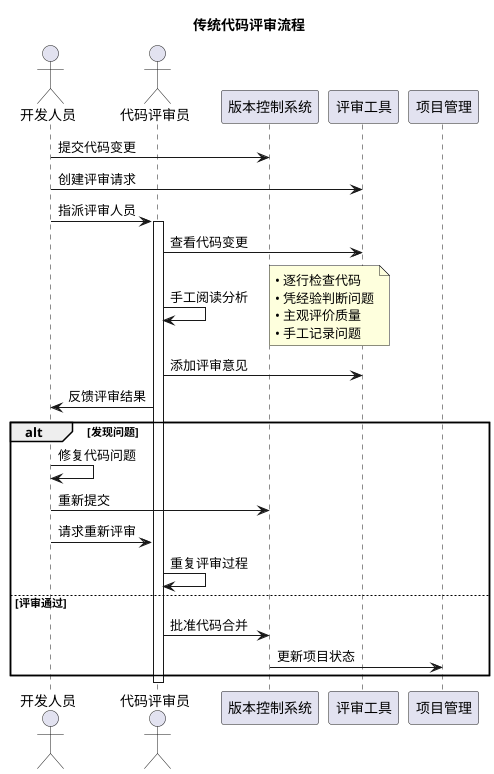

### 传统评审模式的特点

#### 📋 传统评审的优势

- **人文理解**：能够理解业务逻辑和代码意图
- **经验判断**：基于丰富经验做出判断
- **灵活性**：能够处理复杂的边界情况
- **知识传递**：促进团队成员间的技术交流
- **上下文感知**：理解项目背景和团队约定

#### ⚠️ 传统评审的局限性

- **效率低下**：人工逐行检查耗时长
- **主观性强**：评审质量依赖评审员水平
- **覆盖不全**：容易遗漏细节问题
- **一致性差**：不同评审员标准不统一
- **资源占用**：需要大量高级开发人员时间
- **疲劳效应**：长时间评审导致注意力下降

### 传统评审常见场景分析

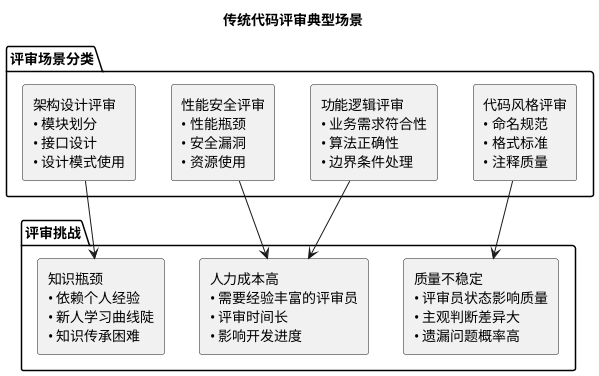

## 🔄 传统评审与AI评审对比分析

### 详细对比表

| 对比维度           | 传统人工评审        | AI智能评审             | 混合评审模式             |
| ------------------ | ------------------- | ---------------------- | ------------------------ |
| **效率性**   | ⭐⭐ 2-8小时/次     | ⭐⭐⭐⭐⭐ 5-15分钟/次 | ⭐⭐⭐⭐ 30分钟-2小时/次 |
| **一致性**   | ⭐⭐ 因人而异       | ⭐⭐⭐⭐⭐ 标准统一    | ⭐⭐⭐⭐ 基本一致        |
| **覆盖面**   | ⭐⭐⭐ 重点关注     | ⭐⭐⭐⭐⭐ 全面扫描    | ⭐⭐⭐⭐⭐ 全面+重点     |
| **准确性**   | ⭐⭐⭐ 经验依赖     | ⭐⭐⭐⭐ 模式识别强    | ⭐⭐⭐⭐⭐ 互补优势      |
| **业务理解** | ⭐⭐⭐⭐⭐ 深度理解 | ⭐⭐ 有限理解          | ⭐⭐⭐⭐ 人工补充        |
| **学习能力** | ⭐⭐⭐ 个人成长     | ⭐⭐⭐⭐⭐ 持续学习    | ⭐⭐⭐⭐ 双向学习        |
| **成本控制** | ⭐⭐ 人力成本高     | ⭐⭐⭐⭐ 工具成本可控  | ⭐⭐⭐ 平衡成本          |

### 实际案例对比

#### 案例1：代码规范检查

**传统评审方式：**

```javascript
// 评审员需要手动检查的问题
function processUserData(userData) {  // 命名可以更具体
    var result = [];                  // 应该使用const或let
    for(var i=0;i<userData.length;i++){  // 格式不规范，缺少空格
        if(userData[i].active){       // 缺少严格等于
            result.push(userData[i]); // 逻辑正确但可优化
        }
    }
    return result;                    // 缺少注释说明
}
```

**评审员手工反馈：**

- ✍️ 需要15-30分钟仔细阅读
- 📝 手动记录6-8个问题点
- 🤔 可能遗漏格式细节
- 💭 需要考虑团队编码标准

**AI评审方式：**

```javascript
// AI自动检测并提供修复建议
/**
 * 处理活跃用户数据
 * @param {Array} userData - 用户数据数组
 * @returns {Array} 活跃用户列表
 */
function processActiveUserData(userData) {
    return userData.filter(user => user.active === true);
}
```

**AI自动反馈：**

- ⚡ 2秒内完成检查
- 🎯 精确定位所有问题
- 💡 提供具体修复建议
- 📊 生成详细评分报告

### 评审模式演进路径

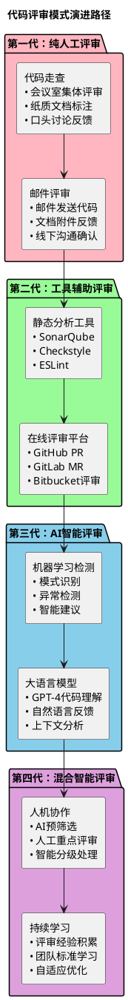

### 转型实施策略

#### 渐进式转型路径

1. **阶段1：工具引入（1-2周）**

   - 保持现有人工评审流程
   - 引入基础静态分析工具
   - 团队熟悉工具操作
2. **阶段2：AI辅助（2-4周）**

   - AI工具并行运行
   - 对比AI和人工评审结果
   - 调整AI规则和阈值
3. **阶段3：流程优化（4-6周）**

   - AI处理常规问题
   - 人工关注复杂逻辑
   - 建立分层评审机制
4. **阶段4：深度整合（持续）**

   - 完全整合的评审流程
   - 持续优化和学习
   - 形成团队最佳实践

## 🏗️ AI代码评审整体架构

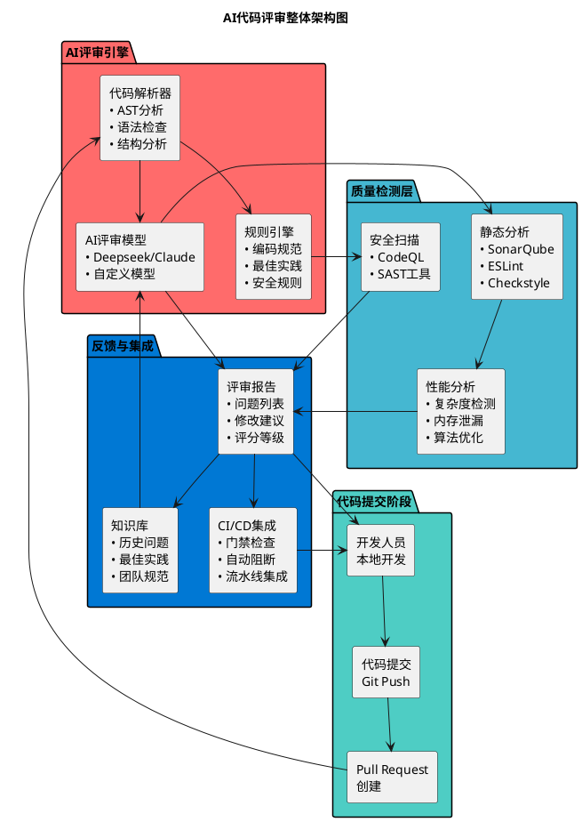

## 🔄 AI评审工作流程

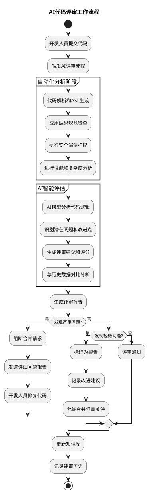

## 💡 传统评审痛点与AI解决方案

### 传统评审面临的核心挑战

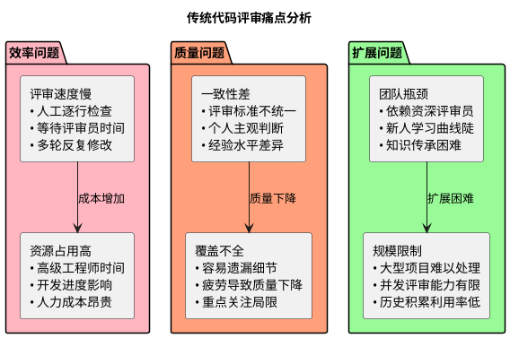

### AI评审的解决方案

| 传统评审痛点         | AI评审解决方案 | 具体优势                                                    |
| -------------------- | -------------- | ----------------------------------------------------------- |
| **评审速度慢** | 秒级完成分析   | • 自动化扫描``• 并行处理``• 即时反馈       |
| **标准不一致** | 统一规则引擎   | • 标准化检查``• 一致性保证``• 可配置规则   |
| **覆盖不全**   | 全面深度扫描   | • 100%代码覆盖``• 多维度分析``• 细节不遗漏 |
| **经验依赖**   | 知识库积累     | • 持续学习``• 经验复用``• 智能推荐         |
| **人力成本高** | 自动化处理     | • 减少人工投入``• 24/7可用``• 成本可控     |

### 实际效果对比数据

#### 某科技公司实施前后数据对比

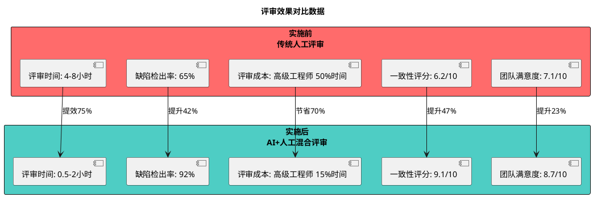

### 混合评审最佳实践

#### 分层评审策略

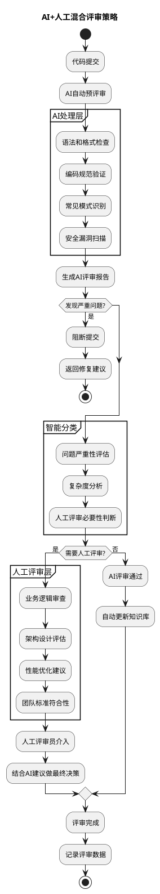

## 🤖 主流AI代码评审工具

### 1. GitHub Copilot 与 CodeQL

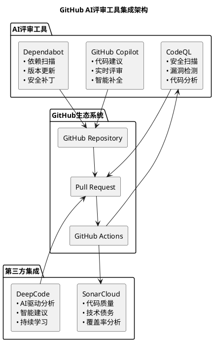

### 2. 企业级AI评审平台

| 工具名称                     | 核心功能     | AI特性                     | 适用场景      |
| ---------------------------- | ------------ | -------------------------- | ------------- |
| **SonarQube**          | 代码质量管理 | 智能规则推荐、异常模式识别 | 企业级项目    |
| **DeepCode (Snyk)**    | 安全代码分析 | 机器学习驱动的漏洞检测     | 安全敏感应用  |
| **Amazon CodeGuru**    | 性能优化建议 | AWS机器学习算法            | 云原生应用    |
| **Microsoft CodeLens** | 代码洞察     | AI驱动的代码理解           | .NET生态系统  |
| **JetBrains Qodana**   | 静态分析     | 智能代码检查               | JetBrains用户 |

## 🎯 AI评审场景实践

### 场景1：代码风格和规范检查

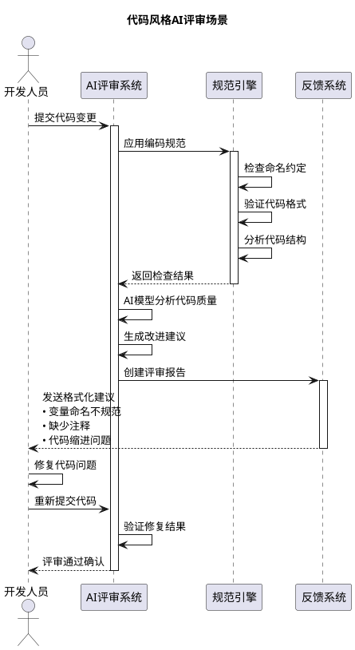

#### 实践案例：JavaScript代码规范检查

**原始代码（存在问题）：**

```javascript
// 问题代码示例
function calc(a,b) {
var result=a+b
return result
}

let user_data = {
name: "john",
age:25
}
```

**AI评审建议：**

```javascript
// AI建议的改进版本
/**
 * 计算两个数字的和
 * @param {number} firstNumber - 第一个数字
 * @param {number} secondNumber - 第二个数字
 * @returns {number} 两数之和
 */
function calculateSum(firstNumber, secondNumber) {
    const result = firstNumber + secondNumber;
    return result;
}

const userData = {
    name: "john",
    age: 25
};
```

### 场景2：安全漏洞检测

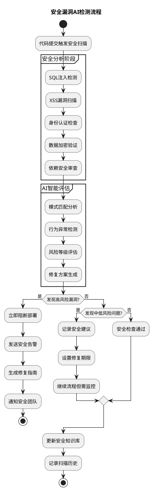

#### 安全检测实践案例

**问题代码：**

```python
# 存在SQL注入风险的代码
def get_user(username):
    query = f"SELECT * FROM users WHERE username = '{username}'"
    return execute_query(query)

# 存在密码明文存储问题
def create_user(username, password):
    user_data = {
        'username': username,
        'password': password  # 明文密码
    }
    return save_user(user_data)
```

**AI修复建议：**

```python
# AI建议的安全代码
import hashlib
import secrets
from sqlalchemy import text

def get_user(username):
    # 使用参数化查询防止SQL注入
    query = text("SELECT * FROM users WHERE username = :username")
    return execute_query(query, username=username)

def create_user(username, password):
    # 密码加盐哈希处理
    salt = secrets.token_hex(32)
    password_hash = hashlib.pbkdf2_hmac(
        'sha256', 
        password.encode('utf-8'), 
        salt.encode('utf-8'), 
        100000
    )
  
    user_data = {
        'username': username,
        'password_hash': password_hash.hex(),
        'salt': salt
    }
    return save_user(user_data)
```

### 场景3：性能优化建议

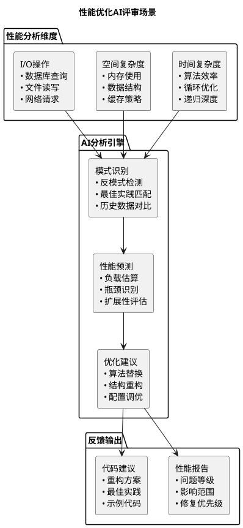

## 🛠️ AI评审工具配置指南

### 1. SonarQube + AI插件配置

```yaml
# sonar-project.properties 配置示例
sonar.projectKey=my-project
sonar.projectName=My Project
sonar.projectVersion=1.0
sonar.sources=src
sonar.tests=tests
sonar.language=java

# AI增强配置
sonar.ai.enabled=true
sonar.ai.model=gpt-4
sonar.ai.threshold=0.8
sonar.ai.customRules=custom-rules.xml
```

### 2. GitHub Actions AI评审配置

```yaml
# .github/workflows/ai-code-review.yml
name: AI Code Review

on:
  pull_request:
    branches: [ main, develop ]

jobs:
  ai-review:
    runs-on: ubuntu-latest
  
    steps:
    - uses: actions/checkout@v3
  
    - name: Setup Node.js
      uses: actions/setup-node@v3
      with:
        node-version: '18'
  
    - name: Install dependencies
      run: npm install
  
    - name: Run ESLint with AI
      run: npx eslint . --ext .js,.ts --format=json > eslint-report.json
  
    - name: AI Code Review
      uses: github/ai-code-reviewer@v1
      with:
        github-token: ${{ secrets.GITHUB_TOKEN }}
        openai-api-key: ${{ secrets.OPENAI_API_KEY }}
        review-model: 'gpt-4'
        severity-threshold: 'medium'
      
    - name: Comment PR
      uses: github/ai-review-comment@v1
      with:
        github-token: ${{ secrets.GITHUB_TOKEN }}
        report-path: './ai-review-report.json'
```

### 3. VS Code AI评审插件配置

```json
// .vscode/settings.json
{
    "ai-code-review.enabled": true,
    "ai-code-review.provider": "openai",
    "ai-code-review.model": "gpt-4",
    "ai-code-review.autoReview": true,
    "ai-code-review.reviewOnSave": true,
    "ai-code-review.severity": {
        "security": "error",
        "performance": "warning",
        "style": "info"
    },
    "ai-code-review.customRules": [
        {
            "name": "禁用console.log",
            "pattern": "console\\.log\\(",
            "message": "生产环境请使用日志框架",
            "severity": "warning"
        }
    ]
}
```

## 📊 评审效果度量

### KPI指标体系

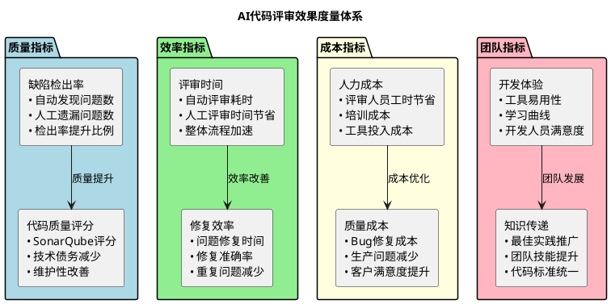

### 度量数据示例

| 指标类别           | 度量项       | 实施前  | 实施后  | 改善程度 |
| ------------------ | ------------ | ------- | ------- | -------- |
| **质量指标** | 缺陷检出率   | 65%     | 90%     | +38.5%   |
|                    | 代码质量评分 | 6.2/10  | 8.5/10  | +37.1%   |
| **效率指标** | 评审时间     | 4小时   | 1.5小时 | -62.5%   |
|                    | 问题修复时间 | 2天     | 0.5天   | -75%     |
| **成本指标** | 评审人力成本 | 100%    | 40%     | -60%     |
|                    | 生产Bug数量  | 15个/月 | 5个/月  | -66.7%   |

## 🎓 培训实践练习

### 练习1：配置AI代码评审环境

**目标**：在本地项目中集成AI代码评审工具

**步骤**：

1. 选择一个现有项目
2. 安装SonarQube或配置GitHub Actions
3. 配置AI评审规则
4. 提交测试代码并观察评审结果

**预期结果**：成功接收到AI评审报告

### 练习2：自定义评审规则

**目标**：根据团队需求创建自定义评审规则

**任务**：

```javascript
// 创建检测未使用变量的规则
function detectUnusedVariables(code) {
    // TODO: 实现检测逻辑
    // 1. 解析AST
    // 2. 识别变量声明
    // 3. 检查变量使用情况
    // 4. 返回未使用变量列表
}

// 创建检测过长函数的规则
function detectLongFunctions(code, maxLines = 50) {
    // TODO: 实现检测逻辑
}
```

### 练习3：评审报告分析

**场景**：分析以下AI评审报告，制定修复计划

```json
{
    "review_result": {
        "overall_score": 7.2,
        "issues": [
            {
                "type": "security",
                "severity": "high",
                "line": 42,
                "message": "Potential SQL injection vulnerability",
                "suggestion": "Use parameterized queries"
            },
            {
                "type": "performance",
                "severity": "medium", 
                "line": 78,
                "message": "Inefficient loop detected",
                "suggestion": "Consider using map() instead of manual iteration"
            }
        ]
    }
}
```

## 🚀 实施路线图

```plantuml
@startuml
title AI代码评审实施路线图

robust "阶段1: 基础建设" as Phase1
robust "阶段2: 工具集成" as Phase2  
robust "阶段3: 规则定制" as Phase3
robust "阶段4: 全面推广" as Phase4

@Phase1
0 is 需求调研
+1 is 工具选型
+2 is 环境搭建
+3 is 基础配置

@Phase2
+2 is CI/CD集成
+3 is 工作流配置
+4 is 初步测试
+5 is 问题修复

@Phase3
+4 is 规则定制
+5 is 团队培训
+6 is 试点运行
+7 is 效果评估

@Phase4
+6 is 全量推广
+7 is 持续优化
+8 is 知识沉淀
+9 is 流程固化

@enduml
```

### 实施时间表

| 阶段            | 时间周期 | 主要任务            | 交付成果         |
| --------------- | -------- | ------------------- | ---------------- |
| **阶段1** | 2-3周    | 环境搭建、工具配置  | 可用的AI评审环境 |
| **阶段2** | 3-4周    | CI/CD集成、流程配置 | 自动化评审流水线 |
| **阶段3** | 4-6周    | 规则定制、团队培训  | 定制化评审标准   |
| **阶段4** | 持续进行 | 全面推广、持续优化  | 成熟的评审体系   |

## 🔧 故障排除指南

### 常见问题及解决方案

| 问题类型              | 症状描述             | 解决方案                        |
| --------------------- | -------------------- | ------------------------------- |
| **API调用失败** | AI服务无响应         | 检查API密钥、网络连接、服务状态 |
| **误报率高**    | 正常代码被标记为问题 | 调整规则阈值、更新训练数据      |
| **性能问题**    | 评审速度过慢         | 优化扫描范围、升级硬件资源      |
| **集成问题**    | 与现有工具冲突       | 检查插件兼容性、更新版本        |

## 📚 参考资源

### 学习资料

1. **官方文档**

   - [GitHub Copilot文档](https://docs.github.com/copilot)
   - [SonarQube用户指南](https://docs.sonarqube.org)
   - [CodeQL教程](https://codeql.github.com/docs/)
2. **最佳实践**

   - 《AI辅助软件开发》
   - 《现代代码审查实践》
   - 《DevSecOps实施指南》
3. **社区资源**

   - Stack Overflow AI标签
   - Reddit r/MachineLearning
   - GitHub AI/ML项目

### 工具推荐

- **开源工具**：ESLint、Prettier、SonarQube Community
- **商业工具**：GitHub Copilot、Amazon CodeGuru、JetBrains Qodana
- **云服务**：Azure DevOps、GitLab CI/CD、Jenkins

## 📈 成功案例

### 案例1：某大型互联网公司 - 传统到AI的转型实践

#### 转型前现状（传统人工评审）

- **团队规模**：200+开发人员，20名资深评审员
- **评审现状**：
  - 日均代码提交量1000+次，人工评审排队严重
  - 平均评审周期4-6小时，影响开发节奏
  - 评审质量不稳定，标准不统一
  - 资深工程师50%时间用于代码评审

#### AI转型方案

- **技术选型**：GitHub Copilot + SonarQube + 自定义AI规则引擎
- **实施策略**：分阶段渐进式转型
  1. **阶段1**：AI工具试点，保留人工评审
  2. **阶段2**：AI处理常规问题，人工关注核心逻辑
  3. **阶段3**：全面AI+人工混合评审模式

#### 转型效果对比

| 指标项目                     | 转型前  | 转型后       | 改善程度          |
| ---------------------------- | ------- | ------------ | ----------------- |
| **评审效率**           | 4-6小时 | 30分钟-2小时 | **提升70%** |
| **缺陷检出率**         | 65%     | 92%          | **提升45%** |
| **评审一致性**         | 6.5/10  | 9.2/10       | **提升42%** |
| **资深工程师时间投入** | 50%     | 15%          | **节省70%** |
| **开发人员满意度**     | 7.1/10  | 9.2/10       | **提升30%** |
| **代码合并周期**       | 2-3天   | 4-8小时      | **提速80%** |

### 案例2：某金融科技公司 - 安全合规导向的AI评审

#### 业务背景与挑战

- **行业特点**：金融级安全要求，严格合规标准
- **传统痛点**：
  - 安全漏洞检测依赖人工经验，遗漏风险高
  - 合规性检查繁琐，审计成本高昂
  - 安全专家稀缺，评审瓶颈严重

#### AI解决方案架构

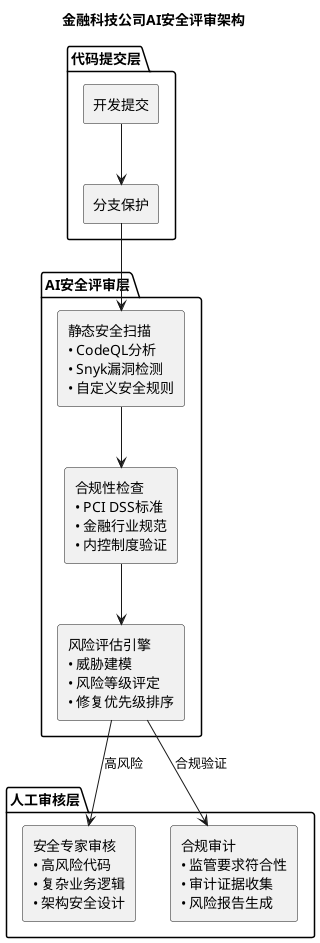

#### 实施效果

- **安全效果**：

  - 安全漏洞检出率从70%提升到99.5%
  - 零Day漏洞流入生产环境数量下降95%
  - 安全评审时间从2天缩短到2小时
- **合规效果**：

  - 合规检查自动化率达到95%
  - 审计成本降低60%
  - 监管检查通过率100%
- **业务效果**：

  - 产品上线周期缩短40%
  - 开发团队生产力提升35%
  - 客户信任度和业务增长率提升

### 案例3：某创业公司 - 小团队的AI评审实践

#### 场景特点

- **团队规模**：10人技术团队，无专职评审员
- **传统困境**：
  - 缺乏评审经验，质量参差不齐
  - 时间紧张，评审经常被跳过
  - 线上bug频发，维护成本高

#### 轻量级AI评审方案

- **工具选择**：VS Code插件 + GitHub Actions
- **配置策略**：最小化配置，快速生效
- **评审规则**：基于行业最佳实践

#### 效果展示

```plantuml
@startuml
title 创业公司AI评审效果对比

robust "代码质量分数" as Quality
robust "Bug数量/月" as Bugs  
robust "开发效率" as Efficiency

@Quality
0 is 5.2
1 is 5.5
2 is 6.8
3 is 7.9
4 is 8.4
5 is 8.7

@Bugs
0 is 25
1 is 22
2 is 15
3 is 8
4 is 5
5 is 3

@Efficiency
0 is 基准100%
1 is 105%
2 is 125%
3 is 140%
4 is 150%  
5 is 155%

@0
AI评审启动

@3
规则调优完成

@5
流程完全适应

@enduml
```

### 转型成功的关键因素

#### 🎯 技术层面

- **工具选择合适**：根据团队技术栈选择兼容工具
- **配置循序渐进**：从基础规则开始，逐步完善
- **持续优化调整**：根据实际效果调整规则和流程

#### 👥 人员层面

- **管理层支持**：获得足够的资源和时间投入
- **团队培训充分**：确保每个人都能熟练使用工具
- **文化转变配合**：从抵触到接受再到依赖的心态转变

#### 📊 流程层面

- **分阶段实施**：避免一步到位造成的混乱
- **效果度量跟踪**：用数据说话，证明转型价值
- **经验总结分享**：建立最佳实践知识库

## 🎯 总结与展望

### 传统评审到AI评审的转型价值

通过以上案例分析，我们可以看到AI代码评审相比传统人工评审具有显著优势：

1. **效率提升显著**：评审时间平均缩短70-80%
2. **质量保障提升**：缺陷检出率平均提高40-50%
3. **成本控制有效**：人力成本节省60-70%
4. **一致性大幅改善**：标准统一，减少主观判断差异
5. **团队满意度提高**：减少重复工作，专注创造性任务

### AI代码评审技术发展趋势

- **更智能的分析**：从语法检查向业务逻辑理解发展
- **个性化建议**：基于团队历史数据的定制化评审
- **实时协作**：AI与开发者的实时交互评审
- **全链路集成**：从开发到部署的全流程质量保障
- **自主学习能力**：持续从团队实践中学习优化

### 实施建议

#### 对于大型企业

- 建议采用**分阶段渐进式转型**
- 重点关注**安全和合规**要求
- 投入充足资源进行**定制化开发**

#### 对于中小团队

- 选择**成熟的SaaS工具**快速启动
- 关注**成本效益平衡**
- 重视**团队培训**和文化转变

#### 对于创业公司

- 采用**轻量级集成方案**
- 利用**云服务**降低初始投入
- 重点解决**最痛点问题**

通过持续学习和实践，AI代码评审将成为现代软件开发团队的核心竞争力，帮助团队在保证代码质量的同时大幅提升开发效率。

---

*本培训文档持续更新中，欢迎团队成员贡献最佳实践和使用经验。*
