# 技术债务AI识别培训文档

## 📖 文档概述

本培训文档旨在帮助开发团队和技术管理者掌握基于AI技术的技术债务识别方法，建立系统化的技术债务管理体系，通过智能化手段提升代码质量和系统可维护性。

### 🎯 培训目标

- **理解技术债务本质**：掌握技术债务的定义、分类和影响
- **学会AI识别技术**：熟练使用AI工具识别和评估技术债务
- **建立管理体系**：制定技术债务管理策略和优化计划
- **提升团队能力**：培养团队技术债务意识和处理能力

## 📚 技术债务理论基础

### 🔍 技术债务定义


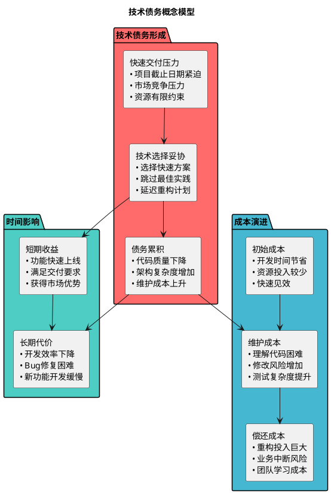

### 📊 技术债务分类体系

根据不同维度，技术债务可以分为多种类型：

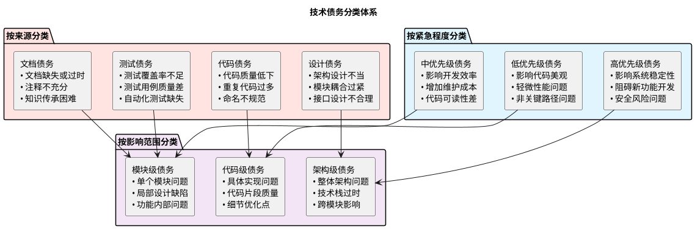

### 🎯 常见技术债务类型详解

#### 1. 代码质量债务

**典型表现：**

```java
// 不良代码示例 - 存在多种债务
public class UserManager {
    // 命名不规范
    private List<Object> u;
    // 魔法数字
    private final int MAX = 100;
  
    // 方法过长，职责不清
    public String processUser(Object userData) {
        // 重复代码
        if(userData == null) {
            System.out.println("Error: null data");
            return "error";
        }
      
        // 深层嵌套
        if(userData instanceof User) {
            if(((User)userData).isActive()) {
                if(((User)userData).getAge() > 18) {
                    if(u.size() < MAX) {
                        // 业务逻辑和数据操作混杂
                        u.add(userData);
                        // 硬编码
                        return "success_" + System.currentTimeMillis();
                    }
                }
            }
        }
        return "failed";
    }
}
```

**AI识别重点：**

- 代码复杂度分析
- 重复代码检测
- 命名规范检查
- 方法长度分析
- 圈复杂度计算

#### 2. 架构设计债务

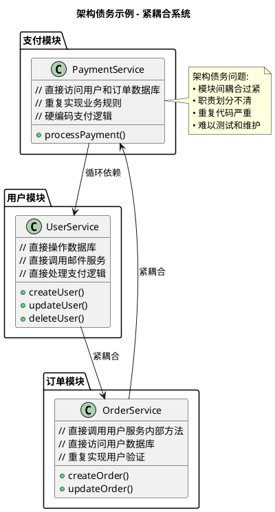

#### 3. 测试债务

| 债务类型             | 具体表现         | 影响程度    | 典型场景           |
| -------------------- | ---------------- | ----------- | ------------------ |
| **覆盖率债务** | 测试覆盖率<60%   | 🔴 高风险   | 核心业务逻辑未测试 |
| **质量债务**   | 测试用例设计不当 | 🟡 中风险   | 只测试正常流程     |
| **自动化债务** | 手工测试比例>50% | 🟡 中风险   | 回归测试效率低     |
| **维护债务**   | 测试代码质量差   | 🟠 中低风险 | 测试代码难以维护   |

#### 4. 性能债务

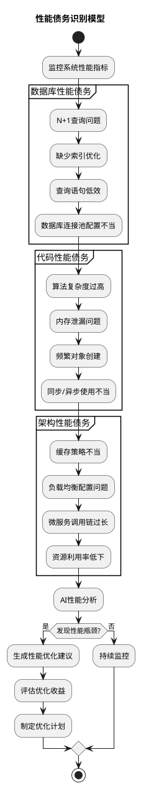

## 🤖 AI技术债务识别系统

### 🏗️ AI识别系统架构

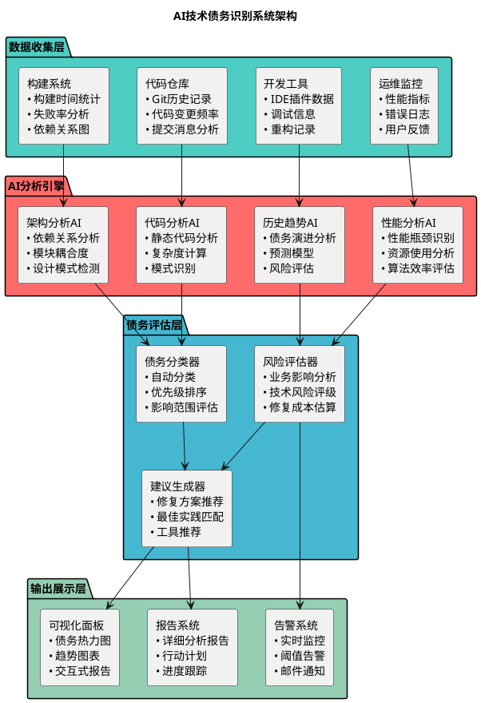

### 🔍 AI识别算法与技术

#### 1. 静态代码分析AI

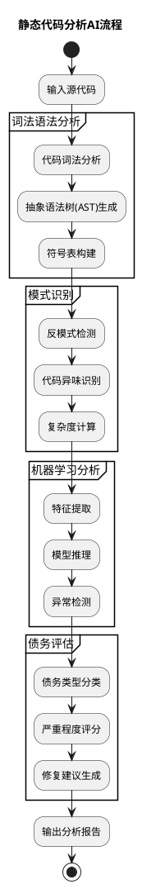

**关键技术指标：**

- **圈复杂度（Cyclomatic Complexity）**：> 10 为高复杂度债务
- **代码重复度**：重复率 > 5% 需要关注
- **类/方法长度**：单个方法 > 50行，单个类 > 500行
- **扇入扇出**：高扇入低扇出模块存在设计问题

#### 2. 架构债务AI识别

```python
# AI架构分析示例代码
class ArchitecturalDebtAnalyzer:
    def __init__(self):
        self.dependency_graph = DependencyGraph()
        self.coupling_analyzer = CouplingAnalyzer()
        self.pattern_detector = DesignPatternDetector()
  
    def analyze_architectural_debt(self, codebase):
        """分析架构级技术债务"""
        results = {
            'coupling_issues': [],
            'dependency_cycles': [],
            'pattern_violations': [],
            'modularity_score': 0
        }
      
        # 依赖关系分析
        dependencies = self.dependency_graph.build(codebase)
        results['dependency_cycles'] = self.detect_cycles(dependencies)
      
        # 耦合度分析
        coupling_metrics = self.coupling_analyzer.calculate_metrics(codebase)
        results['coupling_issues'] = self.identify_high_coupling(coupling_metrics)
      
        # 设计模式检测
        pattern_analysis = self.pattern_detector.analyze(codebase)
        results['pattern_violations'] = self.find_pattern_violations(pattern_analysis)
      
        # 模块化评分
        results['modularity_score'] = self.calculate_modularity_score(
            coupling_metrics, dependencies
        )
      
        return results
  
    def detect_cycles(self, dependencies):
        """检测循环依赖"""
        # 使用图算法检测环路
        cycles = []
        visited = set()
        rec_stack = set()
      
        def dfs(node):
            visited.add(node)
            rec_stack.add(node)
          
            for neighbor in dependencies.get(node, []):
                if neighbor not in visited:
                    if dfs(neighbor):
                        return True
                elif neighbor in rec_stack:
                    cycles.append(self.build_cycle_path(node, neighbor))
                    return True
          
            rec_stack.remove(node)
            return False
      
        for node in dependencies:
            if node not in visited:
                dfs(node)
      
        return cycles
```

### 📊 AI识别效果度量

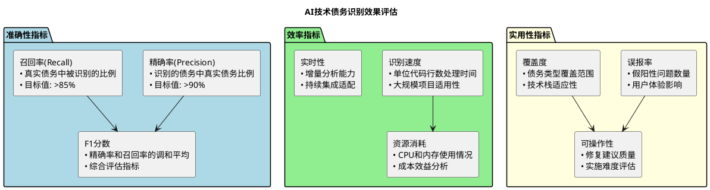

## 🛠️ AI技术债务识别工具

### 主流AI分析工具对比

| 工具名称              | 主要功能       | AI特性           | 适用场景      | 成本   |
| --------------------- | -------------- | ---------------- | ------------- | ------ |
| **SonarQube**   | 代码质量分析   | 机器学习规则优化 | 企业级项目    | 💰💰💰 |
| **CodeClimate** | 技术债务评估   | AI驱动的债务识别 | 中大型项目    | 💰💰   |
| **DeepCode**    | AI代码分析     | 深度学习模型     | 安全敏感项目  | 💰💰   |
| **Codacy**      | 自动化代码审查 | 智能规则推荐     | 开源/商业项目 | 💰💰   |
| **NDepend**     | .NET代码分析   | 趋势分析和预测   | .NET生态      | 💰💰   |

### 🔧 工具配置最佳实践

#### SonarQube + AI插件配置

```yaml
# sonar-project.properties
sonar.projectKey=tech-debt-analysis
sonar.projectName=Technical Debt Analysis
sonar.projectVersion=1.0

# 启用AI功能
sonar.ai.enabled=true
sonar.ai.technicalDebt.enabled=true
sonar.ai.debt.threshold=0.7

# 技术债务规则配置
sonar.debt.analysis.includeTests=false
sonar.debt.sqaleRatingGrid=0.1,0.2,0.5,1.0
sonar.debt.hoursInDay=8

# AI模型配置
sonar.ai.model.codeSmell=gpt-4-code-analysis
sonar.ai.model.architecture=custom-architecture-model
sonar.ai.confidence.threshold=0.85

# 自定义债务规则
sonar.customRules.techDebt.complexity.max=15
sonar.customRules.techDebt.duplicateLines.max=5%
sonar.customRules.techDebt.methodLength.max=30
```

### 📈 AI识别场景实践

#### 场景1：大型遗留系统债务识别

**背景**：某电商平台10年历史，200万行代码，多技术栈混合

```plantuml
@startuml
title 大型遗留系统技术债务识别场景

actor 技术负责人 as TechLead
participant "AI分析系统" as AI
participant "代码仓库" as Repo  
participant "监控系统" as Monitor
participant "报告系统" as Report

TechLead -> AI: 启动全量债务分析
activate AI

AI -> Repo: 获取代码库数据
activate Repo
Repo --> AI: 返回源代码、Git历史
deactivate Repo

AI -> Monitor: 获取运行时数据
activate Monitor  
Monitor --> AI: 返回性能指标、错误日志
deactivate Monitor

partition "AI智能分析" {
    AI -> AI: 静态代码分析
    note right: • 复杂度计算\n• 重复代码检测\n• 架构依赖分析
  
    AI -> AI: 动态行为分析
    note right: • 性能热点识别\n• 错误模式分析\n• 使用频率统计
  
    AI -> AI: 历史演进分析  
    note right: • 代码腐化趋势\n• 维护成本变化\n• 开发效率影响
}

AI -> Report: 生成综合债务报告
activate Report

Report -> Report: 债务分级排序
Report -> Report: 修复成本估算
Report -> Report: 业务影响评估

Report --> TechLead: 输出分析结果
deactivate Report

TechLead -> TechLead: 制定债务偿还计划

deactivate AI

@enduml
```

**识别结果示例：**

```json
{
    "project": "E-commerce Platform",
    "analysis_date": "2024-01-15",
    "total_debt_hours": 2847,
    "debt_classification": {
        "critical": {
            "count": 23,
            "estimated_hours": 856,
            "categories": [
                "Circular dependencies in payment module",
                "SQL injection vulnerabilities",
                "Memory leaks in session management"
            ]
        },
        "major": {
            "count": 67,
            "estimated_hours": 1245,
            "categories": [
                "High complexity methods (>20 CC)",
                "Duplicate business logic",
                "Missing error handling"
            ]
        },
        "minor": {
            "count": 134,
            "estimated_hours": 746,
            "categories": [
                "Code style inconsistencies",
                "Missing documentation",
                "Inefficient algorithms"
            ]
        }
    },
    "priority_modules": [
        {
            "module": "payment-service",
            "debt_hours": 456,
            "risk_level": "high",
            "business_impact": "critical"
        },
        {
            "module": "user-management",
            "debt_hours": 234,
            "risk_level": "medium",
            "business_impact": "high"
        }
    ]
}
```

#### 场景2：敏捷开发中的持续债务监控

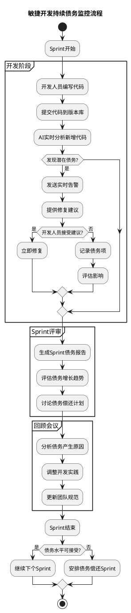

### 🎯 AI识别策略配置

#### 1. 规则配置策略

```yaml
# 技术债务AI识别规则配置
debt_detection_rules:
  code_complexity:
    cyclomatic_complexity:
      threshold: 10
      severity: medium
      ai_confidence: 0.9
  
    cognitive_complexity:
      threshold: 15
      severity: high
      ai_confidence: 0.85
  
  code_duplication:
    duplicate_lines:
      threshold: 10
      severity: medium
      ai_confidence: 0.95
  
    similar_blocks:
      threshold: 0.8  # 相似度
      severity: low
      ai_confidence: 0.7
  
  architectural_debt:
    circular_dependencies:
      severity: critical
      ai_confidence: 0.99
  
    high_coupling:
      threshold: 0.7
      severity: high
      ai_confidence: 0.88
  
  performance_debt:
    n_plus_one_queries:
      severity: high
      ai_confidence: 0.92
  
    memory_leaks:
      severity: critical
      ai_confidence: 0.85

# AI模型配置
ai_models:
  code_analysis:
    model_type: "transformer"
    model_name: "codebert-base"
    confidence_threshold: 0.8
  
  architecture_analysis:
    model_type: "graph_neural_network"
    model_name: "gat-architecture"
    confidence_threshold: 0.75
  
  performance_analysis:
    model_type: "ensemble"
    models: ["xgboost", "lstm", "transformer"]
    voting_strategy: "weighted"
```

#### 2. 团队定制化配置

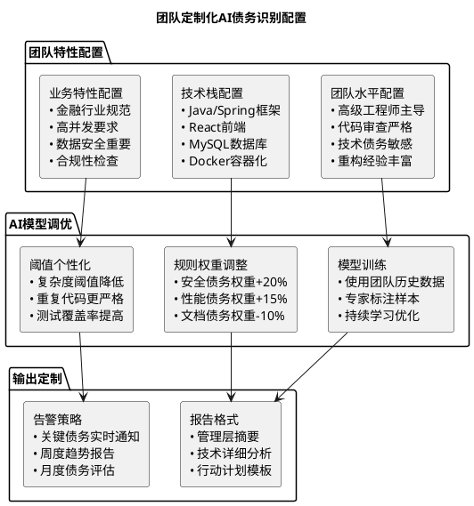

## 📊 技术债务管理策略

### 债务优先级矩阵

```plantuml
@startuml
title 技术债务优先级矩阵

!define HIGH_IMPACT_HIGH_EFFORT #FF4444
!define HIGH_IMPACT_LOW_EFFORT #44FF44  
!define LOW_IMPACT_HIGH_EFFORT #FFAA44
!define LOW_IMPACT_LOW_EFFORT #4444FF

package "高业务影响" {
    rectangle "高修复成本\n🔥 安全漏洞\n🔥 架构缺陷\n🔥 核心模块债务\n\n策略：分阶段处理\n优先级：P1" HIGH_IMPACT_HIGH_EFFORT as HighHighDebt
  
    rectangle "低修复成本\n✅ 代码规范\n✅ 简单重构\n✅ 配置优化\n\n策略：立即修复\n优先级：P0" HIGH_IMPACT_LOW_EFFORT as HighLowDebt
}

package "低业务影响" {
    rectangle "高修复成本\n⏰ 过时技术栈\n⏰ 大规模重构\n⏰ 架构升级\n\n策略：长期规划\n优先级：P3" LOW_IMPACT_HIGH_EFFORT as LowHighDebt
  
    rectangle "低修复成本\n📝 文档完善\n📝 代码注释\n📝 工具升级\n\n策略：持续改进\n优先级：P2" LOW_IMPACT_LOW_EFFORT as LowLowDebt
}

note right of HighLowDebt : 快速胜利区域\n• 立即获得收益\n• 建立团队信心\n• 释放开发效率

note right of HighHighDebt : 重要项目区域\n• 制定详细计划\n• 分配专门资源\n• 跟踪执行进度

@enduml
```

### 债务偿还策略

#### 1. 渐进式偿还策略

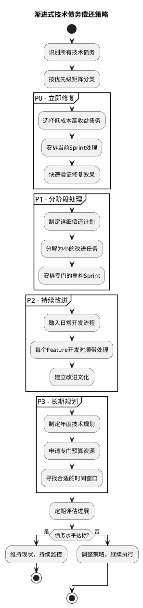

#### 2. 债务偿还ROI分析

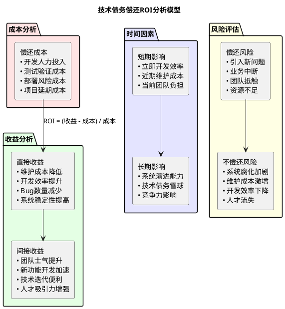

## 🎓 培训实践练习

### 练习1：债务识别实战

**场景设置**：给定一个包含多种债务的代码项目

```java
// 练习项目代码示例
public class OrderProcessor {
    private static final int MAGIC_NUMBER = 42;
    private List items;
    private String status;
    private UserManager userMgr;
    private PaymentService paymentSvc;
    private InventoryService invSvc;
    private NotificationService notifSvc;
  
    public String processOrder(Object order) {
        // TODO: 实现订单处理逻辑
        if(order == null) return null;
      
        // 深度嵌套逻辑
        if(order instanceof Order) {
            Order o = (Order)order;
            if(o.getItems().size() > 0) {
                for(int i = 0; i < o.getItems().size(); i++) {
                    OrderItem item = o.getItems().get(i);
                    if(item.getQuantity() > 0) {
                        if(invSvc.checkInventory(item.getProductId()) >= item.getQuantity()) {
                            if(o.getCustomer().getCredit() >= item.getPrice() * item.getQuantity()) {
                                // 重复的业务逻辑
                                invSvc.reserveInventory(item.getProductId(), item.getQuantity());
                                paymentSvc.charge(o.getCustomer(), item.getPrice() * item.getQuantity());
                                notifSvc.sendEmail(o.getCustomer().getEmail(), "Order confirmed");
                            }
                        }
                    }
                }
            }
        }
      
        return "processed";
    }
}
```

**练习任务**：

1. 使用AI工具分析该代码的技术债务
2. 按债务类型分类列出所有问题
3. 评估每个债务的严重程度和修复成本
4. 制定优先修复计划

### 练习2：团队债务管理策略制定

**任务描述**：为一个20人的开发团队制定技术债务管理策略

**团队背景**：

- 电商平台开发团队
- 采用敏捷开发模式
- 2周一个Sprint
- 历史债务较多，新债务还在产生

**制定内容**：

1. 债务识别工具选择和配置
2. 债务优先级评估标准
3. 偿还计划和资源分配
4. 团队激励机制设计

### 练习3：ROI分析实战

**场景**：某模块存在严重的循环依赖问题

**给定信息**：

- 修复成本：3人周
- 当前每月因此问题额外投入：0.5人周
- 影响新功能开发效率：20%
- 团队规模：10人

**计算任务**：

1. 计算该债务的年化成本
2. 评估修复后的年化收益
3. 计算ROI和回收期
4. 制定修复决策建议

## 📈 实施效果评估

### 评估指标体系

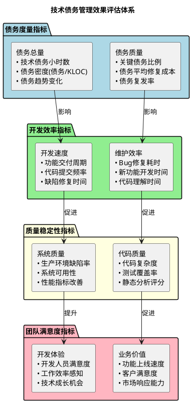

### 成功案例分享

#### 案例：某金融科技公司技术债务管理实践

**项目背景**：

- 公司规模：500+技术人员
- 系统规模：100+微服务，1000万行代码
- 债务现状：历史债务严重，影响业务创新速度

**AI识别系统实施**：

```plantuml
@startuml
title 金融科技公司债务管理实施时间线

robust "债务总量(天)" as DebtAmount
robust "开发效率" as DevEfficiency
robust "系统稳定性" as Stability
robust "团队满意度" as TeamSatisfaction

@DebtAmount
0 is 8750
3 is 8200
6 is 7100
9 is 5800
12 is 4200
15 is 3500
18 is 3100

@DevEfficiency  
0 is 基准100%
3 is 105%
6 is 120%
9 is 140%
12 is 160%
15 is 175%
18 is 185%

@Stability
0 is 96.2%
3 is 97.1%
6 is 98.2%
9 is 98.8%
12 is 99.1%
15 is 99.3%
18 is 99.5%

@TeamSatisfaction
0 is 6.8
3 is 7.2
6 is 7.8
9 is 8.3
12 is 8.7
15 is 8.9
18 is 9.1

@0
开始AI债务识别

@3
工具全面部署

@6
团队培训完成

@9
债务偿还计划执行

@12
第一阶段完成

@15
持续优化阶段

@18
成熟运营阶段

@enduml
```

**关键成果**：

- 技术债务总量减少65%（8750天 → 3100天）
- 开发效率提升85%
- 系统可用性从96.2%提升到99.5%
- 团队满意度从6.8提升到9.1

**经验总结**：

1. **管理层强力支持是成功关键**
2. **分阶段实施避免激进变革**
3. **工具与流程并重**
4. **持续监控和调优**
5. **团队文化转变最重要**

## 🚀 未来发展趋势

### AI技术债务识别发展方向

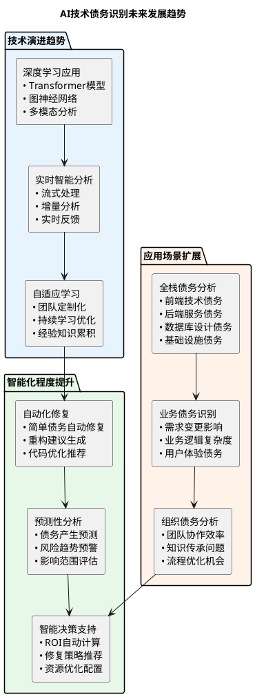

### 技术债务管理的未来愿景

**终极目标**：建立自我治愈的软件系统

- **预防为主**：在债务产生前就能识别和阻止
- **自动修复**：常见债务问题自动化解决
- **智能优化**：持续优化系统架构和代码质量
- **全生命周期管理**：从设计到退役的全流程债务控制

## 🎯 培训总结

通过本次培训，我们系统学习了技术债务AI识别的理论基础、技术方法和实践策略。主要收获包括：

### 核心知识点

1. **技术债务本质理解**：掌握债务定义、分类和影响机制
2. **AI识别技术掌握**：了解主流工具和算法原理
3. **管理策略制定**：学会债务优先级评估和偿还规划
4. **实践经验积累**：通过案例学习成功实施经验

### 行动计划建议

1. **短期行动（1-3个月）**：

   - 选择合适的AI识别工具
   - 建立基础的债务监控体系
   - 开始识别和处理高优先级债务
2. **中期规划（3-12个月）**：

   - 完善债务管理流程
   - 培养团队债务意识
   - 建立持续改进机制
3. **长期愿景（1-3年）**：

   - 实现债务的预防性管理
   - 建立智能化债务治理体系
   - 形成技术卓越文化

### 关键成功因素

- **管理层支持**：获得足够的资源和时间投入
- **团队协作**：全员参与，形成共同目标
- **工具配合**：选择合适的AI工具和流程
- **持续改进**：建立长效的监控和优化机制

技术债务管理是一个长期的系统工程，需要技术手段、管理策略和团队文化的有机结合。通过AI技术的赋能，我们可以更加高效、准确地识别和管理技术债务，为企业的持续技术创新奠定坚实基础。

---

*本培训文档将持续更新，欢迎团队成员贡献最佳实践和使用经验。*
