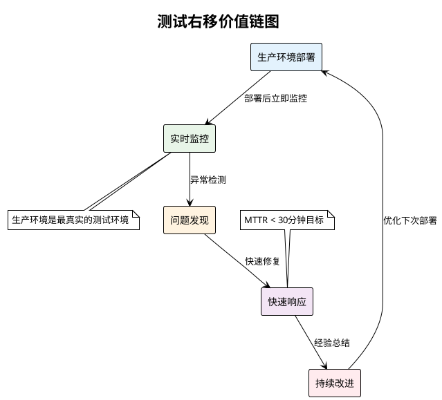
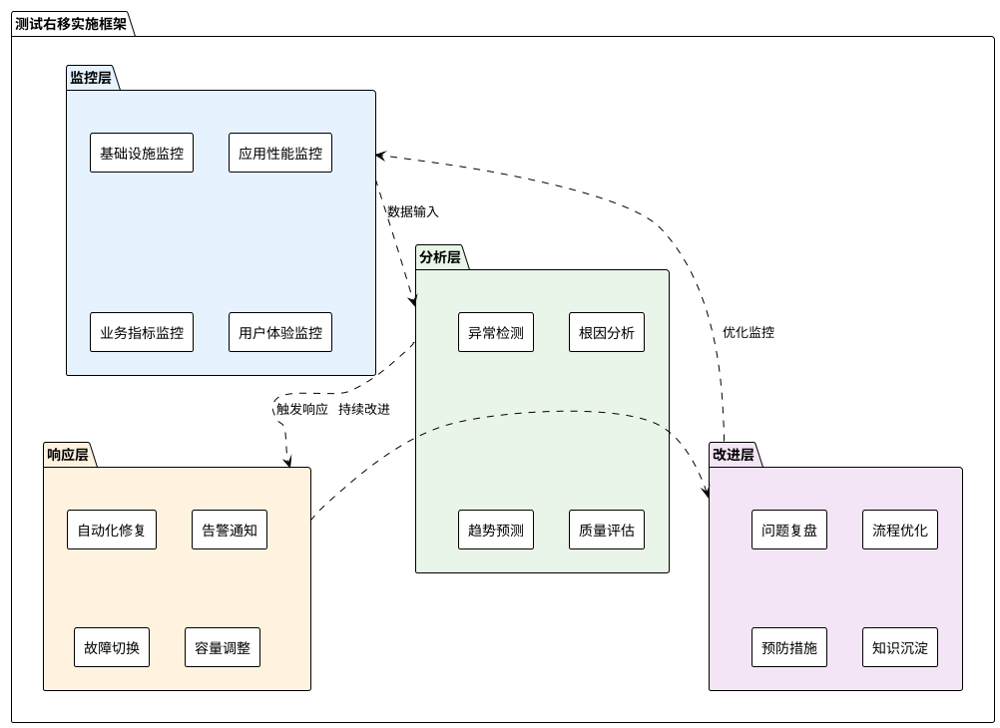
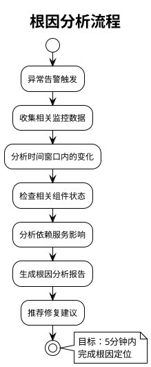
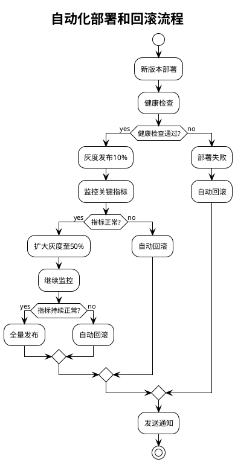
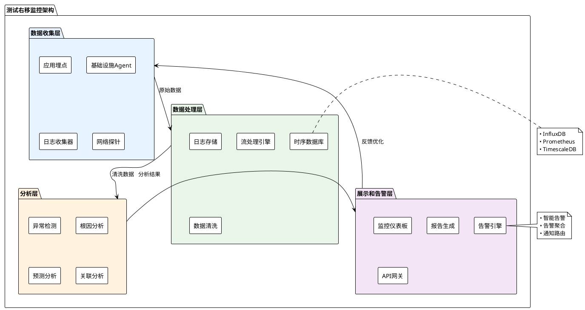
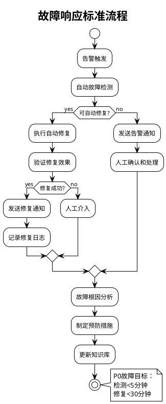
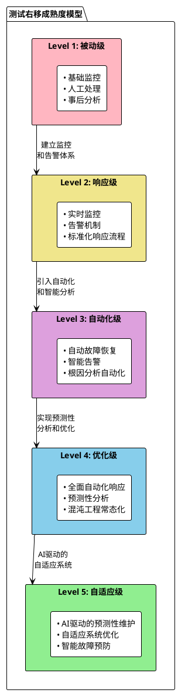

# 测试右移实施手册

## 📋 概述

测试右移（Shift Right Testing）是现代软件质量工程的重要组成部分，旨在将测试活动延伸到生产环境中，通过生产环境的实际运行数据和用户行为来验证软件质量，实现持续的质量监控和改进。测试右移与测试左移相辅相成，共同构建了覆盖软件全生命周期的质量保证体系。

## 🎯 测试右移的核心理念

### 基本概念
**测试右移**是指将测试活动从传统的预生产环境扩展到生产环境，通过生产环境的真实数据、真实用户行为和真实负载来持续验证和改进软件质量。

### 核心价值
- **真实环境验证**：在真实的生产环境中验证软件行为
- **持续质量监控**：7×24小时持续监控系统质量状态
- **快速问题发现**：第一时间发现生产环境问题
- **用户体验优化**：基于真实用户行为优化产品质量

### 理论基础



## 🏗️ 测试右移实施框架

### 四层实施架构



## 📈 测试右移实施路线图

### 阶段一：基础监控建设（1-2个月）

#### 目标设定
- 建立基础的生产环境监控体系
- 实现关键指标的实时监控
- 建立基本的告警机制

#### 关键活动

| 活动 | 负责角色 | 时间安排 | 交付物 | 成功标准 |
|------|----------|----------|--------|----------|
| **监控需求分析** | SRE + QA | 第1周 | • 监控需求清单<br>• 指标定义文档 | • 需求覆盖全面<br>• 指标定义明确 |
| **监控工具选型** | 技术团队 | 第1-2周 | • 工具对比报告<br>• 选型建议 | • 工具满足需求<br>• 成本在预算内 |
| **基础监控部署** | DevOps团队 | 第2-3周 | • 监控系统<br>• 仪表板<br>• 告警配置 | • 监控覆盖率>80%<br>• 告警响应时间<5分钟 |
| **团队培训** | SRE + 外部专家 | 第3-4周 | • 培训材料<br>• 操作手册 | • 培训完成率>90%<br>• 操作熟练度>80% |

#### 基础监控体系建设

**1. 基础设施监控**

| 监控对象 | 关键指标 | 监控工具 | 告警阈值 | 响应级别 |
|----------|----------|----------|----------|----------|
| **服务器资源** | CPU使用率、内存使用率、磁盘空间 | Prometheus + Grafana | CPU>80%, 内存>85%, 磁盘>90% | P2 |
| **网络状况** | 网络延迟、丢包率、带宽使用 | SNMP监控 | 延迟>100ms, 丢包率>1% | P2 |
| **数据库** | 连接数、查询性能、死锁数 | 数据库专用监控 | 连接数>80%, 慢查询>1s | P1 |
| **中间件** | 消息队列长度、缓存命中率 | JMX + 自定义监控 | 队列积压>1000, 命中率<90% | P2 |

**2. 应用性能监控(APM)**

```markdown
## APM监控配置清单

### 性能指标监控
- [ ] 应用响应时间监控
- [ ] 吞吐量监控
- [ ] 错误率监控
- [ ] 资源使用监控

### 事务监控
- [ ] 关键业务流程监控
- [ ] 数据库事务监控
- [ ] 外部服务调用监控
- [ ] 异步任务监控

### 用户体验监控
- [ ] 页面加载时间
- [ ] 用户操作响应时间
- [ ] 错误页面监控
- [ ] 用户满意度指标

### 分布式追踪
- [ ] 请求链路追踪
- [ ] 服务依赖映射
- [ ] 性能瓶颈识别
- [ ] 错误传播分析
```

### 阶段二：智能分析建设（2-3个月）

#### 异常检测和分析

**1. 异常检测算法实施**

| 检测类型 | 算法方法 | 适用场景 | 检测周期 | 准确率目标 |
|----------|----------|----------|----------|------------|
| **阈值检测** | 静态阈值、动态阈值 | 资源使用率、错误率 | 实时 | >95% |
| **趋势检测** | 时间序列分析 | 性能退化、容量预测 | 15分钟 | >90% |
| **异常模式** | 机器学习算法 | 复杂异常模式识别 | 5分钟 | >85% |
| **关联分析** | 相关性分析 | 多指标联合分析 | 实时 | >80% |

**2. 根因分析系统**



**根因分析检查清单：**

```markdown
## 根因分析标准流程

### 1. 数据收集（0-2分钟）
- [ ] 收集异常时间点前后30分钟的监控数据
- [ ] 检查应用日志和错误日志
- [ ] 收集相关基础设施指标
- [ ] 查看近期部署和配置变更

### 2. 初步分析（2-5分钟）
- [ ] 识别异常指标的变化趋势
- [ ] 检查是否存在级联故障
- [ ] 分析用户影响范围
- [ ] 评估业务影响程度

### 3. 深度分析（5-10分钟）
- [ ] 分析代码变更影响
- [ ] 检查外部依赖状态
- [ ] 分析资源竞争情况
- [ ] 查看历史相似问题

### 4. 根因确认（10-15分钟）
- [ ] 验证根因假设
- [ ] 确认修复方案
- [ ] 评估修复风险
- [ ] 制定回滚预案
```

#### 预测性分析

**1. 容量预测模型**

| 预测类型 | 预测算法 | 数据源 | 预测周期 | 准确率 |
|----------|----------|--------|----------|--------|
| **流量预测** | ARIMA + 机器学习 | 历史访问数据 | 未来7天 | >90% |
| **资源需求** | 线性回归 + 神经网络 | 资源使用趋势 | 未来30天 | >85% |
| **故障预测** | 异常检测 + 模式识别 | 系统健康指标 | 未来24小时 | >80% |
| **性能退化** | 趋势分析 | 性能基线对比 | 未来14天 | >85% |

**2. 业务指标监控**

```markdown
## 业务指标监控体系

### 核心业务指标
- **转化率监控**
  - 注册转化率：目标>5%
  - 购买转化率：目标>10%
  - 支付成功率：目标>99%

- **用户行为指标**
  - 活跃用户数：日活、月活
  - 用户留存率：次日、7日、30日留存
  - 会话时长：平均会话时长>5分钟

- **业务质量指标**
  - 订单成功率：目标>99.5%
  - 退款率：目标<2%
  - 客户满意度：目标>4.5/5

### 实时业务监控
- [ ] 实时订单监控
- [ ] 支付流程监控
- [ ] 用户注册流程监控
- [ ] 搜索功能监控
- [ ] 推荐系统效果监控
```

### 阶段三：自动化响应（3-4个月）

#### 自动化修复机制

**1. 自愈能力建设**

| 故障类型 | 自动修复策略 | 实现方式 | 修复时间 | 成功率目标 |
|----------|--------------|----------|----------|------------|
| **服务宕机** | 自动重启、故障转移 | K8s健康检查 | <2分钟 | >95% |
| **内存泄漏** | 自动重启、限流 | 内存阈值触发 | <5分钟 | >90% |
| **数据库连接** | 连接池重置 | 连接监控触发 | <1分钟 | >98% |
| **缓存失效** | 缓存预热、降级 | 缓存监控触发 | <30秒 | >95% |

**2. 渐进式部署和回滚**



**3. 智能告警和通知**

```markdown
## 智能告警策略

### 告警分级
- **P0 - 紧急**：核心服务完全不可用
  - 通知方式：电话 + 短信 + 邮件 + 即时消息
  - 响应时间：5分钟内
  - 升级策略：15分钟内无响应自动升级

- **P1 - 严重**：核心功能部分不可用
  - 通知方式：短信 + 邮件 + 即时消息
  - 响应时间：15分钟内
  - 升级策略：30分钟内无响应自动升级

- **P2 - 重要**：非核心功能异常
  - 通知方式：邮件 + 即时消息
  - 响应时间：30分钟内
  - 升级策略：2小时内无响应自动升级

- **P3 - 一般**：性能下降或预警
  - 通知方式：邮件
  - 响应时间：工作时间内
  - 升级策略：24小时内无响应自动升级

### 告警聚合和抑制
- **时间窗口聚合**：5分钟内相同告警合并
- **关联告警抑制**：下游告警抑制上游相关告警
- **静默期设置**：故障修复后30分钟内抑制相同告警
- **告警频率限制**：同类告警每小时最多发送3次
```

#### 混沌工程实践

**1. 混沌实验设计**

| 实验类型 | 实验目标 | 实施方式 | 实验频率 | 成功标准 |
|----------|----------|----------|----------|----------|
| **服务故障** | 验证服务容错能力 | 随机终止服务实例 | 每周 | 服务自动恢复<2分钟 |
| **网络分区** | 验证网络容错能力 | 模拟网络延迟和丢包 | 每月 | 业务功能不受影响 |
| **资源耗尽** | 验证资源管理能力 | 消耗CPU/内存资源 | 每月 | 系统自动限流/扩容 |
| **依赖故障** | 验证依赖处理能力 | 模拟外部服务故障 | 每周 | 降级策略生效 |

**2. 混沌实验实施流程**

```markdown
## 混沌实验标准流程

### 实验前准备
- [ ] 实验计划审批
- [ ] 风险评估和应急预案
- [ ] 监控和观测准备
- [ ] 团队成员通知
- [ ] 回滚机制确认

### 实验执行
- [ ] 记录系统基线状态
- [ ] 执行故障注入
- [ ] 实时监控系统行为
- [ ] 记录异常和恢复过程
- [ ] 验证业务影响

### 实验后分析
- [ ] 数据收集和分析
- [ ] 问题识别和归类
- [ ] 改进建议制定
- [ ] 实验报告编写
- [ ] 经验分享和传播
```

### 阶段四：持续优化（4-6个月）

#### 质量度量和分析

**关键指标体系：**

| 指标类别 | 具体指标 | 计算方法 | 目标值 | 监控频率 |
|----------|----------|----------|--------|----------|
| **可用性** | 系统可用性 | (总时间-故障时间)/总时间×100% | ≥99.95% | 实时 |
| **性能** | 平均响应时间 | 总响应时间/请求数 | ≤200ms | 实时 |
| **错误率** | 错误请求比率 | 错误请求数/总请求数×100% | ≤0.1% | 实时 |
| **恢复能力** | 平均恢复时间(MTTR) | 总故障恢复时间/故障次数 | ≤30分钟 | 每日 |
| **预防能力** | 平均无故障时间(MTBF) | 总运行时间/故障次数 | ≥720小时 | 每周 |

#### 用户体验监控

**1. 真实用户监控(RUM)**

```markdown
## RUM监控实施方案

### 前端性能监控
- **页面加载性能**
  - 首字节时间(TTFB)：<500ms
  - 首次内容绘制(FCP)：<1.5s
  - 最大内容绘制(LCP)：<2.5s
  - 累积布局偏移(CLS)：<0.1

- **用户交互监控**
  - 首次输入延迟(FID)：<100ms
  - 交互到下次绘制(INP)：<200ms
  - 点击响应时间：<100ms
  - 滚动流畅度：>60fps

### 用户行为分析
- **访问路径分析**
  - 用户访问热力图
  - 页面跳转路径
  - 异常退出分析
  - 转化漏斗分析

- **错误行为监控**
  - JavaScript错误
  - 网络请求失败
  - 资源加载失败
  - 用户操作异常
```

**2. 合成监控(Synthetic Monitoring)**

| 监控类型 | 监控内容 | 执行频率 | 监控位置 | 告警条件 |
|----------|----------|----------|----------|----------|
| **可用性监控** | 关键页面访问 | 1分钟 | 全球多点 | 连续3次失败 |
| **功能监控** | 关键业务流程 | 5分钟 | 主要地区 | 任何步骤失败 |
| **性能监控** | 页面加载时间 | 5分钟 | 全球多点 | 超过基线20% |
| **API监控** | 关键接口调用 | 1分钟 | 多个地区 | 响应时间>5s或错误 |

## 🛠️ 工具链建设

### 核心工具分类

#### 1. 监控工具

| 工具类型 | 推荐工具 | 主要功能 | 适用场景 |
|----------|----------|----------|----------|
| **基础设施监控** | Prometheus + Grafana<br>Zabbix<br>Nagios | 服务器、网络、存储监控 | 全栈监控 |
| **应用性能监控** | New Relic<br>AppDynamics<br>Dynatrace<br>SkyWalking | 应用性能、事务追踪 | 应用层监控 |
| **日志分析** | ELK Stack<br>Splunk<br>Fluentd + ES | 日志收集、分析、搜索 | 问题诊断 |
| **用户体验监控** | Google Analytics<br>Hotjar<br>FullStory | 真实用户行为监控 | 用户体验优化 |

#### 2. 告警和通知工具

| 工具类型 | 推荐工具 | 主要功能 | 集成方式 |
|----------|----------|----------|----------|
| **告警管理** | PagerDuty<br>Opsgenie<br>AlertManager | 告警路由、升级、抑制 | API集成 |
| **通信工具** | Slack<br>Microsoft Teams<br>钉钉 | 即时通知和协作 | Webhook集成 |
| **事件管理** | ServiceNow<br>Jira Service Desk | 事件跟踪和管理 | API集成 |

#### 3. 自动化工具

| 工具类型 | 推荐工具 | 主要功能 | 使用场景 |
|----------|----------|----------|----------|
| **容器编排** | Kubernetes<br>Docker Swarm | 自动扩缩容、故障转移 | 微服务架构 |
| **配置管理** | Ansible<br>Terraform | 基础设施即代码 | 环境管理 |
| **混沌工程** | Chaos Monkey<br>Litmus<br>Gremlin | 故障注入测试 | 韧性验证 |

### 监控架构设计



## 🔧 实施最佳实践

### 监控策略设计

#### 1. 监控覆盖矩阵

```markdown
## 监控覆盖矩阵

### 应用层监控
| 组件 | 性能指标 | 错误指标 | 业务指标 | 用户体验 |
|------|----------|----------|----------|----------|
| **Web应用** | 响应时间、吞吐量 | 5xx错误、异常数 | 注册数、订单数 | 页面加载时间 |
| **API服务** | 延迟、QPS | 错误率、超时数 | 调用成功率 | API响应质量 |
| **数据库** | 查询时间、连接数 | 死锁、慢查询 | 数据一致性 | 查询成功率 |
| **消息队列** | 消息延迟、积压数 | 消息丢失 | 处理成功率 | 消息可靠性 |

### 基础设施监控
| 层级 | 资源监控 | 性能监控 | 可用性监控 | 安全监控 |
|------|----------|----------|------------|----------|
| **物理层** | CPU、内存、磁盘 | IOPS、网络IO | 硬件故障 | 入侵检测 |
| **虚拟化** | 虚拟机资源 | 虚拟化性能 | 宿主机状态 | 访问控制 |
| **容器层** | 容器资源 | 容器性能 | Pod状态 | 镜像安全 |
| **网络层** | 带宽使用 | 网络延迟 | 连通性 | 网络安全 |
```

#### 2. 告警策略设计

**智能告警配置：**

```yaml
# 告警配置示例
alert_rules:
  # 应用性能告警
  - name: "应用响应时间异常"
    condition: "avg_response_time > 1000ms for 5 minutes"
    severity: "warning"
    notification:
      - slack: "#ops-team"
      - email: "ops@company.com"
    
  - name: "应用错误率过高"
    condition: "error_rate > 5% for 3 minutes"
    severity: "critical"
    notification:
      - pagerduty: "ops-escalation"
      - sms: "+86-138-0000-0000"
    
  # 基础设施告警
  - name: "服务器资源不足"
    condition: "cpu_usage > 90% or memory_usage > 95%"
    severity: "warning"
    auto_action: "scale_up"
    
  # 业务指标告警
  - name: "支付成功率下降"
    condition: "payment_success_rate < 99% for 10 minutes"
    severity: "critical"
    notification:
      - slack: "#business-team"
      - email: "business@company.com"

# 告警抑制规则
inhibit_rules:
  - source_match:
      alertname: "服务器宕机"
    target_match_re:
      alertname: "应用.*异常"
    equal: ["instance"]
```

### 故障响应流程

#### 1. 故障处理标准流程



#### 2. 故障等级定义

| 故障等级 | 影响范围 | 响应时间 | 修复时间 | 通知方式 | 后续行动 |
|----------|----------|----------|----------|----------|----------|
| **P0 - 致命** | 核心服务完全不可用<br>影响>50%用户 | 5分钟 | 30分钟 | 电话+短信+邮件 | 必须进行故障复盘 |
| **P1 - 严重** | 核心功能部分不可用<br>影响10%-50%用户 | 15分钟 | 2小时 | 短信+邮件+IM | 需要进行故障分析 |
| **P2 - 重要** | 非核心功能异常<br>影响<10%用户 | 30分钟 | 8小时 | 邮件+IM | 跟踪修复进展 |
| **P3 - 一般** | 性能下降或轻微影响 | 2小时 | 24小时 | 邮件 | 定期Review |

### 持续改进机制

#### 1. 故障复盘(Post-mortem)流程

```markdown
## 故障复盘标准模板

### 基本信息
- **故障ID**：INC-2024-001
- **发生时间**：2024-01-15 14:30:00
- **恢复时间**：2024-01-15 15:15:00
- **影响时长**：45分钟
- **故障等级**：P1

### 故障描述
- **故障现象**：用户登录功能完全不可用
- **影响范围**：所有Web和移动端用户
- **业务影响**：约2000用户无法登录，损失预估10万元

### 时间线
| 时间 | 事件 | 负责人 |
|------|------|--------|
| 14:30 | 监控告警触发 | 系统 |
| 14:32 | 值班人员确认故障 | 张三 |
| 14:35 | 开始故障排查 | 李四 |
| 14:50 | 发现根因：数据库连接池耗尽 | 王五 |
| 15:00 | 重启应用服务 | 李四 |
| 15:15 | 服务完全恢复 | 张三 |

### 根因分析
- **直接原因**：数据库连接池配置过小
- **根本原因**：缺乏连接池监控和自动扩容机制
- **诱发因素**：营销活动导致流量激增

### 改进措施
- **立即行动**：
  - [ ] 调整数据库连接池配置
  - [ ] 增加连接池监控告警
  
- **短期改进**：
  - [ ] 实施数据库连接池自动扩容
  - [ ] 完善流量预测机制
  
- **长期改进**：
  - [ ] 建立全链路压测体系
  - [ ] 优化系统架构设计

### 经验总结
- **做得好的**：告警及时、响应迅速
- **需要改进**：根因定位时间过长、缺乏自动恢复
```

#### 2. 持续改进度量

| 改进维度 | 度量指标 | 基线值 | 目标值 | 当前值 | 改进趋势 |
|----------|----------|--------|--------|--------|----------|
| **故障预防** | 故障发生频率 | 10次/月 | 5次/月 | 7次/月 | ↓ |
| **检测能力** | 平均检测时间 | 10分钟 | 3分钟 | 5分钟 | ↓ |
| **响应速度** | 平均响应时间 | 30分钟 | 15分钟 | 20分钟 | ↓ |
| **恢复能力** | 平均恢复时间 | 2小时 | 30分钟 | 1小时 | ↓ |
| **预防措施** | 改进措施完成率 | 60% | 90% | 75% | ↑ |

## 📊 效果评估和ROI分析

### 评估框架

#### 定量评估指标

| 维度 | 核心指标 | 基线值 | 目标值 | 当前值 | 业务价值 |
|------|----------|--------|--------|--------|----------|
| **可用性提升** | 系统可用性 | 99.5% | 99.95% | 99.8% | 减少业务损失 |
| **性能优化** | 平均响应时间 | 500ms | 200ms | 300ms | 提升用户体验 |
| **故障减少** | 月度故障次数 | 15次 | 5次 | 8次 | 降低运维成本 |
| **恢复速度** | MTTR | 4小时 | 30分钟 | 1.5小时 | 快速业务恢复 |

#### ROI计算模型

```markdown
## 测试右移ROI分析

### 投入成本
- **工具成本**：监控工具许可费用 + 基础设施成本
- **人力成本**：SRE团队 + 开发团队时间投入
- **培训成本**：团队技能培训和知识转移

### 收益计算
- **直接收益**：
  - 故障损失减少：(基线故障时间 - 当前故障时间) × 每小时业务损失
  - 运维效率提升：自动化节省的人力成本
  
- **间接收益**：
  - 用户体验提升带来的留存率提升
  - 品牌声誉保护
  - 团队能力提升

### ROI公式
ROI = (总收益 - 总投入) / 总投入 × 100%

目标ROI: > 300% (3年期)
```

### 成熟度评估



## 🚧 常见挑战和解决方案

### 挑战1：监控数据过载

**症状：**
- 告警风暴，无法有效识别真正的问题
- 监控数据量过大，查询和分析困难
- 运维人员告警疲劳

**解决方案：**

| 策略 | 具体措施 | 预期效果 |
|------|----------|----------|
| **智能告警** | • 实施告警聚合和关联<br>• 使用机器学习减少误报<br>• 建立告警优先级体系 | 减少告警数量60% |
| **数据分层** | • 热数据快速查询<br>• 冷数据归档存储<br>• 数据采样和压缩 | 提升查询速度3倍 |
| **可视化优化** | • 关键指标仪表板<br>• 异常自动突出显示<br>• 趋势和模式识别 | 问题发现效率提升50% |

### 挑战2：生产环境测试风险

**症状：**
- 担心在生产环境进行测试会影响用户
- 缺乏安全的测试机制
- 团队对生产测试的抗拒心理

**解决方案：**

```markdown
## 生产环境安全测试策略

### 1. 渐进式测试
- **金丝雀测试**：小流量验证
- **蓝绿部署**：零停机切换
- **A/B测试**：用户分组验证
- **影子流量**：复制真实请求进行测试

### 2. 风险控制机制
- **实时监控**：关键指标实时观测
- **自动回滚**：异常自动触发回滚
- **流量控制**：限制测试影响范围
- **熔断机制**：防止级联故障

### 3. 团队信心建设
- **成功案例分享**：展示安全测试价值
- **技能培训**：提升团队能力
- **工具支持**：提供便捷的测试工具
- **文化建设**：建立学习型组织文化
```

### 挑战3：跨团队协作

**症状：**
- 开发、运维、业务团队目标不一致
- 信息传递不畅，响应延迟
- 责任边界不清晰

**解决方案：**

| 协作机制 | 具体实施 | 成功因子 |
|----------|----------|----------|
| **DevOps文化** | • 共同目标设定<br>• 跨功能团队<br>• 共享责任模型 | 管理层支持 |
| **沟通机制** | • 定期站会<br>• 事件后Review<br>• 知识分享会 | 透明和开放 |
| **工具平台** | • 统一监控平台<br>• 协作工具集成<br>• 自动化工作流 | 技术标准化 |

## 📚 附录

### A. 工具对比和选型指南

#### A.1 APM工具对比

| 工具 | 优势 | 劣势 | 适用场景 | 成本 |
|------|------|------|----------|------|
| **New Relic** | • 功能全面<br>• 易于使用<br>• 云原生支持 | • 成本较高<br>• 定制化限制 | 中大型企业 | 高 |
| **AppDynamics** | • 企业级功能<br>• 强大的分析能力<br>• 多技术栈支持 | • 复杂度高<br>• 学习成本大 | 大型企业 | 高 |
| **SkyWalking** | • 开源免费<br>• 轻量级<br>• 中国本土化 | • 社区生态较小<br>• 企业支持有限 | 中小型企业 | 低 |
| **Datadog** | • 综合性平台<br>• 丰富的集成<br>• 优秀的可视化 | • 成本逐渐增高<br>• 数据保留限制 | 云原生企业 | 中高 |

#### A.2 混沌工程工具对比

| 工具 | 类型 | 支持平台 | 复杂度 | 推荐度 |
|------|------|----------|--------|--------|
| **Chaos Monkey** | 基础故障注入 | AWS | 低 | ⭐⭐⭐ |
| **Litmus** | Kubernetes原生 | K8s | 中 | ⭐⭐⭐⭐ |
| **Gremlin** | 企业级平台 | 多平台 | 中 | ⭐⭐⭐⭐⭐ |
| **Chaos Toolkit** | 开源框架 | 多平台 | 高 | ⭐⭐⭐⭐ |

### B. 配置模板和检查清单

#### B.1 监控配置模板

```yaml
# Prometheus监控配置示例
global:
  scrape_interval: 15s
  evaluation_interval: 15s

rule_files:
  - "alert_rules.yml"

scrape_configs:
  - job_name: 'application'
    static_configs:
      - targets: ['app1:8080', 'app2:8080']
    metrics_path: '/actuator/prometheus'
    scrape_interval: 5s
    
  - job_name: 'infrastructure'
    static_configs:
      - targets: ['node1:9100', 'node2:9100']
    scrape_interval: 10s

alerting:
  alertmanagers:
    - static_configs:
        - targets:
          - alertmanager:9093
```

#### B.2 生产部署检查清单

```markdown
## 生产部署前检查清单

### 监控就绪
- [ ] 应用监控配置完成
- [ ] 基础设施监控正常
- [ ] 告警规则配置完成
- [ ] 仪表板创建完成
- [ ] 日志收集配置正常

### 自动化就绪
- [ ] 健康检查配置
- [ ] 自动扩缩容配置
- [ ] 故障转移机制
- [ ] 自动回滚配置
- [ ] 流量切换机制

### 响应准备
- [ ] 值班人员安排
- [ ] 联系方式更新
- [ ] 应急预案确认
- [ ] 回滚计划准备
- [ ] 沟通渠道测试

### 业务准备
- [ ] 业务团队通知
- [ ] 用户通知计划
- [ ] 客服团队准备
- [ ] 监控基线确认
- [ ] 成功标准定义
```

### C. 故障响应Runbook模板

```markdown
## 故障响应Runbook模板

### 故障：应用响应时间过长

#### 基本信息
- **故障类型**：性能问题
- **影响等级**：P2
- **预估影响**：用户体验下降

#### 检查步骤
1. **检查应用监控**
   - 查看响应时间趋势
   - 检查错误率变化
   - 分析流量模式

2. **检查基础设施**
   - CPU和内存使用率
   - 数据库连接数
   - 网络延迟情况

3. **检查外部依赖**
   - 第三方服务状态
   - 数据库性能
   - 缓存命中率

#### 解决步骤
1. **临时缓解**
   - 重启性能较差的实例
   - 启用降级模式
   - 增加实例数量

2. **根因定位**
   - 分析慢查询日志
   - 检查代码变更
   - 分析系统瓶颈

3. **永久修复**
   - 优化慢查询
   - 代码性能优化
   - 架构调整

#### 预防措施
- 建立性能基线监控
- 定期性能测试
- 代码review关注性能
```

---

## 🎯 总结

测试右移是现代软件质量保证体系的重要组成部分，它通过在生产环境中持续验证和监控软件质量，实现了真正的"质量闭环"。成功实施测试右移需要：

### 关键成功因素

1. **文化转变**：建立"生产环境是最真实测试环境"的理念
2. **技术能力**：建设全面的监控、分析和自动化响应能力
3. **组织协作**：建立跨团队的协作机制和共同责任
4. **持续改进**：基于数据驱动的持续优化和学习

### 最终目标

通过测试右移的实施，组织能够：
- **提升系统可靠性**：实现99.95%以上的系统可用性
- **缩短故障恢复时间**：MTTR降低到30分钟以内
- **改善用户体验**：基于真实用户数据持续优化
- **降低业务风险**：通过预测性分析预防重大故障

**测试右移不是目的，而是手段。真正的目标是构建可靠、高效、用户满意的软件系统，为业务创造更大价值。**

测试右移与测试左移相结合，形成了完整的质量保证体系，确保软件在整个生命周期中都能保持高质量状态。
