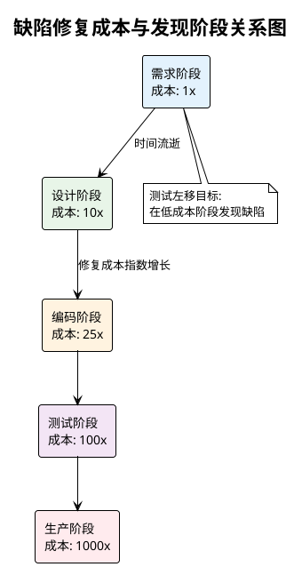
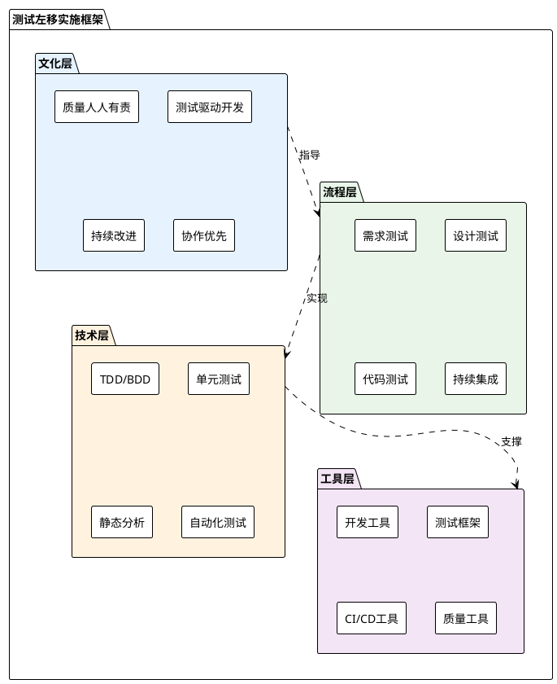
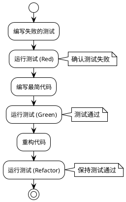
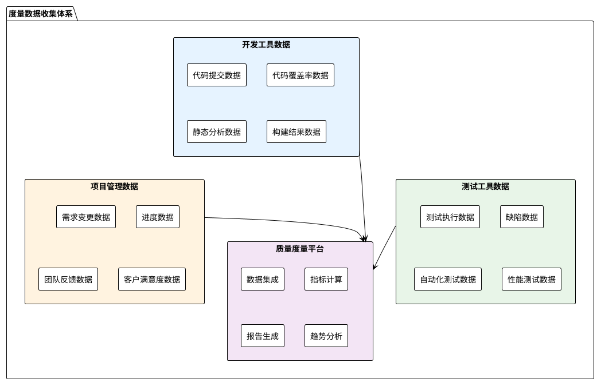
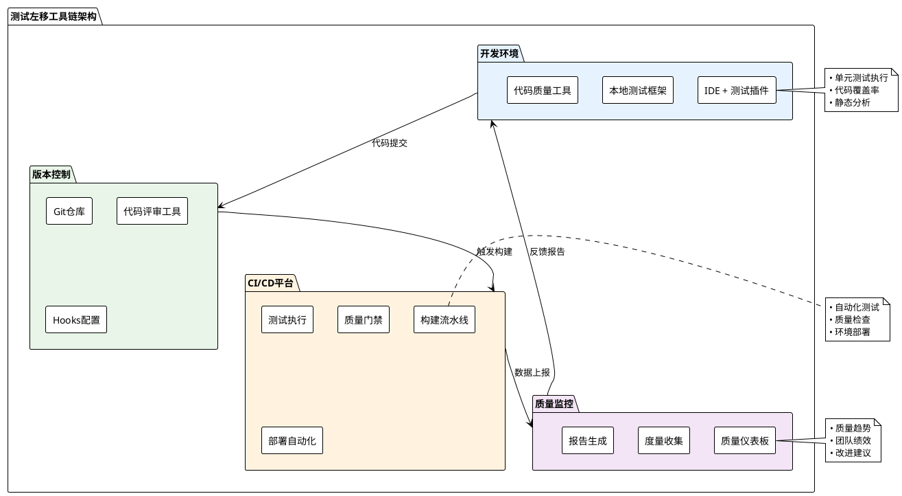
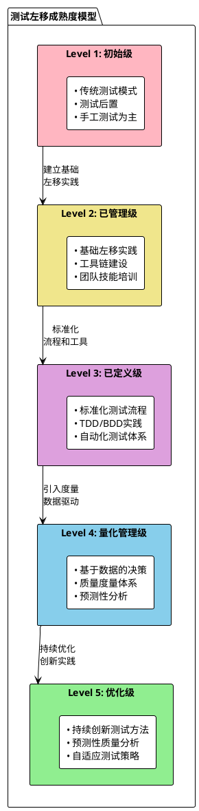
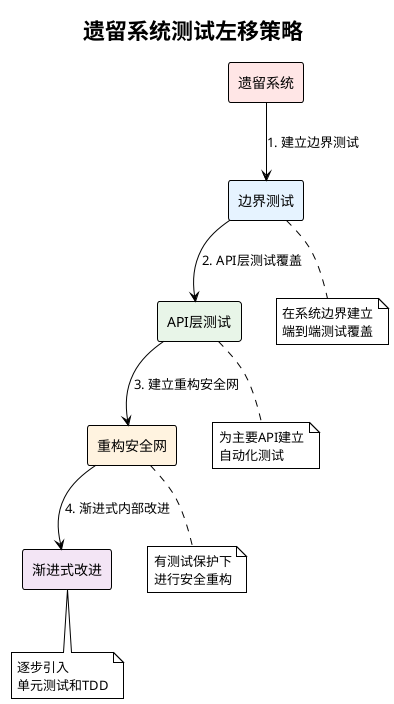

# 测试左移实施手册

## 📋 概述

测试左移（Shift Left Testing）是现代软件质量工程的核心实践之一，旨在将测试活动尽早引入到软件开发生命周期中，通过早期发现和预防缺陷来提高软件质量、降低修复成本、缩短交付周期。本手册提供了测试左移的完整实施指南，包括理论基础、实施策略、具体方法和工具选择。

## 🎯 测试左移的核心理念

### 基本概念
**测试左移**是指将测试活动从传统的开发完成后的测试阶段，前移到需求分析、设计和编码阶段，实现测试与开发的并行和协作。

### 核心价值
- **早期缺陷发现**：在缺陷修复成本最低的阶段发现问题
- **预防导向**：通过设计和过程改进预防缺陷产生
- **快速反馈**：为开发团队提供及时的质量反馈
- **成本效益**：显著降低后期缺陷修复成本

### 理论基础



## 🏗️ 测试左移实施框架

### 四层实施模型



## 📈 测试左移实施路线图

### 阶段一：基础建设（1-2个月）

#### 目标设定
- 建立测试左移的组织共识
- 搭建基础工具链
- 培训核心技能

#### 关键活动

| 活动 | 负责角色 | 时间安排 | 交付物 | 成功标准 |
|------|----------|----------|--------|----------|
| **文化宣贯** | QA + 管理层 | 第1周 | • 测试左移培训材料<br>• 文化宣传方案 | • 团队理解度>80%<br>• 管理层支持确认 |
| **现状评估** | QA + Tech Lead | 第1-2周 | • 当前状态评估报告<br>• 改进机会识别 | • 评估维度全面<br>• 问题识别准确 |
| **工具选型** | 开发团队 + QA | 第2-3周 | • 工具选型报告<br>• 采购建议 | • 工具满足需求<br>• 成本在预算内 |
| **基础培训** | QA + 外部专家 | 第3-4周 | • 培训计划<br>• 培训材料<br>• 考核结果 | • 培训完成率>90%<br>• 考核通过率>80% |
| **试点项目选择** | 项目经理 + QA | 第4周 | • 试点项目清单<br>• 实施计划 | • 项目风险可控<br>• 团队配合度高 |

#### 文化建设要点

**1. 管理层支持**
- 获得高层管理的明确支持和资源投入
- 将测试左移纳入组织质量战略
- 建立相应的激励和考核机制

**2. 团队共识**
- 组织全员培训，建立测试左移的共同认知
- 强调"质量人人有责"的理念
- 消除"测试是测试人员的事"的误区

**3. 技能建设**
- 开发人员：学习单元测试、TDD/BDD方法
- 测试人员：提升测试策略设计和自动化能力
- 产品人员：学习验收标准定义方法

### 阶段二：试点实施（2-3个月）

#### 需求阶段测试左移

**实施策略：**

| 实践 | 具体方法 | 工具支持 | 负责角色 | 验收标准 |
|------|----------|----------|----------|----------|
| **需求可测试性设计** | • 编写可测试性检查清单<br>• 建立需求评审模板<br>• 设计验收标准格式 | • Jira/Azure DevOps<br>• Confluence<br>• 需求管理工具 | BA + QA | • 需求可测试性>95%<br>• 验收标准完整性>90% |
| **验收标准定义** | • 使用Given-When-Then格式<br>• 定义业务规则测试点<br>• 建立数据验证标准 | • Cucumber<br>• SpecFlow<br>• 文档工具 | BA + 开发 + QA | • 验收标准覆盖率>95%<br>• 标准明确性评分>4.5/5 |
| **需求评审测试** | • 建立评审检查清单<br>• 引入测试视角评审<br>• 设计可测试性评分 | • 评审工具<br>• 检查清单模板 | 全团队 | • 评审发现问题率>20%<br>• 需求质量提升可量化 |

**需求阶段检查清单：**

```markdown
## 需求可测试性检查清单

### 功能需求检查
- [ ] 需求描述清晰、无歧义
- [ ] 包含明确的输入、处理、输出定义
- [ ] 定义了正常流程和异常流程
- [ ] 明确了边界条件和约束
- [ ] 包含了验收标准

### 非功能需求检查
- [ ] 性能要求明确且可度量
- [ ] 安全要求具体且可验证
- [ ] 可用性要求清晰且可测试
- [ ] 兼容性要求完整且可确认

### 验收标准检查
- [ ] 使用Given-When-Then格式
- [ ] 覆盖主要业务场景
- [ ] 包含边界条件测试
- [ ] 定义了验收通过标准
- [ ] 可以自动化验证
```

#### 设计阶段测试左移

**实施策略：**

| 实践 | 具体方法 | 工具支持 | 负责角色 | 验收标准 |
|------|----------|----------|----------|----------|
| **设计可测试性** | • 设计模式选择<br>• 依赖注入设计<br>• 接口抽象设计<br>• 测试数据设计 | • 设计工具<br>• 代码生成器<br>• Mock框架 | 架构师 + 开发 | • 可测试性评分>4.0/5<br>• 依赖解耦度>80% |
| **测试策略设计** | • 分层测试策略<br>• 测试金字塔设计<br>• 自动化测试规划<br>• 测试数据策略 | • 测试管理工具<br>• 策略模板 | QA + Tech Lead | • 策略覆盖完整性>95%<br>• 可执行性评分>4.0/5 |
| **API设计测试** | • API契约测试<br>• 接口测试用例设计<br>• 数据模型验证<br>• 错误处理设计 | • Swagger/OpenAPI<br>• Postman<br>• Contract Testing工具 | 开发 + QA | • API覆盖率>95%<br>• 契约测试通过率>98% |

**设计阶段工作模板：**

```markdown
## 测试策略设计模板

### 1. 测试目标
- 主要测试目标：
- 质量标准：
- 风险评估：

### 2. 测试分层策略
- **单元测试层**：
  - 覆盖范围：
  - 测试重点：
  - 目标覆盖率：

- **集成测试层**：
  - 集成点识别：
  - 测试重点：
  - 测试环境：

- **系统测试层**：
  - 功能测试范围：
  - 非功能测试要求：
  - 端到端场景：

### 3. 自动化测试规划
- 自动化目标：
- 自动化范围：
- 工具选择：
- 实施计划：
```

#### 编码阶段测试左移

**TDD/BDD实施指南：**

**1. TDD（测试驱动开发）实施步骤**



**TDD实施检查清单：**
```markdown
## TDD实施检查清单

### 测试先行
- [ ] 在编写功能代码前先编写测试
- [ ] 测试用例覆盖需求的验收标准
- [ ] 测试用例包含正常和异常场景
- [ ] 确认测试用例会失败（Red状态）

### 最小实现
- [ ] 编写最简代码使测试通过
- [ ] 避免过度设计
- [ ] 专注于当前测试用例
- [ ] 确认测试通过（Green状态）

### 重构改进
- [ ] 在保持测试通过的前提下重构
- [ ] 消除重复代码
- [ ] 改善代码结构
- [ ] 保持测试覆盖率
```

**2. BDD（行为驱动开发）实施方法**

**Feature文件模板：**
```gherkin
Feature: 用户登录功能
  作为一个注册用户
  我希望能够登录系统
  以便访问个人账户信息

  Background:
    Given 系统中存在用户 "test@example.com"
    And 密码为 "password123"

  Scenario: 成功登录
    Given 用户在登录页面
    When 输入正确的邮箱 "test@example.com"
    And 输入正确的密码 "password123"
    And 点击登录按钮
    Then 用户应该成功登录
    And 跳转到用户主页

  Scenario: 密码错误
    Given 用户在登录页面
    When 输入正确的邮箱 "test@example.com"
    And 输入错误的密码 "wrongpassword"
    And 点击登录按钮
    Then 显示错误消息 "密码错误"
    And 用户仍在登录页面
```

**单元测试最佳实践：**

| 实践 | 具体要求 | 工具支持 | 质量标准 |
|------|----------|----------|----------|
| **测试命名** | • 使用描述性命名<br>• 遵循Should_When_Given模式<br>• 中英文命名规范 | • 代码分析工具<br>• 命名约定检查 | • 命名清晰度>95%<br>• 规范遵循度>90% |
| **测试结构** | • 使用AAA模式(Arrange-Act-Assert)<br>• 一个测试一个断言<br>• 独立性和可重复性 | • 测试框架<br>• Mock工具 | • 测试独立性>98%<br>• 可重复性>99% |
| **覆盖率要求** | • 代码覆盖率>80%<br>• 分支覆盖率>70%<br>• 关键路径覆盖率>95% | • 覆盖率工具<br>• SonarQube | • 达到覆盖率目标<br>• 无关键路径遗漏 |

### 阶段三：全面推广（3-6个月）

#### 推广策略

**1. 分批推广计划**

| 推广批次 | 项目类型 | 团队规模 | 时间安排 | 支持措施 |
|----------|----------|----------|----------|----------|
| **第一批** | 新项目、风险可控 | 5-8人 | 第1-2月 | • 专职QA支持<br>• 每周技术辅导<br>• 问题快速响应 |
| **第二批** | 维护项目、部分重构 | 8-12人 | 第3-4月 | • QA轮岗支持<br>• 双周技术分享<br>• 经验库建设 |
| **第三批** | 遗留系统、复杂项目 | 12+人 | 第5-6月 | • 社区支持<br>• 同伴辅导<br>• 工具平台化 |

**2. 成功模式复制**

```markdown
## 成功模式识别和复制流程

### 成功模式识别
1. **量化评估**
   - 缺陷发现率提升>30%
   - 修复成本降低>50%
   - 交付周期缩短>20%

2. **定性评估**
   - 团队满意度>4.0/5
   - 代码质量改善明显
   - 技术债务减少

### 模式提取
1. **实践提取**：文档化具体实施方法
2. **工具提取**：标准化工具配置和模板
3. **流程提取**：形成可复制的流程规范

### 推广复制
1. **培训材料**：基于成功经验制作培训内容
2. **指导手册**：编写详细的操作指南
3. **工具包**：提供开箱即用的工具集合
```

#### 质量监控和度量

**关键指标体系：**

| 指标类别 | 具体指标 | 计算方法 | 目标值 | 监控频率 |
|----------|----------|----------|--------|----------|
| **左移效果** | 早期缺陷发现率 | (需求+设计+编码阶段缺陷数/总缺陷数)×100% | ≥60% | 每迭代 |
| **成本效益** | 缺陷修复成本 | 加权平均缺陷修复时间×人日成本 | 降低50% | 每月 |
| **质量提升** | 生产环境缺陷率 | (生产缺陷数/总缺陷数)×100% | ≤10% | 每发布 |
| **团队能力** | 单元测试覆盖率 | (覆盖代码行数/总代码行数)×100% | ≥80% | 每日 |
| **自动化程度** | 自动化测试比例 | (自动化测试用例数/总测试用例数)×100% | ≥70% | 每周 |

**数据收集和分析：**



## 🛠️ 工具链建设

### 核心工具分类

#### 1. 开发阶段工具

| 工具类型 | 推荐工具 | 用途 | 集成方式 |
|----------|----------|------|----------|
| **单元测试框架** | JUnit (Java)<br>NUnit (.NET)<br>Jest (JavaScript)<br>pytest (Python) | 编写和执行单元测试 | IDE集成<br>CI/CD集成 |
| **Mock框架** | Mockito (Java)<br>Moq (.NET)<br>Jest Mock (JS)<br>unittest.mock (Python) | 模拟依赖对象 | 测试框架集成 |
| **代码覆盖率** | JaCoCo (Java)<br>dotCover (.NET)<br>Istanbul (JS)<br>Coverage.py (Python) | 测量测试覆盖率 | CI/CD报告 |
| **静态分析** | SonarQube<br>ESLint<br>PMD<br>CodeClimate | 代码质量分析 | IDE插件<br>CI/CD门禁 |

#### 2. BDD/验收测试工具

| 工具类型 | 推荐工具 | 用途 | 适用场景 |
|----------|----------|------|----------|
| **BDD框架** | Cucumber<br>SpecFlow<br>Behave<br>Jasmine | 编写可执行规范 | 需求验证<br>验收测试 |
| **API测试** | REST Assured<br>Postman<br>Newman<br>Karate | API自动化测试 | 接口测试<br>契约测试 |
| **UI自动化** | Selenium<br>Cypress<br>Playwright<br>Appium | 用户界面测试 | 端到端测试<br>回归测试 |

#### 3. CI/CD集成工具

| 工具类型 | 推荐工具 | 用途 | 集成要点 |
|----------|----------|------|----------|
| **构建工具** | Maven/Gradle<br>MSBuild<br>npm/webpack<br>pip | 项目构建和依赖管理 | 测试执行集成 |
| **CI/CD平台** | Jenkins<br>Azure DevOps<br>GitLab CI<br>GitHub Actions | 持续集成和部署 | 质量门禁配置 |
| **容器化** | Docker<br>Kubernetes<br>Docker Compose | 环境一致性 | 测试环境管理 |

### 工具链集成架构



### 工具配置最佳实践

#### Maven项目配置示例（Java）

```xml
<!-- pom.xml 配置示例 -->
<properties>
    <junit.version>5.8.2</junit.version>
    <mockito.version>4.6.1</mockito.version>
    <jacoco.version>0.8.7</jacoco.version>
    <sonar.coverage.exclusions>**/*Config.java,**/*Application.java</sonar.coverage.exclusions>
    <sonar.coverage.jacoco.xmlReportPaths>target/site/jacoco/jacoco.xml</sonar.coverage.jacoco.xmlReportPaths>
</properties>

<dependencies>
    <!-- 单元测试框架 -->
    <dependency>
        <groupId>org.junit.jupiter</groupId>
        <artifactId>junit-jupiter</artifactId>
        <version>${junit.version}</version>
        <scope>test</scope>
    </dependency>
    
    <!-- Mock框架 -->
    <dependency>
        <groupId>org.mockito</groupId>
        <artifactId>mockito-core</artifactId>
        <version>${mockito.version}</version>
        <scope>test</scope>
    </dependency>
</dependencies>

<build>
    <plugins>
        <!-- Surefire插件：单元测试 -->
        <plugin>
            <groupId>org.apache.maven.plugins</groupId>
            <artifactId>maven-surefire-plugin</artifactId>
            <version>3.0.0-M7</version>
            <configuration>
                <includes>
                    <include>**/*Test.java</include>
                    <include>**/*Tests.java</include>
                </includes>
            </configuration>
        </plugin>
        
        <!-- JaCoCo插件：代码覆盖率 -->
        <plugin>
            <groupId>org.jacoco</groupId>
            <artifactId>jacoco-maven-plugin</artifactId>
            <version>${jacoco.version}</version>
            <executions>
                <execution>
                    <goals>
                        <goal>prepare-agent</goal>
                    </goals>
                </execution>
                <execution>
                    <id>report</id>
                    <phase>test</phase>
                    <goals>
                        <goal>report</goal>
                    </goals>
                </execution>
                <execution>
                    <id>check</id>
                    <goals>
                        <goal>check</goal>
                    </goals>
                    <configuration>
                        <rules>
                            <rule>
                                <element>CLASS</element>
                                <limits>
                                    <limit>
                                        <counter>LINE</counter>
                                        <value>COVEREDRATIO</value>
                                        <minimum>0.80</minimum>
                                    </limit>
                                </limits>
                            </rule>
                        </rules>
                    </configuration>
                </execution>
            </executions>
        </plugin>
    </plugins>
</build>
```

#### CI/CD流水线配置示例（Jenkins）

```groovy
// Jenkinsfile 示例
pipeline {
    agent any
    
    stages {
        stage('Checkout') {
            steps {
                git branch: 'main', url: 'https://github.com/your-repo.git'
            }
        }
        
        stage('Unit Tests') {
            steps {
                sh 'mvn clean test'
            }
            post {
                always {
                    publishTestResults testResultsPattern: 'target/surefire-reports/*.xml'
                    publishCoverage adapters: [jacocoAdapter('target/site/jacoco/jacoco.xml')], 
                                   sourceFileResolver: sourceFiles('STORE_LAST_BUILD')
                }
            }
        }
        
        stage('Code Quality') {
            steps {
                withSonarQubeEnv('SonarQube') {
                    sh 'mvn sonar:sonar'
                }
            }
        }
        
        stage('Quality Gate') {
            steps {
                timeout(time: 1, unit: 'HOURS') {
                    waitForQualityGate abortPipeline: true
                }
            }
        }
        
        stage('Integration Tests') {
            steps {
                sh 'mvn verify -Pfailsafe'
            }
            post {
                always {
                    publishTestResults testResultsPattern: 'target/failsafe-reports/*.xml'
                }
            }
        }
        
        stage('Deploy to Test') {
            when {
                branch 'main'
            }
            steps {
                sh 'mvn deploy -Ptest-environment'
            }
        }
    }
    
    post {
        always {
            archiveArtifacts artifacts: 'target/*.jar', fingerprint: true
            cleanWs()
        }
        failure {
            emailext (
                subject: "Build Failed: ${env.JOB_NAME} - ${env.BUILD_NUMBER}",
                body: "Build failed. Check console output at ${env.BUILD_URL}",
                to: "${env.CHANGE_AUTHOR_EMAIL}"
            )
        }
    }
}
```

## 📊 效果评估和持续改进

### 评估框架

#### 定量评估指标

| 维度 | 核心指标 | 基线值 | 目标值 | 监控周期 |
|------|----------|--------|--------|----------|
| **缺陷预防** | 早期缺陷发现率 | 20% | 60% | 每迭代 |
| **成本效益** | 平均缺陷修复成本 | 100% | 50% | 每月 |
| **交付质量** | 生产缺陷密度 | 0.5/KLOC | 0.1/KLOC | 每发布 |
| **开发效率** | 特性交付周期 | 4周 | 2周 | 每季度 |
| **自动化水平** | 测试自动化率 | 30% | 70% | 每月 |

#### 定性评估方法

**团队成熟度评估模型：**



### 持续改进机制

#### 改进循环（PDCA）

**Plan（计划）阶段：**
- 基于度量数据识别改进机会
- 制定具体的改进目标和计划
- 分配资源和时间安排

**Do（执行）阶段：**
- 实施改进措施
- 记录实施过程和遇到的问题
- 收集反馈和建议

**Check（检查）阶段：**
- 评估改进效果
- 对比改进前后的关键指标
- 分析成功因素和不足之处

**Act（行动）阶段：**
- 标准化成功的改进实践
- 调整或放弃无效的改进措施
- 制定下一轮改进计划

#### 最佳实践提取和分享

**实践库建设：**

```markdown
## 测试左移最佳实践库结构

### 1. 需求阶段实践
- **验收标准编写模板**
  - Given-When-Then模板
  - 业务规则测试模板
  - 数据验证模板

- **需求评审检查清单**
  - 功能需求检查项
  - 非功能需求检查项
  - 可测试性评估标准

### 2. 设计阶段实践
- **可测试性设计原则**
  - 依赖注入模式
  - 接口抽象设计
  - 错误处理设计

- **测试策略模板**
  - 分层测试策略
  - 自动化测试规划
  - 测试数据策略

### 3. 编码阶段实践
- **TDD实施指南**
  - Red-Green-Refactor流程
  - 测试用例设计方法
  - 重构最佳实践

- **单元测试标准**
  - 命名约定
  - 测试结构模式
  - Assert最佳实践

### 4. 工具和配置
- **工具配置模板**
  - CI/CD配置模板
  - 质量门禁配置
  - 度量收集配置

- **代码示例库**
  - 各语言测试示例
  - Mock使用示例
  - 集成测试示例
```

## 🚧 常见挑战和解决方案

### 挑战1：团队技能不足

**症状：**
- 开发人员不会写单元测试
- 测试人员缺乏自动化技能
- TDD/BDD理解不深入

**解决方案：**

| 措施 | 具体行动 | 时间安排 | 预期效果 |
|------|----------|----------|----------|
| **系统培训** | • 外部专家培训<br>• 内部技能分享<br>• 在线学习平台 | 2-3个月 | 技能水平提升50% |
| **导师制度** | • 经验丰富者带新手<br>• 结对编程<br>• 代码评审指导 | 持续进行 | 实践能力快速提升 |
| **实践项目** | • 选择简单项目练手<br>• 逐步增加复杂度<br>• 及时反馈和调整 | 6个月 | 形成实践经验 |

### 挑战2：工具链复杂度高

**症状：**
- 工具配置复杂
- 集成困难重重
- 维护成本高

**解决方案：**

```markdown
## 工具链简化策略

### 1. 渐进式引入
- **第一阶段**：基础单元测试框架
- **第二阶段**：CI/CD集成
- **第三阶段**：质量度量工具
- **第四阶段**：高级分析工具

### 2. 标准化配置
- 制定工具配置标准
- 提供配置模板
- 建立配置管理流程
- 定期配置审查

### 3. 平台化建设
- 建设统一的工具平台
- 提供开箱即用的配置
- 统一的用户界面
- 自动化的环境管理
```

### 挑战3：文化阻力

**症状：**
- "测试不是我的工作"心理
- 担心增加工作量
- 质疑测试左移价值

**解决方案：**

| 策略 | 具体措施 | 成功因子 |
|------|----------|----------|
| **自上而下推动** | • 管理层明确支持<br>• 纳入绩效考核<br>• 提供必要资源 | 领导承诺和支持 |
| **价值展示** | • 小范围试点成功<br>• 量化收益展示<br>• 成功故事分享 | 看得见的收益 |
| **激励机制** | • 质量改进奖励<br>• 技能提升认证<br>• 职业发展机会 | 正向激励循环 |

### 挑战4：遗留系统适配

**症状：**
- 代码耦合度高
- 缺乏测试基础
- 重构风险大

**解决方案：**



## 📚 附录

### A. 术语表

| 术语 | 英文 | 定义 |
|------|------|------|
| **测试左移** | Shift Left Testing | 将测试活动前移到软件开发生命周期的早期阶段 |
| **TDD** | Test-Driven Development | 测试驱动开发，先写测试再写代码的开发方法 |
| **BDD** | Behavior-Driven Development | 行为驱动开发，基于业务行为的开发方法 |
| **ATDD** | Acceptance Test-Driven Development | 验收测试驱动开发 |
| **质量内建** | Quality Built-in | 在开发过程中内建质量保证机制 |
| **测试金字塔** | Test Pyramid | 分层测试策略，底层多、上层少的测试结构 |

### B. 参考资料

#### 书籍推荐
1. 《测试驱动开发：实战与模式解析》- Kent Beck
2. 《行为驱动开发指南》- Gojko Adzic
3. 《持续交付：发布可靠软件的系统方法》- Jez Humble
4. 《敏捷软件测试：测试人员与敏捷团队的实践指南》- Lisa Crispin

#### 在线资源
- Martin Fowler的测试金字塔文章
- Google Testing Blog
- ThoughtWorks技术雷达
- Agile Testing Alliance

### C. 模板和检查清单

#### C.1 项目启动检查清单

```markdown
## 测试左移项目启动检查清单

### 准备阶段
- [ ] 管理层支持确认
- [ ] 团队成员技能评估
- [ ] 当前测试现状分析
- [ ] 改进目标设定
- [ ] 资源和时间安排

### 技术准备
- [ ] 工具选型完成
- [ ] 开发环境配置
- [ ] CI/CD流水线设计
- [ ] 质量门禁定义
- [ ] 度量指标确定

### 团队准备
- [ ] 培训计划制定
- [ ] 角色职责明确
- [ ] 协作机制建立
- [ ] 沟通渠道确定
- [ ] 风险应对预案

### 试点准备
- [ ] 试点项目选择
- [ ] 试点范围确定
- [ ] 成功标准定义
- [ ] 监控机制建立
- [ ] 反馈收集计划
```

#### C.2 质量门禁配置模板

```yaml
# 质量门禁配置示例 (SonarQube)
quality_gate:
  name: "测试左移质量门禁"
  conditions:
    # 代码覆盖率
    - metric: "coverage"
      operator: "GREATER_THAN"
      threshold: "80"
      
    # 单元测试通过率
    - metric: "test_success_rate"
      operator: "GREATER_THAN"
      threshold: "95"
      
    # 重复代码率
    - metric: "duplicated_lines_density"
      operator: "LESS_THAN"
      threshold: "5"
      
    # 技术债务比率
    - metric: "sqale_debt_ratio"
      operator: "LESS_THAN"
      threshold: "5"
      
    # 可靠性评级
    - metric: "reliability_rating"
      operator: "GREATER_THAN"
      threshold: "1"
      
    # 安全评级
    - metric: "security_rating"
      operator: "GREATER_THAN"
      threshold: "1"
```

---

## 🎯 总结

测试左移是现代软件开发的必然趋势，它不仅仅是测试方法的改变，更是开发文化和思维模式的转变。成功实施测试左移需要：

1. **管理层的坚定支持**和资源投入
2. **团队的技能提升**和文化转变
3. **工具链的系统化建设**和持续优化
4. **度量体系的建立**和持续改进

通过本手册的系统化实施，组织能够显著提升软件质量、降低开发成本、缩短交付周期，最终建立起高效的软件交付能力。

**记住：测试左移不是目的，而是手段。真正的目标是构建高质量的软件和高效的交付体系。**
