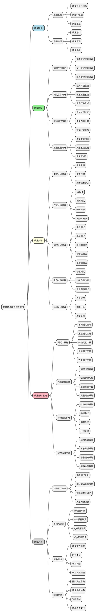
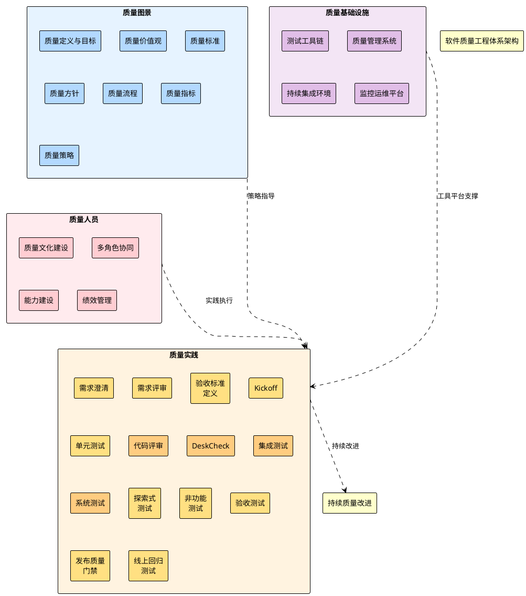
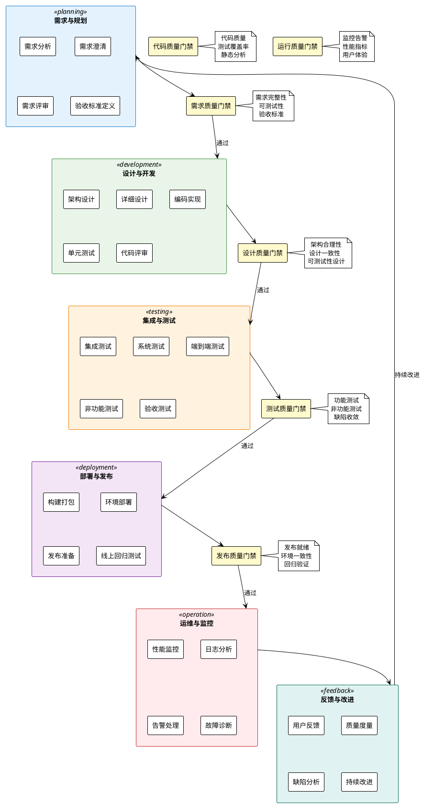
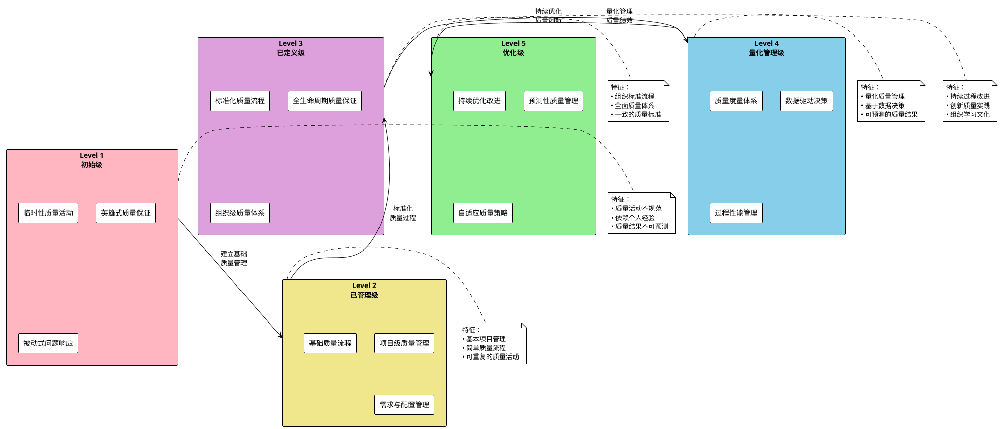
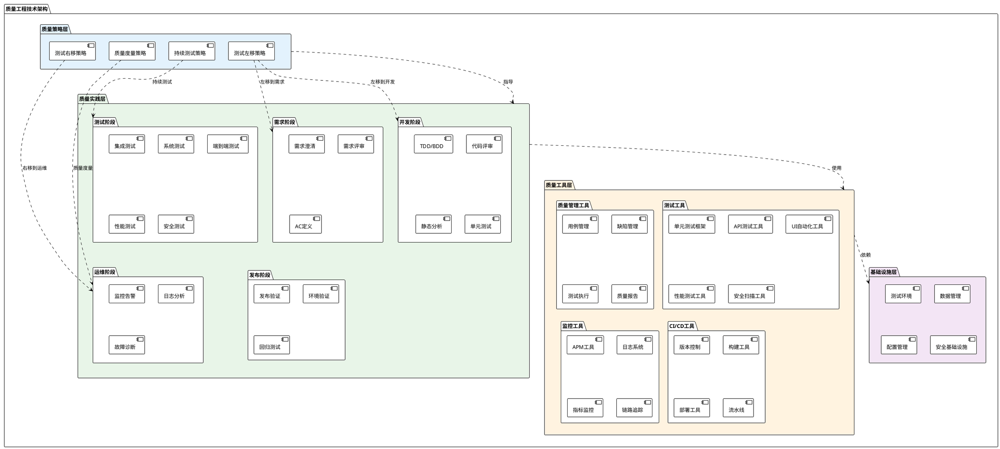
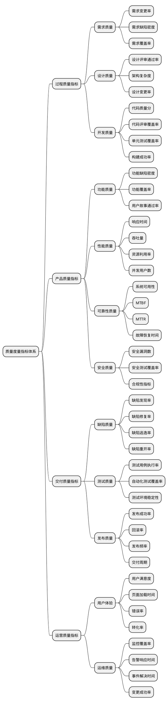
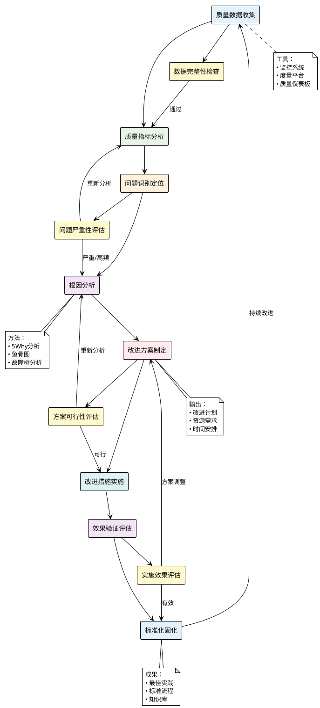
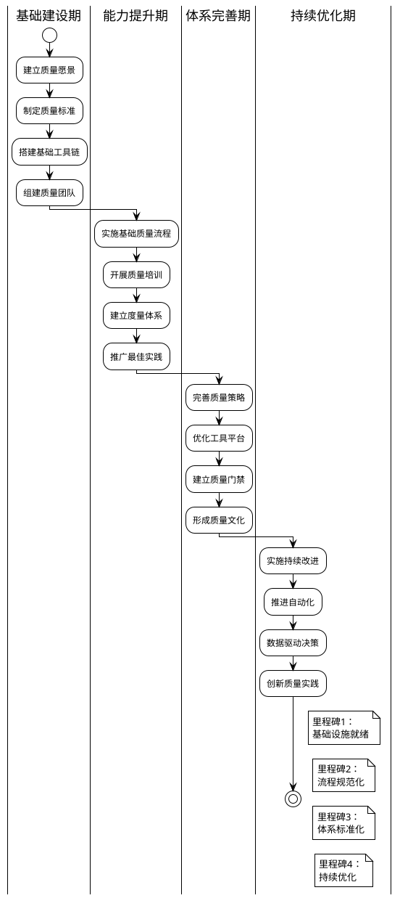
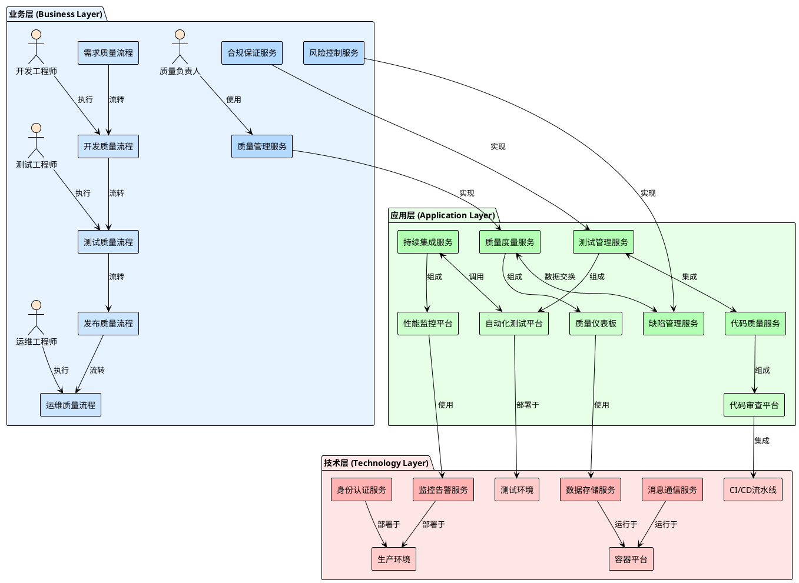

**z**z**z**z

* [ ] 软件质量工程体系架构设计

## 📋 概述

本文档基于ThoughtWorks质量灯塔理念，结合DevOps实践和参考架构，设计一个完整的软件质量工程体系架构，为后续AI赋能提供坚实的基础框架。

## 🏗️ 质量工程体系架构总览

### 架构设计理念

基于**质量灯塔**模型，我们的质量工程体系包含以下核心要素：

- **质量图景**（灯塔灯光）：指引方向的质量愿景
- **质量策略与实践**（灯塔主体）：实现质量目标的核心
- **质量人员**（灯塔工作人员）：高效协同的必要条件
- **质量基础设施**（灯塔基石）：提供必要支撑的基础

## 🎯 质量工程体系架构图

## 🏗️ 软件质量工程体系分层架构图

## 🔄 基于DevOps的软件生命周期质量体系

## 📊 质量工程能力成熟度模型

## 🛠️ 质量工程技术架构

## 📋 质量实践详细分解

### 需求阶段质量实践

| 实践活动 | 目标             | 输入     | 输出           | 质量标准             |
| -------- | ---------------- | -------- | -------------- | -------------------- |
| 需求澄清 | 确保需求理解一致 | 原始需求 | 澄清的需求     | 无歧义、可测试       |
| 需求评审 | 验证需求完整性   | 澄清需求 | 评审通过的需求 | 完整、一致、可追踪   |
| AC定义   | 明确验收标准     | 评审需求 | 验收标准       | 具体、可验证、可度量 |

### 开发阶段质量实践

| 实践活动 | 目标         | 输入     | 输出          | 质量标准                 |
| -------- | ------------ | -------- | ------------- | ------------------------ |
| TDD/BDD  | 测试驱动开发 | AC标准   | 测试用例+代码 | 测试先行、绿色重构       |
| 代码评审 | 保证代码质量 | 代码变更 | 评审意见      | 符合编码规范、无明显缺陷 |
| 静态分析 | 自动代码检查 | 源代码   | 分析报告      | 无严重问题、符合标准     |
| 单元测试 | 验证单元功能 | 代码模块 | 测试结果      | 覆盖率>80%、测试通过     |

### 测试阶段质量实践

| 实践活动   | 目标         | 输入     | 输出         | 质量标准               |
| ---------- | ------------ | -------- | ------------ | ---------------------- |
| 集成测试   | 验证组件集成 | 集成模块 | 测试结果     | 接口正确、数据一致     |
| 系统测试   | 验证系统功能 | 完整系统 | 测试报告     | 功能完整、性能达标     |
| 端到端测试 | 验证业务流程 | 业务场景 | 流程验证结果 | 流程正确、用户体验良好 |
| 性能测试   | 验证系统性能 | 性能需求 | 性能报告     | 满足性能指标           |
| 安全测试   | 验证系统安全 | 安全需求 | 安全报告     | 无安全漏洞             |

## 🔍 质量度量指标体系

## 🎯 质量改进闭环机制

## 🏆 质量工程实施路线图

## 🔄 下一步行动建议

### 立即行动项（1周内）

1. **组织架构评估**：评估当前质量组织结构，识别改进点
2. **现状基线建立**：收集当前质量指标，建立改进基线
3. **关键角色确定**：确定质量体系建设的关键推动者

### 短期目标（1个月内）

1. **质量愿景制定**：与管理层达成质量愿景共识
2. **核心流程梳理**：梳理当前质量流程，识别优化机会
3. **工具现状评估**：评估现有工具能力，制定工具优化计划

### 中期目标（3个月内）

1. **质量体系设计**：基于架构框架，设计详细的质量体系
2. **试点项目实施**：选择1-2个项目进行质量体系试点
3. **培训体系建立**：建立质量培训体系，提升团队能力

### 长期目标（6个月内）

1. **体系全面推广**：在组织内全面推广质量工程体系
2. **度量体系完善**：建立完整的质量度量和改进机制
3. **AI赋能准备**：为AI技术赋能质量工程做好准备

---

*本架构设计将为后续AI赋能软件质量工程提供坚实的框架基础，确保AI技术能够有效集成到质量工程的各个环节中。*

## 🏛️ ArchiMate风格质量工程企业架构图

## 🔗 ArchiMate架构关系说明

### 业务层 (Business Layer)

- **业务服务**: 定义质量工程的核心业务能力
- **业务流程**: 描述质量活动的端到端流程
- **业务角色**: 参与质量工程的关键角色

### 应用层 (Application Layer)

- **应用服务**: 支持业务流程的应用功能
- **应用组件**: 具体的应用系统和平台

### 技术层 (Technology Layer)

- **技术服务**: 提供基础技术能力
- **基础设施**: 承载应用和服务的技术平台

### 关系类型

- **实现关系**: 下层元素实现上层元素的功能
- **组成关系**: 元素之间的包含关系
- **使用关系**: 一个元素使用另一个元素的服务
- **流转关系**: 业务流程间的顺序关系
- **集成关系**: 系统间的协作关系
