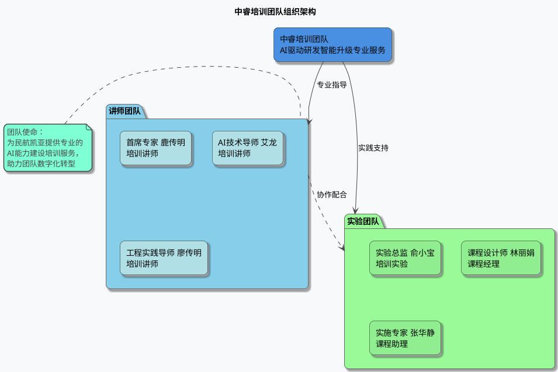
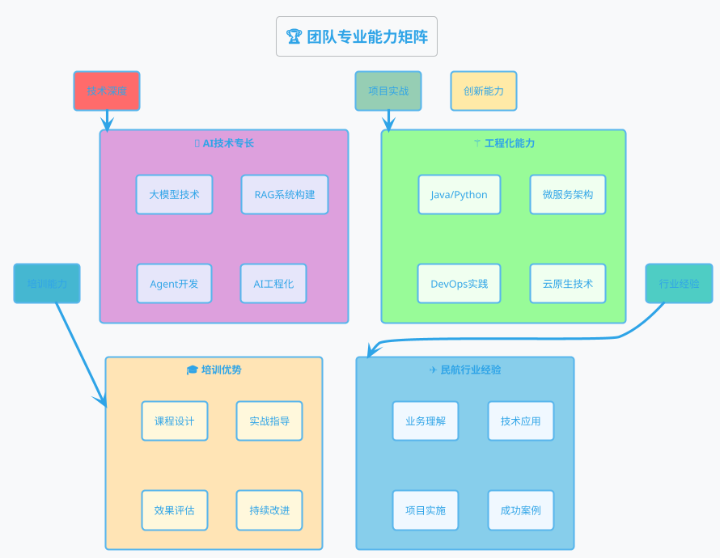
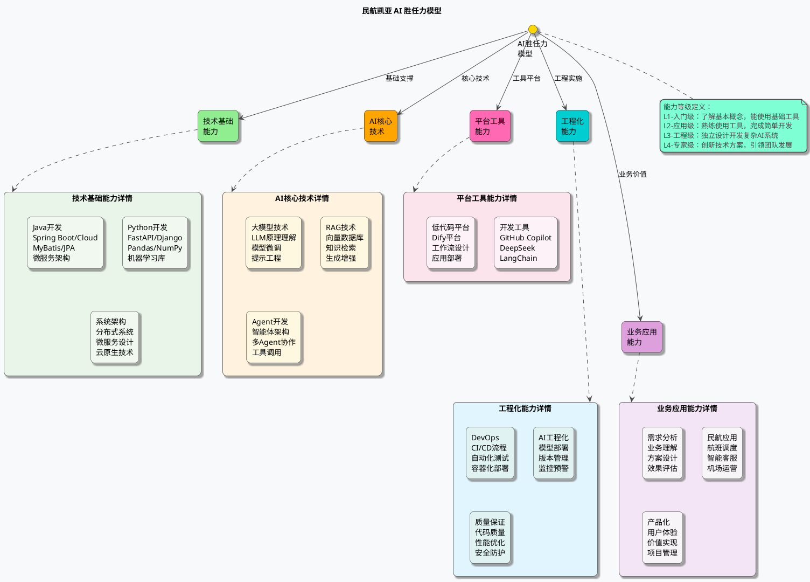
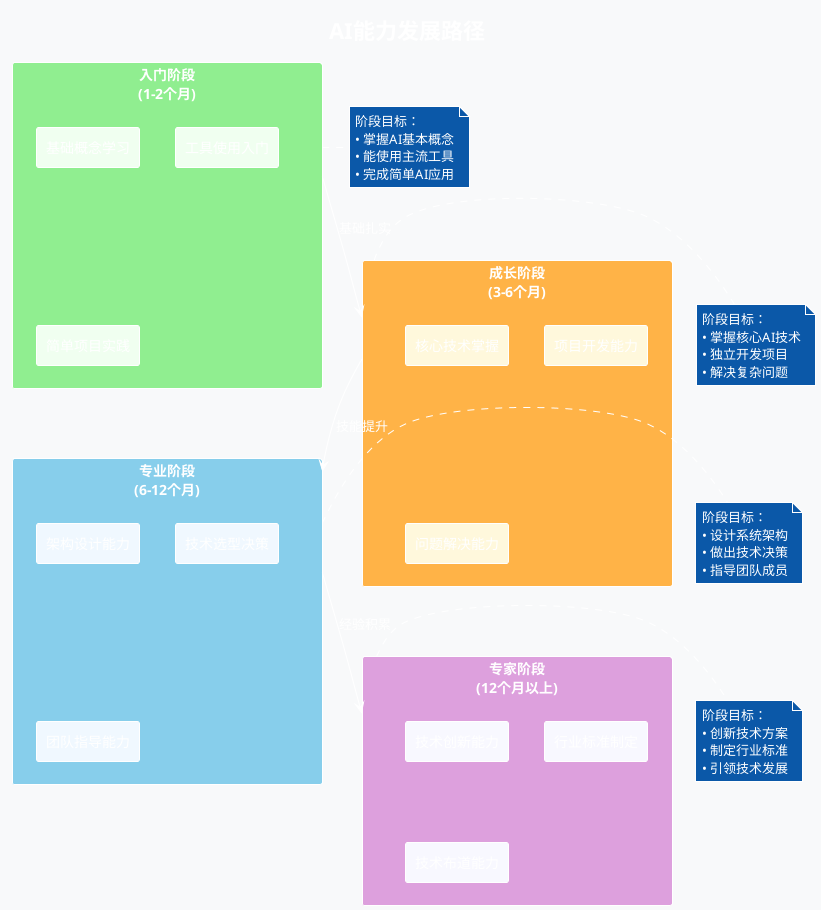
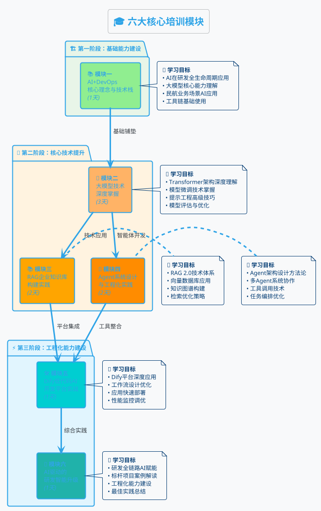
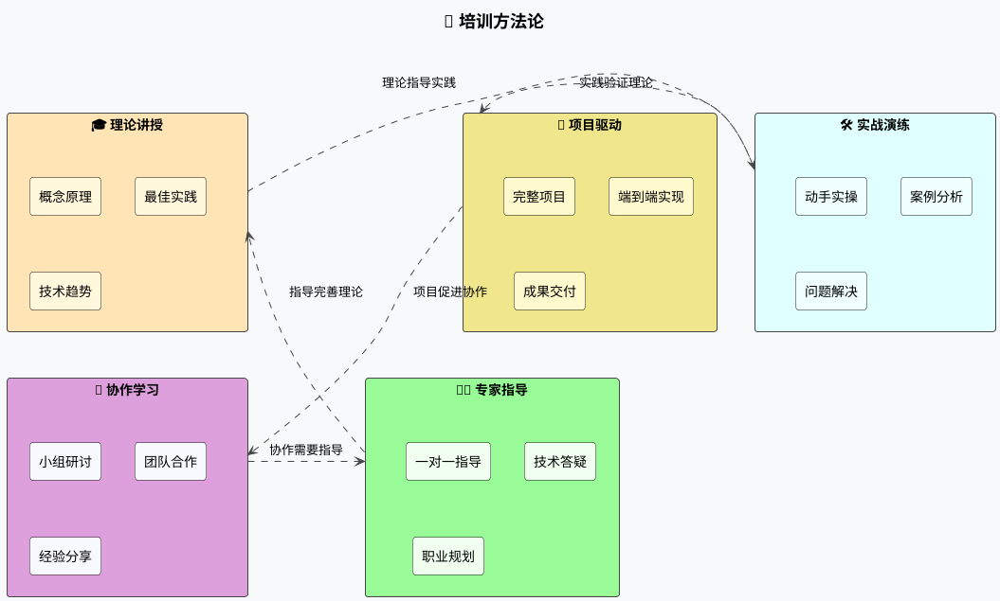
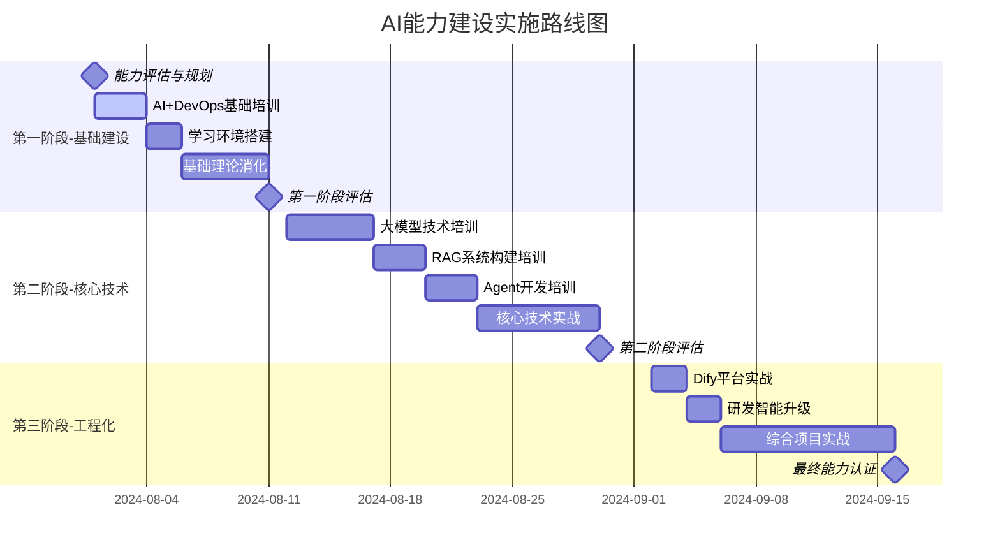
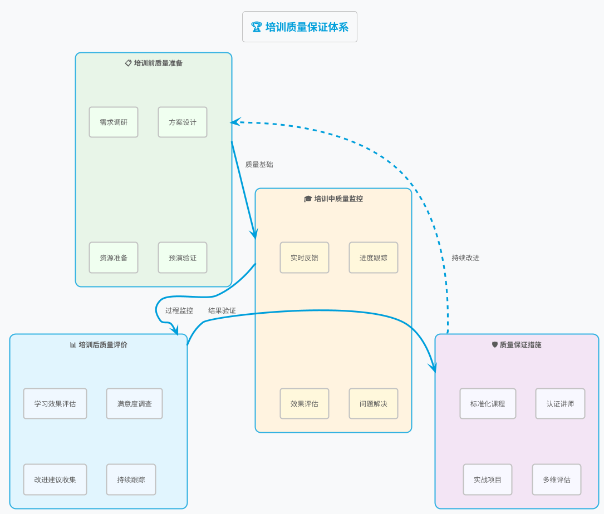
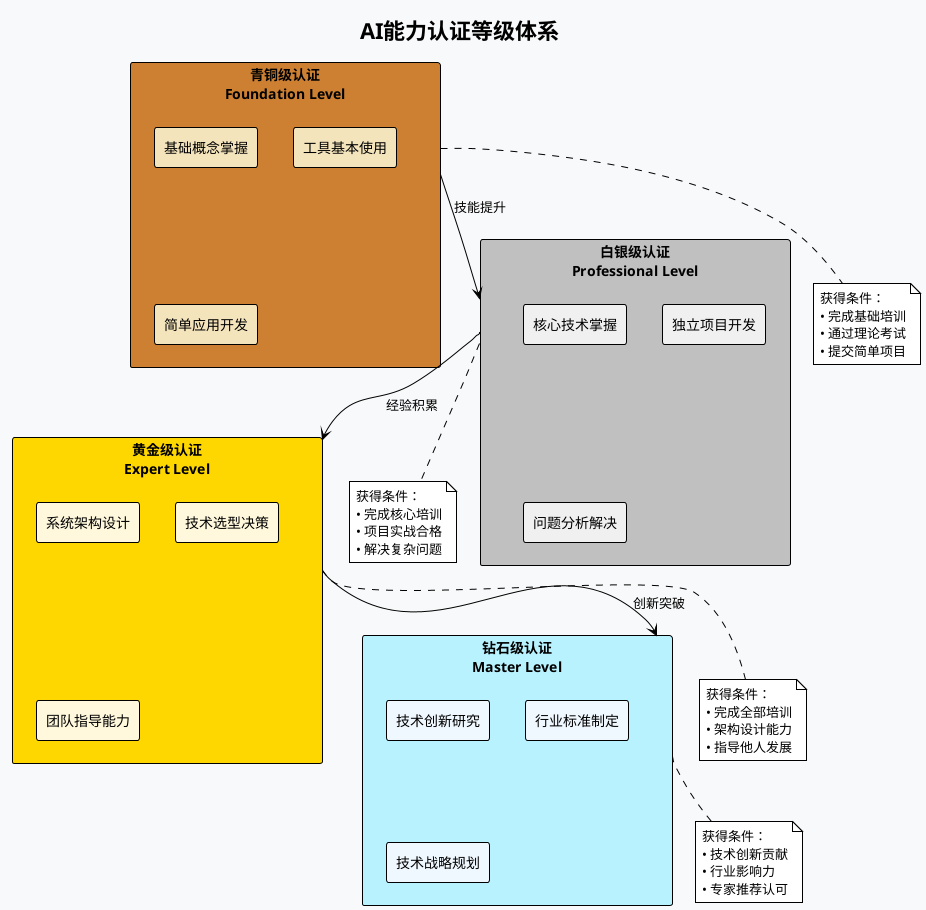

# 中睿培训团队组织架构与能力建设方案

## 📋 目录

1. [团队组织架构](#团队组织架构)
2. [团队核心优势](#团队核心优势)
3. [AI胜任力模型](#ai胜任力模型)
4. [培训体系设计](#培训体系设计)
5. [实施路线图](#实施路线图)
6. [质量保证体系](#质量保证体系)
7. [成果交付](#成果交付)

---

## 👥 团队组织架构

### 中睿培训团队架构图

### 团队核心成员介绍

#### 👨‍🏫 讲师团队

##### 🎖️ 首席专家 - 鹿传明

- **专业背景**：研发管理与AI技术实施顾问
- **教育背景**：厦门大学EMBA
- **核心认证**：
  - 国际项目管理师PMP
  - CSM敏捷认证专家
  - EXIN Agile Scrum Master
  - SAFe SPC认证
- **核心优势**：
  - 30年IT工作经验，25年培训经验
  - 中国特色规模化敏捷开发过程IAP™创始人
  - 500+企业培训服务案例
  - 深度的民航行业服务经验

##### 💡 AI技术导师 - 艾龙

- **专业领域**：AI技术架构与工程实践
- **核心技能**：
  - 大模型技术深度研究与应用
  - RAG企业知识库构建专家
  - Agent系统架构设计
  - AI工程化部署与优化
- **项目经验**：
  - 10+大型企业AI转型项目
  - 多个开源AI项目核心贡献者
  - 企业级AI解决方案架构师

##### 🔧 工程实践导师 - 廖传明

- **技术专长**：Java/Python全栈开发
- **工程能力**：
  - 微服务架构设计与实施
  - DevOps工程化最佳实践
  - 容器化与云原生技术
  - 持续集成与持续部署
- **实战经验**：
  - 15+年企业级系统开发经验
  - 多个大型分布式系统架构经验
  - 丰富的团队技术培训经验

#### 🧪 实验团队

##### 🎯 实验总监 - 俞小宝

- **职责范围**：实验环境设计与管理
- **核心能力**：
  - AI实验环境搭建与维护
  - 前沿技术验证与测试
  - 实战项目指导与支持
  - 技术问题诊断与解决

##### 📊 课程设计师 - 林丽娟

- **专业领域**：教学设计与课程开发
- **核心技能**：
  - 企业培训课程体系设计
  - 学习路径规划与优化
  - 培训效果评估与改进
  - 成人学习理论应用

##### ⚙️ 实施专家 - 张华静

- **工作重点**：项目执行与质量管控
- **主要职能**：
  - 培训项目实施管理
  - 学员学习进度跟踪
  - 技术支持与问题解决
  - 培训质量保证与改进

---

## 🏆 团队核心优势

### 专业能力矩阵

### 🎯 核心竞争优势

#### 1. 🧠 深度的AI技术实力

- **前沿技术掌握**：紧跟大模型、RAG、Agent等最新技术发展
- **工程化经验**：具备企业级AI系统的设计和部署经验
- **实战案例丰富**：多个成功的AI项目实施经验
- **技术栈完整**：从基础开发到AI应用的全栈技术能力

#### 2. ✈️ 丰富的民航行业经验

- **行业深度理解**：对民航业务流程和痛点的深入理解
- **成功案例积累**：南方航空、中南空管局等标杆客户服务经验
- **场景化应用**：能够将AI技术与具体业务场景深度结合
- **业务价值导向**：注重技术应用的实际业务价值实现

#### 3. 🎓 专业的培训服务能力

- **体系化培训**：完整的从基础到高级的培训体系
- **实战化教学**：以项目驱动的实践教学方法
- **个性化定制**：根据企业具体需求定制培训方案
- **效果可衡量**：建立完善的培训效果评估体系

#### 4. 🔧 强大的工程实践能力

- **全栈开发能力**：Java/Python等主流技术栈的深度掌握
- **架构设计经验**：微服务、分布式系统的丰富实践经验
- **DevOps实践**：完整的CI/CD和自动化运维能力
- **质量保证**：完善的代码质量和系统性能保证体系

---

## 🧠 AI胜任力模型

### 核心能力框架

### 能力发展路径

---

## 🎓 培训体系设计

### 六大培训模块体系

### 培训方法与特色

#### 🎯 培训方法论

#### ✨ 培训特色亮点

1. **🎯 实战导向**

   - 每个模块都包含完整的实战项目
   - 基于真实民航业务场景设计案例
   - 提供可直接应用的代码和方案
2. **📚 体系完整**

   - 从基础概念到高级应用的完整路径
   - 涵盖理论学习和实践应用
   - 包含个人技能和团队协作
3. **🔧 技术深度**

   - 不仅教授工具使用，更注重原理理解
   - 深入讲解技术实现细节
   - 提供性能优化和故障解决方案
4. **🏢 业务结合**

   - 深度结合民航行业特点
   - 提供行业专属的解决方案
   - 确保技术学习与业务价值的统一

---

## 🛣️ 实施路线图

### 总体时间规划

### 详细实施计划

#### 🏗️ 第一阶段：基础能力建设（2周）

**第1周：评估与基础理论**

- **Day 1**: 团队AI能力现状评估
- **Day 2**: 个人学习路径定制
- **Day 3**: 模块一培训 - AI+DevOps核心理念
- **Day 4-5**: 学习环境搭建与配置
- **Day 6-7**: 基础理论知识消化与实践

**第2周：工具熟悉与初步应用**

- **Day 8-10**: AI开发工具链使用练习
- **Day 11-12**: 简单AI应用开发实践
- **Day 13-14**: 第一阶段评估与总结

#### 🚀 第二阶段：核心技术提升（3周）

**第3周：大模型技术深度学习**

- **Day 15-17**: 模块二培训 - 大模型技术深度掌握
- **Day 18-19**: 模型微调实战项目
- **Day 20-21**: 提示工程优化练习

**第4周：RAG与Agent技术**

- **Day 22-24**: 模块三培训 - RAG企业知识库构建
- **Day 25-26**: 模块四培训 - Agent系统设计（前半部分）
- **Day 27-28**: RAG系统搭建实践

**第5周：Agent系统完善与综合实践**

- **Day 29-31**: 模块四培训 - Agent系统设计（后半部分）
- **Day 32-33**: 多Agent系统开发实战
- **Day 34-35**: 第二阶段综合评估

#### ⚡ 第三阶段：工程化能力建设（2周）

**第6周：平台工具与综合应用**

- **Day 36-37**: 模块五培训 - Dify低代码平台实战
- **Day 38-39**: 模块六培训 - AI驱动研发智能升级
- **Day 40-42**: 平台集成与优化实践

**第7周：项目实战与能力认证**

- **Day 43-47**: 综合项目实战开发
- **Day 48-49**: 项目成果展示与评审
- **Day 50**: 最终能力认证与规划

---

## 🏆 质量保证体系

### 培训质量控制流程

### 评估认证体系

#### 📊 多维度评估框架

1. **📝 理论知识评估（30%）**

   - 选择题：基础概念和原理理解
   - 简答题：技术方案设计思路
   - 论述题：复杂问题分析能力
2. **💻 实践能力评估（50%）**

   - 编程作业：代码质量和功能实现
   - 项目作品：完整AI应用开发
   - 现场演示：技术实现和讲解能力
3. **🎯 综合应用评估（20%）**

   - 案例分析：实际问题解决方案
   - 团队协作：项目协作和沟通能力
   - 创新思维：技术创新和优化建议

#### 🏅 能力认证等级

---

## 📦 成果交付

### 培训交付物清单

#### 📚 课程资料

- **完整课程PPT**：所有模块的详细培训材料
- **实战指导手册**：操作步骤和最佳实践指南
- **案例库**：民航行业AI应用成功案例集
- **参考资料**：相关技术文档和学习资源

#### 💻 代码资源

- **完整项目代码**：所有实战项目的源代码
- **工具脚本集**：自动化部署和运维脚本
- **模板库**：可复用的代码模板和框架
- **配置文件**：开发和部署环境配置

#### 🛠️ 工具平台

- **开发环境**：预配置的AI开发环境
- **实验平台**：用于练习和验证的实验环境
- **监控工具**：性能监控和日志分析工具
- **部署工具**：自动化部署和运维工具

#### 📊 评估报告

- **个人能力评估报告**：每位学员的详细能力分析
- **团队能力矩阵**：整体团队能力分布和建议
- **培训效果评估**：培训前后能力提升对比
- **后续发展建议**：个性化的能力发展路径

### 持续支持服务

#### 🎯 技术支持

- **3个月技术答疑**：培训后3个月内的技术问题解答
- **在线专家咨询**：定期的在线技术咨询服务
- **社区支持**：专属技术交流群和知识分享平台
- **版本更新**：培训材料和工具的持续更新

#### 📈 能力跟踪

- **季度能力评估**：定期的能力发展跟踪评估
- **项目实施指导**：实际AI项目的实施指导支持
- **最佳实践分享**：新的最佳实践和案例分享
- **进阶培训机会**：高级技术培训和认证机会

#### 🤝 长期合作

- **技术顾问服务**：长期的技术顾问和咨询服务
- **项目合作机会**：共同承担AI项目的合作机会
- **人才推荐**：优秀AI人才的推荐和交流
- **行业标准制定**：参与行业AI技术标准的制定

---

## 📝 总结

中睿培训团队凭借深厚的技术实力、丰富的行业经验和专业的培训能力，为民航凯亚量身定制了这套完整的AI能力建设方案。通过系统化的培训体系、实战化的教学方法和完善的质量保证，将帮助民航凯亚团队快速建立AI核心竞争力，在数字化转型的道路上取得领先优势。

### 🎯 预期成果

- **团队能力全面提升**：80%以上人员达到白银级AI能力认证
- **技术落地快速见效**：3个月内交付首个AI应用项目
- **创新能力显著增强**：形成持续的技术创新和优化能力
- **行业影响力提升**：成为民航行业AI技术应用的标杆

### 🚀 长远价值

- **技术团队建设**：建立一支具有AI核心竞争力的技术团队
- **业务创新驱动**：AI技术深度融入业务，驱动创新发展
- **行业标准引领**：参与制定民航行业AI技术应用标准
- **生态合作拓展**：与更多AI技术伙伴建立合作生态

通过本次培训，民航凯亚将获得：

- ✅ **完整的AI技术能力体系**
- ✅ **实战化的项目开发经验**
- ✅ **系统化的工程实施能力**
- ✅ **持续化的学习发展机制**

让我们携手共进，在AI技术的浪潮中勇立潮头，共创民航业数字化转型的美好未来！

---

**文档版本**: v1.0
**创建日期**: 2025年7月31日
**负责团队**: 中睿培训团队
**审核状态**: 待审核
**标签**: `#中睿培训` `#AI能力建设` `#民航凯亚` `#组织架构` `#培训体系`
