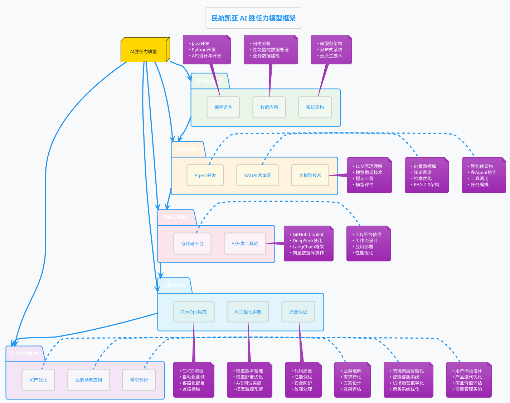
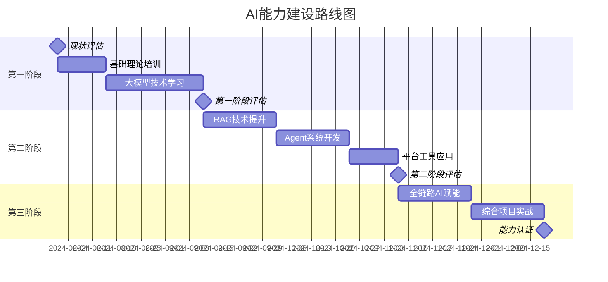

# 民航凯亚团队AI能力建设路线图

## 📋 目录

1. [能力建设概述](#能力建设概述)
2. [AI胜任力模型](#ai胜任力模型)
3. [能力现状评估](#能力现状评估)
4. [培训体系设计](#培训体系设计)
5. [实施路线图](#实施路线图)
6. [能力评估体系](#能力评估体系)
7. [持续发展计划](#持续发展计划)

---

## 🎯 能力建设概述

### 建设目标

基于民航凯亚的业务需求，构建一套完整的AI能力建设体系，重点提升研发技术团队在Java和Python技术栈的AI应用开发能力，系统构建人工智能开发的核心技术体系，实现AI项目的高效开发、测试、部署和运维。

### 核心价值

- **技术能力提升**：掌握大模型技术全栈应用及企业级AI解决方案开发
- **工程化能力强化**：Agent实现、模型优化部署等方面的工程能力
- **业务场景融合**：结合民航业务场景，确保AI技术真正落地
- **研发效能提升**：实现研发成本降低30%+，开发效率提升60%+

### 建设原则

- **实战导向**：以项目驱动，强化实际应用能力
- **体系化培养**：构建完整的能力发展路径
- **技术深度**：不仅掌握工具使用，更注重原理理解
- **业务结合**：与民航业务场景深度融合

---

## 🏗️ AI胜任力模型

### 胜任力模型框架



### 能力等级定义

#### L1 - 入门级（了解）

- 了解AI基本概念和应用场景
- 能够使用基础的AI工具和平台
- 具备基本的编程能力（Java/Python）
- 理解大模型的基本原理

#### L2 - 应用级（使用）

- 熟练使用主流AI开发工具
- 能够构建简单的AI应用
- 掌握基本的Agent开发技能
- 能够完成RAG系统的基础搭建

#### L3 - 工程级（开发）

- 能够独立设计和开发复杂AI系统
- 掌握模型微调和优化技术
- 具备多Agent系统架构能力
- 能够解决性能和部署问题

#### L4 - 专家级（创新）

- 能够设计创新的AI解决方案
- 具备AI技术选型和架构决策能力
- 能够指导团队进行AI项目开发
- 具备前沿技术的研究和应用能力

---

## 📊 能力现状评估

### 评估维度

#### 技术基础评估

- **编程能力**：Java/Python开发熟练度
- **架构能力**：微服务、分布式系统理解
- **工程能力**：DevOps、CI/CD流程掌握

#### AI技术评估

- **理论基础**：机器学习、深度学习概念
- **大模型理解**：LLM原理和应用场景
- **工具使用**：现有AI工具的使用经验

#### 业务理解评估

- **民航业务**：航班调度、机场运营等业务理解
- **需求分析**：从业务需求到技术方案的转化能力
- **场景应用**：AI技术在具体业务场景的应用思路

### 评估方法

1. **技能测试**：编程能力、理论知识测试
2. **项目评估**：过往项目经验和成果展示
3. **实操演练**：现场问题解决能力
4. **面谈交流**：技术理解深度和学习能力

---

## 🎓 培训体系设计

### 培训模块体系

#### 模块一：AI+DevOps核心理念与技术栈（基础模块）

**培训时间**：1天
**目标人群**：全体技术人员

**主要内容**：

- AI在软件研发全生命周期中的价值与应用场景
- 大模型核心能力：代码生成、自然语言理解、知识推理
- 民航业务场景下的AI技术选型策略
- 工具链介绍：GitHub Copilot、DeepSeek、LangChain等

**实战案例**：

- 民航凯亚客服系统的AI改造历程分析
- AI工具在日常开发中的应用演示

#### 模块二：大模型技术深度掌握（核心模块）

**培训时间**：3天
**目标人群**：核心开发人员

**主要内容**：

- **大模型原理与架构**

  - Transformer架构深度解析
  - 预训练与微调技术
  - 提示工程（Prompt Engineering）
  - 模型评估与性能优化
- **模型微调实战**

  - 企业数据准备与处理
  - Fine-tuning技术实践
  - 领域模型定制化开发
  - 模型版本管理与部署
- **提示工程高级技巧**

  - Few-shot Learning技术
  - Chain-of-Thought推理
  - 复杂任务分解与编排
  - 提示优化策略

**实战项目**：

- 基于民航业务数据的模型微调
- 航班调度场景的提示工程优化

#### 模块三：RAG企业知识库构建实践（重点模块）

**培训时间**：2天
**目标人群**：核心开发人员

**主要内容**：

- **RAG 2.0技术体系**

  - RAG架构演进与最佳实践
  - 向量数据库选型与部署（Chroma、Pinecone、Milvus）
  - 文档处理与分块策略
  - 检索增强生成的优化技术
- **知识库构建实战**

  - 企业文档智能处理
  - 多模态知识抽取
  - 知识图谱构建与融合
  - 检索质量评估与优化
- **性能调优实战**

  - 检索算法优化
  - 向量索引优化
  - 缓存策略设计
  - 系统性能监控
- **失败案例分析**

  - 常见问题与解决方案
  - 性能瓶颈识别与处理
  - 数据质量问题解决

**实战项目**：

- 民航知识库RAG系统构建
- 技术文档智能问答系统开发

#### 模块四：Agent系统设计与工程化实践（核心模块）

**培训时间**：2天
**目标人群**：架构师和核心开发人员

**主要内容**：

- **智能体架构设计方法论**

  - Agent系统架构模式
  - 单Agent vs 多Agent系统
  - Agent间通信与协作机制
  - 任务分解与编排策略
- **企业级Agent开发实践**

  - LangChain Agent框架深度应用
  - 工具调用（Tool Calling）技术
  - 记忆管理与上下文维护
  - Agent性能优化与监控
- **典型场景案例拆解**

  - 客服Agent系统架构
  - 代码生成Agent实现
  - 数据分析Agent构建
  - 多模态Agent开发

**实战项目**：

- 航班信息查询Agent开发
- 智能客服Agent实现
- Agent间协作与任务编排
- 民航业务多Agent系统构建

#### 模块五：Dify低代码AI开发平台实战（应用模块）

**培训时间**：1天
**目标人群**：全体开发人员

**主要内容**：

- **Dify平台核心功能**

  - 平台架构与核心概念
  - 应用类型与使用场景
  - 工作流设计与优化
  - 数据集管理与知识库
- **快速构建AI应用**

  - 聊天助手应用开发
  - 文本生成应用构建
  - 工作流应用设计
  - API服务集成
- **部署优化实践**

  - 应用性能调优
  - 成本控制策略
  - 监控与日志分析
  - 版本管理与发布

**实战项目**：

- 民航客服智能助手构建
- 航班信息查询应用开发

#### 模块六：AI驱动的研发智能升级（综合模块）

**培训时间**：1天
**目标人群**：项目经理和技术骨干

**主要内容**：

- **研发全链路AI赋能**

  - 需求阶段：AI辅助需求分析与文档生成
  - 设计阶段：AI驱动的架构设计与评审
  - 开发阶段：智能代码生成与优化
  - 测试阶段：AI自动化测试用例生成
  - 部署阶段：智能部署与配置管理
  - 运维阶段：预测性维护与故障诊断
- **标杆项目全流程解读**

  - 航班调度系统AI改造案例
  - 智能客服系统全流程开发
  - 机场运营数字化平台构建
- **工程化能力建设**

  - AI+DevOps最佳实践
  - 技术债务管理
  - 质量保证体系
  - 团队协作机制

**综合实战**：

- 完整AI项目的端到端实现
- 研发流程优化方案设计

### 培训方式

- **理论讲授**：概念原理和最佳实践
- **实战演练**：动手实操和案例分析
- **项目驱动**：完整项目的端到端实现
- **小组协作**：团队合作解决实际问题
- **专家指导**：一对一技术指导和答疑

---

## 🛣️ 实施路线图

### 第一阶段：基础能力建设（1-2个月）

#### 第1周：现状评估与规划

- 团队AI能力现状评估
- 个人学习路径定制
- 培训计划详细安排
- 学习环境准备

#### 第2-3周：AI基础理论培训

- 模块一：AI+DevOps核心理念与技术栈
- 基础工具使用培训
- 民航业务场景AI应用调研

#### 第4-6周：大模型技术深度学习

- 模块二：大模型技术深度掌握
- 理论学习与实践结合
- 模型微调项目实战

#### 第7-8周：第一阶段评估与总结

- 阶段性能力评估
- 学习成果展示
- 下阶段计划调整

### 第二阶段：核心技能提升（2-3个月）

#### 第9-11周：RAG技术专项提升

- 模块三：RAG企业知识库构建实践
- 民航知识库项目实战
- 性能优化与问题解决

#### 第12-14周：Agent系统开发

- 模块四：Agent系统设计与工程化实践
- 多Agent系统架构设计
- 民航业务Agent开发

#### 第15-16周：平台工具应用

- 模块五：Dify低代码AI开发平台实战
- 快速原型开发
- 平台集成与优化

#### 第17-18周：第二阶段评估

- 综合项目评估
- 技能认证考核
- 经验总结分享

### 第三阶段：工程化能力建设（1-2个月）

#### 第19-21周：全链路AI赋能

- 模块六：AI驱动的研发智能升级
- 研发流程AI化改造
- 标杆项目实施

#### 第22-24周：综合项目实战

- 完整AI项目端到端实现
- 团队协作项目交付
- 最佳实践总结

#### 第25-26周：能力认证与规划

- 最终能力评估
- 团队AI能力认证
- 后续发展规划

### 关键里程碑



---

## 📈 能力评估体系

### 评估维度

#### 1. 知识掌握度评估（40%）

- **理论知识测试**：AI基础理论、大模型原理、RAG技术等
- **技术概念理解**：Agent架构、工程化实践等核心概念
- **最佳实践掌握**：行业标准和最佳实践的理解程度

#### 2. 实践能力评估（40%）

- **项目实战能力**：独立完成AI项目的能力
- **问题解决能力**：面对技术问题的分析和解决能力
- **工具使用熟练度**：各类AI开发工具的熟练使用

#### 3. 创新应用能力（20%）

- **业务场景理解**：将AI技术应用到具体业务场景的能力
- **方案设计能力**：设计创新AI解决方案的能力
- **技术选型决策**：根据需求选择合适技术栈的能力

### 评估方法

#### 理论考试（笔试+在线）

- 选择题：基础概念和原理理解
- 简答题：技术方案设计思路
- 案例分析：实际问题的解决方案

#### 实践项目评估

- 代码质量：代码规范、架构设计、性能优化
- 项目完成度：功能实现程度和质量
- 文档输出：技术文档和总结报告

#### 综合答辩

- 项目演示：实际项目的演示和讲解
- 技术问答：深度技术问题的回答
- 方案设计：现场问题的解决方案设计

### 能力认证等级

#### 🥉 青铜级认证

- **获得条件**：完成基础培训，通过基础能力评估
- **能力标准**：能够使用AI工具，完成简单AI应用开发
- **适用岗位**：初级开发工程师

#### 🥈 白银级认证

- **获得条件**：完成核心技能培训，通过专业能力评估
- **能力标准**：能够独立开发复杂AI系统，具备工程化能力
- **适用岗位**：中级开发工程师、AI工程师

#### 🥇 黄金级认证

- **获得条件**：完成全部培训，通过专家级能力评估
- **能力标准**：能够设计AI架构，指导团队开发，具备创新能力
- **适用岗位**：高级AI工程师、AI架构师

#### 💎 钻石级认证

- **获得条件**：在实际项目中展现卓越AI能力，获得专家推荐
- **能力标准**：AI技术专家，能够引领技术创新和团队发展
- **适用岗位**：AI技术专家、技术总监

---

## 🚀 持续发展计划

### 技术跟踪机制

- **技术雷达**：定期跟踪AI技术发展趋势
- **前沿研究**：关注最新研究成果和技术突破
- **行业标准**：跟踪行业标准和最佳实践更新

### 内部知识分享

- **技术分享会**：每月举办内部技术分享
- **最佳实践库**：建立内部最佳实践知识库
- **导师制度**：高级工程师指导初级工程师

### 外部合作交流

- **技术社区**：参与AI技术社区和开源项目
- **行业会议**：参加重要的AI技术会议和研讨会
- **专家网络**：建立外部技术专家网络

### 项目实战机会

- **创新项目**：设立AI创新项目支持资金
- **开源贡献**：鼓励参与开源AI项目
- **竞赛活动**：参加AI技术竞赛和挑战赛

### 职业发展路径

#### 技术专家路径

```
初级AI工程师 → 中级AI工程师 → 高级AI工程师 → AI架构师 → AI技术专家
```

#### 管理发展路径

```
AI工程师 → 技术小组长 → AI项目经理 → AI技术总监 → CTO
```

#### 产品创新路径

```
AI工程师 → AI产品工程师 → AI产品经理 → AI产品总监 → CPO
```

### 激励机制

- **技能津贴**：根据AI能力认证等级发放技能津贴
- **项目奖励**：AI项目成功交付给予项目奖励
- **学习支持**：提供学习资源和培训费用支持
- **晋升优先**：AI能力突出者优先晋升机会

---

## 📊 预期成果

### 团队能力提升目标

#### 短期目标（6个月）

- 80%的开发人员达到青铜级AI能力认证
- 50%的核心开发人员达到白银级AI能力认证
- 20%的技术骨干达到黄金级AI能力认证
- 建立完整的AI开发工具链和规范

#### 中期目标（1年）

- 90%的开发人员达到白银级以上AI能力认证
- 30%的技术人员达到黄金级AI能力认证
- 5%的技术专家达到钻石级AI能力认证
- 交付3-5个成功的AI项目案例

#### 长期目标（2年）

- 建立行业领先的AI技术团队
- 形成完整的AI产品和解决方案体系
- 建立民航行业AI技术标准和最佳实践
- 成为行业AI技术创新的引领者

### 业务价值实现

- **开发效率提升**：60%以上的开发效率提升
- **代码质量提升**：80%的代码质量改善
- **部署成功率提升**：75%的部署成功率提升
- **运维成本降低**：30%的运维成本降低
- **创新能力增强**：每年产出3-5个AI创新项目

---

## 📝 总结

本AI能力建设路线图为民航凯亚团队提供了一个系统性、实战化的AI能力提升方案。通过分阶段、分层次的培训体系，结合完善的评估认证机制和持续发展计划，将帮助团队快速建立AI核心竞争力，在数字化转型中取得领先优势。

### 关键成功因素

1. **领导重视**：高层领导的重视和资源投入
2. **实战导向**：以项目为驱动的实战化培训
3. **体系化建设**：完整的培训-评估-发展体系
4. **持续改进**：根据技术发展和业务需求持续优化

### 风险控制

1. **技术风险**：建立多技术路线备选方案
2. **人才流失**：建立完善的激励和保留机制
3. **投入产出**：建立明确的ROI评估机制
4. **变化适应**：保持方案的灵活性和适应性

通过本路线图的实施，民航凯亚团队将具备：

- **全栈AI开发能力**：从理论到实践的完整技能体系
- **工程化交付能力**：企业级AI项目的开发和部署能力
- **创新应用能力**：结合业务场景的AI创新解决方案能力
- **持续学习能力**：跟踪前沿技术和持续改进的能力

最终实现团队AI技术能力的全面提升，为企业数字化转型和业务创新提供强有力的技术支撑。

---

**文档版本**: v1.0
**创建日期**: 2025年7月25日
**负责人**: AI Assistant
**审核状态**: 待审核
**标签**: `#AI能力建设` `#团队培训` `#技能规划` `#民航凯亚` `#大模型` `#Agent开发` `#RAG技术`
