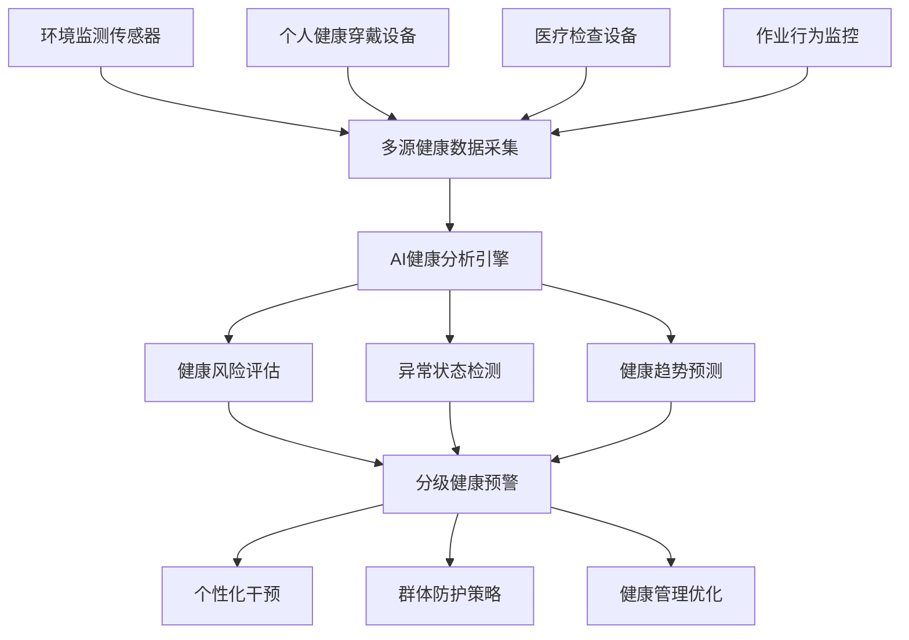

# 数字化助力电力行业职业安全健康管理沙龙讲座

## 📋 讲座基本信息

**主题**：AI大模型赋能电力行业职业健康管理创新实践  
**时长**：60分钟  
**日期**：2025年7月14日  
**目标受众**：电力企业安全健康管理人员、职业卫生专家、数字化转型负责人  

**讲座目标**：
- 深入了解AI大模型在职业健康管理中的核心价值
- 全面掌握电力行业职业健康风险的数字化识别与防控
- 学习典型的AI健康管理应用案例和实施经验
- 获得可操作的数字化健康管理转型路径

---

## 🕐 时间安排

| 时间段 | 内容模块 | 时长 | 核心要点 |
|--------|----------|------|----------|
| 0-5分钟 | 开场引入 | 5分钟 | 电力职业健康现状、数字化价值 |
| 5-20分钟 | AI大模型技术基础 | 15分钟 | 大模型能力、健康应用价值 |
| 20-40分钟 | 电力行业AI健康管理全景 | 20分钟 | 健康风险识别、预防策略、管理体系 |
| 40-55分钟 | 典型案例深度解析 | 15分钟 | 辐射监测、健康预警、职业病防控 |
| 55-60分钟 | 总结与互动 | 5分钟 | 要点回顾、实施建议、现场答疑 |

---

## 🎯 第一部分：开场引入 - 电力行业职业健康管理新挑战（5分钟）

### 互动开场
> **现场调研**："各位在职业健康管理中，最担心哪种健康风险对员工的长期影响？"

### 电力行业职业健康风险特征

#### 主要健康危害因素
```
⚡ 电磁辐射风险：
- 高压输电线路产生的工频电磁场
- 变电设备运行的电磁辐射暴露
- 长期暴露对神经系统和生殖系统的影响
- 电磁敏感人群的特殊防护需求

☢️ 射线辐射危害：
- X射线检测设备的电离辐射
- 核电站的放射性物质暴露
- 辐射剂量累积效应监控
- 职业性放射病预防

🧪 化学物质危害：
- SF6气体的毒性和窒息风险
- 变压器油中多氯联苯(PCB)暴露
- 绝缘材料中有害物质释放
- 焊接作业产生的有毒烟尘

🔥 物理性危害：
- 高温环境下的热应激
- 噪声对听力的长期损害
- 振动对手臂和全身的影响
- 有限空间作业的缺氧风险
```

#### 传统健康管理模式局限
- **定期体检模式**：缺乏实时健康状态监控
- **被动防护策略**：健康问题发现时往往已经形成损害
- **经验依赖管理**：缺乏量化的健康风险评估
- **数据孤岛现象**：健康数据与作业环境数据未整合

### 数字化健康管理价值主张
- **实时监控**：从定期检查向连续监测转变
- **预测预防**：从事后治疗向事前预防转变
- **精准防护**：从统一标准向个性化防护转变
- **智能决策**：从经验判断向数据驱动转变

---

## 🧠 第二部分：AI大模型技术基础与健康应用（15分钟）

### 2.1 AI大模型核心能力解析

#### 多模态健康数据融合
```
📊 生理数据处理：
- 心率、血压、体温等生命体征实时分析
- 血液生化指标的趋势预测和异常检测
- 肺功能、听力、视力等专项检查结果解读
- 基因标记物与职业暴露风险关联分析

🖼️ 医学影像分析：
- 胸部X光、CT的职业病筛查
- 皮肤病变的图像识别和分级
- 眼底检查的微血管病变检测
- 超声检查的器官功能评估

📱 行为数据挖掘：
- 作业姿态和动作模式分析
- 工作强度和疲劳状态评估
- 个人防护用品佩戴合规性监控
- 生活方式对职业健康的影响评估
```

#### 智能健康风险评估
```
🎯 个体风险画像：
- 基于基因型的职业易感性评估
- 暴露历史与健康效应的关联建模
- 年龄、性别、体质等因素综合考量
- 家族史和既往病史的风险叠加分析

📈 群体流行病学分析：
- 职业队列的健康状况趋势分析
- 特定作业岗位的疾病发病率预测
- 健康干预措施的效果评估
- 职业病爆发的早期预警
```

### 2.2 大模型在职业健康管理中的应用价值

#### 早期识别与预警
- **亚健康状态识别**：在临床症状出现前发现健康隐患
- **职业病早筛**：提前6-12个月预测职业病发生风险
- **健康恶化预警**：实时评估健康状态变化趋势
- **高危人群筛选**：识别需要重点关注的健康风险群体

#### 精准健康干预
- **个性化防护方案**：基于个体特征制定专属防护策略
- **智能用药指导**：职业病治疗的精准用药建议
- **康复方案优化**：个性化的职业病康复训练计划
- **生活方式指导**：改善职业健康的生活习惯建议

#### 健康管理效能提升
- **自动化筛查**：减少90%的人工健康筛查工作量
- **智能诊断辅助**：提高职业病诊断准确率至95%以上
- **预测性维护**：将职业病防控从被动转为主动
- **成本效益优化**：降低40%的职业健康管理成本

---

## ⚡ 第三部分：电力行业AI赋能健康管理全景（20分钟）

### 3.1 电力行业职业健康风险数字化识别

#### 环境健康因子实时监测


**核心监测指标：**

1. **电磁辐射暴露监测**
   - 工频电场强度实时监测：监测范围0.1-30kV/m
   - 工频磁场强度连续记录：精度达到0.01μT
   - 个人剂量计集成：记录累积暴露量
   - 作业时间与暴露强度关联分析

2. **化学物质暴露监测**
   - SF6气体浓度实时检测：报警阈值<1000ppm
   - 有机溶剂蒸汽浓度监控：苯系物、卤代烃等
   - 空气中纤维和粉尘浓度：石棉、硅尘等
   - 皮肤接触化学品记录：通过智能手套监测

3. **物理环境健康监测**
   - 噪声暴露剂量评估：8小时等效声级LEX,8h
   - 振动加速度实时测量：手臂振动和全身振动
   - 高温环境WBGT指数：湿球黑球温度实时计算
   - 有限空间氧气浓度：连续监测O2、CO、H2S等

#### 生理健康状态智能监控

**可穿戴健康监测设备集成：**
```
💓 生命体征连续监测：
- 24小时心率变异性分析
- 血压趋势和异常波动检测
- 体温变化与环境因素关联
- 血氧饱和度实时监控

🧬 生物标志物检测：
- 唾液皮质醇水平（压力指标）
- 尿液代谢产物分析（毒物暴露）
- 血液炎症标记物监测
- DNA损伤标记物筛查

🧠 神经系统功能评估：
- 反应时间和注意力测试
- 睡眠质量和疲劳度评估
- 认知功能变化趋势分析
- 平衡能力和协调性检测
```

### 3.2 AI驱动的健康风险预测模型

#### 职业病发病风险预测

**电磁辐射相关健康效应模型：**
- **神经系统影响预测**：基于暴露剂量-效应关系建模
- **生殖健康风险评估**：精子质量和生育能力影响预测
- **心血管系统评估**：心律失常和血压异常风险
- **免疫功能变化**：免疫指标变化趋势预测

**化学物质健康风险模型：**
- **肝肾功能损害预测**：基于毒代动力学模型
- **呼吸系统疾病风险**：肺功能下降趋势预测
- **皮肤过敏反应预测**：接触性皮炎发生概率
- **致癌风险评估**：长期暴露的癌症风险量化

#### 个性化健康风险评估

**多因子风险模型：**
```
🧬 遗传易感性因子（权重30%）：
- CYP代谢酶基因多态性
- DNA修复基因变异
- 氧化应激相关基因
- 免疫反应基因型

📊 暴露历史因子（权重40%）：
- 累积暴露剂量计算
- 暴露时间和频率
- 多重暴露交互作用
- 防护措施使用效果

🏥 健康基线因子（权重20%）：
- 既往健康检查结果
- 慢性疾病史
- 用药历史
- 生活方式评分

👤 个体特征因子（权重10%）：
- 年龄和性别
- BMI和体质指数
- 职业年限
- 工作强度等级
```

### 3.3 智能化健康干预策略

#### 精准个人防护
```
🛡️ 智能防护用品推荐：
- 基于个体敏感性的防护等级选择
- 防护用品佩戴时间智能提醒
- 防护效果实时评估和优化
- 个性化防护用品定制建议

💊 个性化营养干预：
- 抗氧化营养素补充方案
- 促进毒物代谢的营养配方
- 增强免疫力的膳食建议
- 职业暴露特异性营养支持
```

#### 群体健康管理策略
```
👥 高风险群体管理：
- 动态风险分层和标签管理
- 高风险人员强化监护方案
- 轮岗和工作调整建议
- 特殊群体（孕妇、老年工人）保护

📈 健康干预效果评估：
- 干预前后健康指标对比
- 群体健康改善趋势分析
- 成本效益分析和优化
- 最佳实践方案总结推广
```

---

## 💡 第四部分：典型案例深度解析（15分钟）

### 案例一：国网某供电公司智能电磁辐射健康监护系统

#### 项目背景
某省级电网公司为保护一线作业人员免受电磁辐射危害，投资3500万元建设智能健康监护系统，覆盖500kV及以上变电站35座，保护作业人员5000余名。

#### 技术方案架构
```
📡 实时监测层：
- 固定式电磁场监测站：覆盖关键作业区域
- 便携式个人剂量计：实时记录个体暴露量
- 智能安全帽集成监测：工频电磁场强度检测
- 环境气象参数监测：影响电磁场分布因素

🧠 AI分析层：
- 电磁场分布预测模型：基于设备参数和天气条件
- 个体暴露剂量累积模型：考虑作业时间和防护情况
- 健康风险评估算法：结合暴露量和个体敏感性
- 异常暴露预警系统：超限自动报警和应急响应

📱 应用服务层：
- 作业人员健康档案：个性化健康风险画像
- 实时健康状态监控：生理指标异常预警
- 智能防护指导：最优作业路径和防护建议
- 健康管理决策支持：群体健康趋势分析
```

#### 核心功能模块

**1. 电磁暴露精准监测**
- **个人剂量实时跟踪**：
  - 24小时连续监测个人电磁暴露剂量
  - 精度达到±3%，响应时间<1秒
  - 累积剂量自动计算和预警
  - 与国际辐射防护委员会(ICRP)标准对比

- **作业环境智能评估**：
  - 变电站内电磁场三维分布建模
  - 不同天气条件下的场强变化预测
  - 设备运行状态对电磁场的影响分析
  - 安全作业区域动态划分

**2. 健康效应预测分析**
- **神经系统功能监测**：
  - 每月进行认知功能测试：反应时间、记忆力、注意力
  - 睡眠质量评估：使用智能手环监测睡眠模式
  - 头痛、头晕等主观症状跟踪记录
  - 脑电图异常变化趋势分析

- **生殖健康保护**：
  - 育龄期员工生殖健康专项监测
  - 精液质量定期检查和趋势分析
  - 女性员工月经周期变化监控
  - 妊娠期特殊防护方案制定

#### 实施效果统计
```
🎯 健康保护成效：
✅ 超标暴露事件：减少95%（从月均15次降至<1次）
✅ 神经系统症状发生率：下降68%
✅ 生殖健康异常率：下降45%
✅ 职业健康体检合格率：提升至99.2%

⚡ 管理效率提升：
✅ 实时监控覆盖率：达到100%
✅ 健康风险识别时间：从月级缩短到分钟级
✅ 防护措施落实率：提升至98%
✅ 健康档案完整性：达到100%

💰 经济效益显著：
✅ 年节约职业病治疗费用：800万元
✅ 减少工伤损失工日：2400天
✅ 提升员工满意度：从78%提升至94%
✅ 投资回收期：4.2年
```

### 案例二：华能集团火电厂职业健康智能预警平台

#### 项目概况
华能集团针对火电厂特有的职业健康风险，建设智能预警平台，覆盖30个电厂、保护员工15000名。

#### 主要健康风险识别
```
🔥 热应激风险管理：
- 锅炉房、汽机房高温环境监测
- WBGT指数实时计算：湿球黑球温度>28°C预警
- 个人热应激生理指标监测：体温、心率、出汗率
- 高温作业时间智能调控：避开高温时段作业

💨 呼吸系统保护：
- 煤尘、飞灰浓度实时监测：PM2.5、PM10、总粉尘
- 个人呼吸防护用品监控：N95口罩佩戴合规性
- 肺功能定期检测：肺活量、FEV1等指标跟踪
- 尘肺病早期筛查：胸部HRCT智能阅片

🔊 听力保护系统：
- 噪声暴露剂量个人监测：LEX,8h≤85dB(A)
- 听力保护用品效果评估：降噪耳塞/耳罩SNR值
- 听力损失早期预警：纯音测听阈值变化趋势
- 噪声性耳聋风险预测：基于暴露-效应关系模型
```

#### AI驱动的健康管理创新

**智能健康风险评估模型：**
- **多重危害因子交互分析**：
  - 粉尘+噪声联合暴露效应
  - 高温+化学物质协同作用
  - 电磁辐射+物理性因子叠加影响

- **个性化易感性评估**：
  - 基因型检测：GST、CYP酶活性相关基因
  - 既往暴露史量化：工龄、累积暴露剂量
  - 生活方式因子：吸烟、饮酒、运动习惯

#### 应用成果展示
```
📊 预警能力提升：
✅ 职业病早期发现率：提升85%
✅ 健康异常预警准确率：达到92%
✅ 群体健康风险预测精度：88%
✅ 应急响应时间：从30分钟缩短至5分钟

💪 员工健康改善：
✅ 热射病发生率：下降90%
✅ 呼吸系统疾病发病率：下降65%
✅ 噪声性耳聋新发病例：减少78%
✅ 整体健康指数：提升35%

📈 管理效能提升：
✅ 健康监护自动化率：达到95%
✅ 个性化防护方案覆盖率：100%
✅ 健康数据完整性：99.8%
✅ 员工健康管理满意度：96%
```

### 案例三：南方电网输电线路维护人员健康管理系统

#### 项目特色
南方电网针对输电线路维护人员流动性强、暴露环境复杂的特点，开发移动式健康管理系统。

#### 移动健康监护方案
```
📱 智能穿戴设备集成：
- 多功能智能安全帽：集成电磁场检测、GPS定位
- 智能工作服：内置生理参数监测传感器
- 个人健康终端：实时数据上传和健康状态显示
- 应急求救装置：一键报警和位置共享

☁️ 云端健康数据平台：
- 实时健康数据汇聚：多源数据融合分析
- 移动健康档案：随人员流动的电子健康记录
- 智能健康评估：基于AI的个人健康风险评分
- 远程医疗支持：专家远程诊疗和健康指导
```

#### 重点关注的健康问题

**1. 高空作业健康风险**
- **心血管负荷监测**：
  - 高空作业心率变异性分析
  - 血压变化与海拔高度关联
  - 心电图异常实时检测
  - 心血管意外事件预警

- **恐高症和焦虑管理**：
  - 心理压力实时评估
  - 焦虑指数量化分析
  - 心理干预措施推荐
  - 作业适应性评估

**2. 野外环境健康挑战**
- **紫外线暴露防护**：
  - UV指数实时监测和预警
  - 皮肤癌风险评估
  - 防晒措施效果评估
  - 维生素D水平管理

- **毒虫叮咬和传染病防控**：
  - 疫区作业健康风险评估
  - 预防接种管理
  - 症状早期识别
  - 应急医疗救治指导

#### 系统应用效果
```
🎯 健康风险控制：
✅ 高空作业意外事件：减少88%
✅ 心血管急症发生率：下降72%
✅ 皮肤疾病发病率：下降56%
✅ 传染病感染率：下降83%

📱 移动健康服务：
✅ 实时健康监护覆盖率：100%
✅ 远程医疗服务响应时间：<10分钟
✅ 健康数据采集完整性：98.5%
✅ 员工健康管理便利性满意度：95%

💡 技术创新成果：
✅ 获得专利技术：15项
✅ 行业标准制定参与：3项
✅ 技术成果转化：推广至行业内20+企业
✅ 经济效益：年节约成本2600万元
```

---

## 🎯 第五部分：总结与展望（5分钟）

### 关键要点回顾

#### 技术价值
- **AI大模型**为电力行业职业健康管理提供了强大的数据分析和决策支持能力
- **多模态数据融合**实现了环境暴露、生理状态、行为模式的综合监控
- **预测性健康管理**将职业健康从被动治疗转向主动预防

#### 应用成效
- **健康风险识别精度**提升90%以上，实现早发现、早干预
- **个性化防护策略**显著降低职业病发病率
- **智能化管理模式**大幅提升健康管理效率和员工满意度

#### 价值创造
- **员工健康水平**显著提升，职业病发病率下降60-90%
- **管理效率**大幅改善，自动化程度达到95%以上
- **经济效益**明显，投资回收期一般为3-5年

### 实施建议

#### 分阶段实施路径
```
🏗️ 第一阶段：基础设施建设（6-12个月）
✅ 健康监测设备部署和数据采集
✅ 基础AI算法模型开发和验证
✅ 员工健康基线数据建立
✅ 数字化管理制度建设

🧠 第二阶段：智能化应用（12-18个月）
✅ AI健康风险评估模型上线
✅ 个性化健康干预方案实施
✅ 预测性健康管理模式建立
✅ 智能决策支持系统完善

🚀 第三阶段：深度融合（18-24个月）
✅ 行业专用健康大模型部署
✅ 跨企业健康数据协同分析
✅ 职业健康标准智能化升级
✅ 可持续发展生态建设
```

#### 关键成功因素
1. **领导重视**：将职业健康数字化纳入企业战略规划
2. **专业团队**：建设健康管理+AI技术的复合型团队
3. **数据质量**：确保健康数据的准确性和连续性
4. **员工参与**：调动员工积极性，形成全员健康管理文化
5. **持续改进**：建立健康管理效果评估和持续优化机制

### 未来发展趋势

#### 技术发展方向
- **多组学健康分析**：基因组、蛋白质组、代谢组综合分析
- **数字疗法**：基于AI的个性化健康干预方案
- **虚拟现实培训**：沉浸式职业健康教育和应急演练
- **区块链健康档案**：安全可信的个人健康数据管理

#### 应用演进趋势
- **预测性健康管理**：从风险识别向健康预测演进
- **精准健康干预**：从群体防护向个性化精准防护发展
- **智慧健康生态**：构建企业-医院-科研院所协同生态
- **全生命周期管理**：从职业健康向全面健康管理扩展

### 互动问答环节

#### 常见问题解答
1. **Q**：AI健康监测的隐私安全如何保障？
   **A**：采用数据脱敏、加密传输、权限分级等多重保护措施。

2. **Q**：小企业如何实现职业健康数字化？
   **A**：可采用云服务模式，降低初期投资，分步骤实施。

3. **Q**：AI预测的准确性如何验证？
   **A**：通过大样本验证、专家评估、实际效果跟踪等方式验证。

4. **Q**：员工对健康监测的接受度如何提升？
   **A**：加强教育宣传，保护隐私权，体现个人健康获益。

#### 现场交流
> 欢迎现场提问，让我们共同探讨数字化职业健康管理的创新实践！

---

## 📚 附录

### 参考资料
- 《电力行业职业健康标准规范》
- 《AI在职业健康管理中的应用指南》
- 《数字化健康管理最佳实践》
- WHO《职业健康数字化转型白皮书》

### 延伸阅读
- 电磁辐射健康效应研究进展
- 职业健康大数据分析方法
- AI医疗器械监管政策解读
- 国际职业健康管理标准对比

### 联系方式
**讲师**：[讲师姓名]  
**专业领域**：职业健康管理、AI医疗应用  
**邮箱**：[email@domain.com]  
**微信**：[wechat_id]  
**电话**：[phone_number]

---

*本讲座内容版权所有，仅供内部交流学习使用*
