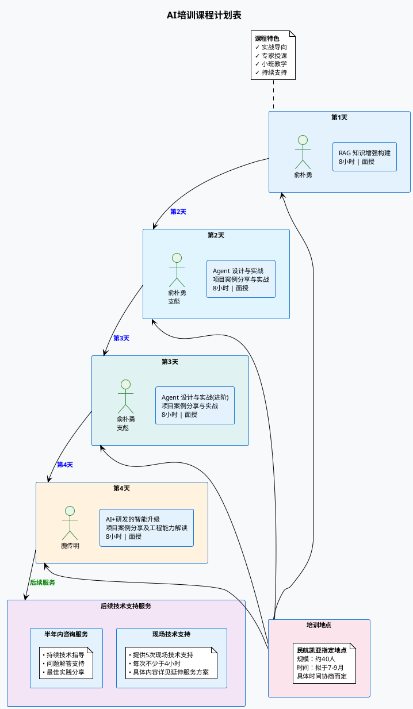

# AI培训课程计划表

## 课程概览

本培训计划为期4天，每天8小时，采用面授方式进行，旨在提供全面的AI技术培训和实战经验。

## 课程安排图表

## 详细课程安排

### 第1天：RAG 知识增强构建
- **时长**：8小时
- **培训方式**：面授
- **机构讲师**：俞朴勇
- **拟定培训时间**：拟于7-9月，具体时间协商而定
- **培训地点**：民航凯亚指定地点
- **备注**：约40人

### 第2天：Agent 设计与实战
- **时长**：8小时
- **培训方式**：面授
- **机构讲师**：俞朴勇、支彪
- **拟定培训时间**：拟于7-9月，具体时间协商而定
- **培训地点**：民航凯亚指定地点
- **备注**：约40人

### 第3天：Agent 设计与实战（进阶）
- **时长**：8小时
- **培训方式**：面授
- **机构讲师**：俞朴勇、支彪
- **拟定培训时间**：拟于7-9月，具体时间协商而定
- **培训地点**：民航凯亚指定地点
- **备注**：约40人

### 第4天：AI+研发的智能升级
- **时长**：8小时
- **培训方式**：面授
- **机构讲师**：鹿传明
- **拟定培训时间**：拟于7-9月，具体时间协商而定
- **培训地点**：民航凯亚指定地点
- **备注**：约40人

## 后续技术支持服务

### 提供半年内咨询服务
- **服务内容**：提供5次现场技术支持服务
- **服务时长**：每次不少于4小时
- **服务方式**：现场
- **机构讲师**：俞朴勇、支彪、鹿传明
- **服务期限**：课程培训完成后的半年内
- **详细说明**：具体内容详见延伸服务方案

## 培训特色

- ✅ **实战导向**：理论与实践相结合，注重动手操作
- ✅ **专家授课**：资深AI专家团队授课，经验丰富
- ✅ **小班教学**：约40人规模，保证教学质量
- ✅ **持续支持**：提供半年技术咨询服务
- ✅ **现场答疑**：面授形式，实时互动交流

## 培训目标

通过本次培训，学员将能够：

1. **掌握RAG技术**：理解并能够实际构建知识增强系统
2. **精通Agent开发**：具备设计和开发智能Agent的能力
3. **提升工程实践**：将AI技术应用到实际研发流程中
4. **项目实战经验**：通过案例学习获得实际项目经验

---

*本培训计划最终解释权归主办方所有，具体安排可能根据实际情况进行微调。*
