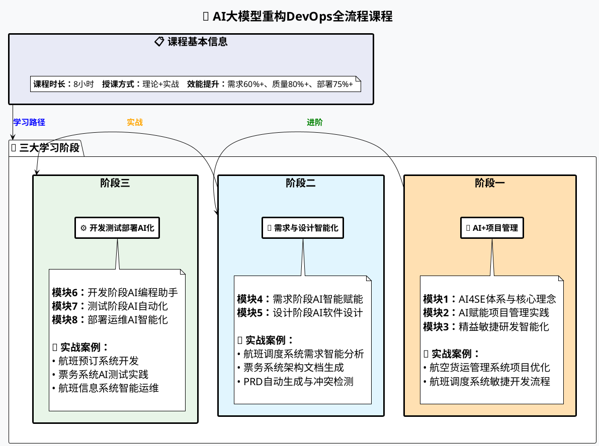
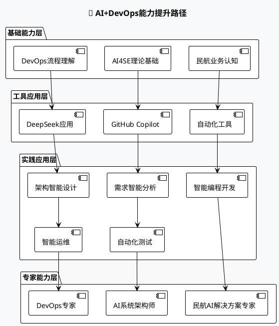

# AI大模型重构DevOps全流程课程脉络

## 📋 课程基本信息

| 项目               | 详情                                                              |
| ------------------ | ----------------------------------------------------------------- |
| **课程名称** | AI大模型重构DevOps全流程：从需求到运维的智能闭环实战              |
| **课程时长** | 1天（8小时）                                                      |
| **培训方式** | 课堂讲授 + 实战演练 + 动手练习                                    |
| **授课地点** | 中睿培训室/民航凯亚指定地点                                       |
| **授课对象** | Java/Python开发工程师、架构师、DevOps工程师、测试工程师、项目经理 |

## 🎯 课程核心理念

### 💡 课程描述

当传统民航软件研发遇上AI大模型技术，一场颠覆性的效能革命正在发生！本课程将带您掌握AI时代研发管理的终极密码，让每个决策都有数据支撑，每个流程都充满智能！

### 🔥 核心亮点

- **全流程覆盖**：贯穿需求、设计、开发、测试、部署、运维六大阶段
- **工程化落地**：重点提升Java/Python技术栈的AI应用开发能力
- **民航场景融合**：结合航班调度、票务系统、机场运营等真实业务场景
- **效能显著提升**：需求分析效率↑60%、代码质量↑80%、部署成功率↑75%

## 📈 课程脉络图

## 🎓 课程收益

### 1️⃣ 掌握AI+DevOps全链路方法论

- 理解大模型在软件研发全生命周期中的应用全景
- 学习AI4SE（AI for Software Engineering）核心概念与最佳实践
- 构建人工智能开发的核心技术体系

### 2️⃣ 提升全流程AI赋能能力

| 阶段               | AI赋能内容                              | 实践场景            |
| ------------------ | --------------------------------------- | ------------------- |
| **需求阶段** | 航班调度需求转化、自动生成PRD、冲突检测 | 需求分析效率提升60% |
| **设计阶段** | 架构蓝图生成、API设计优化、自动化评审   | 设计质量显著提升    |
| **开发阶段** | 智能代码生成、架构优化、技术债务降低    | 代码质量提升80%     |
| **测试阶段** | 自动化测试用例生成、缺陷预测            | 测试覆盖率大幅提升  |
| **部署阶段** | AI辅助自动化部署、配置管理              | 部署成功率提升75%   |
| **运维阶段** | 智能监控、预测性维护体系                | 故障响应效率提升    |

### 3️⃣ 强化工程实战技能

- 熟练使用GitHub Copilot、DeepSeek、MCP等AI开发工具链
- 完成需求生成、架构文档生成、自动化测试、CI/CD、智能运维实践
- 获得民航领域AI应用的成功经验

### 4️⃣ 解决复杂业务场景AI技术难题

- 培养高并发、高可靠性环境下的AI系统设计能力
- 全面提升企业数智化产品的研发效能和创新水平
- 为企业构建AI驱动的研发效能平台，实现研发成本降低30%+

## 🛠️ 培训环境与工具

### 💻 技术环境要求

- **硬件要求**：RAM 4G+，主流CPU配置，1台/1人
- **操作系统**：Windows/macOS/Linux
- **开发工具**：Python、Java开发环境
- **AI工具链**：DeepSeek、GitHub工具集、Office办公软件

### 🔧 核心工具栈

- **AI大模型**：DeepSeek、GitHub Copilot
- **开发环境**：Java/Python技术栈
- **自动化工具**：Selenium、CI/CD工具链
- **监控分析**：日志分析、性能监控工具

## 📚 实战案例矩阵

### 🛫 民航业务场景深度融合

| 模块               | 实战案例                 | 业务场景           | 技术重点               |
| ------------------ | ------------------------ | ------------------ | ---------------------- |
| **项目管理** | 航空货运管理系统项目优化 | 货运追踪与调度     | AI项目计划、风险管理   |
| **敏捷开发** | 航班调度系统敏捷流程     | 航班调度与资源配置 | Sprint规划、迭代优化   |
| **需求分析** | 航班调度系统需求智能分析 | 航班准点率提升     | 需求转化、PRD生成      |
| **架构设计** | 票务系统软件设计         | 机票预订与管理     | 架构文档、详细设计     |
| **AI编程**   | 航班预订系统开发         | 航班搜索与预订     | 代码生成、单元测试     |
| **智能测试** | 票务系统AI测试实践       | 订票流程测试       | 测试用例生成、风险预测 |
| **智能运维** | 航班信息系统日志分析     | 系统运维监控       | 日志分析、故障诊断     |

## 🎯 学习路径与进阶

### 📈 能力提升路径图

## 📝 课程形式与评价

### 🎪 教学方法

- **课堂讲授**：理论知识系统讲解
- **讲义解析**：核心概念深度剖析
- **情景模拟**：真实业务场景还原
- **实战演练**：动手实践操作
- **互动讨论**：小组研讨交流

### 📊 学习属性分布

| 学习类型            | 教学方式                     | 占比 |
| ------------------- | ---------------------------- | ---- |
| **概念/理论** | 讲授、启发、提问、个人思考   | 30%  |
| **步骤/结构** | 实战演练＋动手练习           | 25%  |
| **实用技巧**  | 实战经验讲授、案例分析       | 20%  |
| **学习工具**  | 工具应用分析、使用练习       | 15%  |
| **实战案例**  | 小组研讨、互动讨论、实战演练 | 10%  |

## 🏆 预期成果与价值

### 💡 个人收获

- **技能提升**：掌握AI+DevOps全栈技能
- **工具精通**：熟练运用AI开发工具链
- **实战经验**：获得民航领域AI应用经验
- **职业发展**：获得个性化能力发展规划

### 🏢 企业价值

- **效能提升**：研发效率全面提升（需求60%+、质量80%+、部署75%+）
- **成本降低**：研发成本降低30%+
- **技术升级**：构建AI驱动的研发效能平台
- **竞争优势**：在AI时代获得技术领先优势

---

<b>🚀 让AI重构您的DevOps流程，开启智能研发新时代！</b>

