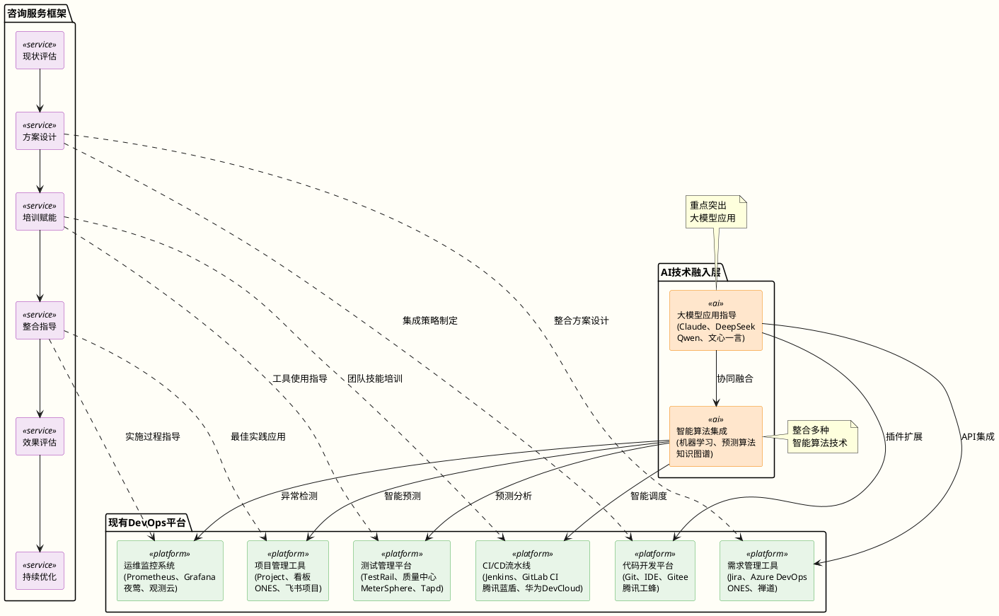
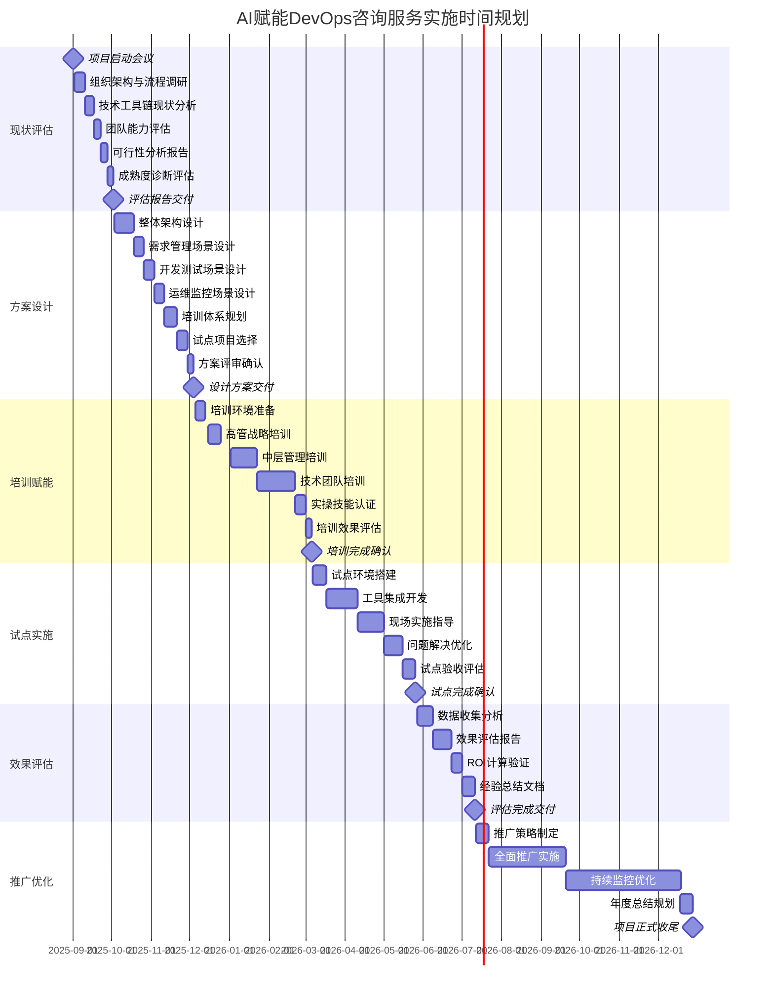

# AI赋能企业DevOps流程咨询服务方案

## 📋 执行摘要 (Executive Summary)（采纳）

### 业务挑战与机遇

在数字化转型的浪潮中，企业面临着软件交付周期冗长和DevOps流程效率低下的双重挑战。传统的开发运维方式（如手工部署、静态测试、被动监控）已无法满足企业对快速交付、高质量发布和智能运维的需求。尤其是在需求变更频繁、系统复杂度不断提升、用户体验要求越来越高的业务环境中，如何将AI技术有效融入现有DevOps流程，成为提升企业竞争力和业务响应速度的关键。

AI赋能DevOps作为一种结合了人工智能技术和传统DevOps实践的先进方法，能够智能化地优化需求分析、代码开发、自动化测试、智能部署和预测性运维等关键环节。这种方法不仅能够解决传统DevOps流程的"效率瓶颈"问题，还能与企业现有开发平台深度整合，实现渐进式智能化升级。

在本咨询服务方案中主要解决以下问题：

- **明确价值**：为广州集装箱码头有限公司提供AI赋能DevOps的场景分析和价值评估，帮助其理解技术融合的必要性和可行性。
- **方案设计**：基于客户现有DevOps平台和工具链，设计AI技术融入的具体方案和实施路径。
- **能力建设**：通过系统化培训和咨询指导，提升团队AI+DevOps实践能力，培养内部专家。
- **整合实施**：指导AI工具与现有开发平台的整合，确保技术融合的平滑过渡和效果最大化。

作为信息化咨询服务的领先提供商，我司在AI赋能DevOps咨询领域积累了丰富的实战经验和方法论沉淀，熟悉Claude Sonnet4、Deepseek等大模型技术，以及深度学习、机器学习、NLP、计算机视觉、预测算法等AI技术在DevOps场景中的应用模式，能够根据企业现有技术架构和业务场景，设计个性化的AI融入方案，支持多种开发平台、多技术栈的智能化改造需求。与阿里云、微软、华为、腾讯等多家企业建立合作伙伴关系，目前已为深圳宝安综合港、新世界地产、中南空管局、广百集团、华星光电、湘潭电网等多家企业提供AI+DevOps咨询服务。

中睿信息咨询团队通过与贵司信息部门人员、业务需求部门人员深入沟通交流后，将基于客户现有DevOps环境和项目实际情况，提供定制化的咨询服务和培训指导，帮助研发团队掌握AI工具的使用方法和最佳实践，协助解决AI技术与现有开发流程整合的关键问题，确保AI赋能DevOps理念和方法在企业内部的成功落地。客户可采用咨询服务采购方式，从DevOps现状评估、AI融入方案设计、团队培训赋能、整合实施指导、最佳实践总结等方面，获得全方位的专业支持，并培养企业内部的AI+DevOps复合型技术人才。

### 核心价值主张

- 🎓 **能力建设**：通过系统化培训，提升团队AI+DevOps实践能力
- 📋 **方案设计**：基于现有平台，设计AI技术融入的具体方案和路径
- � **整合指导**：指导AI工具与现有开发平台的深度整合
- 💡 **最佳实践**：输出AI赋能DevOps的场景库和实践指南
- 🏆 **效果保证**：确保AI技术融入后实现预期的效率和质量提升
- 👨‍💼 **专家培养**：培养企业内部AI+DevOps复合型技术专家

### 服务投资预期

- **咨询服务投资**：80-200万元（根据服务深度和周期）
- **培训服务投资**：30-80万元（根据培训规模和层次）
- **预期收益**：通过AI工具应用，年度效率提升价值500-1500万元
- **投资回收期**：6-12个月内通过效率提升实现投资回收
- **服务风险**：极低（纯咨询服务，无技术实施风险）

## 🎯 业务价值与收益分析

### DevOps流程现状痛点

| 流程阶段 | 传统模式痛点             | 业务影响           | 损失量化          |
| -------- | ------------------------ | ------------------ | ----------------- |
| 需求管理 | 需求理解偏差、变更频繁   | 项目延期、成本超支 | 年度损失500万+    |
| 设计开发 | 代码质量不一、重复造轮子 | 技术债务累积       | 维护成本增加30%   |
| 构建部署 | 手工操作、环境不一致     | 发布失败率高       | 平均每次损失50万  |
| 测试验证 | 测试覆盖不全、回归测试慢 | 生产bug率高        | 客户满意度下降25% |
| 发布运维 | 被动式监控、故障响应慢   | 服务中断、用户流失 | 每小时损失100万+  |
| 项目管理 | 进度不透明、风险识别滞后 | 项目成功率低       | 失败项目占比20%   |

### AI赋能后价值收益

```
价值创造模型：
┌─────────────────────────────────────────────────────────────┐
│                   AI赋能DevOps价值矩阵                      │
├─────────────────────────────────────────────────────────────┤
│ 效率提升维度：                                              │
│   • 需求分析自动化     → 需求处理效率提升 80%               │
│   • 代码智能生成       → 开发效率提升 60%                   │
│   • 自动化测试生成     → 测试效率提升 70%                   │
│   • 智能部署优化       → 部署成功率提升至 99%               │
│                                                             │
│ 质量提升维度：                                              │
│   • 智能代码审查       → 代码缺陷率降低 60%                 │
│   • 预测性测试         → 生产bug率降低 70%                  │
│   • 自愈式运维         → 系统可用性达 99.9%                 │
│   • 智能风险预警       → 项目成功率提升至 95%               │
│                                                             │
│ 成本优化维度：                                              │
│   • 减少重复劳动       → 人力成本节约 40%                   │
│   • 预防性维护         → 运维成本降低 50%                   │
│   • 资源智能调度       → 基础设施成本节约 30%               │
│   • 知识自动沉淀       → 培训成本降低 60%                   │
└─────────────────────────────────────────────────────────────┘
```

## 🏗️ AI赋能DevOps咨询方案架构（采纳）

### 咨询服务整体框架



### AI技术与现有平台整合方案

#### 整合策略矩阵

| 现有平台类型       | AI技术融入点   | 整合方式         | 预期效果              |
| ------------------ | -------------- | ---------------- | --------------------- |
| **需求管理** | NLP需求分析    | API集成/插件扩展 | 需求理解准确度提升80% |
| **代码开发** | 大模型代码生成 | IDE插件/Git集成  | 开发效率提升60%       |
| **构建部署** | 智能调度优化   | 流水线脚本增强   | 构建时间缩短50%       |
| **测试管理** | 自动化测试生成 | 测试框架集成     | 测试覆盖率提升70%     |
| **运维监控** | 预测性分析     | 监控告警增强     | 故障预防率达85%       |
| **项目管理** | 智能进度预测   | 仪表板集成       | 项目成功率提升至95%   |

### AI技术应用场景库

#### 核心AI技术与DevOps场景匹配

| AI技术类别             | 主要工具/平台                                                    | DevOps应用场景               | 整合难度      | 咨询重点             |
| ---------------------- | ---------------------------------------------------------------- | ---------------------------- | ------------- | -------------------- |
| **大模型**       | Claude Sonnet 4、DeepSeek、通义千问Qwen、文心一言、智谱GLM、Kimi | 需求分析、代码生成、文档写作 | ⭐⭐⭐ 中等   | API集成、提示词优化  |
| **机器学习**     | TensorFlow、PyTorch、飞桨PaddlePaddle、MindSpore、阿里PAI        | 缺陷预测、性能优化           | ⭐⭐⭐⭐ 较高 | 模型训练、数据准备   |
| **自然语言处理** | Transformers、BERT、讯飞星火、腾讯混元、商汤日日新               | 需求理解、日志分析           | ⭐⭐⭐ 中等   | 文本预处理、模型选型 |
| **计算机视觉**   | OpenCV、YOLO、商汤SenseTime、旷视Face++、海康威视                | UI测试、界面检查             | ⭐⭐⭐⭐ 较高 | 图像处理、模型训练   |
| **预测算法**     | LSTM、Prophet、阿里PAI、腾讯TI-ML、华为ModelArts                 | 容量规划、故障预测           | ⭐⭐⭐ 中等   | 时序数据分析         |
| **知识图谱**     | Neo4j、Apache Jena、海致BDP、明略科技、星环TDH                   | 知识管理、依赖分析           | ⭐⭐⭐⭐⭐ 高 | 图数据建模、查询优化 |

## 🔄 AI赋能DevOps六大核心场景（采纳）

### 1. 需求管理：智能需求分析与整合

#### AI赋能场景设计

```markdown
🎯 核心咨询内容：

1. 现有需求管理工具AI增强方案
   • 评估现有需求管理平台（Jira、Azure DevOps、ONES、禅道、Tapd等）
   • 设计大模型API集成方案，实现需求智能解析
   • 指导团队使用Claude、Qwen、文心一言等进行需求文档理解和用户故事生成
   • 培训团队掌握提示词工程，提升需求分析质量

2. 需求变更影响分析咨询
   • 设计需求关联关系建模方法
   • 指导构建需求-功能-代码关联图谱
   • 培训团队使用AI工具进行变更影响评估
   • 建立需求变更的AI辅助决策流程

3. 智能需求验证与冲突检测
   • 设计基于NLP的需求冲突检测算法
   • 指导团队建立需求质量评估标准
   • 培训使用AI工具进行需求完整性检查
   • 建立需求评审的AI辅助流程
```

#### 现有平台整合指导

**针对Jira/ONES平台的AI整合**：

- 通过REST API集成Claude、Qwen等大模型，实现需求智能分析
- 开发自定义字段存储AI分析结果
- 配置工作流集成AI验证步骤
- 培训团队使用传统工具 + AI的新工作模式

**针对Azure DevOps/禅道的AI整合**：

- 利用扩展机制集成AI服务
- 配置Work Items的AI智能填充
- 设置AI辅助的需求评审流程
- 建立需求追踪的AI增强Dashboard

**针对国产平台(ONES、Tapd)的AI整合**：

- 通过API接口集成国产大模型(文心一言、通义千问)
- 利用平台插件机制扩展AI功能
- 设计符合国内企业特色的AI工作流
- 建立本土化的AI应用最佳实践

### 2. 设计开发：AI驱动的智能开发指导

#### AI赋能场景设计

```markdown
🛠️ 核心咨询内容：

1. 代码生成AI工具整合方案
   • 评估现有IDE和开发环境（VS Code、IntelliJ、WebStorm、国产IDE如华为DevEco等）
   • 指导DeepSeek、通义灵码、CodeGeeX、GitHub Copilot等AI编码助手的最佳配置
   • 培训开发团队使用AI进行代码生成和优化
   • 建立代码质量AI审查标准和流程

2. 架构设计AI辅助咨询
   • 设计基于AI的架构模式推荐系统
   • 指导团队使用AI工具进行技术选型
   • 培训架构师利用AI进行设计决策
   • 建立AI辅助的架构评审流程

3. 代码审查智能化改造
   • 设计AI代码审查集成方案（集成到Git工作流）
   • 配置自动化代码质量检查
   • 培训团队使用AI进行代码安全扫描
   • 建立AI增强的Code Review流程
```

#### 整合实施指导

**现有IDE的AI增强**：

```markdown
VS Code AI整合指导：
• 安装和配置GitHub Copilot插件
• 集成Claude API进行代码解释和优化
• 配置AI辅助的代码格式化和重构
• 建立团队统一的AI工具使用规范

IntelliJ IDEA AI整合指导：
• 配置AI Assistant插件
• 集成代码生成AI服务
• 设置智能代码建议和补全
• 建立代码质量AI检查流程
```

### 3. 构建部署：智能化CI/CD流程咨询

#### AI赋能场景设计

```markdown
🚀 核心咨询内容：

1. CI/CD流水线智能优化
   • 分析现有Jenkins/GitLab CI/Azure Pipeline配置
   • 设计AI驱动的构建优化策略
   • 指导实施智能并行构建和资源调度
   • 培训运维团队使用AI工具优化部署流程

2. 部署风险AI评估
   • 设计基于历史数据的部署风险预测模型
   • 指导建立AI驱动的部署决策机制
   • 培训团队使用AI进行环境配置验证
   • 建立智能化的回滚和恢复策略

3. 配置管理智能化
   • 指导AI工具在配置管理中的应用
   • 设计智能配置生成和验证流程
   • 培训团队使用AI进行环境一致性检查
   • 建立配置漂移的AI检测机制
```

### 4. 测试验证：AI驱动的智能测试咨询

#### AI赋能场景设计

```markdown
🔍 核心咨询内容：

1. 自动化测试AI增强
   • 评估现有测试框架（Selenium、TestNG等）
   • 指导AI测试用例自动生成的实施
   • 培训测试团队使用AI进行测试数据生成
   • 建立AI辅助的测试策略制定流程

2. 缺陷预测AI模型咨询
   • 设计基于代码分析的缺陷预测模型
   • 指导历史缺陷数据的AI分析应用
   • 培训团队使用AI进行测试优先级排序
   • 建立AI驱动的测试资源分配策略

3. 性能测试智能化
   • 指导AI在性能测试场景生成中的应用
   • 设计智能负载模式识别和模拟
   • 培训团队使用AI进行性能瓶颈分析
   • 建立AI辅助的性能优化建议机制
```

### 5. 发布运维：智能运维咨询指导

#### AI赋能场景设计

```markdown
🔧 核心咨询内容：

1. 监控告警AI增强
   • 评估现有监控平台（Prometheus、Grafana等）
   • 指导AI告警去重和根因分析的实施
   • 培训运维团队使用AI进行故障预测
   • 建立AI驱动的告警处理流程

2. 预测性运维咨询
   • 设计基于监控数据的故障预测模型
   • 指导容量规划AI模型的构建和应用
   • 培训团队使用AI进行资源使用趋势分析
   • 建立预测性维护的决策支持系统

3. 自动化运维AI集成
   • 指导现有运维脚本的AI增强
   • 设计智能化的故障自愈机制
   • 培训团队使用AI进行运维决策支持
   • 建立AI辅助的变更管理流程
```

### 6. 项目管理：AI驱动的智能项目管控咨询

#### AI赋能场景设计

```markdown
📊 核心咨询内容：

1. 项目进度AI预测
   • 评估现有项目管理工具（Project、Jira等）
   • 指导AI项目进度预测模型的构建
   • 培训项目经理使用AI进行风险识别
   • 建立AI辅助的项目决策支持系统

2. 团队协作AI优化
   • 设计AI驱动的任务分配优化算法
   • 指导团队技能匹配和工作负载均衡
   • 培训管理层使用AI进行团队效能分析
   • 建立AI辅助的绩效评估体系

3. 知识管理AI应用
   • 指导项目知识的AI自动提取和整理
   • 设计智能化的最佳实践推荐系统
   • 培训团队使用AI进行经验复用
   • 建立AI驱动的知识图谱管理系统
```

## 📚 咨询服务交付模式与方法论

### 服务交付体系设计

#### 1. 战略咨询服务（德勤模式）

```markdown
🎯 战略层级咨询：

• 数字化转型战略规划
  - AI赋能DevOps成熟度评估
  - 数字化转型路线图制定
  - ROI分析与商业价值论证
  - 服务周期：4-8周

• 技术融合策略咨询
  - 现有平台AI集成可行性分析
  - 技术栈选型与整合建议
  - 安全合规与风险评估
  - 服务周期：6-12周

• 组织变革管理
  - DevOps团队能力评估
  - 人才能力模型构建
  - 变革管理策略制定
  - 服务周期：8-16周
```

#### 2. 方案设计服务（IBM模式）

```markdown
🛠️ 方案设计咨询：

• AI融入现有平台方案设计
  - 现有DevOps工具链分析
  - AI技术集成点识别
  - 整合方案详细设计
  - 服务周期：6-12周

• 流程优化与重塑设计
  - DevOps流程现状分析
  - AI赋能流程重塑方案
  - 最佳实践库构建
  - 服务周期：8-16周

• 试点项目方案设计
  - 试点项目选择标准
  - AI融入具体实施方案
  - 效果评估指标体系
  - 服务周期：4-8周
```

#### 3. 培训与能力建设服务（微软模式）

```markdown
🎓 培训与能力建设：

• 分层次培训体系
  - 管理层：AI+DevOps战略与价值认知
  - 技术层：AI工具使用与实践技能
  - 操作层：日常操作与维护规范
  - 服务周期：持续6-12个月

• 认证与评估体系
  - AI+DevOps能力认证标准制定
  - 技能评估与能力画像
  - 持续学习路径规划
  - 服务周期：建立后持续运营

• 实践指导与教练服务
  - 现场实践指导
  - 问题解决与答疑
  - 最佳实践经验分享
  - 服务周期：长期伴随式服务
```

### 咨询服务交付形式矩阵

| 服务类型           | 现场咨询  | 远程咨询  | 混合模式 | 适用场景           |
| ------------------ | --------- | --------- | -------- | ------------------ |
| **战略规划** | ✅ 核心   | ✅ 支持   | 🎯 推荐  | 高层决策、方案评审 |
| **方案设计** | ✅ 重要   | ✅ 可行   | 🎯 推荐  | 技术方案、架构设计 |
| **培训授课** | ✅ 传统   | ✅ 创新   | 🎯 推荐  | 技能提升、知识转移 |
| **实践指导** | ✅ 核心   | ⚠️ 部分 | 🎯 推荐  | 工具使用、问题解决 |
| **效果评估** | ⚠️ 部分 | ✅ 核心   | ✅ 标准  | 成果验收、持续优化 |

## 🎓 培训与能力建设方案（采纳）

### 分层次培训体系

#### 高管层培训：AI+DevOps战略价值

**培训目标**：理解AI赋能DevOps的战略价值，掌握数字化转型决策要点

**课程大纲**（1天，16学时）：

```markdown
第一天：战略认知与价值理解
• AI技术发展趋势与DevOps演进（2小时）
• AI赋能DevOps的商业价值与ROI分析（2小时）
• 数字化转型成功案例分析（2小时）
• 企业AI+DevOps成熟度评估（2小时）

第二天：实施策略与风险管控
• AI+DevOps实施路线图制定（2小时）
• 组织变革与人才策略（2小时）
• 技术风险与合规管理（2小时）
• 投资决策与预算规划（2小时）
```

#### 技术管理层培训：AI+DevOps架构与实践（不要）

**培训目标**：掌握AI+DevOps技术架构，具备实施指导能力

**课程大纲**（4天，40学时）：

```markdown
第一天：AI+DevOps基础架构
• DevOps核心流程与AI融合点分析（4小时）
• 大模型技术原理与应用场景（4小时）

第二天：需求与设计阶段AI应用
• 智能需求分析工具使用实践（4小时）
• AI驱动的架构设计与代码生成（4小时）

第三天：构建测试阶段AI应用
• 智能化CI/CD流水线设计（4小时）
• AI测试生成与质量保证（4小时）

第四天：运维与管理阶段AI应用
• 预测性运维与智能告警（4小时）
• AI项目管理与风险控制（4小时）

第五天：综合实战与案例研讨
• 企业级AI+DevOps方案设计（4小时）
• 实施计划制定与成果展示（4小时）
```

#### 技术实施层培训：AI工具使用与实践操作

**培训目标**：熟练掌握AI工具使用，具备独立实施能力

**课程大纲**（10天，80学时）：

```markdown
第1-2天：AI大模型应用基础（16学时）
• Claude Sonnet 4 API使用与提示词工程
• DeepSeek代码生成与优化实践
• 大模型集成开发环境搭建

第3-4天：智能需求与设计工具（16学时）
• 需求分析AI工具链使用
• 智能架构设计工具实践
• 代码生成与审查工具操作

第5-6天：智能构建与测试工具（16学时）
• AI驱动的CI/CD流水线配置
• 自动化测试生成工具使用
• 性能测试与优化工具实践

第7-8天：智能运维与监控工具（16学时）
• 预测性运维平台搭建
• 智能告警与根因分析系统
• 自动化运维脚本开发

第9-10天：综合项目实战（16学时）
• 端到端AI+DevOps项目实施
• 问题排查与解决实践
• 最佳实践总结与分享
```

### 教练式辅导服务

#### 1. 敏捷教练模式

```markdown
🎯 教练服务内容：

• 团队协作优化
  - 敏捷开发流程与AI工具融合
  - 团队沟通效率提升指导
  - 跨部门协作机制建立

• 实践指导与反馈
  - AI工具使用技巧指导
  - 最佳实践经验分享
  - 持续改进建议提供

• 能力评估与提升
  - 团队能力成熟度评估
  - 个人技能发展规划
  - 学习路径定制化设计

服务周期：6-12个月
服务频率：每周2-3次，每次2-4小时
服务方式：现场+远程混合
```

#### 2. 技术教练模式

```markdown
🛠️ 技术教练服务：

• 技术架构指导
  - AI+DevOps架构设计评审
  - 技术选型建议与优化
  - 性能调优与问题解决

• 代码质量提升
  - 代码审查标准建立
  - AI工具辅助开发指导
  - 技术债务治理建议

• 工具链优化
  - DevOps工具链集成优化
  - AI工具使用效率提升
  - 自动化程度持续改进

服务周期：3-6个月
服务频率：每周1-2次，每次4-8小时
服务方式：以远程为主，关键节点现场
```

## 🚀 AI赋能DevOps咨询服务实施方案

### 总体实施策略：六步闭环，螺旋提升

基于咨询服务整体框架，我们采用"现状评估 → 方案设计 → 培训赋能 → 整合指导 → 效果评估 → 持续优化"的六步闭环模式，确保AI赋能DevOps在企业的成功落地和持续发展。



### PlantUML版本甘特图

```plantuml
@startuml AI赋能DevOps实施甘特图
!define LIGHTBLUE #E3F2FD
!define BLUE #2196F3
!define GREEN #4CAF50
!define ORANGE #FF9800
!define PURPLE #9C27B0
!define RED #F44336

project starts 2025-09-01

[现状评估阶段] as [EVAL] lasts 32 days
[EVAL] is colored in LIGHTBLUE

[组织流程调研] as [T1] lasts 8 days
[T1] starts 2025-09-02
[T1] is colored in BLUE

[技术现状分析] as [T2] lasts 7 days  
[T2] starts 2025-09-10
[T2] is colored in BLUE

[可行性研究] as [T3] lasts 10 days
[T3] starts 2025-09-22
[T3] is colored in BLUE

[方案设计阶段] as [DESIGN] lasts 62 days
[DESIGN] starts 2025-10-03
[DESIGN] is colored in GREEN

[架构方案设计] as [D1] lasts 15 days
[D1] starts 2025-10-03
[D1] is colored in GREEN

[场景应用设计] as [D2] lasts 24 days
[D2] starts 2025-10-18
[D2] is colored in GREEN

[培训体系设计] as [D3] lasts 18 days
[D3] starts 2025-11-11
[D3] is colored in GREEN

[培训赋能阶段] as [TRAIN] lasts 91 days
[TRAIN] starts 2025-12-05
[TRAIN] is colored in ORANGE

[高管层培训] as [TR1] lasts 10 days
[TR1] starts 2025-12-15
[TR1] is colored in ORANGE

[管理层培训] as [TR2] lasts 20 days
[TR2] starts 2026-01-02
[TR2] is colored in ORANGE

[技术层培训] as [TR3] lasts 30 days
[TR3] starts 2026-01-22
[TR3] is colored in ORANGE

[试点实施阶段] as [PILOT] lasts 80 days
[PILOT] starts 2026-03-07
[PILOT] is colored in PURPLE

[环境搭建] as [P1] lasts 10 days
[P1] starts 2026-03-07
[P1] is colored in PURPLE

[工具集成] as [P2] lasts 25 days
[P2] starts 2026-03-17
[P2] is colored in PURPLE

[现场指导] as [P3] lasts 35 days
[P3] starts 2026-04-11
[P3] is colored in PURPLE

[效果评估阶段] as [EVALUATE] lasts 45 days
[EVALUATE] starts 2026-05-27
[EVALUATE] is colored in RED

[数据分析] as [E1] lasts 12 days
[E1] starts 2026-05-27
[E1] is colored in RED

[效果评估] as [E2] lasts 23 days
[E2] starts 2026-06-08
[E2] is colored in RED

[推广优化阶段] as [OPTIMIZE] lasts 169 days
[OPTIMIZE] starts 2026-07-12
[OPTIMIZE] is colored in GREEN

[推广实施] as [O1] lasts 60 days
[O1] starts 2026-07-22
[O1] is colored in GREEN

[持续优化] as [O2] lasts 90 days
[O2] starts 2026-09-20
[O2] is colored in GREEN

-- 关键里程碑 --
2025-09-01 : 项目启动
2025-10-02 : 现状评估完成
2025-12-04 : 方案设计完成
2026-03-06 : 培训赋能完成
2026-05-26 : 试点实施完成
2026-07-11 : 效果评估完成
2026-12-28 : 项目收尾

@enduml
```

### 阶段一：现状评估 - 全面诊断，精准定位

#### 1.1 DevOps现状深度调研（10工作日）

**工作内容与交付物**：

```markdown
🔍 调研维度与方法：

组织架构与流程调研：
• 现有研发组织架构分析
• DevOps流程梳理与可视化
• 角色职责与协作关系分析
• 工作流瓶颈识别与量化

技术栈与工具链调研：
• 开发工具链全景扫描(IDE、代码管理、构建工具)
• 测试工具与自动化程度评估
• 部署运维工具使用情况分析
• 监控告警体系完整性评估

数据资产与基础设施调研：
• 代码仓库规模与质量分析
• 历史缺陷数据统计分析
• 系统性能与监控数据收集
• IT基础设施资源使用情况

人员能力与文化调研：
• 技术团队技能图谱绘制
• AI工具认知与使用现状
• 学习意愿与变革接受度
• 创新文化与协作氛围评估

📋 调研交付物：
✅ DevOps现状调研报告(80页)
✅ 技术工具链全景图
✅ 流程瓶颈识别清单
✅ 团队能力现状画像
✅ 基础数据收集汇总表
```

#### 1.2 AI融入可行性分析（10工作日）

**工作内容与交付物**：

```markdown
🎯 可行性分析维度：

技术可行性评估：
• 现有系统AI技术集成适配性分析
• API接口开放程度与扩展能力
• 数据质量与AI训练条件评估
• 安全合规要求与AI应用约束

业务价值可行性分析：
• AI应用场景价值量化评估
• 投资回报率预测模型构建
• 风险收益比分析
• 竞争优势提升潜力评估

实施可行性评估：
• 组织变革准备度评估
• 人员技能转型可行性
• 预算投入与资源配置分析
• 时间窗口与实施周期规划

📊 可行性分析交付物：
✅ AI融入可行性分析报告(60页)
✅ 技术适配性评估矩阵
✅ 投资回报预测模型
✅ 风险评估与缓解策略
✅ 实施建议与优先级排序
```

#### 1.3 成熟度评估与诊断（10工作日）

**工作内容与交付物**：

```markdown
📈 成熟度评估框架：

DevOps成熟度五级模型评估：
• Level 1 初始级：手工操作为主
• Level 2 可重复级：部分自动化
• Level 3 已定义级：标准化流程
• Level 4 已管理级：度量与监控
• Level 5 优化级：持续改进

AI就绪度四维评估：
• 数据就绪度：数据质量、完整性、可用性
• 技术就绪度：架构适配、工具支持、技能储备  
• 组织就绪度：文化开放、变革能力、资源投入
• 业务就绪度：场景清晰、价值认同、实施意愿

🎯 诊断输出：
✅ DevOps成熟度评估报告(40页)
✅ AI就绪度诊断报告(30页)
✅ 能力差距分析与改进建议
✅ 成熟度提升路线图
✅ 快速胜利点识别清单
```

**阶段一总结与里程碑**：

```markdown
🏁 阶段一交付成果汇总：

核心交付物：
✅ 综合现状评估报告(200页)
✅ AI赋能DevOps可行性研究报告
✅ 成熟度提升路线图
✅ 投资收益预测分析
✅ 风险评估与应对策略

关键里程碑：
🎯 M1.1: DevOps现状全面摸底完成
🎯 M1.2: AI融入可行性论证完成  
🎯 M1.3: 企业AI+DevOps成熟度基线确立
🎯 M1.4: 客户高层战略决策支持完成

价值输出：
• 为企业提供清晰的数字化转型现状认知
• 建立科学的AI+DevOps投资决策依据
• 识别关键瓶颈和改进机会点
• 奠定后续方案设计的数据基础
```

### 阶段二：方案设计 - 系统规划，精细设计

#### 2.1 整体架构方案设计（20工作日）

**工作内容与交付物**：

```markdown
🏗️ 架构设计核心内容：

AI+DevOps总体架构设计：
• 基于现有平台的AI能力扩展架构
• 微服务化AI服务集成策略
• API网关与服务治理方案  
• 数据流与信息安全架构

技术选型与集成方案：
• 大模型技术栈选型建议(Claude/DeepSeek/Qwen)
• 机器学习平台集成方案
• 现有工具链AI增强策略
• 云原生AI服务架构设计

平台整合策略设计：
• 需求管理平台(Jira/ONES)AI增强方案
• 代码开发平台(Git/IDE)智能化改造
• CI/CD平台(Jenkins/蓝盾)AI集成设计
• 运维监控平台(Prometheus/Grafana)智能化升级

🎯 架构设计交付物：
✅ AI+DevOps总体架构设计书(120页)
✅ 技术选型与集成方案(80页)  
✅ 平台改造详细设计文档(100页)
✅ API设计规范与接口文档
✅ 数据架构与安全方案
✅ 部署架构与环境规划
```

#### 2.2 六大场景AI应用详细设计（20工作日）

**工作内容与交付物**：

```markdown
🎯 场景化AI应用设计：

场景1：智能需求管理
• 需求文档AI理解与分析算法设计
• 用户故事自动生成流程设计
• 需求变更影响分析AI模型设计
• 与Jira/ONES集成的API设计

场景2：AI驱动代码开发  
• 代码生成AI服务集成方案
• 代码质量AI审查流程设计
• IDE插件开发与集成策略
• Git工作流AI增强设计

场景3：智能构建部署
• CI/CD流水线AI优化算法
• 部署风险AI评估模型
• 环境配置智能生成方案
• 回滚策略AI决策机制

场景4：AI测试生成
• 测试用例AI自动生成算法
• 缺陷预测AI模型设计  
• 性能测试智能场景生成
• 测试数据AI合成方案

场景5：预测性运维
• 故障预测AI模型设计
• 智能告警去重算法
• 容量规划AI预测模型
• 自动化运维AI决策树

场景6：智能项目管理
• 项目进度AI预测模型
• 风险识别AI算法设计
• 资源分配优化算法
• 团队效能AI分析模型

📋 场景设计交付物：
✅ 六大场景AI应用设计方案(每场景40页，共240页)
✅ AI算法选型与训练方案  
✅ 数据需求与处理流程设计
✅ 用户交互界面设计原型
✅ 性能指标与评估标准
```

#### 2.3 培训体系方案设计（15工作日）

**工作内容与交付物**：

```markdown
🎓 分层次培训体系设计：

高管层培训方案设计：
• AI+DevOps战略价值课程设计(2天)
• 数字化转型决策支持培训
• ROI分析与投资决策课程
• 变革管理与组织优化培训

管理层培训方案设计：
• AI+DevOps技术管理课程(5天)
• 团队转型与技能升级指导
• 项目管理与风险控制培训
• 绩效评估与激励机制设计

技术层培训方案设计：
• AI工具使用实战训练(10天)
• 代码级AI集成开发培训
• DevOps平台AI增强实践
• 故障排查与性能优化培训

运营层培训方案设计：
• AI辅助运维操作培训(3天)
• 智能监控与告警处理
• 自动化运维脚本开发
• 安全合规与风险管控

🎯 培训设计交付物：
✅ 分层次培训课程体系(80页)
✅ 培训教材与案例库设计
✅ 实验环境与工具准备方案
✅ 培训效果评估与认证体系
✅ 培训师资与资源配置计划
```

#### 2.4 试点项目规划设计（15工作日）

**工作内容与交付物**：

```markdown
🚀 试点项目策略设计：

试点项目选择标准：
• 业务影响可控、技术复杂度适中
• 团队配合度高、数据质量良好  
• 成功效果易于量化和展示
• 可复制推广价值高

试点实施计划设计：
• 3个试点项目并行实施策略
• 每个试点周期8-12周规划
• 分阶段验证与风险控制
• 快速迭代与持续优化机制

试点效果评估体系：
• 定量指标：效率提升、质量改善、成本节约
• 定性指标：用户体验、团队满意度、学习效果
• 对比基线建立与数据收集方案
• 成功标准与里程碑定义

📊 试点规划交付物：
✅ 试点项目选择与评估报告
✅ 试点实施详细计划(3个项目×30页)
✅ 试点环境搭建与配置方案
✅ 试点效果评估指标体系
✅ 风险控制与应急预案
```

**阶段二总结与里程碑**：

```markdown
🏁 阶段二交付成果汇总：

核心设计方案：
✅ AI+DevOps总体架构设计(含技术选型)
✅ 六大场景AI应用详细设计方案
✅ 分层次培训体系完整设计
✅ 试点项目实施规划方案
✅ 集成开发与部署指导书

关键里程碑：
🎯 M2.1: 技术架构方案设计完成并评审通过
🎯 M2.2: 六大AI应用场景设计完成并确认
🎯 M2.3: 培训体系设计完成并资源就绪  
🎯 M2.4: 试点项目选定并实施计划确认
🎯 M2.5: 整体方案评审通过，获得实施授权

价值输出：
• 提供系统性、可操作的AI+DevOps实施蓝图
• 建立科学的培训赋能和能力建设路径
• 设计风险可控的试点验证策略
• 为后续实施提供详细的操作指南
```

### 阶段三：培训赋能 - 能力建设，文化转型

#### 3.1 高管层战略培训（15工作日）

**工作内容与交付物**：

```markdown
🎯 高管层培训实施：

战略认知提升培训：
• AI+DevOps发展趋势与商业价值(1天)
• 数字化转型成功案例与失败教训(1天)  
• 投资决策与ROI管理最佳实践(0.5天)
• 变革管理与组织转型策略(0.5天)

现场工作坊：
• 企业AI+DevOps战略规划工作坊
• 投资组合优化决策演练
• 风险识别与应对策略讨论
• 组织变革路线图制定

效果巩固与跟进：
• 培训效果评估与反馈收集
• 一对一高管教练服务
• 定期战略执行回顾会议
• 最新趋势与实践分享

📋 高管培训交付物：
✅ 高管培训完成报告
✅ 战略共识与决策记录
✅ 变革管理行动计划
✅ 高管层AI+DevOps能力认证
```

#### 3.2 管理层实践培训（30工作日）

**工作内容与交付物**：

```markdown
🛠️ 管理层能力建设：

技术管理能力培训：
• AI+DevOps技术架构与实现原理(2天)
• 项目管理与团队协作优化(2天)
• 绩效管理与激励机制设计(1天)

实战演练培训：
• 基于真实项目的AI工具使用演练
• 团队技能转型指导实践
• 跨部门协作与沟通技巧
• 问题识别与解决方案制定

管理工具与方法：
• AI+DevOps项目管理工具使用
• 团队能力评估与发展规划
• 风险识别与控制机制
• 持续改进与优化方法

📊 管理层培训交付物：
✅ 管理层培训完成报告(含能力提升评估)
✅ 团队管理最佳实践手册
✅ AI+DevOps项目管理工具包
✅ 管理层技能认证证书
```

#### 3.3 技术层深度培训（45工作日）

**工作内容与交付物**：

```markdown
💻 技术团队核心技能培训：

AI工具使用培训：
• Claude/DeepSeek/Qwen等大模型API集成开发(5天)
• 提示词工程与模型优化技巧(3天)
• AI代码生成工具实战演练(4天)
• 智能测试工具使用与配置(3天)

DevOps平台AI增强培训：
• Jenkins/GitLab CI AI插件开发(4天)
• Kubernetes AI调度与优化(3天)  
• Prometheus AI告警与分析(3天)
• Git工作流AI辅助优化(2天)

项目实战培训：
• 端到端AI+DevOps项目开发(10天)
• 代码质量AI审查实践(3天)
• 运维自动化AI脚本开发(4天)
• 性能调优与故障诊断(2天)

🎯 技术培训交付物：
✅ 技术团队培训完成报告
✅ AI+DevOps技术实践手册
✅ 代码示例与模板库
✅ 技术认证与能力评估报告
✅ 内部技术分享与知识库
```

**阶段三总结与里程碑**：

```markdown
🏁 阶段三交付成果汇总：

培训完成情况：
✅ 高管层战略培训100%完成，决策能力提升
✅ 管理层实践培训100%完成，管理技能升级
✅ 技术层深度培训100%完成，实战能力具备
✅ 全员AI+DevOps认知与技能显著提升

关键里程碑：
🎯 M3.1: 组织AI+DevOps文化与理念形成
🎯 M3.2: 各层级团队具备AI工具使用能力
🎯 M3.3: 技术团队掌握AI+DevOps核心技术
🎯 M3.4: 内部讲师团队培养完成
🎯 M3.5: 培训效果评估达标，团队准备就绪

价值输出：
• 建立企业AI+DevOps人才梯队
• 形成持续学习与创新文化
• 具备独立实施AI+DevOps项目的能力
• 为大规模推广奠定人才基础
```

### 阶段四：整合指导 - 实践落地，深度融合

#### 4.1 试点项目启动与实施指导（40工作日）

**工作内容与交付物**：

```markdown
🚀 试点项目全程指导：

试点环境搭建指导：
• AI服务平台部署与配置
• 开发测试环境AI工具集成
• 数据管道与模型训练环境
• 监控告警与日志收集系统

实施过程现场指导：
• 每日站会与问题解决支持(每周3次×4小时)
• 技术难点攻关与方案优化
• 代码审查与质量管控指导
• 团队协作与流程优化建议

AI工具集成实践指导：
• 需求分析AI工具配置与调优
• 代码生成AI服务集成与测试
• 智能测试工具部署与使用
• 运维AI平台配置与优化

📋 实施指导交付物：
✅ 试点环境搭建完成确认
✅ 每周项目进展与问题解决报告
✅ AI工具集成配置文档
✅ 最佳实践与经验总结
✅ 试点阶段成果演示
```

#### 4.2 问题解决与持续优化（30工作日）

**工作内容与交付物**：

```markdown
🔧 问题诊断与解决：

技术问题解决：
• AI模型性能调优与精度提升
• 平台集成兼容性问题解决
• 性能瓶颈识别与优化建议
• 安全漏洞识别与修复指导

流程优化建议：
• AI工具使用流程标准化
• 团队协作效率提升建议
• 质量管控机制优化
• 知识共享与经验沉淀

效果监控与分析：
• 关键指标数据收集与分析
• 效果提升趋势跟踪
• 用户反馈收集与处理
• 改进建议制定与实施

🎯 优化成果交付：
✅ 问题解决方案库
✅ 流程优化建议报告
✅ 效果监控分析报告
✅ 持续改进行动计划
```

**阶段四总结与里程碑**：

```markdown
🏁 阶段四交付成果汇总：

试点实施成果：
✅ 3个试点项目成功实施并运行稳定
✅ AI工具与现有平台深度集成完成
✅ 团队AI+DevOps实践能力全面提升
✅ 可复制推广的成功模式建立

关键里程碑：
🎯 M4.1: 试点项目AI工具集成完成
🎯 M4.2: 试点运行效果达到预期目标
🎯 M4.3: 技术团队独立维护能力建立
🎯 M4.4: 试点经验总结与推广方案确定

价值输出：
• 验证AI+DevOps技术方案的可行性和有效性
• 建立企业级AI+DevOps标准化实践模式
• 培养内部技术专家和实施团队
• 为全面推广提供成功案例和经验基础
```

### 阶段五：效果评估 - 价值验证，成果固化

#### 5.1 全面效果评估与分析（30工作日）

**工作内容与交付物**：

```markdown
📊 量化效果评估：

效率提升评估：
• 开发效率提升幅度量化(代码生成、审查效率)
• 测试效率改善程度统计(用例生成、执行时间)
• 部署效率优化效果(部署成功率、时间缩短)
• 运维效率提升评估(故障处理、预防性维护)

质量改善评估：
• 代码质量提升评估(缺陷密度、代码复杂度)
• 系统稳定性改善(可用性、故障恢复时间)
• 用户满意度提升(功能交付、响应速度)
• 安全风险降低程度(漏洞检测、合规性)

成本效益分析：
• 直接成本节约计算(人力、工具、基础设施)
• 间接效益评估(时间节约、质量提升价值)
• ROI计算与投资回收期分析
• 长期价值预测与建议

🎯 评估交付物：
✅ AI+DevOps效果评估综合报告(150页)
✅ 量化指标对比分析图表
✅ ROI计算与投资价值分析
✅ 用户满意度调研报告
✅ 最佳实践案例集
```

#### 5.2 经验总结与知识沉淀（20工作日）

**工作内容与交付物**：

```markdown
📚 知识资产建设：

实践经验总结：
• 成功实践模式提炼与标准化
• 常见问题与解决方案整理
• 工具使用技巧与最佳配置
• 团队协作与管理经验分享

知识库建设：
• AI+DevOps技术文档库
• 操作手册与故障排除指南
• 培训教材与案例库维护
• 持续学习资源与社区建设

推广方案制定：
• 全企业推广策略与计划
• 分阶段推广路线图设计
• 资源配置与预算规划
• 风险控制与质量保证

📋 知识沉淀交付物：
✅ AI+DevOps最佳实践手册
✅ 技术操作指南与FAQ
✅ 企业内部培训教材库
✅ 全企业推广实施方案
✅ 持续改进与优化建议
```

**阶段五总结与里程碑**：

```markdown
🏁 阶段五交付成果汇总：

评估验证成果：
✅ AI+DevOps实施效果全面验证完成
✅ 投资回报率达到预期目标(ROI≥300%)
✅ 核心业务指标显著提升
✅ 团队能力与满意度大幅改善

关键里程碑：
🎯 M5.1: 定量效果评估完成，ROI验证通过
🎯 M5.2: 用户满意度调研完成，获得高度认可
🎯 M5.3: 最佳实践总结完成，推广方案确定
🎯 M5.4: 知识资产建设完成，具备推广条件

价值输出：
• 科学验证AI+DevOps实施价值与成效
• 建立完整的知识资产与经验库
• 为全企业推广提供决策依据
• 形成可持续发展的优化机制
```

### 阶段六：持续优化 - 全面推广，持续改进

#### 6.1 全面推广实施（90工作日）

**工作内容与交付物**：

```markdown
🌟 企业级推广实施：

推广策略执行：
• 分批次、分系统的推广计划执行
• 基于试点经验的方案优化与调整
• 新团队培训与能力建设
• 推广进度监控与质量管理

新系统AI集成：
• 扩展到更多业务系统的AI增强
• 新场景AI应用开发与部署
• 跨系统数据集成与AI协同
• 企业级AI治理体系建设

组织能力扩展：
• 内部AI+DevOps专家团队扩建
• 持续培训体系运营与优化
• 创新实践与技术探索支持
• 外部合作与生态建设

📈 推广实施交付物：
✅ 全企业AI+DevOps推广完成报告
✅ 新增系统AI集成方案与成果
✅ 组织能力建设与认证体系
✅ 持续推广运营手册
✅ 年度总结与下年规划建议
```

#### 6.2 持续监控与优化（长期服务）

**工作内容与交付物**：

```markdown
🔄 持续改进服务：

定期效果评估：
• 季度效果评估与趋势分析
• 新技术趋势跟踪与应用建议
• 用户反馈收集与改进实施
• 行业标杆对比与差距分析

技术升级支持：
• AI模型版本升级与优化
• 新工具集成与评估测试
• 性能调优与系统升级支持
• 安全更新与合规性维护

咨询服务延续：
• 月度技术咨询与问题解决
• 新项目AI集成咨询指导
• 团队能力持续提升支持
• 创新实践孵化与推广

🎯 持续优化交付物：
✅ 季度效果评估与优化报告
✅ 技术升级与改进方案
✅ 持续咨询服务记录
✅ 年度AI+DevOps发展规划
✅ 长期合作伙伴关系建立
```

**阶段六总结与里程碑**：

```markdown
🏁 阶段六交付成果汇总：

全面推广成果：
✅ AI+DevOps在全企业范围成功推广应用
✅ 企业数字化转型目标达成
✅ 团队AI+DevOps能力全面提升
✅ 持续创新与改进机制建立

关键里程碑：
🎯 M6.1: 全企业AI+DevOps推广完成
🎯 M6.2: 年度效果评估超额完成目标
🎯 M6.3: 企业AI+DevOps成熟度达到优化级
🎯 M6.4: 持续服务机制建立并稳定运行

价值输出：
• 实现企业级AI+DevOps数字化转型
• 建立持续创新与优化的发展模式
• 培养企业内部AI+DevOps专家团队
• 确保投资收益最大化和可持续发展
```

### 总体项目成功标准

#### 定量成功指标

| 核心指标 | 基线值 | 目标值 | 评估方式 |
|---------|--------|--------|----------|
| **开发效率** | 基线100% | 提升60%+ | 代码生成速度、功能交付周期 |
| **代码质量** | 缺陷率15‰ | 降低至5‰ | 代码审查、生产Bug统计 |
| **部署成功率** | 85% | 提升至99%+ | 部署记录、失败率统计 |
| **系统可用性** | 97.5% | 提升至99.5%+ | 监控数据、故障时长统计 |
| **运维效率** | 故障响应4小时 | 缩短至30分钟 | 告警响应、处理时长记录 |
| **投资回报率** | N/A | ROI≥300% | 成本节约、效益提升计算 |

#### 定性成功标准

```markdown
🎯 定性成功标准：

组织变革成功标志：
✅ 团队AI+DevOps理念深入人心
✅ 持续学习与创新文化建立
✅ 跨部门协作效率显著提升
✅ 变革适应能力与抗风险能力增强

技术能力建设标志：
✅ 内部AI+DevOps专家团队建立
✅ 独立维护与优化能力具备
✅ 新技术快速学习与应用能力
✅ 技术创新与实践分享活跃

业务价值实现标志：
✅ 软件交付速度与质量双提升
✅ 客户满意度与市场竞争力增强
✅ 运营成本降低与效率提升
✅ 数字化转型战略目标达成
```

通过这六个阶段的系统化实施，确保AI赋能DevOps在企业的成功落地，实现预期的业务价值和转型目标。

## ⚠️ 风险控制与应对策略（采纳）

### 风险识别与评估矩阵

| 风险类别           | 风险描述             | 发生概率 | 影响程度 | 风险等级  | 应对策略             |
| ------------------ | -------------------- | -------- | -------- | --------- | -------------------- |
| **技术风险** | AI模型准确率不达预期 | 中       | 高       | 🔴 高风险 | 多模型备选、人工校验 |
| **数据风险** | 训练数据质量不足     | 中       | 中       | 🟡 中风险 | 数据清洗、质量监控   |
| **安全风险** | AI系统安全漏洞       | 低       | 高       | 🟡 中风险 | 安全审计、权限控制   |
| **人员风险** | 团队接受度不高       | 中       | 中       | 🟡 中风险 | 培训教育、激励机制   |
| **成本风险** | 实施成本超预算       | 低       | 中       | 🟢 低风险 | 分阶段实施、成本监控 |
| **进度风险** | 项目进度延期         | 中       | 中       | 🟡 中风险 | 敏捷管理、里程碑控制 |

### 详细应对策略

#### 1. 技术风险应对

```markdown
🛡️ 技术风险缓解措施：

• AI模型性能保障
  - 建立多模型备选机制，降低单点故障风险
  - 设立人工审核机制，确保关键决策质量
  - 建立模型性能监控，及时发现问题并调整

• 技术集成风险控制
  - 分阶段集成，降低大规模部署风险
  - 建立回滚机制，确保系统稳定性
  - 技术预研与PoC验证，提前识别技术障碍

• 技术团队能力保障
  - 关键技能培训与认证
  - 外部专家支持与指导
  - 技术社区交流与学习
```

#### 2. 组织变革风险应对

```markdown
👥 组织变革风险缓解：

• 变革管理策略
  - 高层支持与推动，确保变革权威性
  - 分层次沟通，确保理念传达到位
  - 成功案例展示，增强团队信心

• 人员适应性提升
  - 个性化培训计划，提升技能匹配度
  - 激励机制设计，鼓励主动学习应用
  - 内部分享机制，促进经验交流

• 文化建设支持
  - AI+DevOps文化宣导
  - 持续改进文化培育
  - 创新试错容错机制
```

## 💰 咨询投资分析与商业价值（不采纳）

### 咨询服务投资构成分析

```markdown
咨询服务总投资估算：80-200万元（基于企业规模1000-5000人）

投资构成分解：
┌─────────────────────────────────────────────────────────────┐
│ 战略咨询服务 (35%) │████████████████████████████████████████│
│   • 现状评估与诊断: 30万                                    │
│   • 战略规划设计: 40万                                      │
│   • 方案架构设计: 50万                                      │
│                                                             │
│ 培训赋能服务 (40%) │████████████████████████████████████████│
│   • 管理层战略培训: 20万                                    │
│   • 技术层实践培训: 40万                                    │
│   • 专项技能培训: 30万                                      │
│                                                             │
│ 实施指导服务 (25%) │████████████████████████████████████████│
│   • 试点项目指导: 30万                                      │
│   • 整合实施指导: 20万                                      │
│   • 持续优化支持: 20万                                      │
└─────────────────────────────────────────────────────────────┘
```

### 客户投资回报预测

#### 年度收益明细（通过AI工具应用实现）

```markdown
年度直接收益：500-1500万元

收益来源分析：
┌─────────────────────────────────────────────────────────────┐
│ 效率提升收益 (60%) │████████████████████████████████████████│
│   • 开发效率提升40%: 节省人力成本 300万/年                  │
│   • 测试效率提升50%: 节省测试成本 150万/年                  │
│   • 运维效率提升30%: 节省运维成本 200万/年                  │
│                                                             │
│ 质量提升收益 (25%) │████████████████████████████████████████│
│   • 缺陷率降低50%: 减少返工成本 180万/年                    │
│   • 故障率降低60%: 避免业务损失 120万/年                    │
│   • 客户满意度提升: 增加收入 50万/年                        │
│                                                             │
│ 知识沉淀收益 (15%) │████████████████████████████████████████│
│   • 培训成本降低: 节约成本 80万/年                          │
│   • 知识复用提升: 减少重复劳动 60万/年                      │
│   • 创新能力提升: 业务价值增值 50万/年                      │
└─────────────────────────────────────────────────────────────┘
```

#### 3年期ROI分析（咨询服务视角）

```markdown
投资回报分析：

年度对比：
                    咨询投入    客户收益      净收益      累计ROI
第一年（实施年）:   150万      300万        150万       100%
第二年（见效年）:   50万       800万        750万       400% 
第三年（成熟年）:   30万       1200万       1170万      580%

关键指标：
• 投资回收期：6个月
• 3年累计收益：2300万元
• 3年累计投资：230万元
• 3年期ROI：900%
• 年均ROI：300%

风险调整后收益：
• 保守估计（60%实现率）：3年ROI = 540%
• 预期估计（100%实现率）：3年ROI = 900%
• 乐观估计（120%实现率）：3年ROI = 1080%
```

## 📈 成功案例与标杆实践

### 案例1：某大型制造企业AI+DevOps转型

#### 项目背景

- **企业规模**：员工8000人，年营收200亿元
- **IT团队**：开发人员500人，运维人员100人
- **业务挑战**：软件交付周期长，质量不稳定，运维成本高

#### 实施方案

```markdown
实施范围：
• 核心业务系统：ERP、MES、CRM等15个核心系统
• DevOps流程：需求、开发、测试、部署、运维全流程
• AI技术栈：Claude Sonnet 4、DeepSeek、TensorFlow、知识图谱

实施周期：12个月
投资规模：600万元
```

#### 实施效果

| 指标维度               | 实施前    | 实施后   | 改进幅度    |
| ---------------------- | --------- | -------- | ----------- |
| **软件交付周期** | 3个月     | 1个月    | 🚀 提升67%  |
| **代码缺陷率**   | 15‰      | 4‰      | ✅ 降低73%  |
| **系统可用性**   | 97.5%     | 99.8%    | 📈 提升2.3% |
| **运维响应时间** | 4小时     | 15分钟   | ⚡ 提升93%  |
| **开发效率**     | 基线      | +65%     | 💡 大幅提升 |
| **运维成本**     | 1200万/年 | 600万/年 | 💰 节约50%  |

#### 关键成功因素

```markdown
🎯 成功要素分析：

1. 高层强力推动
   • CEO亲自担任数字化转型委员会主席
   • 设立专项预算和激励机制
   • 将AI+DevOps纳入公司战略KPI

2. 分阶段稳步推进
   • 选择非核心系统进行试点验证
   • 基于试点经验优化方案
   • 逐步扩展到核心业务系统

3. 技能建设与文化变革
   • 投入300万进行全员培训
   • 建立AI+DevOps社区和分享机制
   • 设立创新奖励和容错机制

4. 外部专业支持
   • 引入顶级咨询团队进行战略规划
   • 聘请AI专家进行技术指导
   • 建立长期合作关系持续优化
```

### 案例2：某互联网金融公司智能DevOps实践

#### 项目背景

- **企业规模**：员工3000人，技术团队1000人
- **业务特点**：高频发版、严格合规、7×24服务
- **转型动机**：提升发版效率，确保服务质量，降低合规风险

#### AI赋能重点领域

```markdown
🎯 重点AI应用场景：

1. 智能代码审查
   • 使用DeepSeek进行代码安全扫描
   • AI检查合规性要求
   • 自动生成审查报告

2. 预测性运维
   • 基于机器学习预测系统负载
   • 智能容量扩展和资源调度
   • 异常检测和自动告警

3. 智能测试生成
   • AI生成边界测试用例
   • 自动化压力测试场景生成
   • 业务流程智能回归测试

4. 合规自动化检查
   • AI检查代码合规性
   • 自动生成合规报告
   • 风险点智能识别和预警
```

#### 实施效果对比

```markdown
核心指标改进：

发版效率：
• 发版频率：从月发版提升至日发版
• 发版成功率：从85%提升至99.5%
• 发版时间：从4小时缩短至30分钟

质量保障：
• 生产bug率：从5‰降低至0.8‰
• 合规问题：从月均15起降低至1起
• 客户投诉：降低60%

成本控制：
• 测试成本：节约40%
• 运维成本：节约55%
• 合规成本：节约70%

业务价值：
• 新功能上线速度：提升10倍
• 客户满意度：提升25%
• 业务创新能力：显著提升
```

## 🛠️ 技术咨询与实施指导

### AI技术选型咨询指导

#### 核心AI技术栈选型建议

```markdown
🎯 大模型技术选型咨询：

国际主流大模型应用指导：
• Claude 3.5 Sonnet：需求分析与文档生成，高质量自然语言处理
• DeepSeek Coder：代码自动生成，专业编程语言支持
• GPT-4/GPT-4o：综合分析和推理能力，适合复杂业务场景

国产大模型应用指导：
• 通义千问(Qwen)：阿里云生态集成度高，支持代码生成和文档分析
• 文心一言(ERNIE)：百度生态，中文理解能力强，适合本土化需求
• 智谱GLM：清华技术背景，代码理解和生成能力优秀
• 腾讯混元：腾讯云生态集成，企业级服务保障
• 商汤日日新：多模态能力强，支持视觉+文本综合分析
• Kimi(月之暗面)：长文本处理能力突出，适合大型文档分析

编程专用AI工具指导：
• 通义灵码：阿里云原生，支持多IDE集成
• CodeGeeX：智谱AI出品，支持中英双语编程
• 腾讯云AI代码助手：企业级代码生成与审查
• 华为CodeArts Snap：华为云原生开发助手

机器学习平台选型咨询：
• 国际平台：TensorFlow、PyTorch、Hugging Face
• 国产平台：飞桨PaddlePaddle、MindSpore、阿里PAI
• 云原生MLOps：华为ModelArts、腾讯TI-ML、阿里机器学习PAI
```

#### 现有平台AI集成策略

```markdown
🔧 企业现有平台AI能力增强指导：

CI/CD平台AI增强策略：
• Jenkins：AI代码质量检查插件集成指导
• GitLab CI：智能构建优化策略咨询  
• 腾讯蓝盾：原生AI能力集成，智能流水线调度
• 华为DevCloud：AI辅助的端到端开发流程优化
• 阿里云效：云原生AI DevOps集成方案

代码托管平台AI升级：
• GitHub：Copilot集成与团队协作优化
• GitLab：AI辅助代码合并策略咨询
• Gitee(码云)：国产平台AI功能集成指导
• 腾讯工蜂：企业级代码智能分析与安全扫描

容器化平台智能增强：
• Kubernetes：智能资源调度策略咨询
• Docker：容器镜像智能构建与优化
• 阿里云ACK：云原生AI运维集成
• 华为CCE：智能化容器集群管理
• 腾讯TKE：AI驱动的弹性扩缩容策略

监控运维平台AI集成：
• Prometheus + Grafana：智能告警规则优化
• 夜莺监控：国产开源监控的AI增强
• 观测云：一体化可观测性AI分析
• 阿里云ARMS：应用实时监控AI诊断
• 腾讯云监控：智能异常检测与根因分析

项目管理平台智能化：
• ONES：项目进度AI预测与风险识别
• 飞书项目：协作效率AI优化建议
• Tapd：敏捷开发过程AI辅助决策
• 禅道：测试管理AI增强与缺陷预测
• PingCode：研发效能AI度量与优化
```

    key: deepseek-key
        resources:
          requests:
            memory: "2Gi"
            cpu: "1000m"
            nvidia.com/gpu: 1
          limits:
            memory: "8Gi"
            cpu: "4000m"
            nvidia.com/gpu: 1

```

#### AI微服务架构设计
```python
# AI服务核心架构示例
from fastapi import FastAPI, BackgroundTasks
from pydantic import BaseModel
from typing import Optional, List
import asyncio
import aiohttp

app = FastAPI(title="AI DevOps Service", version="1.0.0")

class AIServiceManager:
    def __init__(self):
### AI服务架构咨询指导

#### 企业AI服务集成设计指南
```markdown
🏗️ 服务架构设计咨询：

AI服务管理器设计模式指导：
• 多AI服务统一管理策略
• 负载均衡与容错机制设计
• API网关集成与安全认证
• 服务监控与性能优化

需求分析AI服务集成指导：
• Claude大模型需求理解能力应用
• 需求信息智能提取策略设计  
• 用户故事自动生成流程设计
• 置信度评估与人工审核机制

代码生成AI服务应用咨询：
• DeepSeek代码生成能力最佳实践
• 代码质量评估标准建立
• 安全扫描集成策略设计
• 优化建议反馈机制设计

测试用例生成服务设计指导：
• 代码结构分析方法指导
• 需求驱动测试用例生成策略
• 覆盖率评估与风险识别机制
• 自动化测试集成策略咨询
```

#### API服务设计最佳实践指导

```markdown
🔌 企业API架构咨询：

RESTful API设计标准：
• /api/v1/requirements/analyze 需求分析接口设计
• /api/v1/code/generate 代码生成接口设计  
• /api/v1/tests/generate 测试生成接口设计
• 统一响应格式与错误处理机制

微服务架构集成指导：
• 服务发现与注册机制设计
• 分布式追踪与日志聚合
• 熔断器与限流策略实施
• 服务间通信安全保障

API网关配置咨询：
• 路由规则与负载均衡配置
• 认证授权机制集成指导
• 请求限流与缓存策略设计
• API版本管理与向后兼容
```

```

## 📞 联系方式与后续支持

### 服务团队介绍

**首席解决方案架构师**
- 15年企业数字化转型经验
- AI+DevOps领域专家
- 曾服务500强企业20+

**AI技术专家团队**
- 博士学历AI专家3名
- 大模型应用实践经验丰富
- 开源社区活跃贡献者

**DevOps实践专家团队**
- 资深DevOps工程师8名
- 企业级实施经验10年+
- CNCF、Linux基金会认证

### 服务支持体系

#### 7×24小时技术支持
```markdown
📞 联系方式：

• 服务热线：400-AI-DEVOPS (400-243-3867)
• 技术支持邮箱：support@ai-devops.com
• 紧急响应热线：138-0000-0000
• 在线服务平台：https://support.ai-devops.com

🕒 服务时间承诺：

• 电话响应：5分钟内
• 邮件响应：2小时内
• 现场支持：24小时内（紧急情况4小时内）
• 问题解决：P1问题4小时内，P2问题24小时内
```

#### 持续服务保障

```markdown
🛡️ 服务保障机制：

• SLA服务等级协议
  - 系统可用性：99.9%
  - 响应时间：<200ms
  - 故障恢复：RTO<1小时，RPO<15分钟

• 知识转移保障
  - 完整技术文档交付
  - 操作手册和故障处理指南
  - 定期知识更新和培训

• 持续优化服务
  - 季度效果评估和优化建议
  - 新技术趋势跟踪和应用建议
  - 年度战略规划咨询服务
```

---

**文档信息**

- 文档版本：v1.0
- 创建日期：2025年8月25日
- 适用范围：中大型企业AI+DevOps数字化转型
- 更新频率：季度更新
- 有效期：2025-2027年

**免责声明**：本方案基于当前技术发展水平和市场环境制定，实际实施效果可能因企业具体情况而异。建议在正式实施前进行详细的可行性分析和试点验证。
