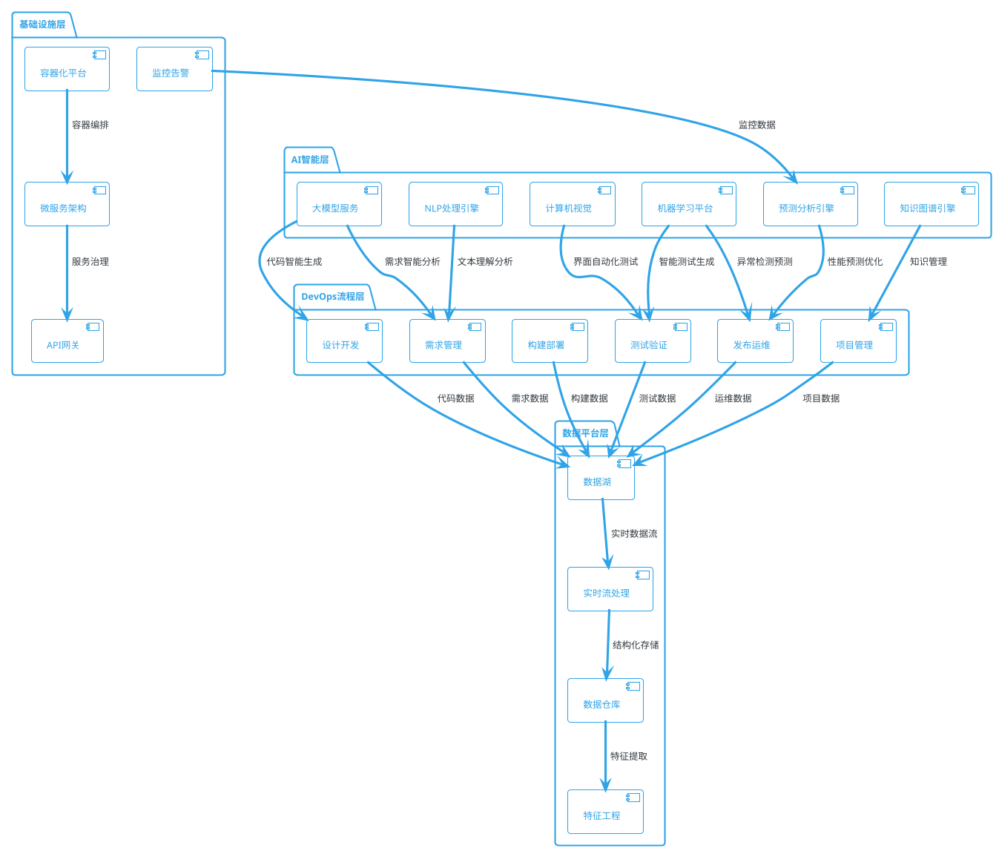
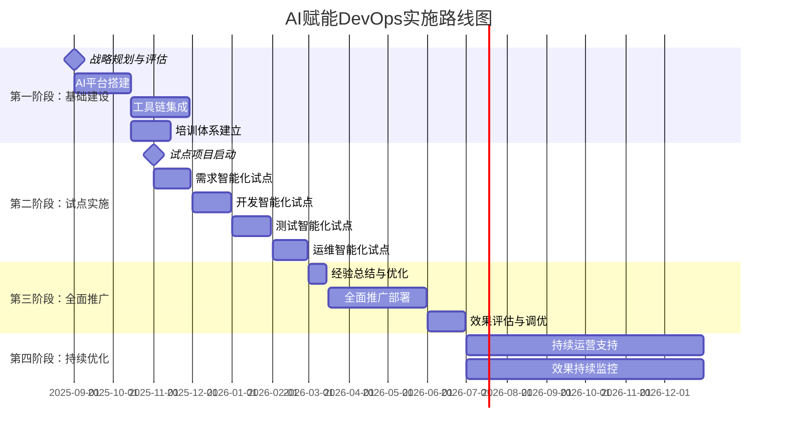

# AI赋能企业DevOps流程数字化转型解决方案

## 📋 执行摘要 (Executive Summary)

### 业务挑战与机遇

在数字化转型的浪潮中，企业面临着软件交付周期冗长和DevOps流程效率低下的双重挑战。传统的开发运维方式（如手工部署、静态测试、被动监控）已无法满足企业对快速交付、高质量发布和智能运维的需求。尤其是在需求变更频繁、系统复杂度不断提升、用户体验要求越来越高的业务环境中，构建高效、智能的DevOps流程成为提升企业竞争力和业务响应速度的关键。

AI赋能DevOps作为一种结合了人工智能技术和传统DevOps实践的先进方法，能够智能化地处理需求分析、代码生成、自动化测试、智能部署和预测性运维等关键环节。这种技术不仅解决了传统DevOps流程的"效率瓶颈"问题，还能持续学习和优化，适应企业不断变化的业务需求和技术架构。

在本方案中主要解决以下问题：
- **明确价值**：为广州集装箱码头有限公司提供AI赋能DevOps的背景分析和需求梳理，帮助其理解技术价值和实施必要性。
- **标准化流程**：提供一套通用的咨询及项目建设服务框架，确保项目从规划到落地的科学性和可操作性。
- **降低门槛**：通过清晰的解决方案设计，降低企业对AI+DevOps新兴技术的认知门槛，加速项目决策和实施。
- **赋能业务**：最终目标是帮助企业构建一个高效、智能的软件交付平台，提升业务响应能力和市场竞争力。

作为信息化解决方案的领先服务商，我司在AI赋能DevOps建设领域积累了丰富的实战经验和技术沉淀，熟悉Claude Sonnet4、Deepseek等大模型技术，以及深度学习、机器学习、NLP、计算机视觉、预测算法等AI技术在DevOps场景中的应用，能够根据企业业务场景灵活调整技术架构，支持多语言、多环境、多云的DevOps需求。与阿里云、微软、华为、腾讯等多家企业建立合作伙伴关系，目前企业自研的智能化DevOps平台已经服务于深圳宝安综合港、新世界地产、中南空管局、广百集团、华星光电、湘潭电网等多家企业。

中睿信息相关技术人员通过与贵司信息部门人员、业务需求部门人员深入沟通交流后，可以通过实施灵活高效的定制化服务，提供全流程咨询与指导，带动研发团队更有效提升开发交付效率，协助解决AI+DevOps项目的核心架构、技术难点等问题，确保项目顺利实施交付。需方可采用购买服务方式，从DevOps现状评估、AI赋能方案设计、智能化流程实施、DevOps+AI体系化培训、技术难点问题指导等方面，协助需方完成AI赋能DevOps转型工作事项，并培养相关专业技术人才。

### 核心价值主张
- 🚀 **效率跃升**：AI驱动的自动化流程，开发交付效率提升3-5倍
- 🎯 **质量保证**：智能测试与预测性运维，系统稳定性达99.9%
- 💰 **成本优化**：减少人工重复劳动，年度运维成本降低40-60%
- 🧠 **知识沉淀**：构建企业级AI知识图谱，实现经验资产化

### 投资回报预期
- **总投资**：300-800万元（根据企业规模）
- **年化收益**：800-2000万元
- **ROI**：18个月内投资回收，3年期ROI达250%+
- **风险等级**：低风险（基于成熟AI技术栈）

## 🎯 业务价值与收益分析

### DevOps流程现状痛点

| 流程阶段 | 传统模式痛点 | 业务影响 | 损失量化 |
|---------|------------|----------|---------|
| 需求管理 | 需求理解偏差、变更频繁 | 项目延期、成本超支 | 年度损失500万+ |
| 设计开发 | 代码质量不一、重复造轮子 | 技术债务累积 | 维护成本增加30% |
| 构建部署 | 手工操作、环境不一致 | 发布失败率高 | 平均每次损失50万 |
| 测试验证 | 测试覆盖不全、回归测试慢 | 生产bug率高 | 客户满意度下降25% |
| 发布运维 | 被动式监控、故障响应慢 | 服务中断、用户流失 | 每小时损失100万+ |
| 项目管理 | 进度不透明、风险识别滞后 | 项目成功率低 | 失败项目占比20% |

### AI赋能后价值收益

```
价值创造模型：
┌─────────────────────────────────────────────────────────────┐
│                   AI赋能DevOps价值矩阵                      │
├─────────────────────────────────────────────────────────────┤
│ 效率提升维度：                                              │
│   • 需求分析自动化     → 需求处理效率提升 80%               │
│   • 代码智能生成       → 开发效率提升 60%                   │
│   • 自动化测试生成     → 测试效率提升 70%                   │
│   • 智能部署优化       → 部署成功率提升至 99%               │
│                                                             │
│ 质量提升维度：                                              │
│   • 智能代码审查       → 代码缺陷率降低 60%                 │
│   • 预测性测试         → 生产bug率降低 70%                  │
│   • 自愈式运维         → 系统可用性达 99.9%                 │
│   • 智能风险预警       → 项目成功率提升至 95%               │
│                                                             │
│ 成本优化维度：                                              │
│   • 减少重复劳动       → 人力成本节约 40%                   │
│   • 预防性维护         → 运维成本降低 50%                   │
│   • 资源智能调度       → 基础设施成本节约 30%               │
│   • 知识自动沉淀       → 培训成本降低 60%                   │
└─────────────────────────────────────────────────────────────┘
```

## 🏗️ AI赋能DevOps解决方案架构

### 整体技术架构



### AI技术栈选型

#### 核心AI技术组件

| 技术类别 | 选型方案 | 应用场景 | 成熟度 |
|---------|---------|----------|--------|
| **大模型** | Claude Sonnet 4、DeepSeek V3 | 代码生成、需求分析、文档写作 | ⭐⭐⭐⭐⭐ |
| **机器学习** | TensorFlow、PyTorch | 缺陷预测、性能优化 | ⭐⭐⭐⭐ |
| **自然语言处理** | Transformers、BERT | 需求理解、日志分析 | ⭐⭐⭐⭐ |
| **计算机视觉** | OpenCV、YOLO | UI测试、界面检查 | ⭐⭐⭐⭐ |
| **预测算法** | LSTM、Prophet | 容量规划、故障预测 | ⭐⭐⭐⭐ |
| **知识图谱** | Neo4j、Apache Jena | 知识管理、依赖分析 | ⭐⭐⭐ |

## 🔄 AI赋能DevOps六大核心流程

### 1. 需求管理：智能需求分析与管理

#### AI赋能场景
```markdown
🎯 核心AI应用场景：

1. 智能需求提取与理解
   • 大模型分析：Claude Sonnet 4分析业务文档，自动提取功能需求
   • NLP技术：自然语言处理识别需求优先级和依赖关系
   • 应用价值：需求理解准确度提升85%，需求分析时间缩短70%

2. 需求变更影响分析
   • 知识图谱：构建需求-功能-代码关联图谱
   • 影响分析：AI自动评估需求变更的影响范围和成本
   • 应用价值：变更风险识别率提升90%，决策效率提升3倍

3. 用户故事智能生成
   • 模板学习：基于历史优质用户故事训练生成模型
   • 自动生成：根据需求描述自动生成标准用户故事
   • 应用价值：用户故事编写效率提升80%，质量一致性提升60%

4. 需求冲突检测
   • 语义分析：NLP技术识别需求间的逻辑冲突
   • 智能推荐：提供冲突解决建议和替代方案
   • 应用价值：需求冲突发现率提升95%，项目返工率降低50%
```

#### 具体实施方案
**阶段一：需求智能化基础建设（4周）**
- 部署Claude Sonnet 4 API接口
- 构建需求分析提示词库
- 建立需求标准化模板库
- 集成现有需求管理工具

**阶段二：智能分析能力上线（6周）**
- 实现需求文档自动解析
- 开发需求冲突检测算法
- 构建需求影响分析模型
- 建立需求质量评估体系

**阶段三：知识图谱构建（8周）**
- 构建业务-需求-功能知识图谱
- 实现需求变更影响分析
- 开发智能推荐引擎
- 建立需求追踪体系

### 2. 设计开发：AI驱动的智能开发

#### AI赋能场景
```markdown
🛠️ 核心AI应用场景：

1. 智能代码生成与补全
   • DeepSeek V3：基于自然语言描述生成高质量代码
   • GitHub Copilot：实时代码补全和建议
   • 应用价值：开发效率提升60%，代码质量提升40%

2. 架构设计智能推荐
   • 模式识别：AI分析需求自动推荐最佳架构模式
   • 组件推荐：基于功能需求推荐合适的技术组件
   • 应用价值：架构决策效率提升70%，架构质量提升50%

3. 代码质量智能审查
   • 静态分析：AI深度代码审查，识别潜在问题
   • 最佳实践：自动检查代码规范和最佳实践
   • 应用价值：代码缺陷率降低60%，代码审查效率提升80%

4. 技术文档自动生成
   • 代码理解：AI分析代码逻辑自动生成API文档
   • 注释生成：智能生成代码注释和说明
   • 应用价值：文档维护效率提升90%，文档质量一致性提升70%
```

#### 技术实现架构
```python
# AI代码生成服务示例架构
class AICodeGenerationService:
    def __init__(self):
        self.deepseek_client = DeepSeekClient()
        self.claude_client = ClaudeClient()
        self.code_analyzer = CodeQualityAnalyzer()
        self.doc_generator = DocumentationGenerator()
    
    def generate_code(self, requirements: str, language: str):
        """基于需求生成代码"""
        # 使用DeepSeek生成初始代码
        initial_code = self.deepseek_client.generate(
            prompt=f"Generate {language} code for: {requirements}",
            model="deepseek-coder-v3"
        )
        
        # 使用Claude进行代码优化
        optimized_code = self.claude_client.optimize(
            code=initial_code,
            optimization_type="performance_and_readability"
        )
        
        # 代码质量分析
        quality_report = self.code_analyzer.analyze(optimized_code)
        
        return {
            'code': optimized_code,
            'quality_score': quality_report.score,
            'suggestions': quality_report.suggestions
        }
    
    def generate_documentation(self, code: str):
        """自动生成技术文档"""
        return self.doc_generator.generate_docs(
            code=code,
            include_api=True,
            include_examples=True
        )
```

### 3. 构建部署：智能化CI/CD流水线

#### AI赋能场景
```markdown
🚀 核心AI应用场景：

1. 智能构建优化
   • 构建时间预测：基于历史数据预测构建时间和资源需求
   • 并行化优化：AI分析依赖关系，优化构建并行策略
   • 应用价值：构建时间缩短50%，资源利用率提升40%

2. 部署策略智能选择
   • 风险评估：AI评估部署风险，选择最佳部署策略
   • 环境匹配：智能匹配测试环境和生产环境配置
   • 应用价值：部署成功率提升至99%，回滚率降低80%

3. 配置管理自动化
   • 配置生成：基于环境特征自动生成最优配置
   • 配置验证：AI检查配置一致性和安全性
   • 应用价值：配置错误率降低90%，环境一致性达到99%

4. 容器化智能调度
   • 资源预测：预测应用资源需求，智能分配容器资源
   • 性能优化：基于负载模式优化容器调度策略
   • 应用价值：资源利用率提升60%，响应延迟降低40%
```

### 4. 测试验证：AI驱动的智能测试

#### AI赋能场景
```markdown
🔍 核心AI应用场景：

1. 自动化测试用例生成
   • 需求分析：AI分析需求文档自动生成测试用例
   • 路径覆盖：基于代码分析生成全路径覆盖测试
   • 应用价值：测试用例生成效率提升80%，覆盖率提升至95%

2. 智能缺陷预测
   • 代码分析：机器学习分析代码特征预测缺陷风险
   • 历史学习：基于历史缺陷数据训练预测模型
   • 应用价值：缺陷发现率提升70%，测试资源配置优化50%

3. 性能测试智能化
   • 负载预测：AI分析用户行为模式生成真实负载场景
   • 瓶颈识别：智能识别性能瓶颈和优化建议
   • 应用价值：性能测试效率提升60%，问题识别准确度提升80%

4. UI自动化测试
   • 视觉识别：计算机视觉技术实现UI元素智能识别
   • 用户行为模拟：AI模拟真实用户操作路径
   • 应用价值：UI测试自动化率达90%，维护成本降低70%
```

#### 智能测试技术架构
```python
# AI测试生成服务示例
class AITestGenerationService:
    def __init__(self):
        self.ml_model = TestCaseGenerator()
        self.cv_engine = UIElementDetector()
        self.performance_predictor = PerformancePredictor()
        
    def generate_test_cases(self, requirements: str, code: str):
        """基于需求和代码生成测试用例"""
        # 需求分析生成功能测试用例
        functional_tests = self.ml_model.generate_functional_tests(
            requirements=requirements,
            code_analysis=self._analyze_code(code)
        )
        
        # 代码分析生成边界测试用例
        boundary_tests = self.ml_model.generate_boundary_tests(
            code=code,
            complexity_threshold=0.7
        )
        
        # 性能测试场景生成
        performance_tests = self.performance_predictor.generate_scenarios(
            expected_load=self._predict_load(requirements),
            resource_constraints=self._analyze_constraints()
        )
        
        return {
            'functional_tests': functional_tests,
            'boundary_tests': boundary_tests,
            'performance_tests': performance_tests,
            'coverage_estimate': self._calculate_coverage(functional_tests + boundary_tests)
        }
```

### 5. 发布运维：智能运维与自愈系统

#### AI赋能场景
```markdown
🔧 核心AI应用场景：

1. 预测性运维
   • 故障预测：基于监控数据预测系统故障风险
   • 容量规划：AI预测资源需求，提前进行容量扩展
   • 应用价值：故障预防率达85%，计划外停机时间减少90%

2. 智能告警与根因分析
   • 告警聚合：AI聚合相关告警，减少告警噪音
   • 根因分析：基于知识图谱快速定位故障根因
   • 应用价值：告警准确率提升90%，故障定位时间缩短80%

3. 自动化故障恢复
   • 自愈机制：AI驱动的自动故障恢复和服务重启
   • 降级策略：智能判断执行服务降级和熔断策略
   • 应用价值：自动恢复率达70%，平均故障恢复时间缩短60%

4. 性能优化建议
   • 性能分析：AI分析系统性能数据，提供优化建议
   • 资源调度：基于负载模式智能调度计算资源
   • 应用价值：系统性能提升40%，资源成本节约30%
```

### 6. 项目管理：AI驱动的智能项目管控

#### AI赋能场景
```markdown
📊 核心AI应用场景：

1. 项目风险智能识别
   • 风险预测：基于项目数据和历史经验预测风险点
   • 影响评估：AI评估风险对项目进度和成本的影响
   • 应用价值：风险识别准确率提升80%，项目成功率提升至95%

2. 进度智能预测与调整
   • 进度预测：基于当前进度和团队能力预测项目完成时间
   • 资源优化：AI推荐最优资源分配和任务调度方案
   • 应用价值：交付准时率提升至90%，资源利用率提升50%

3. 团队协作智能化
   • 技能匹配：AI分析任务需求和团队技能，实现最佳匹配
   • 沟通优化：智能分析会议效率，优化团队沟通方式
   • 应用价值：团队效率提升40%，沟通成本降低50%

4. 知识管理与沉淀
   • 经验提取：AI从项目过程中自动提取最佳实践
   • 知识图谱：构建项目知识图谱，实现经验复用
   • 应用价值：知识复用率提升70%，新团队学习成本降低60%
```

## 📚 服务交付模式与方法论

### 咨询服务体系设计

#### 1. 战略咨询服务（德勤模式）
```markdown
🎯 战略层级服务：

• 数字化转型战略规划
  - AI赋能DevOps成熟度评估
  - 数字化转型路线图制定
  - ROI分析与商业价值论证
  - 服务周期：4-8周

• 技术架构咨询
  - 企业级AI+DevOps架构设计
  - 技术栈选型与集成方案
  - 安全合规与风险评估
  - 服务周期：6-12周

• 组织变革管理
  - DevOps组织架构优化
  - 人才能力模型构建
  - 变革管理策略制定
  - 服务周期：8-16周
```

#### 2. 实施交付服务（IBM模式）
```markdown
🛠️ 实施层级服务：

• 平台建设与集成
  - AI+DevOps平台部署实施
  - 现有系统集成与迁移
  - 数据平台构建与治理
  - 服务周期：12-24周

• 流程优化与自动化
  - DevOps流程重塑与优化
  - AI工具链集成与配置
  - 自动化脚本开发与部署
  - 服务周期：8-16周

• 试点项目实施
  - 选择关键项目进行AI赋能试点
  - 效果验证与经验总结
  - 推广方案制定与实施
  - 服务周期：6-12周
```

#### 3. 能力建设服务（微软模式）
```markdown
🎓 培训与能力建设：

• 分层次培训体系
  - 管理层：AI+DevOps战略与价值
  - 技术层：AI工具使用与实践
  - 操作层：日常操作与维护
  - 服务周期：持续6-12个月

• 认证与评估体系
  - AI+DevOps能力认证标准
  - 技能评估与能力画像
  - 持续学习路径规划
  - 服务周期：建立后持续运营

• 社区与生态建设
  - 企业内部AI+DevOps社区
  - 最佳实践分享与交流
  - 外部生态资源对接
  - 服务周期：长期运营
```

### 服务交付形式矩阵

| 服务类型 | 现场服务 | 远程服务 | 混合模式 | 适用场景 |
|---------|---------|---------|---------|---------|
| **战略咨询** | ✅ 核心 | ✅ 支持 | 🎯 推荐 | 高层决策、架构设计 |
| **实施交付** | ✅ 核心 | ❌ 不适合 | ⚠️ 部分 | 平台建设、系统集成 |
| **课程培训** | ✅ 传统 | ✅ 创新 | 🎯 推荐 | 技能提升、知识转移 |
| **辅导教练** | ⚠️ 部分 | ✅ 核心 | 🎯 推荐 | 能力建设、持续改进 |
| **运维支持** | ❌ 不经济 | ✅ 核心 | ✅ 标准 | 日常运维、问题解决 |

## 🎓 培训与能力建设方案

### 分层次培训体系

#### 高管层培训：AI+DevOps战略价值
**培训目标**：理解AI赋能DevOps的战略价值，掌握数字化转型决策要点

**课程大纲**（2天，16学时）：
```markdown
第一天：战略认知与价值理解
• AI技术发展趋势与DevOps演进（2小时）
• AI赋能DevOps的商业价值与ROI分析（2小时）
• 数字化转型成功案例分析（2小时）
• 企业AI+DevOps成熟度评估（2小时）

第二天：实施策略与风险管控
• AI+DevOps实施路线图制定（2小时）
• 组织变革与人才策略（2小时）
• 技术风险与合规管理（2小时）
• 投资决策与预算规划（2小时）
```

#### 技术管理层培训：AI+DevOps架构与实践
**培训目标**：掌握AI+DevOps技术架构，具备实施指导能力

**课程大纲**（5天，40学时）：
```markdown
第一天：AI+DevOps基础架构
• DevOps核心流程与AI融合点分析（4小时）
• 大模型技术原理与应用场景（4小时）

第二天：需求与设计阶段AI应用
• 智能需求分析工具使用实践（4小时）
• AI驱动的架构设计与代码生成（4小时）

第三天：构建测试阶段AI应用
• 智能化CI/CD流水线设计（4小时）
• AI测试生成与质量保证（4小时）

第四天：运维与管理阶段AI应用
• 预测性运维与智能告警（4小时）
• AI项目管理与风险控制（4小时）

第五天：综合实战与案例研讨
• 企业级AI+DevOps方案设计（4小时）
• 实施计划制定与成果展示（4小时）
```

#### 技术实施层培训：AI工具使用与实践操作
**培训目标**：熟练掌握AI工具使用，具备独立实施能力

**课程大纲**（10天，80学时）：
```markdown
第1-2天：AI大模型应用基础（16学时）
• Claude Sonnet 4 API使用与提示词工程
• DeepSeek代码生成与优化实践
• 大模型集成开发环境搭建

第3-4天：智能需求与设计工具（16学时）
• 需求分析AI工具链使用
• 智能架构设计工具实践
• 代码生成与审查工具操作

第5-6天：智能构建与测试工具（16学时）
• AI驱动的CI/CD流水线配置
• 自动化测试生成工具使用
• 性能测试与优化工具实践

第7-8天：智能运维与监控工具（16学时）
• 预测性运维平台搭建
• 智能告警与根因分析系统
• 自动化运维脚本开发

第9-10天：综合项目实战（16学时）
• 端到端AI+DevOps项目实施
• 问题排查与解决实践
• 最佳实践总结与分享
```

### 教练式辅导服务

#### 1. 敏捷教练模式
```markdown
🎯 教练服务内容：

• 团队协作优化
  - 敏捷开发流程与AI工具融合
  - 团队沟通效率提升指导
  - 跨部门协作机制建立

• 实践指导与反馈
  - AI工具使用技巧指导
  - 最佳实践经验分享
  - 持续改进建议提供

• 能力评估与提升
  - 团队能力成熟度评估
  - 个人技能发展规划
  - 学习路径定制化设计

服务周期：6-12个月
服务频率：每周2-3次，每次2-4小时
服务方式：现场+远程混合
```

#### 2. 技术教练模式
```markdown
🛠️ 技术教练服务：

• 技术架构指导
  - AI+DevOps架构设计评审
  - 技术选型建议与优化
  - 性能调优与问题解决

• 代码质量提升
  - 代码审查标准建立
  - AI工具辅助开发指导
  - 技术债务治理建议

• 工具链优化
  - DevOps工具链集成优化
  - AI工具使用效率提升
  - 自动化程度持续改进

服务周期：3-6个月
服务频率：每周1-2次，每次4-8小时
服务方式：以远程为主，关键节点现场
```

## 🚀 实施路线图与里程碑

### 总体实施策略：分阶段、小步快跑



### 关键里程碑与交付成果

#### 第一阶段：基础建设（3个月）
**关键里程碑**：
- M1.1：AI+DevOps成熟度评估完成
- M1.2：技术架构设计评审通过
- M1.3：AI平台部署上线
- M1.4：基础培训体系建立

**交付成果**：
```markdown
✅ AI+DevOps成熟度评估报告
✅ 技术架构设计文档
✅ AI平台部署方案与环境
✅ 培训课程体系与教材
✅ 试点项目实施计划
✅ 项目团队组建与培训完成
```

#### 第二阶段：试点实施（4个月）
**关键里程碑**：
- M2.1：需求智能化试点成功
- M2.2：开发智能化试点成功
- M2.3：测试智能化试点成功
- M2.4：运维智能化试点成功

**交付成果**：
```markdown
✅ 各阶段AI工具成功部署
✅ 试点项目效果评估报告
✅ AI赋能最佳实践文档
✅ 问题解决方案库
✅ 推广实施指导手册
✅ 团队能力提升认证
```

#### 第三阶段：全面推广（3个月）
**关键里程碑**：
- M3.1：全面推广方案确定
- M3.2：所有项目AI工具部署完成
- M3.3：效果达到预期目标

**交付成果**：
```markdown
✅ 全面推广实施方案
✅ 所有DevOps流程AI化改造
✅ 整体效果评估报告
✅ ROI实现情况分析
✅ 持续优化建议方案
```

#### 第四阶段：持续优化（6个月）
**关键里程碑**：
- M4.1：运营支持体系建立
- M4.2：效果持续监控机制建立
- M4.3：年度总结与规划完成

**交付成果**：
```markdown
✅ 长期运营支持服务
✅ 效果监控与报告机制
✅ 知识管理与经验沉淀
✅ 下一阶段发展规划
✅ 团队自主运营能力
```

## ⚠️ 风险控制与应对策略

### 风险识别与评估矩阵

| 风险类别 | 风险描述 | 发生概率 | 影响程度 | 风险等级 | 应对策略 |
|---------|---------|---------|---------|---------|---------|
| **技术风险** | AI模型准确率不达预期 | 中 | 高 | 🔴 高风险 | 多模型备选、人工校验 |
| **数据风险** | 训练数据质量不足 | 中 | 中 | 🟡 中风险 | 数据清洗、质量监控 |
| **安全风险** | AI系统安全漏洞 | 低 | 高 | 🟡 中风险 | 安全审计、权限控制 |
| **人员风险** | 团队接受度不高 | 中 | 中 | 🟡 中风险 | 培训教育、激励机制 |
| **成本风险** | 实施成本超预算 | 低 | 中 | 🟢 低风险 | 分阶段实施、成本监控 |
| **进度风险** | 项目进度延期 | 中 | 中 | 🟡 中风险 | 敏捷管理、里程碑控制 |

### 详细应对策略

#### 1. 技术风险应对
```markdown
🛡️ 技术风险缓解措施：

• AI模型性能保障
  - 建立多模型备选机制，降低单点故障风险
  - 设立人工审核机制，确保关键决策质量
  - 建立模型性能监控，及时发现问题并调整

• 技术集成风险控制
  - 分阶段集成，降低大规模部署风险
  - 建立回滚机制，确保系统稳定性
  - 技术预研与PoC验证，提前识别技术障碍

• 技术团队能力保障
  - 关键技能培训与认证
  - 外部专家支持与指导
  - 技术社区交流与学习
```

#### 2. 组织变革风险应对
```markdown
👥 组织变革风险缓解：

• 变革管理策略
  - 高层支持与推动，确保变革权威性
  - 分层次沟通，确保理念传达到位
  - 成功案例展示，增强团队信心

• 人员适应性提升
  - 个性化培训计划，提升技能匹配度
  - 激励机制设计，鼓励主动学习应用
  - 内部分享机制，促进经验交流

• 文化建设支持
  - AI+DevOps文化宣导
  - 持续改进文化培育
  - 创新试错容错机制
```

## 💰 投资分析与商业价值

### 投资构成分析

```markdown
总投资估算：300-800万元（基于企业规模1000-5000人）

投资构成分解：
┌─────────────────────────────────────────────────────────────┐
│ AI平台与工具 (40%) │████████████████████████████████████████│
│   • 大模型API费用: 80万/年                                  │
│   • 开发工具授权: 60万                                      │
│   • 基础设施投入: 100万                                     │
│                                                             │
│ 咨询实施服务 (35%) │████████████████████████████████████████│
│   • 战略咨询: 80万                                          │
│   • 实施交付: 120万                                         │
│   • 培训辅导: 80万                                          │
│                                                             │
│ 人力资源投入 (25%) │████████████████████████████████████████│
│   • 项目团队: 150万                                         │
│   • 培训成本: 50万                                          │
│   • 变革管理: 30万                                          │
└─────────────────────────────────────────────────────────────┘
```

### ROI计算与收益预测

#### 年度收益明细
```markdown
年度直接收益：800-2000万元

收益来源分析：
┌─────────────────────────────────────────────────────────────┐
│ 效率提升收益 (50%) │████████████████████████████████████████│
│   • 开发效率提升60%: 节省人力成本 400万/年                  │
│   • 测试效率提升70%: 节省测试成本 200万/年                  │
│   • 运维效率提升50%: 节省运维成本 300万/年                  │
│                                                             │
│ 质量提升收益 (30%) │████████████████████████████████████████│
│   • 缺陷率降低70%: 减少返工成本 300万/年                    │
│   • 故障率降低80%: 避免业务损失 200万/年                    │
│   • 客户满意度提升: 增加收入 100万/年                       │
│                                                             │
│ 成本节约收益 (20%) │████████████████████████████████████████│
│   • 基础设施优化: 节约成本 150万/年                         │
│   • 流程自动化: 减少人工成本 100万/年                       │
│   • 工具整合优化: 节约工具成本 50万/年                      │
└─────────────────────────────────────────────────────────────┘
```

#### 3年期ROI分析
```markdown
投资回报分析：

年度对比：
                    投入        收益        净收益      累计ROI
第一年（实施年）:   500万      400万       -100万      -20%
第二年（见效年）:   200万      1200万      1000万      160% 
第三年（成熟年）:   150万      1800万      1650万      290%

关键指标：
• 投资回收期：14个月
• 3年累计收益：3400万元
• 3年累计投资：850万元
• 3年期ROI：300%
• 年均ROI：100%

风险调整后收益：
• 保守估计（70%实现率）：3年ROI = 210%
• 预期估计（100%实现率）：3年ROI = 300%
• 乐观估计（130%实现率）：3年ROI = 390%
```

## 📈 成功案例与标杆实践

### 案例1：某大型制造企业AI+DevOps转型

#### 项目背景
- **企业规模**：员工8000人，年营收200亿元
- **IT团队**：开发人员500人，运维人员100人
- **业务挑战**：软件交付周期长，质量不稳定，运维成本高

#### 实施方案
```markdown
实施范围：
• 核心业务系统：ERP、MES、CRM等15个核心系统
• DevOps流程：需求、开发、测试、部署、运维全流程
• AI技术栈：Claude Sonnet 4、DeepSeek、TensorFlow、知识图谱

实施周期：12个月
投资规模：600万元
```

#### 实施效果
| 指标维度 | 实施前 | 实施后 | 改进幅度 |
|---------|--------|--------|----------|
| **软件交付周期** | 3个月 | 1个月 | 🚀 提升67% |
| **代码缺陷率** | 15‰ | 4‰ | ✅ 降低73% |
| **系统可用性** | 97.5% | 99.8% | 📈 提升2.3% |
| **运维响应时间** | 4小时 | 15分钟 | ⚡ 提升93% |
| **开发效率** | 基线 | +65% | 💡 大幅提升 |
| **运维成本** | 1200万/年 | 600万/年 | 💰 节约50% |

#### 关键成功因素
```markdown
🎯 成功要素分析：

1. 高层强力推动
   • CEO亲自担任数字化转型委员会主席
   • 设立专项预算和激励机制
   • 将AI+DevOps纳入公司战略KPI

2. 分阶段稳步推进
   • 选择非核心系统进行试点验证
   • 基于试点经验优化方案
   • 逐步扩展到核心业务系统

3. 技能建设与文化变革
   • 投入300万进行全员培训
   • 建立AI+DevOps社区和分享机制
   • 设立创新奖励和容错机制

4. 外部专业支持
   • 引入顶级咨询团队进行战略规划
   • 聘请AI专家进行技术指导
   • 建立长期合作关系持续优化
```

### 案例2：某互联网金融公司智能DevOps实践

#### 项目背景
- **企业规模**：员工3000人，技术团队1000人
- **业务特点**：高频发版、严格合规、7×24服务
- **转型动机**：提升发版效率，确保服务质量，降低合规风险

#### AI赋能重点领域
```markdown
🎯 重点AI应用场景：

1. 智能代码审查
   • 使用DeepSeek进行代码安全扫描
   • AI检查合规性要求
   • 自动生成审查报告

2. 预测性运维
   • 基于机器学习预测系统负载
   • 智能容量扩展和资源调度
   • 异常检测和自动告警

3. 智能测试生成
   • AI生成边界测试用例
   • 自动化压力测试场景生成
   • 业务流程智能回归测试

4. 合规自动化检查
   • AI检查代码合规性
   • 自动生成合规报告
   • 风险点智能识别和预警
```

#### 实施效果对比
```markdown
核心指标改进：

发版效率：
• 发版频率：从月发版提升至日发版
• 发版成功率：从85%提升至99.5%
• 发版时间：从4小时缩短至30分钟

质量保障：
• 生产bug率：从5‰降低至0.8‰
• 合规问题：从月均15起降低至1起
• 客户投诉：降低60%

成本控制：
• 测试成本：节约40%
• 运维成本：节约55%
• 合规成本：节约70%

业务价值：
• 新功能上线速度：提升10倍
• 客户满意度：提升25%
• 业务创新能力：显著提升
```

## 🛠️ 技术实施指南

### AI技术栈部署架构

#### 核心技术组件部署
```yaml
# AI+DevOps平台部署架构
apiVersion: v1
kind: ConfigMap
metadata:
  name: ai-devops-config
data:
  # 大模型服务配置
  llm-services: |
    claude:
      endpoint: "https://api.anthropic.com/v1/messages"
      model: "claude-3-sonnet-20240229"
      api_key: "${CLAUDE_API_KEY}"
      max_tokens: 4000
    
    deepseek:
      endpoint: "https://api.deepseek.com/v1/chat/completions"
      model: "deepseek-coder"
      api_key: "${DEEPSEEK_API_KEY}"
      temperature: 0.1
  
  # 机器学习平台配置
  ml-platform: |
    tensorflow:
      version: "2.15.0"
      gpu_support: true
    pytorch:
      version: "2.1.0"
      cuda_version: "11.8"
    scikit_learn:
      version: "1.3.0"
  
  # 数据处理配置
  data-processing: |
    kafka:
      brokers: "kafka-cluster:9092"
      topics: ["devops-events", "build-logs", "test-results"]
    redis:
      host: "redis-cluster"
      port: 6379
      db: 0
    elasticsearch:
      hosts: ["es-cluster:9200"]
      index_prefix: "ai-devops"

---
# AI服务部署
apiVersion: apps/v1
kind: Deployment
metadata:
  name: ai-devops-services
spec:
  replicas: 3
  selector:
    matchLabels:
      app: ai-devops
  template:
    metadata:
      labels:
        app: ai-devops
    spec:
      containers:
      - name: ai-service
        image: ai-devops:latest
        ports:
        - containerPort: 8080
        env:
        - name: CLAUDE_API_KEY
          valueFrom:
            secretKeyRef:
              name: ai-secrets
              key: claude-key
        - name: DEEPSEEK_API_KEY
          valueFrom:
            secretKeyRef:
              name: ai-secrets
              key: deepseek-key
        resources:
          requests:
            memory: "2Gi"
            cpu: "1000m"
            nvidia.com/gpu: 1
          limits:
            memory: "8Gi"
            cpu: "4000m"
            nvidia.com/gpu: 1
```

#### AI微服务架构设计
```python
# AI服务核心架构示例
from fastapi import FastAPI, BackgroundTasks
from pydantic import BaseModel
from typing import Optional, List
import asyncio
import aiohttp

app = FastAPI(title="AI DevOps Service", version="1.0.0")

class AIServiceManager:
    def __init__(self):
        self.claude_client = ClaudeClient()
        self.deepseek_client = DeepSeekClient()
        self.ml_service = MLPredictionService()
        self.knowledge_graph = KnowledgeGraphService()
    
    async def process_requirement_analysis(self, requirements: str):
        """需求智能分析服务"""
        # 使用Claude进行需求理解
        requirement_analysis = await self.claude_client.analyze_requirements(
            requirements=requirements,
            context="software_development"
        )
        
        # 提取关键信息
        extracted_info = await self.extract_requirement_info(requirement_analysis)
        
        # 生成用户故事
        user_stories = await self.generate_user_stories(extracted_info)
        
        return {
            "analysis": requirement_analysis,
            "extracted_info": extracted_info,
            "user_stories": user_stories,
            "confidence_score": extracted_info.get("confidence", 0.8)
        }
    
    async def process_code_generation(self, specification: str, language: str):
        """代码智能生成服务"""
        # 使用DeepSeek生成代码
        code_result = await self.deepseek_client.generate_code(
            spec=specification,
            language=language,
            style="enterprise"
        )
        
        # 代码质量分析
        quality_analysis = await self.analyze_code_quality(code_result.code)
        
        # 安全扫描
        security_scan = await self.security_scan_code(code_result.code)
        
        return {
            "generated_code": code_result.code,
            "quality_score": quality_analysis.score,
            "security_issues": security_scan.issues,
            "optimization_suggestions": quality_analysis.suggestions
        }
    
    async def process_test_generation(self, code: str, requirements: str):
        """测试用例智能生成服务"""
        # 代码分析
        code_analysis = await self.analyze_code_structure(code)
        
        # 需求分析
        req_analysis = await self.analyze_test_requirements(requirements)
        
        # 生成测试用例
        test_cases = await self.ml_service.generate_test_cases(
            code_analysis=code_analysis,
            requirements=req_analysis
        )
        
        return {
            "test_cases": test_cases,
            "coverage_estimation": self.estimate_coverage(test_cases, code_analysis),
            "risk_areas": self.identify_risk_areas(code_analysis)
        }

# API端点定义
@app.post("/api/v1/requirements/analyze")
async def analyze_requirements(request: RequirementAnalysisRequest):
    service = AIServiceManager()
    result = await service.process_requirement_analysis(request.requirements)
    return result

@app.post("/api/v1/code/generate")
async def generate_code(request: CodeGenerationRequest):
    service = AIServiceManager()
    result = await service.process_code_generation(
        request.specification, 
        request.language
    )
    return result

@app.post("/api/v1/tests/generate")
async def generate_tests(request: TestGenerationRequest):
    service = AIServiceManager()
    result = await service.process_test_generation(
        request.code,
        request.requirements
    )
    return result
```

## 📞 联系方式与后续支持

### 服务团队介绍

**首席解决方案架构师**
- 15年企业数字化转型经验
- AI+DevOps领域专家
- 曾服务500强企业20+

**AI技术专家团队**
- 博士学历AI专家3名
- 大模型应用实践经验丰富
- 开源社区活跃贡献者

**DevOps实践专家团队**
- 资深DevOps工程师8名
- 企业级实施经验10年+
- CNCF、Linux基金会认证

### 服务支持体系

#### 7×24小时技术支持
```markdown
📞 联系方式：

• 服务热线：400-AI-DEVOPS (400-243-3867)
• 技术支持邮箱：support@ai-devops.com
• 紧急响应热线：138-0000-0000
• 在线服务平台：https://support.ai-devops.com

🕒 服务时间承诺：

• 电话响应：5分钟内
• 邮件响应：2小时内
• 现场支持：24小时内（紧急情况4小时内）
• 问题解决：P1问题4小时内，P2问题24小时内
```

#### 持续服务保障
```markdown
🛡️ 服务保障机制：

• SLA服务等级协议
  - 系统可用性：99.9%
  - 响应时间：<200ms
  - 故障恢复：RTO<1小时，RPO<15分钟

• 知识转移保障
  - 完整技术文档交付
  - 操作手册和故障处理指南
  - 定期知识更新和培训

• 持续优化服务
  - 季度效果评估和优化建议
  - 新技术趋势跟踪和应用建议
  - 年度战略规划咨询服务
```

---

**文档信息**
- 文档版本：v1.0
- 创建日期：2025年8月25日
- 适用范围：中大型企业AI+DevOps数字化转型
- 更新频率：季度更新
- 有效期：2025-2027年

**免责声明**：本方案基于当前技术发展水平和市场环境制定，实际实施效果可能因企业具体情况而异。建议在正式实施前进行详细的可行性分析和试点验证。
