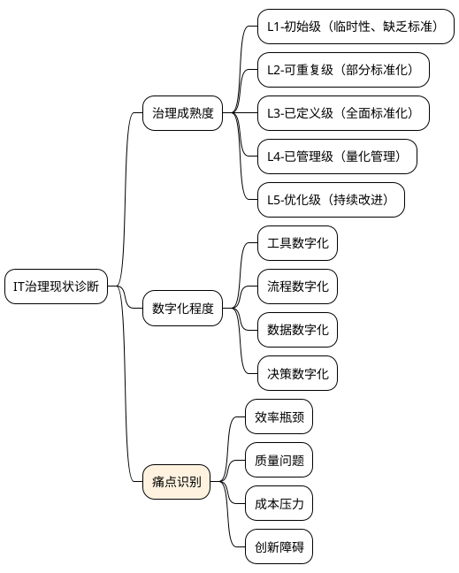
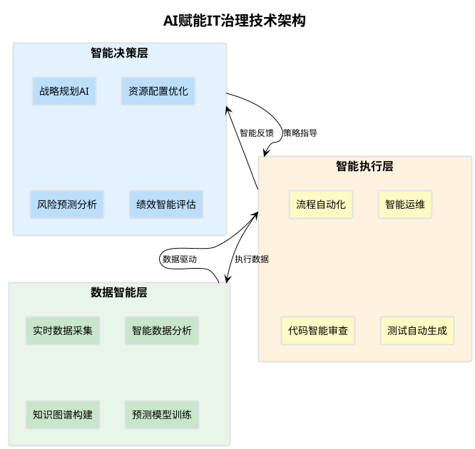
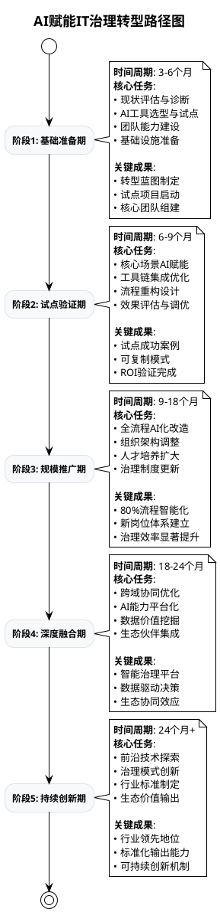
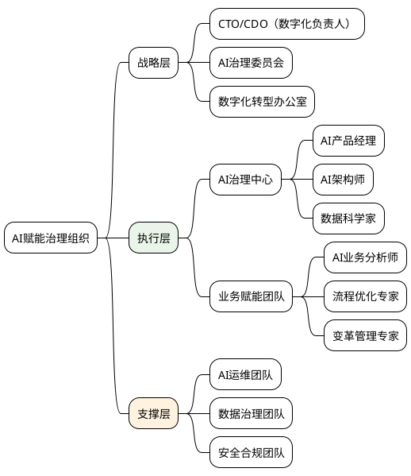
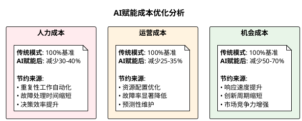
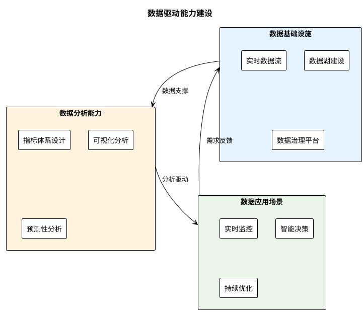

# AI赋能IT治理体系转型培训方案
## 企业战略层数智化转型一日课程

---

## 📋 课程基本信息

| 项目 | 内容 |
|------|------|
| **课程名称** | AI赋能IT治理体系转型：从传统治理到智能治理的战略路径 |
| **目标学员** | 企业高管、CTO、IT总监、业务部门负责人、数字化转型负责人 |
| **培训时长** | 1天（6小时，含休息） |
| **培训方式** | 理论讲授 + 案例分析 + 战略演练 + 行动计划 |
| **班级规模** | 20-30人 |

---

## 🎯 培训目标

### 知识目标
- 深入理解传统IT治理模式的特点与局限性
- 掌握AI赋能IT治理的核心理念与技术架构
- 明确企业数智化转型的战略路径与实施方法

### 能力目标
- 具备AI赋能IT治理的战略规划能力
- 掌握转型风险识别与应对策略
- 能够制定符合企业实际的数智化转型路线图

### 素养目标
- 培养数字化转型的战略思维
- 建立AI+治理的创新意识
- 提升变革领导力与执行力

---

## 📚 课程内容设计

### 🌅 **模块一：传统IT治理现状诊断**（90分钟）

#### 📊 1.1 传统IT治理模式深度剖析（30分钟）

**核心特点分析：**

| 治理维度 | 传统模式特征 | 核心挑战 |
|----------|--------------|----------|
| **治理架构** | 层级分明、职责固化 | 响应缓慢、协调困难 |
| **决策机制** | 经验驱动、委员会决策 | 主观性强、时效性差 |
| **流程管控** | 标准化、规范化 | 缺乏灵活性、适应性弱 |
| **风险管理** | 事后处理、合规导向 | 被动应对、预防不足 |
| **资源配置** | 基于预算、周期性调整 | 资源浪费、配置滞后 |

**优势与局限性对比：**

✅ **传统模式优势**
- 流程标准化程度高
- 合规性管控严格
- 风险防控体系完善
- 治理经验积累丰富

❌ **主要局限性**
- 决策响应周期长（周-月级）
- 数据驱动能力不足
- 创新适应性较差
- 人力资源依赖度高
- 预测性治理缺失

#### 🔍 1.2 企业IT治理现状自我诊断（30分钟）

**诊断维度与评估标准：**

**📋 现状诊断表**

| 评估项目 | 评分标准 | 自评分数 | 改进优先级 |
|----------|----------|----------|------------|
| 治理流程自动化程度 | 1-5分 | ___ | 高/中/低 |
| 数据驱动决策比例 | 1-5分 | ___ | 高/中/低 |
| IT服务响应速度 | 1-5分 | ___ | 高/中/低 |
| 创新项目成功率 | 1-5分 | ___ | 高/中/低 |
| 治理成本控制效果 | 1-5分 | ___ | 高/中/低 |

#### 💡 1.3 数智化转型的战略必要性（30分钟）

**市场驱动因素：**
- 💨 **业务敏捷性要求**：市场变化速度加快，要求IT治理更加敏捷
- 🚀 **技术创新压力**：新技术层出不穷，传统治理模式难以适应
- 📊 **数据价值挖掘**：数据成为核心资产，需要智能化治理手段
- 🎯 **用户体验升级**：客户期望更高，需要更快响应和更优服务

**转型价值预期：**
- ⚡ 治理效率提升：**200-300%**
- 🎯 决策准确率：**提升80%+**
- 💰 运营成本降低：**30-50%**
- 🚀 创新周期缩短：**50%+**

---

### 🤖 **模块二：AI赋能IT治理体系架构**（90分钟）

#### 🏗️ 2.1 AI赋能治理的技术架构（45分钟）

**三层智能治理架构：**

**核心AI技术应用：**

| AI技术 | 治理应用场景 | 核心价值 |
|--------|--------------|----------|
| **大语言模型** | 智能需求分析、文档生成、知识问答 | 理解能力↗️ 生成效率↗️ |
| **机器学习** | 异常检测、性能预测、资源优化 | 预测准确性↗️ 自动化程度↗️ |
| **知识图谱** | 治理知识管理、关系分析、智能推荐 | 知识复用↗️ 决策支持↗️ |
| **RPA+AI** | 流程自动化、智能审批、数据处理 | 执行效率↗️ 错误率↓ |

#### 🎯 2.2 智能治理的核心能力（45分钟）

**五大核心智能能力：**

##### 🧠 **1. 智能感知能力**
- **技术实现**：IoT传感器 + 日志分析 + API监控
- **应用价值**：7x24小时全方位系统状态感知
- **典型场景**：服务器性能实时监控、用户行为分析、安全威胁检测

##### 🔮 **2. 预测分析能力**  
- **技术实现**：时间序列分析 + 深度学习 + 统计模型
- **应用价值**：从被动响应转向主动预防
- **典型场景**：故障预测、容量规划、风险预警

##### 🤖 **3. 自动决策能力**
- **技术实现**：规则引擎 + 机器学习 + 专家系统
- **应用价值**：决策响应从小时级提升到秒级
- **典型场景**：自动扩缩容、智能告警、资源调度

##### 🔄 **4. 自适应优化能力**
- **技术实现**：强化学习 + 遗传算法 + A/B测试
- **应用价值**：系统持续自我学习和优化
- **典型场景**：流程优化、参数调优、策略迭代

##### 🧩 **5. 协同智能能力**
- **技术实现**：多智能体系统 + 协作算法
- **应用价值**：实现AI与人、AI与AI的协同工作
- **典型场景**：人机协作决策、跨系统智能协调

---

### 🚀 **模块三：数智化转型战略路径**（90分钟）

#### 🗺️ 3.1 五阶段转型路径设计（45分钟）

**转型总体路径图：**

**各阶段关键里程碑：**

| 转型阶段 | 核心目标 | 成功指标 | 风险控制点 |
|----------|----------|----------|------------|
| **基础准备期** | 奠定转型基础 | 试点项目启动率100% | 团队能力差距、工具选型失误 |
| **试点验证期** | 验证可行性 | ROI达到150%+ | 试点失败、阻力过大 |
| **规模推广期** | 扩大应用范围 | 流程智能化率80%+ | 推广阻力、人员适应性 |
| **深度融合期** | 实现系统优化 | 治理效率提升200%+ | 系统复杂度、集成风险 |
| **持续创新期** | 保持领先优势 | 持续创新能力建立 | 技术迭代、市场变化 |

#### ⚡ 3.2 关键转场点突破策略（45分钟）

**五大关键转场点深度解析：**

##### 🔧 **转场点1：流程AI赋能点设计**

**战略要点：**
- 🎯 **选择策略**：从效果显著、风险较低的场景开始
- 🛠️ **工具策略**：优先选择成熟度高、集成性好的AI工具
- 📊 **评估策略**：建立量化指标体系，持续跟踪效果

**典型应用场景：**

| 业务场景 | AI赋能方案 | 预期效果 | 实施难度 |
|----------|------------|----------|----------|
| **需求管理** | NLP需求分析 + 智能分类 | 分析效率↗️200% | ⭐⭐⭐ |
| **代码审查** | AI代码扫描 + 安全检测 | 发现率↗️300% | ⭐⭐ |
| **运维监控** | AIOps异常检测 + 自动处理 | 响应速度↗️100x | ⭐⭐⭐⭐ |
| **测试生成** | 智能用例生成 + 自动执行 | 测试覆盖率90%+ | ⭐⭐⭐ |

##### 💡 **转场点2：能力模型重塑**

**人才发展三重奏：**

1. **🎓 技能升级计划**
   - AI工具操作能力（Prompt工程、AI编程助手）
   - 数据分析思维（指标设计、趋势分析）
   - 智能协作能力（人机协作、跨域协调）

2. **🏅 认证体系建立**
   - 基础级：AI工具熟练使用
   - 进阶级：AI解决方案设计
   - 专家级：AI治理体系建设

3. **👥 梯队培养机制**
   - 种子选手：快速培养AI+治理复合人才
   - 普及推广：全员AI意识与基础技能
   - 外部合作：引入AI专家与咨询团队

##### 🏢 **转场点3：组织架构调整**

**新型组织模式设计：**

##### ⚙️ **转场点4：流程治理优化**

**智能治理闭环构建：**

1. **📊 数据驱动监控**：实时采集→智能分析→异常识别
2. **🤖 自动化响应**：规则引擎→自动处理→人工干预
3. **🔄 持续优化**：效果评估→模式调整→知识沉淀
4. **📈 价值量化**：KPI设计→ROI计算→价值展示

##### 🎖️ **转场点5：治理模式升级**

**从规则驱动到智能驱动：**

| 治理要素 | 传统模式 | AI赋能模式 | 升级策略 |
|----------|----------|------------|----------|
| **决策依据** | 经验+规则 | 数据+算法+专家智慧 | 建立数据决策流程 |
| **响应机制** | 被动处理 | 主动预测+实时响应 | 部署预测性分析 |
| **优化方式** | 周期性调整 | 持续学习+自适应 | 构建学习型系统 |
| **治理边界** | 部门内优化 | 跨域协同优化 | 打通数据孤岛 |

---

### 💎 **模块四：转型价值与成功要素**（90分钟）

#### 💰 4.1 转型价值量化分析（45分钟）

**价值创造四个维度：**

##### 📈 **效率价值**

**量化指标体系：**

| 效率指标 | 传统模式 | AI赋能模式 | 提升倍数 | 价值量化 |
|----------|----------|------------|----------|----------|
| **需求响应时间** | 2-5天 | 2-4小时 | 10-30x | 客户满意度↗️ |
| **故障处理时间** | 2-8小时 | 10-30分钟 | 5-20x | 业务连续性↗️ |
| **代码审查效率** | 2人日 | 0.5人日 | 4x | 开发效率↗️ |
| **运维自动化率** | 30% | 85% | 2.8x | 人力成本↓ |

**预期效率提升：整体效率提升200-300%**

##### 🎯 **质量价值**

**质量改进指标：**

- 🐛 **缺陷检出率**：从60% → 95%（提升58%）
- 🔒 **安全漏洞发现**：从事后发现 → 代码阶段预防
- 📊 **数据准确性**：从85% → 98%（提升15%）
- 🎯 **决策准确率**：从70% → 90%（提升29%）

**预期质量提升：整体质量指标提升50-80%**

##### 💰 **成本价值**

**成本优化分析：**

**预期成本节约：总体运营成本降低30-50%**

##### 🚀 **创新价值**

**创新能力提升：**

- ⚡ **产品上市时间**：缩短40-60%
- 🎯 **创新成功率**：从30% → 70%
- 🔄 **迭代周期**：从月级 → 周级
- 💡 **创新想法转化率**：提升200%

#### 🎯 4.2 成功关键要素分析（45分钟）

**六大成功要素深度解析：**

##### 🎓 **要素1：人才先行战略**

**人才发展三步走：**

1. **🌟 核心团队快速培养**（0-6个月）
   - 选拔高潜力员工组成AI治理种子队
   - 密集培训：AI工具+治理理念+实战演练
   - 建立导师制：外部专家+内部专家

2. **📚 全员能力普及提升**（6-18个月）
   - 分层培训：管理层+技术层+操作层
   - 学习路径：理论学习+工具实操+项目实战
   - 激励机制：技能认证+晋升通道+绩效奖励

3. **🏅 专家梯队持续建设**（18个月+）
   - 内培外引：培养内部专家+引进外部人才
   - 社区建设：AI治理实践社区+经验分享
   - 持续学习：前沿技术跟踪+最佳实践更新

##### 🛠️ **要素2：工具落地策略**

**工具选型与集成矩阵：**

| 工具类型 | 推荐工具 | 集成难度 | 应用优先级 | 投资回报周期 |
|----------|----------|----------|------------|--------------|
| **AI编程助手** | GitHub Copilot/CodeWhisperer | ⭐⭐ | 高 | 3个月 |
| **智能运维** | PagerDuty/Datadog+AI | ⭐⭐⭐ | 高 | 6个月 |
| **智能测试** | Test.ai/Applitools | ⭐⭐⭐ | 中 | 9个月 |
| **需求分析** | 自建NLP平台 | ⭐⭐⭐⭐ | 中 | 12个月 |
| **决策支持** | 商业智能平台+AI | ⭐⭐⭐⭐⭐ | 高 | 18个月 |

##### 📊 **要素3：数据驱动基础**

**数据能力建设路径：**

##### 🔄 **要素4：持续优化机制**

**PDCA持续改进环：**

- **📋 Plan（计划）**：设定AI治理目标 → 制定实施计划
- **🚀 Do（执行）**：按计划实施 → 收集执行数据
- **📊 Check（检查）**：效果评估 → 问题识别 → 经验总结
- **⚡ Act（改进）**：优化方案 → 标准化流程 → 推广应用

##### 🤝 **要素5：文化变革推动**

**文化变革四个层次：**

1. **💭 观念层**：从"工具思维"到"智能思维"
2. **🎯 价值层**：从"效率优先"到"价值创造"  
3. **🔄 行为层**：从"被动执行"到"主动优化"
4. **🏢 制度层**：从"规则约束"到"智能引导"

##### 🎖️ **要素6：领导力变革**

**数字化领导力模型：**

| 领导能力 | 传统领导力 | 数字化领导力 | 提升方法 |
|----------|------------|--------------|----------|
| **战略思维** | 基于经验预判 | 数据洞察+趋势预测 | 数据分析培训 |
| **决策能力** | 集体讨论决策 | AI辅助+快速决策 | 智能决策工具 |
| **创新推动** | 计划性创新 | 敏捷试错+快速迭代 | 精益创新方法 |
| **团队领导** | 层级式管理 | 网络化协作+赋能 | 协作平台应用 |

---

## 🎭 **实战演练：战略转型沙盘推演**（60分钟）

### 🎯 演练设计思路

**演练目标：**
- 模拟企业AI赋能IT治理转型全过程
- 体验各种转型挑战与应对策略
- 制定符合本企业实际的转型方案

### 🏢 演练背景设定

**虚拟企业：智联科技有限公司**

| 企业信息 | 详细描述 |
|----------|----------|
| **行业属性** | 制造业+数字化服务 |
| **企业规模** | 员工5000人，年收入50亿元 |
| **IT团队** | 技术人员300人，运维团队50人 |
| **业务特点** | 产品生命周期短，创新要求高 |
| **现状挑战** | 系统响应慢、故障频发、创新效率低 |

**关键业务系统：**
- 🏭 智能制造执行系统（MES）
- 📦 供应链管理平台（SCM）  
- 👥 客户关系管理系统（CRM）
- 💰 企业资源规划系统（ERP）

### 🎲 演练流程设计

#### 第一轮：现状诊断与目标设定（15分钟）

**小组任务：**
1. **现状评估**：使用诊断表评估企业当前IT治理水平
2. **问题识别**：列出TOP5核心问题及影响
3. **目标设定**：制定3年转型目标（定量+定性）

**输出成果：**
- 现状诊断报告
- 问题优先级排序
- 转型目标卡片

#### 第二轮：转型方案设计（20分钟）

**情境设置：**
智联科技董事会批准数字化转型预算2000万元，要求18个月内完成核心系统AI化改造。

**小组任务：**
1. **路径规划**：选择5阶段中的关键3个阶段进行详细设计
2. **资源分配**：预算分配、人力配置、时间安排
3. **风险应对**：识别TOP3风险点及应对措施

**决策工具：**

| 改造场景 | 投资成本 | 实施周期 | 技术难度 | 业务影响 | ROI预期 |
|----------|----------|----------|----------|----------|----------|
| **智能运维** | 300万 | 6个月 | ⭐⭐ | 低 | 250% |
| **代码AI审查** | 150万 | 3个月 | ⭐ | 低 | 400% |  
| **需求智能分析** | 500万 | 12个月 | ⭐⭐⭐⭐ | 中 | 200% |
| **供应链AI优化** | 800万 | 15个月 | ⭐⭐⭐⭐⭐ | 高 | 300% |
| **客服智能化** | 200万 | 4个月 | ⭐⭐ | 中 | 350% |

#### 第三轮：危机应对演练（15分钟）

**危机情境卡：**

🚨 **情境1：试点项目失败**
> 智能运维试点项目上线3个月后，AI误报率高达30%，运维团队抵触情绪严重，要求回退到传统模式。

🚨 **情境2：人员流失危机**  
> AI工具导入后，30%的传统运维人员担心被替代，5名核心专家提出离职，团队士气低落。

🚨 **情境3：成本超支压力**
> 转型进行到一半，由于集成复杂度超预期，成本超出预算50%，董事会要求重新评估项目可行性。

**小组任务：**
- 选择一个危机情境
- 制定应对策略（5W1H分析）
- 提出预防措施

#### 第四轮：成果展示与评估（10分钟）

**展示内容：**
1. **转型方案**：3分钟方案介绍
2. **创新亮点**：1个最佳实践分享
3. **经验教训**：1个关键启发

**评估维度：**
- 方案可行性（40%）
- 创新程度（30%）
- 风险控制（20%）  
- 团队协作（10%）

### 🏆 演练预期收获

**知识收获：**
- 深度理解转型复杂性与系统性
- 掌握风险识别与应对策略
- 形成符合实际的转型思路

**能力收获：**
- 战略规划与决策能力
- 团队协作与沟通能力
- 危机应对与问题解决能力

**工具收获：**
- 转型诊断工具包
- 方案设计模板
- 风险评估清单

---

## 📋 **行动计划制定**（30分钟）

### 🎯 个人行动计划

**三个层次的行动计划：**

#### 🏃‍♂️ **近期行动（1个月内）**

| 行动项 | 具体内容 | 完成标准 | 负责人 |
|--------|----------|----------|--------|
| **现状调研** | 完成企业IT治理现状诊断 | 诊断报告输出 | 本人 |
| **团队沟通** | 与关键干部沟通转型想法 | 获得初步支持 | 本人 |
| **标杆学习** | 调研3家同行业转型案例 | 案例分析报告 | 团队 |

#### 🚀 **中期规划（3-6个月）**

| 行动项 | 具体内容 | 完成标准 | 负责人 |
|--------|----------|----------|--------|
| **试点启动** | 选择1-2个场景开始AI赋能试点 | 试点项目上线 | 项目组 |
| **能力建设** | 组织核心团队AI技能培训 | 通过技能认证 | HR+IT |
| **制度设计** | 制定AI治理相关制度流程 | 制度文件发布 | 合规部 |

#### 🏆 **长期愿景（1-2年）**

| 目标 | 量化指标 | 达成路径 |
|------|----------|----------|
| **效率目标** | IT运维效率提升200% | 全面推广AIOps |
| **质量目标** | 系统故障率降低80% | 预测性维护全覆盖 |
| **创新目标** | 产品上市周期缩短50% | DevOps全流程AI化 |

### 📊 成果跟踪与评估

**关键成功指标（KSI）：**

- 📈 **效率指标**：响应时间、处理速度、自动化率
- 🎯 **质量指标**：故障率、缺陷率、客户满意度  
- 💰 **成本指标**：运营成本、人力成本、ROI
- 🚀 **创新指标**：新产品数量、上市时间、创新成功率

---

## 📚 **课后延伸学习**

### 🎓 推荐学习资源

**书籍推荐：**
- 📖 《AI赋能：数字化转型的智能引擎》
- 📖 《DevOps实践指南》
- 📖 《数据驱动的企业》
- 📖 《智能时代的组织变革》

**在线课程：**
- 🎥 《AI+DevOps实战课程》
- 🎥 《企业数字化转型战略》
- 🎥 《机器学习在运维中的应用》

**社区资源：**
- 👥 AIOps实践社区
- 👥 DevOps中国社区
- 👥 企业数字化转型联盟

### 🔄 持续改进计划

**月度复盘：**
- 📊 进展情况回顾
- 🎯 目标达成评估
- 🔄 策略调整优化
- 📚 经验教训总结

**季度评估：**
- 📈 量化指标分析
- 🏆 成果展示分享
- 🎯 下季度目标设定
- 👥 团队能力评估

---

## 🎯 **培训总结**

### 💡 核心收获

**战略认知升级：**
- 从传统IT治理向AI赋能治理的战略转型
- 数智化转型的系统性思维与方法论
- 变革领导力与组织进化的关键要素

**实践能力提升：**  
- AI+治理融合的具体实施路径
- 转型风险识别与应对策略
- 基于数据驱动的决策能力

**工具方法获得：**
- IT治理现状诊断工具
- AI赋能转型路线图模板
- 战略沙盘演练方法论

### 🚀 行动呼唤

> **数智化转型不是终点，而是持续进化的起点。**
> 
> **让我们携手共创AI赋能的智能治理新时代！**

---

*📞 **课程联系方式：*** 
*讲师微信：AI_Governance_Expert*  
*邮箱：ai-transformation@company.com*  
*官网：www.ai-governance-training.com*
