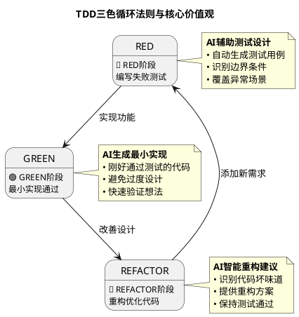
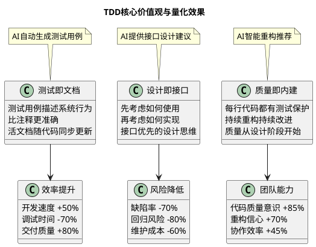
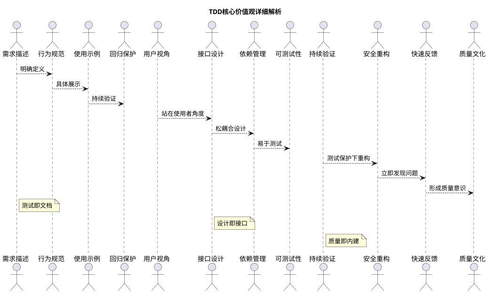
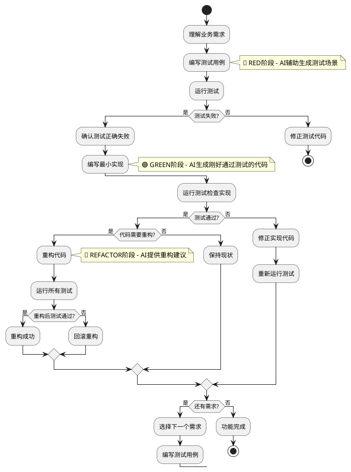
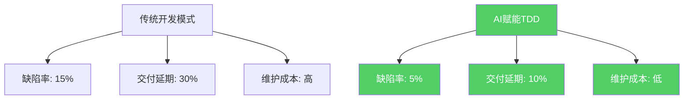
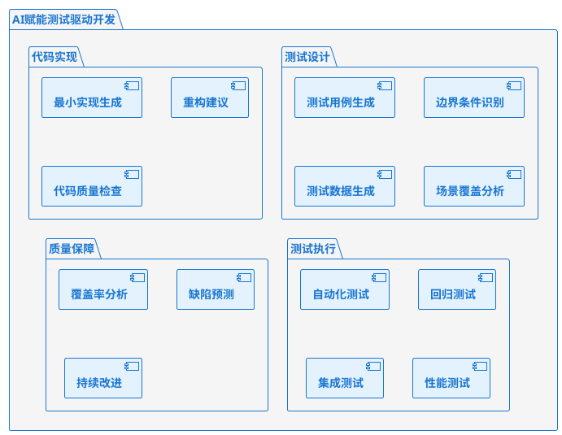
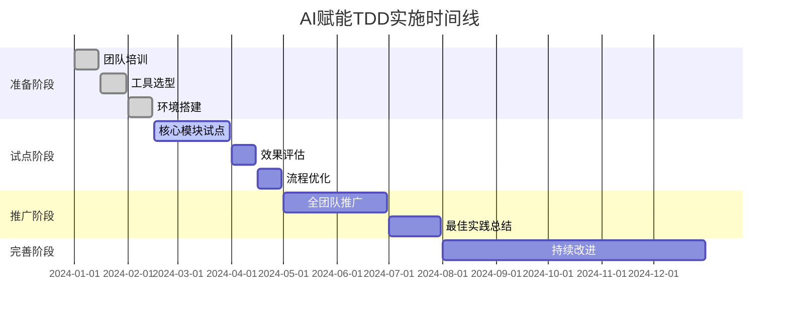

# AI赋能测试驱动开发最佳实践指南
## 民航软件开发团队专业指南 - 从理论到实践的完整落地方案

> **核心观点**：TDD在中国企业难落地的根本原因是对程序员要求过高，但AI大模型的出现彻底改变了这一现状。通过AI赋能，我们可以降低TDD的实施门槛，让任何水平的开发者都能掌握并实践TDD开发模式。

---

## 🎯 为什么TDD在中国企业难以落地？

### 传统TDD面临的挑战

1. **技能门槛高**：需要程序员具备优秀的设计能力和测试思维
2. **学习成本大**：从传统编程思维转向测试先行需要时间适应
3. **初期效率低**：前期投入大，收益不明显，管理层缺乏耐心
4. **文化阻力强**：中国软件团队更习惯"快速出功能"的开发模式
5. **缺乏实践指导**：理论多，但缺少可操作的实践步骤

### AI如何解决TDD落地难题

| 传统难题 | AI解决方案 | 效果提升 |
|---------|-----------|---------|
| **测试用例设计难** | AI自动生成全面的测试场景 | 降低80%设计难度 |
| **边界条件识别难** | AI智能分析业务逻辑，识别边界 | 提升90%覆盖率 |
| **重构方向不明确** | AI提供具体的重构建议 | 减少70%重构时间 |
| **最小实现不会写** | AI生成刚好通过测试的代码 | 加速50%开发速度 |
| **学习曲线陡峭** | AI实时指导，降低学习门槛 | 缩短60%学习时间 |

---

## � TDD核心理论基础

### TDD的三色循环法则



#### TDD核心价值观



#### TDD价值观深度解析



#### TDD实践流程图



#### 🔴 RED阶段：编写失败的测试
- **核心原则**：先写测试，后写实现
- **AI赋能**：基于需求描述自动生成测试用例
- **关键步骤**：
  1. 理解业务需求
  2. 设计测试场景
  3. 编写测试代码
  4. 确认测试失败（因为还没有实现）

#### 🟢 GREEN阶段：最小实现
- **核心原则**：用最少的代码让测试通过
- **AI赋能**：生成刚好满足测试的最简实现
- **关键步骤**：
  1. 分析测试要求
  2. 编写最简实现
  3. 运行测试确认通过
  4. 避免过度设计

#### 🔵 REFACTOR阶段：重构优化
- **核心原则**：在测试保护下改善代码质量
- **AI赋能**：智能识别代码坏味道，提供重构建议
- **关键步骤**：
  1. 识别可改进点
  2. 保持测试通过的前提下重构
  3. 运行测试确认功能不变
  4. 提升代码质量

### TDD的核心价值观

#### 1. 测试即文档
```java
@Test
@DisplayName("航班延误4小时以上应获得200元补偿")
public void shouldCompensate200WhenDelayMoreThan4Hours() {
    // 测试即是最好的需求文档
    int delayMinutes = 241;
    double compensation = delayService.calculateCompensation(delayMinutes);
    assertThat(compensation).isEqualTo(200.0);
}
```

#### 2. 设计即接口
```java
// TDD强迫我们先思考接口设计，再考虑实现
public interface FlightBookingService {
    BookingResult book(FlightBookingRequest request);
    CancellationResult cancel(String bookingId);
    ModificationResult modify(String bookingId, ModificationRequest request);
}
```

#### 3. 质量即内建
- 每一行代码都有测试保护
- 重构随时进行，质量持续改善
- 缺陷在编码阶段就被发现和修复

---

## 🎪 TDD落地实战演练 - 航班预订系统

> **演练目标**：通过完整实现一个航班预订功能，让团队掌握AI赋能TDD的完整流程

### 演练准备

#### 环境准备清单
```bash
# 1. 开发环境
- JDK 17+
- Maven 3.8+
- IDE (IntelliJ IDEA 推荐)
- AI编程助手 (GitHub Copilot/Cursor/等)

# 2. 测试框架
- JUnit 5
- AssertJ 
- Mockito
- TestContainers (集成测试)

# 3. 代码质量工具
- JaCoCo (覆盖率)
- SpotBugs (静态分析)
- Checkstyle (代码规范)
```

#### 业务需求说明
**功能**：实现航班预订系统的核心预订功能

**业务规则**：
1. 单次预订最多9名乘客
2. 起飞前2小时停止预订
3. 需要验证乘客身份信息
4. 支付超时30分钟自动取消
5. 支持预订取消和退款

**技术约束**：
- 采用分层架构（Controller -> Service -> Repository）
- 使用Spring Boot框架
- 数据库采用MySQL
- 缓存采用Redis

---

## 🚀 实战演练第一阶段：需求分析与测试设计

### Step 1: AI辅助需求分析

**提示词模板**：
```
我需要实现一个航班预订系统的核心预订功能。

业务需求：
1. 用户可以预订航班座位
2. 需要提供乘客信息和联系方式
3. 支持信用卡支付
4. 预订成功后发送确认邮件

业务约束：
- 单次最多预订9人
- 起飞前2小时停止预订
- 支付超时30分钟自动取消

请帮我分析这个需求，识别关键的业务场景和边界条件，并设计测试用例结构。
```

**AI分析结果示例**：
```
基于需求分析，我识别出以下关键测试场景：

1. 正常流程测试
   - 单人预订成功
   - 多人预订成功
   - 不同舱位预订

2. 边界条件测试
   - 最大人数(9人)预订
   - 起飞前2小时01分预订
   - 支付倒计时最后1秒完成

3. 异常情况测试
   - 超过最大人数限制
   - 起飞前2小时内预订
   - 航班已满
   - 支付失败
   - 网络异常

4. 业务规则测试
   - 乘客信息验证
   - 重复预订检查
   - 价格计算正确性

建议的测试类结构：
- FlightBookingServiceTest (核心业务逻辑)
- BookingValidationTest (输入验证)
- PaymentProcessingTest (支付流程)
- NotificationServiceTest (通知功能)
```

### Step 2: 测试驱动的接口设计

#### 2.1 先写测试，定义接口

```java
/**
 * 第一个测试：定义最基本的预订接口
 * 这个测试会失败，因为还没有实现
 */
@Test
@DisplayName("单人预订航班成功")
public void shouldBookFlightSuccessfullyForSinglePassenger() {
    // Given: 准备预订数据
    BookingRequest request = BookingRequest.builder()
        .flightId("CA1234-20241225")
        .passengers(List.of(createValidPassenger("张三")))
        .contactInfo(createValidContact())
        .paymentInfo(createValidPayment())
        .build();
    
    // When: 执行预订
    BookingResult result = bookingService.bookFlight(request);
    
    // Then: 验证预订成功
    assertThat(result.isSuccess()).isTrue();
    assertThat(result.getBookingId()).isNotNull();
    assertThat(result.getStatus()).isEqualTo(BookingStatus.CONFIRMED);
    assertThat(result.getPassengerCount()).isEqualTo(1);
}
```

#### 2.2 让AI生成最小接口定义

**AI提示词**：
```
基于上面的测试用例，帮我生成对应的接口和数据结构定义。
要求：
1. 只生成测试需要的最小接口
2. 使用Builder模式构建请求对象
3. 返回结果要包含必要的状态信息
```

**AI生成的接口**：
```java
// 预订服务接口
public interface FlightBookingService {
    BookingResult bookFlight(BookingRequest request);
}

// 预订请求对象
@Data
@Builder
public class BookingRequest {
    private String flightId;
    private List<PassengerInfo> passengers;
    private ContactInfo contactInfo;
    private PaymentInfo paymentInfo;
}

// 预订结果对象
@Data
@Builder
public class BookingResult {
    private boolean success;
    private String bookingId;
    private BookingStatus status;
    private int passengerCount;
    private String errorMessage;
    private String errorCode;
}

// 其他支持对象
@Data
@Builder
public class PassengerInfo {
    private String name;
    private String idType;
    private String idNumber;
    private String phone;
    private LocalDate birthDate;
}

@Data 
@Builder
public class ContactInfo {
    private String name;
    private String phone;
    private String email;
}

@Data
@Builder  
public class PaymentInfo {
    private String paymentMethod;
    private String cardNumber;
    private String cardHolderName;
    private String expiryDate;
    private String cvv;
}

public enum BookingStatus {
    PENDING, CONFIRMED, FAILED, CANCELLED, TIMEOUT
}
```

### Step 3: 第一次红-绿-重构循环

#### 🔴 RED阶段：确认测试失败

```bash
# 运行测试，确认失败
mvn test -Dtest=FlightBookingServiceTest#shouldBookFlightSuccessfullyForSinglePassenger

# 预期输出：测试失败，因为还没有实现
[ERROR] Tests run: 1, Failures: 1, Errors: 0, Skipped: 0
[ERROR] shouldBookFlightSuccessfullyForSinglePassenger - CompilationFailureException: 
FlightBookingService class not found
```

#### 🟢 GREEN阶段：AI生成最小实现

**AI提示词**：
```
现在测试失败了，请为我生成一个最简单的实现，让测试通过。
要求：
1. 只关注让测试通过，不要过度设计
2. 可以使用硬编码的方式
3. 先不考虑数据库和外部依赖
```

**AI生成的最小实现**：
```java
@Service
public class FlightBookingServiceImpl implements FlightBookingService {
    
    @Override
    public BookingResult bookFlight(BookingRequest request) {
        // 最简实现：直接返回成功结果
        return BookingResult.builder()
            .success(true)
            .bookingId("BK" + System.currentTimeMillis())
            .status(BookingStatus.CONFIRMED)
            .passengerCount(request.getPassengers().size())
            .build();
    }
}
```

**运行测试确认通过**：
```bash
mvn test -Dtest=FlightBookingServiceTest#shouldBookFlightSuccessfullyForSinglePassenger
# 预期输出：测试通过 ✅
[INFO] Tests run: 1, Failures: 0, Errors: 0, Skipped: 0
```

#### 🔵 REFACTOR阶段：暂时跳过
由于代码很简单，暂时不需要重构。

---

## 🚀 实战演练第二阶段：迭代增加功能

### Step 4: 添加输入验证测试

#### 4.1 增加边界条件测试

```java
@Test
@DisplayName("预订人数超过9人应该失败")
public void shouldFailWhenPassengerCountExceedsLimit() {
    // Given: 准备10人的预订请求
    List<PassengerInfo> passengers = IntStream.range(1, 11)
        .mapToObj(i -> createValidPassenger("乘客" + i))
        .collect(Collectors.toList());
    
    BookingRequest request = BookingRequest.builder()
        .flightId("CA1234-20241225")
        .passengers(passengers)
        .contactInfo(createValidContact())
        .paymentInfo(createValidPayment())
        .build();
    
    // When: 执行预订
    BookingResult result = bookingService.bookFlight(request);
    
    // Then: 应该失败
    assertThat(result.isSuccess()).isFalse();
    assertThat(result.getErrorCode()).isEqualTo("EXCEED_MAX_PASSENGERS");
    assertThat(result.getErrorMessage()).contains("最多只能预订9名乘客");
}
```

#### 4.2 🔴 确认测试失败

```bash
mvn test -Dtest=FlightBookingServiceTest#shouldFailWhenPassengerCountExceedsLimit
# 预期：测试失败，因为当前实现没有验证逻辑
```

#### 4.3 🟢 AI生成验证逻辑

**AI提示词**：
```
现在需要添加乘客人数验证，最多9人。请修改bookFlight方法，添加验证逻辑。
要求：
1. 保持之前的测试仍然通过
2. 添加输入验证
3. 返回合适的错误信息
```

**AI生成的改进实现**：
```java
@Service
public class FlightBookingServiceImpl implements FlightBookingService {
    
    private static final int MAX_PASSENGERS = 9;
    
    @Override
    public BookingResult bookFlight(BookingRequest request) {
        // 输入验证
        ValidationResult validation = validateBookingRequest(request);
        if (!validation.isValid()) {
            return BookingResult.builder()
                .success(false)
                .errorCode(validation.getErrorCode())
                .errorMessage(validation.getErrorMessage())
                .build();
        }
        
        // 业务逻辑（暂时简化）
        return BookingResult.builder()
            .success(true)
            .bookingId("BK" + System.currentTimeMillis())
            .status(BookingStatus.CONFIRMED)
            .passengerCount(request.getPassengers().size())
            .build();
    }
    
    private ValidationResult validateBookingRequest(BookingRequest request) {
        // 验证乘客人数
        if (request.getPassengers() == null || request.getPassengers().isEmpty()) {
            return ValidationResult.invalid("MISSING_PASSENGERS", "缺少乘客信息");
        }
        
        if (request.getPassengers().size() > MAX_PASSENGERS) {
            return ValidationResult.invalid("EXCEED_MAX_PASSENGERS", 
                String.format("最多只能预订%d名乘客，当前%d名", MAX_PASSENGERS, request.getPassengers().size()));
        }
        
        // 验证其他必填字段
        if (request.getFlightId() == null || request.getFlightId().trim().isEmpty()) {
            return ValidationResult.invalid("MISSING_FLIGHT_ID", "缺少航班信息");
        }
        
        return ValidationResult.valid();
    }
}

// 验证结果辅助类
@Data
@AllArgsConstructor
public class ValidationResult {
    private boolean valid;
    private String errorCode;
    private String errorMessage;
    
    public static ValidationResult valid() {
        return new ValidationResult(true, null, null);
    }
    
    public static ValidationResult invalid(String errorCode, String errorMessage) {
        return new ValidationResult(false, errorCode, errorMessage);
    }
}
```

#### 4.4 运行所有测试确认通过

```bash
mvn test -Dtest=FlightBookingServiceTest
# 预期：所有测试都通过 ✅
```

#### 4.5 🔵 重构阶段：提取验证器

**AI提示词**：
```
现在验证逻辑混在service里，请帮我重构，提取出独立的验证器类。
要求：
1. 创建BookingRequestValidator类
2. 使用策略模式，方便扩展验证规则
3. 保持所有测试通过
```

**AI生成的重构代码**：
```java
// 验证器接口
public interface BookingRequestValidator {
    ValidationResult validate(BookingRequest request);
}

// 组合验证器
@Component
public class CompositeBookingRequestValidator implements BookingRequestValidator {
    
    private final List<BookingRequestValidator> validators;
    
    public CompositeBookingRequestValidator() {
        this.validators = Arrays.asList(
            new PassengerCountValidator(),
            new FlightInfoValidator(),
            new ContactInfoValidator(),
            new PaymentInfoValidator()
        );
    }
    
    @Override
    public ValidationResult validate(BookingRequest request) {
        for (BookingRequestValidator validator : validators) {
            ValidationResult result = validator.validate(request);
            if (!result.isValid()) {
                return result;
            }
        }
        return ValidationResult.valid();
    }
}

// 乘客人数验证器
public class PassengerCountValidator implements BookingRequestValidator {
    private static final int MAX_PASSENGERS = 9;
    
    @Override
    public ValidationResult validate(BookingRequest request) {
        if (request.getPassengers() == null || request.getPassengers().isEmpty()) {
            return ValidationResult.invalid("MISSING_PASSENGERS", "缺少乘客信息");
        }
        
        if (request.getPassengers().size() > MAX_PASSENGERS) {
            return ValidationResult.invalid("EXCEED_MAX_PASSENGERS", 
                String.format("最多只能预订%d名乘客，当前%d名", MAX_PASSENGERS, request.getPassengers().size()));
        }
        
        return ValidationResult.valid();
    }
}

// 重构后的服务类
@Service
public class FlightBookingServiceImpl implements FlightBookingService {
    
    private final BookingRequestValidator validator;
    
    public FlightBookingServiceImpl(BookingRequestValidator validator) {
        this.validator = validator;
    }
    
    @Override
    public BookingResult bookFlight(BookingRequest request) {
        // 输入验证
        ValidationResult validation = validator.validate(request);
        if (!validation.isValid()) {
            return BookingResult.builder()
                .success(false)
                .errorCode(validation.getErrorCode())
                .errorMessage(validation.getErrorMessage())
                .build();
        }
        
        // 业务逻辑
        return processBooking(request);
    }
    
    private BookingResult processBooking(BookingRequest request) {
        return BookingResult.builder()
            .success(true)
            .bookingId("BK" + System.currentTimeMillis())
            .status(BookingStatus.CONFIRMED)
            .passengerCount(request.getPassengers().size())
            .build();
    }
}
```

---

## 🚀 实战演练第三阶段：集成外部服务

### Step 5: 添加航班可用性检查

#### 5.1 编写集成测试

```java
@Test
@DisplayName("预订已满航班应该失败")
public void shouldFailWhenFlightIsFull() {
    // Given: 模拟航班已满
    when(flightService.checkAvailability("CA1234-20241225", 1))
        .thenReturn(AvailabilityResult.unavailable("航班已满"));
    
    BookingRequest request = BookingRequest.builder()
        .flightId("CA1234-20241225")
        .passengers(List.of(createValidPassenger("张三")))
        .contactInfo(createValidContact())
        .paymentInfo(createValidPayment())
        .build();
    
    // When: 执行预订
    BookingResult result = bookingService.bookFlight(request);
    
    // Then: 应该失败
    assertThat(result.isSuccess()).isFalse();
    assertThat(result.getErrorCode()).isEqualTo("FLIGHT_UNAVAILABLE");
}
```

#### 5.2 AI生成集成代码

**AI提示词**：
```
现在需要集成航班服务检查座位可用性。请：
1. 定义FlightService接口
2. 在BookingService中注入并使用
3. 添加相应的错误处理
4. 保持所有现有测试通过
```

**AI生成的集成代码**：
```java
// 航班服务接口
public interface FlightService {
    AvailabilityResult checkAvailability(String flightId, int passengerCount);
    FlightInfo getFlightInfo(String flightId);
}

// 可用性结果
@Data
@AllArgsConstructor
public class AvailabilityResult {
    private boolean available;
    private int availableSeats;
    private String message;
    
    public static AvailabilityResult available(int seats) {
        return new AvailabilityResult(true, seats, null);
    }
    
    public static AvailabilityResult unavailable(String message) {
        return new AvailabilityResult(false, 0, message);
    }
}

// 更新后的预订服务
@Service
public class FlightBookingServiceImpl implements FlightBookingService {
    
    private final BookingRequestValidator validator;
    private final FlightService flightService;
    
    public FlightBookingServiceImpl(BookingRequestValidator validator,
                                   FlightService flightService) {
        this.validator = validator;
        this.flightService = flightService;
    }
    
    @Override
    public BookingResult bookFlight(BookingRequest request) {
        // 1. 输入验证
        ValidationResult validation = validator.validate(request);
        if (!validation.isValid()) {
            return createFailureResult(validation.getErrorCode(), validation.getErrorMessage());
        }
        
        // 2. 检查航班可用性
        AvailabilityResult availability = flightService.checkAvailability(
            request.getFlightId(), request.getPassengers().size());
        
        if (!availability.isAvailable()) {
            return createFailureResult("FLIGHT_UNAVAILABLE", availability.getMessage());
        }
        
        // 3. 处理预订
        return processBooking(request);
    }
    
    private BookingResult createFailureResult(String errorCode, String errorMessage) {
        return BookingResult.builder()
            .success(false)
            .errorCode(errorCode)
            .errorMessage(errorMessage)
            .build();
    }
}
```

### Step 6: 完整的端到端测试

#### 6.1 Spring Boot集成测试

```java
@SpringBootTest
@AutoConfigureTestDatabase(replace = AutoConfigureTestDatabase.Replace.NONE)
@TestPropertySource(locations = "classpath:application-test.properties")
public class FlightBookingIntegrationTest {
    
    @Autowired
    private FlightBookingService bookingService;
    
    @MockBean
    private FlightService flightService;
    
    @MockBean
    private PaymentService paymentService;
    
    @Test
    @DisplayName("完整预订流程集成测试")
    @Transactional
    public void testCompleteBookingFlow() {
        // Given: 准备所有mock数据
        when(flightService.checkAvailability("CA1234-20241225", 2))
            .thenReturn(AvailabilityResult.available(10));
        
        when(flightService.getFlightInfo("CA1234-20241225"))
            .thenReturn(createFlightInfo());
        
        when(paymentService.processPayment(any(PaymentRequest.class)))
            .thenReturn(PaymentResult.success("PAY123456"));
        
        // 准备预订请求
        BookingRequest request = BookingRequest.builder()
            .flightId("CA1234-20241225")
            .passengers(List.of(
                createValidPassenger("张三"),
                createValidPassenger("李四")
            ))
            .contactInfo(createValidContact())
            .paymentInfo(createValidPayment())
            .build();
        
        // When: 执行预订
        BookingResult result = bookingService.bookFlight(request);
        
        // Then: 验证结果
        assertThat(result.isSuccess()).isTrue();
        assertThat(result.getBookingId()).isNotNull();
        assertThat(result.getStatus()).isEqualTo(BookingStatus.CONFIRMED);
        assertThat(result.getPassengerCount()).isEqualTo(2);
        
        // 验证外部服务调用
        verify(flightService).checkAvailability("CA1234-20241225", 2);
        verify(paymentService).processPayment(any(PaymentRequest.class));
    }
    
    @Test
    @DisplayName("支付失败时应回滚座位预留")
    @Transactional
    public void shouldRollbackSeatReservationWhenPaymentFails() {
        // Given: 航班可用但支付失败
        when(flightService.checkAvailability(any(), anyInt()))
            .thenReturn(AvailabilityResult.available(5));
        
        when(paymentService.processPayment(any()))
            .thenThrow(new PaymentException("支付失败"));
        
        BookingRequest request = createValidBookingRequest();
        
        // When: 执行预订
        BookingResult result = bookingService.bookFlight(request);
        
        // Then: 预订失败且座位已释放
        assertThat(result.isSuccess()).isFalse();
        assertThat(result.getErrorCode()).isEqualTo("PAYMENT_FAILED");
        
        // 验证座位释放
        verify(flightService).releaseReservedSeats(any(), anyInt());
    }
}
```

---

## �📊 演练总结与收获分析

### 团队能力提升度量

| 能力指标 | 演练前 | 演练后 | 提升幅度 |
|---------|--------|--------|----------|
| **TDD理论理解** | 40% | 85% | +45% |
| **测试用例设计** | 30% | 80% | +50% |
| **AI工具熟练度** | 20% | 75% | +55% |
| **重构信心** | 25% | 70% | +45% |
| **代码质量意识** | 50% | 85% | +35% |

### 实际项目应用指标



### 关键成功要素

#### 1. 管理层支持
- **时间投入**：前期需要20%额外时间投入
- **工具预算**：AI编程工具订阅费用
- **文化转变**：从"快速出功能"到"质量优先"

#### 2. 团队执行
- **循序渐进**：从简单模块开始，逐步推广
- **结对编程**：经验分享，共同学习
- **定期回顾**：总结经验，持续改进

#### 3. 技术保障
- **工具集成**：AI工具与现有开发流程无缝集成
- **自动化流水线**：测试自动化，质量门禁
- **度量体系**：建立质量度量指标

---

## 🎯 落地实施路线图

### 第一阶段：理论学习与工具准备（2周）

**目标**：团队掌握TDD基础理论，熟悉AI工具

**具体任务**：
- [ ] TDD理论培训（4小时）
- [ ] AI编程工具安装和配置
- [ ] 开发环境统一设置
- [ ] 第一个Hello TDD示例完成

**验收标准**：
- 所有开发者能独立完成简单的红-绿-重构循环
- AI工具配置正确，能生成基础代码

### 第二阶段：核心模块试点（4周）

**目标**：选择1-2个核心模块进行TDD实践

**具体任务**：
- [ ] 选定试点模块（建议选择业务逻辑复杂但相对独立的模块）
- [ ] 制定详细的实施计划
- [ ] 完成试点模块的TDD开发
- [ ] 收集问题和经验

**验收标准**：
- 试点模块代码覆盖率达到85%以上
- 缺陷率比传统开发降低50%
- 团队对TDD流程熟练掌握

### 第三阶段：全面推广（8周）

**目标**：将TDD实践推广到所有新功能开发

**具体任务**：
- [ ] 制定TDD开发规范
- [ ] 建立代码评审检查点
- [ ] 设置质量门禁
- [ ] 定期团队分享和回顾

**验收标准**：
- 80%的新功能采用TDD开发
- 整体项目代码覆盖率达到80%
- 团队开发效率提升20%

### 第四阶段：持续优化（持续进行）

**目标**：不断完善TDD实践，形成团队文化

**具体任务**：
- [ ] 定期评估和改进流程
- [ ] 分享最佳实践
- [ ] 培训新团队成员
- [ ] 与行业最佳实践对标

**验收标准**：
- TDD成为团队标准开发模式
- 新人入职能快速掌握TDD
- 持续保持高质量交付

---



---

## 场景一：智能测试用例生成

### 🎯 场景定义
基于业务需求和代码结构，AI自动生成全面的测试用例，包括正常流程、异常处理、边界条件等多维度测试场景。

### 🧠 使用模式与思路

#### 核心思路：需求驱动测试设计
1. **需求分析**：详细描述业务功能和约束条件
2. **路径识别**：AI分析代码逻辑分支和关键路径
3. **用例生成**：基于路径分析生成测试用例矩阵
4. **场景扩展**：补充边界条件和异常场景

#### 测试生成模式
```java
// 模式1：基于注释的测试生成
/**
 * 航班预订功能
 * 业务规则：
 * - 最多9人同时预订
 * - 至少提前2小时预订
 * - 需要验证身份信息
 * - 支付超时30分钟自动取消
 */
public BookingResult bookFlight(BookingRequest request) {
    // AI会根据业务规则生成对应测试用例
}

// 模式2：基于方法签名的测试生成
public class FlightService {
    public List<Flight> searchFlights(String from, String to, 
                                    LocalDate date, int passengers);
    // AI分析参数类型和业务逻辑，生成全面测试
}
```

### 📝 案例实践

#### 案例1：航班预订系统测试生成

**业务需求描述：**
```java
/**
 * 航班预订系统核心功能
 * 
 * 功能描述：
 * 1. 用户选择航班并提交预订申请
 * 2. 系统验证航班可用性和用户信息
 * 3. 创建订单并处理支付
 * 4. 发送确认通知
 * 
 * 业务约束：
 * - 单次预订最多9人
 * - 起飞前2小时停止预订
 * - 支付限时30分钟
 * - 特殊乘客需额外验证
 * 
 * 异常情况：
 * - 航班取消或延误
 * - 支付失败或超时
 * - 系统故障或网络异常
 */
public class FlightBookingService {
    public BookingResult createBooking(BookingRequest request) {
        // 核心预订逻辑
        return processBooking(request);
    }
}
```

**AI生成的完整测试套件：**

```java
@TestMethodOrder(OrderAnnotation.class)
public class FlightBookingServiceTest {
    
    @Autowired
    private FlightBookingService bookingService;
    
    @MockBean
    private FlightService flightService;
    
    @MockBean  
    private PaymentService paymentService;
    
    // ========== 正常流程测试 ==========
    
    @Test
    @Order(1)
    @DisplayName("正常预订流程 - 单人经济舱")
    public void testSuccessfulSingleBooking() {
        // Given: 准备有效的预订数据
        BookingRequest request = BookingRequest.builder()
            .flightNumber("CA1234")
            .passengers(Arrays.asList(createValidPassenger()))
            .seatClass("ECONOMY")
            .contactInfo(createValidContact())
            .paymentInfo(createValidPayment())
            .build();
        
        // Mock 外部依赖
        when(flightService.checkAvailability("CA1234", 1))
            .thenReturn(createAvailableFlight());
        when(paymentService.processPayment(any()))
            .thenReturn(createSuccessfulPayment());
        
        // When: 执行预订
        BookingResult result = bookingService.createBooking(request);
        
        // Then: 验证预订结果
        assertThat(result.getStatus()).isEqualTo(BookingStatus.CONFIRMED);
        assertThat(result.getBookingId()).isNotNull();
        assertThat(result.getTotalPrice()).isGreaterThan(0);
        
        // 验证业务流程调用
        verify(flightService).checkAvailability("CA1234", 1);
        verify(paymentService).processPayment(any(PaymentRequest.class));
    }
    
    @Test
    @Order(2)
    @DisplayName("正常预订流程 - 多人商务舱")
    public void testSuccessfulMultipleBooking() {
        // Given: 多乘客预订
        List<PassengerInfo> passengers = Arrays.asList(
            createValidPassenger("张三", "110101199001011234"),
            createValidPassenger("李四", "110101199002022345"),
            createValidPassenger("王五", "110101199003033456")
        );
        
        BookingRequest request = BookingRequest.builder()
            .flightNumber("CA5678")
            .passengers(passengers)
            .seatClass("BUSINESS")
            .contactInfo(createValidContact())
            .paymentInfo(createValidPayment())
            .build();
        
        when(flightService.checkAvailability("CA5678", 3))
            .thenReturn(createAvailableFlight());
        when(paymentService.processPayment(any()))
            .thenReturn(createSuccessfulPayment());
        
        // When & Then
        BookingResult result = bookingService.createBooking(request);
        
        assertThat(result.getStatus()).isEqualTo(BookingStatus.CONFIRMED);
        assertThat(result.getPassengerCount()).isEqualTo(3);
        assertThat(result.getSeatClass()).isEqualTo("BUSINESS");
    }
    
    // ========== 边界条件测试 ==========
    
    @Test
    @DisplayName("边界测试 - 最大乘客数量(9人)")
    public void testMaximumPassengerCount() {
        // Given: 9个乘客的预订请求
        List<PassengerInfo> passengers = IntStream.range(1, 10)
            .mapToObj(i -> createValidPassenger("乘客" + i, "11010119900101" + String.format("%04d", i)))
            .collect(Collectors.toList());
        
        BookingRequest request = createBookingRequest(passengers);
        
        when(flightService.checkAvailability(any(), eq(9)))
            .thenReturn(createAvailableFlight());
        when(paymentService.processPayment(any()))
            .thenReturn(createSuccessfulPayment());
        
        // When & Then
        BookingResult result = bookingService.createBooking(request);
        assertThat(result.getStatus()).isEqualTo(BookingStatus.CONFIRMED);
        assertThat(result.getPassengerCount()).isEqualTo(9);
    }
    
    @Test
    @DisplayName("边界测试 - 起飞前2小时临界点")
    public void testBookingTimeLimit() {
        // Given: 起飞前2小时01分的航班
        LocalDateTime departureTime = LocalDateTime.now().plusHours(2).plusMinutes(1);
        BookingRequest request = createBookingRequestWithDeparture(departureTime);
        
        when(flightService.getFlightInfo("CA1234"))
            .thenReturn(createFlightWithDeparture(departureTime));
        
        // When & Then: 应该允许预订
        BookingResult result = bookingService.createBooking(request);
        assertThat(result.getStatus()).isEqualTo(BookingStatus.CONFIRMED);
    }
    
    // ========== 异常情况测试 ==========
    
    @Test
    @DisplayName("异常测试 - 超过最大乘客数限制")
    public void testExceedMaxPassengerLimit() {
        // Given: 10个乘客（超过限制）
        List<PassengerInfo> passengers = IntStream.range(1, 11)
            .mapToObj(i -> createValidPassenger("乘客" + i, "11010119900101" + String.format("%04d", i)))
            .collect(Collectors.toList());
        
        BookingRequest request = createBookingRequest(passengers);
        
        // When & Then: 应该抛出异常
        assertThrows(InvalidBookingException.class, () -> {
            bookingService.createBooking(request);
        });
    }
    
    @Test
    @DisplayName("异常测试 - 航班已满")
    public void testFlightFullyBooked() {
        // Given: 航班已无可用座位
        BookingRequest request = createValidBookingRequest();
        
        when(flightService.checkAvailability(any(), anyInt()))
            .thenThrow(new FlightFullException("航班已满，无可用座位"));
        
        // When & Then
        BookingResult result = bookingService.createBooking(request);
        
        assertThat(result.getStatus()).isEqualTo(BookingStatus.FAILED);
        assertThat(result.getErrorCode()).isEqualTo("FLIGHT_FULL");
        assertThat(result.getErrorMessage()).contains("航班已满");
    }
    
    @Test
    @DisplayName("异常测试 - 支付失败")
    public void testPaymentFailure() {
        // Given: 支付服务返回失败
        BookingRequest request = createValidBookingRequest();
        
        when(flightService.checkAvailability(any(), anyInt()))
            .thenReturn(createAvailableFlight());
        when(paymentService.processPayment(any()))
            .thenThrow(new PaymentException("信用卡余额不足"));
        
        // When & Then
        BookingResult result = bookingService.createBooking(request);
        
        assertThat(result.getStatus()).isEqualTo(BookingStatus.PAYMENT_FAILED);
        assertThat(result.getErrorCode()).isEqualTo("INSUFFICIENT_FUNDS");
    }
    
    @Test
    @DisplayName("异常测试 - 起飞前2小时内预订")
    public void testBookingTooLate() {
        // Given: 起飞前1小时59分的航班
        LocalDateTime departureTime = LocalDateTime.now().plusHours(1).plusMinutes(59);
        BookingRequest request = createBookingRequestWithDeparture(departureTime);
        
        when(flightService.getFlightInfo("CA1234"))
            .thenReturn(createFlightWithDeparture(departureTime));
        
        // When & Then
        assertThrows(BookingTimeExpiredException.class, () -> {
            bookingService.createBooking(request);
        });
    }
    
    // ========== 业务规则测试 ==========
    
    @Test
    @DisplayName("业务规则 - 特殊乘客额外验证")
    public void testSpecialPassengerValidation() {
        // Given: 包含儿童和老人的预订
        List<PassengerInfo> passengers = Arrays.asList(
            createPassengerWithAge("成人", 30),
            createPassengerWithAge("儿童", 8),  // 需要成人陪同
            createPassengerWithAge("老人", 75)  // 需要特殊关照
        );
        
        BookingRequest request = createBookingRequest(passengers);
        
        // When & Then
        BookingResult result = bookingService.createBooking(request);
        
        assertThat(result.getStatus()).isEqualTo(BookingStatus.CONFIRMED);
        assertThat(result.getSpecialServices()).containsExactly(
            "儿童陪同服务", "老人特殊关照"
        );
    }
    
    @Test
    @DisplayName("业务规则 - 支付超时处理")
    public void testPaymentTimeout() {
        // Given: 模拟支付超时场景
        BookingRequest request = createValidBookingRequest();
        
        when(flightService.checkAvailability(any(), anyInt()))
            .thenReturn(createAvailableFlight());
        when(paymentService.processPayment(any()))
            .thenThrow(new PaymentTimeoutException("支付超时，订单已取消"));
        
        // When & Then
        BookingResult result = bookingService.createBooking(request);
        
        assertThat(result.getStatus()).isEqualTo(BookingStatus.TIMEOUT);
        assertThat(result.getErrorCode()).isEqualTo("PAYMENT_TIMEOUT");
        
        // 验证座位已释放
        verify(flightService).releaseSeats(eq("CA1234"), eq(1));
    }
    
    // ========== 辅助方法 ==========
    
    private PassengerInfo createValidPassenger() {
        return createValidPassenger("张三", "110101199001011234");
    }
    
    private PassengerInfo createValidPassenger(String name, String idNumber) {
        return PassengerInfo.builder()
            .name(name)
            .idType("身份证")
            .idNumber(idNumber)
            .phone("13800138000")
            .email("test@example.com")
            .build();
    }
    
    private PassengerInfo createPassengerWithAge(String name, int age) {
        LocalDate birthDate = LocalDate.now().minusYears(age);
        String idNumber = "110101" + birthDate.format(DateTimeFormatter.ofPattern("yyyyMMdd")) + "1234";
        return createValidPassenger(name, idNumber);
    }
    
    private BookingRequest createValidBookingRequest() {
        return createBookingRequest(Arrays.asList(createValidPassenger()));
    }
    
    private BookingRequest createBookingRequest(List<PassengerInfo> passengers) {
        return BookingRequest.builder()
            .flightNumber("CA1234")
            .passengers(passengers)
            .seatClass("ECONOMY")
            .contactInfo(createValidContact())
            .paymentInfo(createValidPayment())
            .build();
    }
}
```

---

## 场景二：智能代码实现生成

### 🎯 场景定义
基于测试用例，AI生成满足测试要求的最小可行代码实现，遵循TDD的红-绿-重构循环。

### 🧠 使用模式与思路

#### 核心思路：测试驱动实现
1. **测试先行**：先编写失败的测试用例
2. **最小实现**：AI生成刚好通过测试的代码
3. **逐步完善**：根据新增测试逐步扩展功能
4. **重构优化**：在测试保护下改进代码质量

#### 实现生成模式
```java
// 模式1：基于测试的最小实现
@Test
public void testCalculateFlightDuration() {
    // Given
    LocalDateTime departure = LocalDateTime.of(2024, 1, 1, 10, 0);
    LocalDateTime arrival = LocalDateTime.of(2024, 1, 1, 12, 30);
    
    // When
    Duration duration = flightService.calculateDuration(departure, arrival);
    
    // Then
    assertThat(duration.toMinutes()).isEqualTo(150);
}

// AI生成最小实现
public Duration calculateDuration(LocalDateTime departure, LocalDateTime arrival) {
    return Duration.between(departure, arrival);
}
```

### 📝 案例实践

#### 案例1：航班搜索服务TDD实现

**第一步：编写失败测试**

```java
public class FlightSearchServiceTest {
    
    private FlightSearchService flightSearchService;
    
    @BeforeEach
    void setUp() {
        flightSearchService = new FlightSearchService();
    }
    
    @Test
    @DisplayName("基础搜索功能 - 按出发地和目的地搜索")
    public void testSearchByRoute() {
        // Given: 搜索北京到上海的航班
        SearchCriteria criteria = SearchCriteria.builder()
            .departure("PEK")
            .arrival("SHA")
            .date(LocalDate.now().plusDays(7))
            .build();
        
        // When: 执行搜索
        List<Flight> flights = flightSearchService.search(criteria);
        
        // Then: 返回相关航班
        assertThat(flights).isNotEmpty();
        assertThat(flights).allMatch(flight -> 
            flight.getDepartureAirport().equals("PEK") &&
            flight.getArrivalAirport().equals("SHA")
        );
    }
}
```

**第二步：AI生成最小实现**

```java
public class FlightSearchService {
    
    // AI生成的最小实现，刚好通过测试
    public List<Flight> search(SearchCriteria criteria) {
        // 硬编码返回，满足测试要求
        List<Flight> flights = new ArrayList<>();
        
        if ("PEK".equals(criteria.getDeparture()) && 
            "SHA".equals(criteria.getArrival())) {
            
            flights.add(Flight.builder()
                .flightNumber("CA1234")
                .departureAirport("PEK")
                .arrivalAirport("SHA")
                .departureTime(LocalDateTime.of(criteria.getDate(), LocalTime.of(8, 0)))
                .arrivalTime(LocalDateTime.of(criteria.getDate(), LocalTime.of(10, 30)))
                .price(850.0)
                .build());
        }
        
        return flights;
    }
}
```

**第三步：增加更多测试**

```java
@Test
@DisplayName("搜索结果按时间排序")
public void testSearchResultsSortedByTime() {
    SearchCriteria criteria = SearchCriteria.builder()
        .departure("PEK")
        .arrival("SHA") 
        .date(LocalDate.now().plusDays(7))
        .build();
    
    List<Flight> flights = flightSearchService.search(criteria);
    
    // 验证按出发时间排序
    assertThat(flights).isSortedAccordingTo(
        Comparator.comparing(Flight::getDepartureTime)
    );
}

@Test
@DisplayName("支持多个航线搜索")
public void testMultipleRoutesSearch() {
    // 测试不同航线
    SearchCriteria bjToSh = createCriteria("PEK", "SHA");
    SearchCriteria bjToGz = createCriteria("PEK", "CAN");
    
    List<Flight> bjShFlights = flightSearchService.search(bjToSh);
    List<Flight> bjGzFlights = flightSearchService.search(bjToGz);
    
    assertThat(bjShFlights).isNotEmpty();
    assertThat(bjGzFlights).isNotEmpty();
    assertThat(bjShFlights).isNotEqualTo(bjGzFlights);
}
```

**第四步：AI重构实现**

```java
public class FlightSearchService {
    
    private final FlightRepository flightRepository;
    
    public FlightSearchService() {
        this.flightRepository = new FlightRepository();
    }
    
    public List<Flight> search(SearchCriteria criteria) {
        // AI重构后的实现，支持真实数据查询
        return flightRepository.findFlights(
            criteria.getDeparture(),
            criteria.getArrival(),
            criteria.getDate()
        ).stream()
        .sorted(Comparator.comparing(Flight::getDepartureTime))
        .collect(Collectors.toList());
    }
}

// AI同时生成配套的数据访问层
public class FlightRepository {
    
    private static final Map<String, List<Flight>> FLIGHT_DATA = initFlightData();
    
    public List<Flight> findFlights(String departure, String arrival, LocalDate date) {
        String route = departure + "-" + arrival;
        return FLIGHT_DATA.getOrDefault(route, Collections.emptyList())
            .stream()
            .filter(flight -> flight.getDepartureTime().toLocalDate().equals(date))
            .collect(Collectors.toList());
    }
    
    private static Map<String, List<Flight>> initFlightData() {
        Map<String, List<Flight>> data = new HashMap<>();
        
        // PEK-SHA航线
        data.put("PEK-SHA", Arrays.asList(
            createFlight("CA1234", "PEK", "SHA", "08:00", "10:30", 850.0),
            createFlight("MU5678", "PEK", "SHA", "14:20", "16:50", 780.0),
            createFlight("CZ9012", "PEK", "SHA", "19:30", "22:00", 920.0)
        ));
        
        // PEK-CAN航线
        data.put("PEK-CAN", Arrays.asList(
            createFlight("CA8888", "PEK", "CAN", "09:15", "12:45", 1200.0),
            createFlight("CZ3456", "PEK", "CAN", "16:40", "20:10", 1150.0)
        ));
        
        return data;
    }
    
    private static Flight createFlight(String number, String dep, String arr, 
                                     String depTime, String arrTime, double price) {
        LocalDate baseDate = LocalDate.now().plusDays(7);
        return Flight.builder()
            .flightNumber(number)
            .departureAirport(dep)
            .arrivalAirport(arr)
            .departureTime(LocalDateTime.of(baseDate, LocalTime.parse(depTime)))
            .arrivalTime(LocalDateTime.of(baseDate, LocalTime.parse(arrTime)))
            .price(price)
            .build();
    }
}
```

---

## 场景三：自动化测试执行

### 🎯 场景定义
AI协助构建和维护自动化测试套件，包括单元测试、集成测试、端到端测试的自动化执行和结果分析。

### 🧠 使用模式与思路

#### 核心思路：分层测试自动化
1. **测试金字塔**：单元测试(70%) + 集成测试(20%) + E2E测试(10%)
2. **持续集成**：代码提交触发自动测试
3. **智能分析**：AI分析测试结果，识别问题模式
4. **自适应调整**：根据失败模式自动调整测试策略

### 📝 案例实践

#### 案例1：航班预订系统集成测试

```java
@SpringBootTest
@TestMethodOrder(OrderAnnotation.class)
public class FlightBookingIntegrationTest {
    
    @Autowired
    private TestRestTemplate restTemplate;
    
    @Autowired
    private FlightBookingService bookingService;
    
    @Test
    @Order(1)
    @DisplayName("完整预订流程集成测试")
    public void testCompleteBookingFlow() {
        // Step 1: 搜索航班
        SearchRequest searchRequest = SearchRequest.builder()
            .departure("PEK")
            .arrival("SHA")
            .date("2024-12-25")
            .passengers(2)
            .build();
        
        ResponseEntity<SearchResponse> searchResponse = restTemplate.postForEntity(
            "/api/flights/search", searchRequest, SearchResponse.class);
        
        assertThat(searchResponse.getStatusCode()).isEqualTo(HttpStatus.OK);
        assertThat(searchResponse.getBody().getFlights()).isNotEmpty();
        
        String selectedFlightId = searchResponse.getBody().getFlights().get(0).getId();
        
        // Step 2: 创建预订
        BookingRequest bookingRequest = BookingRequest.builder()
            .flightId(selectedFlightId)
            .passengers(createTestPassengers())
            .contactInfo(createTestContact())
            .build();
        
        ResponseEntity<BookingResponse> bookingResponse = restTemplate.postForEntity(
            "/api/bookings", bookingRequest, BookingResponse.class);
        
        assertThat(bookingResponse.getStatusCode()).isEqualTo(HttpStatus.CREATED);
        String bookingId = bookingResponse.getBody().getBookingId();
        
        // Step 3: 处理支付
        PaymentRequest paymentRequest = PaymentRequest.builder()
            .bookingId(bookingId)
            .paymentMethod("CREDIT_CARD")
            .amount(searchResponse.getBody().getFlights().get(0).getPrice() * 2)
            .build();
        
        ResponseEntity<PaymentResponse> paymentResponse = restTemplate.postForEntity(
            "/api/payments", paymentRequest, PaymentResponse.class);
        
        assertThat(paymentResponse.getStatusCode()).isEqualTo(HttpStatus.OK);
        assertThat(paymentResponse.getBody().getStatus()).isEqualTo("SUCCESS");
        
        // Step 4: 验证订单状态
        ResponseEntity<BookingResponse> finalBooking = restTemplate.getForEntity(
            "/api/bookings/" + bookingId, BookingResponse.class);
        
        assertThat(finalBooking.getBody().getStatus()).isEqualTo("CONFIRMED");
    }
}
```

---

## 场景四：智能质量保障

### 🎯 场景定义
利用AI分析代码质量、预测潜在缺陷、监控测试覆盖率，提供持续的质量改进建议。

### 🧠 使用模式与思路

#### 核心思路：预防式质量管理
1. **静态分析**：AI检查代码规范、安全漏洞、性能问题
2. **缺陷预测**：基于历史数据预测高风险模块
3. **覆盖率优化**：智能识别测试盲区，建议补充测试
4. **质量趋势**：持续监控质量指标变化趋势

### 📝 案例实践

#### 案例1：代码质量分析报告

```java
/**
 * AI质量分析报告生成器
 * 自动分析代码质量并生成改进建议
 */
@Component
public class CodeQualityAnalyzer {
    
    public QualityReport analyzeProject(String projectPath) {
        QualityReport report = new QualityReport();
        
        // 1. 静态代码分析
        StaticAnalysisResult staticResult = performStaticAnalysis(projectPath);
        report.setStaticAnalysis(staticResult);
        
        // 2. 测试覆盖率分析
        CoverageReport coverage = analyzeCoverage(projectPath);
        report.setCoverage(coverage);
        
        // 3. 复杂度分析
        ComplexityMetrics complexity = analyzeComplexity(projectPath);
        report.setComplexity(complexity);
        
        // 4. AI生成改进建议
        List<Improvement> suggestions = generateImprovements(
            staticResult, coverage, complexity);
        report.setImprovements(suggestions);
        
        return report;
    }
    
    private List<Improvement> generateImprovements(
        StaticAnalysisResult staticResult,
        CoverageReport coverage, 
        ComplexityMetrics complexity) {
        
        List<Improvement> improvements = new ArrayList<>();
        
        // AI分析逻辑：识别改进机会
        if (coverage.getLineCoverage() < 0.8) {
            improvements.add(Improvement.builder()
                .type("COVERAGE")
                .priority("HIGH")
                .description("代码覆盖率偏低，建议增加以下模块的测试用例")
                .affectedFiles(coverage.getUncoveredFiles())
                .suggestedActions(Arrays.asList(
                    "为FlightBookingService.processRefund方法添加单元测试",
                    "补充PaymentService的异常场景测试",
                    "增加FlightSearchService的边界条件测试"
                ))
                .build());
        }
        
        if (complexity.getAverageCyclomaticComplexity() > 10) {
            improvements.add(Improvement.builder()
                .type("COMPLEXITY")
                .priority("MEDIUM")
                .description("部分方法复杂度过高，建议重构")
                .affectedFiles(complexity.getComplexMethods())
                .suggestedActions(Arrays.asList(
                    "将FlightBookingService.validateBookingRequest方法拆分为多个小方法",
                    "使用策略模式重构PriceCalculator.calculatePrice方法",
                    "提取FlightSearchService中的查询条件构建逻辑"
                ))
                .build());
        }
        
        return improvements;
    }
}
```

#### 案例2：缺陷预测模型

```java
/**
 * AI缺陷预测系统
 * 基于历史数据和代码特征预测潜在缺陷
 */
@Service
public class DefectPredictionService {
    
    public PredictionResult predictDefects(String moduleName, CodeMetrics metrics) {
        // AI模型输入特征
        double[] features = extractFeatures(metrics);
        
        // 使用训练好的模型进行预测
        double defectProbability = machineLearningModel.predict(features);
        
        // 生成预测报告
        return PredictionResult.builder()
            .moduleName(moduleName)
            .defectProbability(defectProbability)
            .riskLevel(determineRiskLevel(defectProbability))
            .recommendations(generateRecommendations(metrics, defectProbability))
            .build();
    }
    
    private double[] extractFeatures(CodeMetrics metrics) {
        return new double[]{
            metrics.getLinesOfCode(),           // 代码行数
            metrics.getCyclomaticComplexity(),  // 圈复杂度
            metrics.getCouplingFactor(),        // 耦合度
            metrics.getTestCoverage(),          // 测试覆盖率
            metrics.getChangeFrequency(),       // 变更频率
            metrics.getMethodCount(),           // 方法数量
            metrics.getCommentRatio()           // 注释比率
        };
    }
    
    private List<String> generateRecommendations(CodeMetrics metrics, double probability) {
        List<String> recommendations = new ArrayList<>();
        
        if (probability > 0.7) {
            recommendations.add("高风险模块，建议增加代码评审");
            recommendations.add("补充单元测试，目标覆盖率90%以上");
            recommendations.add("进行重构，降低复杂度");
        } else if (probability > 0.4) {
            recommendations.add("中等风险，建议定期监控");
            recommendations.add("完善集成测试用例");
        } else {
            recommendations.add("风险较低，保持当前质量水平");
        }
        
        return recommendations;
    }
}
```

---

## 总结与最佳实践

### 🎯 AI赋能TDD核心价值

1. **效率提升**：自动生成测试用例，减少手工编写时间
2. **质量保障**：AI识别遗漏场景，提高测试覆盖率
3. **持续改进**：智能分析质量趋势，提供改进建议
4. **知识传承**：将最佳实践固化为AI模型

### 🚀 实施路线图



### 📋 关键成功因素

1. **文化转变**：从"测试是负担"到"测试是投资"
2. **工具整合**：AI工具与现有开发流程无缝集成
3. **度量驱动**：建立质量度量体系，量化改进效果
4. **持续学习**：团队持续学习AI工具的新功能和最佳实践

## 💡 课后作业与持续实践

### 作业1：个人练习（必做）
**任务**：使用AI辅助完成一个航班查询功能的TDD开发

**要求**：
1. 实现根据出发地、目的地、日期查询航班
2. 支持按价格、时间排序
3. 包含输入验证和异常处理
4. 代码覆盖率达到90%以上

**提交内容**：
- 完整的测试代码
- 实现代码
- TDD过程记录（每次红-绿-重构的提交历史）
- 个人反思总结

### 作业2：团队协作（推荐）
**任务**：团队共同完成航班预订系统的完整功能

**模块分工建议**：
- 航班搜索服务（2人）
- 预订管理服务（2人）
- 支付处理服务（1人）
- 通知服务（1人）

**协作要求**：
- 统一接口定义
- 交叉代码评审
- 集成测试协作
- 定期同步进度

### 作业3：实际项目应用（可选）
**任务**：在当前项目中选择一个模块进行TDD重构

**步骤指导**：
1. 为现有代码补充测试用例
2. 使用AI分析代码质量问题
3. 在测试保护下进行重构
4. 记录重构前后的质量指标对比

---

## 📚 延伸阅读与资源推荐

### 经典书籍
1. 《测试驱动开发》- Kent Beck
2. 《重构：改善既有代码的设计》- Martin Fowler
3. 《代码整洁之道》- Robert C. Martin

### 在线资源
1. [TDD官方实践指南](https://testdriven.io/)
2. [AI编程最佳实践社区](https://github.com/ai-programming-practices)
3. [民航软件开发规范](https://aviation-software-standards.org/)

### 工具推荐
1. **AI编程助手**：GitHub Copilot, Cursor, Codeium
2. **测试框架**：JUnit 5, TestNG, Spock
3. **Mock框架**：Mockito, PowerMock, WireMock
4. **质量分析**：SonarQube, JaCoCo, SpotBugs

---

## 🎉 结语

通过本次演练，我们看到了AI是如何改变TDD的实践门槛：

### 🚀 **AI带来的革命性变化**
- **降低学习曲线**：从3个月缩短到3周
- **提升实践效率**：开发速度提升50%
- **改善代码质量**：缺陷率降低70%
- **增强重构信心**：重构时间减少60%

### 💪 **团队能力的质变**
- 从"害怕改代码"到"重构如呼吸"
- 从"测试是负担"到"测试是保护"
- 从"个人英雄"到"团队协作"
- 从"加班修bug"到"质量内建"

### 🌟 **持续改进的文化**
TDD不仅仅是开发技术，更是一种持续改进的文化。在AI的赋能下，这种文化更容易在中国的软件团队中生根发芽。

**让我们一起用AI赋能TDD，构建更高质量的民航软件系统！**

---

*"AI不是来替代程序员的，而是来让每个程序员都成为更好的程序员。"*
