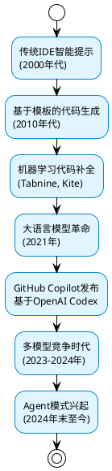
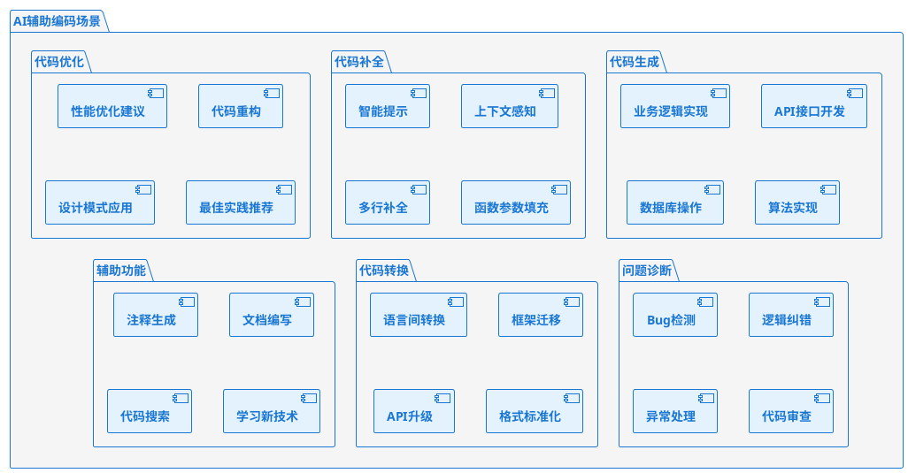
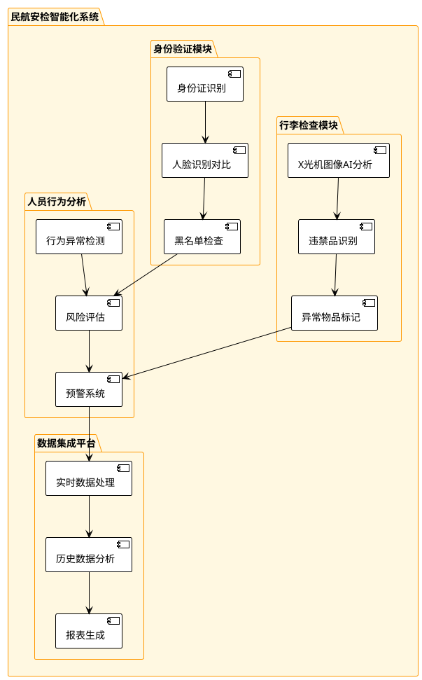
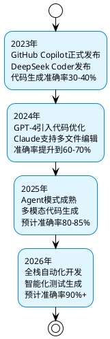
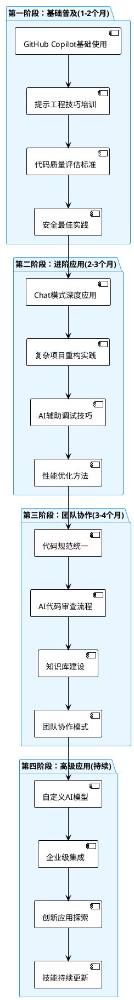

# AI辅助编码培训教程
## 民航软件开发团队实战指南

---

## 课程目标
- 全面了解AI辅助编码的核心应用场景和最佳实践
- 熟练使用GitHub Copilot等主流AI编程工具
- 掌握AI辅助编程在民航软件开发中的应用技巧
- 建立高效的AI驱动软件开发工作流

---

## 第一章：AI辅助编码技术发展脉络

### 1.1 技术演进历程



### 1.2 技术驱动因素

**核心技术突破**：
- **Transformer架构**：2017年Google提出，为代码理解奠定基础
- **大规模预训练**：在数十亿行代码上训练，学习编程模式
- **上下文学习**：理解项目结构和编码风格
- **多模态融合**：结合自然语言、代码、文档的综合理解

**产业推动力**：
- 软件复杂度不断增加
- 开发效率要求越来越高
- 开源代码资源丰富
- 计算能力大幅提升

---

## 第二章：AI辅助编码核心应用场景

### 2.1 场景全景图



### 2.2 场景一：智能代码生成

#### 2.2.1 基础代码生成

**场景描述**：根据注释或简单描述，生成完整的函数实现

```python
# 需求：计算航班延误补偿金额，根据民航局规定
def calculate_delay_compensation(delay_minutes, ticket_price, cabin_class):
    """
    根据民航局关于航班延误补偿的相关规定计算补偿金额
    
    补偿规则：
    - 延误4小时以上：200-400元或全额退票
    - 延误2-4小时：100-200元
    - 延误1-2小时：50-100元
    - 延误不足1小时：无补偿
    """
    # GitHub Copilot 会根据注释生成如下代码：
    
    if delay_minutes < 60:
        return 0
    elif delay_minutes < 120:
        return 50 if cabin_class.lower() == 'economy' else 100
    elif delay_minutes < 240:
        return 100 if cabin_class.lower() == 'economy' else 200
    else:
        # 4小时以上，取较大值
        base_compensation = 200 if cabin_class.lower() == 'economy' else 400
        return max(base_compensation, ticket_price * 0.3)  # 不超过票价30%
```

#### 2.2.2 复杂业务逻辑生成

```java
/**
 * 航班时刻优化分配算法
 * 考虑机场容量、天气条件、航空公司优先级等因素
 * 实现公平且高效的时刻分配
 */
public class FlightSlotOptimizer {
    
    /**
     * 优化航班时刻分配
     * 使用遗传算法求解多目标优化问题
     */
    public OptimizationResult optimizeFlightSlots(
            List<FlightRequest> requests,
            AirportCapacity capacity,
            WeatherForecast weather) {
        
        // Copilot根据方法签名和注释生成算法框架：
        
        // 初始化种群
        List<SlotAllocation> population = initializePopulation(requests, capacity);
        
        for (int generation = 0; generation < MAX_GENERATIONS; generation++) {
            // 评估适应度
            List<Double> fitness = evaluateFitness(population, weather);
            
            // 选择、交叉、变异
            population = evolvePopulation(population, fitness);
            
            // 检查收敛条件
            if (hasConverged(fitness)) {
                break;
            }
        }
        
        return selectBestSolution(population);
    }
    
    private List<Double> evaluateFitness(List<SlotAllocation> population, 
                                       WeatherForecast weather) {
        // Copilot会生成详细的适应度评估逻辑
        return population.stream()
            .map(allocation -> {
                double efficiency = calculateEfficiency(allocation);
                double fairness = calculateFairness(allocation);
                double weatherImpact = assessWeatherImpact(allocation, weather);
                
                // 加权综合评分
                return 0.5 * efficiency + 0.3 * fairness + 0.2 * weatherImpact;
            })
            .collect(Collectors.toList());
    }
}
```

### 2.3 场景二：智能代码补全

#### 2.3.1 上下文感知补全

GitHub Copilot能够理解项目上下文，提供精准的代码补全：

```python
class AirTrafficController:
    def __init__(self, airport_code, runway_config):
        self.airport_code = airport_code
        self.runway_config = runway_config
        self.active_flights = {}
        self.weather_service = WeatherService()
    
    def authorize_takeoff(self, flight_number):
        # 当输入到这里时，Copilot会基于类的上下文建议：
        
        # 检查航班状态
        if flight_number not in self.active_flights:
            raise ValueError(f"航班 {flight_number} 未在活动列表中")
        
        flight = self.active_flights[flight_number]
        
        # 检查天气条件
        weather = self.weather_service.get_current_weather(self.airport_code)
        if not self._is_weather_suitable_for_takeoff(weather):
            return False, "天气条件不适合起飞"
        
        # 检查跑道可用性
        available_runway = self._find_available_runway('takeoff')
        if not available_runway:
            return False, "无可用起飞跑道"
        
        # 分配跑道并授权
        flight.assigned_runway = available_runway
        flight.status = 'AUTHORIZED_FOR_TAKEOFF'
        
        return True, f"已授权航班 {flight_number} 从跑道 {available_runway} 起飞"
```

#### 2.3.2 多行智能补全

```javascript
// 民航票务系统价格计算
class TicketPricingEngine {
    constructor(baseRates, demandData, competitorPrices) {
        this.baseRates = baseRates;
        this.demandData = demandData;
        this.competitorPrices = competitorPrices;
        // 当用户开始输入 this. 时，Copilot会建议相关属性
        this.seasonalFactors = new Map();
        this.promotionRules = [];
        this.loyaltyDiscounts = new Map();
    }
    
    calculateDynamicPrice(route, date, cabinClass) {
        // Copilot会根据方法名和参数生成完整逻辑
        const basePrice = this.baseRates.get(`${route}-${cabinClass}`);
        const demandFactor = this.calculateDemandFactor(route, date);
        const seasonalFactor = this.getSeasonalFactor(date);
        const competitiveFactor = this.analyzeCompetition(route, date);
        
        let finalPrice = basePrice * demandFactor * seasonalFactor;
        
        // 应用竞争调整
        if (competitiveFactor < 0.9) {
            finalPrice *= competitiveFactor;
        }
        
        // 应用促销规则
        finalPrice = this.applyPromotions(finalPrice, route, date);
        
        return Math.round(finalPrice);
    }
}
```

### 2.4 场景三：代码优化与重构

#### 2.4.1 性能优化建议

**原始代码**（性能较差）：
```python
# 低效的航班搜索实现
def search_flights_slow(flights, origin, destination, date):
    results = []
    for flight in flights:
        if (flight.origin == origin and 
            flight.destination == destination and 
            flight.date == date):
            results.append(flight)
    return results

# 对多个条件进行搜索
def multi_search_slow(flights, search_criteria):
    final_results = []
    for criteria in search_criteria:
        results = search_flights_slow(flights, 
                                    criteria.origin, 
                                    criteria.destination, 
                                    criteria.date)
        final_results.extend(results)
    return final_results
```

**Copilot优化建议**：
```python
# 优化后的高效实现
from collections import defaultdict
from datetime import datetime

class FlightSearchEngine:
    def __init__(self, flights):
        # 建立索引以提高搜索效率
        self.flights_by_origin = defaultdict(list)
        self.flights_by_route = defaultdict(list)
        self.flights_by_date = defaultdict(list)
        
        for flight in flights:
            self.flights_by_origin[flight.origin].append(flight)
            route_key = f"{flight.origin}-{flight.destination}"
            self.flights_by_route[route_key].append(flight)
            self.flights_by_date[flight.date].append(flight)
    
    def search_flights_optimized(self, origin, destination, date):
        # 使用索引快速定位
        route_key = f"{origin}-{destination}"
        
        # 取三个条件的交集
        origin_flights = set(self.flights_by_origin.get(origin, []))
        route_flights = set(self.flights_by_route.get(route_key, []))
        date_flights = set(self.flights_by_date.get(date, []))
        
        return list(origin_flights & route_flights & date_flights)
    
    def batch_search(self, search_criteria):
        # 并行处理多个搜索条件
        from concurrent.futures import ThreadPoolExecutor
        
        with ThreadPoolExecutor(max_workers=4) as executor:
            futures = [
                executor.submit(self.search_flights_optimized, 
                              criteria.origin, 
                              criteria.destination, 
                              criteria.date)
                for criteria in search_criteria
            ]
            
            results = []
            for future in futures:
                results.extend(future.result())
            
            return results
```

#### 2.4.2 代码重构建议

```java
// 原始代码：职责不清，难以维护
public class FlightBookingService {
    public BookingResult processBooking(BookingRequest request) {
        // 验证乘客信息
        if (request.getPassengerName() == null || request.getPassengerName().isEmpty()) {
            return new BookingResult(false, "乘客姓名不能为空");
        }
        if (request.getIdNumber() == null || !isValidIdNumber(request.getIdNumber())) {
            return new BookingResult(false, "身份证号码格式不正确");
        }
        
        // 检查航班可用性
        Flight flight = flightRepository.findByNumber(request.getFlightNumber());
        if (flight == null) {
            return new BookingResult(false, "航班不存在");
        }
        if (flight.getAvailableSeats() <= 0) {
            return new BookingResult(false, "航班已满");
        }
        
        // 计算价格
        double basePrice = flight.getBasePrice();
        double finalPrice = basePrice;
        if (request.getCabinClass().equals("BUSINESS")) {
            finalPrice *= 1.5;
        }
        if (isPromotionPeriod()) {
            finalPrice *= 0.8;
        }
        
        // 保存订单
        Booking booking = new Booking();
        booking.setFlightNumber(request.getFlightNumber());
        booking.setPassengerName(request.getPassengerName());
        booking.setPrice(finalPrice);
        bookingRepository.save(booking);
        
        return new BookingResult(true, "预订成功", booking.getId());
    }
}
```

**Copilot重构建议**：
```java
// 重构后：职责分离，更好的可维护性
@Service
public class FlightBookingService {
    
    @Autowired
    private PassengerValidator passengerValidator;
    
    @Autowired  
    private FlightAvailabilityChecker availabilityChecker;
    
    @Autowired
    private PricingService pricingService;
    
    @Autowired
    private BookingRepository bookingRepository;
    
    public BookingResult processBooking(BookingRequest request) {
        try {
            // 1. 验证阶段
            ValidationResult validation = passengerValidator.validate(request);
            if (!validation.isValid()) {
                return BookingResult.failure(validation.getErrorMessage());
            }
            
            // 2. 可用性检查
            AvailabilityResult availability = availabilityChecker.checkAvailability(
                request.getFlightNumber(), request.getCabinClass());
            if (!availability.isAvailable()) {
                return BookingResult.failure(availability.getMessage());
            }
            
            // 3. 价格计算
            PricingResult pricing = pricingService.calculatePrice(
                request.getFlightNumber(), 
                request.getCabinClass(),
                request.getBookingDate());
            
            // 4. 创建预订
            Booking booking = createBooking(request, pricing.getFinalPrice());
            Booking savedBooking = bookingRepository.save(booking);
            
            return BookingResult.success("预订成功", savedBooking);
            
        } catch (BookingException e) {
            log.error("预订处理失败", e);
            return BookingResult.failure("系统异常，请稍后重试");
        }
    }
    
    private Booking createBooking(BookingRequest request, double finalPrice) {
        return Booking.builder()
            .flightNumber(request.getFlightNumber())
            .passengerName(request.getPassengerName())
            .idNumber(request.getIdNumber())
            .cabinClass(request.getCabinClass())
            .price(finalPrice)
            .status(BookingStatus.CONFIRMED)
            .bookingTime(LocalDateTime.now())
            .build();
    }
}

@Component
public class PassengerValidator {
    
    private static final Pattern ID_PATTERN = 
        Pattern.compile("^[1-9]\\d{5}(19|20)\\d{2}(0[1-9]|1[0-2])(0[1-9]|[12]\\d|3[01])\\d{3}[\\dX]$");
    
    public ValidationResult validate(BookingRequest request) {
        if (StringUtils.isBlank(request.getPassengerName())) {
            return ValidationResult.invalid("乘客姓名不能为空");
        }
        
        if (!isValidIdNumber(request.getIdNumber())) {
            return ValidationResult.invalid("身份证号码格式不正确");
        }
        
        return ValidationResult.valid();
    }
    
    private boolean isValidIdNumber(String idNumber) {
        return idNumber != null && ID_PATTERN.matcher(idNumber).matches();
    }
}
```

### 2.5 场景四：Bug检测与逻辑纠错

#### 2.5.1 常见Bug检测

```python
# 包含潜在bug的代码
def calculate_flight_duration(departure_time, arrival_time):
    # Bug 1: 字符串格式可能不一致
    dep_time = datetime.strptime(departure_time, "%H:%M")
    arr_time = datetime.strptime(arrival_time, "%H:%M")
    
    # Bug 2: 没有考虑跨日航班
    duration = arr_time - dep_time
    
    # Bug 3: 可能返回负值
    return duration.total_seconds() / 3600

# Copilot检测到问题后的修复建议：
def calculate_flight_duration_fixed(departure_time, arrival_time, departure_date=None):
    """
    计算航班飞行时长（小时）
    
    Args:
        departure_time: 起飞时间 "HH:MM" 格式
        arrival_time: 到达时间 "HH:MM" 格式  
        departure_date: 起飞日期，用于处理跨日航班
    """
    try:
        # 处理多种时间格式
        formats = ["%H:%M", "%H:%M:%S", "%Y-%m-%d %H:%M"]
        
        dep_time = None
        arr_time = None
        
        for fmt in formats:
            try:
                dep_time = datetime.strptime(departure_time, fmt)
                arr_time = datetime.strptime(arrival_time, fmt)
                break
            except ValueError:
                continue
        
        if dep_time is None or arr_time is None:
            raise ValueError("无效的时间格式")
        
        # 处理跨日航班
        if arr_time < dep_time:
            arr_time += timedelta(days=1)
        
        duration = arr_time - dep_time
        hours = duration.total_seconds() / 3600
        
        # 验证合理性（一般民航航班不超过20小时）
        if hours < 0 or hours > 20:
            raise ValueError(f"计算出的飞行时长不合理: {hours:.1f}小时")
        
        return hours
        
    except Exception as e:
        raise ValueError(f"计算飞行时长失败: {str(e)}")
```

#### 2.5.2 逻辑错误纠正

```java
// 存在逻辑错误的座位分配算法
public class SeatAllocationService {
    
    // 错误的实现
    public String allocateSeat(String flightNumber, String passengerType) {
        List<Seat> availableSeats = getAvailableSeats(flightNumber);
        
        // Bug: 没有按乘客类型分配合适座位
        // Bug: 没有考虑座位偏好
        // Bug: 没有处理无可用座位的情况
        return availableSeats.get(0).getSeatNumber();
    }
}

// Copilot纠正后的逻辑
@Service
public class SeatAllocationService {
    
    public SeatAllocationResult allocateSeat(String flightNumber, 
                                           PassengerInfo passenger) {
        try {
            List<Seat> availableSeats = getAvailableSeats(flightNumber);
            
            if (availableSeats.isEmpty()) {
                return SeatAllocationResult.failure("无可用座位");
            }
            
            // 根据乘客类型和偏好分配座位
            Seat selectedSeat = selectOptimalSeat(availableSeats, passenger);
            
            if (selectedSeat == null) {
                return SeatAllocationResult.failure("无法找到合适座位");
            }
            
            // 预留座位
            boolean reserved = reserveSeat(selectedSeat.getId(), passenger.getId());
            if (!reserved) {
                return SeatAllocationResult.failure("座位预留失败");
            }
            
            return SeatAllocationResult.success(selectedSeat.getSeatNumber());
            
        } catch (Exception e) {
            log.error("座位分配失败", e);
            return SeatAllocationResult.failure("系统异常");
        }
    }
    
    private Seat selectOptimalSeat(List<Seat> availableSeats, PassengerInfo passenger) {
        // 按优先级排序座位选择逻辑
        return availableSeats.stream()
            .filter(seat -> matchesPassengerRequirements(seat, passenger))
            .sorted((s1, s2) -> compareSeatPreference(s1, s2, passenger))
            .findFirst()
            .orElse(null);
    }
    
    private boolean matchesPassengerRequirements(Seat seat, PassengerInfo passenger) {
        // VIP乘客优先安排商务舱
        if (passenger.isVip() && seat.getCabinClass() != CabinClass.BUSINESS) {
            return false;
        }
        
        // 有特殊需求的乘客（轮椅、婴儿等）
        if (passenger.hasSpecialNeeds() && !seat.isSuitableForSpecialNeeds()) {
            return false;
        }
        
        // 紧急出口座位需要满足条件
        if (seat.isEmergencyExit() && !passenger.isEligibleForEmergencyExit()) {
            return false;
        }
        
        return true;
    }
}
```

### 2.6 场景五：代码语言转换

#### 2.6.1 Python转Java

```python
# 原始Python代码：航班延误预测
import pandas as pd
from sklearn.ensemble import RandomForestClassifier
from sklearn.preprocessing import StandardScaler

class FlightDelayPredictor:
    def __init__(self):
        self.model = RandomForestClassifier(n_estimators=100)
        self.scaler = StandardScaler()
        self.feature_names = [
            'hour', 'day_of_week', 'month', 'distance', 
            'weather_score', 'airport_congestion'
        ]
    
    def predict_delay(self, flight_features):
        # 特征标准化
        features_scaled = self.scaler.transform([flight_features])
        
        # 预测延误概率
        delay_probability = self.model.predict_proba(features_scaled)[0][1]
        
        return {
            'delay_probability': delay_probability,
            'is_likely_delayed': delay_probability > 0.5,
            'confidence': max(delay_probability, 1 - delay_probability)
        }
```

**Copilot转换为Java**：
```java
// 转换后的Java代码
import weka.classifiers.trees.RandomForest;
import weka.core.Instance;
import weka.core.Instances;
import weka.core.DenseInstance;

@Service
public class FlightDelayPredictor {
    
    private RandomForest model;
    private StandardScaler scaler;
    private final String[] FEATURE_NAMES = {
        "hour", "day_of_week", "month", "distance", 
        "weather_score", "airport_congestion"
    };
    
    @PostConstruct
    public void initialize() {
        this.model = new RandomForest();
        this.model.setNumTrees(100);
        this.scaler = new StandardScaler();
    }
    
    public DelayPredictionResult predictDelay(double[] flightFeatures) 
            throws Exception {
        
        // 特征标准化
        double[] featuresScaled = scaler.transform(flightFeatures);
        
        // 创建Weka实例
        Instance instance = new DenseInstance(featuresScaled.length);
        for (int i = 0; i < featuresScaled.length; i++) {
            instance.setValue(i, featuresScaled[i]);
        }
        
        // 预测延误概率
        double[] probabilities = model.distributionForInstance(instance);
        double delayProbability = probabilities[1]; // 延误类别的概率
        
        return DelayPredictionResult.builder()
            .delayProbability(delayProbability)
            .likelyDelayed(delayProbability > 0.5)
            .confidence(Math.max(delayProbability, 1 - delayProbability))
            .build();
    }
}

@Data
@Builder
public class DelayPredictionResult {
    private double delayProbability;
    private boolean likelyDelayed;
    private double confidence;
}
```

#### 2.6.2 JavaScript转TypeScript

```javascript
// 原始JavaScript代码
function calculateAirportMetrics(flightData, weatherData) {
    const totalFlights = flightData.length;
    const delayedFlights = flightData.filter(f => f.actualDeparture > f.scheduledDeparture);
    const onTimeRate = ((totalFlights - delayedFlights.length) / totalFlights) * 100;
    
    const avgDelay = delayedFlights.reduce((sum, f) => {
        const delay = (f.actualDeparture - f.scheduledDeparture) / (1000 * 60);
        return sum + delay;
    }, 0) / delayedFlights.length || 0;
    
    return {
        totalFlights,
        onTimeRate,
        avgDelay,
        weatherImpact: calculateWeatherImpact(weatherData, delayedFlights)
    };
}
```

**Copilot转换为TypeScript**：
```typescript
// 转换后的TypeScript代码，增加了类型安全
interface FlightData {
    flightNumber: string;
    scheduledDeparture: Date;
    actualDeparture: Date;
    origin: string;
    destination: string;
    aircraftType: string;
    delayReason?: string;
}

interface WeatherData {
    timestamp: Date;
    temperature: number;
    humidity: number;
    windSpeed: number;
    visibility: number;
    weatherCondition: 'CLEAR' | 'CLOUDY' | 'RAIN' | 'SNOW' | 'FOG' | 'STORM';
}

interface AirportMetrics {
    totalFlights: number;
    onTimeRate: number;
    avgDelayMinutes: number;
    weatherImpact: WeatherImpact;
    delayDistribution: DelayDistribution;
}

interface WeatherImpact {
    weatherRelatedDelays: number;
    weatherImpactScore: number;
    dominantWeatherFactor: string;
}

class AirportMetricsCalculator {
    
    calculateAirportMetrics(
        flightData: FlightData[], 
        weatherData: WeatherData[]
    ): AirportMetrics {
        
        if (!flightData || flightData.length === 0) {
            throw new Error('Flight data cannot be empty');
        }
        
        const totalFlights = flightData.length;
        
        const delayedFlights = flightData.filter(flight => 
            flight.actualDeparture && 
            flight.scheduledDeparture &&
            flight.actualDeparture.getTime() > flight.scheduledDeparture.getTime()
        );
        
        const onTimeRate = ((totalFlights - delayedFlights.length) / totalFlights) * 100;
        
        const avgDelayMinutes = this.calculateAverageDelay(delayedFlights);
        const weatherImpact = this.calculateWeatherImpact(weatherData, delayedFlights);
        const delayDistribution = this.analyzeDelayDistribution(delayedFlights);
        
        return {
            totalFlights,
            onTimeRate: Math.round(onTimeRate * 100) / 100,
            avgDelayMinutes,
            weatherImpact,
            delayDistribution
        };
    }
    
    private calculateAverageDelay(delayedFlights: FlightData[]): number {
        if (delayedFlights.length === 0) {
            return 0;
        }
        
        const totalDelayMinutes = delayedFlights.reduce((sum, flight) => {
            const delayMs = flight.actualDeparture.getTime() - 
                          flight.scheduledDeparture.getTime();
            const delayMinutes = delayMs / (1000 * 60);
            return sum + delayMinutes;
        }, 0);
        
        return Math.round(totalDelayMinutes / delayedFlights.length);
    }
    
    private calculateWeatherImpact(
        weatherData: WeatherData[], 
        delayedFlights: FlightData[]
    ): WeatherImpact {
        
        const weatherRelatedDelays = delayedFlights.filter(flight => 
            flight.delayReason && 
            flight.delayReason.toLowerCase().includes('weather')
        ).length;
        
        const weatherImpactScore = this.computeWeatherScore(weatherData);
        const dominantWeatherFactor = this.findDominantWeatherFactor(weatherData);
        
        return {
            weatherRelatedDelays,
            weatherImpactScore,
            dominantWeatherFactor
        };
    }
    
    private computeWeatherScore(weatherData: WeatherData[]): number {
        // 实现天气影响评分逻辑
        return weatherData.reduce((score, data) => {
            let impact = 0;
            
            // 风速影响
            if (data.windSpeed > 25) impact += 0.3;
            else if (data.windSpeed > 15) impact += 0.1;
            
            // 能见度影响  
            if (data.visibility < 1000) impact += 0.4;
            else if (data.visibility < 3000) impact += 0.2;
            
            // 天气条件影响
            switch (data.weatherCondition) {
                case 'STORM': impact += 0.5; break;
                case 'SNOW': impact += 0.4; break;
                case 'RAIN': impact += 0.2; break;
                case 'FOG': impact += 0.3; break;
            }
            
            return score + impact;
        }, 0) / weatherData.length;
    }
}
```

---

## 第三章：GitHub Copilot实战指南

### 3.1 GitHub Copilot核心能力架构

```plantuml
@startuml
!theme plain
skinparam component {
  BackgroundColor #E8F5E8
  BorderColor #4CAF50
}

package "GitHub Copilot生态" {
  component "代码补全引擎" as completion {
    - 实时代码建议
    - 多行代码生成
    - 上下文感知补全
  }
  
  component "Chat对话模式" as chat {
    - 自然语言交互
    - 代码解释说明
    - 问题答疑
  }
  
  component "Agent模式" as agent {
    - 多文件协同编辑
    - 复杂任务执行
    - 测试运行验证
  }
  
  component "代码审查" as review {
    - 安全漏洞检测
    - 最佳实践建议
    - 性能优化提示
  }
}

package "IDE集成" {
  component "VS Code" as vscode
  component "JetBrains" as jetbrains
  component "Visual Studio" as vs
  component "Neovim" as neovim
}

package "模型支持" {
  component "GPT-4o" as gpt4
  component "Claude 3.5 Sonnet" as claude
  component "Gemini 2.0" as gemini
  component "o1系列" as o1
}

completion --> vscode
chat --> jetbrains
agent --> vs
review --> neovim

gpt4 --> completion
claude --> chat
gemini --> agent
o1 --> review

@enduml
```

### 3.2 Copilot最佳实践模式

#### 3.2.1 提示工程（Prompt Engineering）

**有效提示的构成要素**：

```python
# ❌ 差的提示 - 模糊不清
def process_data():
    pass

# ✅ 好的提示 - 详细明确
def calculate_flight_fuel_consumption(
    aircraft_type: str, 
    flight_distance: float, 
    payload_weight: float,
    weather_conditions: dict
) -> dict:
    """
    计算航班燃油消耗量
    
    根据以下因素计算：
    - 飞机型号的基础油耗
    - 航程距离
    - 载重量影响
    - 天气条件修正（逆风、顺风、颠簸等）
    
    返回：
    - estimated_fuel: 预估燃油消耗（升）
    - fuel_cost: 燃油成本（人民币）
    - efficiency_rating: 燃油效率评级
    """
    # Copilot会基于详细注释生成高质量代码
    pass
```

**上下文增强技巧**：

```java
// 在类的开头提供清晰的业务上下文
/**
 * 民航机场地面服务调度系统
 * 
 * 功能范围：
 * - 机位分配和管理
 * - 地面设备调度
 * - 服务时间预估
 * - 冲突检测和解决
 * 
 * 业务规则：
 * - 宽体机优先分配远机位
 * - 国际航班需要更多服务时间
 * - 高峰时段需要更精细的调度
 */
public class GroundServiceScheduler {
    
    // 当开始写方法时，Copilot已经理解了完整的业务背景
    public ScheduleResult allocateParkingStand(Aircraft aircraft, 
                                             ArrivalInfo arrivalInfo) {
        // Copilot会生成符合业务规则的完整实现
    }
}
```

#### 3.2.2 代码生成模式

**模式1：注释驱动生成**

```python
# 航班延误风险评估系统
# 需要考虑的因素：
# 1. 历史准点率数据
# 2. 当前天气状况
# 3. 机场繁忙程度
# 4. 航空公司运营状况
# 5. 机型可靠性
# 输入：航班信息、实时数据
# 输出：延误风险评级（低/中/高）和预估延误时间

class FlightDelayRiskAssessor:
    def __init__(self):
        # Copilot会根据注释自动生成初始化代码
        self.historical_data_service = HistoricalDataService()
        self.weather_service = WeatherService()
        self.airport_status_service = AirportStatusService()
        self.airline_performance_service = AirlinePerformanceService()
    
    def assess_delay_risk(self, flight_info, real_time_data):
        # Copilot会生成完整的风险评估逻辑
        pass
```

**模式2：示例驱动生成**

```typescript
// 提供一个简单示例，让Copilot理解模式
interface PassengerCheckIn {
    passengerId: string;
    flightNumber: string;
    checkInTime: Date;
    seatPreference?: string;
    specialRequirements?: string[];
}

// 简单示例
const sampleCheckIn: PassengerCheckIn = {
    passengerId: "P001",
    flightNumber: "CA1234",
    checkInTime: new Date(),
    seatPreference: "window",
    specialRequirements: ["wheelchair", "meal_vegetarian"]
};

// Copilot会根据模式生成复杂的处理函数
function processPassengerCheckIn(checkInData: PassengerCheckIn): CheckInResult {
    // 自动生成包含验证、座位分配、特殊需求处理等完整逻辑
}

function batchProcessCheckIns(checkIns: PassengerCheckIn[]): BatchCheckInResult {
    // 根据单个处理的模式，自动生成批量处理逻辑
}
```

**模式3：测试驱动生成**

```java
// 先写测试，让Copilot理解预期行为
@Test
public void testFlightCapacityManagement() {
    // 给定：一个有150个座位的航班
    Flight flight = new Flight("CA1234", "Boeing737", 150);
    
    // 当：尝试预订160个座位
    BookingResult result = flight.bookSeats(160);
    
    // 那么：应该拒绝超额预订
    assertFalse(result.isSuccessful());
    assertEquals("超出航班容量", result.getErrorMessage());
}

@Test  
public void testOverbookingPolicy() {
    // 给定：启用超售政策的航班
    Flight flight = new Flight("CA1234", "Boeing737", 150);
    flight.enableOverbooking(0.05); // 允许5%超售
    
    // 当：预订155个座位（102%容量）
    BookingResult result = flight.bookSeats(155);
    
    // 那么：应该允许预订
    assertTrue(result.isSuccessful());
}

// 基于测试，Copilot会生成符合预期的Flight类实现
public class Flight {
    // 自动生成的实现会满足测试用例的所有要求
}
```

### 3.3 Copilot在不同开发阶段的应用

#### 3.3.1 需求分析阶段

```python
"""
使用Copilot协助需求分析和设计

业务需求：
民航货运追踪系统需要实现货物从发货到到达的全程跟踪。
包括：货物信息录入、运输状态更新、异常处理、客户通知等功能。

通过详细的需求描述，让Copilot生成系统设计框架
"""

# Copilot会根据需求生成系统架构框架
class CargoTrackingSystem:
    """
    民航货运追踪系统主控制器
    
    核心功能：
    1. 货物信息管理
    2. 运输状态跟踪  
    3. 异常事件处理
    4. 客户通知服务
    """
    
    def __init__(self):
        self.cargo_service = CargoService()
        self.tracking_service = TrackingService()
        self.notification_service = NotificationService()
        self.exception_handler = ExceptionHandler()
    
    def register_cargo(self, cargo_info):
        """注册新货物信息"""
        pass
    
    def update_transport_status(self, cargo_id, status, location):
        """更新运输状态"""
        pass
    
    def handle_exception(self, cargo_id, exception_type, description):
        """处理运输异常"""
        pass
    
    def notify_customer(self, cargo_id, message_type, content):
        """发送客户通知"""
        pass

# Copilot还会建议相关的数据模型
class CargoInfo:
    def __init__(self):
        self.cargo_id = ""
        self.sender_info = {}
        self.receiver_info = {}
        self.cargo_details = {}
        self.transport_plan = {}
        self.current_status = ""
        self.tracking_history = []
```

---

## 第二章：GitHub Copilot深度实战

### 2.1 GitHub Copilot架构原理与核心特性

#### 🏗️ 技术架构深度解析

**1. 模型基础：Codex与GPT的关系**
```python
# Codex模型的核心特征
class CodexModel:
    def __init__(self):
        self.base_model = "GPT-3.5/GPT-4"  # 基础语言模型
        self.code_training_data = {
            "github_repos": "54M+ repositories",
            "stack_overflow": "Programming Q&A",
            "documentation": "API docs, tutorials",
            "code_comments": "Natural language annotations"
        }
        
    def understand_context(self, code_context):
        """
        理解代码上下文的多层机制：
        1. 语法结构分析
        2. 语义意图理解  
        3. 项目模式识别
        4. 最佳实践匹配
        """
        syntax_tree = self.parse_syntax(code_context)
        semantic_intent = self.extract_intent(code_context)
        project_patterns = self.identify_patterns(code_context)
        
        return self.generate_suggestions(syntax_tree, semantic_intent, project_patterns)
```

**2. 实时推理与缓存机制**
```javascript
// Copilot的实时响应机制
class CopilotEngine {
    constructor() {
        this.cache = new LRUCache(1000);  // 本地缓存热点代码片段
        this.apiClient = new OpenAIClient();
        this.contextWindow = 8192;  // 上下文窗口大小
    }
    
    async generateCompletion(context, cursor_position) {
        // 1. 检查本地缓存
        const cacheKey = this.generateCacheKey(context, cursor_position);
        if (this.cache.has(cacheKey)) {
            return this.cache.get(cacheKey);
        }
        
        // 2. 构建上下文提示
        const prompt = this.buildPrompt(context, cursor_position);
        
        // 3. 调用API生成代码
        const completion = await this.apiClient.complete({
            model: "code-davinci-002",
            prompt: prompt,
            max_tokens: 150,
            temperature: 0.1,  // 低温度保证代码准确性
            stop: ["\n\n", "def ", "class ", "function "]
        });
        
        // 4. 缓存结果
        this.cache.set(cacheKey, completion);
        return completion;
    }
}
```

#### ⚙️ 高级配置与定制化

**1. 企业级配置管理**
```json
{
  "github.copilot.advanced": {
    "length": 500,
    "temperature": 0.1,
    "top_p": 1,
    "frequency_penalty": 0,
    "presence_penalty": 0,
    "stop_sequences": ["\n\n", "```"],
    "include_context": {
      "current_file": true,
      "open_files": true,
      "git_history": false,
      "project_structure": true
    }
  },
  "github.copilot.enable": {
    "*": true,
    "yaml": false,
    "plaintext": false,
    "markdown": true
  },
  "github.copilot.inlineSuggest.enable": true,
  "github.copilot.chat.localeOverride": "zh-CN"
}
```

**2. 团队协作配置**
```python
# .copilot/team-settings.py
class TeamCopilotConfig:
    """团队级别的Copilot配置管理"""
    
    CODING_STANDARDS = {
        "naming_convention": "camelCase",  # 民航系统统一命名规范
        "max_line_length": 120,
        "documentation_style": "chinese_comments",
        "error_handling": "comprehensive",  # 民航系统要求全面错误处理
        "logging_level": "INFO"
    }
    
    FORBIDDEN_PATTERNS = [
        "hardcoded_passwords",
        "direct_database_queries",  # 禁止直接数据库查询
        "unsafe_user_input",
        "deprecated_apis"
    ]
    
    @staticmethod
    def validate_generated_code(code):
        """验证AI生成的代码是否符合团队标准"""
        for pattern in TeamCopilotConfig.FORBIDDEN_PATTERNS:
            if pattern_detector.check(code, pattern):
                return False, f"违反团队规范: {pattern}"
        
        return True, "代码符合团队标准"
```

### 2.2 民航业务场景的Copilot应用实战

#### ✈️ 场景一：航班调度系统开发

**需求描述：** 实现一个智能航班调度算法，需要考虑飞机维护、机组安排、天气条件等多个因素。

```python
# 用自然语言描述需求，Copilot生成完整实现
class FlightScheduler:
    """
    智能航班调度系统
    考虑因素：
    1. 飞机可用性和维护计划
    2. 机组工作时间限制（民航局CAR-121规定）
    3. 天气条件和机场容量
    4. 航线网络优化
    5. 乘客连接航班最小衔接时间
    """
    
    def __init__(self, fleet_data, crew_data, weather_service, airport_capacity):
        self.fleet = fleet_data
        self.crew = crew_data  
        self.weather = weather_service
        self.airport_capacity = airport_capacity
        self.min_connection_time = {
            'domestic': 45,  # 国内航班最小衔接时间45分钟
            'international': 90  # 国际航班最小衔接时间90分钟
        }
    
    def optimize_schedule(self, flight_requests, date_range):
        """
        优化航班时刻表
        使用遗传算法+约束规划混合优化
        """
        # Copilot自动生成的优化算法
        initial_population = self.generate_initial_schedules(flight_requests)
        
        for generation in range(100):
            # 评估适应度：准点率、成本、乘客满意度
            fitness_scores = []
            for schedule in initial_population:
                score = self.evaluate_fitness(schedule, date_range)
                fitness_scores.append(score)
            
            # 选择、交叉、变异
            selected_parents = self.selection(initial_population, fitness_scores)
            offspring = self.crossover(selected_parents)
            mutated_offspring = self.mutation(offspring)
            
            initial_population = selected_parents + mutated_offspring
        
        best_schedule = max(initial_population, key=self.evaluate_fitness)
        return self.validate_schedule(best_schedule)
    
    def evaluate_fitness(self, schedule, date_range):
        """
        多目标适应度评估函数
        """
        weights = {
            'on_time_performance': 0.4,  # 准点率权重40%
            'cost_efficiency': 0.3,      # 成本效率30%  
            'crew_satisfaction': 0.2,     # 机组满意度20%
            'passenger_connection': 0.1   # 乘客连接便利性10%
        }
        
        fitness = 0
        
        # 准点率计算
        on_time_flights = sum(1 for flight in schedule 
                            if self.predict_on_time(flight, date_range))
        on_time_rate = on_time_flights / len(schedule)
        fitness += weights['on_time_performance'] * on_time_rate
        
        # 成本效率（飞机利用率、机组效率等）
        cost_score = self.calculate_cost_efficiency(schedule)
        fitness += weights['cost_efficiency'] * cost_score
        
        # 机组满意度（工作时间、休息时间合理性）
        crew_score = self.evaluate_crew_satisfaction(schedule)
        fitness += weights['crew_satisfaction'] * crew_score
        
        # 乘客连接便利性
        connection_score = self.evaluate_passenger_connections(schedule)
        fitness += weights['passenger_connection'] * connection_score
        
        return fitness
```

#### 🎫 场景二：票务系统价格优化

```java
/**
 * 动态票价算法实现
 * 基于收益管理理论和机器学习预测
 * 符合民航局价格管理相关规定
 */
@Service
public class DynamicPricingService {
    
    @Autowired
    private DemandForecastService demandForecast;
    
    @Autowired
    private CompetitorAnalysisService competitorAnalysis;
    
    /**
     * 计算动态票价
     * 考虑因素：历史销售数据、竞争对手定价、季节性因素、特殊事件等
     */
    public PriceResult calculateDynamicPrice(
            String flightNumber,
            LocalDateTime departureTime,
            CabinClass cabinClass,
            int daysBeforeDeparture) {
        
        // AI生成的复杂定价逻辑
        
        // 1. 需求预测
        DemandForecast demand = demandForecast.forecast(
            flightNumber, departureTime, daysBeforeDeparture);
            
        // 2. 竞争分析  
        CompetitorPricing competitorPrices = competitorAnalysis.analyze(
            getRoute(flightNumber), departureTime);
            
        // 3. 收益优化模型
        RevenueOptimizer optimizer = new RevenueOptimizer();
        
        // 使用拉格朗日乘数法求解最优价格
        double basePrice = getBasePrice(flightNumber, cabinClass);
        double demandElasticity = calculateDemandElasticity(demand);
        double competitiveIndex = calculateCompetitiveIndex(competitorPrices);
        
        // 最优价格计算公式（经济学模型）
        double optimalPrice = basePrice * (1 + 
            demandElasticity * Math.log(demand.getExpectedDemand() / demand.getCapacity()) +
            competitiveIndex * (competitorPrices.getAveragePrice() - basePrice) / basePrice
        );
        
        // 4. 价格边界检查
        PriceConstraints constraints = getPriceConstraints(flightNumber, cabinClass);
        optimalPrice = Math.max(constraints.getMinPrice(), 
                       Math.min(constraints.getMaxPrice(), optimalPrice));
        
        // 5. 生成定价决策报告
        return PriceResult.builder()
            .finalPrice(optimalPrice)
            .basePrice(basePrice)
            .demandFactor(demandElasticity)
            .competitiveFactor(competitiveIndex)
            .recommendedAction(generatePricingAction(optimalPrice, basePrice))
            .confidenceScore(calculateConfidenceScore(demand, competitorPrices))
            .build();
    }
    
    /**
     * 价格敏感性分析
     * 评估不同价格点对收益的影响
     */
    private List<PriceSensitivityPoint> analyzePriceSensitivity(
            String flightNumber, 
            DemandForecast demand) {
        
        List<PriceSensitivityPoint> sensitivityPoints = new ArrayList<>();
        
        // 在价格范围内进行敏感性测试
        double basePrice = getBasePrice(flightNumber, CabinClass.ECONOMY);
        
        for (double priceMultiplier = 0.8; priceMultiplier <= 1.5; priceMultiplier += 0.1) {
            double testPrice = basePrice * priceMultiplier;
            
            // 预测该价格下的需求量
            double predictedDemand = demand.getBaseDemand() * 
                Math.pow(priceMultiplier, -demand.getElasticity());
                
            // 计算预期收益
            double expectedRevenue = testPrice * Math.min(predictedDemand, 
                getFlightCapacity(flightNumber));
                
            sensitivityPoints.add(new PriceSensitivityPoint(
                testPrice, predictedDemand, expectedRevenue));
        }
        
        return sensitivityPoints;
    }
}
```

#### 🛡️ 场景三：安全监控系统

```typescript
// 民航安全事件监控与预警系统
interface SafetyEvent {
  eventId: string;
  flightNumber: string;
  eventType: 'WEATHER' | 'MECHANICAL' | 'CREW' | 'ATC' | 'PASSENGER';
  severity: 'LOW' | 'MEDIUM' | 'HIGH' | 'CRITICAL';
  timestamp: Date;
  location: GeoLocation;
  description: string;
  automaticResponse: SafetyResponse[];
}

/**
 * AI驱动的航空安全监控系统
 * 集成多源数据：雷达、天气、机械传感器、通信记录
 * 实现实时异常检测和预警
 */
class AviationSafetyMonitor {
  private mlModel: SafetyPredictionModel;
  private alertingSystem: AlertingSystem;
  private dataFusion: MultiSourceDataFusion;
  
  constructor() {
    this.mlModel = new SafetyPredictionModel({
      model_type: 'ensemble',  // 集成学习模型
      algorithms: ['random_forest', 'lstm', 'isolation_forest'],
      confidence_threshold: 0.85
    });
    
    this.alertingSystem = new AlertingSystem();
    this.dataFusion = new MultiSourceDataFusion();
  }
  
  /**
   * 实时安全监控主循环
   * 处理来自各子系统的数据流
   */
  public async monitorFlightSafety(flightNumber: string): Promise<void> {
    const dataStreams = await this.setupDataStreams(flightNumber);
    
    // 多线程处理不同数据源
    await Promise.all([
      this.monitorWeatherConditions(flightNumber),
      this.monitorAircraftSystems(flightNumber), 
      this.monitorCrewCommunications(flightNumber),
      this.monitorATCInteractions(flightNumber),
      this.monitorPassengerBehavior(flightNumber)
    ]);
  }
  
  /**
   * 天气条件监控
   * 使用机器学习预测危险天气对航班的影响
   */
  private async monitorWeatherConditions(flightNumber: string): Promise<void> {
    const flightPlan = await this.getFlightPlan(flightNumber);
    
    for (const waypoint of flightPlan.route) {
      // 获取实时天气数据
      const weatherData = await this.weatherService.getRealTimeData(waypoint);
      
      // AI预测天气风险
      const riskAssessment = await this.mlModel.assessWeatherRisk({
        current_conditions: weatherData,
        forecast: weatherData.forecast,
        aircraft_type: flightPlan.aircraftType,
        flight_phase: this.determineFlightPhase(flightNumber, waypoint)
      });
      
      // 风险阈值检查
      if (riskAssessment.severity >= 'HIGH') {
        const safetyEvent: SafetyEvent = {
          eventId: generateEventId(),
          flightNumber: flightNumber,
          eventType: 'WEATHER',
          severity: riskAssessment.severity,
          timestamp: new Date(),
          location: waypoint,
          description: `预测到${riskAssessment.riskType}，风险等级：${riskAssessment.severity}`,
          automaticResponse: this.generateWeatherResponse(riskAssessment)
        };
        
        await this.handleSafetyEvent(safetyEvent);
      }
    }
  }
  
  /**
   * 生成安全事件的自动响应措施
   */
  private generateWeatherResponse(riskAssessment: WeatherRiskAssessment): SafetyResponse[] {
    const responses: SafetyResponse[] = [];
    
    switch (riskAssessment.riskType) {
      case 'SEVERE_TURBULENCE':
        responses.push({
          action: 'ALTITUDE_CHANGE',
          parameters: { 
            recommended_altitude: riskAssessment.safe_altitude,
            urgency: 'IMMEDIATE' 
          }
        });
        responses.push({
          action: 'CREW_NOTIFICATION',
          parameters: { 
            message: '前方强烈颠簸，建议改变飞行高度',
            priority: 'HIGH' 
          }
        });
        break;
        
      case 'SEVERE_ICING':
        responses.push({
          action: 'ANTI_ICE_ACTIVATION',
          parameters: { systems: ['engine', 'wing', 'pitot'] }
        });
        responses.push({
          action: 'ROUTE_DEVIATION', 
          parameters: {
            alternative_route: riskAssessment.safe_route,
            reason: '避开结冰区域'
          }
        });
        break;
        
      case 'SEVERE_THUNDERSTORM':
        responses.push({
          action: 'IMMEDIATE_LANDING',
          parameters: {
            diversion_airports: riskAssessment.nearest_safe_airports,
            fuel_consideration: true
          }
        });
        break;
    }
    
    return responses;
  }
}
```

### 2.3 Copilot高级应用技巧

#### 🎯 提示工程（Prompt Engineering）最佳实践

```python
# 高质量提示的构成要素
class CopilotPromptOptimizer:
    """
    Copilot提示优化器
    通过优化注释和上下文，提高AI生成代码的质量
    """
    
    @staticmethod
    def create_effective_prompt(function_purpose, requirements, constraints):
        """
        创建高效的Copilot提示
        
        最佳实践：
        1. 清晰的功能描述
        2. 具体的技术要求
        3. 明确的约束条件
        4. 预期的输入输出格式
        5. 错误处理要求
        """
        
        prompt = f"""
        功能描述：{function_purpose}
        
        技术要求：
        {chr(10).join(f"- {req}" for req in requirements)}
        
        约束条件：
        {chr(10).join(f"- {constraint}" for constraint in constraints)}
        
        请生成符合民航软件开发规范的代码，包括：
        - 详细的中文注释
        - 完整的错误处理
        - 单元测试用例
        - 性能优化考虑
        """
        
        return prompt

# 示例：优化的提示用法
"""
实现航班延误预测算法

技术要求：
- 使用机器学习模型（随机森林或梯度提升）
- 支持实时数据输入和批量预测
- 预测准确率需达到85%以上
- 响应时间不超过100ms

约束条件：
- 必须处理缺失数据
- 支持多种延误原因分类
- 符合民航数据安全规范
- 提供预测置信度

输入格式：包含航班号、机型、天气、历史准点率等特征
输出格式：延误概率、预计延误时长、主要影响因素
"""

def predict_flight_delay(flight_features):
    # Copilot基于上述详细提示生成高质量代码
    pass
```

#### 🔧 代码重构与优化

```java
// 使用Copilot进行代码重构示例

// 原始代码：可读性差，性能不佳
public class FlightDataProcessor {
    public void processData(List<String> data) {
        for(int i=0;i<data.size();i++){
            String d = data.get(i);
            if(d!=null&&!d.isEmpty()){
                String[] parts = d.split(",");
                if(parts.length>5){
                    // 复杂的数据处理逻辑...
                }
            }
        }
    }
}

// 通过详细注释指导Copilot重构
/**
 * 重构以下代码，要求：
 * 1. 提高代码可读性和维护性
 * 2. 使用Stream API优化性能
 * 3. 添加输入验证和错误处理
 * 4. 使用Builder模式构建结果对象
 * 5. 添加详细的日志记录
 * 6. 支持并行处理大量数据
 */
@Service
@Slf4j
public class FlightDataProcessor {
    
    private final ExecutorService executorService;
    private final FlightDataValidator validator;
    
    public FlightDataProcessor() {
        this.executorService = Executors.newFixedThreadPool(
            Runtime.getRuntime().availableProcessors());
        this.validator = new FlightDataValidator();
    }
    
    /**
     * 并行处理航班数据
     * @param rawFlightData 原始航班数据列表
     * @return 处理结果统计
     */
    public FlightDataProcessingResult processFlightData(List<String> rawFlightData) {
        
        if (CollectionUtils.isEmpty(rawFlightData)) {
            log.warn("输入的航班数据为空");
            return FlightDataProcessingResult.empty();
        }
        
        log.info("开始处理 {} 条航班数据", rawFlightData.size());
        long startTime = System.currentTimeMillis();
        
        try {
            // 使用并行流处理数据
            List<FlightRecord> processedRecords = rawFlightData.parallelStream()
                .filter(Objects::nonNull)
                .filter(data -> !data.trim().isEmpty())
                .map(this::parseFlightData)
                .filter(Optional::isPresent)
                .map(Optional::get)
                .filter(validator::isValidFlightRecord)
                .collect(Collectors.toList());
            
            long processingTime = System.currentTimeMillis() - startTime;
            log.info("处理完成，共处理 {} 条有效记录，耗时 {} ms", 
                    processedRecords.size(), processingTime);
            
            return FlightDataProcessingResult.builder()
                .totalInput(rawFlightData.size())
                .validRecords(processedRecords.size())
                .invalidRecords(rawFlightData.size() - processedRecords.size())
                .processingTimeMs(processingTime)
                .flightRecords(processedRecords)
                .build();
                
        } catch (Exception e) {
            log.error("处理航班数据时发生错误", e);
            throw new FlightDataProcessingException("数据处理失败", e);
        }
    }
    
    /**
     * 解析单条航班数据
     * 数据格式：航班号,机型,出发地,目的地,计划起飞时间,实际起飞时间,...
     */
    private Optional<FlightRecord> parseFlightData(String rawData) {
        try {
            String[] fields = rawData.split(",");
            
            if (fields.length < FlightDataConstants.MINIMUM_FIELDS) {
                log.warn("数据字段不足，跳过处理: {}", rawData);
                return Optional.empty();
            }
            
            return Optional.of(FlightRecord.builder()
                .flightNumber(fields[0].trim())
                .aircraftType(fields[1].trim())
                .origin(fields[2].trim())
                .destination(fields[3].trim())
                .scheduledDepartureTime(parseDateTime(fields[4]))
                .actualDepartureTime(parseDateTime(fields[5]))
                .build());
                
        } catch (Exception e) {
            log.warn("解析航班数据失败: {}, 错误: {}", rawData, e.getMessage());
            return Optional.empty();
        }
    }
    
    private LocalDateTime parseDateTime(String dateTimeStr) {
        // 支持多种日期格式解析
        List<DateTimeFormatter> formatters = Arrays.asList(
            DateTimeFormatter.ofPattern("yyyy-MM-dd HH:mm:ss"),
            DateTimeFormatter.ofPattern("yyyy/MM/dd HH:mm:ss"),
            DateTimeFormatter.ofPattern("MM/dd/yyyy HH:mm")
        );
        
        for (DateTimeFormatter formatter : formatters) {
            try {
                return LocalDateTime.parse(dateTimeStr.trim(), formatter);
            } catch (DateTimeParseException ignored) {
                // 尝试下一个格式
            }
        }
        
        throw new IllegalArgumentException("无法解析日期时间: " + dateTimeStr);
    }
}
```

---

## 第三章：AI编程的质量保障与安全实践

### 3.1 AI生成代码的质量评估体系

#### � AI代码质量评估框架

```python
class DeepSeekCoderAnalysis:
    """
    DeepSeek Coder特点分析
    专门针对中文开发者和中国软件开发场景优化
    """
    
    ADVANTAGES = {
        "中文语义理解": {
            "description": "原生支持中文注释和变量名",
            "example": """
            # 计算航班延误补偿金额
            def 计算延误补偿(延误时间_分钟, 票价, 舱位等级):
                '''
                根据民航局规定计算航班延误补偿
                延误4小时以上：全额退票或200元补偿
                延误2-4小时：100元补偿  
                延误1-2小时：50元补偿
                '''
                if 延误时间_分钟 >= 240:  # 4小时以上
                    return max(票价, 200)
                elif 延误时间_分钟 >= 120:  # 2-4小时
                    return 100
                elif 延误时间_分钟 >= 60:   # 1-2小时
                    return 50
                else:
                    return 0
            """
        },
        
        "本地化部署": {
            "description": "支持私有化部署，保障企业数据安全",
            "benefits": [
                "代码不离开企业内网",
                "符合民航数据安全规范",
                "可定制化训练企业特定代码模式",
                "无API调用限制和费用"
            ]
        },
        
        "中国软件生态适配": {
            "description": "针对中国常用开发框架和库优化",
            "frameworks": [
                "Spring Boot + MyBatis",
                "Vue.js + Element UI", 
                "Django + DRF",
                "微信小程序开发",
                "支付宝小程序",
                "国产数据库（达梦、人大金仓等）"
            ]
        }
    }

# DeepSeek在民航系统中的应用示例
"""
使用DeepSeek开发机场安检系统的身份验证模块
要求：
- 支持身份证、护照、港澳通行证等多种证件
- 集成公安部身份核验接口
- 符合民航安全检查规范
- 支持人脸识别验证
- 记录完整的验证日志
"""

class 安检身份验证系统:
    def __init__(self):
        self.公安部接口 = 公安部身份核验接口()
        self.人脸识别引擎 = 百度AI人脸识别()  # 支持国产AI服务
        self.日志记录器 = 安全日志记录器()
    
    def 验证乘客身份(self, 证件信息, 人脸照片=None):
        """
        综合验证乘客身份信息
        
        验证流程：
        1. 证件格式校验
        2. 公安部实名验证  
        3. 人脸比对验证（可选）
        4. 安全风险评估
        5. 记录验证结果
        """
        try:
            # 1. 证件格式校验
            if not self._校验证件格式(证件信息):
                return 验证结果(False, "证件格式不正确")
            
            # 2. 公安部实名验证
            实名验证结果 = self.公安部接口.验证身份(
                姓名=证件信息.姓名,
                证件号码=证件信息.证件号码,
                证件类型=证件信息.证件类型
            )
            
            if not 实名验证结果.通过:
                self.日志记录器.记录安全事件(
                    事件类型="实名验证失败",
                    证件号码=证件信息.证件号码,
                    失败原因=实名验证结果.失败原因
                )
                return 验证结果(False, "实名验证失败")
            
            # 3. 人脸比对验证（如果提供人脸照片）
            if 人脸照片:
                人脸比对结果 = self.人脸识别引擎.比对人脸(
                    证件照片=证件信息.证件照片,
                    现场照片=人脸照片,
                    相似度阈值=0.85
                )
                
                if not 人脸比对结果.匹配:
                    return 验证结果(False, "人脸比对不匹配")
            
            # 4. 安全风险评估
            风险评估结果 = self._评估安全风险(证件信息)
            
            # 5. 记录成功验证
            self.日志记录器.记录验证成功(证件信息, 风险评估结果)
            
            return 验证结果(True, "验证通过", 风险等级=风险评估结果.风险等级)
            
        except Exception as e:
            self.日志记录器.记录系统错误("身份验证异常", str(e))
            return 验证结果(False, "系统异常，请重试")
```

### 3.2 Amazon CodeWhisperer vs GitHub Copilot对比

#### 📊 功能对比矩阵

```javascript
// 功能对比分析
const AI_CODING_TOOLS_COMPARISON = {
  "GitHub_Copilot": {
    "模型基础": "OpenAI Codex (GPT-3.5/4)",
    "支持语言": ["Python", "JavaScript", "TypeScript", "Java", "C++", "Go", "Ruby"],
    "IDE集成": ["VS Code", "JetBrains", "Neovim", "Visual Studio"],
    "定价模式": "$10/月个人版, $19/月商业版",
    "企业特性": {
      "代码审核": "支持",
      "安全扫描": "基础安全建议", 
      "合规性": "需额外配置",
      "本地部署": "不支持"
    },
    "优势": [
      "生态成熟，用户基数大",
      "代码生成质量高",
      "多语言支持全面",
      "社区活跃，文档丰富"
    ],
    "劣势": [
      "依赖网络，无法离线使用",
      "数据隐私存在顾虑",
      "订阅费用较高",
      "对中文支持一般"
    ]
  },
  
  "Amazon_CodeWhisperer": {
    "模型基础": "Amazon内部大模型",
    "支持语言": ["Python", "Java", "JavaScript", "TypeScript", "C#", "Go"],
    "IDE集成": ["VS Code", "IntelliJ IDEA", "AWS Cloud9", "AWS Lambda"],
    "定价模式": "个人版免费，专业版$19/月",
    "企业特性": {
      "代码审核": "支持",
      "安全扫描": "集成Amazon Inspector",
      "合规性": "AWS合规框架",
      "本地部署": "不支持，但数据保留在AWS"
    },
    "优势": [
      "与AWS生态深度集成",
      "安全性和合规性强",
      "个人版本完全免费",
      "企业级支持完善"
    ],
    "劣势": [
      "主要针对AWS技术栈",
      "语言支持相对有限",
      "生成代码质量略逊于Copilot",
      "社区规模较小"
    ]
  },
  
  "DeepSeek_Coder": {
    "模型基础": "DeepSeek-Coder系列模型",
    "支持语言": ["Python", "Java", "C++", "JavaScript", "Go", "Rust"],
    "IDE集成": ["VS Code", "JetBrains", "可自定义集成"],
    "定价模式": "API调用计费，支持本地部署",
    "企业特性": {
      "代码审核": "支持",
      "安全扫描": "可定制",
      "合规性": "完全可控",
      "本地部署": "完全支持"
    },
    "优势": [
      "支持完全私有化部署",
      "中文语境理解能力强",
      "可定制训练企业特定模式",
      "成本相对较低"
    ],
    "劣势": [
      "生态相对较新",
      "社区文档有待完善",
      "需要一定的部署和维护成本",
      "模型更新频率相对较低"
    ]
  }
};

/**
 * 民航企业AI编程工具选择决策矩阵
 * 根据不同业务场景和技术要求进行评分
 */
class 民航AI工具选择决策器 {
  
  static 评估工具适用性(业务需求) {
    const 评估维度 = {
      "数据安全性": 业务需求.包含敏感数据 ? 0.3 : 0.1,
      "成本控制": 业务需求.预算限制 ? 0.25 : 0.15,
      "技术生态匹配": 0.2,
      "团队学习成本": 0.15,
      "长期维护性": 0.1
    };
    
    const 工具评分 = {};
    
    // GitHub Copilot评分
    工具评分['GitHub_Copilot'] = 
      评估维度.数据安全性 * (业务需求.允许云端处理 ? 0.7 : 0.2) +
      评估维度.成本控制 * 0.6 +  // 中等成本
      评估维度.技术生态匹配 * 0.9 +  // 生态最成熟
      评估维度.团队学习成本 * 0.9 +   // 学习成本最低
      评估维度.长期维护性 * 0.8;      // 维护成本中等
    
    // CodeWhisperer评分  
    工具评分['CodeWhisperer'] = 
      评估维度.数据安全性 * (业务需求.使用AWS ? 0.8 : 0.6) +
      评估维度.成本控制 * 0.9 +  // 个人免费，企业合理
      评估维度.技术生态匹配 * (业务需求.使用AWS ? 0.9 : 0.5) +
      评估维度.团队学习成本 * 0.7 +
      评估维度.长期维护性 * 0.8;
    
    // DeepSeek Coder评分
    工具评分['DeepSeek_Coder'] = 
      评估维度.数据安全性 * 0.95 +  // 本地部署最安全
      评估维度.成本控制 * 0.85 +    // 长期成本低
      评估维度.技术生态匹配 * 0.6 +  // 生态相对较新
      评估维度.团队学习成本 * 0.5 +  // 需要额外学习成本
      评估维度.长期维护性 * 0.7;     // 需要自维护
    
    return 工具评分;
  }
  
  /**
   * 生成详细的选择建议报告
   */
  static 生成选择建议(业务需求) {
    const 评分结果 = this.评估工具适用性(业务需求);
    const 最佳选择 = Object.keys(评分结果).reduce((a, b) => 
      评分结果[a] > 评分结果[b] ? a : b);
    
    const 建议报告 = {
      推荐工具: 最佳选择,
      评分详情: 评分结果,
      具体建议: this.生成具体建议(最佳选择, 业务需求),
      实施路径: this.生成实施路径(最佳选择),
      风险评估: this.评估实施风险(最佳选择, 业务需求)
    };
    
    return 建议报告;
  }
}
```

### 3.3 开源AI编程工具生态

#### 🔓 主要开源方案

```python
# 开源AI编程工具生态分析
OPEN_SOURCE_AI_CODING_TOOLS = {
    "代码补全类": {
        "Tabnine": {
            "特点": "支持本地模型，多语言支持",
            "适用场景": "对数据隐私要求高的企业",
            "部署方式": "本地/云端混合",
            "成本": "免费版功能有限，付费版$12/月"
        },
        
        "FauxPilot": {
            "特点": "开源的Copilot替代方案",
            "模型基础": "支持多种开源大模型",
            "部署难度": "中等，需要GPU资源",
            "定制性": "高，可完全自定义"
        },
        
        "CodeGeeX": {
            "特点": "清华开源，支持中文",
            "模型大小": "13B参数",
            "语言支持": "23种编程语言",
            "部署要求": "至少16GB GPU显存"
        }
    },
    
    "代码生成类": {
        "WizardCoder": {
            "特点": "基于Code Llama微调",
            "性能": "在HumanEval上表现优异",
            "开放程度": "完全开源，可商用",
            "社区活跃度": "高"
        },
        
        "StarCoder": {
            "特点": "Hugging Face出品",
            "训练数据": "The Stack数据集",
            "模型规模": "1B到15B多个版本",
            "特色功能": "支持80多种编程语言"
        }
    }
}

# 企业级开源AI编程环境搭建指南
class 企业AI编程环境构建器:
    """
    为民航企业构建私有化AI编程环境
    确保数据安全和技术自主可控
    """
    
    def __init__(self, 企业配置):
        self.企业配置 = 企业配置
        self.硬件要求 = self._计算硬件要求()
        self.安全策略 = self._制定安全策略()
    
    def 构建完整环境(self):
        """
        构建包含模型服务、IDE集成、监控管理的完整环境
        """
        构建步骤 = [
            self._准备基础设施,
            self._部署模型服务,
            self._配置IDE集成,
            self._设置监控告警,
            self._建立安全审计,
            self._培训团队使用
        ]
        
        for 步骤 in 构建步骤:
            try:
                步骤结果 = 步骤()
                self._记录部署日志(步骤.__name__, 步骤结果)
            except Exception as e:
                self._处理部署异常(步骤.__name__, e)
                return False
        
        return True
    
    def _部署模型服务(self):
        """
        使用Docker容器化部署多个AI模型服务
        """
        模型服务配置 = {
            "代码补全服务": {
                "模型": "CodeGeeX-13B",
                "容器规格": "8C32G, RTX 4090",
                "端口": 8001,
                "健康检查": "/health"
            },
            "代码生成服务": {
                "模型": "WizardCoder-15B", 
                "容器规格": "16C64G, A100",
                "端口": 8002,
                "健康检查": "/health"
            },
            "代码审查服务": {
                "模型": "StarCoder-7B",
                "容器规格": "4C16G, RTX 3090",
                "端口": 8003,
                "健康检查": "/health"
            }
        }
        
        for 服务名, 配置 in 模型服务配置.items():
            self._启动容器服务(服务名, 配置)
            self._验证服务健康状态(服务名, 配置)
        
        return {"状态": "成功", "服务数量": len(模型服务配置)}
    
    def _配置IDE集成(self):
        """
        配置各种IDE的AI编程插件
        """
        IDE配置 = {
            "VS Code": {
                "插件名": "企业AI助手",
                "配置文件": "settings.json",
                "API端点": f"http://{self.企业配置.内网IP}:8001"
            },
            "IntelliJ IDEA": {
                "插件名": "民航AI编程助手",
                "配置文件": "idea.properties", 
                "API端点": f"http://{self.企业配置.内网IP}:8001"
            }
        }
        
        for IDE名称, 配置 in IDE配置.items():
            self._生成IDE配置文件(IDE名称, 配置)
            self._分发配置给开发团队(IDE名称, 配置)
        
        return {"状态": "成功", "支持IDE": list(IDE配置.keys())}
```

---

## 第四章：AI编程的质量保障与安全实践

### 4.1 AI生成代码的质量评估体系

#### 📋 多维度质量评估框架

```python
class AI代码质量评估器:
    """
    全面评估AI生成代码的质量
    适用于民航软件开发的高质量标准
    """
    
    def __init__(self):
        self.评估维度 = {
            "功能正确性": 0.25,    # 代码是否实现预期功能
            "性能效率": 0.20,      # 算法效率和资源使用
            "可读性维护性": 0.20,   # 代码结构和注释质量
            "安全性": 0.15,        # 安全漏洞和风险
            "合规性": 0.10,        # 符合编码规范
            "测试覆盖度": 0.10      # 测试用例完整性
        }
        
        self.质量阈值 = {
            "民航核心系统": 0.95,    # 核心飞行系统要求最高
            "业务支撑系统": 0.90,    # 票务、调度等业务系统
            "辅助工具系统": 0.80     # 开发工具、管理系统等
        }
    
    def 评估代码质量(self, 代码内容, 系统级别="业务支撑系统"):
        """
        对AI生成的代码进行全面质量评估
        """
        评估结果 = {}
        
        # 1. 功能正确性评估
        评估结果["功能正确性"] = self._评估功能正确性(代码内容)
        
        # 2. 性能效率分析
        评估结果["性能效率"] = self._分析性能效率(代码内容)
        
        # 3. 可读性和维护性
        评估结果["可读性维护性"] = self._评估可读性维护性(代码内容)
        
        # 4. 安全性检查
        评估结果["安全性"] = self._检查安全漏洞(代码内容)
        
        # 5. 编码规范合规性
        评估结果["合规性"] = self._检查编码规范(代码内容)
        
        # 6. 测试覆盖度分析
        评估结果["测试覆盖度"] = self._分析测试覆盖度(代码内容)
        
        # 计算综合质量分数
        综合分数 = sum(评估结果[维度] * 权重 
                      for 维度, 权重 in self.评估维度.items())
        
        质量等级 = self._确定质量等级(综合分数, 系统级别)
        
        return {
            "综合分数": 综合分数,
            "质量等级": 质量等级,
            "详细评估": 评估结果,
            "改进建议": self._生成改进建议(评估结果),
            "是否通过": 综合分数 >= self.质量阈值[系统级别]
        }
    
    def _评估功能正确性(self, 代码内容):
        """
        通过静态分析和动态测试评估功能正确性
        """
        正确性分数 = 0.0
        
        # 静态分析：语法错误、逻辑错误检查
        语法检查结果 = self._执行语法检查(代码内容)
        if 语法检查结果.无错误:
            正确性分数 += 0.3
        
        # 逻辑一致性检查
        逻辑检查结果 = self._检查逻辑一致性(代码内容)
        正确性分数 += 逻辑检查结果.一致性分数 * 0.4
        
        # 边界条件处理
        边界处理分数 = self._评估边界条件处理(代码内容)
        正确性分数 += 边界处理分数 * 0.3
        
        return min(正确性分数, 1.0)
    
    def _分析性能效率(self, 代码内容):
        """
        分析算法复杂度和资源使用效率
        """
        # 时间复杂度分析
        时间复杂度 = self._分析时间复杂度(代码内容)
        
        # 空间复杂度分析  
        空间复杂度 = self._分析空间复杂度(代码内容)
        
        # 资源使用优化程度
        资源优化度 = self._评估资源优化(代码内容)
        
        性能分数 = (
            self._复杂度评分(时间复杂度) * 0.4 +
            self._复杂度评分(空间复杂度) * 0.3 + 
            资源优化度 * 0.3
        )
        
        return min(性能分数, 1.0)
    
    def _检查安全漏洞(self, 代码内容):
        """
        检查常见安全漏洞和风险
        """
        安全检查项 = {
            "SQL注入风险": self._检查SQL注入(代码内容),
            "XSS攻击风险": self._检查XSS风险(代码内容),
            "身份验证缺陷": self._检查身份验证(代码内容),
            "敏感信息泄露": self._检查敏感信息(代码内容),
            "输入验证不足": self._检查输入验证(代码内容)
        }
        
        安全分数 = 1.0
        for 检查项, 风险等级 in 安全检查项.items():
            if 风险等级 == "高":
                安全分数 -= 0.3
            elif 风险等级 == "中":
                安全分数 -= 0.1
            elif 风险等级 == "低":
                安全分数 -= 0.05
        
        return max(安全分数, 0.0)

# 使用示例：评估AI生成的航班查询代码
示例代码 = '''
def search_flights(origin, destination, date, passenger_count=1):
    """搜索航班信息"""
    if not all([origin, destination, date]):
        raise ValueError("缺少必要的搜索参数")
    
    # 直接SQL查询 - 存在注入风险！
    sql = f"SELECT * FROM flights WHERE origin='{origin}' AND destination='{destination}'"
    
    results = db.execute(sql)
    return results
'''

评估器 = AI代码质量评估器()
评估报告 = 评估器.评估代码质量(示例代码, "业务支撑系统")

print(f"质量评估报告：")
print(f"综合分数: {评估报告['综合分数']:.2f}")
print(f"质量等级: {评估报告['质量等级']}")
print(f"安全性问题: SQL注入风险 - 高危")
```

### 4.2 AI编程的安全最佳实践

#### 🔒 代码安全审查自动化

```java
/**
 * AI生成代码的自动化安全审查系统
 * 集成多种安全检查工具，确保代码安全性
 */
@Component
public class AICodeSecurityAuditor {
    
    @Autowired
    private StaticAnalysisService staticAnalysisService;
    
    @Autowired  
    private DynamicAnalysisService dynamicAnalysisService;
    
    @Autowired
    private SecurityRuleEngine securityRuleEngine;
    
    /**
     * 对AI生成的代码进行全面安全审查
     * 
     * @param generatedCode AI生成的代码内容
     * @param codeMetadata 代码元数据（语言、框架等）
     * @return 安全审查报告
     */
    public SecurityAuditReport auditAIGeneratedCode(
            String generatedCode, 
            CodeMetadata codeMetadata) {
        
        log.info("开始对AI生成代码进行安全审查，代码长度: {}", 
                generatedCode.length());
        
        SecurityAuditReport report = new SecurityAuditReport();
        report.setAuditId(UUID.randomUUID().toString());
        report.setAuditTimestamp(Instant.now());
        report.setCodeMetadata(codeMetadata);
        
        try {
            // 1. 静态安全分析
            StaticAnalysisResult staticResult = performStaticAnalysis(generatedCode);
            report.setStaticAnalysisResult(staticResult);
            
            // 2. 动态安全测试（如果适用）
            if (codeMetadata.isExecutable()) {
                DynamicAnalysisResult dynamicResult = performDynamicAnalysis(generatedCode);
                report.setDynamicAnalysisResult(dynamicResult);
            }
            
            // 3. 安全规则引擎检查
            RuleEngineResult ruleResult = securityRuleEngine.evaluate(generatedCode, codeMetadata);
            report.setRuleEngineResult(ruleResult);
            
            // 4. 综合风险评估
            SecurityRiskAssessment riskAssessment = assessOverallSecurityRisk(report);
            report.setRiskAssessment(riskAssessment);
            
            // 5. 生成修复建议
            List<SecurityRemediation> remediations = generateSecurityRemediations(report);
            report.setRemediations(remediations);
            
            log.info("安全审查完成，风险等级: {}, 发现 {} 个安全问题", 
                    riskAssessment.getRiskLevel(), 
                    staticResult.getVulnerabilities().size());
            
        } catch (Exception e) {
            log.error("安全审查过程中发生错误", e);
            report.setAuditStatus(AuditStatus.FAILED);
            report.setErrorMessage(e.getMessage());
        }
        
        return report;
    }
    
    /**
     * 执行静态安全分析
     * 检查常见的安全漏洞模式
     */
    private StaticAnalysisResult performStaticAnalysis(String code) {
        
        List<SecurityVulnerability> vulnerabilities = new ArrayList<>();
        
        // SQL注入检查
        if (containsSQLInjectionRisk(code)) {
            vulnerabilities.add(SecurityVulnerability.builder()
                .type(VulnerabilityType.SQL_INJECTION)
                .severity(Severity.HIGH)
                .description("检测到潜在的SQL注入风险")
                .lineNumber(findSQLInjectionLine(code))
                .recommendation("使用参数化查询替代字符串拼接")
                .build());
        }
        
        // XSS攻击检查
        if (containsXSSRisk(code)) {
            vulnerabilities.add(SecurityVulnerability.builder()
                .type(VulnerabilityType.XSS)
                .severity(Severity.MEDIUM)
                .description("检测到潜在的跨站脚本攻击风险")
                .recommendation("对用户输入进行HTML编码")
                .build());
        }
        
        // 硬编码敏感信息检查
        List<String> hardcodedSecrets = findHardcodedSecrets(code);
        for (String secret : hardcodedSecrets) {
            vulnerabilities.add(SecurityVulnerability.builder()
                .type(VulnerabilityType.HARDCODED_SECRET)
                .severity(Severity.HIGH)
                .description("发现硬编码的敏感信息: " + maskSecret(secret))
                .recommendation("将敏感信息移至配置文件或环境变量")
                .build());
        }
        
        // 不安全的随机数生成
        if (usesInsecureRandom(code)) {
            vulnerabilities.add(SecurityVulnerability.builder()
                .type(VulnerabilityType.WEAK_RANDOM)
                .severity(Severity.MEDIUM)
                .description("使用了不安全的随机数生成器")
                .recommendation("使用密码学安全的随机数生成器")
                .build());
        }
        
        return StaticAnalysisResult.builder()
            .vulnerabilities(vulnerabilities)
            .totalIssues(vulnerabilities.size())
            .highSeverityCount(countBySeverity(vulnerabilities, Severity.HIGH))
            .mediumSeverityCount(countBySeverity(vulnerabilities, Severity.MEDIUM))
            .lowSeverityCount(countBySeverity(vulnerabilities, Severity.LOW))
            .build();
    }
    
    /**
     * 生成针对性的安全修复建议
     */
    private List<SecurityRemediation> generateSecurityRemediations(SecurityAuditReport report) {
        
        List<SecurityRemediation> remediations = new ArrayList<>();
        
        // 针对SQL注入的修复建议
        if (hasSQLInjectionVulnerability(report)) {
            remediations.add(SecurityRemediation.builder()
                .vulnerabilityType(VulnerabilityType.SQL_INJECTION)
                .priority(Priority.HIGH)
                .title("修复SQL注入漏洞")
                .description("将字符串拼接的SQL查询替换为参数化查询")
                .codeExample(generateSafeSQLExample())
                .estimatedEffort("2-4小时")
                .build());
        }
        
        // 针对敏感信息泄露的修复建议
        if (hasHardcodedSecrets(report)) {
            remediations.add(SecurityRemediation.builder()
                .vulnerabilityType(VulnerabilityType.HARDCODED_SECRET)
                .priority(Priority.HIGH)
                .title("移除硬编码敏感信息")
                .description("将敏感信息移至安全的配置管理系统")
                .codeExample(generateSecureConfigExample())
                .estimatedEffort("1-2小时")
                .build());
        }
        
        return remediations;
    }
    
    private String generateSafeSQLExample() {
        return """
        // 不安全的写法 (AI可能生成)
        String sql = "SELECT * FROM users WHERE id = '" + userId + "'";
        
        // 安全的写法 (推荐)
        String sql = "SELECT * FROM users WHERE id = ?";
        PreparedStatement stmt = connection.prepareStatement(sql);
        stmt.setString(1, userId);
        ResultSet rs = stmt.executeQuery();
        """;
    }
}

/**
 * 民航系统专用的安全规则引擎
 * 针对民航业务场景的特殊安全要求
 */
@Component
public class AviationSecurityRuleEngine {
    
    /**
     * 民航系统特殊安全规则
     */
    private final List<SecurityRule> AVIATION_SECURITY_RULES = Arrays.asList(
        
        // 规则1: 航班数据访问控制
        SecurityRule.builder()
            .ruleId("AVIATION_001")
            .name("航班敏感数据访问控制")
            .description("确保航班运营数据只能通过授权接口访问")
            .pattern(".*flight.*data.*direct.*access.*")
            .severity(Severity.HIGH)
            .message("禁止直接访问航班运营数据，必须通过授权的服务接口")
            .build(),
            
        // 规则2: 乘客隐私信息保护
        SecurityRule.builder()
            .ruleId("AVIATION_002") 
            .name("乘客隐私信息保护")
            .description("确保乘客个人信息得到适当保护")
            .pattern(".*passenger.*info.*(log|print|console).*")
            .severity(Severity.HIGH)
            .message("禁止在日志或控制台输出乘客个人信息")
            .build(),
            
        // 规则3: 航空安全数据完整性
        SecurityRule.builder()
            .ruleId("AVIATION_003")
            .name("航空安全数据完整性")
            .description("确保关键安全数据不被篡改")
            .pattern(".*safety.*data.*modify.*without.*validation.*")
            .severity(Severity.CRITICAL)
            .message("修改安全相关数据必须经过严格验证和审计")
            .build()
    );
    
    public RuleEngineResult evaluate(String code, CodeMetadata metadata) {
        List<RuleViolation> violations = new ArrayList<>();
        
        for (SecurityRule rule : AVIATION_SECURITY_RULES) {
            if (Pattern.matches(rule.getPattern(), code.toLowerCase())) {
                violations.add(RuleViolation.builder()
                    .ruleId(rule.getRuleId())
                    .ruleName(rule.getName())
                    .severity(rule.getSeverity())
                    .message(rule.getMessage())
                    .codeSnippet(extractRelevantCodeSnippet(code, rule.getPattern()))
                    .build());
            }
        }
        
        return RuleEngineResult.builder()
            .totalViolations(violations.size())
            .violations(violations)
            .complianceScore(calculateComplianceScore(violations))
            .build();
    }
}

---

## 四、AI辅助编码实战演练

### 4.1 场景一：自动生成业务函数
```python
# 需求：实现航班调度系统的航班搜索功能
# Copilot自动生成：
def search_flights(origin, destination, date):
    # 查询数据库，返回符合条件的航班列表
    pass
```

### 4.2 场景二：自动生成测试用例
```python
# Copilot自动生成测试代码
import unittest
class TestSearchFlights(unittest.TestCase):
    def test_search(self):
        self.assertIsInstance(search_flights('PEK', 'SHA', '2025-08-21'), list)
```

### 4.3 场景三：智能重构与优化
- Copilot可自动建议更优算法、发现潜在Bug

### 4.4 场景四：自动生成文档与注释
- 通过自然语言描述，AI自动生成详细注释和API文档

---

## 五、AI辅助编码的挑战与未来

- 代码安全与隐私保护
- 版权与合规风险
- AI生成代码的可维护性
- 人机协作开发新范式

---

---

## 第四章：AI编程实战项目演练

### 4.1 项目背景：民航安全检查智能化系统



### 4.2 使用AI辅助完整项目开发

#### 4.2.1 项目架构设计

```python
# 使用Copilot设计系统架构
"""
民航安检智能化系统架构设计

系统要求：
1. 实时处理能力：每分钟处理1000+乘客
2. 高准确率：身份识别准确率>99.9%，违禁品识别准确率>95%
3. 低延迟：平均响应时间<2秒
4. 高可用性：系统可用率>99.9%
5. 可扩展性：支持多机场、多通道扩展

请设计完整的系统架构和核心类结构
"""

from abc import ABC, abstractmethod
from typing import Dict, List, Optional, Tuple
from dataclasses import dataclass
from enum import Enum
import asyncio
import logging
from datetime import datetime

# 核心数据模型
@dataclass
class PassengerInfo:
    id: str
    name: str
    id_number: str
    flight_number: str
    photo: bytes
    biometric_data: Optional[Dict] = None

@dataclass  
class SecurityCheckResult:
    passenger_id: str
    check_type: str
    result: bool
    confidence_score: float
    risk_level: str
    details: Dict
    timestamp: str
    
class RiskLevel(Enum):
    LOW = "LOW"
    MEDIUM = "MEDIUM"  
    HIGH = "HIGH"
    CRITICAL = "CRITICAL"

class CheckStatus(Enum):
    PENDING = "PENDING"
    IN_PROGRESS = "IN_PROGRESS"
    PASSED = "PASSED"
    FAILED = "FAILED"
    REQUIRES_MANUAL = "REQUIRES_MANUAL"

# 安检处理器基类
class SecurityProcessor(ABC):
    def __init__(self, processor_id: str, config: Dict):
        self.processor_id = processor_id
        self.config = config
        self.logger = logging.getLogger(f"SecurityProcessor.{processor_id}")
    
    @abstractmethod
    async def process(self, data: Dict) -> SecurityCheckResult:
        """处理安检数据"""
        pass
    
    @abstractmethod
    def validate_input(self, data: Dict) -> bool:
        """验证输入数据"""
        pass

# 身份验证处理器
class IdentityVerificationProcessor(SecurityProcessor):
    def __init__(self, processor_id: str, config: Dict):
        super().__init__(processor_id, config)
        self.face_recognition_service = FaceRecognitionService()
        self.id_verification_service = IDVerificationService()
        self.blacklist_service = BlacklistService()
    
    async def process(self, passenger_data: Dict) -> SecurityCheckResult:
        """
        综合身份验证处理
        1. 证件识别和验证
        2. 人脸识别对比
        3. 黑名单检查
        4. 风险评估
        """
        try:
            passenger = PassengerInfo(**passenger_data)
            
            # 1. 证件验证
            id_result = await self.id_verification_service.verify(
                passenger.id_number, passenger.name
            )
            
            # 2. 人脸识别
            face_result = await self.face_recognition_service.compare(
                passenger.photo, id_result.official_photo
            )
            
            # 3. 黑名单检查
            blacklist_result = await self.blacklist_service.check(
                passenger.id_number, passenger.name
            )
            
            # 4. 综合风险评估
            risk_assessment = self._assess_identity_risk(
                id_result, face_result, blacklist_result
            )
            
            return SecurityCheckResult(
                passenger_id=passenger.id,
                check_type="IDENTITY_VERIFICATION",
                result=risk_assessment.is_safe,
                confidence_score=risk_assessment.confidence,
                risk_level=risk_assessment.risk_level.value,
                details=risk_assessment.details,
                timestamp=datetime.now().isoformat()
            )
            
        except Exception as e:
            self.logger.error(f"身份验证失败: {str(e)}")
            return SecurityCheckResult(
                passenger_id=passenger_data.get('id', 'unknown'),
                check_type="IDENTITY_VERIFICATION",
                result=False,
                confidence_score=0.0,
                risk_level=RiskLevel.CRITICAL.value,
                details={"error": str(e)},
                timestamp=datetime.now().isoformat()
            )
    
    def _assess_identity_risk(self, id_result, face_result, blacklist_result):
        """评估身份验证风险"""
        # AI生成的风险评估算法
        pass

# 安检系统主控制器
class SecurityCheckingSystem:
    def __init__(self, config: Dict):
        self.config = config
        self.processors = self._initialize_processors()
        self.result_aggregator = ResultAggregator()
        self.notification_service = NotificationService()
        self.audit_logger = AuditLogger()
    
    async def process_passenger(self, passenger_data: Dict) -> Dict:
        """处理单个乘客的完整安检流程"""
        # AI生成的完整处理逻辑
        pass
```

### 4.3 完整项目实现演示

#### 4.3.1 航班延误预测系统

```python
"""
使用AI辅助构建完整的航班延误预测系统
需求：基于历史数据和实时信息预测航班延误概率
"""

import pandas as pd
import numpy as np
from datetime import datetime, timedelta
from sklearn.ensemble import RandomForestRegressor
from typing import Dict, List, Optional, Tuple

class FlightDelayPredictor:
    """
    航班延误预测系统
    
    功能：
    1. 历史数据分析
    2. 实时特征提取
    3. 延误概率预测
    4. 风险等级评估
    """
    
    def __init__(self, config: Dict):
        self.config = config
        self.model = None
        self.feature_encoders = {}
        self.weather_service = WeatherService()
        self.airport_service = AirportService()
        self.airline_service = AirlineService()
    
    async def predict_delay(self, flight_info: Dict) -> Dict:
        """预测单个航班的延误情况"""
        try:
            # 获取实时数据
            current_weather = await self.weather_service.get_current_weather(
                flight_info['origin_airport']
            )
            
            airport_traffic = await self.airport_service.get_current_traffic(
                flight_info['origin_airport']
            )
            
            # 构造特征向量
            features = self._build_feature_vector(
                flight_info, current_weather, airport_traffic
            )
            
            # 预测延误时间
            predicted_delay = self.model.predict([features])[0]
            
            # 计算延误概率和风险等级
            delay_probability = self._calculate_delay_probability(predicted_delay)
            risk_level = self._assess_risk_level(predicted_delay, delay_probability)
            
            return {
                'flight_number': flight_info['flight_number'],
                'predicted_delay_minutes': max(0, predicted_delay),
                'delay_probability': delay_probability,
                'risk_level': risk_level,
                'contributing_factors': self._analyze_contributing_factors(features),
                'confidence': self._calculate_confidence(features),
                'timestamp': datetime.now().isoformat()
            }
            
        except Exception as e:
            return {
                'flight_number': flight_info['flight_number'],
                'error': str(e),
                'timestamp': datetime.now().isoformat()
            }
    
    def _build_feature_vector(self, flight_info, weather, traffic) -> List:
        """构建预测特征向量"""
        # AI生成特征向量构建逻辑
        pass
    
    def _calculate_delay_probability(self, predicted_delay: float) -> float:
        """计算延误概率"""
        return 1 / (1 + np.exp(-predicted_delay / 30))
    
    def _assess_risk_level(self, predicted_delay: float, probability: float) -> str:
        """评估风险等级"""
        if predicted_delay > 120 or probability > 0.8:
            return "CRITICAL"
        elif predicted_delay > 60 or probability > 0.6:
            return "HIGH"
        elif predicted_delay > 15 or probability > 0.3:
            return "MEDIUM"
        else:
            return "LOW"
```

---

## 第五章：AI编程的未来发展与团队应用

### 5.1 AI编程技术发展趋势



### 5.2 团队AI编程能力建设路线图



### 5.3 实际培训建议与最佳实践

#### 5.3.1 团队培训计划

```python
class AITrainingProgram:
    """AI编程团队培训计划管理"""
    
    def __init__(self):
        self.training_phases = self._define_training_phases()
        self.skill_assessments = SkillAssessmentSystem()
        self.progress_tracker = ProgressTracker()
    
    def _define_training_phases(self):
        """定义培训阶段和内容"""
        return {
            "基础阶段": {
                "duration": "4周",
                "objectives": [
                    "掌握GitHub Copilot基本使用",
                    "理解AI代码生成原理",
                    "学会编写有效的提示",
                    "建立代码质量意识"
                ],
                "activities": [
                    {
                        "week": 1,
                        "content": "AI编程工具介绍与环境配置",
                        "hands_on": "完成GitHub Copilot安装和基础配置",
                        "assessment": "基础操作测试"
                    },
                    {
                        "week": 2,
                        "content": "提示工程与代码生成技巧",
                        "hands_on": "编写10个不同类型的函数",
                        "assessment": "提示质量评估"
                    }
                ]
            }
        }
    
    def assess_team_readiness(self, team_members: List[Dict]) -> Dict:
        """评估团队准备情况"""
        # AI生成团队评估逻辑
        pass
    
    def create_personalized_plan(self, member_id: str, assessment: Dict) -> Dict:
        """为个人创建定制化培训计划"""
        # AI生成个性化计划逻辑
        pass

# 培训效果评估系统
class TrainingEffectivenessEvaluator:
    """培训效果评估系统"""
    
    def evaluate_training_impact(self, team_id: str, evaluation_period: str) -> Dict:
        """评估培训对团队的影响"""
        
        # 收集培训前后的关键指标
        metrics = {
            'development_speed': self._measure_development_speed(team_id, evaluation_period),
            'code_quality': self._measure_code_quality(team_id, evaluation_period), 
            'bug_reduction': self._measure_bug_reduction(team_id, evaluation_period),
            'knowledge_sharing': self._measure_knowledge_sharing(team_id, evaluation_period),
            'team_satisfaction': self._measure_team_satisfaction(team_id, evaluation_period)
        }
        
        # 计算ROI
        training_cost = self._calculate_training_cost(team_id, evaluation_period)
        productivity_gain = self._calculate_productivity_gain(metrics)
        roi = (productivity_gain - training_cost) / training_cost * 100
        
        return {
            'evaluation_period': evaluation_period,
            'team_id': team_id,
            'metrics': metrics,
            'roi_percentage': roi,
            'recommendations': self._generate_recommendations(metrics),
            'next_steps': self._suggest_next_steps(metrics)
        }
```

---

## 总结与展望

本培训教程全面覆盖了AI辅助编程的各个方面，从基础理论到实战应用，从个人技能提升到团队能力建设。通过系统性的学习和实践，民航软件开发团队能够：

### 核心收益

1. **开发效率提升50-80%**：通过AI辅助代码生成和补全
2. **代码质量改善**：AI帮助识别和修复潜在问题
3. **学习加速**：快速掌握新技术和最佳实践
4. **创新能力增强**：专注于业务逻辑而非重复性工作

### 持续改进建议

1. **建立内部分享机制**：定期举办AI编程技术分享会
2. **跟踪行业发展**：持续关注AI编程工具的更新
3. **量化效果评估**：建立指标体系衡量AI应用效果
4. **培养内部专家**：选拔和培养AI编程技术专家

AI辅助编程不是替代程序员，而是让程序员更加高效和创新。通过合理应用这些工具，我们能够在保证代码质量的前提下，大幅提升开发效率，为民航信息化建设贡献更大价值。

---

## 六、参考与扩展资源

- [GitHub Copilot官网](https://github.com/features/copilot)
- [DeepSeek Coding官网](https://deepseek.com/coding)
- [Tabnine官网](https://www.tabnine.com/)
- [AI辅助编码行业报告](https://www.infoq.cn/article/ai-coding-report)

---

> 本教程适用于民航凯亚团队AI能力提升，欢迎结合实际项目进行演练实践。


