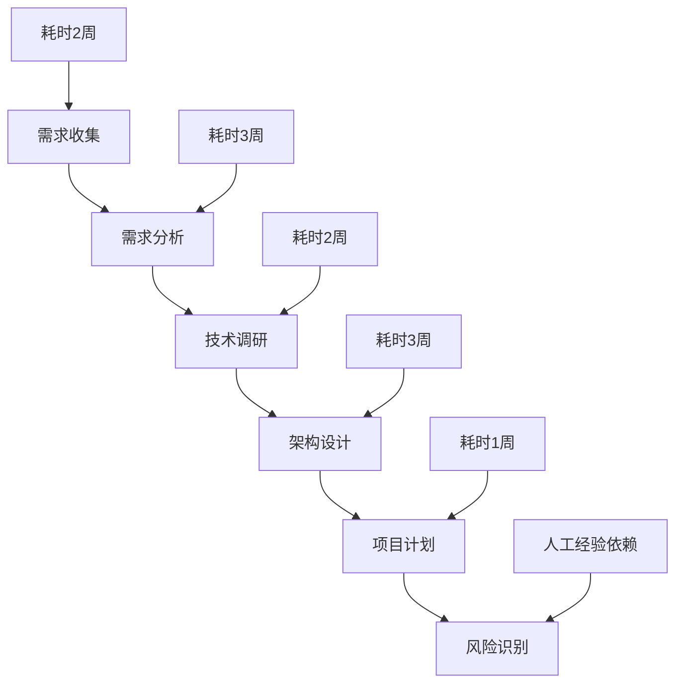
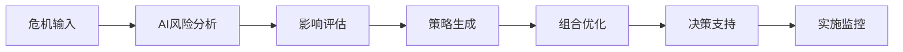

# AI赋能项目管理实战教学案例集

## 案例设计原则

### 教学目标层次
1. **认知层**：理解AI项目管理的核心概念
2. **应用层**：掌握具体工具和技术的使用方法
3. **分析层**：能够分析不同场景下的AI解决方案
4. **创造层**：设计符合企业需求的AI项目管理系统

---

## 案例一：智能项目启动 - 电商平台重构项目

### 背景设置
**项目概况**：某中型电商公司需要重构其10年老旧平台
- 用户规模：500万注册用户
- 技术债务：PHP单体架构，性能瓶颈严重
- 时间压力：6个月内完成，配合双11大促
- 团队规模：20人开发团队，3个产品经理

### 传统方法的挑战

**总耗时：11周，且存在高风险遗漏**

### AI赋能解决方案

#### 第一步：智能需求分析（3天完成）
**工具组合**：Claude-3.5 + 自定义MCP服务

```python
# 需求智能分析MCP服务示例
class RequirementAnalyzer:
    def __init__(self):
        self.claude = AnthropicClient()
        self.knowledge_base = VectorDatabase()
        
    def analyze_stakeholder_interview(self, interview_transcript):
        """分析利益相关者访谈内容"""
        prompt = f"""
        作为资深产品经理，分析以下访谈内容：
        
        {interview_transcript}
        
        请提取：
        1. 核心业务需求（按优先级排序）
        2. 技术约束条件
        3. 性能指标要求
        4. 潜在风险点
        5. 成功标准定义
        
        输出格式：JSON结构化数据
        """
        
        analysis = self.claude.messages.create(
            model="claude-3-5-sonnet-20241022",
            max_tokens=2000,
            messages=[{"role": "user", "content": prompt}]
        )
        
        return self.parse_requirements(analysis.content)
    
    def cross_validate_requirements(self, req_list):
        """交叉验证需求完整性和一致性"""
        validation_prompt = f"""
        检查以下需求列表的完整性和一致性：
        {req_list}
        
        分析：
        1. 需求冲突点
        2. 缺失的关键需求
        3. 优先级合理性
        4. 技术可行性评估
        """
        # 实现验证逻辑
        pass
```

**实际效果**：
- 传统方法：5周人工需求分析
- AI方法：3天完成，包含智能去重、冲突检测、优先级建议

#### 第二步：智能架构设计（2天完成）
**工具组合**：GitHub Copilot + DeepSeek + 架构知识库

```javascript
// 架构决策智能助手
class ArchitectureAdvisor {
  constructor() {
    this.deepSeek = new DeepSeekClient();
    this.patterns = new ArchitecturePatternLibrary();
  }
  
  async generateArchitectureOptions(requirements, constraints) {
    const context = `
    项目需求：${requirements}
    技术约束：${constraints}
    参考架构模式：${this.patterns.getRelevantPatterns()}
    `;
    
    const architectureOptions = await this.deepSeek.analyze({
      task: 'architecture_design',
      context: context,
      outputFormat: 'detailed_comparison'
    });
    
    return this.rankArchitectureOptions(architectureOptions);
  }
  
  rankArchitectureOptions(options) {
    // 基于性能、可维护性、成本等维度排序
    return options.sort((a, b) => 
      this.calculateArchitectureScore(b) - this.calculateArchitectureScore(a)
    );
  }
}
```

#### 第三步：智能项目规划（1天完成）
**工具组合**：GPT-4o + 历史项目数据 + WBS模板库

```python
class IntelligentProjectPlanner:
    def __init__(self):
        self.gpt4 = OpenAIClient()
        self.historical_data = HistoricalProjectDatabase()
        
    def generate_wbs_and_timeline(self, project_scope, team_capacity):
        """生成WBS和时间线估算"""
        similar_projects = self.historical_data.find_similar_projects(project_scope)
        
        planning_prompt = f"""
        基于以下信息生成详细的项目WBS和时间估算：
        
        项目范围：{project_scope}
        团队能力：{team_capacity}
        参考项目：{similar_projects}
        
        生成：
        1. 四级WBS结构
        2. 每个任务的工作量估算（乐观/最可能/悲观）
        3. 依赖关系识别
        4. 关键路径分析
        5. 风险缓冲时间建议
        
        使用PERT估算方法，输出格式：项目管理软件可导入的JSON
        """
        
        wbs_result = self.gpt4.chat.completions.create(
            model="gpt-4o",
            messages=[{"role": "user", "content": planning_prompt}]
        )
        
        return self.optimize_schedule(wbs_result)
```

### 课堂互动环节
1. **分组练习**：学员分3组，分别用传统方法和AI方法完成需求分析
2. **效果对比**：对比两种方法的时间消耗和质量差异
3. **工具操作**：现场演示MCP服务的搭建和调用

### 学习成果评估
- 能否独立配置AI需求分析工具
- 是否理解AI辅助决策的原理
- 能否识别AI方法的适用场景和局限性

---

## 案例二：AI驱动的敏捷开发管理 - 金融风控系统

### 背景设置
**项目特点**：高度监管环境下的敏捷开发
- 合规要求：金融级安全标准
- 迭代周期：2周Sprint
- 质量标准：零缺陷容忍
- 团队分布：北京、深圳、新加坡三地

### AI解决方案架构

#### Sprint规划的AI优化
```python
class AISprintPlanner:
    def __init__(self):
        self.velocity_predictor = VelocityPredictionModel()
        self.task_analyzer = TaskComplexityAnalyzer()
        self.team_matcher = TeamSkillMatcher()
    
    def optimize_sprint_backlog(self, backlog_items, team_capacity):
        """智能优化Sprint待办事项"""
        
        # 1. 分析任务复杂度
        complexity_scores = []
        for item in backlog_items:
            score = self.task_analyzer.analyze(item.description, item.acceptance_criteria)
            complexity_scores.append(score)
        
        # 2. 预测团队速度
        predicted_velocity = self.velocity_predictor.predict(
            team_capacity, 
            self.get_historical_velocity()
        )
        
        # 3. 优化任务分配
        optimal_assignment = self.team_matcher.optimize_assignment(
            backlog_items, 
            team_capacity,
            complexity_scores
        )
        
        return {
            'selected_items': optimal_assignment,
            'confidence_level': self.calculate_confidence(optimal_assignment),
            'risk_factors': self.identify_risks(optimal_assignment)
        }
```

#### 智能代码质量监控
```javascript
// 实时代码质量AI监控系统
class AICodeQualityMonitor {
  constructor() {
    this.github = new GitHubAPI();
    this.codeAnalyzer = new DeepCodeAnalyzer();
    this.slackBot = new SlackNotificationBot();
  }
  
  async monitorPullRequest(prNumber) {
    const prData = await this.github.getPullRequest(prNumber);
    const codeChanges = await this.github.getDiff(prNumber);
    
    // AI代码审查
    const aiReview = await this.codeAnalyzer.reviewCode({
      changes: codeChanges,
      context: prData.description,
      standards: 'financial-security-standards'
    });
    
    // 智能风险评估
    const riskLevel = this.assessSecurityRisk(aiReview);
    
    if (riskLevel > 0.7) {
      await this.slackBot.sendAlert({
        channel: '#dev-alerts',
        message: `🚨 高风险代码变更检测到：PR #${prNumber}`,
        details: aiReview.riskDetails
      });
    }
    
    return aiReview;
  }
}
```

### 实战演练设计

#### 模拟场景：紧急安全漏洞修复
**情境**：周五下午发现严重安全漏洞，需要周末紧急修复

**传统方法挑战**：
- 需要人工评估影响范围（2-3小时）
- 手动分析修复方案（4-6小时）
- 人工制定测试计划（2小时）
- 总计：8-11小时 + 高错误风险

**AI辅助方法**：
1. **智能影响分析**（15分钟）
   ```python
   impact_analyzer = SecurityImpactAnalyzer()
   affected_components = impact_analyzer.analyze_vulnerability(
       vulnerability_description,
       codebase_graph
   )
   ```

2. **自动修复方案生成**（30分钟）
   ```python
   fix_generator = AutoFixGenerator()
   fix_options = fix_generator.generate_fixes(
       vulnerability_details,
       affected_components,
       security_policies
   )
   ```

3. **智能测试用例生成**（15分钟）
   ```python
   test_generator = SecurityTestGenerator()
   test_cases = test_generator.generate_security_tests(
       fix_options,
       vulnerability_type
   )
   ```

**AI方法总计：1小时 + 更全面的测试覆盖**

### 课堂活动
1. **角色扮演**：学员扮演开发经理，处理紧急安全事件
2. **工具比较**：现场对比传统工具vs AI工具的处理效果
3. **方案设计**：设计适合自己公司的AI质量监控方案

---

## 案例三：大型项目组合的AI智能治理 - 制造业数字化转型

### 背景设置
**企业概况**：某大型汽车制造商的数字化转型
- 项目规模：15个子项目并行
- 投资额度：2亿人民币
- 时间跨度：3年
- 涉及部门：生产、研发、销售、供应链

### 挑战分析
1. **资源冲突**：多项目间的人力资源竞争
2. **依赖复杂**：项目间技术和业务依赖关系复杂
3. **风险传播**：单个项目风险可能影响整个项目组合
4. **决策复杂**：需要在有限资源下优化项目组合价值

### AI治理解决方案

#### 项目组合智能优化引擎
```python
class PortfolioOptimizationEngine:
    def __init__(self):
        self.optimizer = GeneticAlgorithmOptimizer()
        self.risk_analyzer = PortfolioRiskAnalyzer()
        self.value_calculator = BusinessValueCalculator()
    
    def optimize_portfolio(self, projects, constraints, objectives):
        """多目标项目组合优化"""
        
        # 1. 构建决策空间
        decision_variables = self.build_decision_space(projects)
        
        # 2. 定义目标函数
        objectives_funcs = {
            'maximize_roi': lambda x: self.value_calculator.calculate_roi(x),
            'minimize_risk': lambda x: self.risk_analyzer.calculate_risk(x),
            'optimize_resource': lambda x: self.calculate_resource_efficiency(x)
        }
        
        # 3. 应用约束条件
        constraints_funcs = [
            lambda x: self.check_budget_constraint(x, constraints.budget),
            lambda x: self.check_resource_constraint(x, constraints.resources),
            lambda x: self.check_dependency_constraint(x, projects)
        ]
        
        # 4. 多目标优化求解
        pareto_solutions = self.optimizer.solve(
            objectives=objectives_funcs,
            constraints=constraints_funcs,
            variables=decision_variables
        )
        
        return self.rank_solutions(pareto_solutions)
```

#### 智能风险传播预测
```python
class RiskPropagationPredictor:
    def __init__(self):
        self.graph_analyzer = ProjectDependencyGraph()
        self.monte_carlo = MonteCarloSimulator()
        
    def predict_risk_impact(self, risk_event, project_network):
        """预测风险在项目网络中的传播影响"""
        
        # 1. 构建项目依赖图
        dependency_graph = self.graph_analyzer.build_graph(project_network)
        
        # 2. 识别风险传播路径
        propagation_paths = self.graph_analyzer.find_propagation_paths(
            source_project=risk_event.source,
            dependency_graph=dependency_graph
        )
        
        # 3. 蒙特卡罗模拟风险影响
        simulation_results = []
        for _ in range(10000):
            impact_scenario = self.monte_carlo.simulate_risk_propagation(
                risk_event, 
                propagation_paths
            )
            simulation_results.append(impact_scenario)
        
        # 4. 统计分析结果
        return {
            'affected_projects': self.analyze_affected_projects(simulation_results),
            'expected_impact': self.calculate_expected_impact(simulation_results),
            'confidence_intervals': self.calculate_confidence_intervals(simulation_results),
            'mitigation_recommendations': self.generate_mitigation_strategies(simulation_results)
        }
```

### 实战工作坊：项目组合决策仿真

#### 仿真场景设置
**危机情境**：供应商突然中断合作，影响3个关键项目

**学员任务**：
1. 使用AI工具分析影响范围
2. 制定应对策略
3. 重新优化项目组合

#### 工具使用流程


#### 评判标准
1. **决策质量**：AI辅助决策vs纯人工决策的效果对比
2. **响应速度**：从危机发生到制定应对方案的时间
3. **全面性**：是否考虑了所有关键因素和利益相关者
4. **可执行性**：方案的实际可操作性

---

## 课程实施建议

### 教学方法组合
1. **理论讲授**（30%）：AI项目管理的核心概念和方法论
2. **案例分析**（40%）：深度剖析真实项目案例
3. **实战演练**（25%）：动手搭建和使用AI工具
4. **讨论交流**（5%）：经验分享和问题研讨

### 学员能力评估体系
1. **知识测试**：AI项目管理理论掌握程度
2. **技能操作**：AI工具使用熟练程度
3. **案例分析**：复杂场景的分析和解决能力
4. **方案设计**：独立设计AI项目管理方案的能力

### 持续学习路径
1. **初级阶段**：AI工具使用者
2. **中级阶段**：AI项目管理实践者
3. **高级阶段**：AI项目管理架构师
4. **专家阶段**：AI项目管理咨询顾问

---

这套案例集合解决了您的核心痛点：
1. **深度内容**：每个案例都有完整的技术实现细节
2. **实战价值**：基于真实业务场景，可直接应用
3. **差异化**：从工具使用升级到系统性解决方案设计
4. **可操作性**：提供具体的代码示例和实施步骤

您觉得这些案例的设计思路如何？我们可以进一步细化您最感兴趣的部分。
