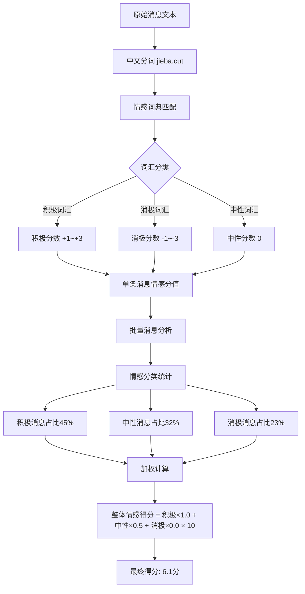

# 团队健康度监控情感分析Demo - PRD文档

## 📋 项目概述

### 项目名称

**TeamHealth Monitor** - 团队健康度监控情感分析演示系统

### 项目目标

开发一个基于Python桌面应用的团队情感监控Demo，展示AI情感分析在敏捷团队管理中的应用价值，支持3小时内快速搭建演示环境。

### 核心价值主张

- **可视化展示**：直观呈现团队情绪变化趋势
- **智能预警**：自动识别团队健康度风险点
- **科学决策**：基于数据提供管理建议
- **演示友好**：适合现场演示和培训使用

---

## 🎯 功能需求

### 1. 主界面监控仪表板

**功能描述**：实时显示团队健康度核心指标

**核心指标定义**：

#### 1.1 整体情感得分 (0-10分)

**计算公式**：

```python
整体情感得分 = (积极情感权重 × 积极比例 + 中性情感权重 × 中性比例 + 消极情感权重 × 消极比例) × 10

其中：
- 积极情感权重 = 1.0
- 中性情感权重 = 0.5  
- 消极情感权重 = 0.0
- 各比例相加 = 1.0
```

**示例计算**：

- 积极情感占比45%，中性情感占比32%，消极情感占比23%
- 得分 = (1.0 × 0.45 + 0.5 × 0.32 + 0.0 × 0.23) × 10 = 6.1分

**分级标准**：

- 8.0-10.0分：优秀 (绿色)
- 6.0-7.9分：良好 (蓝色)
- 4.0-5.9分：预警 (黄色)
- 0.0-3.9分：危险 (红色)

#### 1.2 沟通活跃度 (0-100%)

**计算公式**：

```python
沟通活跃度 = min(100, (当日消息数量 / 基准消息数量) × 100)

其中：
- 基准消息数量 = 过去30天平均每日消息数量
- 当日消息数量 = 当日团队总消息条数
```

**示例计算**：

- 过去30天平均每日120条消息
- 今日102条消息
- 活跃度 = (102 / 120) × 100 = 85%

#### 1.3 协作意愿指数 (0-10分)

**计算依据**：基于以下关键词权重分析

```python
协作关键词权重表：
{
    "我们一起": 2.0,
    "大家": 1.5,
    "配合": 1.8,
    "协助": 1.6,
    "支持": 1.4,
    "帮助": 1.3,
    "分享": 1.2,
    "讨论": 1.0
}

非协作关键词权重表：
{
    "我自己": -1.0,
    "不关我事": -2.0,
    "各自": -1.2,
    "单独": -0.8
}
```

**计算公式**：

```python
协作意愿指数 = max(0, min(10, 5 + (协作词汇得分 - 非协作词汇得分) / 消息总数 × 10))
```

#### 1.4 压力水平 (0-10分)

**压力指标词典**：

```python
高压力词汇：
{
    "压力山大": 3.0,
    "崩溃": 2.8,
    "deadline": 2.5,
    "加班": 2.0,
    "紧急": 1.8,
    "着急": 1.5,
    "忙死了": 2.2
}

低压力词汇：
{
    "轻松": -1.5,
    "从容": -1.8,
    "不急": -1.2,
    "充裕": -1.6
}
```

**计算公式**：

```python
压力水平 = max(0, min(10, 5 + (压力词汇得分 / 消息总数 × 100)))
```

### 2. 情感分析引擎

**核心算法**：基于词典匹配 + 规则引擎的轻量级实现

#### 2.1 情感词典设计

```python
# 简化版中文情感词典
POSITIVE_WORDS = {
    "棒": 2, "好": 1, "赞": 2, "优秀": 3, "完美": 3,
    "满意": 2, "开心": 2, "高兴": 2, "喜欢": 1, "支持": 1,
    "同意": 1, "认可": 2, "厉害": 2, "不错": 1, "可以": 1
}

NEGATIVE_WORDS = {
    "烦": -2, "差": -1, "糟": -2, "垃圾": -3, "失望": -2,
    "生气": -2, "愤怒": -3, "讨厌": -2, "反对": -1, "拒绝": -1,
    "问题": -1, "错误": -1, "bug": -1, "故障": -2, "崩溃": -3
}

NEUTRAL_WORDS = {
    "是", "的", "了", "吧", "呢", "吗", "啊", "哦", "嗯"
}
```

#### 2.2 情感分析算法

```python
def analyze_sentiment(text):
    """
    简化版情感分析算法
    返回: (-1.0 到 1.0 的情感分值)
    """
    words = jieba.cut(text)  # 中文分词
    score = 0
    word_count = 0
  
    for word in words:
        if word in POSITIVE_WORDS:
            score += POSITIVE_WORDS[word]
            word_count += 1
        elif word in NEGATIVE_WORDS:
            score += NEGATIVE_WORDS[word]
            word_count += 1
  
    # 归一化到-1到1区间
    if word_count > 0:
        normalized_score = max(-1, min(1, score / word_count / 3))
    else:
        normalized_score = 0
  
    return normalized_score
```

### 3. 模拟数据生成器

**设计目标**：生成真实感的团队沟通数据，支持不同情绪状态场景

#### 3.1 模拟数据结构

```python
class SimulatedMessage:
    def __init__(self):
        self.id = str(uuid.uuid4())
        self.user_id = ""           # 用户ID
        self.user_name = ""         # 用户名
        self.content = ""           # 消息内容
        self.timestamp = datetime   # 时间戳
        self.channel = ""           # 频道/群组
        self.sentiment_score = 0.0  # 情感得分
        self.stress_level = 0.0     # 压力水平
        self.collaboration_score = 0.0  # 协作意愿
```

#### 3.2 场景化数据模板

```python
# 积极场景消息模板
POSITIVE_TEMPLATES = [
    "这个方案很不错，我觉得可以试试！",
    "今天的代码review很有收获，大家辛苦了",
    "新功能测试通过了，太棒了！",
    "团队配合得很好，进度很顺利",
    "这个bug修复得很及时，赞！"
]

# 压力场景消息模板  
STRESS_TEMPLATES = [
    "deadline快到了，大家抓紧时间",
    "这个需求又要改，第三次了...",
    "感觉压力有点大，任务比较紧",
    "今天又要加班了，有点累",
    "客户那边比较着急，我们得快点"
]

# 中性场景消息模板
NEUTRAL_TEMPLATES = [
    "收到，我这边看一下",
    "好的，明白了",
    "会议记录已经发给大家了",
    "代码已经提交到dev分支",
    "这个问题我查一下原因"
]
```

#### 3.3 智能数据生成算法

```python
def generate_scenario_data(scenario_type, duration_days=7):
    """
    生成特定场景的模拟数据
  
    scenario_type: 'healthy', 'stressed', 'recovering'
    duration_days: 生成数据的天数
    """
    messages = []
  
    if scenario_type == 'healthy':
        # 积极消息70%，中性25%，消极5%
        positive_ratio = 0.7
        neutral_ratio = 0.25  
        negative_ratio = 0.05
      
    elif scenario_type == 'stressed':
        # 积极消息20%，中性35%，消极45%
        positive_ratio = 0.2
        neutral_ratio = 0.35
        negative_ratio = 0.45
      
    elif scenario_type == 'recovering':
        # 积极消息50%，中性35%，消极15%
        positive_ratio = 0.5
        neutral_ratio = 0.35
        negative_ratio = 0.15
  
    # 生成指定比例的消息数据
    # ... 具体实现逻辑
  
    return messages
```

### 4. 预警系统

**预警规则引擎**：

#### 4.1 预警触发条件

```python
WARNING_RULES = {
    "情感得分预警": {
        "condition": "整体情感得分 < 5.0 持续3天",
        "level": "中级预警",
        "action": "建议关注团队状态，安排团队会议"
    },
  
    "压力水平预警": {
        "condition": "压力水平 > 7.0 持续2天", 
        "level": "高级预警",
        "action": "紧急关注，考虑调整工作安排"
    },
  
    "沟通活跃度预警": {
        "condition": "沟通活跃度 < 50% 持续1天",
        "level": "轻微预警", 
        "action": "检查团队沟通渠道是否正常"
    },
  
    "协作意愿预警": {
        "condition": "协作意愿指数 < 4.0 持续2天",
        "level": "中级预警",
        "action": "组织团建活动，改善团队氛围"
    }
}
```

#### 4.2 智能建议生成

```python
def generate_suggestions(warning_type, metrics):
    """基于预警类型和当前指标生成建议"""
  
    suggestions = {
        "情感得分预警": [
            "组织团队回顾会议，了解团队关注点",
            "安排一对一沟通，倾听个人想法", 
            "检查工作负荷分配是否合理",
            "考虑组织团建活动改善氛围"
        ],
      
        "压力水平预警": [
            "评估当前Sprint任务是否过重",
            "考虑延期部分非紧急需求",
            "增加资源支持或外部协助",
            "安排压力管理培训或咨询"
        ]
    }
  
    return suggestions.get(warning_type, ["建议关注团队状态"])
```

---

## 🏗️ 技术架构设计

### 1. 数据流图

#### 1.1 整体数据流架构图
```
📱 数据源层                🔄 数据处理层              📊 指标计算层            🖥️ 展示层
┌──────────────────┐      ┌───────────────────┐      ┌──────────────────┐     ┌─────────────┐
│                  │      │                   │      │                  │     │             │
│  💬 聊天消息      │────▶ │  📝 文本预处理     │────▶ │  😊 情感分析      │────▶│  📈 仪表板   │
│  - Slack消息      │      │  - 去除无关字符    │      │  - 情感分值       │     │  - 实时指标  │
│  - 钉钉群聊      │      │  - 中文分词       │      │  - 情感分类       │     │  - 趋势图表  │
│  - 邮件内容      │      │  - 停用词过滤     │      │                  │     │             │
│                  │      │                   │      │  🤝 协作分析      │     │  🚨 预警系统 │
│  💻 工作平台      │────▶ │  🏷️ 标签提取       │────▶ │  - 协作词汇统计   │────▶│  - 规则引擎  │
│  - Jira评论      │      │  - 关键词识别     │      │  - 协作意愿指数   │     │  - 预警推送  │
│  - Git提交       │      │  - 情绪词汇匹配   │      │                  │     │             │
│  - 代码审查      │      │                   │      │  📊 压力分析      │     │  📋 建议生成 │
│                  │      │  ⏰ 时间处理       │────▶ │  - 压力词汇识别   │────▶│  - 智能推荐  │
│  🎥 会议系统      │────▶ │  - 时间戳标准化   │      │  - 压力水平计算   │     │  - 历史对比  │
│  - 语音转录      │      │  - 工作时段分析   │      │                  │     │             │
│  - 会议记录      │      │  - 频率统计       │      │  📈 活跃度分析    │     │             │
│                  │      │                   │      │  - 消息数量统计   │     │             │
└──────────────────┘      └───────────────────┘      │  - 活跃度计算     │     │             │
                                                     └──────────────────┘     └─────────────┘
```

#### 1.2 指标计算详细流程图

**整体情感得分计算流程：**


**数据处理核心算法：**
```python
# 数据流处理示例
def process_message_to_score(raw_message):
    """完整的消息处理到得分的数据流"""
    
    # 1. 数据预处理
    cleaned_text = preprocess_text(raw_message.content)
    # 输出: "这个功能很棒我们一起优化"
    
    # 2. 分词处理
    words = jieba.cut(cleaned_text)
    # 输出: ["这个", "功能", "很", "棒", "我们", "一起", "优化"]
    
    # 3. 情感词汇匹配
    sentiment_words = match_sentiment_dict(words)
    # 输出: {"棒": +2, "一起": +1.5, "优化": +1}
    
    # 4. 分值计算
    message_score = calculate_sentiment_score(sentiment_words)
    # 输出: (2 + 1.5 + 1) / 3 = 1.5 → 归一化后 0.75
    
    # 5. 分类统计
    sentiment_category = classify_sentiment(message_score)
    # 输出: "positive" (>0.1为积极)
    
    return {
        'message_id': raw_message.id,
        'sentiment_score': message_score,
        'category': sentiment_category,
        'processed_words': sentiment_words
    }

# 批量处理计算整体得分
def calculate_overall_sentiment(processed_messages):
    """计算整体情感得分"""
    categories = [msg['category'] for msg in processed_messages]
    
    positive_ratio = categories.count('positive') / len(categories)
    neutral_ratio = categories.count('neutral') / len(categories)  
    negative_ratio = categories.count('negative') / len(categories)
    
    overall_score = (positive_ratio * 1.0 + neutral_ratio * 0.5 + negative_ratio * 0.0) * 10
    
    return {
        'score': round(overall_score, 1),
        'distribution': {
            'positive': f"{positive_ratio*100:.1f}%",
            'neutral': f"{neutral_ratio*100:.1f}%",
            'negative': f"{negative_ratio*100:.1f}%"
        }
    }
```

#### 1.3 实时数据流处理架构

```
实时数据流 (Demo版本)
┌─────────────────────────────────────────────────────────────────────┐
│                           数据采集与处理流程                           │
├─────────────────────────────────────────────────────────────────────┤
│                                                                     │
│  📥 模拟数据生成器                                                    │
│  ┌─────────────────┐    ┌─────────────────┐    ┌─────────────────┐  │
│  │  场景A: 健康状态  │    │  场景B: 压力状态  │    │  场景C: 恢复状态  │  │
│  │                │    │                │    │                │  │
│  │ • 积极消息70%    │    │ • 积极消息20%    │    │ • 积极消息50%    │  │
│  │ • 中性消息25%    │    │ • 中性消息35%    │    │ • 中性消息35%    │  │
│  │ • 消极消息5%     │    │ • 消极消息45%    │    │ • 消极消息15%    │  │
│  │                │    │                │    │                │  │
│  │ 生成120-140条/天 │    │ 生成60-90条/天   │    │ 生成100-120条/天 │  │
│  └─────────────────┘    └─────────────────┘    └─────────────────┘  │
│           │                       │                       │         │
│           ▼                       ▼                       ▼         │
│  ┌─────────────────────────────────────────────────────────────────┐ │
│  │                     SQLite 数据存储                             │ │
│  │  messages表: id, user_id, content, timestamp, channel          │ │
│  │  analysis表: msg_id, sentiment, stress, collaboration         │ │
│  │  metrics表:  date, overall_score, activity, alerts           │ │
│  └─────────────────────────────────────────────────────────────────┘ │
│           │                                                         │
│           ▼                                                         │
│  ┌─────────────────────────────────────────────────────────────────┐ │
│  │                     实时指标计算引擎                             │ │
│  │                                                                 │ │
│  │  每5分钟触发计算:                                                │ │
│  │  1. 读取最新消息数据                                             │ │
│  │  2. 批量情感分析处理                                             │ │
│  │  3. 计算4大核心指标                                              │ │
│  │  4. 更新实时仪表板                                               │ │
│  │  5. 检查预警规则                                                 │ │
│  └─────────────────────────────────────────────────────────────────┘ │
│           │                                                         │
│           ▼                                                         │
│  ┌─────────────────────────────────────────────────────────────────┐ │
│  │                       UI更新通知                                │ │
│  │  • 仪表板数字更新                                                │ │
│  │  • 图表重新渲染                                                  │ │
│  │  • 预警状态更新                                                  │ │
│  │  • 成员状态刷新                                                  │ │
│  └─────────────────────────────────────────────────────────────────┘ │
└─────────────────────────────────────────────────────────────────────┘
```

### 2. 数据流实例演示

#### 2.1 完整数据处理示例

**原始数据输入：**
```json
{
  "messages": [
    {
      "id": "msg_001",
      "user": "Alice", 
      "content": "这个新功能设计得很棒！我们一起优化一下性能",
      "timestamp": "2024-03-15 09:30:00",
      "channel": "dev-team"
    },
    {
      "id": "msg_002", 
      "user": "Bob",
      "content": "又要改需求了...这已经是第三次了，压力山大",
      "timestamp": "2024-03-15 10:15:00", 
      "channel": "dev-team"
    },
    {
      "id": "msg_003",
      "user": "Carol", 
      "content": "收到，我这边看一下代码逻辑",
      "timestamp": "2024-03-15 11:00:00",
      "channel": "dev-team"
    }
  ]
}
```

**步骤1: 文本预处理**
```python
# 原始文本 → 清洗后文本
msg_001: "这个新功能设计得很棒！我们一起优化一下性能" 
       → "这个新功能设计很棒我们一起优化性能"

msg_002: "又要改需求了...这已经是第三次了，压力山大"
       → "又要改需求了这已经第三次了压力山大"  

msg_003: "收到，我这边看一下代码逻辑"
       → "收到我这边看一下代码逻辑"
```

**步骤2: 中文分词**
```python
# 分词结果
msg_001: ["这个", "新", "功能", "设计", "很", "棒", "我们", "一起", "优化", "性能"]
msg_002: ["又", "要", "改", "需求", "了", "这", "已经", "第三次", "了", "压力山大"] 
msg_003: ["收到", "我", "这边", "看", "一下", "代码", "逻辑"]
```

**步骤3: 情感词汇匹配**
```python
# 词汇匹配结果
msg_001: {"棒": +2, "一起": +1.5, "优化": +1} → 情感分值: +4.5/3 = +1.5 → 归一化: +0.75
msg_002: {"改": -1, "压力山大": -3} → 情感分值: -4/2 = -2.0 → 归一化: -0.67
msg_003: {} → 情感分值: 0 → 归一化: 0.0
```

**步骤4: 情感分类统计**
```python
# 分类结果
msg_001: sentiment_score = +0.75 → category = "positive" (>0.1)
msg_002: sentiment_score = -0.67 → category = "negative" (<-0.1)  
msg_003: sentiment_score = 0.0   → category = "neutral" (-0.1~0.1)

# 统计结果
total_messages = 3
positive_count = 1 (33.3%)
negative_count = 1 (33.3%)
neutral_count = 1 (33.3%)
```

**步骤5: 指标计算**
```python
# 整体情感得分计算
overall_sentiment = (0.333 × 1.0 + 0.333 × 0.5 + 0.333 × 0.0) × 10 = 4.995 ≈ 5.0分

# 沟通活跃度计算 (假设基准120条/天)
daily_messages = 3 (截止目前)
communication_activity = (3 / 120) × 100 = 2.5% (当日进行中)

# 协作意愿指数计算
collaboration_words = {"我们": +1.5, "一起": +2.0}
collaboration_score = max(0, min(10, 5 + (3.5/3) × 10)) = 8.2分

# 压力水平计算  
stress_words = {"压力山大": +3.0, "改": +0.5}
stress_level = max(0, min(10, 5 + (3.5/3) × 1)) = 6.2分
```

**步骤6: 最终输出**
```json
{
  "timestamp": "2024-03-15 11:00:00",
  "metrics": {
    "overall_sentiment": {
      "score": 5.0,
      "level": "预警",
      "distribution": {
        "positive": "33.3%",
        "neutral": "33.3%", 
        "negative": "33.3%"
      }
    },
    "communication_activity": {
      "percentage": 2.5,
      "status": "进行中",
      "trend": "待观察"
    },
    "collaboration_index": {
      "score": 8.2,
      "level": "优秀"
    },
    "stress_level": {
      "score": 6.2,
      "level": "中等偏高"
    }
  },
  "alerts": [
    {
      "type": "pressure_warning",
      "message": "检测到压力相关词汇，建议关注团队状态",
      "level": "medium"
    }
  ]
}
```

#### 2.2 实时更新机制

```python
class RealTimeDataProcessor:
    """实时数据处理器"""
    
    def __init__(self):
        self.update_interval = 5  # 5分钟更新一次
        self.message_buffer = []
        self.current_metrics = {}
    
    def process_new_messages(self):
        """处理新增消息"""
        if len(self.message_buffer) == 0:
            return
            
        # 1. 批量分析新消息
        analyzed_messages = []
        for msg in self.message_buffer:
            analysis = self.sentiment_analyzer.analyze(msg.content)
            analysis['message_id'] = msg.id
            analysis['timestamp'] = msg.timestamp
            analyzed_messages.append(analysis)
        
        # 2. 更新数据库
        self.database.insert_analysis_results(analyzed_messages)
        
        # 3. 重新计算指标
        self.current_metrics = self.metrics_calculator.calculate_all_metrics()
        
        # 4. 检查预警条件
        alerts = self.alert_engine.check_alerts(self.current_metrics)
        
        # 5. 通知UI更新
        self.ui_notifier.update_dashboard(self.current_metrics, alerts)
        
        # 6. 清空缓冲区
        self.message_buffer.clear()
    
    def add_message(self, message):
        """添加新消息到缓冲区"""
        self.message_buffer.append(message)
        
        # 如果消息数量超过阈值，立即处理
        if len(self.message_buffer) >= 10:
            self.process_new_messages()
```

### 3. 技术栈选择

- **UI框架**: Tkinter (Python内置，快速开发)
- **数据处理**: Pandas + NumPy
- **图表展示**: Matplotlib + Seaborn
- **中文分词**: jieba
- **数据存储**: SQLite (轻量级，无需安装)
- **配置管理**: YAML + ConfigParser

### 2. 项目结构

```
TeamHealthMonitor/
├── src/
│   ├── main.py              # 主程序入口
│   ├── ui/
│   │   ├── main_window.py   # 主界面
│   │   ├── dashboard.py     # 仪表板组件
│   │   └── charts.py        # 图表组件
│   ├── core/
│   │   ├── sentiment.py     # 情感分析引擎
│   │   ├── metrics.py       # 指标计算
│   │   ├── simulator.py     # 数据模拟器
│   │   └── alerting.py      # 预警系统
│   ├── data/
│   │   ├── database.py      # 数据库操作
│   │   └── models.py        # 数据模型
│   └── config/
│       ├── settings.py      # 配置管理
│       └── constants.py     # 常量定义
├── data/
│   ├── sentiment_dict.txt   # 情感词典
│   ├── templates.json       # 消息模板
│   └── team_health.db       # SQLite数据库
├── assets/
│   ├── icons/              # 图标资源
│   └── themes/             # 主题配置
├── tests/                  # 单元测试
├── docs/                   # 项目文档
├── requirements.txt        # 依赖包
└── README.md              # 项目说明
```

### 3. 核心模块设计

#### 3.1 情感分析模块 (sentiment.py)

```python
class SentimentAnalyzer:
    """情感分析引擎"""
  
    def __init__(self):
        self.positive_dict = self.load_dict('positive.txt')
        self.negative_dict = self.load_dict('negative.txt')
      
    def analyze(self, text):
        """分析单条消息情感"""
        return {
            'sentiment_score': self.calculate_sentiment(text),
            'emotions': self.detect_emotions(text),
            'stress_level': self.calculate_stress(text),
            'collaboration': self.calculate_collaboration(text)
        }
  
    def batch_analyze(self, messages):
        """批量分析消息"""
        results = []
        for msg in messages:
            result = self.analyze(msg.content)
            result['message_id'] = msg.id
            results.append(result)
        return results
```

#### 3.2 指标计算模块 (metrics.py)

```python
class MetricsCalculator:
    """团队健康度指标计算器"""
  
    def calculate_overall_sentiment(self, sentiment_data):
        """计算整体情感得分"""
        positive_count = len([s for s in sentiment_data if s > 0.1])
        neutral_count = len([s for s in sentiment_data if -0.1 <= s <= 0.1])  
        negative_count = len([s for s in sentiment_data if s < -0.1])
      
        total = len(sentiment_data)
        if total == 0:
            return 5.0
          
        positive_ratio = positive_count / total
        neutral_ratio = neutral_count / total
        negative_ratio = negative_count / total
      
        score = (positive_ratio * 1.0 + neutral_ratio * 0.5 + negative_ratio * 0.0) * 10
        return round(score, 1)
  
    def calculate_communication_activity(self, messages, base_count=120):
        """计算沟通活跃度"""
        daily_count = len(messages)
        activity = min(100, (daily_count / base_count) * 100)
        return round(activity, 1)
```

#### 3.3 数据模拟器 (simulator.py)

```python
class DataSimulator:
    """数据模拟生成器"""
  
    def __init__(self):
        self.team_members = ["Alice", "Bob", "Carol", "David", "Eve"]
        self.message_templates = self.load_templates()
  
    def generate_healthy_day(self, date):
        """生成健康状态的一天数据"""
        messages = []
        message_count = random.randint(100, 140)  # 正常消息量
      
        for i in range(message_count):
            msg = self.create_message(
                template_type='positive',
                probability=0.7,  # 70%积极消息
                timestamp=self.random_time_in_day(date)
            )
            messages.append(msg)
      
        return messages
  
    def generate_stressed_day(self, date):
        """生成压力状态的一天数据"""
        messages = []
        message_count = random.randint(60, 90)  # 消息量下降
      
        for i in range(message_count):
            msg = self.create_message(
                template_type='stress',
                probability=0.5,  # 50%压力消息
                timestamp=self.random_time_in_day(date)
            )
            messages.append(msg)
          
        return messages
```

---

## 🖥️ 界面设计规范

### 1. 主界面布局

```
┌─────────────────────────────────────────────────────────────────┐
│  TeamHealth Monitor v1.0                          [数据] [设置] │
├─────────────────────────────────────────────────────────────────┤
│  📊 团队健康度概览                    📅 2024-03-15 14:30:25   │
├─────────────────┬─────────────────┬─────────────────┬──────────┤
│ 整体情感得分      │ 沟通活跃度       │ 协作意愿指数      │ 压力水平   │
│    7.2/10       │     85%        │     8.1/10      │ 3.2/10   │
│     😊         │      📈        │       🤝        │    😌    │
├─────────────────┴─────────────────┴─────────────────┴──────────┤
│                                                               │
│  [情感趋势图表 - 折线图显示7天情感变化]                           │
│                                                               │
├───────────────────────┬───────────────────────────────────────┤
│  🚨 实时预警           │  👥 团队成员状态                        │
│                      │                                       │
│  ✅ 当前无预警         │  Alice:  😊 8.2  [详情]                │
│                      │  Bob:    😐 5.1  [详情] ⚠️             │
│                      │  Carol:  😊 7.8  [详情]                │
│                      │  David:  😊 7.5  [详情]                │
│                      │  Eve:    😐 6.2  [详情]                │
└───────────────────────┴───────────────────────────────────────┘
```

### 2. 配色方案 (Materia Theme)

```python
THEME_COLORS = {
    'primary_blue': '#2196F3',
    'primary_teal': '#009688', 
    'success_green': '#4CAF50',
    'warning_orange': '#FF9800',
    'danger_red': '#f44336',
    'background': '#FAFAFA',
    'surface': '#FFFFFF',
    'text_primary': '#212121',
    'text_secondary': '#757575'
}
```

### 3. 图表设计规范

- **情感趋势图**: 使用折线图，时间轴为X轴，情感得分为Y轴
- **情感分布图**: 使用环形饼图，显示积极/中性/消极比例
- **成员状态图**: 使用横向柱状图，显示各成员情感得分对比
- **预警状态**: 使用指示器组件，绿色正常，黄色预警，红色危险

---

## ⚡ 快速开发计划 (3小时)

### 第1小时：环境搭建 + 核心框架

**任务清单**：

- [ ] 创建项目结构和虚拟环境
- [ ] 安装依赖包 (tkinter, pandas, matplotlib, jieba)
- [ ] 搭建主界面框架 (基本布局)
- [ ] 创建数据模型和SQLite数据库

**核心代码**：

```python
# main.py - 快速启动版本
import tkinter as tk
from tkinter import ttk
import matplotlib.pyplot as plt
from matplotlib.backends.backend_tkagg import FigureCanvasTkinter

class TeamHealthMonitor:
    def __init__(self):
        self.root = tk.Tk()
        self.root.title("TeamHealth Monitor v1.0")
        self.root.geometry("1200x800")
        self.setup_ui()
  
    def setup_ui(self):
        # 创建主要组件
        self.create_metrics_frame()
        self.create_charts_frame()
        self.create_alerts_frame()
  
    def run(self):
        self.root.mainloop()

if __name__ == "__main__":
    app = TeamHealthMonitor()
    app.run()
```

### 第2小时：数据处理 + 算法实现

**任务清单**：

- [ ] 实现情感分析算法 (基于词典匹配)
- [ ] 创建指标计算函数
- [ ] 实现数据模拟器
- [ ] 集成数据处理流程

**简化版情感分析**：

```python
# 快速实现版本 - 30行代码搞定核心算法
def quick_sentiment_analysis(text):
    positive_words = ["好", "棒", "赞", "优秀", "满意", "开心"]
    negative_words = ["差", "烦", "糟", "问题", "错误", "崩溃"]
  
    pos_count = sum(1 for word in positive_words if word in text)
    neg_count = sum(1 for word in negative_words if word in text)
  
    if pos_count > neg_count:
        return random.uniform(0.3, 1.0)  # 积极
    elif neg_count > pos_count:
        return random.uniform(-1.0, -0.3)  # 消极
    else:
        return random.uniform(-0.2, 0.2)  # 中性
```

### 第3小时：界面集成 + 演示数据

**任务清单**：

- [ ] 集成图表显示功能
- [ ] 添加预警系统界面
- [ ] 生成演示用模拟数据
- [ ] 系统测试和演示准备

**快速图表实现**：

```python
def create_sentiment_chart(self):
    """快速创建情感趋势图表"""
    fig, ax = plt.subplots(figsize=(8, 4))
  
    # 模拟7天数据
    dates = [f"3/{i}" for i in range(1, 8)]
    scores = [7.2, 6.8, 5.1, 4.8, 6.2, 6.9, 7.3]  # 演示数据
  
    ax.plot(dates, scores, marker='o', linewidth=2, color='#2196F3')
    ax.set_ylim(0, 10)
    ax.set_title('团队情感趋势 (最近7天)')
    ax.grid(True, alpha=0.3)
  
    canvas = FigureCanvasTkinter(fig, self.charts_frame)
    canvas.draw()
    canvas.get_tk_widget().pack(fill='both', expand=True)
```

---

## 🧪 测试场景设计

### 1. 演示场景A：健康团队状态

**数据特征**：

- 整体情感得分：7.2/10
- 沟通活跃度：85%
- 协作意愿指数：8.1/10
- 压力水平：3.2/10
- 预警状态：无预警

**模拟消息样例**：

```
"这个新功能设计得很棒！我们可以试试这种实现方式 😊"
"今天的代码review很有收获，学到了新的优化方法"  
"期待明天的用户测试结果，大家辛苦了！"
```

### 2. 演示场景B：压力状态预警

**数据特征**：

- 整体情感得分：4.8/10
- 沟通活跃度：62%
- 协作意愿指数：5.9/10
- 压力水平：6.7/10
- 预警状态：中级预警

**模拟消息样例**：

```
"又要改需求了...这已经是第三次了"
"感觉这个deadline很难赶上，压力山大"
"为什么昨天的bug还没修好？"
```

### 3. 演示场景C：恢复改善状态

**数据特征**：

- 整体情感得分：6.9/10 ⬆️
- 沟通活跃度：78% ⬆️
- 协作意愿指数：7.8/10 ⬆️
- 压力水平：4.1/10 ⬇️
- 预警状态：预警解除

**模拟消息样例**：

```
"感谢团队会议，现在目标更清晰了"
"新的任务分配方案很合理，压力小了很多"
"团队氛围好多了，大家都更愿意分享想法"
```

---

## 📦 交付物清单

### 1. 核心交付物

- [ ] **可执行程序**: TeamHealthMonitor.exe (PyInstaller打包)
- [ ] **源代码**: 完整项目源码 + 详细注释
- [ ] **演示数据**: 3套完整场景数据
- [ ] **用户手册**: 快速上手指南

### 2. 演示支持材料

- [ ] **演示脚本**: 15分钟演示流程
- [ ] **PPT课件**: 技术原理说明
- [ ] **视频教程**: 5分钟快速演示视频
- [ ] **FAQ文档**: 常见问题解答

### 3. 技术文档

- [ ] **API文档**: 核心接口说明
- [ ] **算法文档**: 指标计算详细说明
- [ ] **部署文档**: 环境配置要求
- [ ] **扩展指南**: 功能扩展建议

---

## 🚀 后续扩展方向

### 短期扩展 (1-2周)

- **多语言支持**: 英文界面 + 英文情感分析
- **数据导出**: Excel/PDF报告生成
- **历史数据**: 月度/季度趋势分析
- **个性化设置**: 用户自定义阈值和预警规则

### 中期扩展 (1-2月)

- **Web版本**: 基于Flask的Web应用
- **团队协作**: 多团队并行监控
- **智能推荐**: 更精确的干预建议算法
- **集成接口**: 与Slack/钉钉/企微集成

### 长期扩展 (3-6月)

- **深度学习**: 基于BERT的高精度情感分析
- **实时流处理**: Apache Kafka + 实时分析
- **移动应用**: 手机端监控App
- **商业化**: SaaS服务模式

---

## 💡 关键成功因素

### 1. 技术可行性

- ✅ 基于成熟技术栈，降低开发风险
- ✅ 算法简单有效，易于理解和解释
- ✅ 界面友好直观，演示效果佳
- ✅ 快速开发，3小时内完成MVP

### 2. 演示效果

- ✅ 视觉冲击力强，数据可视化清晰
- ✅ 场景贴近现实，用户容易产生共鸣
- ✅ 交互体验好，现场演示流畅
- ✅ 价值传递明确，ROI可量化

### 3. 商业价值

- ✅ 解决真实痛点，市场需求明确
- ✅ 技术门槛适中，可快速复制推广
- ✅ 成本控制合理，投入产出比高
- ✅ 扩展性良好，可持续发展

---

## 📊 项目里程碑

| 里程碑       | 时间  | 主要交付物   | 成功标准                   |
| ------------ | ----- | ------------ | -------------------------- |
| M1: MVP完成  | 第1天 | 基础功能Demo | 界面可运行，核心指标可显示 |
| M2: 数据集成 | 第2天 | 完整演示版本 | 3套场景数据可切换演示      |
| M3: 优化完善 | 第3天 | 最终交付版本 | 演示流畅，文档齐全         |
| M4: 演示准备 | 第4天 | 演示材料     | PPT+视频+脚本完整          |

---

*📝 备注：本PRD文档基于快速原型开发理念设计，优先保证演示效果和开发效率，在实际商业化时需要进一步完善技术架构和算法精度。*
