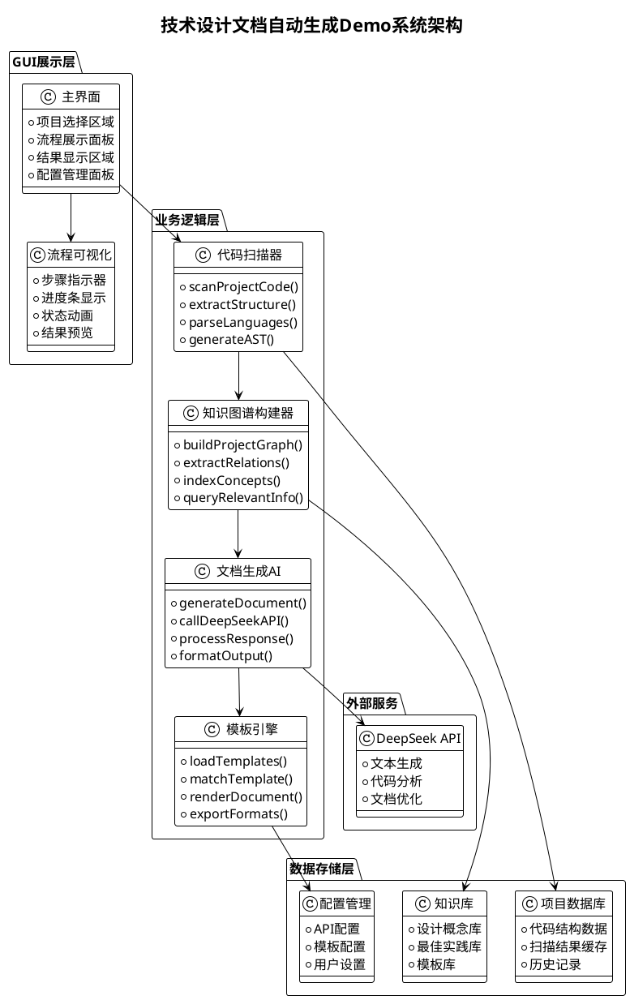

# 技术设计文档自动生成GUI Demo - 产品需求文档(PRD)

## 📋 项目概述

### 🎯 项目目标
创建一个基于Python的GUI演示应用，完整展示技术设计文档AI自动生成的核心流程，涵盖代码扫描、知识图谱构建、文档生成等关键环节，使用DeepSeek大模型提供AI能力支持。

### 🔍 项目背景
基于《AI赋能软件设计具体工作场景详解》文档中的"技术设计文档AI自动生成流程"时序图，构建一个可视化、可交互的Demo系统，用于教学演示和概念验证。

### 📊 成功标准
- ✅ 完整实现时序图中的5个核心组件
- ✅ 提供直观的GUI界面展示整个流程
- ✅ 集成DeepSeek API实现真实的AI文档生成
- ✅ 支持多种编程语言的代码扫描
- ✅ 生成符合企业标准的技术文档

## 🏗️ 系统架构设计

### 📐 整体架构图



### 🎨 技术栈选择

#### 前端GUI框架
- **主框架**: PyQt5/PySide2
  - 理由：跨平台支持，丰富的控件库，良好的中文支持
  - 替代方案：Tkinter（简单但功能有限）、Kivy（偏移动端）

#### 后端核心技术
- **编程语言**: Python 3.9+
- **代码解析**: 
  - AST (抽象语法树) - Python内置
  - Tree-sitter - 多语言支持
  - Pygments - 语法高亮
- **知识图谱**:
  - NetworkX - 图结构处理
  - Neo4j Embedded - 可选的图数据库
- **AI集成**:
  - OpenAI API规范接口适配DeepSeek
  - Requests - HTTP请求处理
- **模板引擎**:
  - Jinja2 - 模板渲染
  - Markdown - 文档格式化
  - ReportLab - PDF生成

#### 数据存储
- **本地数据库**: SQLite
- **配置存储**: JSON/YAML
- **缓存管理**: Redis（可选）

## 🔧 核心功能设计

### 1️⃣ 代码扫描器 (CodeScanner)

#### 功能描述
扫描项目代码，提取结构化信息，支持多种编程语言解析。

#### 核心能力
- **多语言支持**: Python, Java, C#, JavaScript, TypeScript
- **结构提取**: 类、方法、接口、模块关系
- **元数据收集**: 注释、文档字符串、类型注解
- **依赖分析**: import/include关系、外部库依赖

#### 技术实现要点

```python
class CodeScanner:
    def __init__(self):
        self.parsers = {
            'python': PythonParser(),
            'java': JavaParser(),
            'csharp': CSharpParser(),
            'javascript': JavaScriptParser(),
        }
        
    def scan_project(self, project_path):
        """扫描项目代码结构"""
        project_data = {
            'files': [],
            'structure': {},
            'dependencies': {},
            'metadata': {}
        }
        
        # 遍历项目文件
        for root, dirs, files in os.walk(project_path):
            for file in files:
                if self._is_source_file(file):
                    file_path = os.path.join(root, file)
                    file_data = self._parse_file(file_path)
                    project_data['files'].append(file_data)
                    
        return project_data
        
    def _parse_file(self, file_path):
        """解析单个源码文件"""
        lang = self._detect_language(file_path)
        parser = self.parsers.get(lang)
        
        if parser:
            return parser.parse(file_path)
        else:
            return self._generic_parse(file_path)
```

#### GUI展示设计
- **文件树显示**: 项目结构可视化
- **解析进度条**: 实时显示扫描进度
- **结果预览**: 提取的结构化数据展示
- **过滤选项**: 按文件类型、大小过滤

### 2️⃣ 知识图谱构建器 (KnowledgeGraphBuilder)

#### 功能描述
基于代码扫描结果构建项目知识图谱，建立概念间的关联关系。

#### 核心能力
- **概念提取**: 从代码中提取业务概念、技术概念
- **关系建模**: 继承、依赖、调用、关联等关系
- **语义分析**: 基于命名、注释进行语义理解
- **图谱查询**: 支持复杂的图谱查询操作

#### 技术实现要点

```python
import networkx as nx
from collections import defaultdict

class KnowledgeGraphBuilder:
    def __init__(self):
        self.graph = nx.DiGraph()
        self.concept_extractor = ConceptExtractor()
        
    def build_knowledge_graph(self, project_data):
        """构建项目知识图谱"""
        # 1. 提取概念节点
        concepts = self._extract_concepts(project_data)
        
        # 2. 建立关系边
        relations = self._extract_relations(project_data, concepts)
        
        # 3. 构建图结构
        for concept in concepts:
            self.graph.add_node(concept['id'], **concept['attributes'])
            
        for relation in relations:
            self.graph.add_edge(
                relation['source'], 
                relation['target'], 
                **relation['attributes']
            )
            
        return self.graph
        
    def _extract_concepts(self, project_data):
        """提取项目概念"""
        concepts = []
        
        for file_data in project_data['files']:
            # 提取类概念
            for class_info in file_data.get('classes', []):
                concept = {
                    'id': f"class_{class_info['name']}",
                    'type': 'class',
                    'name': class_info['name'],
                    'attributes': {
                        'file': file_data['path'],
                        'methods': class_info.get('methods', []),
                        'description': class_info.get('docstring', '')
                    }
                }
                concepts.append(concept)
                
            # 提取方法概念
            for method_info in file_data.get('methods', []):
                concept = {
                    'id': f"method_{method_info['name']}",
                    'type': 'method',
                    'name': method_info['name'],
                    'attributes': {
                        'parameters': method_info.get('parameters', []),
                        'return_type': method_info.get('return_type', ''),
                        'description': method_info.get('docstring', '')
                    }
                }
                concepts.append(concept)
                
        return concepts
        
    def query_related_concepts(self, concept_id, max_depth=2):
        """查询相关概念"""
        related = []
        
        # BFS查找相关节点
        visited = set()
        queue = [(concept_id, 0)]
        
        while queue:
            current_id, depth = queue.pop(0)
            
            if current_id in visited or depth > max_depth:
                continue
                
            visited.add(current_id)
            related.append(self.graph.nodes[current_id])
            
            # 添加邻居节点
            for neighbor in self.graph.neighbors(current_id):
                if neighbor not in visited:
                    queue.append((neighbor, depth + 1))
                    
        return related
```

#### GUI展示设计
- **图谱可视化**: 使用matplotlib/plotly展示知识图谱
- **节点详情面板**: 点击节点显示详细信息
- **关系筛选**: 按关系类型过滤显示
- **搜索功能**: 概念名称模糊搜索

### 3️⃣ 文档生成AI (DocumentAI)

#### 功能描述
调用DeepSeek API，基于知识图谱信息生成技术设计文档。

#### 核心能力
- **智能文档生成**: 基于项目结构生成完整技术文档
- **多模板支持**: 架构设计、API文档、数据库设计等
- **上下文理解**: 结合知识图谱提供准确的上下文信息
- **增量更新**: 支持文档的增量更新和版本管理

#### 技术实现要点

```python
import openai
import json
from typing import Dict, List, Any

class DocumentAI:
    def __init__(self, api_key: str, base_url: str = None):
        # 配置DeepSeek API
        openai.api_key = api_key
        if base_url:
            openai.api_base = base_url
            
        self.templates = self._load_templates()
        
    def generate_document(self, 
                         project_data: Dict, 
                         knowledge_graph: nx.DiGraph,
                         doc_type: str = "architecture") -> str:
        """生成技术设计文档"""
        
        # 1. 构建上下文信息
        context = self._build_context(project_data, knowledge_graph)
        
        # 2. 选择合适的模板
        template = self.templates.get(doc_type, self.templates['default'])
        
        # 3. 构建提示词
        prompt = self._build_prompt(context, template)
        
        # 4. 调用DeepSeek API
        response = self._call_deepseek_api(prompt)
        
        # 5. 后处理和格式化
        document = self._post_process(response, template)
        
        return document
        
    def _build_context(self, project_data: Dict, graph: nx.DiGraph) -> Dict:
        """构建文档生成的上下文信息"""
        context = {
            'project_info': {
                'name': project_data.get('name', 'Unknown Project'),
                'description': project_data.get('description', ''),
                'languages': project_data.get('languages', []),
                'file_count': len(project_data.get('files', [])),
            },
            'architecture': {
                'layers': self._identify_layers(project_data),
                'components': self._extract_components(graph),
                'dependencies': self._analyze_dependencies(graph),
            },
            'key_concepts': self._extract_key_concepts(graph),
            'design_patterns': self._identify_patterns(project_data),
        }
        return context
        
    def _build_prompt(self, context: Dict, template: Dict) -> str:
        """构建DeepSeek API的提示词"""
        system_prompt = template['system_prompt']
        
        user_prompt = f"""
        基于以下项目信息生成{template['doc_type']}：

        ## 项目概况
        - 项目名称：{context['project_info']['name']}
        - 编程语言：{', '.join(context['project_info']['languages'])}
        - 文件数量：{context['project_info']['file_count']}

        ## 架构信息
        - 分层结构：{json.dumps(context['architecture']['layers'], ensure_ascii=False, indent=2)}
        - 核心组件：{json.dumps(context['architecture']['components'][:10], ensure_ascii=False, indent=2)}

        ## 关键概念
        {json.dumps(context['key_concepts'][:20], ensure_ascii=False, indent=2)}

        请生成结构清晰、内容详实的技术设计文档，包含以下章节：
        {template['required_sections']}
        """
        
        return user_prompt
        
    def _call_deepseek_api(self, prompt: str) -> str:
        """调用DeepSeek API生成文档"""
        try:
            response = openai.ChatCompletion.create(
                model="deepseek-chat",
                messages=[
                    {"role": "system", "content": "你是一个专业的软件架构师和技术文档专家，擅长生成高质量的技术设计文档。"},
                    {"role": "user", "content": prompt}
                ],
                max_tokens=4000,
                temperature=0.3,
                stream=False
            )
            
            return response.choices[0].message.content
            
        except Exception as e:
            print(f"DeepSeek API调用失败: {e}")
            return self._generate_fallback_document()
            
    def _generate_fallback_document(self) -> str:
        """API调用失败时的降级方案"""
        return """
        # 技术设计文档 (Demo模式)
        
        > 注：当前为Demo模式，未连接真实AI服务
        
        ## 1. 系统概述
        这是一个自动生成的技术设计文档示例。
        
        ## 2. 架构设计
        系统采用分层架构模式...
        
        ## 3. 核心组件
        - 数据访问层
        - 业务逻辑层
        - 表现层
        
        ## 4. 接口设计
        系统对外提供RESTful API接口...
        """
```

#### GUI展示设计
- **生成进度指示**: 实时显示AI文档生成进度
- **文档预览**: Markdown/HTML格式的文档预览
- **编辑器**: 支持生成后的文档编辑
- **导出选项**: 支持导出为PDF、Word、HTML等格式

### 4️⃣ 模板引擎 (TemplateEngine)

#### 功能描述
管理文档模板，提供模板匹配和渲染功能。

#### 核心能力
- **多模板管理**: 架构文档、API文档、数据库设计等模板
- **智能匹配**: 根据项目特征自动匹配最适合的模板
- **定制化渲染**: 支持模板的参数化定制
- **格式转换**: 支持多种输出格式

#### 技术实现要点

```python
from jinja2 import Environment, FileSystemLoader
import markdown
from weasyprint import HTML
import yaml

class TemplateEngine:
    def __init__(self, template_dir: str):
        self.env = Environment(loader=FileSystemLoader(template_dir))
        self.templates = self._load_template_configs()
        
    def _load_template_configs(self) -> Dict:
        """加载模板配置"""
        templates = {}
        template_config_path = os.path.join(self.template_dir, "templates.yaml")
        
        if os.path.exists(template_config_path):
            with open(template_config_path, 'r', encoding='utf-8') as f:
                templates = yaml.safe_load(f)
                
        return templates
        
    def match_template(self, project_data: Dict) -> str:
        """智能匹配最适合的模板"""
        # 基于项目特征匹配模板
        languages = project_data.get('languages', [])
        file_count = len(project_data.get('files', []))
        has_database = self._has_database_components(project_data)
        has_api = self._has_api_components(project_data)
        
        # 匹配逻辑
        if has_api and has_database:
            return "full_stack_template"
        elif has_api:
            return "api_service_template"
        elif has_database:
            return "data_service_template"
        elif file_count > 50:
            return "large_project_template"
        else:
            return "standard_template"
            
    def render_document(self, 
                       template_name: str, 
                       context: Dict,
                       output_format: str = "markdown") -> str:
        """渲染文档"""
        template = self.env.get_template(f"{template_name}.md.j2")
        markdown_content = template.render(**context)
        
        if output_format == "markdown":
            return markdown_content
        elif output_format == "html":
            return markdown.markdown(markdown_content, extensions=['tables', 'toc'])
        elif output_format == "pdf":
            html_content = markdown.markdown(markdown_content)
            return self._convert_to_pdf(html_content)
        else:
            return markdown_content
            
    def _convert_to_pdf(self, html_content: str) -> bytes:
        """转换为PDF格式"""
        html_doc = HTML(string=html_content)
        return html_doc.write_pdf()
```

#### GUI展示设计
- **模板选择器**: 下拉列表选择文档模板
- **模板预览**: 显示模板的样例效果
- **参数配置**: 模板参数的可视化配置
- **实时预览**: 参数修改后的实时预览效果

### 5️⃣ 流程可视化组件

#### 功能描述
提供整个文档生成流程的可视化展示，增强用户体验。

#### 技术实现要点

```python
from PyQt5.QtWidgets import *
from PyQt5.QtCore import *
from PyQt5.QtGui import *

class ProcessVisualizer(QWidget):
    def __init__(self):
        super().__init__()
        self.steps = [
            "项目代码扫描",
            "知识图谱构建", 
            "AI文档生成",
            "模板匹配渲染",
            "文档输出完成"
        ]
        self.current_step = 0
        self.init_ui()
        
    def init_ui(self):
        layout = QHBoxLayout()
        
        for i, step in enumerate(self.steps):
            step_widget = self.create_step_widget(i, step)
            layout.addWidget(step_widget)
            
            # 添加箭头（除了最后一步）
            if i < len(self.steps) - 1:
                arrow = self.create_arrow()
                layout.addWidget(arrow)
                
        self.setLayout(layout)
        
    def create_step_widget(self, index: int, title: str) -> QWidget:
        widget = QFrame()
        widget.setFixedSize(120, 80)
        widget.setStyleSheet("""
            QFrame {
                border: 2px solid #ddd;
                border-radius: 8px;
                background-color: #f9f9f9;
            }
        """)
        
        layout = QVBoxLayout()
        
        # 步骤号
        number_label = QLabel(str(index + 1))
        number_label.setAlignment(Qt.AlignCenter)
        number_label.setStyleSheet("font-size: 18px; font-weight: bold;")
        
        # 步骤标题
        title_label = QLabel(title)
        title_label.setAlignment(Qt.AlignCenter)
        title_label.setWordWrap(True)
        title_label.setStyleSheet("font-size: 10px;")
        
        layout.addWidget(number_label)
        layout.addWidget(title_label)
        widget.setLayout(layout)
        
        return widget
        
    def update_current_step(self, step_index: int):
        """更新当前进行的步骤"""
        self.current_step = step_index
        self.update()
```

## 📊 数据模型设计

### 项目数据模型

```python
from dataclasses import dataclass
from typing import List, Dict, Optional
from datetime import datetime

@dataclass
class FileInfo:
    path: str
    language: str
    size: int
    classes: List[Dict]
    methods: List[Dict]
    imports: List[str]
    docstrings: List[str]
    
@dataclass
class ProjectInfo:
    name: str
    path: str
    description: Optional[str]
    files: List[FileInfo]
    dependencies: Dict[str, str]
    created_at: datetime
    scanned_at: Optional[datetime]
    
@dataclass
class KnowledgeNode:
    id: str
    type: str  # class, method, interface, etc.
    name: str
    attributes: Dict
    relations: List[Dict]
    
@dataclass
class GeneratedDocument:
    id: str
    project_id: str
    template_name: str
    content: str
    format: str  # markdown, html, pdf
    generated_at: datetime
    ai_model: str
    version: str
```

### 数据库设计

```sql
-- 项目表
CREATE TABLE projects (
    id INTEGER PRIMARY KEY AUTOINCREMENT,
    name TEXT NOT NULL,
    path TEXT UNIQUE NOT NULL,
    description TEXT,
    created_at TIMESTAMP DEFAULT CURRENT_TIMESTAMP,
    updated_at TIMESTAMP DEFAULT CURRENT_TIMESTAMP
);

-- 文件表
CREATE TABLE files (
    id INTEGER PRIMARY KEY AUTOINCREMENT,
    project_id INTEGER REFERENCES projects(id),
    path TEXT NOT NULL,
    language TEXT,
    size INTEGER,
    hash TEXT,
    scanned_at TIMESTAMP DEFAULT CURRENT_TIMESTAMP
);

-- 知识节点表
CREATE TABLE knowledge_nodes (
    id INTEGER PRIMARY KEY AUTOINCREMENT,
    project_id INTEGER REFERENCES projects(id),
    node_id TEXT UNIQUE NOT NULL,
    type TEXT NOT NULL,
    name TEXT NOT NULL,
    attributes TEXT, -- JSON格式
    created_at TIMESTAMP DEFAULT CURRENT_TIMESTAMP
);

-- 关系表
CREATE TABLE relations (
    id INTEGER PRIMARY KEY AUTOINCREMENT,
    source_node_id TEXT REFERENCES knowledge_nodes(node_id),
    target_node_id TEXT REFERENCES knowledge_nodes(node_id),
    relation_type TEXT NOT NULL,
    attributes TEXT -- JSON格式
);

-- 生成的文档表
CREATE TABLE generated_documents (
    id INTEGER PRIMARY KEY AUTOINCREMENT,
    project_id INTEGER REFERENCES projects(id),
    template_name TEXT NOT NULL,
    content TEXT NOT NULL,
    format TEXT NOT NULL,
    ai_model TEXT,
    generated_at TIMESTAMP DEFAULT CURRENT_TIMESTAMP
);
```

## 🎨 界面设计

### 主界面布局

```
┌─────────────────────────────────────────────────────────────────┐
│                        菜单栏                                   │
├─────────────────────────────────────────────────────────────────┤
│ 项目选择区域                     │ 配置面板                     │
│ ┌─────────────────────────────┐ │ ┌─────────────────────────────┐│
│ │ 📁 选择项目文件夹           │ │ │ DeepSeek API配置           ││
│ │ 📋 项目信息预览             │ │ │ 模板选择                    ││
│ │ 🔍 支持的语言列表           │ │ │ 输出格式设置                ││
│ └─────────────────────────────┘ │ └─────────────────────────────┘│
├─────────────────────────────────────────────────────────────────┤
│                        流程可视化区域                            │
│ 📊 步骤指示器 → 进度条 → 状态动画 → 完成指示                   │
├─────────────────────────────────────────────────────────────────┤
│ 结果展示区域 (标签页)                                          │
│ ┌─────────────────────────────────────────────────────────────┐ │
│ │ [代码结构] [知识图谱] [生成文档] [日志输出]               │ │
│ │                                                             │ │
│ │                     内容显示区域                            │ │
│ │                                                             │ │
│ └─────────────────────────────────────────────────────────────┘ │
├─────────────────────────────────────────────────────────────────┤
│ [开始生成] [暂停] [重置] [导出] [关于]     状态栏              │
└─────────────────────────────────────────────────────────────────┘
```

### GUI实现代码框架

```python
import sys
from PyQt5.QtWidgets import *
from PyQt5.QtCore import *
from PyQt5.QtGui import *

class MainWindow(QMainWindow):
    def __init__(self):
        super().__init__()
        self.setWindowTitle("技术设计文档AI生成器 - Demo")
        self.setGeometry(100, 100, 1200, 800)
        
        # 初始化组件
        self.code_scanner = CodeScanner()
        self.kg_builder = KnowledgeGraphBuilder()
        self.doc_ai = DocumentAI()
        self.template_engine = TemplateEngine("templates/")
        
        self.init_ui()
        
    def init_ui(self):
        central_widget = QWidget()
        self.setCentralWidget(central_widget)
        
        # 主布局
        main_layout = QVBoxLayout()
        
        # 顶部区域：项目选择和配置
        top_layout = QHBoxLayout()
        top_layout.addWidget(self.create_project_panel())
        top_layout.addWidget(self.create_config_panel())
        main_layout.addLayout(top_layout)
        
        # 流程可视化
        self.process_visualizer = ProcessVisualizer()
        main_layout.addWidget(self.process_visualizer)
        
        # 结果展示区域
        self.result_tabs = QTabWidget()
        self.create_result_tabs()
        main_layout.addWidget(self.result_tabs)
        
        # 底部控制区域
        bottom_layout = QHBoxLayout()
        bottom_layout.addWidget(self.create_control_panel())
        bottom_layout.addStretch()
        bottom_layout.addWidget(self.create_status_panel())
        main_layout.addLayout(bottom_layout)
        
        central_widget.setLayout(main_layout)
        
    def create_project_panel(self) -> QGroupBox:
        """创建项目选择面板"""
        group = QGroupBox("项目信息")
        layout = QVBoxLayout()
        
        # 文件夹选择
        folder_layout = QHBoxLayout()
        self.folder_path_edit = QLineEdit()
        self.folder_path_edit.setPlaceholderText("选择要分析的项目文件夹...")
        folder_btn = QPushButton("浏览")
        folder_btn.clicked.connect(self.select_project_folder)
        
        folder_layout.addWidget(self.folder_path_edit)
        folder_layout.addWidget(folder_btn)
        layout.addLayout(folder_layout)
        
        # 项目信息显示
        self.project_info_text = QTextEdit()
        self.project_info_text.setMaximumHeight(100)
        self.project_info_text.setPlaceholderText("项目信息将在这里显示...")
        layout.addWidget(self.project_info_text)
        
        group.setLayout(layout)
        return group
        
    def create_config_panel(self) -> QGroupBox:
        """创建配置面板"""
        group = QGroupBox("配置设置")
        layout = QFormLayout()
        
        # API配置
        self.api_key_edit = QLineEdit()
        self.api_key_edit.setEchoMode(QLineEdit.Password)
        self.api_key_edit.setPlaceholderText("输入DeepSeek API Key...")
        layout.addRow("API Key:", self.api_key_edit)
        
        # 模板选择
        self.template_combo = QComboBox()
        self.template_combo.addItems([
            "标准架构文档",
            "API接口文档", 
            "数据库设计文档",
            "全栈项目文档"
        ])
        layout.addRow("文档模板:", self.template_combo)
        
        # 输出格式
        self.format_combo = QComboBox()
        self.format_combo.addItems(["Markdown", "HTML", "PDF"])
        layout.addRow("输出格式:", self.format_combo)
        
        group.setLayout(layout)
        return group
        
    def create_result_tabs(self):
        """创建结果展示标签页"""
        # 代码结构标签页
        self.code_structure_text = QTextEdit()
        self.result_tabs.addTab(self.code_structure_text, "代码结构")
        
        # 知识图谱标签页
        self.kg_widget = KnowledgeGraphWidget()
        self.result_tabs.addTab(self.kg_widget, "知识图谱")
        
        # 生成文档标签页
        self.document_text = QTextEdit()
        self.result_tabs.addTab(self.document_text, "生成文档")
        
        # 日志输出标签页
        self.log_text = QTextEdit()
        self.log_text.setMaximumHeight(200)
        self.result_tabs.addTab(self.log_text, "日志输出")
        
    def create_control_panel(self) -> QWidget:
        """创建控制面板"""
        widget = QWidget()
        layout = QHBoxLayout()
        
        self.start_btn = QPushButton("开始生成")
        self.start_btn.setStyleSheet("""
            QPushButton {
                background-color: #4CAF50;
                color: white;
                border: none;
                padding: 8px 16px;
                border-radius: 4px;
                font-weight: bold;
            }
            QPushButton:hover {
                background-color: #45a049;
            }
        """)
        self.start_btn.clicked.connect(self.start_generation)
        
        self.pause_btn = QPushButton("暂停")
        self.pause_btn.setEnabled(False)
        
        self.reset_btn = QPushButton("重置")
        self.reset_btn.clicked.connect(self.reset_all)
        
        self.export_btn = QPushButton("导出")
        self.export_btn.setEnabled(False)
        self.export_btn.clicked.connect(self.export_document)
        
        layout.addWidget(self.start_btn)
        layout.addWidget(self.pause_btn)
        layout.addWidget(self.reset_btn)
        layout.addWidget(self.export_btn)
        
        widget.setLayout(layout)
        return widget
        
    def start_generation(self):
        """开始生成流程"""
        if not self.validate_inputs():
            return
            
        # 创建工作线程
        self.worker_thread = DocumentGenerationWorker(
            project_path=self.folder_path_edit.text(),
            api_key=self.api_key_edit.text(),
            template=self.template_combo.currentText(),
            output_format=self.format_combo.currentText()
        )
        
        # 连接信号
        self.worker_thread.step_completed.connect(self.on_step_completed)
        self.worker_thread.generation_finished.connect(self.on_generation_finished)
        self.worker_thread.error_occurred.connect(self.on_error_occurred)
        
        # 开始执行
        self.worker_thread.start()
        self.start_btn.setEnabled(False)
        self.pause_btn.setEnabled(True)
```

## 🧵 多线程处理

### 工作线程设计

```python
class DocumentGenerationWorker(QThread):
    step_completed = pyqtSignal(int, str, object)  # 步骤索引, 描述, 结果数据
    generation_finished = pyqtSignal(str)  # 最终生成的文档
    error_occurred = pyqtSignal(str)  # 错误信息
    progress_updated = pyqtSignal(int)  # 进度百分比
    
    def __init__(self, project_path, api_key, template, output_format):
        super().__init__()
        self.project_path = project_path
        self.api_key = api_key
        self.template = template
        self.output_format = output_format
        
    def run(self):
        """执行文档生成的完整流程"""
        try:
            # 步骤1: 代码扫描
            self.progress_updated.emit(10)
            scanner = CodeScanner()
            project_data = scanner.scan_project(self.project_path)
            self.step_completed.emit(0, "代码扫描完成", project_data)
            
            # 步骤2: 知识图谱构建
            self.progress_updated.emit(30)
            kg_builder = KnowledgeGraphBuilder()
            knowledge_graph = kg_builder.build_knowledge_graph(project_data)
            self.step_completed.emit(1, "知识图谱构建完成", knowledge_graph)
            
            # 步骤3: AI文档生成
            self.progress_updated.emit(60)
            doc_ai = DocumentAI(self.api_key)
            raw_document = doc_ai.generate_document(
                project_data, 
                knowledge_graph, 
                self.template
            )
            self.step_completed.emit(2, "AI文档生成完成", raw_document)
            
            # 步骤4: 模板渲染
            self.progress_updated.emit(80)
            template_engine = TemplateEngine("templates/")
            final_document = template_engine.render_document(
                self.template, 
                {"content": raw_document},
                self.output_format
            )
            self.step_completed.emit(3, "模板渲染完成", final_document)
            
            # 步骤5: 完成
            self.progress_updated.emit(100)
            self.generation_finished.emit(final_document)
            
        except Exception as e:
            self.error_occurred.emit(str(e))
```

## 🚀 部署和运行

### 环境配置

```yaml
# requirements.txt
PyQt5==5.15.7
openai==1.3.0
networkx==3.1
jinja2==3.1.2
markdown==3.5.1
weasyprint==59.0
pygments==2.16.1
tree-sitter==0.20.1
pyyaml==6.0.1
requests==2.31.0
matplotlib==3.7.1
plotly==5.17.0
```

### 项目结构

```
demo/
├── main.py                 # 主程序入口
├── requirements.txt        # 依赖包列表
├── config/
│   ├── config.yaml        # 配置文件
│   └── api_keys.yaml      # API密钥配置
├── src/
│   ├── gui/
│   │   ├── main_window.py
│   │   ├── process_visualizer.py
│   │   └── knowledge_graph_widget.py
│   ├── core/
│   │   ├── code_scanner.py
│   │   ├── knowledge_graph_builder.py
│   │   ├── document_ai.py
│   │   └── template_engine.py
│   ├── models/
│   │   ├── project_model.py
│   │   └── document_model.py
│   └── utils/
│       ├── file_utils.py
│       └── api_utils.py
├── templates/
│   ├── architecture.md.j2
│   ├── api_doc.md.j2
│   └── database.md.j2
├── data/
│   └── demo.db            # SQLite数据库
├── assets/
│   ├── icons/
│   └── styles/
└── tests/
    ├── test_code_scanner.py
    ├── test_kg_builder.py
    └── test_document_ai.py
```

### 启动脚本

```python
# main.py
import sys
import os
import logging
from PyQt5.QtWidgets import QApplication
from PyQt5.QtCore import QDir

# 添加src目录到Python路径
sys.path.append(os.path.join(os.path.dirname(__file__), 'src'))

from gui.main_window import MainWindow

def setup_logging():
    """设置日志配置"""
    logging.basicConfig(
        level=logging.INFO,
        format='%(asctime)s - %(name)s - %(levelname)s - %(message)s',
        handlers=[
            logging.FileHandler('app.log', encoding='utf-8'),
            logging.StreamHandler()
        ]
    )

def main():
    """主程序入口"""
    setup_logging()
    
    app = QApplication(sys.argv)
    app.setApplicationName("技术设计文档AI生成器")
    app.setApplicationVersion("1.0.0")
    
    # 设置应用图标和样式
    app.setWindowIcon(QIcon('assets/icons/app_icon.png'))
    
    # 创建主窗口
    main_window = MainWindow()
    main_window.show()
    
    # 运行应用
    sys.exit(app.exec_())

if __name__ == '__main__':
    main()
```

## 📝 配置文件设计

### config.yaml
```yaml
# 应用配置
app:
  name: "技术设计文档AI生成器"
  version: "1.0.0"
  debug: true

# DeepSeek API配置
deepseek:
  base_url: "https://api.deepseek.com"
  model: "deepseek-chat"
  max_tokens: 4000
  temperature: 0.3
  timeout: 30

# 代码扫描配置
scanner:
  supported_languages:
    - python
    - java
    - javascript
    - typescript
    - csharp
  max_file_size: 1048576  # 1MB
  ignore_patterns:
    - "*.pyc"
    - "*.class"
    - "node_modules/*"
    - "*.log"

# 知识图谱配置
knowledge_graph:
  max_nodes: 1000
  max_relations: 5000
  clustering_algorithm: "louvain"

# 文档模板配置
templates:
  default_template: "architecture"
  output_formats:
    - markdown
    - html
    - pdf
  template_dir: "templates/"

# 数据库配置
database:
  type: "sqlite"
  path: "data/demo.db"
  pool_size: 10
```

## ✅ 验收标准

### 功能验收标准

1. **代码扫描功能**
   - ✅ 支持Python、Java、JavaScript等主流语言
   - ✅ 能够提取类、方法、接口等代码结构
   - ✅ 正确识别依赖关系和导入关系
   - ✅ 扫描进度实时显示

2. **知识图谱构建**
   - ✅ 能够基于代码结构构建图谱
   - ✅ 节点和关系信息完整准确
   - ✅ 支持图谱的可视化展示
   - ✅ 提供图谱查询和筛选功能

3. **AI文档生成**
   - ✅ 成功集成DeepSeek API
   - ✅ 生成的文档结构清晰完整
   - ✅ 支持多种文档类型和模板
   - ✅ 处理API调用失败的降级方案

4. **模板引擎**
   - ✅ 支持多种文档模板
   - ✅ 模板渲染正确无误
   - ✅ 支持多种输出格式
   - ✅ 模板参数化配置

5. **用户界面**
   - ✅ 界面布局合理，操作直观
   - ✅ 流程可视化清晰易懂
   - ✅ 多线程处理，界面响应流畅
   - ✅ 错误处理和用户反馈完善

### 性能验收标准

1. **响应时间**
   - 代码扫描：< 30秒（1000个文件）
   - 知识图谱构建：< 10秒
   - AI文档生成：< 60秒
   - 模板渲染：< 5秒

2. **资源消耗**
   - 内存占用：< 512MB
   - CPU占用：< 50%（峰值）
   - 磁盘空间：< 100MB

3. **稳定性**
   - 连续运行2小时无崩溃
   - 处理异常输入不崩溃
   - API调用失败能够优雅降级

## 🔮 后续扩展计划

### 短期扩展（1-2个月）
1. **增强代码分析能力**
   - 支持更多编程语言
   - 代码质量分析和建议
   - 设计模式识别

2. **优化知识图谱**
   - 语义相似度计算
   - 自动聚类和分类
   - 图谱导入导出

3. **文档模板增强**
   - 更多专业模板
   - 模板编辑器
   - 用户自定义模板

### 中期扩展（3-6个月）
1. **多项目支持**
   - 项目对比分析
   - 跨项目知识图谱
   - 项目演化追踪

2. **协作功能**
   - 多用户支持
   - 文档版本管理
   - 评论和审核

3. **集成能力**
   - IDE插件开发
   - CI/CD集成
   - 云端部署版本

### 长期扩展（6-12个月）
1. **智能化增强**
   - 自定义AI模型训练
   - 个性化推荐
   - 自动化工作流

2. **企业级功能**
   - 权限管理
   - 审计日志
   - 性能监控

## 📊 成本效益分析

### 开发成本估算
- **人力成本**: 1人 × 1个月 = 约2万元
- **硬件成本**: 开发设备 = 约0.5万元
- **软件成本**: API调用费用 = 约0.2万元/月
- **总成本**: 约2.7万元

### 预期收益
- **教学演示价值**: 直观展示AI赋能软件设计的完整流程
- **概念验证价值**: 验证技术方案的可行性
- **技术积累价值**: 为后续产品化奠定基础
- **市场推广价值**: 作为技术能力展示的重要工具

### ROI分析
预期该Demo将为AI赋能软件设计解决方案的推广和商业化提供强有力支撑，间接价值远超直接开发成本。

---

## 📋 总结

本PRD文档详细规划了技术设计文档自动生成GUI Demo的完整实现方案，涵盖了：

- **完整的技术架构设计**：分层架构、核心组件、数据模型
- **详细的功能设计**：5个核心组件的具体实现方案
- **清晰的界面设计**：用户友好的GUI布局和交互流程
- **可靠的技术实现**：基于成熟技术栈的稳定方案
- **完善的质量保障**：多维度的验收标准和测试方案

该Demo将作为AI赋能软件设计理念的最佳实践展示，为后续的产品化和商业推广提供坚实基础。🚀
